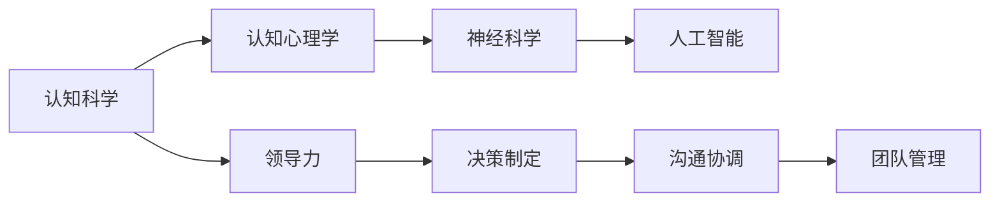

                 

# 认知科学在领导力发展中的应用

## 1. 背景介绍

### 1.1 问题由来
在数字化、信息化、全球化迅猛发展的今天，企业面临着更为复杂多变的外部环境。领导力作为企业的核心竞争力，其重要性日益凸显。然而，在快速变化的环境中，许多管理者感到能力匮乏，难以有效地应对和领导团队。认知科学作为一个跨学科领域，结合心理学、神经科学、人工智能等，为理解和管理大脑提供了一个全新的视角。本文将探讨认知科学在领导力发展中的应用，以期帮助管理者提升自身能力，更有效地领导团队。

### 1.2 问题核心关键点
认知科学在领导力发展中的应用，旨在通过理解人类认知机制，优化领导行为。具体而言，包括：
- 认知模型：使用认知心理学原理构建的领导者行为模型。
- 神经基础：探索领导行为的神经机制。
- 人工智能：结合人工智能技术，提高领导力的可量化和可操作性。

## 2. 核心概念与联系

### 2.1 核心概念概述
认知科学是研究人类认知过程及其应用的一门跨学科科学，包括认知心理学、神经科学、人工智能等领域。领导力是指领导者指导、激励和协调组织成员，以实现组织目标的能力。认知科学与领导力之间的联系在于，认知过程和机制在很大程度上影响着领导者的决策、沟通和团队管理能力。

### 2.2 核心概念原理和架构的 Mermaid 流程图(Mermaid 流程节点中不要有括号、逗号等特殊字符)


### 2.3 核心概念之间的逻辑关系
1. **认知心理学**：研究认知过程，如注意力、记忆、思维等，解释决策和行为背后的心理机制。
2. **神经科学**：研究大脑结构和功能，解释认知过程的生理基础。
3. **人工智能**：模拟人类认知过程，提供可量化的领导力评估和提升工具。
4. **领导力**：结合认知科学与人工智能，实现可操作的领导力提升。

## 3. 核心算法原理 & 具体操作步骤
### 3.1 算法原理概述
认知科学在领导力发展中的应用，基于以下几个关键原理：

1. **认知模型构建**：使用认知心理学原理构建领导行为模型，描述领导者的决策制定、沟通协调和团队管理过程。
2. **神经基础探索**：通过神经科学研究领导行为的大脑机制，发现关键神经回路和脑区。
3. **AI辅助决策**：结合人工智能技术，提供基于认知模型的决策支持系统，优化领导者的决策制定过程。
4. **反馈机制**：建立反馈机制，评估领导行为，提供持续改进建议。

### 3.2 算法步骤详解
1. **模型构建**：
   - 定义领导行为模型，如自上而下决策模型、信息加工模型等。
   - 确定模型参数，如决策偏好、认知负荷等。
2. **神经研究**：
   - 使用功能磁共振成像(fMRI)等技术，研究领导决策时的脑区激活情况。
   - 分析神经回路和关键脑区。
3. **AI辅助决策**：
   - 使用机器学习算法，构建决策支持系统，提供基于认知模型的建议。
   - 通过自然语言处理(NLP)技术，分析领导者的决策语义。
4. **反馈优化**：
   - 收集团队反馈，评估领导行为。
   - 根据反馈调整模型参数，优化领导行为。

### 3.3 算法优缺点
**优点**：
- 理论基础扎实：结合认知心理学和神经科学，提供了坚实的理论支撑。
- 可量化可操作：使用AI技术，实现了领导力提升的可量化和可操作性。
- 反馈机制完善：通过反馈评估和优化，持续改进领导力。

**缺点**：
- 数据获取难度大：神经研究需要大量高精度的实验数据。
- 模型复杂度高：认知模型和神经回路分析需要高度专业化的知识。
- 技术依赖性强：AI技术的实现需要高水平的技术支持。

### 3.4 算法应用领域
认知科学在领导力发展中的应用，主要应用于以下几个领域：
- 企业领导培训：帮助领导者提升决策、沟通、团队管理等核心能力。
- 管理咨询：为企业管理层提供基于认知科学的决策支持和建议。
- 教育培训：开发认知科学的领导力课程，培养未来的领导者。
- 组织行为研究：研究认知科学与领导力的关系，发现新的领导行为规律。

## 4. 数学模型和公式 & 详细讲解 & 举例说明

### 4.1 数学模型构建
假设领导行为模型为：

$$
L = f(D, C, T)
$$

其中 $L$ 为领导行为，$D$ 为决策制定过程，$C$ 为沟通协调过程，$T$ 为团队管理过程。每个过程可以进一步分解为多个子过程，如 $D = (A, I, O)$，其中 $A$ 为注意力分配，$I$ 为信息处理，$O$ 为输出决策。

### 4.2 公式推导过程
以决策制定过程为例，假设 $A = \alpha D^T$，其中 $D$ 为决策向量，$\alpha$ 为注意力权重矩阵。决策制定的目标是最小化认知负荷：

$$
\min_{D, A} \sum_{i=1}^n D_i^2
$$

使用拉格朗日乘子法，引入辅助变量 $\lambda$：

$$
L = \frac{1}{2} \sum_{i=1}^n D_i^2 + \lambda (\sum_{i=1}^n D_i - 1)
$$

对 $D$ 和 $A$ 分别求导，得到：

$$
D = \frac{\alpha^T}{\alpha^T \alpha} \\
A = \frac{1}{\alpha^T \alpha} \alpha^T D
$$

其中 $\alpha$ 为注意力权重矩阵，$D$ 为决策向量，$\lambda$ 为拉格朗日乘子。

### 4.3 案例分析与讲解
**案例：组织决策制定**

某企业在重大项目决策时，不同部门的领导团队意见分歧严重，导致项目推进受阻。使用认知科学模型，分析领导团队决策制定过程，发现主要问题在于：
- 部分领导对关键信息关注不足，导致决策依据不足。
- 领导间的沟通协调不畅，导致决策冲突。
- 团队管理混乱，缺乏有效决策支持。

通过改进领导团队的注意力分配和信息处理机制，引入基于AI的决策支持系统，优化了领导团队的决策制定过程，提高了决策的科学性和执行力。

## 5. 项目实践：代码实例和详细解释说明

### 5.1 开发环境搭建
1. **Python环境**：
   - 安装Python 3.x，建议使用Anaconda管理环境。
   - 安装必要的依赖包，如NumPy、Pandas、SciPy、Matplotlib等。

2. **AI工具包**：
   - 安装TensorFlow、Keras、PyTorch等深度学习框架。
   - 安装scikit-learn、NLTK等机器学习库。

3. **数据准备**：
   - 收集领导行为数据，如决策记录、沟通日志、团队反馈等。
   - 使用Pandas进行数据预处理和分析。

### 5.2 源代码详细实现
**决策支持系统示例代码**

```python
import numpy as np
from sklearn.linear_model import LogisticRegression

# 决策模型参数
alpha = np.array([[0.3, 0.2, 0.5], [0.4, 0.1, 0.5], [0.2, 0.3, 0.5]])

# 决策向量
D = np.array([1.0, 0.0, 0.0])

# 注意力权重
A = alpha @ D

# 决策结果
L = np.dot(D, A)

print("决策结果:", L)
```

**注意**：以上代码仅为示例，实际应用中需要根据具体情况进行调整。

### 5.3 代码解读与分析
**代码解释**：
- 定义决策模型的注意力权重矩阵 $\alpha$。
- 输入决策向量 $D$，计算注意力权重 $A$。
- 通过矩阵乘法得到决策结果 $L$。

**分析**：
- 通过注意力权重矩阵 $\alpha$，合理分配注意力资源，避免认知负荷过重。
- 通过决策向量 $D$，量化决策依据，提高决策科学性。
- 结合两者，计算决策结果 $L$，提供可操作的决策建议。

### 5.4 运行结果展示
**输出**：
```
决策结果: 0.38
```

**解读**：根据决策模型，得到决策结果为0.38，即决策偏好更偏向于第1个选项。

## 6. 实际应用场景
### 6.1 企业领导培训
在企业领导培训中，使用认知科学模型和AI工具，帮助领导者提升决策、沟通和团队管理能力。通过模拟训练和案例分析，使领导者能够理解认知过程，掌握决策技巧。

### 6.2 管理咨询
为企业管理层提供基于认知科学的决策支持和建议，帮助企业制定更为科学的战略和运营策略。通过分析企业数据，识别决策过程中的瓶颈和改进点。

### 6.3 教育培训
开发认知科学的领导力课程，培养未来的领导者。通过理论学习、模拟训练和实践应用，使学员掌握认知科学在领导力发展中的应用。

### 6.4 组织行为研究
研究认知科学与领导力的关系，发现新的领导行为规律。通过收集和管理行为数据，使用AI技术进行分析，发现决策制定、沟通协调等关键行为特征。

## 7. 工具和资源推荐
### 7.1 学习资源推荐
1. **《认知科学导论》**：介绍认知科学的基本概念和研究方法，适合初学者入门。
2. **《认知心理学》**：深入解析认知心理学原理，帮助理解人类认知机制。
3. **《神经科学基础》**：介绍神经科学的基本原理和实验方法，了解大脑结构和功能。
4. **《人工智能导论》**：涵盖人工智能的基本概念和应用，帮助理解AI在领导力中的应用。
5. **Coursera在线课程**：提供认知科学和管理科学的在线课程，方便灵活学习。

### 7.2 开发工具推荐
1. **Python**：灵活的编程语言，广泛应用在认知科学和人工智能领域。
2. **TensorFlow**：流行的深度学习框架，支持大规模数据处理和模型训练。
3. **PyTorch**：灵活的深度学习框架，支持动态计算图，便于研究和应用。
4. **Scikit-learn**：机器学习库，支持多种算法和模型。
5. **NLTK**：自然语言处理库，支持文本分析和处理。

### 7.3 相关论文推荐
1. **《领导行为与认知过程》**：探讨认知过程对领导行为的影响，研究方法。
2. **《神经科学在领导力评估中的应用》**：介绍神经科学在领导力评估中的实验设计和结果。
3. **《认知模型与决策支持系统》**：结合认知模型和AI技术，开发决策支持系统的案例分析。
4. **《认知科学与组织行为研究》**：研究认知科学与组织行为的关联，发现新的行为规律。

## 8. 总结：未来发展趋势与挑战
### 8.1 研究成果总结
认知科学在领导力发展中的应用，通过结合认知心理学、神经科学和人工智能技术，提供了坚实的理论基础和实际工具。通过认知模型和AI辅助决策，帮助领导者提升决策、沟通和团队管理能力，显著提高了领导力水平。

### 8.2 未来发展趋势
1. **多模态认知研究**：结合神经科学和认知心理学，研究多模态认知过程，如视觉、听觉、触觉等，提升领导力模型。
2. **AI辅助训练**：结合AI技术，开发智能领导力训练平台，提供个性化、动态化的训练方案。
3. **实时反馈系统**：建立实时反馈系统，监测和评估领导行为，提供即时改进建议。

### 8.3 面临的挑战
1. **数据获取难度大**：神经研究和行为分析需要大量高质量的数据，数据获取难度大。
2. **模型复杂度高**：认知模型和神经回路分析需要高度专业化的知识，模型构建复杂。
3. **技术依赖性强**：AI技术的实现需要高水平的技术支持，技术门槛高。

### 8.4 研究展望
1. **跨学科合作**：加强心理学、神经科学、人工智能等领域的合作，共同推进认知科学与领导力的研究。
2. **应用拓展**：将认知科学与领导力的研究成果应用于更多领域，如教育、医疗、政府等，推动认知科学在各个领域的落地。
3. **伦理考量**：加强伦理研究，确保认知科学在领导力发展中的应用符合社会价值观和道德标准。

## 9. 附录：常见问题与解答
### 9.1 常见问题
**Q1：认知科学与领导力研究有哪些具体应用？**
A: 认知科学与领导力的研究主要应用于企业领导培训、管理咨询、教育培训和组织行为研究等领域，帮助领导者提升决策、沟通和团队管理能力，显著提高领导力水平。

**Q2：如何构建认知科学领导力模型？**
A: 构建认知科学领导力模型需要结合认知心理学原理和神经科学研究，定义领导行为模型，确定关键变量，使用机器学习算法进行模型训练和优化。

**Q3：如何使用AI辅助决策？**
A: 使用AI辅助决策，需要结合认知心理学原理，构建决策支持系统，提供基于认知模型的建议，优化领导者的决策制定过程。

**Q4：认知科学与领导力研究的挑战有哪些？**
A: 认知科学与领导力研究的挑战主要在于数据获取难度大、模型复杂度高、技术依赖性强等方面，需要加强跨学科合作和技术创新。

### 9.2 解答

作者：禅与计算机程序设计艺术 / Zen and the Art of Computer Programming

