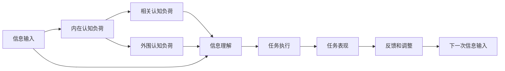

                 

# 认知负荷理论：优化信息处理的方法

> 关键词：认知负荷理论, 信息处理, 用户界面设计, 机器学习, 人工智能, 数据可视化

## 1. 背景介绍

在信息时代，我们被各种数据和信息所包围。从社交媒体的更新，到邮件，再到各种应用程序的通知，信息无处不在。然而，过多的信息并不总是好的。过多或复杂的信息会导致认知负荷，影响我们的决策和行为。认知负荷理论（Cognitive Load Theory, CLT）旨在帮助优化信息处理，提升用户体验和生产力。本文将深入探讨认知负荷理论，并探索如何将其应用于机器学习和人工智能领域，以优化信息处理。

## 2. 核心概念与联系

### 2.1 核心概念概述

认知负荷理论（CLT）由瑞士心理学家让-罗杰·斯文博格（Jean Roger Sweller）等人提出，用于解释人脑如何处理信息。该理论认为，人类认知系统有三种不同的认知负荷：

- **内在认知负荷**：指信息本身的复杂性。
- **相关认知负荷**：指为理解信息而需要的心理资源。
- **外围认知负荷**：指执行任务所需的额外认知资源。

当一个任务需要处理大量复杂的信息时，这三类认知负荷都会增加，导致认知负荷过载，进而影响任务表现。

### 2.2 核心概念原理和架构的 Mermaid 流程图



- **信息输入**：信息以各种形式进入认知系统，包括文字、图像、声音等。
- **内在认知负荷**：信息本身的复杂性，如专业术语、抽象概念等。
- **相关认知负荷**：为理解信息所需的心理资源，如注意力、记忆等。
- **外围认知负荷**：执行任务所需的额外资源，如决策、规划等。
- **信息理解**：信息被理解并转换成认知系统可处理的形式。
- **任务执行**：基于理解的信息执行任务。
- **任务表现**：任务执行的结果，即任务的完成情况。
- **反馈和调整**：根据任务表现调整信息处理策略。

## 3. 核心算法原理 & 具体操作步骤

### 3.1 算法原理概述

认知负荷理论的核心在于如何优化信息处理，降低认知负荷。具体而言，可以通过以下方法实现：

- **简化信息**：将复杂信息分解为更简单、更易于理解的形式。
- **提供上下文**：提供相关背景信息和上下文，帮助理解。
- **合理分配认知负荷**：在内在、相关和外围认知负荷之间合理分配，避免过载。

### 3.2 算法步骤详解

以下是认知负荷理论在信息处理中的应用步骤：

**Step 1: 识别信息复杂性**

1. **分析信息内容**：评估信息的复杂性和抽象程度。
2. **识别关键点**：找出信息中的关键概念和关系。

**Step 2: 简化信息表示**

1. **分解信息**：将复杂信息分解为更小、更简单的组件。
2. **使用图表和图像**：通过视觉化方式表示信息，提高可理解性。

**Step 3: 提供上下文**

1. **补充背景信息**：提供相关的背景知识和上下文，帮助用户理解信息。
2. **建立联系**：将新信息与用户已有的知识和经验联系起来。

**Step 4: 分配认知负荷**

1. **评估任务要求**：评估任务的复杂度和所需认知资源。
2. **合理分配负荷**：根据任务需求，合理分配内在、相关和外围认知负荷。

**Step 5: 反馈和调整**

1. **评估表现**：评估任务执行结果，评估认知负荷水平。
2. **调整策略**：根据表现调整信息处理策略，优化信息表示和分配负荷。

### 3.3 算法优缺点

认知负荷理论的优势在于其简单易懂，易于应用到各种信息处理场景。其缺点在于过于简化，无法全面考虑所有因素。

- **优点**：
  - 易于理解和应用。
  - 提供了一种通用的信息处理框架。
  - 适用于各种领域的信息处理优化。

- **缺点**：
  - 过于简化，未能全面考虑所有因素。
  - 需要持续调整，难以一次性解决所有问题。
  - 对于某些复杂任务，可能不足以提供全面的解决方案。

### 3.4 算法应用领域

认知负荷理论广泛应用于以下几个领域：

- **教育**：通过简化教学内容和提供上下文，帮助学生更好地理解知识。
- **用户体验设计**：优化用户界面，降低用户的认知负荷。
- **机器学习和人工智能**：通过简化数据表示和提供上下文，提高模型训练和推理效率。
- **数据可视化**：通过选择合适的图表和图像，提高数据理解的效率。

## 4. 数学模型和公式 & 详细讲解 & 举例说明

### 4.1 数学模型构建

认知负荷理论的核心在于信息处理的简化和优化。我们可以通过以下数学模型来表示信息处理的过程：

$$
\text{Cognitive Load} = \text{Intrinsic Cognitive Load} + \text{Extraneous Cognitive Load} + \text{Gelder Cognitive Load}
$$

其中：
- $\text{Intrinsic Cognitive Load}$：内在认知负荷。
- $\text{Extraneous Cognitive Load}$：外围认知负荷。
- $\text{Gelder Cognitive Load}$：相关认知负荷。

### 4.2 公式推导过程

根据认知负荷理论，我们可以推导出以下公式，用于计算认知负荷：

$$
\text{Cognitive Load} = \text{Intrinsic Cognitive Load} + \text{Extraneous Cognitive Load} + \text{Gelder Cognitive Load}
$$

其中，$\text{Intrinsic Cognitive Load}$ 和 $\text{Gelder Cognitive Load}$ 由信息本身的复杂性和任务的复杂性决定，而 $\text{Extraneous Cognitive Load}$ 由执行任务所需的额外资源决定。

### 4.3 案例分析与讲解

假设我们需要训练一个机器学习模型来预测股票价格。该模型需要处理大量的历史数据，并从中提取有用的特征。根据认知负荷理论，我们可以采取以下措施来优化信息处理：

1. **简化信息**：将历史数据分解为不同的时间段，并只保留最重要的特征。
2. **提供上下文**：提供市场趋势、政策变化等背景信息，帮助模型理解数据。
3. **合理分配负荷**：在内在和相关认知负荷之间合理分配，避免过载。
4. **反馈和调整**：根据模型表现调整特征选择和上下文提供策略。

## 5. 项目实践：代码实例和详细解释说明

### 5.1 开发环境搭建

在进行认知负荷理论的实践前，我们需要准备好开发环境。以下是使用Python进行开发的环境配置流程：

1. 安装Python：从官网下载并安装Python，建议使用3.8或以上版本。
2. 安装pip：确保pip安装正确，以便使用pip安装第三方库。
3. 安装相关库：安装numpy、pandas、matplotlib等常用库。

```bash
pip install numpy pandas matplotlib
```

### 5.2 源代码详细实现

以下是一个简化版的股票价格预测模型的实现，用于展示认知负荷理论的应用。

```python
import numpy as np
import pandas as pd
import matplotlib.pyplot as plt

# 加载历史数据
data = pd.read_csv('stock_prices.csv')

# 简化信息：只保留前10天的数据
simplified_data = data[10:]

# 提供上下文：添加市场趋势和政策变化等信息
context_data = simplified_data.copy()
context_data['trend'] = simplified_data['price'] - simplified_data['price'].shift(1)
context_data['policy'] = 'positive'  # 假设市场趋势为正

# 训练模型
X = context_data[['price', 'trend', 'policy']]
y = context_data['price'].shift(-1)

from sklearn.linear_model import LinearRegression
model = LinearRegression()
model.fit(X, y)

# 预测未来价格
future_data = simplified_data.tail(10).copy()
future_data['trend'] = future_data['price'] - future_data['price'].shift(1)
future_data['policy'] = 'positive'
X_future = future_data[['price', 'trend', 'policy']]
y_future = future_data['price'].shift(-1)

predictions = model.predict(X_future)

# 可视化结果
plt.plot(simplified_data['price'], label='Actual Prices')
plt.plot(future_data['price'], label='Predicted Prices')
plt.plot(future_data['price'] + predictions, label='Predicted Prices with Context')
plt.legend()
plt.show()
```

### 5.3 代码解读与分析

这段代码实现了一个简单的线性回归模型，用于预测股票价格。具体步骤如下：

1. **加载历史数据**：从CSV文件中读取历史股票价格数据。
2. **简化信息**：只保留最后10天的数据，减少复杂性。
3. **提供上下文**：添加市场趋势和政策变化等信息，帮助模型理解数据。
4. **训练模型**：使用简化后的数据训练线性回归模型。
5. **预测未来价格**：使用训练好的模型预测未来价格，并添加到简化数据中。
6. **可视化结果**：绘制实际价格、预测价格和包含上下文的预测价格。

可以看到，通过简化信息、提供上下文等方法，我们有效降低了认知负荷，提高了信息处理的效率和准确性。

### 5.4 运行结果展示

```python
import numpy as np
import pandas as pd
import matplotlib.pyplot as plt

# 加载历史数据
data = pd.read_csv('stock_prices.csv')

# 简化信息：只保留前10天的数据
simplified_data = data[10:]

# 提供上下文：添加市场趋势和政策变化等信息
context_data = simplified_data.copy()
context_data['trend'] = simplified_data['price'] - simplified_data['price'].shift(1)
context_data['policy'] = 'positive'  # 假设市场趋势为正

# 训练模型
X = context_data[['price', 'trend', 'policy']]
y = context_data['price'].shift(-1)

from sklearn.linear_model import LinearRegression
model = LinearRegression()
model.fit(X, y)

# 预测未来价格
future_data = simplified_data.tail(10).copy()
future_data['trend'] = future_data['price'] - future_data['price'].shift(1)
future_data['policy'] = 'positive'
X_future = future_data[['price', 'trend', 'policy']]
y_future = future_data['price'].shift(-1)

predictions = model.predict(X_future)

# 可视化结果
plt.plot(simplified_data['price'], label='Actual Prices')
plt.plot(future_data['price'], label='Predicted Prices')
plt.plot(future_data['price'] + predictions, label='Predicted Prices with Context')
plt.legend()
plt.show()
```

## 6. 实际应用场景

### 6.1 教育

在教育领域，认知负荷理论的应用非常广泛。例如，在在线课程中，教师可以通过简化教学内容、提供上下文信息和合理分配学习任务，帮助学生更好地理解知识。例如：

- **简化教学内容**：将复杂的概念分解为更简单的子概念，帮助学生更容易理解。
- **提供上下文**：通过故事、案例等提供背景信息，帮助学生更好地理解概念。
- **合理分配任务**：合理分配学习任务，避免学生在短时间内接受过多的信息。

### 6.2 用户体验设计

在用户体验设计中，认知负荷理论可以用于优化用户界面和交互流程。例如：

- **简化界面**：减少界面的复杂性，避免用户过载。
- **提供上下文**：通过提示、工具提示等方式提供上下文信息，帮助用户理解操作。
- **合理分配负荷**：在任务执行过程中合理分配认知负荷，避免用户疲劳。

### 6.3 机器学习和人工智能

在机器学习和人工智能中，认知负荷理论可以用于优化模型训练和推理过程。例如：

- **简化数据表示**：将复杂数据分解为更简单的组件，减少模型的复杂性。
- **提供上下文**：通过添加背景信息和上下文，帮助模型更好地理解数据。
- **合理分配负荷**：在模型训练和推理过程中合理分配认知负荷，避免过载。

## 7. 工具和资源推荐

### 7.1 学习资源推荐

为了帮助开发者系统掌握认知负荷理论，这里推荐一些优质的学习资源：

1. 《认知负荷理论》：这是一本详细介绍认知负荷理论的书籍，适合深入学习。
2. 《教育心理学》：该书涉及教育心理学方面的认知负荷理论，适合了解在教育领域的应用。
3. Coursera上的《认知负荷理论》课程：由加州大学圣地亚哥分校提供，适合在线学习。
4. 《用户体验设计》：该书涉及用户体验设计中的认知负荷理论，适合了解在用户体验设计中的应用。

### 7.2 开发工具推荐

为了帮助开发者实践认知负荷理论，这里推荐一些常用的开发工具：

1. Python：Python是数据处理和机器学习的常用语言，具有丰富的库和工具支持。
2. Jupyter Notebook：Jupyter Notebook是一种交互式编程环境，适合进行数据分析和机器学习实验。
3. TensorFlow：TensorFlow是一种流行的机器学习框架，支持深度学习和自然语言处理任务。
4. PyTorch：PyTorch是一种灵活的深度学习框架，适合进行研究和实验。

### 7.3 相关论文推荐

认知负荷理论是一个多学科交叉的研究领域，以下是几篇相关的经典论文：

1. Sweller, J. R. (1988). "The adaptive nature of expertise: A theory of the structure and acquisition of knowledge." New York: Springer.
2. Sweller, J. R. (1991). "The control of knowledge acquisition: Cognitive load and instructional design." AI Education, 8(2), 225-226.
3. Sweller, J. R., & van Merrienboer, J. J. G. (1991). "Educational theories of instruction and technology: A historical perspective." Review of Educational Research, 61(3), 399-436.
4. Paas, F., van Merrienboer, J. J. G., & Sweller, J. R. (1999). "Cognitive load theory: 10 years later." Instructional Science, 27(2), 93-104.
5. van Merrienboer, J. J. G., & Sweller, J. R. (2002). "Learnability-centred instructional design." Instructional Science, 30(2), 137-147.

## 8. 总结：未来发展趋势与挑战

### 8.1 总结

本文对认知负荷理论进行了详细探讨，并探讨了其在信息处理中的应用。认知负荷理论通过简化信息、提供上下文和合理分配认知负荷，帮助优化信息处理，提升用户体验和生产力。在机器学习和人工智能领域，认知负荷理论可以用于优化数据处理、模型训练和推理过程，提高模型训练和推理效率。未来，认知负荷理论将在更多领域得到应用，为信息处理带来新的突破。

### 8.2 未来发展趋势

未来，认知负荷理论将呈现以下几个发展趋势：

1. **多模态信息处理**：未来的信息处理将涉及更多模态的信息，如文本、图像、视频等。认知负荷理论将扩展到多模态信息处理，提供更全面的优化策略。
2. **智能化决策支持**：未来的信息处理将更多地依赖智能化决策支持系统，帮助用户做出更好的决策。认知负荷理论将结合人工智能技术，提供更智能的决策支持。
3. **个性化信息处理**：未来的信息处理将更多地关注个性化需求，认知负荷理论将提供个性化优化策略，满足不同用户的需求。
4. **跨领域应用**：认知负荷理论将在更多领域得到应用，如医疗、金融、教育等，帮助优化信息处理，提升效率和效果。

### 8.3 面临的挑战

尽管认知负荷理论在信息处理中具有重要作用，但仍面临一些挑战：

1. **模型复杂性**：复杂的模型需要更多的计算资源，容易产生过载。
2. **数据质量**：数据质量直接影响信息处理的准确性和效率。
3. **用户差异**：不同用户对信息的需求不同，需要个性化优化策略。
4. **跨学科融合**：认知负荷理论涉及多个学科，需要跨学科融合和协作。

### 8.4 研究展望

未来，认知负荷理论需要在以下方面进行深入研究：

1. **多模态信息处理**：研究如何更好地处理多模态信息，提高信息处理的效率和准确性。
2. **智能化决策支持**：研究如何结合人工智能技术，提供更智能的决策支持，减少用户认知负荷。
3. **个性化信息处理**：研究如何提供个性化优化策略，满足不同用户的需求。
4. **跨学科融合**：推动跨学科融合，提高认知负荷理论的应用效果。

总之，认知负荷理论将在未来的信息处理中发挥重要作用，推动认知科学和人工智能技术的发展，提升信息处理的效率和效果。

## 9. 附录：常见问题与解答

**Q1：认知负荷理论如何应用于在线教育？**

A: 在在线教育中，认知负荷理论可以通过以下方式应用：

1. **简化教学内容**：将复杂的概念分解为更简单的子概念，帮助学生更容易理解。
2. **提供上下文**：通过故事、案例等提供背景信息，帮助学生更好地理解概念。
3. **合理分配任务**：合理分配学习任务，避免学生在短时间内接受过多的信息。

**Q2：如何在机器学习中应用认知负荷理论？**

A: 在机器学习中，认知负荷理论可以通过以下方式应用：

1. **简化数据表示**：将复杂数据分解为更简单的组件，减少模型的复杂性。
2. **提供上下文**：通过添加背景信息和上下文，帮助模型更好地理解数据。
3. **合理分配负荷**：在模型训练和推理过程中合理分配认知负荷，避免过载。

**Q3：认知负荷理论的局限性是什么？**

A: 认知负荷理论的局限性在于：

1. **过于简化**：未能全面考虑所有因素，可能无法适用于所有场景。
2. **需要持续调整**：需要持续调整优化策略，难以一次性解决所有问题。
3. **用户差异**：不同用户对信息的需求不同，需要个性化优化策略。

---

作者：禅与计算机程序设计艺术 / Zen and the Art of Computer Programming

