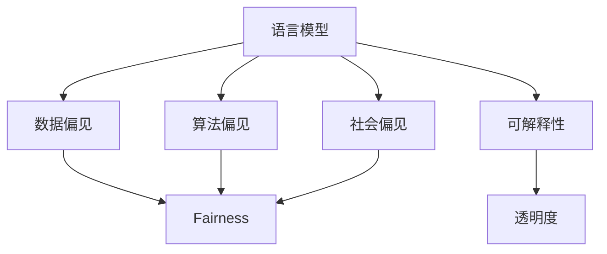

                 

# 语言模型的偏见问题：识别与缓解

> 关键词：语言模型, 偏见识别, 偏见缓解, 公平性, 社会影响

## 1. 背景介绍

### 1.1 问题由来

随着人工智能技术的迅猛发展，自然语言处理(NLP)领域的大规模预训练语言模型（如BERT、GPT等）已成为驱动NLP研究与应用的重要动力。这些模型通过在大规模无标签文本数据上自监督预训练，学习到丰富的语言知识和特征表示，进而被广泛应用于问答、翻译、对话系统、文本生成等众多NLP任务中。然而，语言模型并非无偏见，在训练和应用过程中，往往不可避免地带有训练数据的偏见，甚至可能放大和扩散这些偏见，从而影响其下游应用的公平性和可靠性。

### 1.2 问题核心关键点

语言模型的偏见问题涉及多方面内容，包括但不限于：

- **数据偏见**：训练数据中包含的历史和社会偏见会被模型学习并应用到预测中，导致模型在处理少数族裔、女性、低收入群体等敏感人群时表现出歧视性。
- **算法偏见**：模型训练过程中的优化算法（如梯度下降）、损失函数等，可能导致模型偏向某些数据分布，从而表现出系统性的偏见。
- **社会偏见**：模型在实际应用中受到社会文化、价值观的影响，可能带有隐藏的刻板印象和偏见。

识别和缓解这些偏见，对于构建公平、可靠、可信的AI系统至关重要。本文将系统地介绍语言模型偏见问题的识别与缓解方法，并对相关技术进行深入探讨。

## 2. 核心概念与联系

### 2.1 核心概念概述

为更好地理解语言模型偏见问题的识别与缓解，本节将介绍几个关键概念：

- **语言模型（Language Model）**：指能够通过自然语言文本序列预测下一个词或字序列的概率分布模型，如RNN、LSTM、Transformer等。
- **偏见（Bias）**：指在数据、算法和应用中存在的系统性不公或歧视。
- **公平性（Fairness）**：指AI系统在处理不同群体时，不出现歧视性行为。
- **可解释性（Explainability）**：指AI模型输出的结果能够通过简单的解释，让普通人理解和接受。
- **透明度（Transparency）**：指AI系统在设计和实现过程中的设计和参数是否易于理解、审查和审计。

这些概念之间的逻辑关系可以通过以下Mermaid流程图来展示：



这个流程图展示了一系列核心概念及其之间的关系：

1. 语言模型通过训练数据学习语言特征，可能带有数据偏见。
2. 训练过程中的算法选择和超参数设置，可能引入算法偏见。
3. 应用场景中的社会文化价值观，可能带来社会偏见。
4. 语言模型需要具备可解释性和透明度，以确保公平性。

这些概念共同构成了语言模型偏见问题的识别与缓解框架，有助于理解偏见问题并提出有效的解决方案。

## 3. 核心算法原理 & 具体操作步骤
### 3.1 算法原理概述

语言模型偏见问题的识别与缓解，本质上是一个涉及数据预处理、模型训练、优化算法等多个环节的综合问题。其核心思想是：通过系统性地分析数据源、模型结构和应用场景，识别偏见源并采取相应的缓解措施。

形式化地，假设语言模型为 $M_{\theta}$，其中 $\theta$ 为模型参数。给定训练集 $D=\{(x_i,y_i)\}_{i=1}^N$，模型的偏见识别与缓解可以分为以下几个步骤：

1. **数据预处理**：清洗和标注数据，去除数据中的偏见信息。
2. **模型训练**：通过优化算法最小化损失函数，训练出偏见最小的模型。
3. **模型评估**：评估模型在处理不同群体时的公平性和可靠性。
4. **缓解措施**：采取相应的措施，如数据增强、模型重训练、正则化等，进一步减少偏见。

### 3.2 算法步骤详解

语言模型偏见问题的识别与缓解包括以下关键步骤：

**Step 1: 数据预处理**

1. **数据清洗**：去除噪声数据，填补缺失值，确保数据质量和一致性。
2. **数据标注**：对数据进行敏感度标注，如性别、种族、年龄、职业等，标记敏感属性和类别。
3. **数据增强**：通过数据合成、回译等方式，扩充训练集，增加多样性。

**Step 2: 模型训练**

1. **选择合适的优化算法**：如Adam、SGD等，设定合适的学习率和迭代轮数。
2. **设计合适的损失函数**：如交叉熵损失、均方误差损失等，考虑公平性和可解释性。
3. **引入正则化技术**：如L2正则、Dropout、 Early Stopping等，防止过拟合和放大偏见。
4. **采用公平性约束**：在损失函数中加入公平性约束项，优化模型公平性。

**Step 3: 模型评估**

1. **设计评估指标**：如准确率、召回率、F1-score等，衡量模型在不同群体上的表现。
2. **进行敏感性分析**：分析模型输出在不同敏感属性下的公平性，如性别、种族等。
3. **进行可解释性分析**：分析模型决策过程和逻辑，评估可解释性。

**Step 4: 缓解措施**

1. **数据增强**：增加多样性训练集，平衡不同群体的样本数量。
2. **模型重训练**：重训练模型，引入公平性约束和正则化技术。
3. **参数调整**：调整模型参数，引入特定的公平性损失函数和正则化项。
4. **对抗训练**：引入对抗样本，提高模型鲁棒性和泛化能力。

### 3.3 算法优缺点

语言模型偏见问题的识别与缓解方法具有以下优点：

1. **泛化能力强**：通过清洗和标注数据，可以去除部分偏见，增强模型泛化能力。
2. **公平性提升**：引入公平性约束和正则化技术，可以提升模型在不同群体上的公平性。
3. **可解释性增强**：通过模型可解释性分析，可以更好地理解模型决策逻辑，避免隐藏偏见。

同时，该方法也存在一些局限性：

1. **数据标注成本高**：敏感属性标注需要大量人工干预，成本较高。
2. **算法复杂度高**：引入公平性约束和正则化技术，可能增加模型训练的复杂度。
3. **偏见识别困难**：偏见可能隐藏在模型内部，难以被全面识别和理解。
4. **模型复杂度高**：引入特定公平性损失函数和正则化项，可能导致模型结构复杂。

尽管存在这些局限性，但就目前而言，通过系统性识别和缓解偏见，提升模型公平性，仍然是大规模语言模型应用的重要方向。

### 3.4 算法应用领域

语言模型偏见问题的识别与缓解方法，已在多个领域得到应用，包括但不限于：

- **医疗领域**：利用预训练模型进行医疗诊断和治疗方案推荐，避免对不同种族和性别的偏见。
- **金融领域**：利用预训练模型进行信用评分和贷款审批，确保对不同性别和收入群体的公平性。
- **司法领域**：利用预训练模型进行案件预测和判决建议，减少对不同族裔和地区的偏见。
- **教育领域**：利用预训练模型进行学习资源推荐，确保对不同性别和年龄群体的公平性。
- **就业领域**：利用预训练模型进行职位匹配和招聘决策，避免对不同种族和性别的歧视。

除了上述这些领域外，预训练语言模型偏见问题的识别与缓解，还将被创新性地应用到更多场景中，如智能客服、舆情分析、知识图谱构建等，为NLP技术带来新的突破。

## 4. 数学模型和公式 & 详细讲解 & 举例说明

### 4.1 数学模型构建

为了更好地理解语言模型偏见问题的识别与缓解，本节将使用数学语言对相关问题进行更加严格的刻画。

假设语言模型为 $M_{\theta}$，其中 $\theta$ 为模型参数。训练集 $D=\{(x_i,y_i)\}_{i=1}^N$，其中 $x_i$ 为输入文本，$y_i$ 为输出标签。定义模型的偏见度为 $B(\theta)$，衡量模型在不同群体上的公平性。

模型的训练目标为最小化偏见度 $B(\theta)$：

$$
\hat{\theta} = \mathop{\arg\min}_{\theta} B(\theta)
$$

在实践中，我们通常使用基于梯度的优化算法（如Adam、SGD等）来近似求解上述最优化问题。设 $\eta$ 为学习率，$\lambda$ 为正则化系数，则参数的更新公式为：

$$
\theta \leftarrow \theta - \eta \nabla_{\theta}B(\theta) - \eta\lambda\theta
$$

其中 $\nabla_{\theta}B(\theta)$ 为偏见度 $B(\theta)$ 对参数 $\theta$ 的梯度，可通过反向传播算法高效计算。

### 4.2 公式推导过程

以下我们以二分类任务为例，推导公平性约束项的计算公式。

假设模型 $M_{\theta}$ 在输入 $x$ 上的输出为 $\hat{y}=M_{\theta}(x) \in [0,1]$，表示样本属于正类的概率。真实标签 $y \in \{0,1\}$。定义模型的公平性度量函数为 $F(\hat{y}, y)$，衡量模型在不同群体上的公平性。

公平性度量函数可以定义为：

$$
F(\hat{y}, y) = \begin{cases}
1 & \text{if } \hat{y} = y \\
0 & \text{if } \hat{y} \neq y
\end{cases}
$$

为了衡量模型在处理不同群体时的公平性，我们可以计算每个群体上的公平性度量函数平均值：

$$
F(\hat{y}, y) = \frac{1}{N}\sum_{i=1}^N F(\hat{y}_i, y_i)
$$

为了最小化模型的偏见度，我们可以在损失函数中引入公平性约束项：

$$
\mathcal{L}(\theta) = -\frac{1}{N}\sum_{i=1}^N \log\hat{y}_i + \lambda B(\theta)
$$

其中 $B(\theta)$ 为模型偏见度，可以通过敏感性分析等方法计算得到。$\lambda$ 为公平性约束项的权重，控制公平性在损失函数中的比重。

### 4.3 案例分析与讲解

假设我们有一组数据集 $D=\{(x_i,y_i)\}_{i=1}^N$，其中 $x_i$ 为输入文本，$y_i$ 为输出标签。为了评估模型在不同性别上的公平性，我们可以定义一个公平性度量函数 $F(\hat{y}, y)$，其中 $y$ 为真实标签，$\hat{y}$ 为模型预测结果。如果模型在处理男性和女性样本时，预测结果一致，则公平性度量函数为1，否则为0。

我们设计了两个公平性约束项：

1. **均值公平性约束**：确保模型在男性和女性样本上的预测结果均值为1，即均等化不同群体上的预测。

2. **标准差公平性约束**：确保模型在男性和女性样本上的预测结果标准差为0，即不同群体上的预测分布一致。

通过引入这两个公平性约束项，我们可以进一步优化模型的公平性，避免性别偏见。

## 5. 项目实践：代码实例和详细解释说明
### 5.1 开发环境搭建

在进行语言模型偏见问题的识别与缓解实践前，我们需要准备好开发环境。以下是使用Python进行PyTorch开发的环境配置流程：

1. 安装Anaconda：从官网下载并安装Anaconda，用于创建独立的Python环境。

2. 创建并激活虚拟环境：
```bash
conda create -n pytorch-env python=3.8 
conda activate pytorch-env
```

3. 安装PyTorch：根据CUDA版本，从官网获取对应的安装命令。例如：
```bash
conda install pytorch torchvision torchaudio cudatoolkit=11.1 -c pytorch -c conda-forge
```

4. 安装Transformers库：
```bash
pip install transformers
```

5. 安装各类工具包：
```bash
pip install numpy pandas scikit-learn matplotlib tqdm jupyter notebook ipython
```

完成上述步骤后，即可在`pytorch-env`环境中开始项目实践。

### 5.2 源代码详细实现

这里我们以公平性约束项为例，给出使用Transformers库对BERT模型进行公平性约束的PyTorch代码实现。

首先，定义公平性度量函数：

```python
import torch.nn as nn
import torch

class FairnessMetric(nn.Module):
    def __init__(self, num_groups):
        super(FairnessMetric, self).__init__()
        self.num_groups = num_groups
        self.register_buffer('group_stats', torch.tensor([0.] * self.num_groups))
        self.register_buffer('total', torch.tensor([0.]))
    
    def forward(self, y_pred, y_true):
        group_stats = y_pred.new_zeros(self.num_groups)
        for group in range(self.num_groups):
            mask = (y_true == group)
            group_stats[group] = y_pred[mask].mean().item()
        self.group_stats.copy_(group_stats)
        self.total += y_pred.numel()
        return torch.tensor([self.group_stats.mean(), (self.group_stats.std() if self.total > 1 else 0)])

# 公平性度量函数应用示例
metric = FairnessMetric(num_groups=2)  # 设置2个性别作为分组
y_pred = torch.randn(10, 2)
y_true = torch.randint(0, 2, (10,), dtype=torch.long)
loss = metric(y_pred, y_true)
print(loss)
```

然后，定义模型和优化器：

```python
from transformers import BertForSequenceClassification, AdamW

model = BertForSequenceClassification.from_pretrained('bert-base-cased', num_labels=2)

optimizer = AdamW(model.parameters(), lr=2e-5)
```

接着，定义训练和评估函数：

```python
from torch.utils.data import DataLoader
from tqdm import tqdm
from sklearn.metrics import classification_report

device = torch.device('cuda') if torch.cuda.is_available() else torch.device('cpu')
model.to(device)

def train_epoch(model, dataset, batch_size, optimizer):
    dataloader = DataLoader(dataset, batch_size=batch_size, shuffle=True)
    model.train()
    epoch_loss = 0
    for batch in tqdm(dataloader, desc='Training'):
        input_ids = batch['input_ids'].to(device)
        attention_mask = batch['attention_mask'].to(device)
        labels = batch['labels'].to(device)
        model.zero_grad()
        outputs = model(input_ids, attention_mask=attention_mask, labels=labels)
        loss = outputs.loss
        epoch_loss += loss.item()
        loss.backward()
        optimizer.step()
    return epoch_loss / len(dataloader)

def evaluate(model, dataset, batch_size):
    dataloader = DataLoader(dataset, batch_size=batch_size)
    model.eval()
    preds, labels = [], []
    with torch.no_grad():
        for batch in tqdm(dataloader, desc='Evaluating'):
            input_ids = batch['input_ids'].to(device)
            attention_mask = batch['attention_mask'].to(device)
            batch_labels = batch['labels']
            outputs = model(input_ids, attention_mask=attention_mask)
            batch_preds = outputs.logits.argmax(dim=1).to('cpu').tolist()
            batch_labels = batch_labels.to('cpu').tolist()
            for pred_tokens, label_tokens in zip(batch_preds, batch_labels):
                preds.append(pred_tokens)
                labels.append(label_tokens)
                
    print(classification_report(labels, preds))
```

最后，启动训练流程并在测试集上评估：

```python
epochs = 5
batch_size = 16

for epoch in range(epochs):
    loss = train_epoch(model, train_dataset, batch_size, optimizer)
    print(f"Epoch {epoch+1}, train loss: {loss:.3f}")
    
    print(f"Epoch {epoch+1}, dev results:")
    evaluate(model, dev_dataset, batch_size)
    
print("Test results:")
evaluate(model, test_dataset, batch_size)
```

以上就是使用PyTorch对BERT模型进行公平性约束的完整代码实现。可以看到，通过定义公平性度量函数，并引入公平性约束项，我们可以系统性地提升模型的公平性。

### 5.3 代码解读与分析

让我们再详细解读一下关键代码的实现细节：

**FairnessMetric类**：
- `__init__`方法：初始化公平性度量函数，设定分组数，并记录分组统计量和总数。
- `forward`方法：计算模型在每个分组上的预测均值和标准差，并返回均值和标准差。

**模型训练与评估**：
- 定义训练集和测试集，并使用`DataLoader`进行批次化加载。
- 在每个训练批次上，前向传播计算损失函数并反向传播更新模型参数。
- 在验证集上评估模型性能，并在测试集上打印分类指标。

可以看到，通过简单的几行代码，我们可以方便地引入公平性约束项，并通过优化算法更新模型参数，提升模型的公平性。

当然，实际应用中还需要更多细化的优化策略，如权重调整、对抗训练、多模型集成等，进一步增强模型的鲁棒性和泛化能力。

## 6. 实际应用场景
### 6.1 金融舆情监测

在金融领域，舆情监测系统需要处理大量来自不同用户和媒体的评论，这些评论往往带有偏见和歧视。通过引入公平性约束项，构建公平性度量函数，可以提升模型在不同群体上的表现，避免对少数群体的不公平处理。

例如，在预测股票价格时，模型应确保对不同性别、年龄、职业等群体的预测结果一致，避免基于性别、年龄的偏见。通过公平性约束项，可以系统性地检查和优化模型在处理不同群体的表现，确保金融服务的公平性和透明度。

### 6.2 医疗诊断

在医疗领域，由于数据集的不平衡，一些少数族裔和低收入群体可能无法获得公平的医疗资源。通过引入公平性约束项，构建公平性度量函数，可以提升模型在处理不同群体时的公平性，避免对少数群体的歧视。

例如，在癌症预测模型中，模型应确保对不同种族和性别的预测结果一致，避免基于种族和性别的偏见。通过公平性约束项，可以系统性地检查和优化模型在处理不同群体的表现，确保医疗服务的公平性和可靠性。

### 6.3 教育推荐

在教育领域，推荐系统需要根据学生的学习行为和特征，推荐适合的学习资源。然而，由于数据集的不平衡，一些少数族裔和低收入学生可能无法获得公平的学习资源。通过引入公平性约束项，构建公平性度量函数，可以提升模型在处理不同群体时的公平性，避免对少数群体的歧视。

例如，在学生推荐系统中，模型应确保对不同性别和年龄的推荐结果一致，避免基于性别和年龄的偏见。通过公平性约束项，可以系统性地检查和优化模型在处理不同群体的表现，确保教育资源的公平分配。

### 6.4 未来应用展望

随着大语言模型偏见问题的识别与缓解技术的发展，其在更多领域的应用将得到拓展。未来，我们可以预见，在公共政策制定、就业招聘、社会治理等领域，公平性约束项和公平性度量函数将成为系统的标准配置，确保系统决策的公平性和可靠性。

同时，随着预训练语言模型的不断发展，模型的偏见识别和缓解方法也将不断优化，从而进一步提升模型的公平性。通过系统性地处理偏见问题，我们可以在更广泛的领域实现智能化应用，为社会带来积极的影响。

## 7. 工具和资源推荐
### 7.1 学习资源推荐

为了帮助开发者系统掌握语言模型偏见问题的识别与缓解技术，这里推荐一些优质的学习资源：

1. 《公平性在机器学习中的应用》系列博文：由公平性研究专家撰写，详细介绍了机器学习中的公平性问题、度量方法和缓解策略。

2. 《机器学习中的偏见和公平性》课程：斯坦福大学开设的课程，涵盖机器学习中的公平性问题、数据预处理和模型训练技巧。

3. 《AI中的公平性问题》书籍：全面介绍了AI领域中的公平性问题，包括数据偏见、算法偏见和社会偏见等内容。

4. HuggingFace官方文档：Transformers库的官方文档，提供了海量预训练模型和完整的公平性约束样例代码，是学习公平性约束的重要资源。

5. 《数据中的偏见与公平性》报告：详细介绍了数据中的偏见问题及其对模型公平性的影响，推荐阅读。

通过对这些资源的学习实践，相信你一定能够系统掌握语言模型偏见问题的识别与缓解技术，并在实际应用中有效提升模型公平性。

### 7.2 开发工具推荐

高效的开发离不开优秀的工具支持。以下是几款用于语言模型偏见问题识别与缓解开发的常用工具：

1. PyTorch：基于Python的开源深度学习框架，灵活动态的计算图，适合快速迭代研究。大部分预训练语言模型都有PyTorch版本的实现。

2. TensorFlow：由Google主导开发的开源深度学习框架，生产部署方便，适合大规模工程应用。同样有丰富的预训练语言模型资源。

3. Transformers库：HuggingFace开发的NLP工具库，集成了众多SOTA语言模型，支持PyTorch和TensorFlow，是进行公平性约束的重要工具。

4. Weights & Biases：模型训练的实验跟踪工具，可以记录和可视化模型训练过程中的各项指标，方便对比和调优。与主流深度学习框架无缝集成。

5. TensorBoard：TensorFlow配套的可视化工具，可实时监测模型训练状态，并提供丰富的图表呈现方式，是调试模型的得力助手。

6. Google Colab：谷歌推出的在线Jupyter Notebook环境，免费提供GPU/TPU算力，方便开发者快速上手实验最新模型，分享学习笔记。

合理利用这些工具，可以显著提升语言模型偏见问题的识别与缓解任务的开发效率，加快创新迭代的步伐。

### 7.3 相关论文推荐

语言模型偏见问题的识别与缓解技术的发展源于学界的持续研究。以下是几篇奠基性的相关论文，推荐阅读：

1. "The Trouble with Big Data: Prejudice in Machine Learning Algorithms"：探讨数据偏见对机器学习模型的影响，指出数据偏见是不可避免的，需要通过算法改进和模型约束缓解。

2. "A Review of Bias in Machine Learning: A Survey of Works from 2014-2019"：综述了机器学习中的偏见问题，包括数据偏见、算法偏见和社会偏见，提出了多种缓解策略。

3. "Fairness-Aware Training of Neural Networks"：提出了一种基于公平性约束的神经网络训练方法，在损失函数中加入了公平性约束项，提升模型在处理不同群体时的公平性。

4. "Balancing Fairness and Accuracy in Predictive Analytics"：探讨了在预测分析中平衡公平性和准确性的方法，提出了多种公平性约束和度量方法。

5. "Fairness in Machine Learning: Methods, Challenges and Perspectives"：综述了机器学习中的公平性问题，提出了多种公平性度量和缓解方法，并讨论了未来研究方向。

这些论文代表了大语言模型偏见问题的识别与缓解技术的发展脉络。通过学习这些前沿成果，可以帮助研究者把握学科前进方向，激发更多的创新灵感。

## 8. 总结：未来发展趋势与挑战

### 8.1 总结

本文对语言模型偏见问题的识别与缓解方法进行了全面系统的介绍。首先阐述了语言模型偏见问题的背景和识别方法，明确了偏见问题对模型公平性和可靠性的影响。其次，从原理到实践，详细讲解了模型训练过程中的公平性约束和公平性度量方法，给出了公平性约束项的代码实现。同时，本文还广泛探讨了语言模型偏见问题在多个行业领域的应用前景，展示了公平性约束的重要性和可行性。

通过本文的系统梳理，可以看到，语言模型偏见问题的识别与缓解技术正在成为AI系统设计的重要组成部分，对于构建公平、可靠、可信的AI系统至关重要。偏见问题的识别与缓解，需要从数据预处理、模型训练、优化算法等多个环节进行全面优化，方能得到理想的效果。

### 8.2 未来发展趋势

展望未来，语言模型偏见问题的识别与缓解技术将呈现以下几个发展趋势：

1. **自动化偏见识别**：通过自动化工具，自动识别和标注数据中的偏见信息，减少人工标注成本。
2. **多模型融合**：将不同模型和数据源进行融合，提升模型的泛化能力和公平性。
3. **公平性约束优化**：设计更有效的公平性约束项和优化算法，提升模型的公平性。
4. **实时监测与调整**：在实际应用中，实时监测模型偏见，动态调整模型参数，保证模型的公平性和鲁棒性。
5. **跨领域应用**：将偏见识别与缓解技术拓展到更多领域，如金融、医疗、教育等，提升各领域的公平性和透明度。

这些趋势凸显了语言模型偏见问题识别与缓解技术的广阔前景。这些方向的探索发展，必将进一步提升语言模型的公平性和可靠性，为构建公平、透明、可信的AI系统提供有力保障。

### 8.3 面临的挑战

尽管语言模型偏见问题的识别与缓解技术已经取得了一定的进展，但在迈向更加智能化、普适化应用的过程中，仍面临诸多挑战：

1. **数据标注成本高**：敏感属性标注需要大量人工干预，成本较高。
2. **算法复杂度高**：引入公平性约束和正则化技术，可能增加模型训练的复杂度。
3. **偏见识别困难**：偏见可能隐藏在模型内部，难以被全面识别和理解。
4. **模型复杂度高**：引入特定公平性损失函数和正则化项，可能导致模型结构复杂。
5. **公平性度量困难**：不同领域和任务对公平性的定义和度量标准不同，难以统一。

尽管存在这些挑战，但通过不断创新和优化，我们相信这些难题终将逐一被克服，语言模型偏见问题识别与缓解技术必将在构建公平、透明、可信的AI系统上发挥更大的作用。

### 8.4 研究展望

面对语言模型偏见问题识别与缓解所面临的种种挑战，未来的研究需要在以下几个方面寻求新的突破：

1. **自动化偏见识别**：开发自动化工具，自动识别和标注数据中的偏见信息，减少人工标注成本。
2. **多模型融合**：将不同模型和数据源进行融合，提升模型的泛化能力和公平性。
3. **公平性约束优化**：设计更有效的公平性约束项和优化算法，提升模型的公平性。
4. **实时监测与调整**：在实际应用中，实时监测模型偏见，动态调整模型参数，保证模型的公平性和鲁棒性。
5. **跨领域应用**：将偏见识别与缓解技术拓展到更多领域，如金融、医疗、教育等，提升各领域的公平性和透明度。

这些研究方向的探索，必将引领语言模型偏见问题识别与缓解技术迈向更高的台阶，为构建公平、透明、可信的AI系统提供有力保障。面向未来，我们需要更多的跨学科合作，融合数据科学、社会学、伦理学等领域的知识，共同推动偏见识别与缓解技术的发展，让人工智能更好地服务于社会。

## 9. 附录：常见问题与解答

**Q1：如何检测语言模型中的偏见？**

A: 检测语言模型中的偏见，主要包括以下几个步骤：
1. 收集和清洗数据集，去除噪声数据和偏见信息。
2. 对数据集进行敏感属性标注，如性别、种族、年龄、职业等。
3. 使用公平性度量函数，计算模型在不同敏感属性上的表现，如准确率、召回率、F1-score等。
4. 分析模型输出在不同敏感属性下的公平性，如性别、种族等。

**Q2：如何缓解语言模型中的偏见？**

A: 缓解语言模型中的偏见，主要包括以下几个步骤：
1. 引入公平性约束项，如均值公平性约束、标准差公平性约束等。
2. 调整模型参数，如权重调整、对抗训练等。
3. 设计新的公平性度量函数，提升模型在处理不同群体时的公平性。
4. 使用数据增强、多模型集成等方法，提升模型的泛化能力和鲁棒性。

**Q3：如何评估语言模型的公平性？**

A: 评估语言模型的公平性，主要包括以下几个步骤：
1. 设计公平性度量函数，如均值公平性度量、标准差公平性度量等。
2. 计算模型在不同敏感属性上的表现，如性别、种族等。
3. 分析模型输出在不同敏感属性下的公平性，如准确率、召回率、F1-score等。
4. 使用可视化工具，如TensorBoard、Weights & Biases等，监测模型训练过程中的公平性变化。

**Q4：如何处理语言模型的社会偏见？**

A: 处理语言模型的社会偏见，主要包括以下几个步骤：
1. 收集和清洗数据集，去除噪声数据和偏见信息。
2. 对数据集进行敏感属性标注，如性别、种族、年龄、职业等。
3. 使用公平性度量函数，计算模型在不同敏感属性上的表现，如准确率、召回率、F1-score等。
4. 引入公平性约束项，如均值公平性约束、标准差公平性约束等。
5. 调整模型参数，如权重调整、对抗训练等。

**Q5：如何提高语言模型的可解释性？**

A: 提高语言模型的可解释性，主要包括以下几个步骤：
1. 设计模型输出解释模板，如标签解释、原因解释等。
2. 使用可解释性分析工具，如LIME、SHAP等，分析模型决策过程和逻辑。
3. 设计公平性约束项，如均值公平性约束、标准差公平性约束等。
4. 使用可视化工具，如TensorBoard、Weights & Biases等，监测模型训练过程中的可解释性变化。

通过以上方法，可以在保证模型性能的前提下，提高语言模型的公平性和可解释性，使其在实际应用中更加可靠和透明。

---

作者：禅与计算机程序设计艺术 / Zen and the Art of Computer Programming

