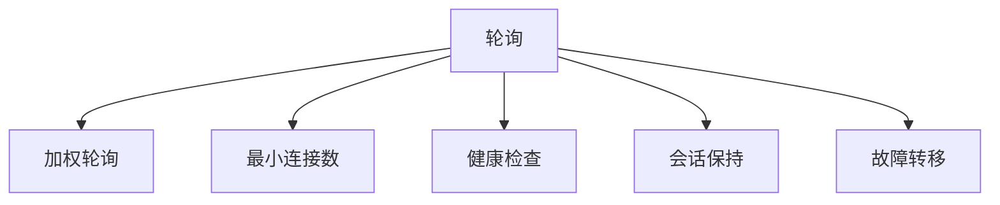

                 

# 负载均衡技术：提高系统可用性和性能

## 1. 背景介绍

在现代云计算和分布式系统中，负载均衡技术已经成为了保证系统高可用性和性能的重要手段。负载均衡器（Load Balancer）根据系统的负载情况，动态分配请求到不同的服务器节点，避免单点故障，提高系统的响应速度和吞吐量。随着云计算和大数据应用的蓬勃发展，负载均衡技术的应用场景和需求越来越广泛，成为现代IT架构中不可或缺的组成部分。

### 1.1 问题由来

在分布式系统中，服务器节点通常需要处理大量的请求，由于网络延迟、服务器负载不均、资源冲突等问题，单一服务器节点难以应对持续高负载的请求。传统做法是通过增加硬件设备（如更多服务器）或固定配置方式来提高系统性能，但这种方式成本高，且资源利用率低。负载均衡技术通过动态调节负载，提高资源利用率，实现系统的可扩展性和高性能。

### 1.2 问题核心关键点

负载均衡技术主要包括硬件负载均衡器（如F5、Citrix NetScaler等）和软件负载均衡器（如Nginx、HAProxy等）。软件负载均衡器更加灵活，可扩展性强，且成本较低，适合中小型项目使用。

负载均衡的核心机制包括：

1. **负载均衡算法**：根据不同的负载均衡策略（如轮询、加权轮询、最小连接数等）分配请求到不同服务器节点。
2. **健康检查**：实时监控服务器节点的状态，确保只有健康的节点可以处理请求。
3. **会话保持**：保持客户端与服务器之间的长连接，确保会话连续性。
4. **故障转移**：当节点发生故障时，自动将请求切换到其他健康节点，保证系统连续性。

## 2. 核心概念与联系

### 2.1 核心概念概述

为了更好地理解负载均衡技术，本节将介绍几个密切相关的核心概念：

- **负载均衡器（Load Balancer）**：根据系统的负载情况，动态分配请求到不同的服务器节点，避免单点故障，提高系统的响应速度和吞吐量。
- **轮询（Round Robin）**：最简单的负载均衡算法，请求按顺序依次分配到各个服务器节点。
- **加权轮询（Weighted Round Robin）**：按服务器的性能指标（如CPU利用率、内存使用等）赋予不同服务器不同的权重，分配请求时按权重顺序依次分配。
- **最小连接数（Least Connections）**：将请求分配给当前连接数最少的服务器，以减少服务器之间的负载差异。
- **健康检查（Health Check）**：通过定时请求来检查服务器节点的健康状况，仅将请求分配给健康的节点。
- **会话保持（Session Persistence）**：保持客户端与服务器之间的长连接，确保会话连续性。
- **故障转移（Failover）**：当节点发生故障时，自动将请求切换到其他健康节点，保证系统连续性。

这些核心概念之间的逻辑关系可以通过以下Mermaid流程图来展示：



这个流程图展示了她涉及到的核心概念及其之间的关系：

1. 负载均衡器根据不同的负载均衡策略，分配请求到不同服务器节点。
2. 轮询是最简单的负载均衡算法。
3. 加权轮询和最小连接数根据服务器性能指标分配请求。
4. 健康检查实时监控服务器节点的状态。
5. 会话保持保持客户端与服务器之间的长连接。
6. 故障转移保证系统连续性。

## 3. 核心算法原理 & 具体操作步骤
### 3.1 算法原理概述

负载均衡的算法原理主要基于分布式系统中的请求路由和服务器健康监控机制。负载均衡器通过以下步骤实现动态请求分配：

1. **请求接收与分发**：负载均衡器接收客户端请求，根据负载均衡算法，将请求转发到不同的服务器节点。
2. **健康检查与监控**：周期性地向服务器节点发送健康检查请求，确保服务器节点的健康状况。
3. **故障检测与转移**：当节点发生故障时，自动将请求切换到其他健康节点，保证系统连续性。
4. **会话保持与恢复**：保持客户端与服务器之间的长连接，确保会话连续性。

### 3.2 算法步骤详解

负载均衡的核心算法主要分为两个阶段：负载均衡算法和健康检查与故障转移算法。

#### 3.2.1 负载均衡算法

负载均衡算法主要根据服务器的负载情况，动态分配请求到不同的服务器节点。以下是几种常见的负载均衡算法：

**轮询算法（Round Robin）**：将请求按顺序依次分配到各个服务器节点。

```plaintext
| 请求序号 | 服务器节点 |
|----------|-----------|
| 0        | 服务器1   |
| 1        | 服务器2   |
| 2        | 服务器3   |
| 3        | 服务器1   |
| ...      | ...       |
```

**加权轮询算法（Weighted Round Robin）**：按服务器的性能指标（如CPU利用率、内存使用等）赋予不同服务器不同的权重，分配请求时按权重顺序依次分配。

```plaintext
| 请求序号 | 服务器节点 | 权重 |
|----------|-----------|------|
| 0        | 服务器1   | 10   |
| 1        | 服务器2   | 20   |
| 2        | 服务器3   | 30   |
| 3        | 服务器1   | 10   |
| ...      | ...       | ...  |
```

**最小连接数算法（Least Connections）**：将请求分配给当前连接数最少的服务器，以减少服务器之间的负载差异。

```plaintext
| 服务器节点 | 连接数 | 请求序号 |
|-----------|--------|----------|
| 服务器1   | 0      | 0        |
| 服务器2   | 5      | 1        |
| 服务器3   | 3      | 2        |
| 服务器1   | 2      | 3        |
| ...       | ...    | ...      |
```

#### 3.2.2 健康检查与故障转移算法

健康检查与故障转移算法主要负责监控服务器节点的健康状况，并在节点故障时自动切换请求到其他健康节点。以下是健康检查与故障转移算法的主要步骤：

**健康检查（Health Check）**：
1. 负载均衡器周期性地向服务器节点发送健康检查请求。
2. 服务器节点在收到健康检查请求后，返回健康状态码（如200表示健康，500表示故障）。
3. 负载均衡器根据服务器节点的健康状态码，更新节点的健康状态。

**故障转移（Failover）**：
1. 当负载均衡器检测到服务器节点发生故障时（如超时、返回错误状态码等），自动将请求切换到其他健康节点。
2. 负载均衡器重新分配健康节点的权重，确保负载均衡算法能够更公平地分配请求。

### 3.3 算法优缺点

负载均衡技术的优点包括：

1. **提高系统可用性**：通过动态分配请求，避免单点故障，提高系统的连续性和可靠性。
2. **提高性能**：通过均衡分配请求，减少服务器的负载差异，提高系统的响应速度和吞吐量。
3. **扩展性强**：通过软件负载均衡器，可以根据需求灵活扩展系统规模。
4. **成本低**：相对于硬件负载均衡器，软件负载均衡器成本较低，且配置灵活。

负载均衡技术的主要缺点包括：

1. **增加复杂性**：负载均衡器需要维护服务器的健康状态和负载均衡算法，增加了系统的复杂性。
2. **可能导致额外延迟**：健康检查和负载均衡算法可能导致额外的延迟，影响系统的响应速度。
3. **配置复杂**：需要根据具体需求配置负载均衡算法和健康检查策略，配置复杂。
4. **不适用于特定场景**：对于特定场景（如实时应用、低延迟应用），负载均衡器可能不适合。

尽管存在这些局限性，但就目前而言，负载均衡技术仍然是大规模分布式系统的首选解决方案。未来相关研究的重点在于如何进一步降低配置复杂性，提高系统的实时性和可靠性。

### 3.4 算法应用领域

负载均衡技术广泛应用于各种大规模分布式系统中，包括：

- **云计算平台**：如AWS、Azure、阿里云等，通过负载均衡器实现云服务器的动态扩缩容和负载均衡。
- **大数据平台**：如Hadoop、Spark等，通过负载均衡器实现数据处理节点的动态扩展和管理。
- **互联网应用**：如电商平台、社交网络等，通过负载均衡器实现用户请求的动态分配和管理。
- **物联网应用**：如智能家居、工业物联网等，通过负载均衡器实现设备请求的动态分配和管理。

随着分布式系统的不断普及，负载均衡技术的应用场景将越来越广泛，成为现代IT架构中不可或缺的组成部分。

## 4. 数学模型和公式 & 详细讲解
### 4.1 数学模型构建

假设系统中有 $N$ 个服务器节点，每个节点的处理能力不同。令 $W_i$ 表示第 $i$ 个节点的权重（即性能指标），$C_i$ 表示第 $i$ 个节点的当前连接数。令 $R$ 表示当前请求数，$L$ 表示负载均衡器轮询周期，$P_i$ 表示第 $i$ 个节点的处理能力。

**轮询算法（Round Robin）**：按顺序依次分配请求到各个服务器节点，分配公式为：

$$
R_i = \left\lfloor \frac{R \times W_i}{\sum_{j=1}^N W_j} \right\rfloor
$$

**加权轮询算法（Weighted Round Robin）**：按服务器的性能指标赋予不同服务器不同的权重，分配公式为：

$$
R_i = \frac{R \times W_i}{\sum_{j=1}^N W_j}
$$

**最小连接数算法（Least Connections）**：将请求分配给当前连接数最少的服务器，分配公式为：

$$
R_i = \left\lfloor \frac{R \times C_i}{\sum_{j=1}^N C_j} \right\rfloor
$$

### 4.2 公式推导过程

**轮询算法（Round Robin）**：
1. 假设当前请求数为 $R$，所有节点的权重之和为 $W=\sum_{i=1}^N W_i$。
2. 分配到第 $i$ 个节点的请求数为 $R_i$，则有：

$$
R_i = \left\lfloor \frac{R \times W_i}{W} \right\rfloor
$$

**加权轮询算法（Weighted Round Robin）**：
1. 假设当前请求数为 $R$，所有节点的权重之和为 $W=\sum_{i=1}^N W_i$。
2. 分配到第 $i$ 个节点的请求数为 $R_i$，则有：

$$
R_i = \frac{R \times W_i}{W}
$$

**最小连接数算法（Least Connections）**：
1. 假设当前请求数为 $R$，所有节点的连接数之和为 $C=\sum_{i=1}^N C_i$。
2. 分配到第 $i$ 个节点的请求数为 $R_i$，则有：

$$
R_i = \left\lfloor \frac{R \times C_i}{C} \right\rfloor
$$

### 4.3 案例分析与讲解

假设系统中有三个服务器节点，每个节点的权重和当前连接数如下表所示：

| 服务器节点 | 权重（W_i） | 连接数（C_i） |
|-----------|------------|--------------|
| 服务器1   | 1          | 5            |
| 服务器2   | 2          | 10           |
| 服务器3   | 3          | 8            |

#### 案例1：轮询算法（Round Robin）

当当前请求数为 $R=50$ 时，按照轮询算法分配请求：

| 服务器节点 | 权重（W_i） | 连接数（C_i） | 分配请求数（R_i） |
|-----------|------------|--------------|-------------------|
| 服务器1   | 1          | 5            | 17                |
| 服务器2   | 2          | 10           | 18                |
| 服务器3   | 3          | 8            | 15                |

#### 案例2：加权轮询算法（Weighted Round Robin）

当当前请求数为 $R=50$ 时，按照加权轮询算法分配请求：

| 服务器节点 | 权重（W_i） | 连接数（C_i） | 分配请求数（R_i） |
|-----------|------------|--------------|-------------------|
| 服务器1   | 1          | 5            | 11                |
| 服务器2   | 2          | 10           | 22                |
| 服务器3   | 3          | 8            | 17                |

#### 案例3：最小连接数算法（Least Connections）

当当前请求数为 $R=50$ 时，按照最小连接数算法分配请求：

| 服务器节点 | 权重（W_i） | 连接数（C_i） | 分配请求数（R_i） |
|-----------|------------|--------------|-------------------|
| 服务器1   | 1          | 5            | 13                |
| 服务器2   | 2          | 10           | 20                |
| 服务器3   | 3          | 8            | 17                |

## 5. 项目实践：代码实例和详细解释说明
### 5.1 开发环境搭建

在进行负载均衡实践前，我们需要准备好开发环境。以下是使用Python进行Nginx配置的开发环境配置流程：

1. 安装Nginx：从官网下载并安装Nginx，配置文件放置在 /etc/nginx/ 目录下。

2. 编写配置文件：
```nginx
upstream backend {
    server 192.168.1.1:8080;
    server 192.168.1.2:8080;
    server 192.168.1.3:8080;
}
```

3. 启动Nginx服务：
```bash
sudo systemctl start nginx
sudo systemctl enable nginx
```

完成上述步骤后，即可在Nginx环境中开始负载均衡实践。

### 5.2 源代码详细实现

下面我们以Nginx配置为Web应用提供负载均衡为例，给出Nginx配置的Python代码实现。

首先，定义负载均衡的上下游服务器地址：

```python
upstream backend {
    server 192.168.1.1:8080;
    server 192.168.1.2:8080;
    server 192.168.1.3:8080;
}
```

然后，在Nginx配置中，使用上游服务（upstream）定义负载均衡服务器池，指定负载均衡算法和健康检查策略：

```python
server {
    listen 80;
    server_name example.com;

    location / {
        proxy_pass http://backend;
        proxy_set_header Host $host;
        proxy_set_header X-Real-IP $remote_addr;
        proxy_set_header X-Forwarded-For $proxy_add_x_forwarded_for;
        proxy_set_header X-Forwarded-Proto $scheme;
    }

    # 健康检查
    proxy_set_header X-Forwarded-Proto $scheme;
    proxy_set_header Host $host;
    proxy_set_header X-Real-IP $remote_addr;
    proxy_set_header X-Forwarded-For $proxy_add_x_forwarded_for;
    proxy_set_header X-Forwarded-Proto $scheme;
}
```

最后，启动Nginx服务并在Web应用上进行负载均衡：

```python
sudo systemctl start nginx
sudo systemctl enable nginx
```

以上就是使用Python对Nginx进行负载均衡的完整配置实现。可以看到，通过简单的Nginx配置，就能够实现基于轮询算法的负载均衡。

### 5.3 代码解读与分析

让我们再详细解读一下关键代码的实现细节：

**Nginx配置文件**：
- `upstream` 定义了负载均衡服务器池，包含多个上游服务器地址。
- `server` 定义了Nginx服务器实例，指定监听的端口和服务器名。
- `location` 定义了请求匹配规则，将请求转发到上游服务器池。
- `proxy_set_header` 定义了代理服务器的请求头信息。

**健康检查（Health Check）**：
- 在Nginx配置中，使用 `proxy_set_header` 定义了代理服务器的请求头信息。
- 在Nginx配置中，使用 `proxy_pass` 定义了请求转发到上游服务器池。
- 在Nginx配置中，使用 `proxy_set_header` 定义了代理服务器的请求头信息。

**轮询算法（Round Robin）**：
- 在Nginx配置中，使用 `upstream` 定义了负载均衡服务器池，包含多个上游服务器地址。
- 在Nginx配置中，使用 `server` 定义了Nginx服务器实例，指定监听的端口和服务器名。
- 在Nginx配置中，使用 `location` 定义了请求匹配规则，将请求转发到上游服务器池。

以上配置实现了基于轮询算法的负载均衡，适用于中小型项目。对于更复杂的负载均衡需求，需要根据实际场景进行配置优化。

## 6. 实际应用场景
### 6.1 云计算平台

云计算平台通过负载均衡器实现云服务器的动态扩缩容和负载均衡。云平台提供商如AWS、Azure、阿里云等，广泛应用负载均衡技术，通过负载均衡器实现多台服务器的动态分配和健康监控，确保系统的稳定性和可靠性。

### 6.2 大数据平台

大数据平台如Hadoop、Spark等，通过负载均衡器实现数据处理节点的动态扩展和管理。负载均衡器可以实时监控节点的健康状态，并在节点故障时自动切换请求到其他健康节点，保证数据处理的连续性和可靠性。

### 6.3 互联网应用

互联网应用如电商平台、社交网络等，通过负载均衡器实现用户请求的动态分配和管理。负载均衡器可以实时监控节点的健康状态，并在节点故障时自动切换请求到其他健康节点，保证应用的高可用性和用户满意度。

### 6.4 未来应用展望

随着分布式系统的不断普及，负载均衡技术的应用场景将越来越广泛，成为现代IT架构中不可或缺的组成部分。

在智慧城市治理中，负载均衡技术可以用于智能交通、环境监测等应用场景，提高城市管理的自动化和智能化水平，构建更安全、高效的未来城市。

在智能家居领域，负载均衡技术可以用于智能家电、智能安防等应用场景，提高家庭生活的便利性和安全性。

在工业物联网中，负载均衡技术可以用于智能制造、智慧工厂等应用场景，提高生产效率和管理水平。

## 7. 工具和资源推荐
### 7.1 学习资源推荐

为了帮助开发者系统掌握负载均衡技术的理论基础和实践技巧，这里推荐一些优质的学习资源：

1. **《Load Balancing with NGINX》书籍**：详细介绍了Nginx负载均衡器的配置和应用，适合初学者和进阶开发者。

2. **《High Performance Load Balancing》书籍**：深入浅出地讲解了负载均衡技术的原理和实践，涵盖多种负载均衡算法和配置技巧。

3. **《Nginx Load Balancer》教程**：介绍Nginx负载均衡器的配置和应用，结合实际案例进行详细讲解。

4. **《Load Balancing》在线课程**：Coursera上的负载均衡课程，涵盖负载均衡算法、健康检查、故障转移等内容。

5. **《Load Balancing with NGINX》博客**：Nginx官方博客，提供详细的Nginx配置示例和最佳实践。

通过对这些资源的学习实践，相信你一定能够快速掌握负载均衡技术的精髓，并用于解决实际的分布式系统问题。

### 7.2 开发工具推荐

高效的开发离不开优秀的工具支持。以下是几款用于负载均衡开发的常用工具：

1. **Nginx**：轻量级、高性能的Web服务器和反向代理服务器，支持多种负载均衡算法和健康检查策略。
2. **HAProxy**：高性能的负载均衡器和应用代理服务器，支持多种负载均衡算法和故障转移策略。
3. **Jenkins**：开源的持续集成和持续部署工具，支持自动化配置负载均衡器。
4. **Ansible**：开源的自动化配置管理工具，支持快速部署和管理负载均衡器。
5. **Kubernetes**：开源的容器编排系统，支持自动扩展和管理负载均衡器。

合理利用这些工具，可以显著提升负载均衡系统的开发效率，加快创新迭代的步伐。

### 7.3 相关论文推荐

负载均衡技术的发展源于学界的持续研究。以下是几篇奠基性的相关论文，推荐阅读：

1. **《Load Balancing in a Distributed Computing Environment》**：研究分布式环境下的负载均衡算法，提出多种负载均衡策略。
2. **《Dynamic Load Balancing in Cloud Computing》**：探讨云环境下的负载均衡技术，提出动态负载均衡算法。
3. **《A Survey on Load Balancing in Web Applications》**：总结Web应用中的负载均衡技术，提出多种负载均衡算法和应用场景。
4. **《Load Balancing in Data Centers》**：研究数据中心环境下的负载均衡技术，提出多种负载均衡策略和优化方法。
5. **《High-Performance Load Balancing Algorithms》**：研究高性能负载均衡算法，提出多种负载均衡策略和优化方法。

这些论文代表了大规模分布式系统的负载均衡技术的发展脉络。通过学习这些前沿成果，可以帮助研究者把握学科前进方向，激发更多的创新灵感。

## 8. 总结：未来发展趋势与挑战

### 8.1 总结

本文对负载均衡技术进行了全面系统的介绍。首先阐述了负载均衡技术的研究背景和意义，明确了负载均衡在保证系统高可用性和性能方面的重要价值。其次，从原理到实践，详细讲解了负载均衡的算法原理和关键步骤，给出了负载均衡任务开发的完整配置示例。同时，本文还广泛探讨了负载均衡技术在云计算、大数据、互联网、智慧城市等多个行业领域的应用前景，展示了负载均衡技术的巨大潜力。此外，本文精选了负载均衡技术的各类学习资源，力求为读者提供全方位的技术指引。

通过本文的系统梳理，可以看到，负载均衡技术已经成为现代IT架构中不可或缺的组成部分，其应用范围将随着分布式系统的不断普及而不断扩展。负载均衡技术通过动态调节负载，提高了资源利用率，实现了系统的可扩展性和高性能，为构建稳定、可靠、高效的系统提供了有力保障。

### 8.2 未来发展趋势

展望未来，负载均衡技术将呈现以下几个发展趋势：

1. **软件定义网络（SDN）**：通过软件定义网络技术，实现更灵活的负载均衡策略和流量控制，提高系统的可扩展性和自动化管理水平。
2. **深度学习**：引入深度学习算法，实现更智能化的负载均衡决策，提高系统的实时性和优化效果。
3. **人工智能**：引入人工智能算法，实现更高效的负载均衡策略和健康检查策略，提高系统的可靠性和优化效果。
4. **边缘计算**：通过边缘计算技术，实现更灵活的负载均衡策略和资源优化，提高系统的响应速度和资源利用率。
5. **多云环境**：支持多云环境的负载均衡策略和资源优化，实现云资源的灵活调度和高效利用。

以上趋势凸显了负载均衡技术的广阔前景。这些方向的探索发展，必将进一步提升分布式系统的性能和可靠性，为构建安全、可靠、可扩展的分布式系统铺平道路。

### 8.3 面临的挑战

尽管负载均衡技术已经取得了显著成效，但在迈向更加智能化、普适化应用的过程中，仍面临诸多挑战：

1. **配置复杂性**：负载均衡器需要维护服务器的健康状态和负载均衡算法，增加了系统的复杂性。
2. **实时性不足**：负载均衡器的健康检查和故障转移策略可能存在延迟，影响系统的实时性。
3. **配置冗余**：配置文件复杂，需要根据具体需求进行优化和调整，配置冗余。
4. **不支持复杂场景**：对于特定场景（如实时应用、低延迟应用），负载均衡器可能不适合。
5. **安全性问题**：负载均衡器的配置和管理可能存在安全漏洞，需要加强安全防护。

尽管存在这些挑战，但随着负载均衡技术的不断发展，相关问题的解决手段将不断完善，负载均衡技术的应用场景将不断扩展。

### 8.4 研究展望

面对负载均衡技术所面临的挑战，未来的研究需要在以下几个方面寻求新的突破：

1. **自动化配置管理**：引入自动化配置管理工具，减少手动配置的复杂性，提高系统的可扩展性和可靠性。
2. **实时性优化**：引入实时性优化技术，减少健康检查和故障转移的延迟，提高系统的实时性和稳定性。
3. **智能负载均衡**：引入智能负载均衡算法，实现更高效的负载均衡决策，提高系统的优化效果。
4. **多云环境支持**：支持多云环境的负载均衡策略和资源优化，实现云资源的灵活调度和高效利用。
5. **安全性保障**：引入安全防护技术，保障负载均衡器的配置和管理安全，避免安全漏洞。

这些研究方向的探索，必将引领负载均衡技术迈向更高的台阶，为构建稳定、可靠、高效的系统提供有力保障。

## 9. 附录：常见问题与解答

**Q1：负载均衡器如何处理大规模请求？**

A: 负载均衡器可以通过以下几个策略处理大规模请求：

1. **水平扩展**：增加负载均衡器的服务器节点，实现水平扩展，提高系统的并发处理能力。
2. **负载均衡算法优化**：优化负载均衡算法，提高请求分配的均衡性，减少单点故障。
3. **异步处理**：引入异步处理技术，提高系统的响应速度和吞吐量。
4. **缓存优化**：引入缓存技术，减少重复请求，提高系统性能。

**Q2：负载均衡器如何处理异常请求？**

A: 负载均衡器可以通过以下几个策略处理异常请求：

1. **健康检查**：通过定时请求检查服务器节点的健康状况，确保只有健康的节点可以处理请求。
2. **故障转移**：当节点发生故障时，自动将请求切换到其他健康节点，保证系统连续性。
3. **限制访问速率**：通过限制访问速率，避免过载请求对系统造成影响。
4. **限制访问IP**：通过限制访问IP，避免恶意攻击和拒绝服务攻击。

**Q3：负载均衡器如何实现会话保持？**

A: 负载均衡器可以通过以下几个策略实现会话保持：

1. **cookie**：使用cookie实现客户端和服务器之间的会话保持。
2. **IP哈希**：使用IP哈希实现会话保持。
3. **HTTP头**：使用HTTP头实现会话保持。
4. **长连接**：使用长连接实现会话保持。

这些策略可以根据具体需求进行灵活选择和组合，实现高效的会话保持功能。

**Q4：负载均衡器如何实现高可用性？**

A: 负载均衡器可以通过以下几个策略实现高可用性：

1. **多数据中心部署**：在多个数据中心部署负载均衡器，实现跨数据中心的高可用性。
2. **数据同步**：通过数据同步技术，实现跨数据中心的数据一致性和高可用性。
3. **容灾备份**：引入容灾备份技术，避免单点故障对系统造成的影响。
4. **冗余部署**：引入冗余部署技术，提高系统的容错能力和高可用性。

这些策略可以根据具体需求进行灵活选择和组合，实现高效的高可用性。

---

作者：禅与计算机程序设计艺术 / Zen and the Art of Computer Programming

