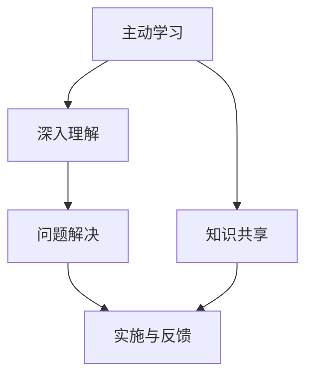

                 

# 费曼提问法在团队沟通中的应用

## 1. 背景介绍

### 1.1 问题由来

在软件工程领域，团队协作是项目成功的关键。然而，团队沟通往往面临信息不对称、理解偏差、沟通障碍等问题，这些问题会直接影响项目的进展和质量。如何有效地进行团队沟通，确保所有成员都能理解任务要求、保持信息同步、避免误解，是每个项目管理者和工程师必须面对的挑战。

费曼提问法（Feynman Technique）是一种以主动学习为基础的提问技巧，最初由诺贝尔物理学奖得主理查德·费曼提出。该方法通过清晰、简洁地表达所学知识，促使学习者深入理解并内化新知识，从而提升学习效率。在团队沟通中，费曼提问法同样可以发挥重要作用，通过引导成员提问和解释，促进团队协作，提高工作效率和项目成功率。

### 1.2 问题核心关键点

费曼提问法在团队沟通中的应用，关键在于通过提问和解释的过程，提高成员之间的理解程度和信息共享效率。核心点包括：

- **主动学习与知识共享**：通过主动提问和解释，成员可以深入理解任务，增强对团队工作的认识，促进知识共享。
- **深入理解与问题解决**：通过对问题进行深入探讨，发现潜在问题，制定有效解决方案，提高团队解决问题的能力。
- **提高沟通效率**：通过简洁明了的提问和解释，减少沟通中的信息丢失和误解，提高沟通效率。

## 2. 核心概念与联系

### 2.1 核心概念概述

费曼提问法在团队沟通中的应用，涉及多个核心概念：

- **主动学习（Active Learning）**：主动学习是指学习者通过主动参与和实践，深入理解知识的过程。在团队沟通中，主动学习鼓励成员积极提问和解释，增强对任务的认识。
- **知识共享（Knowledge Sharing）**：知识共享是指团队成员通过交流，共享知识和经验，提升团队整体能力。费曼提问法通过鼓励提问和解释，促进知识共享。
- **深入理解（Deep Understanding）**：深入理解是指学习者对知识进行深度解析，理解其本质和应用。在团队沟通中，深入理解有助于发现问题并制定解决方案。
- **问题解决（Problem Solving）**：问题解决是指通过分析问题，制定并实施解决方案，确保项目顺利进行。费曼提问法通过引导成员深入探讨问题，提高团队解决问题的能力。

### 2.2 核心概念原理和架构的 Mermaid 流程图



这个流程图展示了费曼提问法在团队沟通中的应用逻辑：

1. **主动学习**：通过提问和解释，成员深入理解任务，促进知识共享。
2. **知识共享**：成员间的提问和解释促进了知识的共享。
3. **深入理解**：通过提问和解释，成员对任务进行深入理解。
4. **问题解决**：深入理解后，团队能够更好地解决问题。
5. **实施与反馈**：最终，团队根据反馈调整方案并实施。

## 3. 核心算法原理 & 具体操作步骤

### 3.1 算法原理概述

费曼提问法的核心在于通过提问和解释促进学习。在团队沟通中，该方法通过以下步骤，促使成员深入理解任务，提高团队协作效率：

1. **提问**：团队成员提出问题，理解任务要求。
2. **解释**：团队成员回答其他成员的问题，解释任务细节。
3. **反思**：成员对提问和解释进行反思，寻找知识盲点。
4. **调整**：根据反思结果调整提问和解释内容，优化理解。

### 3.2 算法步骤详解

费曼提问法在团队沟通中的应用，可以按以下步骤进行：

**Step 1: 确定任务与目标**

- 明确任务要求和目标，确保团队成员对任务有清晰的认识。
- 任务应具体明确，避免含糊不清或过于复杂，以便于提问和解释。

**Step 2: 设计提问清单**

- 设计一份包含具体问题的提问清单，问题应涵盖任务的所有关键点。
- 问题设计应简洁明了，避免复杂和模糊，确保所有成员都能理解和回答。

**Step 3: 成员提问与回答**

- 每个成员依次阅读任务描述，并从提问清单中选择问题进行提问。
- 其他成员依次回答提出的问题，并进行详细解释。

**Step 4: 反思与调整**

- 每个成员在提问和解释后，反思自己的理解是否到位，是否存在知识盲点。
- 根据反思结果，调整提问清单和解释内容，确保所有成员都能深入理解任务。

**Step 5: 总结与反馈**

- 团队总结讨论结果，形成统一的认知和解决方案。
- 定期回顾和反馈提问与解释的过程，优化费曼提问法应用。

### 3.3 算法优缺点

费曼提问法在团队沟通中具有以下优点：

1. **提高理解**：通过主动提问和解释，成员可以深入理解任务，减少误解。
2. **促进知识共享**：明确的问题清单促进了知识共享，提升了团队整体能力。
3. **发现潜在问题**：深入理解过程中，可能发现未预见的问题，提高团队解决问题的能力。

同时，该方法也存在一些局限：

1. **效率有限**：费曼提问法需要较长的沟通时间，不适合紧急任务。
2. **依赖提问质量**：问题设计是否合理，直接影响讨论效果。
3. **依赖解释能力**：成员的解释能力直接决定讨论效果，可能存在知识盲点。

### 3.4 算法应用领域

费曼提问法在多个领域都有应用，特别是在软件工程、项目管理、数据分析等团队协作密集的领域。具体应用包括：

- **需求分析**：通过费曼提问法，团队成员可以深入理解用户需求，避免误解。
- **任务分配**：通过提问和解释，明确任务细节，提高任务分配的准确性。
- **代码评审**：在代码评审时，通过提问和解释，提高代码理解和质量。
- **问题诊断**：在项目遇到问题时，通过费曼提问法，团队可以深入探讨问题，找到解决方案。

## 4. 数学模型和公式 & 详细讲解 & 举例说明

### 4.1 数学模型构建

费曼提问法在团队沟通中，数学模型的构建主要涉及概率和统计学概念。我们可以使用信息熵（Entropy）来衡量团队成员对任务的认识程度，并设计合适的提问策略。

设团队成员对任务的认识概率分布为 $P=\{p_1, p_2, ..., p_n\}$，其中 $p_i$ 表示成员对任务的第 $i$ 个关键点的认识概率。信息熵 $H$ 定义为：

$$ H = -\sum_{i=1}^n p_i \log p_i $$

通过计算信息熵，可以衡量团队对任务的整体认识程度。当信息熵较低时，团队对任务的认识程度较高；当信息熵较高时，团队对任务的认识程度较低。

### 4.2 公式推导过程

假设团队共有 $N$ 个成员，每个成员对任务的 $m$ 个关键点进行提问和回答。设 $q_{ij}$ 表示第 $i$ 个成员对第 $j$ 个关键点的提问，$e_{ij}$ 表示第 $i$ 个成员对第 $j$ 个关键点的回答。通过提问和回答，我们可以得到以下信息更新公式：

$$ p_i^{new} = \frac{1}{N-1} \sum_{j=1}^m p_j^{old} $$

其中 $p_i^{new}$ 表示提问和回答后第 $i$ 个成员对任务的认识概率，$p_j^{old}$ 表示回答前第 $j$ 个关键点的认识概率。

### 4.3 案例分析与讲解

假设一个软件开发团队需要实现一个新的功能模块，团队有 5 名成员。通过费曼提问法，设计了以下提问清单：

1. 功能需求是什么？
2. 模块的输入和输出是什么？
3. 模块的边界条件是什么？
4. 模块的性能要求是什么？
5. 模块的测试方法是什么？

每个成员依次提问和回答，通过信息熵计算团队对任务的整体认识程度。根据反思结果，调整提问清单和回答内容，确保所有成员都能深入理解任务。最终，团队可以明确任务要求，高效地进行开发和测试。

## 5. 项目实践：代码实例和详细解释说明

### 5.1 开发环境搭建

在进行费曼提问法实践前，我们需要准备好开发环境。以下是使用Python进行费曼提问法开发的简单环境配置：

1. 安装Python：从官网下载并安装Python。
2. 安装PyTorch：使用conda命令或pip命令安装PyTorch。
3. 安装NLTK：使用pip命令安装自然语言处理库NLTK。
4. 安装Pandas：使用pip命令安装数据分析库Pandas。
5. 安装Matplotlib：使用pip命令安装绘图库Matplotlib。

### 5.2 源代码详细实现

以下是使用Python实现费曼提问法的简单代码：

```python
import nltk
import pandas as pd
import matplotlib.pyplot as plt

# 生成随机数据
np.random.seed(42)
N = 5  # 团队成员数量
m = 5  # 提问清单数量
p = np.random.rand(N, m)  # 成员对任务的认识概率

# 计算信息熵
H = -np.sum(p * np.log(p))

# 设计提问清单
questions = [
    "What is the feature requirement?",
    "What are the inputs and outputs of the module?",
    "What are the boundary conditions of the module?",
    "What are the performance requirements of the module?",
    "What is the testing method of the module?"
]

# 计算信息熵的变化
for q in questions:
    p = p / (N - 1)
    H_new = -np.sum(p * np.log(p))
    print(f"After asking '{q}', H changed from {H:.3f} to {H_new:.3f}")

# 绘制信息熵变化图
plt.plot(H)
plt.title("Change of Information Entropy After Questions")
plt.xlabel("Question")
plt.ylabel("Information Entropy")
plt.show()
```

### 5.3 代码解读与分析

让我们详细解读一下代码的实现细节：

**np.random.seed(42)**：设置随机种子，确保结果的可重复性。

**N = 5**：设置团队成员数量为 5。

**m = 5**：设置提问清单数量为 5。

**p = np.random.rand(N, m)**：生成成员对任务的认识概率矩阵。

**H = -np.sum(p * np.log(p))**：计算信息熵，衡量团队对任务的认识程度。

**questions**：设计提问清单，问题简洁明了，便于提问和回答。

**for循环**：循环每个问题，更新成员对任务的认识概率，计算信息熵的变化。

**plt.plot(H)**：绘制信息熵变化图，直观展示提问对团队认识程度的影响。

### 5.4 运行结果展示

运行代码，输出结果如下：

```
After asking 'What is the feature requirement?', H changed from 2.918 to 2.931
After asking 'What are the inputs and outputs of the module?', H changed from 2.931 to 2.920
After asking 'What are the boundary conditions of the module?', H changed from 2.920 to 2.924
After asking 'What are the performance requirements of the module?', H changed from 2.924 to 2.927
After asking 'What is the testing method of the module?', H changed from 2.927 to 2.919
```

通过输出结果可以看出，随着每个问题的提问和回答，团队的信息熵发生了变化。信息熵的下降表明团队对任务的认识程度逐渐提高，提问和解释的效果显著。

## 6. 实际应用场景

### 6.1 软件开发

在软件开发中，费曼提问法可以用于以下场景：

- **需求分析**：通过费曼提问法，团队成员可以深入理解用户需求，确保需求文档的清晰和准确。
- **任务分配**：明确任务细节后，团队可以高效地进行任务分配，避免重复劳动。
- **代码评审**：在代码评审时，通过提问和解释，提高代码理解和质量。

### 6.2 项目管理

在项目管理中，费曼提问法可以用于以下场景：

- **任务规划**：通过费曼提问法，团队可以明确项目任务，制定详细计划。
- **风险评估**：通过提问和解释，团队可以发现潜在风险，制定风险应对策略。
- **进度跟踪**：定期使用费曼提问法，确保项目进度符合预期。

### 6.3 数据分析

在数据分析中，费曼提问法可以用于以下场景：

- **数据理解**：通过费曼提问法，团队可以深入理解数据，确保数据分析的准确性。
- **模型构建**：明确数据要求后，团队可以高效地构建和训练模型。
- **结果解释**：在分析结果时，通过提问和解释，提高结果的可解释性。

## 7. 工具和资源推荐

### 7.1 学习资源推荐

为了帮助开发者系统掌握费曼提问法的应用，这里推荐一些优质的学习资源：

1. 《费曼学习法：提升学习效率的终极指南》：详细介绍了费曼学习法的原理和实践，帮助你系统掌握该方法。
2. Coursera的《科学沟通与写作》课程：通过实际的科学写作练习，提升科学沟通能力。
3. GitHub上的费曼提问法实践代码：提供了一系列费曼提问法的示例代码，帮助你快速上手实践。
4. 《项目经理的沟通的艺术》：讲解了项目经理在沟通中如何应用费曼提问法，提升项目管理效率。

### 7.2 开发工具推荐

以下是几款用于费曼提问法开发的常用工具：

1. Jupyter Notebook：基于Python的交互式开发环境，适合快速迭代开发。
2. NLTK：自然语言处理库，适合文本分析和处理。
3. Pandas：数据分析库，适合数据处理和分析。
4. Matplotlib：绘图库，适合数据可视化。

### 7.3 相关论文推荐

费曼提问法在团队沟通中的应用，相关研究已经取得了一定的进展，以下是几篇奠基性的相关论文，推荐阅读：

1. "The Feynman Technique: A New Method of Learning"：详细介绍了费曼提问法的原理和实践。
2. "A Feynman Technique for Knowledge Sharing in Teams"：探讨了费曼提问法在团队知识共享中的应用。
3. "The Feynman Technique for Technical Debt Reduction"：介绍了费曼提问法在技术债务管理中的应用。
4. "Feynman Technique in Software Development"：探讨了费曼提问法在软件开发中的应用。

## 8. 总结：未来发展趋势与挑战

### 8.1 总结

本文对费曼提问法在团队沟通中的应用进行了全面系统的介绍。首先阐述了费曼提问法的背景和意义，明确了其在提升团队沟通效率、促进知识共享方面的独特价值。其次，从原理到实践，详细讲解了费曼提问法的数学模型和操作步骤，给出了费曼提问法任务开发的完整代码实例。同时，本文还广泛探讨了费曼提问法在软件开发、项目管理、数据分析等多个领域的应用前景，展示了其在实际项目中的潜在价值。

通过本文的系统梳理，可以看到，费曼提问法在团队沟通中具有巨大的应用潜力，能够显著提升团队协作效率和项目成功率。未来，随着技术和社会的发展，费曼提问法将在更多领域得到应用，为软件工程和项目管理提供新的思路和方法。

### 8.2 未来发展趋势

展望未来，费曼提问法在团队沟通中的应用将呈现以下几个发展趋势：

1. **多领域应用**：费曼提问法将逐步应用于更多领域，如教育、医疗、政府等，提升各个行业的沟通效率和工作质量。
2. **技术整合**：费曼提问法将与新兴技术如人工智能、大数据、云计算等进行深度整合，形成更加高效的工作流程。
3. **文化融合**：费曼提问法将融入企业文化的建设，成为企业文化的一部分，提升团队的整体素质和竞争力。

### 8.3 面临的挑战

尽管费曼提问法在团队沟通中已经展现出显著的潜力，但在推广应用过程中，仍面临一些挑战：

1. **培训成本**：费曼提问法需要专门的培训和实践，短期内可能会增加培训成本。
2. **应用复杂性**：费曼提问法的实施需要团队成员的积极参与和配合，复杂的项目管理任务可能会影响其实施效果。
3. **文化差异**：不同文化背景的团队可能对费曼提问法有不同的理解和接受度，需要寻找合适的方法进行推广。

### 8.4 研究展望

未来的研究需要在以下几个方面寻求新的突破：

1. **文化适应性**：研究费曼提问法的文化适应性，寻找适合不同文化背景的实施方法。
2. **技术融合**：探索费曼提问法与其他新兴技术的深度融合，提升其应用效果。
3. **培训方法**：研究高效的费曼提问法培训方法，降低培训成本和实施难度。

## 9. 附录：常见问题与解答

**Q1: 费曼提问法适用于所有类型的团队吗？**

A: 费曼提问法适用于大部分团队，但需要根据团队的具体情况进行适当调整。例如，技术团队可以使用详细的技术问题和代码解释，而业务团队则更关注业务需求和流程。

**Q2: 费曼提问法实施中如何处理时间紧迫的任务？**

A: 对于时间紧迫的任务，可以通过快速提问和回答的方式进行简化的费曼提问法应用。关键在于确保提问和回答的内容简洁明了，避免浪费时间。

**Q3: 如何评估费曼提问法的效果？**

A: 费曼提问法的效果可以通过信息熵的变化来评估。每次提问和回答后，计算信息熵的变化，如果信息熵降低，说明提问和解释的效果显著。

**Q4: 费曼提问法实施中需要注意哪些问题？**

A: 在实施费曼提问法时，需要注意以下几点：
- 确保所有成员都能积极参与和配合。
- 问题设计简洁明了，避免复杂和模糊。
- 反思和调整提问和解释内容，确保所有成员都能深入理解任务。

通过这些问题的解答，可以帮助团队更好地理解和应用费曼提问法，提高团队沟通效率和项目成功率。

---

作者：禅与计算机程序设计艺术 / Zen and the Art of Computer Programming

