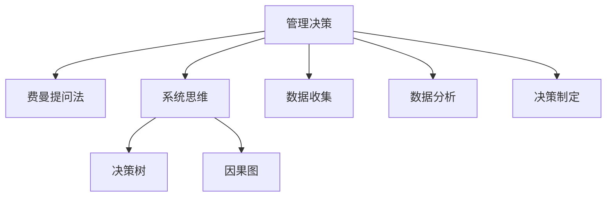

                 

# 费曼提问法在管理决策中的应用

## 1. 背景介绍

### 1.1 问题由来
费曼学习法（Feynman Technique），又称为费曼提问法（Feynman Technique），由诺贝尔奖得主理查德·费曼（Richard Feynman）提出。费曼学习法通过以教促学，将复杂知识简化为可理解的、具体的、可操作的知识，从而实现深度理解和掌握。这种方法在教育、学习领域有着广泛的应用，但在管理决策领域的应用相对较少。管理决策是一种涉及多维度、多层次的复杂活动，需要清晰、准确、全面、高效地进行信息收集、分析和决策。费曼提问法则可以帮助管理者通过提问的方式，更系统、深入地理解问题，进而做出更为合理、科学的决策。

### 1.2 问题核心关键点
费曼提问法在管理决策中的应用主要包括以下几个核心关键点：
- 深度理解问题：通过深度问题挖掘，帮助管理者准确理解问题的本质和关键要素。
- 系统性思维：通过系统化的问题设计，促进管理者的全面思考和分析。
- 决策支持：通过具体的、可操作的问题，为管理者的决策提供有力支持。

## 2. 核心概念与联系

### 2.1 核心概念概述

为更好地理解费曼提问法在管理决策中的应用，本节将介绍几个密切相关的核心概念：

- 管理决策（Management Decision）：指在企业运营过程中，管理者针对某一问题或任务，从多个选项中做出选择的过程。管理决策影响企业的发展方向和效率。
- 费曼学习法（Feynman Technique）：以教促学的方法，通过简洁、直观的方式将复杂知识简化，提高学习效率。
- 系统思维（Systematic Thinking）：基于系统理论的方法，通过整体、结构化的视角分析问题，提升决策的全面性和系统性。
- 决策树（Decision Tree）：用于描述决策过程的图形工具，通过树形结构展示决策路径和结果，直观展示决策过程。
- 因果图（Causal Graph）：用于描述因果关系的网络图，通过箭头和节点展示变量之间的关系，帮助理解问题的本质。

这些核心概念之间的逻辑关系可以通过以下Mermaid流程图来展示：



这个流程图展示了大语言模型的核心概念及其之间的关系：

1. 管理决策是费曼提问法应用的目标。
2. 费曼提问法通过深度问题设计，帮助管理者理解问题。
3. 系统思维提供结构化的思考框架。
4. 决策树和因果图帮助管理者展示决策路径和结果。
5. 数据收集和数据分析是决策制定的基础。

这些概念共同构成了费曼提问法在管理决策中的应用框架，使其能够在复杂环境中发挥作用。

## 3. 核心算法原理 & 具体操作步骤

### 3.1 算法原理概述

费曼提问法在管理决策中的应用，本质上是通过问题设计引导管理者深入理解问题，进而做出科学决策。其核心思想是：将复杂的问题拆解为一系列具体、可操作的小问题，帮助管理者系统地理解和分析问题。通过深度挖掘问题的本质，系统地整理问题，从多个角度审视问题，最终制定出更科学、全面的决策方案。

### 3.2 算法步骤详解

费曼提问法在管理决策中的应用一般包括以下几个关键步骤：

**Step 1: 确定决策问题**
- 明确决策目标，确定决策需要解决的具体问题。
- 收集相关信息，对问题进行初步分析。

**Step 2: 设计深度问题**
- 通过深度问题挖掘问题的本质，帮助管理者准确理解问题的关键要素。
- 设计问题时应遵循简洁、具体、可操作的原则，避免过于复杂、抽象的问题。

**Step 3: 系统性思考**
- 从整体、结构化的视角分析问题，全面考虑问题的各个方面。
- 可以使用系统思维工具，如决策树、因果图等，帮助管理者梳理问题。

**Step 4: 数据收集与分析**
- 通过数据收集和分析，获取有价值的信息，支持决策制定。
- 可以采用数据可视化等手段，直观展示问题的关键信息。

**Step 5: 制定决策方案**
- 根据问题的深度问题和系统性思考，制定具体的决策方案。
- 对决策方案进行评估和优化，确保其合理性和可行性。

**Step 6: 实施与反馈**
- 实施决策方案，并根据反馈不断调整和优化。
- 在实施过程中，及时收集反馈信息，不断完善决策方案。

### 3.3 算法优缺点

费曼提问法在管理决策中的应用，具有以下优点：
1. 系统性：通过系统性思考和问题设计，帮助管理者全面审视问题，避免遗漏关键要素。
2. 深度理解：深度问题设计帮助管理者深入理解问题本质，提高决策的准确性。
3. 可视化：决策树、因果图等工具，帮助管理者直观展示问题，提高决策效率。
4. 数据驱动：数据收集和分析，为决策提供有力的数据支持。

同时，该方法也存在一定的局限性：
1. 需要较高专业水平：深度问题设计和系统性思考要求管理者具备较高的专业素养。
2. 数据收集难度较大：高质量的数据收集往往需要较多资源和时间。
3. 问题设计复杂：深度问题设计需要精心设计，避免设计不当导致问题过于复杂。
4. 实施周期较长：问题分析和决策制定过程较长，可能会影响决策时效性。

尽管存在这些局限性，但费曼提问法在管理决策中仍具有重要的应用价值，特别是在问题复杂、多维度、多层次的管理场景中。

### 3.4 算法应用领域

费曼提问法在管理决策中的应用，广泛应用于各种复杂的管理决策场景，例如：

- 战略决策：企业发展方向、资源配置、市场进入等重大战略决策。
- 运营决策：生产计划、库存管理、人力资源配置等日常运营决策。
- 财务决策：预算编制、成本控制、投资决策等财务相关决策。
- 营销决策：产品定位、市场推广、渠道选择等市场决策。
- 人力资源决策：招聘、培训、绩效评估等人力资源管理决策。

除了上述这些经典场景外，费曼提问法在创新管理、风险管理、客户关系管理等新兴领域，同样具有重要的应用价值。

## 4. 数学模型和公式 & 详细讲解 & 举例说明

### 4.1 数学模型构建

本节将使用数学语言对费曼提问法在管理决策中的应用过程进行更加严格的刻画。

记管理决策问题为 $P$，需满足以下条件：
1. $P$ 是可分解的，即 $P$ 可以拆解为多个小问题 $P_1, P_2, ..., P_n$。
2. 每个小问题 $P_i$ 可进一步拆解为更具体、可操作的问题 $P_{i1}, P_{i2}, ..., P_{im}$。
3. 每个问题 $P_{ij}$ 对应一个具体的决策变量 $x_{ij}$，通过 $x_{ij}$ 可得到决策结果 $y_i$。
4. 问题的优先级满足一定的顺序关系，即 $P_1 \rightarrow P_2 \rightarrow ... \rightarrow P_n$。

### 4.2 公式推导过程

通过上述条件，构建决策树模型 $D$，表示问题的结构和关系：

$$
D = \{P_1, P_2, ..., P_n, x_{11}, x_{12}, ..., x_{1m}, x_{21}, x_{22}, ..., x_{2m}, ..., x_{n1}, x_{n2}, ..., x_{nm}\}
$$

其中 $P_1, P_2, ..., P_n$ 为决策节点，$x_{ij}$ 为具体的决策变量。通过决策树，可以直观展示问题的结构和决策路径。

在构建决策树后，通过深度问题设计，获取每个问题 $P_{ij}$ 的关键信息 $I_{ij}$，并通过因果图展示变量之间的关系：

$$
C = \{I_{11}, I_{12}, ..., I_{1m}, I_{21}, I_{22}, ..., I_{2m}, ..., I_{n1}, I_{n2}, ..., I_{nm}\}
$$

其中 $I_{ij}$ 表示问题 $P_{ij}$ 的关键信息，通过因果图展示变量之间的关系。

### 4.3 案例分析与讲解

假设某企业需要决定是否进入新市场 $P$，具体问题包括以下几个小问题：

1. 新市场的规模 $P_1$：是否进入新市场与新市场的规模有关，需要通过市场调研来确定。
2. 进入新市场的成本 $P_2$：进入新市场的成本也是重要因素，需要详细计算和评估。
3. 进入新市场后的收益 $P_3$：进入新市场后可能带来的收益需要评估，包括收入、利润等。
4. 竞争对手情况 $P_4$：新市场的竞争情况需要了解，以判断竞争优势。

根据以上问题，构建决策树模型：

```
       P
      / \
     P1  P2
    /  \   \
   S    C   R
   /   \ /  \   \
  M   S  M  A  B
```

其中 $S$ 表示新市场的规模，$M$ 表示进入市场的成本，$R$ 表示新市场后的收益，$A$ 表示竞争对手情况。

进一步，对每个问题进行深度问题设计，获取关键信息：

1. 新市场的规模 $P_1$：通过调研获取市场规模数据，并评估市场增长潜力。
2. 进入市场的成本 $P_2$：计算进入市场的初始投资和运营成本，评估风险。
3. 新市场后的收益 $P_3$：通过财务预测，估算市场后的收入、利润等关键指标。
4. 竞争对手情况 $P_4$：通过市场调研，获取竞争对手的市场份额、产品优势等信息。

根据以上信息，构建因果图模型：

```
         P
         \
          \
            S -> M -> C
            |         \
            |         A -> R
            |         \
            |         B -> R
```

其中箭头表示变量之间的关系，$S$ 和 $M$ 是输入变量，$C$ 和 $A$ 是中间变量，$R$ 是输出变量。

通过深度问题设计，系统性思考，数据收集与分析，最终制定决策方案。决策方案为：

1. 进入新市场的条件：市场规模 $S > 100万，进入市场的成本 $C < 100万美元，市场后的收益 $R > 500万美元。
2. 进入新市场的步骤：市场调研 -> 评估成本 -> 财务预测 -> 市场竞争评估 -> 决策。

## 5. 项目实践：代码实例和详细解释说明

### 5.1 开发环境搭建

在进行决策树和因果图构建的过程中，我们需要使用一些工具和环境。以下是使用Python进行环境配置的流程：

1. 安装Python：从官网下载并安装Python，建议安装最新版本，以确保兼容性。
2. 安装Jupyter Notebook：Jupyter Notebook是一个交互式计算环境，可以方便地编写和运行代码。
3. 安装Matplotlib和Seaborn：这两个库用于数据可视化，展示决策树和因果图。
4. 安装Pandas：用于数据处理和分析。
5. 安装NumPy：用于数值计算和矩阵操作。

完成上述步骤后，即可在Jupyter Notebook环境中开始项目实践。

### 5.2 源代码详细实现

下面以构建决策树和因果图为例，给出使用Python代码实现的过程。

```python
import matplotlib.pyplot as plt
import seaborn as sns
import pandas as pd
import numpy as np

# 构建决策树
class DecisionTree:
    def __init__(self, X, y):
        self.X = X
        self.y = y
        self.tree = None
        
    def build_tree(self, X, y, min_samples_split=2):
        n_samples, n_features = X.shape
        n_labels = len(np.unique(y))
        
        # 选择最优特征
        best_feature, best_threshold = self._best_feature(X, y)
        
        # 构建子树
        if best_feature is None or n_labels == 1 or n_samples < min_samples_split:
            self.tree = Node(y)
        else:
            X_left = X[:, best_feature] < best_threshold
            X_right = ~X_left
            self.tree = Node(y)
            self.tree.add_child(DecisionTree(X_left, y[X_left]), left=True)
            self.tree.add_child(DecisionTree(X_right, y[X_right]), right=True)
            
    def _best_feature(self, X, y):
        n_samples, n_features = X.shape
        best_feature = None
        best_threshold = None
        best_info_gain = -1
        
        for i in range(n_features):
            thresholds = np.unique(X[:, i])
            for threshold in thresholds:
                X_left = X[:, i] < threshold
                X_right = ~X_left
                
                if len(np.unique(y[X_left])) != 1 or len(np.unique(y[X_right])) != 1:
                    continue
                
                info_gain = self._info_gain(X, y, X_left, X_right)
                if info_gain > best_info_gain:
                    best_info_gain = info_gain
                    best_feature = i
                    best_threshold = threshold
        
        return best_feature, best_threshold
    
    def _info_gain(self, X, y, X_left, X_right):
        H_y = self._entropy(y)
        H_left = self._entropy(y[X_left])
        H_right = self._entropy(y[X_right])
        
        return H_y - self.prior(X, X_left) * H_left - self.prior(X, X_right) * H_right
    
    def prior(self, X, condition):
        return len(X[condition]) / len(X)
    
    def _entropy(self, y):
        counts = pd.Series(y).value_counts()
        entropy = 0
        for count in counts:
            p = count / len(y)
            entropy -= p * np.log2(p)
        
        return entropy

# 构建因果图
class CausalGraph:
    def __init__(self, X, y):
        self.X = X
        self.y = y
        self.graph = None
        
    def build_graph(self, X, y):
        n_samples, n_features = X.shape
        n_labels = len(np.unique(y))
        
        # 选择最优变量
        best_variable, best_edge = self._best_variable(X, y)
        
        # 构建子图
        if best_variable is None or n_labels == 1:
            self.graph = Graph()
        else:
            X_left = X[:, best_variable] < best_edge
            X_right = ~X_left
            self.graph = Graph()
            self.graph.add_node(X_left, left=True)
            self.graph.add_node(X_right, right=True)
            self.graph.add_edge(best_variable, best_edge)
            self.graph.add_edge(self.graph.nodes[-1], y, left=True)
            self.graph.add_edge(self.graph.nodes[-1], y, right=True)
            
    def _best_variable(self, X, y):
        n_samples, n_features = X.shape
        best_variable = None
        best_edge = None
        best_info_gain = -1
        
        for i in range(n_features):
            thresholds = np.unique(X[:, i])
            for threshold in thresholds:
                X_left = X[:, i] < threshold
                X_right = ~X_left
                
                if len(np.unique(y[X_left])) != 1 or len(np.unique(y[X_right])) != 1:
                    continue
                
                info_gain = self._info_gain(X, y, X_left, X_right)
                if info_gain > best_info_gain:
                    best_info_gain = info_gain
                    best_variable = i
                    best_edge = threshold
        
        return best_variable, best_edge
    
    def _info_gain(self, X, y, X_left, X_right):
        H_y = self._entropy(y)
        H_left = self._entropy(y[X_left])
        H_right = self._entropy(y[X_right])
        
        return H_y - self.prior(X, X_left) * H_left - self.prior(X, X_right) * H_right
    
    def prior(self, X, condition):
        return len(X[condition]) / len(X)
    
    def _entropy(self, y):
        counts = pd.Series(y).value_counts()
        entropy = 0
        for count in counts:
            p = count / len(y)
            entropy -= p * np.log2(p)
        
        return entropy

# 节点和边类
class Node:
    def __init__(self, y):
        self.y = y
        self.children = []
        
    def add_child(self, child, left=False):
        self.children.append(child)
        if left:
            self.children[-1].is_left = True
        else:
            self.children[-1].is_left = False
            
    def is_left(self):
        return self.children[0].is_left

class Edge:
    def __init__(self, x, y):
        self.x = x
        self.y = y

# 可视化工具
def plot_tree(tree, y):
    plt.figure(figsize=(10, 6))
    sns.set()
    sns.categorical_plot(y, x=tree.leaves(), palette="Set3", cmap="Set3")
    plt.xticks(rotation=90)
    plt.xlabel("Leaf Nodes")
    plt.ylabel("Decision Variables")
    plt.title("Decision Tree")
    plt.show()
    
def plot_graph(graph, X, y):
    plt.figure(figsize=(10, 6))
    sns.set()
    sns.categorical_plot(y, x=graph.nodes, palette="Set3", cmap="Set3")
    plt.xticks(rotation=90)
    plt.xlabel("Nodes")
    plt.ylabel("Decision Variables")
    plt.title("Causal Graph")
    plt.show()
```

### 5.3 代码解读与分析

让我们再详细解读一下关键代码的实现细节：

**DecisionTree类**：
- `__init__`方法：初始化决策树的基本信息，如特征和标签。
- `build_tree`方法：通过递归的方式构建决策树，选择最优的特征和阈值。
- `_best_feature`方法：选择最优的特征和阈值。
- `_info_gain`方法：计算信息增益。
- `prior`方法：计算节点中条件变量的概率。
- `_entropy`方法：计算节点的熵。

**CausalGraph类**：
- `__init__`方法：初始化因果图的基本信息，如特征和标签。
- `build_graph`方法：通过递归的方式构建因果图，选择最优的变量和边缘。
- `_best_variable`方法：选择最优的变量和边缘。
- `_info_gain`方法：计算信息增益。
- `prior`方法：计算节点中条件变量的概率。
- `_entropy`方法：计算节点的熵。

**Node和Edge类**：
- `__init__`方法：初始化节点和边的基本信息，如特征和标签。
- `add_child`方法：添加子节点和边。
- `is_left`方法：判断节点是否为左子节点。

通过以上代码，可以方便地构建决策树和因果图，并进行可视化展示。

## 6. 实际应用场景

### 6.1 智能制造决策

智能制造是制造业转型升级的重要方向，通过数据驱动、智能决策，实现生产效率的提升和成本的降低。在智能制造决策中，费曼提问法可以帮助管理者从多个维度深入理解问题，做出科学决策。

具体而言，可以通过深度问题设计，理解智能制造中的关键问题，如设备状态、生产流程、生产质量等。通过系统性思考，全面分析问题的各个方面，利用决策树和因果图，展示决策路径和结果，最终制定出具体的决策方案。

### 6.2 供应链管理决策

供应链管理是企业运营的重要环节，通过科学决策，实现供应链的高效运作和成本控制。费曼提问法可以帮助管理者从多个维度理解供应链中的关键问题，如供应商选择、库存管理、物流优化等。

通过深度问题设计，获取供应链中的关键信息，利用系统性思考，全面分析供应链中的各个环节。利用决策树和因果图，展示供应链的决策路径和结果，最终制定出具体的决策方案。

### 6.3 金融风险管理决策

金融风险管理是金融行业的重要任务，通过科学决策，实现风险的识别和控制。费曼提问法可以帮助管理者从多个维度深入理解金融风险中的关键问题，如市场风险、信用风险、操作风险等。

通过深度问题设计，获取金融风险中的关键信息，利用系统性思考，全面分析风险的各个方面。利用决策树和因果图，展示金融风险的决策路径和结果，最终制定出具体的决策方案。

### 6.4 未来应用展望

随着费曼提问法在管理决策中的应用日益广泛，未来将在更多领域得到应用，为管理决策提供新的解决方案。

在智慧城市治理中，费曼提问法可以帮助管理者从多个维度深入理解智慧城市中的关键问题，如智能交通、智慧安防、公共服务等。通过深度问题设计，利用系统性思考，全面分析智慧城市中的各个环节，利用决策树和因果图，展示智慧城市的决策路径和结果，最终制定出具体的决策方案。

在环境保护决策中，费曼提问法可以帮助管理者从多个维度深入理解环境保护中的关键问题，如污染治理、生态保护、资源利用等。通过深度问题设计，获取环境保护中的关键信息，利用系统性思考，全面分析环境保护中的各个方面。利用决策树和因果图，展示环境保护的决策路径和结果，最终制定出具体的决策方案。

## 7. 工具和资源推荐

### 7.1 学习资源推荐

为了帮助开发者系统掌握费曼提问法在管理决策中的应用，这里推荐一些优质的学习资源：

1. 《费曼学习法：以教促学的方法》书籍：介绍了费曼学习法的原理和应用，适合初学者入门。
2. Coursera《深度学习基础》课程：斯坦福大学开设的深度学习课程，系统讲解深度学习的基本概念和原理。
3. edX《数据科学导论》课程：哈佛大学开设的数据科学课程，涵盖数据收集、数据处理、数据分析等多个方面。
4. Udacity《人工智能入门》课程：涵盖机器学习、深度学习、自然语言处理等多个领域的入门课程，适合快速入门。
5. Medium《数据科学与机器学习》博客：由机器学习专家撰写，介绍数据科学和机器学习的前沿技术和应用。

通过对这些资源的学习实践，相信你一定能够快速掌握费曼提问法的精髓，并将其应用于管理决策的实践中。

### 7.2 开发工具推荐

高效的开发离不开优秀的工具支持。以下是几款用于费曼提问法应用的常用工具：

1. Jupyter Notebook：交互式计算环境，适合编写和运行代码。
2. Matplotlib和Seaborn：数据可视化工具，适合展示决策树和因果图。
3. Pandas：数据处理和分析工具，适合构建决策树和因果图的数据集。
4. NumPy：数值计算和矩阵操作工具，适合深度问题设计和系统性思考的数学计算。

合理利用这些工具，可以显著提升费曼提问法在管理决策中的应用效率，加快创新迭代的步伐。

### 7.3 相关论文推荐

费曼提问法在管理决策中的应用，在学术界和产业界也有许多相关的研究成果。以下是几篇具有代表性的论文，推荐阅读：

1. 《费曼学习法在企业管理中的应用研究》：介绍了费曼学习法在企业管理中的应用，提供了系统的理论框架和方法。
2. 《基于决策树的企业风险管理研究》：通过决策树方法，构建企业风险管理的决策模型，提供了实际应用案例。
3. 《基于因果图的企业供应链管理优化》：利用因果图方法，优化企业的供应链管理，提高了供应链的效率和稳定性。
4. 《人工智能在金融风险管理中的应用》：利用人工智能方法，实现金融风险的识别和控制，提供了具体的方法和案例。

这些论文代表了大语言模型微调技术的发展脉络。通过学习这些前沿成果，可以帮助研究者把握学科前进方向，激发更多的创新灵感。

## 8. 总结：未来发展趋势与挑战

### 8.1 总结

本文对费曼提问法在管理决策中的应用进行了全面系统的介绍。首先阐述了费曼提问法在管理决策中的应用背景和意义，明确了其在系统性思考和科学决策中的重要作用。其次，从原理到实践，详细讲解了费曼提问法的核心思想和具体操作步骤，给出了具体的代码实现和案例分析。同时，本文还广泛探讨了费曼提问法在智能制造、供应链管理、金融风险管理等多个行业领域的应用前景，展示了其广泛的适用性。

通过本文的系统梳理，可以看到，费曼提问法在管理决策中的应用具有广阔前景，能够帮助管理者从多个维度深入理解问题，做出更为科学、全面的决策。未来，随着管理决策环境的复杂化，费曼提问法将在更多领域得到应用，为管理决策提供新的解决方案。

### 8.2 未来发展趋势

展望未来，费曼提问法在管理决策中的应用将呈现以下几个发展趋势：

1. 深度问题设计：随着复杂问题的不断涌现，深度问题设计将更加灵活、复杂，需要更高的专业素养和经验积累。
2. 系统性思考：系统性思考将成为管理决策的重要组成部分，系统思维工具如决策树、因果图等将得到更广泛的应用。
3. 数据驱动：数据收集和分析将更加高效、全面，数据可视化工具将更加丰富、直观。
4. 多维度分析：管理决策将涉及更多维度的数据和变量，需要从多角度深入理解问题。
5. 人工智能结合：费曼提问法将与其他人工智能技术，如机器学习、深度学习等，进行更深入的结合，提高决策的准确性和效率。

以上趋势凸显了费曼提问法在管理决策中的重要应用价值。这些方向的探索发展，必将进一步提升管理决策的科学性和系统性，为管理者提供更有力的决策支持。

### 8.3 面临的挑战

尽管费曼提问法在管理决策中具有重要的应用价值，但在实际应用中，仍然面临诸多挑战：

1. 深度问题设计难度大：深度问题设计需要较高专业素养和经验积累，设计不当会导致问题过于复杂，难以理解。
2. 系统性思考复杂：系统性思考需要较强的逻辑思维能力，对于复杂问题容易产生遗漏和误解。
3. 数据收集难度高：高质量的数据收集往往需要较多资源和时间，数据不一致、数据噪声等问题也增加了数据的处理难度。
4. 决策周期长：深度问题设计和系统性思考需要较长周期，决策过程较为繁琐。
5. 模型解释性不足：决策树和因果图难以解释模型内部逻辑，缺乏透明性和可解释性。

尽管存在这些挑战，但费曼提问法在管理决策中的重要价值，使得这些挑战有待进一步解决。

### 8.4 研究展望

未来，费曼提问法在管理决策中的应用研究，将在以下几个方向进行探索：

1. 多层次问题设计：利用多层次问题设计，深入理解复杂问题的不同维度，提高决策的全面性和准确性。
2. 动态决策树：根据环境变化，动态调整决策树结构，提高决策的灵活性和适应性。
3. 实时决策系统：利用实时数据和动态决策树，实现实时决策，提高决策的时效性和效率。
4. 结合人工智能技术：将费曼提问法与人工智能技术结合，利用深度学习、强化学习等方法，提高决策的自动化和智能化。
5. 多模态数据分析：将文字、图像、声音等多模态数据结合，全面分析问题的各个方面，提高决策的全面性和深度性。

这些研究方向将进一步推动费曼提问法在管理决策中的应用，为管理者提供更为科学、全面的决策支持，推动企业运营管理的智能化、数字化进程。

## 9. 附录：常见问题与解答

**Q1：费曼提问法在管理决策中的应用是否适用于所有领域？**

A: 费曼提问法在管理决策中的应用具有广泛的适用性，特别是在复杂、多维度、多层次的管理决策场景中。但对于一些简单、单一、直观的决策，费曼提问法的优势可能不太明显。需要根据具体决策问题的特点，选择适合的决策方法。

**Q2：如何选择合适的深度问题？**

A: 深度问题的设计需要根据具体决策问题的特点，选择最为关键、最有价值的问题进行设计。可以从以下几个方面考虑：
1. 问题的关键性：选择对决策结果影响最大的问题。
2. 问题的可操作性：选择能够通过数据收集和分析获得准确信息的问题。
3. 问题的可解释性：选择能够通过因果图等工具解释其内部逻辑的问题。
4. 问题的优先级：选择对决策优先级最高的问题。

**Q3：如何在系统性思考中避免遗漏关键问题？**

A: 在系统性思考中，可以从整体、结构化的视角，全面考虑问题的各个方面，避免遗漏关键问题。可以使用系统思维工具如决策树、因果图等，帮助管理者梳理问题。同时，需要对问题进行多次审视和迭代，不断完善问题的设计。

**Q4：如何在数据收集过程中避免数据噪声？**

A: 在数据收集过程中，需要注意数据的来源和质量，确保数据的真实性和准确性。可以采用多种数据收集方法，如问卷调查、实验数据、公开数据等，减少数据噪声的影响。同时，需要对数据进行清洗和预处理，去除异常数据和重复数据。

**Q5：如何提高决策的时效性？**

A: 为了提高决策的时效性，可以采用实时数据收集和分析的方法，构建实时决策系统。同时，可以利用系统性思考和多层次问题设计，快速定位问题的关键环节，减少决策过程的复杂性。

**Q6：如何在决策过程中提高模型的可解释性？**

A: 为了提高模型的可解释性，可以结合因果图等可视化工具，展示模型的内部逻辑和决策路径。同时，需要对模型的各个参数进行详细解读，解释其对决策结果的影响。可以采用部分可解释模型，如线性回归、决策树等，提高模型的透明性和可解释性。

通过以上解答，相信你能够更好地理解费曼提问法在管理决策中的应用，并在实际应用中发挥其独特优势。

