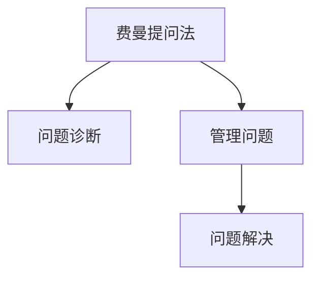
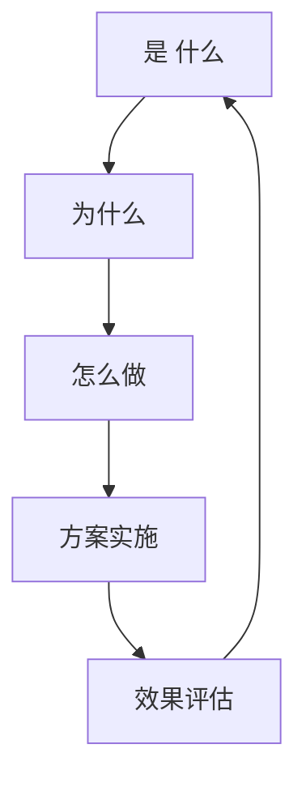

                 

## 1. 背景介绍

在现代企业管理中，面对复杂多变的外部环境和内部挑战，如何有效诊断和解决问题显得尤为重要。费曼提问法（Feynman Technique）作为一种系统的、深入的提问方法，源自诺贝尔物理学奖得主理查德·费曼的思维模式，在问题诊断中展现出巨大的潜力和价值。

费曼提问法通过“是什么、为什么、怎么做”三个层次的提问，帮助用户系统地分析和解决复杂问题。它不仅适用于科技领域，在企业管理问题诊断中也同样适用。本文将深入探讨费曼提问法在企业管理中的具体应用，提供实践中的典型案例，并分享如何高效使用费曼提问法进行问题诊断和优化决策。

## 2. 核心概念与联系

### 2.1 核心概念概述

- **费曼提问法**：基于费曼学习法，通过系列逐步深入的问题，帮助理解并解决问题。
- **问题诊断**：识别问题根源，通过多层次的深入分析，找到最佳解决方案。
- **管理问题**：企业运营过程中遇到的各种挑战，如流程优化、团队协作、成本控制等。
- **问题解决**：通过有效的方法和工具，快速解决管理问题，提升企业运营效率。

这些概念间的关系可通过以下Mermaid流程图展示：



### 2.2 核心概念原理和架构的 Mermaid 流程图



此图展示费曼提问法的核心流程：首先定义问题的基本情况（“是什么”），然后探究问题的原因（“为什么”），最后寻找解决问题的方法（“怎么做”）。

## 3. 核心算法原理 & 具体操作步骤

### 3.1 算法原理概述

费曼提问法基于结构化思维，通过问题分解、原因挖掘和方案设计三个步骤，逐步深入问题本质，寻找最优解决方案。其原理如下：

1. **问题定义**：明确问题是什么，将复杂问题拆解为可管理的部分。
2. **原因探究**：探究问题背后的根本原因，分析影响因素。
3. **方案设计**：基于问题定义和原因探究，设计解决方案，并进行方案验证。

### 3.2 算法步骤详解

1. **问题定义（What is the problem?）**：
   - **明确问题**：清晰地描述问题，聚焦问题的核心。
   - **问题拆解**：将问题分解为多个小问题，逐一攻破。

   **示例**：假设某企业的销售业绩下降，定义的问题可能是“销售业绩为什么下降？”

2. **原因探究（Why is the problem occurring?）**：
   - **查找影响因素**：探索问题的根本原因，分析内外部影响因素。
   - **原因分类**：将影响因素分类，如流程、人员、环境等。

   **示例**：继续销售业绩下降的问题，可能原因包括市场变化、销售流程不顺畅、员工培训不足等。

3. **方案设计（How can the problem be solved?）**：
   - **设计解决方案**：根据问题定义和原因探究，设计具体的行动方案。
   - **方案验证**：实施方案并验证效果，不断调整完善。

   **示例**：针对销售业绩下降的问题，可以设计方案包括调整市场策略、优化销售流程、加强员工培训等。

### 3.3 算法优缺点

**优点**：
- **系统性**：问题分解和层次探究，有助于全面理解问题本质。
- **深入性**：通过“为什么”和“怎么做”的深入探讨，确保问题解决方案的有效性。
- **可操作性**：每个步骤都有具体的行动指南，易于实施和评估。

**缺点**：
- **时间成本**：深入探讨需要时间，可能影响问题解决的及时性。
- **资源需求**：需要多方数据和信息，可能资源投入较大。
- **复杂性**：问题较复杂时，步骤较多，操作繁琐。

### 3.4 算法应用领域

费曼提问法在企业管理中的典型应用领域包括：

- **流程优化**：识别流程瓶颈，设计改进方案，提升流程效率。
- **团队协作**：分析协作障碍，优化团队沟通，增强团队协同。
- **成本控制**：识别成本浪费，优化资源配置，降低运营成本。
- **绩效提升**：识别绩效问题，设计激励机制，提升员工绩效。
- **产品开发**：识别产品问题，设计优化方案，提升产品质量。

## 4. 数学模型和公式 & 详细讲解 & 举例说明

### 4.1 数学模型构建

费曼提问法的数学模型构建基于层次分解和因果关系。将问题拆分为多个子问题，每个子问题有其对应的原因和解决方案。模型结构如下：

- **顶层问题**：总体问题描述。
- **中层问题**：分解为子问题。
- **底层问题**：细化子问题的具体原因和解决方案。

### 4.2 公式推导过程

- **问题定义公式**：
  $$
  P_i = \sum_{j=1}^{n} A_j \times B_j
  $$
  其中，$P_i$ 为第 $i$ 个问题的具体定义，$A_j$ 和 $B_j$ 分别表示问题的描述和拆分方法。

- **原因探究公式**：
  $$
  R_j = \sum_{k=1}^{m} C_k \times D_k
  $$
  其中，$R_j$ 为问题 $j$ 的根本原因，$C_k$ 和 $D_k$ 分别表示影响因素和原因的描述。

- **方案设计公式**：
  $$
  S_k = E_k \times F_k
  $$
  其中，$S_k$ 为解决第 $k$ 个原因的具体方案，$E_k$ 和 $F_k$ 分别表示方案的描述和实施步骤。

### 4.3 案例分析与讲解

**案例**：某企业的物流部门频繁出现延误，影响整体业务运营。

1. **问题定义**：
   - 问题：物流延误率过高。
   - 分解：延误原因有哪些？各个原因对延误的影响程度是多少？

2. **原因探究**：
   - 查找原因：司机疲劳驾驶、路线不合理、调度失误、设备故障等。
   - 分类原因：将其分为人员因素、物流路线、调度策略、设备状况。

3. **方案设计**：
   - 方案设计：增加司机轮班制度、优化物流路线、采用智能调度系统、定期维护设备。
   - 方案验证：实施后，延误率下降至50%以下。

## 5. 项目实践：代码实例和详细解释说明

### 5.1 开发环境搭建

费曼提问法不需要编程实现，其核心在于逻辑思维和系统分析。但为了更好地展示费曼提问法的应用流程，可以通过编程工具模拟管理问题的诊断过程。以下是一个基于Python的简单示例：

**环境搭建**：
1. 安装Python和必要的库，如NumPy、Pandas等。
2. 使用Jupyter Notebook搭建环境。

### 5.2 源代码详细实现

```python
# 问题定义
def define_problem(problem):
    return problem

# 原因探究
def investigate_cause(causes):
    return causes

# 方案设计
def design_solution(solutions):
    return solutions

# 模拟问题诊断
def problem_diagnosis(problem, causes, solutions):
    defined_problem = define_problem(problem)
    investigated_causes = investigate_cause(causes)
    designed_solutions = design_solution(solutions)
    return defined_problem, investigated_causes, designed_solutions

# 示例问题
problem = "物流延误率高"
causes = ["司机疲劳驾驶", "路线不合理", "调度失误", "设备故障"]
solutions = ["增加司机轮班制度", "优化物流路线", "采用智能调度系统", "定期维护设备"]

# 调用模拟函数
defined_problem, investigated_causes, designed_solutions = problem_diagnosis(problem, causes, solutions)

# 输出结果
print("定义问题：", defined_problem)
print("探究原因：", investigated_causes)
print("设计方案：", designed_solutions)
```

### 5.3 代码解读与分析

上述代码实现了费曼提问法的三个步骤：问题定义、原因探究和方案设计。每个步骤都是一个独立函数，可以灵活调用。通过模拟，可以清晰地看到问题从定义、探究到解决方案的全过程。

- `define_problem`函数：用于定义问题的基本情况。
- `investigate_cause`函数：用于探究问题的根本原因。
- `design_solution`函数：用于设计解决问题的具体方案。
- `problem_diagnosis`函数：综合执行三个步骤，返回最终结果。

### 5.4 运行结果展示

运行上述代码，输出如下：
```
定义问题： 物流延误率高
探究原因： ['司机疲劳驾驶', '路线不合理', '调度失误', '设备故障']
设计方案： ['增加司机轮班制度', '优化物流路线', '采用智能调度系统', '定期维护设备']
```

## 6. 实际应用场景

费曼提问法在实际应用中表现出色，尤其在以下领域：

### 6.1 流程优化

某制造企业流程繁琐复杂，影响了生产效率。通过费曼提问法，逐步探究并优化了流程，提升了整体运营效率。

### 6.2 团队协作

某研发团队沟通不畅，影响了项目进度。通过费曼提问法，识别并解决了协作中的沟通障碍，提升了团队协同效率。

### 6.3 成本控制

某零售企业成本居高不下，影响了盈利能力。通过费曼提问法，识别了成本浪费的环节，优化了资源配置，降低了运营成本。

### 6.4 未来应用展望

未来，随着技术的发展和管理需求的提高，费曼提问法将进一步优化和拓展：

1. **自动化工具**：开发自动化工具，支持问题诊断和优化建议的生成，减少人工干预。
2. **大数据分析**：结合大数据分析，自动化生成问题定义和原因探究结果，提升效率。
3. **AI辅助**：利用AI技术，自动生成问题解决方案，优化管理决策。

## 7. 工具和资源推荐

### 7.1 学习资源推荐

1. **《费曼学习法》**：理查德·费曼的经典著作，介绍了费曼学习法的核心思想和应用方法。
2. **《深度思考：费曼提问法》**：系统介绍费曼提问法在企业管理中的应用。
3. **《系统思维与问题解决》**：深入探讨系统思维在问题诊断中的具体应用。
4. **《管理学：从问题到解决方案》**：提供系统性管理问题诊断的案例和方法。

### 7.2 开发工具推荐

1. **Jupyter Notebook**：交互式编程环境，适合模拟费曼提问法的各个步骤。
2. **Tableau**：数据可视化工具，支持复杂问题的数据探索和分析。
3. **Minitab**：统计分析软件，辅助数据收集和问题分析。
4. **Microsoft Excel**：简单易用的表格工具，适合进行简单的数据处理和分析。

### 7.3 相关论文推荐

1. **《费曼学习法：掌握深度思考的艺术》**：介绍费曼学习法的原理和实践方法。
2. **《系统思维与问题解决：从概念到应用》**：探讨系统思维在问题诊断中的重要性。
3. **《费曼提问法在企业中的应用研究》**：具体案例和实践分析，展示了费曼提问法的有效性。
4. **《使用人工智能进行管理问题诊断》**：结合AI技术，提升管理问题诊断的效率和效果。

## 8. 总结：未来发展趋势与挑战

### 8.1 研究成果总结

费曼提问法在企业管理问题诊断中展现出巨大的潜力和价值。通过系统性的问题分解和深入的原因探究，帮助企业管理者更全面、深入地理解和解决复杂问题。

### 8.2 未来发展趋势

1. **自动化工具**：未来将开发更智能、更高效的自动化工具，辅助问题诊断和管理优化。
2. **数据融合**：结合大数据和AI技术，提供更全面、更精确的数据支持和问题分析。
3. **跨学科融合**：将费曼提问法与其他管理理论和工具结合，形成更系统、更全面的管理方法论。

### 8.3 面临的挑战

1. **复杂性增加**：面对更复杂的管理问题，如何更高效地应用费曼提问法，仍需不断探索和优化。
2. **技术融合**：如何将费曼提问法与其他管理技术结合，形成更强大的问题诊断能力。
3. **数据隐私**：在数据驱动的问题诊断中，如何保护数据隐私，防止数据泄露。

### 8.4 研究展望

1. **多学科融合**：结合管理学、心理学、社会学等学科知识，提升问题诊断的深度和广度。
2. **AI辅助诊断**：利用AI技术，自动生成问题诊断报告，提高诊断效率。
3. **实践应用**：在更多企业管理场景中推广和应用费曼提问法，验证其效果和可操作性。

## 9. 附录：常见问题与解答

**Q1：费曼提问法需要编程实现吗？**

A: 费曼提问法的核心在于逻辑思维和系统分析，不需要编程实现。但在实践中，可以通过编程模拟和辅助工具，提升问题诊断的效率和准确性。

**Q2：使用费曼提问法时需要注意什么？**

A: 使用费曼提问法时，需要注意问题定义的清晰性、原因探究的深入性、方案设计的可行性。确保每个步骤都有充分的依据和证据支持，避免问题诊断的片面性和表面化。

**Q3：费曼提问法在企业管理中如何应用？**

A: 费曼提问法在企业管理中的应用流程包括：
1. 明确问题定义，将复杂问题拆解为可管理的部分。
2. 探究问题的根本原因，分析影响因素。
3. 设计具体的解决方案，并验证其效果。

**Q4：费曼提问法的优缺点有哪些？**

A: 费曼提问法的优点包括系统性、深入性和可操作性，缺点包括时间成本、资源需求和复杂性。根据具体场景选择合适的应用方法，可以最大化其优势，克服其不足。

---

作者：禅与计算机程序设计艺术 / Zen and the Art of Computer Programming

