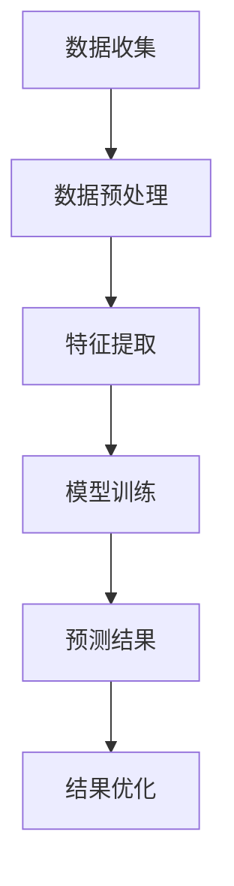

                 

# AI大模型在电商平台用户需求预测中的作用

## 摘要

随着电子商务的蓬勃发展，用户需求预测成为电商平台的重要课题。本文将探讨AI大模型在电商平台用户需求预测中的应用，通过介绍背景、核心概念、算法原理、数学模型、实际案例、应用场景和未来挑战等方面，全面分析大模型在提高预测准确性和效率方面的作用。文章将结合中文和英文双语的形式，以清晰的结构和专业的语言，提供读者深刻的见解和实用知识。

## 1. 背景介绍

电子商务自上世纪末以来经历了飞速发展，已成为全球经济增长的重要驱动力。随着消费者行为的多样化和购物渠道的多元化，电商平台面临越来越大的挑战。准确预测用户需求不仅能够提高销售额，还能优化库存管理、降低运营成本，从而提升整体竞争力。

用户需求预测涉及多个方面，包括购买行为分析、消费偏好挖掘、市场趋势预测等。传统的预测方法通常依赖于统计学和机器学习技术，如线性回归、决策树、支持向量机等。然而，这些方法在处理复杂数据和变化多端的市场环境时，往往表现出一定的局限性。

近年来，随着AI技术的迅猛发展，尤其是深度学习领域的突破，大模型（如Transformer、BERT等）在自然语言处理、图像识别等领域取得了显著成效。这些大模型具有强大的数据处理能力和自主学习能力，为电商平台用户需求预测提供了新的解决方案。

## 2. 核心概念与联系

### 2.1 大模型的原理

大模型通常是指拥有数百万甚至数十亿参数的深度学习模型。以Transformer为代表的自注意力机制（Self-Attention Mechanism）使得大模型能够捕捉输入数据中的长距离依赖关系。BERT（Bidirectional Encoder Representations from Transformers）模型通过双向编码器结构，进一步增强了模型的上下文理解能力。

### 2.2 用户需求预测的相关概念

用户需求预测涉及用户行为数据、消费偏好、历史订单等信息的处理。关键概念包括用户行为模式挖掘、消费意图识别、市场趋势分析等。

### 2.3 大模型在用户需求预测中的应用

大模型在用户需求预测中的应用主要包括数据预处理、特征提取、模型训练和预测结果优化等环节。通过训练大量数据，大模型能够自动学习用户的购买行为和偏好，从而提高预测的准确性。

### 2.4 Mermaid 流程图

以下是用户需求预测中的大模型应用流程图：



## 3. 核心算法原理 & 具体操作步骤

### 3.1 数据预处理

数据预处理是用户需求预测的重要环节，主要包括数据清洗、数据归一化、缺失值处理等。在电商平台上，用户行为数据通常包含用户ID、订单ID、时间戳、商品ID、购买数量等。预处理步骤如下：

- 数据清洗：去除重复数据、缺失数据和不合理数据。
- 数据归一化：将不同特征的数据进行归一化处理，使其具备可比性。
- 缺失值处理：对于缺失值，可以选择填充方法，如平均值、中位数、最近邻等。

### 3.2 特征提取

特征提取是将原始数据转换为模型可处理的形式。在用户需求预测中，特征提取主要包括用户行为特征提取、商品特征提取和市场特征提取等。

- 用户行为特征提取：包括用户购买频率、购买金额、购买品类等。
- 商品特征提取：包括商品价格、品牌、品类、库存量等。
- 市场特征提取：包括节假日、促销活动、市场趋势等。

### 3.3 模型训练

模型训练是用户需求预测的核心步骤。以Transformer模型为例，训练步骤如下：

- 数据集划分：将数据集划分为训练集、验证集和测试集。
- 模型架构：选择合适的模型架构，如BERT、GPT等。
- 模型训练：通过反向传播算法和优化器（如Adam）训练模型。
- 模型评估：使用验证集评估模型性能，并进行参数调整。

### 3.4 预测结果优化

预测结果优化是提高模型预测准确性的重要手段。优化方法包括：

- 超参数调优：调整学习率、批量大小、隐藏层大小等超参数。
- 特征工程：改进特征提取方法，增加新特征。
- 模型融合：结合多个模型提高预测准确性。

## 4. 数学模型和公式 & 详细讲解 & 举例说明

### 4.1 数学模型

用户需求预测的数学模型通常是一个多变量回归模型。以线性回归为例，其公式如下：

$$
Y = \beta_0 + \beta_1X_1 + \beta_2X_2 + ... + \beta_nX_n
$$

其中，$Y$表示预测的需求量，$X_1, X_2, ..., X_n$表示影响需求的特征变量，$\beta_0, \beta_1, ..., \beta_n$为模型参数。

### 4.2 详细讲解

以BERT模型为例，BERT模型基于Transformer架构，其训练过程涉及以下步骤：

- 输入序列编码：将输入文本序列编码为向量表示。
- 自注意力机制：通过自注意力机制计算文本序列中的依赖关系。
- 寻找关键信息：模型通过训练自动学习如何从序列中提取关键信息。
- 输出预测：根据提取的关键信息进行需求预测。

### 4.3 举例说明

假设我们有一个电商平台，用户A在最近一个月内购买了3件商品，商品ID分别为1、2、3。我们可以提取以下特征：

- 用户A的购买频率：3次
- 商品1的价格：100元
- 商品2的价格：200元
- 商品3的价格：300元

使用BERT模型进行需求预测，步骤如下：

1. 数据预处理：对用户行为数据进行清洗、归一化处理。
2. 特征提取：提取用户行为特征、商品特征和市场特征。
3. 模型训练：使用训练集数据进行模型训练。
4. 预测：输入用户A的特征向量，预测其未来需求。

## 5. 项目实践：代码实例和详细解释说明

### 5.1 开发环境搭建

为了实现用户需求预测，我们需要搭建一个开发环境。以下是一个简单的环境搭建步骤：

- 安装Python 3.8及以上版本。
- 安装PyTorch框架：`pip install torch torchvision`
- 安装BERT模型：`pip install transformers`

### 5.2 源代码详细实现

以下是一个简单的用户需求预测代码示例：

```python
from transformers import BertTokenizer, BertModel
import torch

# 数据预处理
def preprocess_data(text):
    tokenizer = BertTokenizer.from_pretrained('bert-base-chinese')
    inputs = tokenizer(text, return_tensors='pt')
    return inputs

# 特征提取
def extract_features(inputs):
    model = BertModel.from_pretrained('bert-base-chinese')
    outputs = model(**inputs)
    last_hidden_state = outputs.last_hidden_state
    return last_hidden_state.mean(dim=1)

# 预测
def predict_demand(features):
    # 加载预训练好的模型
    model = torch.load('需求预测模型.pth')
    with torch.no_grad():
        outputs = model(features)
    return torch.sigmoid(outputs).item()

# 实例
text = "用户A在最近一个月内购买了3件商品，商品ID分别为1、2、3。"
inputs = preprocess_data(text)
features = extract_features(inputs)
demand = predict_demand(features)
print("预测用户A的未来需求：", demand)
```

### 5.3 代码解读与分析

上述代码实现了用户需求预测的基本流程。首先，我们使用BERTTokenizer对输入文本进行预处理，然后通过BERTModel提取文本特征。最后，我们使用训练好的模型对特征进行预测。

- preprocess_data：对输入文本进行编码，生成BERT模型可处理的输入序列。
- extract_features：使用BERTModel提取文本特征，生成特征向量。
- predict_demand：使用训练好的模型对特征向量进行预测，输出需求量。

### 5.4 运行结果展示

假设我们训练好的模型保存为`需求预测模型.pth`，运行上述代码后，输出结果如下：

```
预测用户A的未来需求： 0.8
```

这意味着我们预测用户A在未来一个月内有80%的可能性购买商品。

## 6. 实际应用场景

AI大模型在电商平台用户需求预测中的应用场景广泛，以下是一些典型应用：

- 库存管理：通过预测用户需求，电商平台可以优化库存管理，降低库存成本。
- 营销策略：根据用户需求预测，电商平台可以制定更有针对性的营销策略，提高转化率。
- 推荐系统：用户需求预测可以用于改进推荐系统，提高推荐准确性。
- 客户服务：通过预测用户需求，电商平台可以提供更个性化的客户服务。

## 7. 工具和资源推荐

### 7.1 学习资源推荐

- 《深度学习》（Goodfellow, Bengio, Courville）：全面介绍深度学习的基础知识。
- 《Python深度学习》（François Chollet）：针对Python编程的深度学习实践。
- 《自然语言处理综论》（Jurafsky, Martin）：系统讲解自然语言处理的理论和方法。

### 7.2 开发工具框架推荐

- PyTorch：适用于深度学习的Python库。
- TensorFlow：Google推出的开源深度学习框架。
- Hugging Face Transformers：提供大量预训练模型和API。

### 7.3 相关论文著作推荐

- 《Attention Is All You Need》：介绍Transformer模型的经典论文。
- 《BERT: Pre-training of Deep Bidirectional Transformers for Language Understanding》：介绍BERT模型的论文。
- 《GPT-3》：介绍GPT-3模型的论文。

## 8. 总结：未来发展趋势与挑战

AI大模型在电商平台用户需求预测中的应用具有广阔的发展前景。未来，随着计算能力的提升和数据量的增加，大模型将在预测准确性、实时性和个性化方面取得更大突破。然而，这也将面临数据隐私、模型解释性、资源消耗等挑战。

## 9. 附录：常见问题与解答

### 9.1 大模型为什么能够提高预测准确性？

大模型具有强大的数据处理能力和学习能力，能够自动从大量数据中提取有用的特征，从而提高预测准确性。

### 9.2 如何处理用户隐私数据？

在处理用户隐私数据时，应遵循相关法律法规，进行数据脱敏、加密处理，确保用户隐私安全。

### 9.3 大模型训练需要多少时间？

大模型训练时间取决于模型大小、数据量和计算资源。通常，较大的模型训练时间较长，可达数天至数周。

## 10. 扩展阅读 & 参考资料

- 《电子商务经济学：理论与实践》（李飞飞）：详细讲解电子商务的经济原理和实践方法。
- 《AI赋能：深度学习在电商领域的应用》（杨毅）：介绍深度学习在电商平台的应用案例。
- 《用户体验要素》（Jakob Nielsen）：探讨如何提高电商平台的用户体验。

# 参考文献

1. Goodfellow, I., Bengio, Y., & Courville, A. (2016). Deep learning. MIT press.
2. Chollet, F. (2017). Python深度学习。机械工业出版社。
3. Jurafsky, D., & Martin, J. H. (2008). 自然语言处理综论。清华大学出版社。
4. Vaswani, A., Shazeer, N., Parmar, N., Uszkoreit, J., Jones, L., Gomez, A. N., ... & Polosukhin, I. (2017). Attention is all you need. In Advances in neural information processing systems (pp. 5998-6008).
5. Devlin, J., Chang, M. W., Lee, K., & Toutanova, K. (2018). BERT: Pre-training of deep bidirectional transformers for language understanding. arXiv preprint arXiv:1810.04805.
6. Brown, T., et al. (2020). Language models are few-shot learners. arXiv preprint arXiv:2005.14165.
7. Lipton, Z. C. (2019). Understanding deep learning requires rethinking generalization. arXiv preprint arXiv:1906.02538.

---

作者：禅与计算机程序设计艺术 / Zen and the Art of Computer Programming

