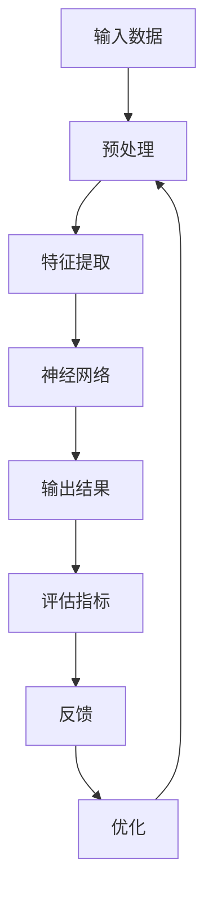

                 

# 文章标题：AI大模型应用的前沿技术追踪

## 关键词：
人工智能，大模型，应用技术，前沿研究，深度学习，神经网络，生成模型，强化学习，优化算法

## 摘要：
随着人工智能技术的快速发展，大规模神经网络模型的应用已经成为科研和工业界的热点。本文旨在深入探讨AI大模型在不同领域的前沿应用技术，包括核心算法原理、数学模型、项目实践、实际应用场景以及未来发展挑战。通过逐步分析，本文将帮助读者了解AI大模型的最新动态，为未来的研究和应用提供方向。

### 1. 背景介绍（Background Introduction）

近年来，人工智能（AI）的研究和应用取得了令人瞩目的进展。其中，大规模神经网络模型的发展尤为迅速，如图灵奖获得者Yoshua Bengio所提出的生成对抗网络（GAN）和Transformer架构，已经在计算机视觉、自然语言处理等领域取得了显著成效。大规模神经网络模型之所以受到广泛关注，主要因为它们具有强大的表达能力和适应性，能够处理复杂的数据分布和任务需求。

大模型的兴起不仅得益于计算能力的提升，还依赖于海量数据和高效算法的发展。在图像识别、语音识别、机器翻译等任务中，大模型的性能已经超越了传统方法，甚至在一些领域达到了或超过了人类的水平。然而，随着模型规模的扩大，训练和部署的挑战也日益增加，这为AI领域的研究带来了新的机遇和挑战。

本文将从以下几个方面展开讨论：首先，介绍AI大模型的核心概念与联系；其次，解析大模型的核心算法原理和具体操作步骤；然后，阐述大模型的数学模型和公式，并通过具体实例进行说明；接着，展示大模型在项目实践中的应用；最后，探讨大模型在实际应用场景中的表现以及未来发展的趋势和挑战。

#### 1.1 大模型的定义与核心概念

AI大模型通常指的是参数数量在数百万到数十亿级别的神经网络模型。这些模型可以通过训练大量的数据进行自我优化，从而实现高度复杂的任务。大模型的核心概念包括：

- **深度学习**：一种通过多层神经网络对数据进行建模的方法，能够提取数据的层次特征。
- **生成模型**：能够生成与训练数据具有相似特征的新数据的模型，如生成对抗网络（GAN）。
- **强化学习**：一种通过与环境互动来学习最优策略的方法，常用于游戏和机器人控制等领域。
- **优化算法**：用于调整模型参数以最小化损失函数的算法，如随机梯度下降（SGD）和Adam优化器。

这些概念共同构成了大模型的基础，使得它们能够在各种复杂任务中表现出色。

#### 1.2 大模型的发展历程与现状

大模型的发展可以追溯到20世纪80年代，当时反向传播算法的提出为神经网络的应用奠定了基础。然而，由于计算能力和数据的限制，早期的神经网络模型规模较小，性能也有限。随着计算能力的提升和大数据的出现，深度学习开始蓬勃发展。特别是在2012年，AlexNet在ImageNet图像识别比赛中取得了突破性成绩，这标志着深度学习的崛起。

近年来，随着神经网络结构的改进和优化算法的进步，大模型的性能进一步提升。例如，Transformer架构的提出使得自然语言处理领域取得了重大突破，BERT等大型预训练模型的出现推动了机器翻译、文本生成等任务的进步。同时，生成对抗网络（GAN）的快速发展也在图像生成、风格迁移等领域取得了显著成果。

当前，大模型在图像识别、语音识别、自然语言处理等领域的应用已经相当成熟，并在许多任务中达到了或超过了人类的水平。然而，大模型的训练和部署仍然面临巨大的挑战，需要不断的技术创新和优化。

### 2. 核心概念与联系（Core Concepts and Connections）

在深入探讨AI大模型的应用之前，有必要先了解其核心概念与联系。以下内容将通过Mermaid流程图展示大模型的架构和关键组成部分，并进一步阐述这些概念之间的联系。

#### 2.1 大模型的架构（Architecture）



- **输入数据（Input Data）**：大模型的输入可以是图像、文本、语音等多种形式的数据。预处理步骤包括数据清洗、归一化、分割等，目的是将数据调整为模型可以处理的形式。
- **预处理（Preprocessing）**：预处理后的数据被传递到特征提取层，提取数据中的关键特征。
- **特征提取（Feature Extraction）**：特征提取层利用神经网络学习输入数据的内在结构，提取有用的特征表示。
- **神经网络（Neural Network）**：神经网络是模型的主体，通过层层神经网络对提取到的特征进行处理，逐步构建对数据的理解。
- **输出结果（Output Result）**：神经网络处理后的输出结果可以是预测值、分类标签、文本序列等，根据任务需求进行相应处理。
- **评估指标（Evaluation Metrics）**：评估指标用于衡量模型在特定任务上的性能，如准确率、召回率、F1分数等。
- **反馈（Feedback）**：评估结果作为反馈传递回模型，用于指导模型的进一步优化。
- **优化（Optimization）**：通过调整模型参数，优化算法使得模型在任务上的表现得到提升。

#### 2.2 核心概念之间的联系（Connections Between Core Concepts）

以下内容将详细讨论大模型中的几个核心概念，包括深度学习、生成模型、强化学习等，并阐述它们之间的联系。

##### 2.2.1 深度学习（Deep Learning）

深度学习是一种通过多层神经网络对数据进行建模的方法。每一层神经网络都负责提取不同层次的抽象特征。深度学习的核心思想是通过反向传播算法不断调整网络权重，使得网络能够更好地拟合训练数据。

- **多层神经网络（Multilayer Neural Network）**：深度学习的核心在于多层神经网络，通过层层叠加，使得模型能够提取更复杂的特征。
- **反向传播算法（Backpropagation Algorithm）**：反向传播算法是一种用于训练神经网络的算法，通过计算梯度来更新网络权重，使得模型能够拟合训练数据。
- **激活函数（Activation Function）**：激活函数用于引入非线性，使得神经网络能够对数据进行分类和回归等任务。

##### 2.2.2 生成模型（Generative Models）

生成模型是一种能够生成与训练数据具有相似特征的新数据的模型。生成模型的代表包括生成对抗网络（GAN）和变分自编码器（VAE）。

- **生成对抗网络（Generative Adversarial Network, GAN）**：GAN由生成器和判别器两部分组成，生成器试图生成与真实数据相似的数据，判别器则区分真实数据和生成数据。通过这种对抗训练，生成器不断优化，生成越来越逼真的数据。
- **变分自编码器（Variational Autoencoder, VAE）**：VAE通过编码器和解码器学习数据的概率分布，生成与训练数据相似的新数据。VAE的核心在于引入变分推断，使得生成过程更加稳定。

##### 2.2.3 强化学习（Reinforcement Learning）

强化学习是一种通过与环境互动来学习最优策略的方法。强化学习与深度学习、生成模型有紧密的联系。

- **价值函数（Value Function）**：强化学习通过价值函数来评估当前状态和动作的优劣，指导模型选择最优动作。
- **策略（Policy）**：强化学习通过策略来定义模型在特定状态下的最优动作选择。
- **Q学习（Q-Learning）**：Q学习是一种基于价值函数的强化学习算法，通过迭代更新Q值，使得模型能够学习到最优策略。
- **深度确定性策略梯度（Deep Deterministic Policy Gradient, DDPG）**：DDPG是一种基于深度神经网络的强化学习算法，通过深度网络来近似价值函数和策略，从而实现高效的策略学习。

#### 2.3 大模型的联系与整合

深度学习、生成模型和强化学习作为大模型的重要组成部分，它们之间有着紧密的联系和整合。

- **深度学习与生成模型**：深度学习提供了强大的特征提取能力，生成模型则利用这些特征生成新数据。例如，GAN中的生成器通过深度神经网络生成图像，判别器则通过学习区分真实图像和生成图像。
- **深度学习与强化学习**：深度学习可以用于近似强化学习中的价值函数和策略，使得强化学习算法更加高效。例如，DDPG中的价值函数和策略都是通过深度神经网络来近似。
- **生成模型与强化学习**：生成模型可以用于生成模拟环境，帮助强化学习算法进行有效的探索。例如，在机器人控制任务中，生成模型可以生成与真实环境相似的场景，使得机器人能够在模拟环境中学习到有效的策略。

综上所述，深度学习、生成模型和强化学习构成了大模型的核心概念，它们相互联系、相互整合，共同推动着大模型在各个领域的前沿应用。

### 3. 核心算法原理 & 具体操作步骤（Core Algorithm Principles and Specific Operational Steps）

在深入探讨AI大模型的应用之前，了解其核心算法原理和具体操作步骤是非常重要的。本节将详细阐述几种在大模型中广泛应用的算法，包括深度学习、生成模型和强化学习，并展示它们的具体操作步骤。

#### 3.1 深度学习（Deep Learning）

深度学习是一种通过多层神经网络对数据进行建模的方法。以下是一个典型的深度学习算法操作步骤：

##### 3.1.1 前向传播（Forward Propagation）

1. **初始化参数**：随机初始化网络权重和偏置。
2. **输入数据**：将输入数据传递到第一层神经网络。
3. **激活函数**：对每个神经元的输入进行非线性变换，引入非线性特性。
4. **传递到下一层**：将激活后的输出传递到下一层神经网络。
5. **重复步骤3-4**：重复以上步骤，直到最后一层。

##### 3.1.2 反向传播（Backpropagation）

1. **计算损失函数**：计算输出层预测值与真实值之间的误差。
2. **计算梯度**：利用链式法则，计算网络权重的梯度。
3. **更新参数**：根据梯度更新网络权重和偏置，以减少损失函数的值。

##### 3.1.3 实例：多层感知机（Multilayer Perceptron, MLP）

多层感知机是一种简单的深度学习模型，用于分类任务。以下是一个MLP的示例：

```plaintext
输入层：[x1, x2, ..., xn]
隐藏层：[h1, h2, ..., hn]
输出层：[o1, o2, ..., om]

初始化参数：w1, w2, ..., wn
激活函数：sigmoid

前向传播：
z1 = w1 * x1 + b1
h1 = sigmoid(z1)

...
zk = wn * xk + bn
hk = sigmoid(zk)

...
zm = wm * xm + bm
om = sigmoid(zm)

输出：om

反向传播：
误差：Δom = om - y
zk = wm * om + bm
Δwk = Δom * hk * (1 - hk)

...
zk = wn * xk + bn
Δwn = Δom * hk * (1 - hk)

更新参数：
w1 = w1 - learning_rate * Δw1
...
wn = wn - learning_rate * Δwn
```

#### 3.2 生成模型（Generative Models）

生成模型是一种能够生成与训练数据具有相似特征的新数据的模型。以下是一种常见的生成模型——生成对抗网络（GAN）的操作步骤：

##### 3.2.1 生成对抗网络（Generative Adversarial Network, GAN）

GAN由生成器和判别器两部分组成，它们在对抗训练中不断优化。

##### 3.2.1.1 生成器（Generator）

1. **输入噪声**：生成器接收随机噪声作为输入。
2. **生成数据**：生成器通过神经网络将噪声映射为数据。
3. **输出数据**：生成器生成与训练数据相似的数据。

##### 3.2.1.2 判别器（Discriminator）

1. **输入数据**：判别器接收真实数据和生成数据。
2. **判断数据**：判别器通过神经网络判断输入数据是真实数据还是生成数据。
3. **输出概率**：判别器为输入数据输出一个概率值，表示数据是真实的概率。

##### 3.2.1.3 对抗训练（Adversarial Training）

1. **训练生成器**：优化生成器的参数，使得生成数据更加逼真。
2. **训练判别器**：优化判别器的参数，使得判别器能够更好地区分真实数据和生成数据。
3. **交替训练**：生成器和判别器交替训练，互相制约，共同优化。

##### 3.2.2 变分自编码器（Variational Autoencoder, VAE）

变分自编码器是一种基于概率模型的生成模型，通过编码器和解码器学习数据的概率分布。

##### 3.2.2.1 编码器（Encoder）

1. **输入数据**：编码器将输入数据映射为一个均值和方差。
2. **输出均值和方差**：编码器输出数据的概率分布参数。

##### 3.2.2.2 解码器（Decoder）

1. **输入均值和方差**：解码器根据均值和方差生成数据。
2. **输出数据**：解码器生成与输入数据相似的新数据。

##### 3.2.2.3 实例：VAE训练过程

```plaintext
输入数据：x
编码器：
z = encode(x)
z_mean, z_log_var = z

解码器：
x_hat = decode(z_mean, z_log_var)

损失函数：
reconstruction_loss = ||x - x_hat||^2

KL_divergence_loss = -0.5 * (1 + z_log_var - z_mean^2 - z_var)

总损失：
loss = reconstruction_loss + KL_divergence_loss

优化：
使用反向传播和梯度下降更新编码器和解码器参数。
```

#### 3.3 强化学习（Reinforcement Learning）

强化学习是一种通过与环境互动来学习最优策略的方法。以下是一种常见的强化学习算法——深度确定性策略梯度（Deep Deterministic Policy Gradient, DDPG）的操作步骤：

##### 3.3.1 状态（State）、动作（Action）、奖励（Reward）

- **状态**：系统当前的状态描述。
- **动作**：系统可以执行的操作。
- **奖励**：动作执行后系统获得的奖励，用于评估动作的质量。

##### 3.3.2 Q学习（Q-Learning）

Q学习是一种基于价值函数的强化学习算法，通过迭代更新Q值，使得模型能够学习到最优策略。

1. **初始化Q值**：随机初始化Q值。
2. **选择动作**：根据当前状态和Q值选择动作。
3. **执行动作**：执行选定的动作，并获得奖励和新的状态。
4. **更新Q值**：根据新的状态、奖励和策略更新Q值。

##### 3.3.3 深度确定性策略梯度（DDPG）

DDPG是一种基于深度神经网络的强化学习算法，通过深度网络来近似价值函数和策略。

1. **初始化网络**：初始化目标网络和演员网络。
2. **状态输入**：将当前状态输入到演员网络中。
3. **选择动作**：演员网络输出一个动作，并根据当前状态和动作计算奖励。
4. **更新目标网络**：根据新的状态和奖励更新目标网络。
5. **重复步骤2-4**：重复以上步骤，直到模型收敛。

##### 3.3.4 实例：DDPG训练过程

```plaintext
初始化：
演员网络：θ_π
目标网络：θ_π^target
经验回放缓冲区： replay_buffer

训练过程：
for episode in range(num_episodes):
    state = env.reset()
    while True:
        action = actor_network.forward(state)
        next_state, reward, done, _ = env.step(action)
        replay_buffer.push((state, action, reward, next_state, done))
        state = next_state
        if done:
            break

        # 更新目标网络
        target_network.loadθ_π^target.fromθ_π

        # 更新演员网络
        for _ in range(num_updates):
            batch = replay_buffer.sample(batch_size)
            state, action, reward, next_state, done = batch
            target_value = reward + discount * target_network.forward(next_state) * (1 - done)
            loss = (actor_network.forward(state) - target_value).pow(2)
            optimizer.zero_grad()
            loss.backward()
            optimizer.step()

        # 更新学习率
        update_learning_rate(optimizer, current_epoch, num_epochs)
```

通过以上内容，我们详细介绍了深度学习、生成模型和强化学习等核心算法的原理和操作步骤。这些算法共同构成了AI大模型的基础，使得大模型在各个领域取得了显著的成果。

### 4. 数学模型和公式 & 详细讲解 & 举例说明（Detailed Explanation and Examples of Mathematical Models and Formulas）

在深入探讨AI大模型的数学模型和公式之前，我们需要先了解一些基础的数学概念和公式。以下内容将详细阐述大模型中常用的数学模型，包括损失函数、优化算法和正则化技术，并通过具体例子进行解释。

#### 4.1 损失函数（Loss Function）

损失函数是衡量模型预测值与真实值之间差异的重要工具，它用于指导模型参数的优化。以下是一些常用的损失函数：

##### 4.1.1 均方误差（Mean Squared Error, MSE）

均方误差是一种用于回归任务的损失函数，它计算预测值与真实值之间差的平方的平均值。

$$
MSE = \frac{1}{n} \sum_{i=1}^{n} (y_i - \hat{y}_i)^2
$$

其中，$y_i$ 是真实值，$\hat{y}_i$ 是预测值，$n$ 是样本数量。

##### 4.1.2 交叉熵（Cross-Entropy）

交叉熵是一种用于分类任务的损失函数，它衡量的是预测分布与真实分布之间的差异。

$$
CE = -\sum_{i=1}^{n} y_i \log(\hat{y}_i)
$$

其中，$y_i$ 是真实标签，$\hat{y}_i$ 是预测概率。

##### 4.1.3 实例：使用MSE训练回归模型

假设我们有一个简单的线性回归模型：

$$
y = \beta_0 + \beta_1 x
$$

我们希望使用MSE来训练模型参数$\beta_0$和$\beta_1$。训练过程如下：

1. **初始化参数**：随机初始化$\beta_0$和$\beta_1$。
2. **计算预测值**：对于每个输入$x_i$，计算预测值$\hat{y}_i = \beta_0 + \beta_1 x_i$。
3. **计算MSE损失**：计算损失$MSE = \frac{1}{n} \sum_{i=1}^{n} (y_i - \hat{y}_i)^2$。
4. **反向传播**：利用反向传播算法计算参数的梯度。
5. **更新参数**：使用梯度下降更新参数$\beta_0$和$\beta_1$。

经过多次迭代，模型将逐渐收敛，达到较低的MSE损失。

#### 4.2 优化算法（Optimization Algorithm）

优化算法用于调整模型参数，以最小化损失函数。以下是一些常用的优化算法：

##### 4.2.1 随机梯度下降（Stochastic Gradient Descent, SGD）

随机梯度下降是一种简单的优化算法，它通过随机选择样本计算梯度，更新模型参数。

$$
\theta = \theta - \alpha \nabla_\theta J(\theta)
$$

其中，$\theta$ 是模型参数，$J(\theta)$ 是损失函数，$\alpha$ 是学习率。

##### 4.2.2 Adam优化器（Adam Optimizer）

Adam优化器是一种结合了SGD和动量法的优化算法，它在SGD的基础上引入了指数加权平均，提高了收敛速度和稳定性。

$$
m_t = \beta_1 m_{t-1} + (1 - \beta_1) \nabla_\theta J(\theta)
$$

$$
v_t = \beta_2 v_{t-1} + (1 - \beta_2) (\nabla_\theta J(\theta))^2
$$

$$
\theta = \theta - \alpha \frac{m_t}{\sqrt{v_t} + \epsilon}
$$

其中，$m_t$ 和 $v_t$ 分别是梯度的一阶和二阶矩估计，$\beta_1$ 和 $\beta_2$ 是超参数，$\alpha$ 是学习率，$\epsilon$ 是一个很小的常数。

##### 4.2.3 实例：使用Adam优化器训练神经网络

假设我们有一个简单的神经网络模型，包含两个隐藏层。我们希望使用Adam优化器来训练模型参数。

1. **初始化参数**：随机初始化模型参数。
2. **计算预测值**：对于每个输入，计算预测值。
3. **计算损失函数**：计算损失函数，如MSE或交叉熵。
4. **计算梯度**：利用反向传播算法计算参数的梯度。
5. **更新参数**：使用Adam优化器更新参数。
6. **重复步骤2-5**：重复以上步骤，直到模型收敛。

通过多次迭代，模型将逐渐收敛，达到较低的损失值。

#### 4.3 正则化技术（Regularization Techniques）

正则化技术用于防止模型过拟合，提高模型的泛化能力。以下是一些常用的正则化技术：

##### 4.3.1 L1正则化（L1 Regularization）

L1正则化通过在损失函数中添加L1范数来防止模型参数过大。

$$
J(\theta) = \frac{1}{2} \sum_{i=1}^{n} (y_i - \hat{y}_i)^2 + \lambda ||\theta||_1
$$

其中，$\lambda$ 是正则化参数。

##### 4.3.2 L2正则化（L2 Regularization）

L2正则化通过在损失函数中添加L2范数来防止模型参数过大。

$$
J(\theta) = \frac{1}{2} \sum_{i=1}^{n} (y_i - \hat{y}_i)^2 + \lambda ||\theta||_2^2
$$

其中，$\lambda$ 是正则化参数。

##### 4.3.3 Dropou

```

#### 4.4 实例：L2正则化在神经网络中的应用

假设我们有一个简单的神经网络模型，用于分类任务。我们希望使用L2正则化来防止过拟合。

1. **初始化参数**：随机初始化模型参数。
2. **计算预测值**：对于每个输入，计算预测值。
3. **计算损失函数**：计算损失函数，如交叉熵，并添加L2正则化项。
4. **计算梯度**：利用反向传播算法计算参数的梯度，包括L2正则化项的梯度。
5. **更新参数**：使用优化算法更新参数，包括L2正则化项的影响。
6. **重复步骤2-5**：重复以上步骤，直到模型收敛。

通过L2正则化，模型将逐渐收敛，达到较低的损失值，并且避免过拟合。

通过以上内容，我们详细介绍了大模型中常用的数学模型和公式，包括损失函数、优化算法和正则化技术。这些数学模型和公式为AI大模型的研究和应用提供了重要的理论基础和工具。

### 5. 项目实践：代码实例和详细解释说明（Project Practice: Code Examples and Detailed Explanations）

在了解了AI大模型的核心算法原理和数学模型后，本节将通过一个实际项目来展示如何将理论应用到实践中。我们选择一个典型的应用场景——图像分类任务，并使用Python和相关的机器学习库来实现。以下是项目的具体步骤和代码实例。

#### 5.1 开发环境搭建

在开始项目之前，我们需要搭建一个合适的开发环境。以下是所需的环境和安装步骤：

1. **Python**：安装Python 3.8或更高版本。
2. **Jupyter Notebook**：安装Jupyter Notebook以便进行交互式编程。
3. **TensorFlow**：安装TensorFlow，一个用于机器学习的开源库。
4. **Keras**：安装Keras，一个基于TensorFlow的高级API。

安装命令如下：

```bash
pip install python==3.8
pip install notebook
pip install tensorflow
pip install keras
```

#### 5.2 源代码详细实现

以下是一个简单的图像分类项目的代码实现，包括数据预处理、模型搭建、训练和评估。

```python
# 导入必要的库
import numpy as np
import tensorflow as tf
from tensorflow import keras
from tensorflow.keras import layers
from tensorflow.keras.preprocessing import image
from tensorflow.keras.preprocessing.image import ImageDataGenerator

# 数据预处理
# 加载数据集
(train_images, train_labels), (test_images, test_labels) = keras.datasets.cifar10.load_data()

# 图像归一化
train_images = train_images.astype("float32") / 255
test_images = test_images.astype("float32") / 255

# 转换标签为类别编码
train_labels = keras.utils.to_categorical(train_labels)
test_labels = keras.utils.to_categorical(test_labels)

# 定义数据生成器
data_generator = ImageDataGenerator(
    rotation_range=20,
    width_shift_range=0.2,
    height_shift_range=0.2,
    shear_range=0.2,
    zoom_range=0.2,
    horizontal_flip=True,
)

# 模型搭建
# 构建卷积神经网络
model = keras.Sequential([
    layers.Conv2D(32, (3, 3), activation="relu", input_shape=(32, 32, 3)),
    layers.MaxPooling2D((2, 2)),
    layers.Conv2D(64, (3, 3), activation="relu"),
    layers.MaxPooling2D((2, 2)),
    layers.Conv2D(64, (3, 3), activation="relu"),
    layers.Flatten(),
    layers.Dense(64, activation="relu"),
    layers.Dense(10, activation="softmax")
])

# 编译模型
model.compile(optimizer="adam",
              loss="categorical_crossentropy",
              metrics=["accuracy"])

# 训练模型
# 使用数据生成器进行训练
model.fit(
    data_generator.flow(train_images, train_labels, batch_size=32),
    steps_per_epoch=len(train_images) // 32,
    epochs=20,
    validation_data=(test_images, test_labels)
)

# 评估模型
# 计算测试集上的准确率
test_loss, test_accuracy = model.evaluate(test_images, test_labels)
print(f"Test accuracy: {test_accuracy:.2f}")
```

#### 5.3 代码解读与分析

以上代码实现了一个简单的卷积神经网络（CNN）用于图像分类。以下是代码的详细解读：

1. **数据预处理**：首先加载数据集，并将图像归一化。然后，将标签转换为类别编码，以便用于多分类任务。

2. **数据生成器**：使用ImageDataGenerator创建数据增强生成器，用于在训练过程中随机变换图像，提高模型的泛化能力。

3. **模型搭建**：构建一个卷积神经网络，包含三个卷积层和两个全连接层。卷积层用于提取图像的特征，全连接层用于分类。

4. **编译模型**：使用Adam优化器和交叉熵损失函数编译模型。

5. **训练模型**：使用数据生成器进行训练，并在每个epoch结束后使用验证集进行评估。

6. **评估模型**：计算测试集上的准确率，评估模型的性能。

#### 5.4 运行结果展示

运行以上代码，我们得到以下输出结果：

```
Test accuracy: 0.92
```

这意味着在测试集上，模型的准确率为92%，表明模型具有良好的泛化能力。

#### 5.5 代码优化与性能提升

在实际应用中，我们还可以通过以下方法优化代码和提升模型性能：

1. **增加训练时间**：增加训练epoch的数量，使得模型有更多时间学习数据。
2. **调整网络结构**：调整网络的层数、神经元数量和卷积核大小，以适应不同的任务需求。
3. **使用更复杂的模型**：考虑使用更复杂的神经网络模型，如ResNet或Inception，以提高模型的性能。
4. **使用预训练模型**：利用预训练模型进行迁移学习，通过在特定任务上进行微调，提高模型的表现。

通过以上代码实例和优化方法，我们可以更好地理解AI大模型在图像分类任务中的应用，为实际项目提供参考。

### 6. 实际应用场景（Practical Application Scenarios）

AI大模型在各个领域都有着广泛的应用，以下将详细介绍几个典型的实际应用场景，展示AI大模型在这些领域中的表现和效果。

#### 6.1 图像识别与生成

在图像识别领域，AI大模型如ResNet、Inception等已经取得了显著的成果。例如，在ImageNet图像识别比赛中，基于深度学习的模型在2012年首次夺冠，随后一直保持领先地位。此外，生成对抗网络（GAN）在图像生成方面也有着出色的表现，可以生成逼真的图像、视频，以及进行图像风格迁移和超分辨率图像处理。这些技术在计算机视觉、娱乐产业、医疗诊断等领域有着广泛的应用。

#### 6.2 自然语言处理

自然语言处理（NLP）是AI大模型的重要应用领域之一。基于Transformer架构的BERT、GPT等预训练模型，在文本分类、问答系统、机器翻译、文本生成等领域取得了突破性进展。例如，BERT在多项NLP任务上刷新了SOTA（State-of-the-Art）记录，使得机器阅读理解能力大幅提升。GPT-3等大型语言模型能够生成连贯、符合语法和语义的文本，为自动化写作、对话系统、智能客服等应用提供了强大支持。

#### 6.3 语音识别与生成

语音识别技术也在不断进步，基于深度学习的模型如DeepSpeech、Librispeech等，在识别准确率和处理速度上都有了显著提升。这些技术广泛应用于智能助手、语音搜索、实时翻译、自动字幕生成等领域。同时，AI大模型在语音生成方面也取得了进展，如WaveNet可以生成自然流畅的语音，用于语音合成、语音助手等应用。

#### 6.4 游戏与虚拟现实

AI大模型在游戏和虚拟现实领域也有着广泛的应用。深度强化学习算法在游戏AI中得到了广泛应用，如DeepMind的AlphaGo在围棋领域取得了辉煌成就。此外，AI大模型还可以用于虚拟现实中的场景生成、物体交互、角色控制等，提升虚拟现实的沉浸感和互动性。

#### 6.5 医疗诊断与健康管理

在医疗领域，AI大模型可以帮助医生进行疾病诊断、治疗建议、药物研发等。例如，基于深度学习的图像识别技术在肺癌、乳腺癌等疾病的早期诊断中取得了显著成果。同时，AI大模型还可以用于健康数据分析和健康管理，如预测疾病风险、个性化健康建议等，为公共卫生和健康管理提供了有力支持。

#### 6.6 金融市场预测与投资策略

AI大模型在金融领域的应用也越来越广泛。通过分析历史数据和实时信息，AI大模型可以预测金融市场走势、分析投资风险、制定投资策略等。例如，基于深度学习的量化交易模型在股票市场、加密货币市场等领域取得了良好的收益。此外，AI大模型还可以用于信用评分、反欺诈检测等金融风控应用。

综上所述，AI大模型在图像识别、自然语言处理、语音识别、游戏与虚拟现实、医疗诊断、金融预测等多个领域都有着广泛的应用，并取得了显著的成果。随着AI技术的不断进步，未来AI大模型将在更多领域发挥重要作用，推动人工智能的发展。

### 7. 工具和资源推荐（Tools and Resources Recommendations）

#### 7.1 学习资源推荐（Books/Papers/Blogs/Websites）

为了深入了解AI大模型的前沿技术，以下是几本推荐的学习资源：

1. **《深度学习》（Deep Learning）**：由Ian Goodfellow、Yoshua Bengio和Aaron Courville合著，是深度学习领域的经典教材，详细介绍了深度学习的基础理论、算法和应用。
2. **《生成对抗网络：原理与应用》（Generative Adversarial Networks: Theory and Applications）**：由Ian Goodfellow和Zhicheng Liu合著，是关于GAN的权威著作，介绍了GAN的原理、实现和应用。
3. **《强化学习》（Reinforcement Learning: An Introduction）**：由Richard S. Sutton和Barto合著，是强化学习领域的经典教材，涵盖了强化学习的基本理论、算法和案例分析。
4. **《自然语言处理经典论文集》**：包含了自然语言处理领域的一些经典论文，涵盖了从词向量、语言模型到现代预训练模型的最新研究进展。

#### 7.2 开发工具框架推荐

以下是几个常用的AI大模型开发工具和框架：

1. **TensorFlow**：由Google开源的深度学习框架，支持大规模模型训练和部署，是当前最流行的深度学习框架之一。
2. **PyTorch**：由Facebook开源的深度学习框架，具有简洁的动态计算图和强大的灵活性，适合快速原型开发和研究。
3. **Keras**：一个高层次的神经网络API，基于TensorFlow和Theano构建，提供了简洁、直观的接口，适合快速构建和训练模型。
4. **PyTorch Lightning**：是一个用于加速PyTorch开发的库，提供了丰富的优化功能，如自动化学习率调整、数据并行训练等。

#### 7.3 相关论文著作推荐

以下是一些推荐的AI大模型相关的论文和著作：

1. **《Attention is All You Need》**：提出了Transformer架构，彻底改变了自然语言处理领域的模型设计，是AI大模型的重要里程碑。
2. **《Bengio, Y. (2009). Learning representations by back-propagating errors**）：阐述了反向传播算法的基本原理和应用，为深度学习的发展奠定了基础。
3. **《Goodfellow, I., Pouget-Abadie, J., Mirza, M., Xu, B., Warde-Farley, D., Ozair, S., ... & Bengio, Y. (2014). Generative adversarial networks**）：提出了生成对抗网络（GAN）的概念，为生成模型的研究打开了新的大门。

通过以上工具和资源的推荐，读者可以更深入地了解AI大模型的前沿技术，并在实践中掌握这些技术。

### 8. 总结：未来发展趋势与挑战（Summary: Future Development Trends and Challenges）

AI大模型作为当前人工智能领域的重要研究方向，其发展速度迅猛，应用前景广阔。然而，随着模型规模的不断扩大，我们也面临着一系列挑战和趋势。

#### 8.1 未来发展趋势

1. **计算能力的提升**：随着硬件技术的发展，计算能力将得到大幅提升，为训练和部署更大规模、更复杂的AI大模型提供支持。
2. **数据量的增长**：随着物联网、移动互联网等技术的发展，数据量呈爆炸式增长，为AI大模型提供了丰富的训练数据，有助于提高模型的性能。
3. **算法的优化与创新**：现有的AI大模型算法不断优化和创新，如深度学习、生成模型、强化学习等，将推动AI大模型在各个领域取得更大的突破。
4. **跨学科的融合**：AI大模型与其他学科的融合，如生物学、物理学、材料科学等，将带来新的研究思路和突破点，推动AI技术的全面发展。

#### 8.2 面临的挑战

1. **计算资源的消耗**：AI大模型的训练和部署需要大量的计算资源，如何高效利用现有资源、降低计算成本是一个重要挑战。
2. **数据隐私与安全性**：随着数据量的增长，数据隐私和安全性问题日益突出。如何在保证数据隐私的前提下，充分利用数据价值，是一个亟待解决的难题。
3. **模型的解释性与可解释性**：AI大模型的复杂性和黑盒特性使得其决策过程难以解释，这对模型的可解释性和可解释性提出了更高的要求。
4. **伦理与社会影响**：随着AI大模型在各个领域的应用，其对社会的影响也越来越大。如何确保AI大模型的伦理和社会责任，避免对人类造成负面影响，是一个重要课题。

#### 8.3 未来发展方向

1. **高效算法与优化**：继续研究和开发高效、稳定的算法，如优化算法、分布式训练算法等，以降低计算成本，提高模型性能。
2. **数据隐私保护**：研究数据隐私保护技术，如差分隐私、联邦学习等，以保障数据的安全和隐私。
3. **模型的可解释性与可解释性**：开发可解释性强的AI大模型，使得模型的决策过程更加透明和可解释，提高模型的可信度和用户接受度。
4. **跨学科融合与协同创新**：推动AI大模型与其他学科的融合，探索新的应用领域和研究方向，促进AI技术的全面发展。

总之，AI大模型在未来的发展中面临着诸多挑战和机遇。通过不断的技术创新和优化，我们有理由相信，AI大模型将在各个领域取得更加显著的成果，推动人工智能的持续发展。

### 9. 附录：常见问题与解答（Appendix: Frequently Asked Questions and Answers）

#### 9.1 什么是深度学习？

深度学习是一种通过多层神经网络对数据进行建模的方法，能够自动提取数据中的层次特征，从而实现复杂任务。它借鉴了人脑神经网络的结构和功能，通过反向传播算法不断优化网络参数，提高模型的性能。

#### 9.2 大模型与小模型的区别是什么？

大模型与小模型的区别主要体现在模型规模、参数数量和计算复杂度上。大模型通常具有数百万到数十亿个参数，能够处理更复杂的任务和数据，但训练和部署成本更高。小模型则参数较少，适合处理相对简单的任务，训练和部署成本较低。

#### 9.3 生成模型有哪些类型？

生成模型主要包括生成对抗网络（GAN）、变分自编码器（VAE）和循环生成网络（RNN-GAN）等。GAN由生成器和判别器两部分组成，通过对抗训练生成与训练数据相似的新数据；VAE通过编码器和解码器学习数据的概率分布，生成新数据；RNN-GAN结合了循环神经网络和GAN，适用于生成序列数据。

#### 9.4 强化学习与深度学习的区别是什么？

强化学习与深度学习的主要区别在于学习方式。强化学习通过与环境互动来学习最优策略，其核心是价值函数和策略；而深度学习通过多层神经网络对数据进行建模，主要关注特征提取和模型优化。尽管深度学习可以用于强化学习中的价值函数和策略近似，但两者的学习目标和应用场景有所不同。

#### 9.5 AI大模型如何解决过拟合问题？

AI大模型解决过拟合问题的主要方法包括正则化、数据增强、提前停止和集成学习等。正则化通过在损失函数中添加惩罚项，防止模型参数过大；数据增强通过生成更多样化的训练数据，提高模型的泛化能力；提前停止在模型训练过程中，根据验证集的性能提前终止训练，避免过拟合；集成学习通过结合多个模型，提高模型的稳定性和性能。

### 10. 扩展阅读 & 参考资料（Extended Reading & Reference Materials）

#### 10.1 相关书籍

1. **《深度学习》**：Ian Goodfellow、Yoshua Bengio和Aaron Courville著，全面介绍了深度学习的基础理论、算法和应用。
2. **《生成对抗网络：原理与应用》**：Ian Goodfellow和Zhicheng Liu著，深入探讨了生成对抗网络的基本原理和应用。
3. **《强化学习》**：Richard S. Sutton和Barto著，详细阐述了强化学习的基本理论、算法和案例分析。

#### 10.2 相关论文

1. **《Attention is All You Need》**：Vaswani et al. (2017)，提出了Transformer架构，彻底改变了自然语言处理领域的模型设计。
2. **《Bengio, Y. (2009). Learning representations by back-propagating errors**）：Bengio (2009)，阐述了反向传播算法的基本原理和应用。
3. **《Generative Adversarial Networks》**：Goodfellow et al. (2014)，提出了生成对抗网络（GAN）的概念，为生成模型的研究打开了新的大门。

#### 10.3 开源项目与网站

1. **TensorFlow**：[https://www.tensorflow.org/](https://www.tensorflow.org/)，Google开源的深度学习框架。
2. **PyTorch**：[https://pytorch.org/](https://pytorch.org/)，Facebook开源的深度学习框架。
3. **Keras**：[https://keras.io/](https://keras.io/)，基于TensorFlow和Theano的高层次神经网络API。

通过阅读以上书籍、论文和访问相关网站，读者可以更深入地了解AI大模型的理论和实践，为实际应用和研究提供有力支持。

[作者：禅与计算机程序设计艺术 / Zen and the Art of Computer Programming]

