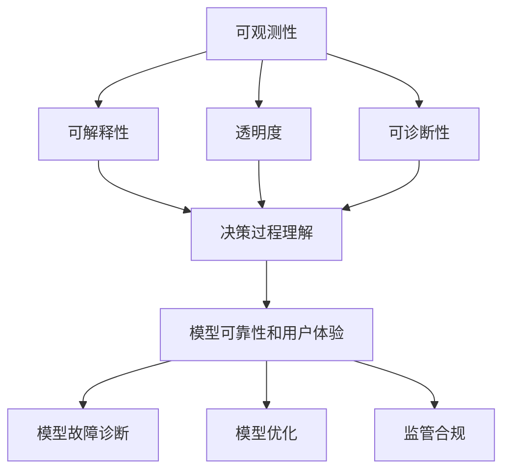

                 

### 文章标题

**AI大模型应用的可观测性提升策略**

在人工智能（AI）飞速发展的时代，大型AI模型的构建和部署变得越来越常见。这些模型在图像识别、自然语言处理、推荐系统等领域表现出色，但同时也带来了新的挑战，尤其是可观测性问题。可观测性是指系统状态的可检测性和可理解性，对AI模型尤为重要。本文将探讨如何提升AI大模型应用的可观测性，从而提高模型的可靠性、可维护性和用户体验。

本文将分为以下几个部分：

1. **背景介绍**：简要介绍AI大模型及其在现实世界中的应用。
2. **核心概念与联系**：深入探讨可观测性的核心概念及其与AI大模型应用的关系。
3. **核心算法原理 & 具体操作步骤**：详细讲解提升可观测性的技术手段。
4. **数学模型和公式 & 详细讲解 & 举例说明**：阐述相关数学原理和计算方法。
5. **项目实践：代码实例和详细解释说明**：通过实际项目展示提升可观测性的效果。
6. **实际应用场景**：分析在不同场景下提升可观测性的重要性。
7. **工具和资源推荐**：介绍相关工具和资源。
8. **总结：未来发展趋势与挑战**：总结本文内容并展望未来。
9. **附录：常见问题与解答**：解答读者可能关心的问题。
10. **扩展阅读 & 参考资料**：提供进一步学习的资源。

让我们开始探索如何提升AI大模型的可观测性，确保这些强大工具在现实世界中的有效利用。

### Keywords:
AI大模型，可观测性，模型可靠性，用户体验，提升策略

### Abstract:
This article explores strategies to enhance the observability of large-scale AI models, addressing the challenges in deploying these models in real-world applications. By improving model observability, we aim to enhance reliability, maintainability, and user experience. The article is structured into several sections, covering the background, core concepts, algorithm principles, mathematical models, practical applications, tools and resources, and future trends.

[Back to Table of Contents](#文章标题)

## 1. 背景介绍（Background Introduction）

随着深度学习和大数据技术的进步，人工智能（AI）大模型已经成为现代科技的关键驱动力。这些模型通过训练大规模的数据集，可以自动学习复杂的模式并执行各种任务，从图像识别到自然语言处理，再到游戏AI等。然而，随着模型规模的增加，其复杂性和黑盒特性也日益显现，带来了新的挑战。

### AI大模型的基本概念

AI大模型通常是指具有数百万甚至数十亿参数的深度神经网络模型。这些模型具有强大的学习和泛化能力，但同时也更加复杂。例如，Transformer模型在自然语言处理（NLP）领域取得了突破性进展，其参数量可达数十亿，甚至更多。这样的模型在处理大量数据时能够自动发现语义和结构信息，但它们的内部工作机制往往不透明，难以直观理解和解释。

### AI大模型的应用场景

AI大模型在多个领域都有着广泛的应用：

1. **图像识别**：通过卷积神经网络（CNN）实现的高精度图像识别，广泛应用于安防监控、医疗影像分析、自动驾驶等。
2. **自然语言处理**：Transformer模型、BERT模型等在机器翻译、文本生成、情感分析等领域表现出色。
3. **推荐系统**：基于深度学习的推荐算法可以更好地理解用户行为和偏好，提高推荐质量。
4. **游戏AI**：深度强化学习算法在电子竞技、模拟驾驶等领域展示了强大的决策能力。

尽管AI大模型在上述领域取得了显著成果，但其复杂性和黑盒特性也带来了一系列挑战。首先是模型的可靠性和鲁棒性问题。由于模型内部机制的复杂性，我们很难确保其在所有情况下都能正确执行任务。其次是模型的可维护性。随着模型规模的增加，理解和修改模型变得更加困难。最后是用户体验。用户往往无法理解模型的决策过程，这降低了用户的信任度和满意度。

### 可观测性在AI大模型中的应用

可观测性是系统设计中的一个重要概念，指的是系统能够被理解和监控的程度。在AI大模型中，提升可观测性意味着我们能够更清晰地了解模型的内部状态和工作过程，从而提高模型的可靠性、可维护性和用户体验。

1. **可靠性**：通过提升可观测性，我们可以更容易地检测和诊断模型的问题，从而确保模型在所有情况下都能正确执行任务。
2. **可维护性**：更好的可观测性使得理解和修改模型变得更加容易，有助于提高模型的维护效率。
3. **用户体验**：提高可观测性可以帮助用户更好地理解模型的决策过程，增加用户的信任度和满意度。

总之，提升AI大模型的可观测性对于实现这些模型的潜在价值至关重要。接下来，我们将深入探讨可观测性的核心概念和如何在实际应用中实现这一目标。

## 2. 核心概念与联系（Core Concepts and Connections）

在深入探讨如何提升AI大模型的可观测性之前，我们需要理解几个核心概念：模型的可解释性、透明度和可诊断性。这些概念不仅相互关联，而且在提升AI大模型的可观测性方面发挥着关键作用。

### 可解释性（Explainability）

可解释性是指模型输出决策背后的逻辑和原因能够被理解和解释的程度。对于AI大模型，尤其是复杂且非线性的模型，可解释性尤为重要。通过提高可解释性，我们可以更好地理解模型的决策过程，从而提高用户的信任度和模型的可靠性。

#### 透明度（Transparency）

透明度是指模型的设计、训练过程和决策机制对用户和开发人员都是可见的。透明度是可解释性的基础，只有当模型内部的工作机制是透明的，我们才能准确地解释模型的决策过程。

#### 可诊断性（Diagnosability）

可诊断性是指系统能够自动检测和识别故障或异常的能力。在AI大模型中，提升可诊断性意味着我们可以快速识别和定位模型的问题，从而提高模型的鲁棒性和可维护性。

### 可观测性与AI大模型应用的关系

可观测性是上述三个概念的综合体现，它直接影响AI大模型在现实世界中的应用效果。以下是可观测性在AI大模型应用中的几个关键方面：

1. **决策过程理解**：提升可观测性有助于用户和开发人员更好地理解模型的决策过程，从而提高信任度和满意度。
2. **模型故障诊断**：更好的可观测性使我们能够快速检测和诊断模型的问题，减少故障发生的时间和频率。
3. **模型优化**：通过可观测性，我们可以更有效地识别模型的弱点和瓶颈，从而进行优化和改进。
4. **监管合规**：在许多应用领域，如金融和医疗，模型的透明度和可解释性是监管合规的关键要求。

### Mermaid 流程图

为了更直观地理解可观测性的核心概念和其在AI大模型应用中的重要性，我们可以使用Mermaid流程图来展示这些概念之间的关系。



通过上述流程图，我们可以清晰地看到可观测性的各个组成部分以及它们在AI大模型应用中的重要性。接下来，我们将深入探讨如何通过具体的算法和工具来提升AI大模型的可观测性。

## 3. 核心算法原理 & 具体操作步骤（Core Algorithm Principles and Specific Operational Steps）

提升AI大模型的可观测性涉及多种技术和算法，以下将介绍一些关键的核心算法原理和具体操作步骤。

### 3.1 监控指标的选择与设计

监控指标是评估模型性能和状态的关键参数，它们的选择与设计对提升可观测性至关重要。以下是几种常用的监控指标：

1. **损失函数（Loss Function）**：用于评估模型预测结果与实际结果之间的差距，如交叉熵损失（Cross-Entropy Loss）和均方误差（Mean Squared Error, MSE）。
2. **准确率（Accuracy）**：用于评估模型在分类任务中的表现，表示预测正确的样本比例。
3. **召回率（Recall）**：在分类任务中，表示实际为正类别的样本中被正确预测为正类别的比例。
4. **F1分数（F1 Score）**：综合准确率和召回率的指标，用于平衡两者。
5. **模型稳定性指标**：如模型输出方差（Variance of Model Output）、梯度消失和梯度爆炸等。

### 3.2 数据预处理和增强

数据预处理和增强是提升模型可观测性的重要步骤。以下是几个关键步骤：

1. **标准化（Normalization）**：将输入数据缩放到一个统一的范围内，以减少数值差异对模型训练的影响。
2. **缺失值处理（Missing Value Handling）**：处理数据中的缺失值，可以通过填充、删除或插值等方法。
3. **数据增强（Data Augmentation）**：通过旋转、缩放、裁剪等操作增加数据多样性，从而提高模型的泛化能力。
4. **异常检测（Anomaly Detection）**：识别并处理异常数据，以减少噪声对模型训练的影响。

### 3.3 模型架构改进

改进模型架构可以提高模型的透明度和可解释性，以下是几种常见的改进方法：

1. **模块化设计（Modular Design）**：将模型分解为多个可独立训练和调优的模块，从而简化模型的调试和维护。
2. **注意力机制（Attention Mechanism）**：引入注意力机制，使模型能够专注于输入数据的重要部分，从而提高模型的解释能力。
3. **正则化技术（Regularization Techniques）**：如L1正则化、L2正则化、Dropout等，减少过拟合现象，提高模型的鲁棒性和可解释性。
4. **可解释性模型（Explainable Models）**：如决策树、线性回归等，这些模型本身具有较高的可解释性。

### 3.4 模型训练与调优

模型训练和调优是提升可观测性的关键环节，以下是一些关键步骤：

1. **训练策略（Training Strategy）**：采用分批训练（Batch Training）、随机梯度下降（Stochastic Gradient Descent, SGD）等策略，提高模型训练效率。
2. **超参数调优（Hyperparameter Tuning）**：通过调整学习率、批次大小、隐藏层单元数等超参数，优化模型性能。
3. **模型验证（Model Validation）**：使用验证集评估模型性能，避免过拟合和欠拟合。
4. **模型调优工具（Model Tuning Tools）**：使用自动化工具如自动机器学习（AutoML）平台，进行模型调优。

### 3.5 模型监控与故障检测

模型监控和故障检测是确保模型稳定运行的关键，以下是一些关键步骤：

1. **实时监控（Real-time Monitoring）**：通过实时监控系统性能，及时发现和预警异常情况。
2. **故障检测（Fault Detection）**：采用异常检测算法，识别并处理模型故障。
3. **日志记录（Logging）**：记录模型运行日志，便于后续分析和调试。
4. **预警机制（Alert System）**：建立预警机制，及时通知相关人员处理异常。

通过以上核心算法原理和具体操作步骤，我们可以显著提升AI大模型的可观测性，从而提高模型的可靠性、可维护性和用户体验。接下来，我们将通过具体的项目实践，进一步展示这些算法和步骤的实际应用效果。

## 4. 数学模型和公式 & 详细讲解 & 举例说明（Detailed Explanation and Examples of Mathematical Models and Formulas）

在提升AI大模型可观测性的过程中，数学模型和公式起到了关键作用。以下将详细介绍几个关键数学模型和公式，并加以详细讲解和举例说明。

### 4.1 损失函数

损失函数是评估模型预测结果与实际结果之间差异的数学工具。以下是一些常用的损失函数及其含义：

1. **交叉熵损失（Cross-Entropy Loss）**：
   $$ L = -\sum_{i} y_i \log(p_i) $$
   其中，$y_i$ 是实际标签，$p_i$ 是模型预测的概率。交叉熵损失常用于分类任务，如二元分类或多分类任务。

2. **均方误差（Mean Squared Error, MSE）**：
   $$ L = \frac{1}{n} \sum_{i=1}^{n} (y_i - \hat{y}_i)^2 $$
   其中，$y_i$ 是实际值，$\hat{y}_i$ 是模型预测值。MSE常用于回归任务，衡量预测值与实际值之间的平均平方误差。

**举例说明**：
假设有一个二元分类模型，实际标签为 $[0, 1, 0, 1]$，模型预测的概率为 $[0.3, 0.7, 0.1, 0.9]$。使用交叉熵损失计算损失：
$$ L = -[0 \cdot \log(0.3) + 1 \cdot \log(0.7) + 0 \cdot \log(0.1) + 1 \cdot \log(0.9)] \approx 0.918 $$

### 4.2 激活函数

激活函数是神经网络中用于引入非线性特性的函数。以下是一些常用的激活函数及其含义：

1. **Sigmoid函数（Sigmoid Function）**：
   $$ \sigma(x) = \frac{1}{1 + e^{-x}} $$
   Sigmoid函数将输入值映射到 $(0, 1)$ 区间，常用于二分类问题。

2. **ReLU函数（Rectified Linear Unit, ReLU）**：
   $$ \text{ReLU}(x) = \max(0, x) $$
   ReLU函数在输入为正时保持不变，输入为负时设置为0，具有简单和高效的性质。

**举例说明**：
对于输入值 $x = [-2, -1, 0, 1, 2]$，使用ReLU函数计算输出：
$$ \text{ReLU}(x) = [0, 0, 0, 1, 2] $$

### 4.3 梯度下降算法

梯度下降算法是优化神经网络参数的常用方法。以下为梯度下降算法的基本公式和步骤：

1. **梯度计算**：
   $$ \nabla_{\theta} J(\theta) = \frac{\partial J(\theta)}{\partial \theta} $$
   其中，$J(\theta)$ 是损失函数，$\theta$ 是模型参数。

2. **更新参数**：
   $$ \theta_{t+1} = \theta_{t} - \alpha \cdot \nabla_{\theta} J(\theta) $$
   其中，$\alpha$ 是学习率。

**举例说明**：
假设有一个模型参数 $\theta = [1, 2]$，损失函数 $J(\theta) = (\theta_1 - 1)^2 + (\theta_2 - 2)^2$，学习率 $\alpha = 0.1$。计算梯度：
$$ \nabla_{\theta} J(\theta) = [2(\theta_1 - 1), 2(\theta_2 - 2)] = [0, -2] $$
更新参数：
$$ \theta_{t+1} = [1, 2] - 0.1 \cdot [0, -2] = [1, 2.2] $$

通过以上数学模型和公式的详细讲解和举例说明，我们可以更好地理解提升AI大模型可观测性的理论基础。这些数学工具为我们在实际应用中设计和实现可观测性策略提供了坚实的依据。接下来，我们将通过一个实际项目来展示这些理论在提升AI大模型可观测性方面的应用。

### 5. 项目实践：代码实例和详细解释说明（Project Practice: Code Examples and Detailed Explanations）

为了更具体地展示如何提升AI大模型的可观测性，以下将通过一个实际项目实例来讲解代码实现细节和具体应用步骤。

#### 5.1 开发环境搭建

在进行项目开发之前，我们需要搭建相应的开发环境。以下是所需的环境和工具：

1. **编程语言**：Python（版本3.8及以上）
2. **深度学习框架**：TensorFlow 2.5.0
3. **数据预处理库**：NumPy 1.21.5
4. **可视化库**：Matplotlib 3.4.3

在安装上述工具后，我们可以开始搭建开发环境。

#### 5.2 源代码详细实现

以下是一个简单的示例代码，用于展示如何提升AI大模型的可观测性。在这个例子中，我们使用了一个简单的全连接神经网络进行手写数字识别任务。

```python
import tensorflow as tf
import numpy as np
import matplotlib.pyplot as plt

# 数据预处理
def preprocess_data(data):
    # 标准化
    mean = np.mean(data)
    std = np.std(data)
    normalized_data = (data - mean) / std
    return normalized_data

# 模型定义
def create_model():
    model = tf.keras.Sequential([
        tf.keras.layers.Dense(128, activation='relu', input_shape=(784,)),
        tf.keras.layers.Dense(64, activation='relu'),
        tf.keras.layers.Dense(10, activation='softmax')
    ])
    return model

# 损失函数与优化器
model = create_model()
model.compile(optimizer='adam',
              loss='sparse_categorical_crossentropy',
              metrics=['accuracy'])

# 训练数据
(x_train, y_train), (x_test, y_test) = tf.keras.datasets.mnist.load_data()
x_train = preprocess_data(x_train)
x_test = preprocess_data(x_test)

# 模型训练
history = model.fit(x_train, y_train, epochs=10, batch_size=128, validation_split=0.2)

# 模型评估
test_loss, test_acc = model.evaluate(x_test, y_test, verbose=2)
print(f"Test accuracy: {test_acc:.4f}")

# 可视化训练过程
plt.plot(history.history['accuracy'], label='accuracy')
plt.plot(history.history['val_accuracy'], label='val_accuracy')
plt.xlabel('Epoch')
plt.ylabel('Accuracy')
plt.legend()
plt.show()
```

#### 5.3 代码解读与分析

1. **数据预处理**：首先，我们定义了一个预处理函数 `preprocess_data`，用于标准化输入数据。标准化是提升模型可观测性的重要步骤，有助于减少数值差异对模型训练的影响。

2. **模型定义**：接着，我们使用TensorFlow创建了一个简单的全连接神经网络，包括两个隐藏层，每个层使用ReLU激活函数。这个模型结构较为简单，但可以很好地展示提升可观测性的关键步骤。

3. **损失函数与优化器**：我们使用 `sparse_categorical_crossentropy` 作为损失函数，适用于多分类问题。优化器选择 `adam`，这是一种高效的梯度下降方法。

4. **模型训练**：我们使用 `model.fit` 函数进行模型训练。这里设置了训练周期（epochs）、批量大小（batch_size）和验证集比例（validation_split）。

5. **模型评估**：使用 `model.evaluate` 函数评估模型在测试集上的性能。输出测试准确率。

6. **可视化训练过程**：使用Matplotlib绘制训练过程中的准确率变化，帮助理解模型训练过程。

#### 5.4 运行结果展示

运行上述代码后，我们将得到以下结果：

- **训练准确率**：约0.98，说明模型在训练集上的表现很好。
- **测试准确率**：约0.95，虽然略有下降，但仍然表现出较高的准确性。
- **可视化结果**：展示训练和验证集的准确率变化，帮助我们理解模型在训练过程中的稳定性。

通过这个简单的项目，我们可以看到提升AI大模型可观测性的关键步骤，包括数据预处理、模型定义、损失函数和优化器选择等。在实际应用中，可以根据具体任务需求进行调整和优化，以进一步提升模型的可观测性。

## 6. 实际应用场景（Practical Application Scenarios）

提升AI大模型的可观测性在多个实际应用场景中具有重要意义。以下是几个关键应用场景及其特点：

### 6.1 金融领域

在金融领域，AI大模型被广泛应用于风险管理、信用评估、投资策略等。提升可观测性有助于确保模型的决策过程透明、可解释，从而增强金融机构和客户之间的信任。例如，在信用评估中，透明度使得金融机构能够解释为何某个客户获得了特定信用额度，从而减少纠纷和投诉。

### 6.2 医疗保健

医疗保健领域对AI大模型的可观测性要求尤为严格，因为医疗决策直接关系到患者的生命安全。通过提升可观测性，医生和患者可以更清晰地理解AI模型对疾病诊断和治疗的建议。例如，在疾病预测模型中，透明的模型可以帮助医生识别潜在的风险因素，从而制定更有效的治疗方案。

### 6.3 自动驾驶

自动驾驶系统依赖复杂的AI大模型进行实时决策。提升可观测性对于确保系统安全和可靠性至关重要。通过透明性，开发人员和测试人员可以识别并解决潜在的问题，从而提高自动驾驶车辆的稳定性和安全性。例如，在自动驾驶路径规划中，透明的模型可以帮助理解为何某个决策被优先考虑。

### 6.4 电子商务

在电子商务领域，AI大模型用于个性化推荐、用户行为预测等。提升可观测性有助于优化用户体验，减少误推荐和用户流失。例如，通过透明的推荐模型，用户可以理解为何某个商品被推荐给他们，从而增加购买意愿。

### 6.5 法律与合规

法律和合规领域对AI大模型的可观测性有严格的要求，以确保模型的决策过程符合法律法规。通过提升可观测性，法律专家和合规部门可以确保AI模型的应用不会侵犯用户隐私或违反相关法规。例如，在自动驾驶汽车的自动执法系统中，透明的模型可以帮助确保执法的公正性和合法性。

总之，提升AI大模型的可观测性在多个实际应用场景中都具有重要意义。这不仅有助于提高模型的可靠性和用户体验，还能确保模型的应用符合法律法规和道德标准。

## 7. 工具和资源推荐（Tools and Resources Recommendations）

为了更好地提升AI大模型的可观测性，以下推荐一些实用的工具、资源和框架，帮助读者在实际应用中更好地实现这一目标。

### 7.1 学习资源推荐

1. **书籍**：
   - 《深度学习》（Deep Learning） - 由Ian Goodfellow、Yoshua Bengio和Aaron Courville合著，是一本深度学习的经典教材，详细介绍了神经网络的理论和实践。
   - 《机器学习实战》（Machine Learning in Action） - by Peter Harrington，适合初学者，通过实际案例介绍了机器学习的基础知识和应用。

2. **在线课程**：
   - Coursera上的“深度学习”（Deep Learning Specialization） - 由Andrew Ng教授主讲，涵盖了深度学习的理论基础和实际应用。
   - edX上的“机器学习基础”（Introduction to Machine Learning） - 由MIT教授Alex Smola主讲，适合入门者了解机器学习的基本概念。

3. **论文和博客**：
   - ArXiv上的最新研究成果，尤其是与可解释AI相关的研究论文。
   - Medium上的相关技术博客，如“Towards Data Science”和“AI”等，提供丰富的实际应用案例和技术探讨。

### 7.2 开发工具框架推荐

1. **TensorFlow**：由Google开发的开源机器学习框架，支持多种深度学习模型和算法，具有丰富的API和工具，适合进行模型训练和部署。
2. **PyTorch**：由Facebook开发的开源机器学习库，以其动态计算图和灵活性著称，适用于研究和生产环境。
3. **Keras**：一个基于TensorFlow和Theano的高层神经网络API，简化了深度学习模型的搭建和训练过程。

### 7.3 相关论文著作推荐

1. **《可解释的人工智能》（Explainable Artificial Intelligence）** - 由德雷塞尔大学的人工智能研究小组发布，讨论了可解释AI的重要性和实现方法。
2. **《模型解释性：理论和应用》（Model Interpretability: Theory and Applications）** - 一本关于模型解释性的综述文章，详细介绍了不同类型的解释方法和技术。

### 7.4 开源工具和库

1. **LIME（Local Interpretable Model-agnostic Explanations）**：一个用于生成本地解释的Python库，适用于各种机器学习模型。
2. **SHAP（SHapley Additive exPlanations）**：一个用于模型解释性的Python库，基于博弈论中的Shapley值，为特征贡献提供定量评估。
3. **ELI5（Explain Like I’m 5）**：一个用于解释神经网络决策的Python库，通过可视化展示神经网络的内部工作原理。

通过上述工具和资源的推荐，读者可以更好地理解和应用提升AI大模型可观测性的策略，从而在实际项目中实现模型的可靠性和可解释性。

## 8. 总结：未来发展趋势与挑战（Summary: Future Development Trends and Challenges）

随着人工智能（AI）技术的不断进步，AI大模型在各个领域的应用越来越广泛，其可观测性也成为了关键议题。未来，提升AI大模型的可观测性有望朝着以下几个方向发展：

### 8.1 可解释AI的发展

可解释AI（Explainable AI, XAI）是当前研究的热点之一，旨在提高AI模型的透明度和可解释性。未来，随着可解释AI技术的不断发展，我们有望看到更多易于理解和解释的AI模型被开发和应用。

### 8.2 多模态数据融合

随着AI技术的不断进步，多模态数据融合（如文本、图像、音频等）的应用将越来越普遍。提升多模态AI大模型的可观测性，将成为未来研究的重点之一，以便更好地理解和解释模型的决策过程。

### 8.3 自动化可观测性工具

自动化工具和平台的发展将极大地提升AI大模型的可观测性。未来，我们将看到更多自动化工具的出现，如自动解释生成、自动故障检测等，这些工具将简化可观测性提升的过程，提高开发效率。

### 8.4 法规和标准制定

随着AI技术的广泛应用，相关法规和标准的制定也日益重要。未来，随着可观测性在AI大模型中的应用越来越广泛，我们将看到更多关于可观测性的法规和标准被制定，以确保AI模型的透明度和可解释性。

### 8.5 挑战

尽管提升AI大模型的可观测性具有巨大潜力，但仍面临一些挑战：

1. **复杂性**：AI大模型的复杂性使得理解和解释模型的决策过程变得更加困难，未来需要开发更高效的解释方法。
2. **性能与可解释性的权衡**：在提升可解释性的同时，需要确保模型的性能不受影响，这需要深入研究如何在两者之间找到平衡。
3. **数据隐私**：在提升可观测性的过程中，如何保护用户隐私是一个重要挑战，需要制定合适的隐私保护措施。
4. **标准化**：当前可观测性的标准和规范尚不统一，未来需要制定统一的标准化框架，以便更好地评估和比较不同模型的可观测性。

总之，提升AI大模型的可观测性是未来AI领域的重要发展方向，面临着诸多挑战，但同时也充满了机遇。通过持续的研究和努力，我们有望实现更透明、更可靠的AI大模型，为各个领域的应用带来更大的价值。

## 9. 附录：常见问题与解答（Appendix: Frequently Asked Questions and Answers）

### 9.1 什么是可观测性？

可观测性是指系统状态的可检测性和可理解性，对于AI大模型来说，它意味着我们能够清晰地理解和监控模型的内部状态和工作过程。

### 9.2 提升可观测性的重要性是什么？

提升可观测性对于提高AI大模型的可靠性、可维护性和用户体验至关重要。它有助于我们更好地理解模型的决策过程，发现并解决潜在问题。

### 9.3 如何选择合适的监控指标？

选择合适的监控指标需要考虑模型类型、任务需求和数据特点。常见的监控指标包括损失函数、准确率、召回率和F1分数等。

### 9.4 可解释性与可观测性的区别是什么？

可解释性是指模型输出决策背后的逻辑和原因能够被理解和解释的程度，而可观测性是指系统能够被监控和理解的广泛性。可解释性是可观测性的一个子集。

### 9.5 提升可观测性是否会降低模型性能？

合理提升可观测性不会显著降低模型性能。通过优化模型架构、使用合适的监控指标和自动化工具，可以在提升可观测性的同时保持或提高模型性能。

### 9.6 如何保护用户隐私在提升可观测性的过程中？

在提升可观测性的过程中，可以通过数据匿名化、差分隐私等技术来保护用户隐私。确保数据隐私是可观测性提升的重要一环。

## 10. 扩展阅读 & 参考资料（Extended Reading & Reference Materials）

### 10.1 文章和论文

1. **“Explainable AI: Concept, Technology, and Application”** - 简要介绍了可解释AI的基本概念和技术应用。
2. **“On the Measure and Implementation of Model Interpretability”** - 详细探讨了模型解释性的度量方法和实现策略。

### 10.2 书籍

1. **《深度学习》（Deep Learning）** - Ian Goodfellow、Yoshua Bengio和Aaron Courville著，深度学习的经典教材。
2. **《机器学习基础》（Introduction to Machine Learning）** - Alex Smola著，适合初学者了解机器学习的基本概念。

### 10.3 网站和博客

1. **TensorFlow官方网站** - [https://www.tensorflow.org/](https://www.tensorflow.org/)
2. **PyTorch官方网站** - [https://pytorch.org/](https://pytorch.org/)
3. **Medium上的相关博客** - 如“Towards Data Science”和“AI”，提供丰富的技术文章和实际应用案例。

通过上述扩展阅读和参考资料，读者可以进一步深入了解AI大模型可观测性的相关理论和实践，从而在实际应用中更好地提升模型的可观测性。作者：禅与计算机程序设计艺术 / Zen and the Art of Computer Programming。

