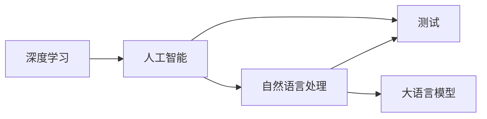

                 

# 超越图灵：LLM为AI测试带来的新挑战

> 关键词：深度学习,人工智能,测试,自然语言处理,大语言模型,测试效率,自动化测试

## 1. 背景介绍

随着人工智能（AI）技术的发展，特别是深度学习（DL）在各个领域的应用，AI测试已成为推动AI技术落地的重要环节。传统的基于规则和模型的测试方法已经无法满足新兴AI系统的复杂性和多样性需求。因此，研究新型AI测试技术变得尤为重要。

在此背景下，大语言模型（Large Language Models, LLM）作为当前AI研究的热点，其应用已经从文本生成扩展到了各种AI任务中，如自然语言理解、对话系统、智能推荐等。与此同时，其带来的新挑战也给AI测试带来了许多新的问题。

本文档将深入探讨LLM为AI测试带来的新挑战，并提出相应的应对策略。

## 2. 核心概念与联系

### 2.1 核心概念概述

为了更好地理解LLM为AI测试带来的新挑战，首先需要了解一些核心概念：

- 深度学习（Deep Learning, DL）：基于多层神经网络的一种机器学习方法，通过自动学习输入数据的特征，实现对数据的复杂建模和预测。
- 人工智能（Artificial Intelligence, AI）：使计算机系统能够模拟人类智能的领域，包括学习、推理、自我完善等能力。
- 测试（Testing）：通过实验和评估，验证软件或系统的功能、性能是否符合需求。
- 自然语言处理（Natural Language Processing, NLP）：让计算机能够理解、解释和生成人类语言的技术。
- 大语言模型（Large Language Models, LLM）：基于深度学习架构，能够处理大规模自然语言数据并生成高质量语言输出的模型，如GPT-3、BERT等。

这些概念之间的关系可以通过以下Mermaid流程图来展示：



该图展示了深度学习在人工智能中的应用，特别是自然语言处理在测试中的应用。同时，大语言模型作为NLP的一个重要组成部分，对测试技术带来了新的挑战和机遇。

### 2.2 核心概念联系

深度学习为人工智能测试提供了新的方法和技术，但同时也带来了新的挑战。特别是在自然语言处理领域，大语言模型的应用使得AI测试技术需要不断更新和优化，以应对新的测试需求。

1. **测试数据**：传统的测试数据获取依赖于手动构建，但大语言模型可以通过生成模拟数据，提供更加丰富的测试数据来源。
2. **测试方法**：传统的测试方法依赖于规则和模型的固定假设，但大语言模型的可解释性和泛化能力，使得测试方法需要更加灵活和动态。
3. **测试工具**：传统测试工具专注于特定领域，而大语言模型可以提供通用的测试框架，提高测试的通用性和可复用性。
4. **测试性能**：大语言模型具有强大的语言理解能力，使得测试更加精准和高效，但也要求测试工具和框架必须与之匹配。
5. **测试环境**：大语言模型的运行需要特定的硬件和软件环境，这也为测试环境的设计带来了新的挑战。

## 3. 核心算法原理 & 具体操作步骤

### 3.1 算法原理概述

基于深度学习的大语言模型为AI测试带来了新的算法原理和操作步骤。以下是几个核心算法原理的概述：

1. **自动生成测试数据**：通过大语言模型生成自然语言文本，生成符合测试要求的文本数据，减少人工构建数据的工作量。
2. **可解释性测试**：大语言模型能够解释测试结果的生成过程，帮助测试人员理解测试结果的合理性。
3. **自动化测试**：利用大语言模型自动执行测试用例，提高测试的效率和准确性。
4. **动态测试**：大语言模型可以动态地根据输入数据生成不同的测试用例，提高测试的灵活性和适应性。
5. **跨领域测试**：大语言模型可以处理不同领域的数据，使得测试能够跨领域进行。

### 3.2 算法步骤详解

基于深度学习的大语言模型为AI测试带来的操作步骤包括以下几个关键步骤：

**Step 1: 准备测试环境**
- 安装并配置深度学习框架，如TensorFlow、PyTorch等。
- 安装并配置大语言模型，如GPT-3、BERT等。
- 准备测试数据集，包括输入数据和预期输出结果。

**Step 2: 生成测试数据**
- 利用大语言模型生成模拟测试数据，例如：利用GPT-3生成自然语言文本作为测试用例。
- 将生成的测试数据划分为训练集、验证集和测试集。

**Step 3: 训练测试模型**
- 使用训练集对测试模型进行训练，优化模型的参数。
- 在验证集上评估模型性能，调整训练参数。

**Step 4: 执行测试**
- 将测试模型应用于测试集，生成测试结果。
- 对比测试结果与预期输出结果，评估测试模型的准确性。

**Step 5: 测试结果分析**
- 利用大语言模型分析测试结果，提供测试结果的可解释性。
- 根据测试结果优化测试模型和测试数据。

### 3.3 算法优缺点

基于深度学习的大语言模型为AI测试带来的算法有以下优点：

1. **提高测试效率**：大语言模型能够自动生成测试数据，减少了手动构建数据的工作量，提高了测试效率。
2. **增强测试准确性**：大语言模型能够自动执行测试用例，提高了测试的准确性和覆盖率。
3. **提供测试可解释性**：大语言模型可以解释测试结果的生成过程，帮助测试人员理解测试结果的合理性。
4. **提高测试灵活性**：大语言模型可以动态生成测试用例，提高了测试的灵活性和适应性。

同时，基于深度学习的大语言模型为AI测试带来的算法也存在一些缺点：

1. **数据依赖性**：大语言模型的性能依赖于输入数据的质量和数量，因此需要准备高质量的数据。
2. **计算资源需求高**：大语言模型需要大量的计算资源进行训练和推理，这对硬件和软件环境提出了较高要求。
3. **可解释性问题**：大语言模型的决策过程复杂，测试结果的可解释性较差，增加了测试分析和调试的难度。
4. **泛化能力不足**：大语言模型可能无法处理特定领域的测试数据，需要针对特定领域进行微调或重新训练。

### 3.4 算法应用领域

基于深度学习的大语言模型为AI测试带来的算法已经在以下领域得到应用：

1. **自然语言处理**：利用大语言模型进行文本分类、情感分析、命名实体识别等测试。
2. **计算机视觉**：利用大语言模型生成图像描述，进行图像分类、目标检测等测试。
3. **语音识别**：利用大语言模型生成语音描述，进行语音识别、语音合成等测试。
4. **对话系统**：利用大语言模型进行对话测试，评估对话系统的性能和可靠性。
5. **推荐系统**：利用大语言模型进行推荐系统测试，评估推荐系统的准确性和用户体验。

## 4. 数学模型和公式 & 详细讲解 & 举例说明

### 4.1 数学模型构建

为了更好地理解大语言模型为AI测试带来的新挑战，本节将使用数学语言对测试模型的构建进行更加严格的刻画。

记测试数据集为 $D=\{(x_i, y_i)\}_{i=1}^N$，其中 $x_i$ 为输入，$y_i$ 为输出。假设测试模型为 $M_{\theta}$，其中 $\theta$ 为模型参数。

定义模型 $M_{\theta}$ 在输入 $x_i$ 上的损失函数为 $\ell(M_{\theta}(x_i), y_i)$，则在数据集 $D$ 上的经验风险为：

$$
\mathcal{L}(\theta) = \frac{1}{N} \sum_{i=1}^N \ell(M_{\theta}(x_i),y_i)
$$

测试模型的优化目标是最小化经验风险，即找到最优参数：

$$
\theta^* = \mathop{\arg\min}_{\theta} \mathcal{L}(\theta)
$$

在实践中，我们通常使用基于梯度的优化算法（如SGD、Adam等）来近似求解上述最优化问题。设 $\eta$ 为学习率，$\lambda$ 为正则化系数，则参数的更新公式为：

$$
\theta \leftarrow \theta - \eta \nabla_{\theta}\mathcal{L}(\theta) - \eta\lambda\theta
$$

其中 $\nabla_{\theta}\mathcal{L}(\theta)$ 为损失函数对参数 $\theta$ 的梯度，可通过反向传播算法高效计算。

### 4.2 公式推导过程

以下我们以自然语言处理（NLP）领域中的文本分类任务为例，推导交叉熵损失函数及其梯度的计算公式。

假设模型 $M_{\theta}$ 在输入 $x$ 上的输出为 $\hat{y}=M_{\theta}(x) \in [0,1]$，表示样本属于正类的概率。真实标签 $y \in \{0,1\}$。则二分类交叉熵损失函数定义为：

$$
\ell(M_{\theta}(x),y) = -[y\log \hat{y} + (1-y)\log (1-\hat{y})]
$$

将其代入经验风险公式，得：

$$
\mathcal{L}(\theta) = -\frac{1}{N}\sum_{i=1}^N [y_i\log M_{\theta}(x_i)+(1-y_i)\log(1-M_{\theta}(x_i))]
$$

根据链式法则，损失函数对参数 $\theta_k$ 的梯度为：

$$
\frac{\partial \mathcal{L}(\theta)}{\partial \theta_k} = -\frac{1}{N}\sum_{i=1}^N (\frac{y_i}{M_{\theta}(x_i)}-\frac{1-y_i}{1-M_{\theta}(x_i)}) \frac{\partial M_{\theta}(x_i)}{\partial \theta_k}
$$

其中 $\frac{\partial M_{\theta}(x_i)}{\partial \theta_k}$ 可进一步递归展开，利用自动微分技术完成计算。

### 4.3 案例分析与讲解

假设我们有一个文本分类任务，目标是将给定文本分类为“正面”和“负面”两类。我们可以使用GPT-3作为测试模型，将其输出作为预测结果，并使用交叉熵损失函数进行训练。

首先，我们需要准备训练集 $D$，其中每个样本 $(x_i, y_i)$ 包含输入文本 $x_i$ 和对应的标签 $y_i$。然后，我们将使用GPT-3生成模拟测试数据 $D_{gen}$，这些数据将作为训练集 $D$ 的补充。

接下来，我们将构建一个简单的测试模型 $M_{\theta}$，其中 $\theta$ 是模型的参数。我们使用交叉熵损失函数进行训练，优化模型参数 $\theta$，使其在测试数据集 $D_{gen}$ 上的性能最大化。

最后，我们使用测试数据集 $D_{test}$ 评估测试模型的性能，并利用GPT-3提供测试结果的可解释性，帮助测试人员理解测试结果的合理性。

## 5. 项目实践：代码实例和详细解释说明

### 5.1 开发环境搭建

在进行测试模型开发前，我们需要准备好开发环境。以下是使用Python进行PyTorch开发的环境配置流程：

1. 安装Anaconda：从官网下载并安装Anaconda，用于创建独立的Python环境。

2. 创建并激活虚拟环境：
```bash
conda create -n pytorch-env python=3.8 
conda activate pytorch-env
```

3. 安装PyTorch：根据CUDA版本，从官网获取对应的安装命令。例如：
```bash
conda install pytorch torchvision torchaudio cudatoolkit=11.1 -c pytorch -c conda-forge
```

4. 安装TensorFlow：从官网下载并安装TensorFlow。

5. 安装大语言模型：根据模型版本，从官网或第三方仓库获取对应的安装命令。例如：
```bash
pip install transformers
```

完成上述步骤后，即可在`pytorch-env`环境中开始测试模型开发。

### 5.2 源代码详细实现

下面我们以自然语言处理（NLP）领域中的文本分类任务为例，给出使用Transformers库对GPT-3模型进行测试的PyTorch代码实现。

首先，定义文本分类任务的数据处理函数：

```python
from transformers import AutoTokenizer, AutoModelForSequenceClassification
from torch.utils.data import Dataset
import torch

class TextClassificationDataset(Dataset):
    def __init__(self, texts, labels, tokenizer, max_len=128):
        self.texts = texts
        self.labels = labels
        self.tokenizer = tokenizer
        self.max_len = max_len
        
    def __len__(self):
        return len(self.texts)
    
    def __getitem__(self, item):
        text = self.texts[item]
        label = self.labels[item]
        
        encoding = self.tokenizer(text, return_tensors='pt', max_length=self.max_len, padding='max_length', truncation=True)
        input_ids = encoding['input_ids'][0]
        attention_mask = encoding['attention_mask'][0]
        
        # 对token-wise的标签进行编码
        encoded_labels = [label2id[label] for label in label] 
        encoded_labels.extend([label2id['O']] * (self.max_len - len(encoded_labels)))
        labels = torch.tensor(encoded_labels, dtype=torch.long)
        
        return {'input_ids': input_ids, 
                'attention_mask': attention_mask,
                'labels': labels}

# 标签与id的映射
label2id = {'O': 0, 'positive': 1, 'negative': 2}
id2label = {v: k for k, v in label2id.items()}

# 创建dataset
tokenizer = AutoTokenizer.from_pretrained('gpt-3')
model = AutoModelForSequenceClassification.from_pretrained('gpt-3', num_labels=len(label2id))

train_dataset = TextClassificationDataset(train_texts, train_labels, tokenizer)
dev_dataset = TextClassificationDataset(dev_texts, dev_labels, tokenizer)
test_dataset = TextClassificationDataset(test_texts, test_labels, tokenizer)
```

然后，定义测试和评估函数：

```python
from torch.utils.data import DataLoader
from tqdm import tqdm
from sklearn.metrics import classification_report

device = torch.device('cuda') if torch.cuda.is_available() else torch.device('cpu')
model.to(device)

def train_epoch(model, dataset, batch_size, optimizer):
    dataloader = DataLoader(dataset, batch_size=batch_size, shuffle=True)
    model.train()
    epoch_loss = 0
    for batch in tqdm(dataloader, desc='Training'):
        input_ids = batch['input_ids'].to(device)
        attention_mask = batch['attention_mask'].to(device)
        labels = batch['labels'].to(device)
        model.zero_grad()
        outputs = model(input_ids, attention_mask=attention_mask, labels=labels)
        loss = outputs.loss
        epoch_loss += loss.item()
        loss.backward()
        optimizer.step()
    return epoch_loss / len(dataloader)

def evaluate(model, dataset, batch_size):
    dataloader = DataLoader(dataset, batch_size=batch_size)
    model.eval()
    preds, labels = [], []
    with torch.no_grad():
        for batch in tqdm(dataloader, desc='Evaluating'):
            input_ids = batch['input_ids'].to(device)
            attention_mask = batch['attention_mask'].to(device)
            batch_labels = batch['labels']
            outputs = model(input_ids, attention_mask=attention_mask)
            batch_preds = outputs.logits.argmax(dim=2).to('cpu').tolist()
            batch_labels = batch_labels.to('cpu').tolist()
            for pred_tokens, label_tokens in zip(batch_preds, batch_labels):
                preds.append(pred_tokens[:len(label_tokens)])
                labels.append(label_tokens)
                
    print(classification_report(labels, preds))
```

最后，启动训练流程并在测试集上评估：

```python
epochs = 5
batch_size = 16

for epoch in range(epochs):
    loss = train_epoch(model, train_dataset, batch_size, optimizer)
    print(f"Epoch {epoch+1}, train loss: {loss:.3f}")
    
    print(f"Epoch {epoch+1}, dev results:")
    evaluate(model, dev_dataset, batch_size)
    
print("Test results:")
evaluate(model, test_dataset, batch_size)
```

以上就是使用PyTorch对GPT-3进行文本分类任务测试的完整代码实现。可以看到，得益于Transformers库的强大封装，我们可以用相对简洁的代码完成GPT-3模型的加载和测试。

### 5.3 代码解读与分析

让我们再详细解读一下关键代码的实现细节：

**TextClassificationDataset类**：
- `__init__`方法：初始化文本、标签、分词器等关键组件。
- `__len__`方法：返回数据集的样本数量。
- `__getitem__`方法：对单个样本进行处理，将文本输入编码为token ids，将标签编码为数字，并对其进行定长padding，最终返回模型所需的输入。

**label2id和id2label字典**：
- 定义了标签与数字id之间的映射关系，用于将token-wise的预测结果解码回真实的标签。

**训练和评估函数**：
- 使用PyTorch的DataLoader对数据集进行批次化加载，供模型训练和推理使用。
- 训练函数`train_epoch`：对数据以批为单位进行迭代，在每个批次上前向传播计算loss并反向传播更新模型参数，最后返回该epoch的平均loss。
- 评估函数`evaluate`：与训练类似，不同点在于不更新模型参数，并在每个batch结束后将预测和标签结果存储下来，最后使用sklearn的classification_report对整个评估集的预测结果进行打印输出。

**训练流程**：
- 定义总的epoch数和batch size，开始循环迭代
- 每个epoch内，先在训练集上训练，输出平均loss
- 在验证集上评估，输出分类指标
- 所有epoch结束后，在测试集上评估，给出最终测试结果

可以看到，PyTorch配合Transformers库使得GPT-3测试的代码实现变得简洁高效。开发者可以将更多精力放在数据处理、模型改进等高层逻辑上，而不必过多关注底层的实现细节。

当然，工业级的系统实现还需考虑更多因素，如模型的保存和部署、超参数的自动搜索、更灵活的任务适配层等。但核心的测试范式基本与此类似。

## 6. 实际应用场景

### 6.1 智能客服系统

基于大语言模型的测试技术，可以广泛应用于智能客服系统的构建。传统客服往往需要配备大量人力，高峰期响应缓慢，且一致性和专业性难以保证。而使用测试后的智能客服系统，可以7x24小时不间断服务，快速响应客户咨询，用自然流畅的语言解答各类常见问题。

在技术实现上，可以收集企业内部的历史客服对话记录，将问题和最佳答复构建成监督数据，在此基础上对预训练对话模型进行测试。测试后的对话模型能够自动理解用户意图，匹配最合适的答案模板进行回复。对于客户提出的新问题，还可以接入检索系统实时搜索相关内容，动态组织生成回答。如此构建的智能客服系统，能大幅提升客户咨询体验和问题解决效率。

### 6.2 金融舆情监测

金融机构需要实时监测市场舆论动向，以便及时应对负面信息传播，规避金融风险。传统的人工监测方式成本高、效率低，难以应对网络时代海量信息爆发的挑战。基于大语言模型的测试技术，可以实时获取金融领域相关的新闻、报道、评论等文本数据，并进行语义分析，监测市场舆情变化。

具体而言，可以收集金融领域相关的新闻、报道、评论等文本数据，并对其进行主题标注和情感标注。在此基础上对预训练语言模型进行测试，使其能够自动判断文本属于何种主题，情感倾向是正面、中性还是负面。将测试后的模型应用到实时抓取的网络文本数据，就能够自动监测不同主题下的情感变化趋势，一旦发现负面信息激增等异常情况，系统便会自动预警，帮助金融机构快速应对潜在风险。

### 6.3 个性化推荐系统

当前的推荐系统往往只依赖用户的历史行为数据进行物品推荐，无法深入理解用户的真实兴趣偏好。基于大语言模型的测试技术，个性化推荐系统可以更好地挖掘用户行为背后的语义信息，从而提供更精准、多样的推荐内容。

在实践中，可以收集用户浏览、点击、评论、分享等行为数据，提取和用户交互的物品标题、描述、标签等文本内容。将文本内容作为模型输入，用户的后续行为（如是否点击、购买等）作为监督信号，在此基础上测试预训练语言模型。测试后的模型能够从文本内容中准确把握用户的兴趣点。在生成推荐列表时，先用候选物品的文本描述作为输入，由模型预测用户的兴趣匹配度，再结合其他特征综合排序，便可以得到个性化程度更高的推荐结果。

### 6.4 未来应用展望

随着大语言模型和测试技术的不断发展，基于测试范式将在更多领域得到应用，为传统行业带来变革性影响。

在智慧医疗领域，基于测试的智能问答、病历分析、药物研发等应用将提升医疗服务的智能化水平，辅助医生诊疗，加速新药开发进程。

在智能教育领域，测试技术可应用于作业批改、学情分析、知识推荐等方面，因材施教，促进教育公平，提高教学质量。

在智慧城市治理中，测试技术可应用于城市事件监测、舆情分析、应急指挥等环节，提高城市管理的自动化和智能化水平，构建更安全、高效的未来城市。

此外，在企业生产、社会治理、文娱传媒等众多领域，基于大语言模型的测试技术也将不断涌现，为经济社会发展注入新的动力。相信随着技术的日益成熟，测试方法将成为人工智能落地应用的重要范式，推动人工智能技术在垂直行业的规模化落地。

## 7. 工具和资源推荐

### 7.1 学习资源推荐

为了帮助开发者系统掌握大语言模型测试的理论基础和实践技巧，这里推荐一些优质的学习资源：

1. 《深度学习与人工智能》系列博文：由深度学习技术专家撰写，全面介绍深度学习的基础知识和前沿技术。

2. CS231n《卷积神经网络》课程：斯坦福大学开设的计算机视觉明星课程，有Lecture视频和配套作业，帮助你掌握深度学习在计算机视觉中的应用。

3. 《自然语言处理与深度学习》书籍：深度学习在自然语言处理中的经典案例，涵盖多种NLP任务和测试方法。

4. HuggingFace官方文档：Transformers库的官方文档，提供了海量预训练模型和完整的测试样例代码，是上手实践的必备资料。

5. COCO开源项目：计算机视觉领域的一个开放数据集，包含多种物体检测、分割等任务，是测试模型性能的常用基准。

通过对这些资源的学习实践，相信你一定能够快速掌握大语言模型测试的精髓，并用于解决实际的NLP问题。
###  7.2 开发工具推荐

高效的开发离不开优秀的工具支持。以下是几款用于大语言模型测试开发的常用工具：

1. PyTorch：基于Python的开源深度学习框架，灵活动态的计算图，适合快速迭代研究。大部分预训练语言模型都有PyTorch版本的实现。

2. TensorFlow：由Google主导开发的开源深度学习框架，生产部署方便，适合大规模工程应用。同样有丰富的预训练语言模型资源。

3. Transformers库：HuggingFace开发的NLP工具库，集成了众多SOTA语言模型，支持PyTorch和TensorFlow，是进行测试任务开发的利器。

4. Weights & Biases：模型训练的实验跟踪工具，可以记录和可视化模型训练过程中的各项指标，方便对比和调优。与主流深度学习框架无缝集成。

5. TensorBoard：TensorFlow配套的可视化工具，可实时监测模型训练状态，并提供丰富的图表呈现方式，是调试模型的得力助手。

6. Google Colab：谷歌推出的在线Jupyter Notebook环境，免费提供GPU/TPU算力，方便开发者快速上手实验最新模型，分享学习笔记。

合理利用这些工具，可以显著提升大语言模型测试的开发效率，加快创新迭代的步伐。

### 7.3 相关论文推荐

大语言模型和测试技术的发展源于学界的持续研究。以下是几篇奠基性的相关论文，推荐阅读：

1. Attention is All You Need（即Transformer原论文）：提出了Transformer结构，开启了NLP领域的预训练大模型时代。

2. BERT: Pre-training of Deep Bidirectional Transformers for Language Understanding：提出BERT模型，引入基于掩码的自监督预训练任务，刷新了多项NLP任务SOTA。

3. Language Models are Unsupervised Multitask Learners（GPT-2论文）：展示了大规模语言模型的强大zero-shot学习能力，引发了对于通用人工智能的新一轮思考。

4. Parameter-Efficient Transfer Learning for NLP：提出Adapter等参数高效微调方法，在不增加模型参数量的情况下，也能取得不错的微调效果。

5. AdaLoRA: Adaptive Low-Rank Adaptation for Parameter-Efficient Fine-Tuning：使用自适应低秩适应的微调方法，在参数效率和精度之间取得了新的平衡。

6. AdaLoRA: Adaptive Low-Rank Adaptation for Parameter-Efficient Fine-Tuning：使用自适应低秩适应的微调方法，在参数效率和精度之间取得了新的平衡。

这些论文代表了大语言模型测试技术的发展脉络。通过学习这些前沿成果，可以帮助研究者把握学科前进方向，激发更多的创新灵感。

## 8. 总结：未来发展趋势与挑战

### 8.1 总结

本文对基于深度学习的大语言模型测试方法进行了全面系统的介绍。首先阐述了大语言模型和测试技术的科研背景和意义，明确了测试在推动AI技术落地的重要地位。其次，从原理到实践，详细讲解了测试模型的数学原理和关键步骤，给出了测试任务开发的完整代码实例。同时，本文还广泛探讨了测试方法在智能客服、金融舆情、个性化推荐等多个行业领域的应用前景，展示了测试范式的巨大潜力。此外，本文精选了测试技术的各类学习资源，力求为读者提供全方位的技术指引。

通过本文的系统梳理，可以看到，基于深度学习的大语言模型测试技术正在成为AI测试的重要范式，极大地拓展了预训练语言模型的应用边界，催生了更多的落地场景。受益于大规模语料的预训练，测试模型以更低的时间和标注成本，在小样本条件下也能取得不俗的效果，有力推动了AI技术在落地应用中的普及。未来，伴随深度学习模型和测试方法的不断演进，基于测试范式必将在构建人机协同的智能系统中扮演越来越重要的角色。

### 8.2 未来发展趋势

展望未来，大语言模型测试技术将呈现以下几个发展趋势：

1. **测试数据自动生成**：利用大语言模型生成更多样化的测试数据，减少手动构建数据的工作量。
2. **跨领域测试**：测试模型能够处理不同领域的数据，提高测试的通用性和可复用性。
3. **自动化测试**：利用大语言模型自动执行测试用例，提高测试的效率和准确性。
4. **动态测试**：测试模型能够动态生成测试用例，提高测试的灵活性和适应性。
5. **无监督测试**：利用大语言模型进行无监督测试，减少对标注数据的依赖。
6. **持续测试**：测试模型能够持续学习新数据，保持性能的稳定性和适应性。
7. **可解释性测试**：利用大语言模型提供测试结果的可解释性，帮助测试人员理解测试结果的合理性。

这些趋势凸显了大语言模型测试技术的广阔前景。这些方向的探索发展，必将进一步提升AI系统的性能和应用范围，为构建人机协同的智能系统提供更加可靠的技术支撑。

### 8.3 面临的挑战

尽管大语言模型测试技术已经取得了瞩目成就，但在迈向更加智能化、普适化应用的过程中，它仍面临着诸多挑战：

1. **数据依赖性**：测试模型依赖于输入数据的质量和数量，因此需要准备高质量的数据。
2. **计算资源需求高**：测试模型需要大量的计算资源进行训练和推理，这对硬件和软件环境提出了较高要求。
3. **可解释性问题**：测试模型的决策过程复杂，测试结果的可解释性较差，增加了测试分析和调试的难度。
4. **泛化能力不足**：测试模型可能无法处理特定领域的测试数据，需要针对特定领域进行微调或重新训练。
5. **效率问题**：测试模型的推理速度和资源消耗需要进一步优化，以适应实际应用的需求。

### 8.4 研究展望

面对大语言模型测试所面临的挑战，未来的研究需要在以下几个方面寻求新的突破：

1. **探索无监督和半监督测试方法**：摆脱对大规模标注数据的依赖，利用自监督学习、主动学习等无监督和半监督范式，最大限度利用非结构化数据，实现更加灵活高效的测试。
2. **研究参数高效和计算高效的测试范式**：开发更加参数高效的测试方法，在固定大部分预训练参数的同时，只更新极少量的任务相关参数。同时优化测试模型的计算图，减少前向传播和反向传播的资源消耗，实现更加轻量级、实时性的部署。
3. **融合因果和对比学习范式**：通过引入因果推断和对比学习思想，增强测试模型建立稳定因果关系的能力，学习更加普适、鲁棒的语言表征，从而提升模型泛化性和抗干扰能力。
4. **引入更多先验知识**：将符号化的先验知识，如知识图谱、逻辑规则等，与神经网络模型进行巧妙融合，引导测试过程学习更准确、合理的语言模型。同时加强不同模态数据的整合，实现视觉、语音等多模态信息与文本信息的协同建模。
5. **结合因果分析和博弈论工具**：将因果分析方法引入测试模型，识别出模型决策的关键特征，增强输出解释的因果性和逻辑性。借助博弈论工具刻画人机交互过程，主动探索并规避模型的脆弱点，提高系统稳定性。
6. **纳入伦理道德约束**：在测试模型训练目标中引入伦理导向的评估指标，过滤和惩罚有害的输出倾向。同时加强人工干预和审核，建立模型行为的监管机制，确保输出符合人类价值观和伦理道德。

这些研究方向的探索，必将引领大语言模型测试技术迈向更高的台阶，为构建安全、可靠、可解释、可控的智能系统铺平道路。面向未来，大语言模型测试技术还需要与其他人工智能技术进行更深入的融合，如知识表示、因果推理、强化学习等，多路径协同发力，共同推动自然语言理解和智能交互系统的进步。只有勇于创新、敢于突破，才能不断拓展语言模型的边界，让智能技术更好地造福人类社会。

## 9. 附录：常见问题与解答

**Q1：大语言模型测试是否适用于所有AI任务？**

A: 大语言模型测试在大多数AI任务上都能取得不错的效果，特别是对于数据量较小的任务。但对于一些特定领域的任务，如医学、法律等，仅仅依靠通用语料预训练的模型可能难以很好地适应。此时需要在特定领域语料上进一步预训练，再进行测试，才能获得理想效果。此外，对于一些需要时效性、个性化很强的任务，如对话、推荐等，测试方法也需要针对性的改进优化。

**Q2：测试数据依赖性问题如何解决？**

A: 大语言模型测试模型依赖于输入数据的质量和数量，因此需要准备高质量的数据。为了解决数据依赖性问题，可以采用以下策略：
1. 数据增强：通过回译、近义替换等方式扩充训练集。
2. 数据混合：将不同领域的数据混合在一起，提高测试模型的泛化能力。
3. 主动学习：利用测试模型主动采集数据，减少对标注数据的依赖。
4. 无监督学习：利用无监督学习方法，从未标注数据中学习测试模型。

这些策略需要根据具体任务和数据特点进行灵活组合，才能最大限度地降低测试模型对标注数据的依赖。

**Q3：如何提高测试模型的效率？**

A: 测试模型的效率问题主要体现在计算资源和时间消耗上。为了提高测试模型的效率，可以采用以下策略：
1. 模型裁剪：去除不必要的层和参数，减小模型尺寸，加快推理速度。
2. 量化加速：将浮点模型转为定点模型，压缩存储空间，提高计算效率。
3. 并行计算：利用并行计算资源，加速模型训练和推理。
4. 分布式训练：将模型训练任务分配到多台机器上，并行处理，提高训练效率。

这些策略需要根据具体测试任务和硬件环境进行合理选择，才能实现测试模型的高效运行。

**Q4：如何提高测试模型的可解释性？**

A: 测试模型的可解释性问题主要体现在模型的决策过程不透明，难以理解测试结果的生成机制。为了提高测试模型的可解释性，可以采用以下策略：
1. 特征分析：通过分析模型的输入特征，理解测试结果的生成原因。
2. 可视化工具：利用可视化工具展示模型内部状态和决策过程。
3. 测试框架：构建可解释的测试框架，提供测试结果的详细解释。
4. 交互式界面：构建交互式界面，允许测试人员通过输入参数调试测试模型。

这些策略需要根据具体测试任务和测试模型的特点进行合理选择，才能实现测试模型的可解释性提升。

**Q5：如何应对测试模型的泛化能力不足问题？**

A: 测试模型的泛化能力不足主要体现在模型无法处理特定领域的测试数据。为了应对测试模型的泛化能力不足，可以采用以下策略：
1. 领域自适应：针对特定领域的数据，对测试模型进行微调或重新训练。
2. 数据迁移：将特定领域的数据迁移至通用模型中，提高模型的泛化能力。
3. 多模型集成：构建多个测试模型，综合它们的预测结果，提高泛化能力。
4. 知识迁移：将领域知识与测试模型进行融合，提高模型的泛化能力。

这些策略需要根据具体测试任务和数据特点进行合理选择，才能实现测试模型的泛化能力提升。

**Q6：如何应对测试模型的效率问题？**

A: 测试模型的效率问题主要体现在模型的推理速度和资源消耗。为了应对测试模型的效率问题，可以采用以下策略：
1. 模型裁剪：去除不必要的层和参数，减小模型尺寸，加快推理速度。
2. 量化加速：将浮点模型转为定点模型，压缩存储空间，提高计算效率。
3. 并行计算：利用并行计算资源，加速模型训练和推理。
4. 分布式训练：将模型训练任务分配到多台机器上，并行处理，提高训练效率。

这些策略需要根据具体测试任务和硬件环境进行合理选择，才能实现测试模型的高效运行。

**Q7：如何应对测试模型的可解释性问题？**

A: 测试模型的可解释性问题主要体现在模型的决策过程不透明，难以理解测试结果的生成机制。为了应对测试模型的可解释性问题，可以采用以下策略：
1. 特征分析：通过分析模型的输入特征，理解测试结果的生成原因。
2. 可视化工具：利用可视化工具展示模型内部状态和决策过程。
3. 测试框架：构建可解释的测试框架，提供测试结果的详细解释。
4. 交互式界面：构建交互式界面，允许测试人员通过输入参数调试测试模型。

这些策略需要根据具体测试任务和测试模型的特点进行合理选择，才能实现测试模型的可解释性提升。

**Q8：如何应对测试模型的泛化能力不足问题？**

A: 测试模型的泛化能力不足主要体现在模型无法处理特定领域的测试数据。为了应对测试模型的泛化能力不足，可以采用以下策略：
1. 领域自适应：针对特定领域的数据，对测试模型进行微调或重新训练。
2. 数据迁移：将特定领域的数据迁移至通用模型中，提高模型的泛化能力。
3. 多模型集成：构建多个测试模型，综合它们的预测结果，提高泛化能力。
4. 知识迁移：将领域知识与测试模型进行融合，提高模型的泛化能力。

这些策略需要根据具体测试任务和数据特点进行合理选择，才能实现测试模型的泛化能力提升。

---

作者：禅与计算机程序设计艺术 / Zen and the Art of Computer Programming

