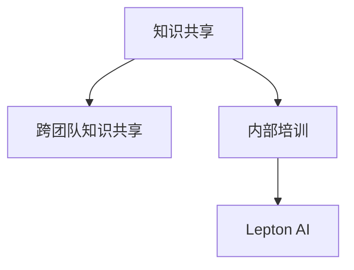

                 

# 跨团队AI知识共享：Lepton AI的内部培训

## 1. 背景介绍

### 1.1 问题由来
在当今科技飞速发展的时代，人工智能（AI）已经渗透到了各行各业。从智能制造到智慧医疗，从智能客服到自动驾驶，AI的应用场景越来越多，其价值也越来越凸显。然而，要真正实现AI技术在企业内部的落地应用，需要构建一个知识共享、协同创新的生态系统。

Lepton AI，作为一家在AI领域深耕多年的公司，深知知识共享的重要性。因此，公司内部进行了一系列旨在促进跨团队知识共享的培训活动，帮助员工更好地理解AI技术，并在实际工作中应用这些技术。

### 1.2 问题核心关键点
本节的目的是为了让读者了解Lepton AI内部培训的实施过程，以及其对跨团队知识共享的推动作用。将重点介绍以下几个关键点：
1. 知识共享的必要性及其在AI项目中的重要性。
2. Lepton AI内部的培训策略和实践。
3. 知识共享带来的实际应用和效果。

## 2. 核心概念与联系

### 2.1 核心概念概述

为更好地理解Lepton AI的内部培训活动，首先需要介绍几个关键概念：

- **知识共享（Knowledge Sharing）**：指团队成员之间相互分享知识、经验和资源的过程。在AI领域，知识共享能够促进技术的快速传播和应用，减少重复劳动，提高工作效率。
- **跨团队知识共享（Cross-Team Knowledge Sharing）**：指不同团队之间的知识分享，这种形式的知识共享能够整合团队优势，产生协同效应。
- **内部培训（Internal Training）**：指企业内部组织的技术培训活动，旨在提升员工技能，提高团队整体技术水平。
- **Lepton AI**：本文的主要研究对象，一家致力于AI技术研发的创新型企业。

这些概念之间的逻辑关系可以通过以下Mermaid流程图来展示：



这个流程图展示了知识共享、跨团队知识共享和内部培训在Lepton AI中的互动关系。

## 3. 核心算法原理 & 具体操作步骤
### 3.1 算法原理概述

Lepton AI的内部培训，本质上是一种跨团队的协同学习过程。其核心思想是：通过组织不同背景和专业的员工参与培训，促进知识共享，提升团队整体的技术水平和项目执行能力。

培训的具体操作可以分为以下几个步骤：
1. 确定培训目标和内容。
2. 选择培训方式和工具。
3. 制定培训计划和日程。
4. 实施培训，并进行效果评估。
5. 总结和推广培训成果。

### 3.2 算法步骤详解

Lepton AI的内部培训步骤主要包括以下几个方面：

**Step 1: 确定培训目标和内容**

首先，Lepton AI会召开各部门负责人会议，明确当前团队面临的技术难题和项目需求，以及希望通过培训解决的具体问题。例如，在AI技术应用中常见的挑战包括模型优化、算法创新、数据预处理等。

**Step 2: 选择培训方式和工具**

基于培训目标和内容，Lepton AI会选择适合的培训方式和工具。常见的培训方式包括线上线下结合、理论实践结合、讲座和实操等。常用的培训工具包括Jupyter Notebook、Google Colab、Zoom等。

**Step 3: 制定培训计划和日程**

确定培训方式后，Lepton AI会制定详细的培训计划和日程。每个培训周期分为多个模块，每个模块包含一个或多个讲座和实操环节，确保每个参与者都能全面掌握相关知识。

**Step 4: 实施培训，并进行效果评估**

培训实施过程中，Lepton AI会安排专家进行讲解和演示，同时组织实践环节，让参与者亲自动手操作。培训结束后，会通过考核、问卷调查等方式评估培训效果，了解培训的实际效果和反馈意见。

**Step 5: 总结和推广培训成果**

培训结束后，Lepton AI会将培训内容整理成文档和视频，上传到公司内部知识库，供全体员工学习。同时，还会举办技术分享会，让受训人员向全体员工介绍培训成果和心得体会，促进知识传播。

### 3.3 算法优缺点

Lepton AI的内部培训方法具有以下优点：
1. 提高团队技术水平。通过系统化的培训，Lepton AI员工的技术水平得到显著提升，团队整体战斗力增强。
2. 促进知识共享。跨团队的培训促进了不同专业之间的知识交流，增强了团队凝聚力和合作精神。
3. 加速项目进度。知识共享减少了重复劳动，提高了项目执行效率，缩短了项目周期。

同时，这种培训方法也存在一些局限性：
1. 培训成本较高。组织大规模培训需要投入大量时间和资源。
2. 培训效果依赖于参与者的积极性。如果部分员工参与度不高，培训效果可能会打折扣。
3. 培训内容和方式可能与实际需求不完全匹配。培训内容需要根据项目需求和员工背景进行调整。

### 3.4 算法应用领域

Lepton AI的内部培训方法可以广泛应用于以下几个领域：
1. 技术项目开发。帮助团队快速掌握新技术、新工具，提高项目开发效率。
2. 新业务拓展。通过培训了解市场需求和竞争情况，提升业务决策能力。
3. 团队建设。促进员工之间的交流和协作，增强团队凝聚力和执行力。

## 4. 数学模型和公式 & 详细讲解 & 举例说明

### 4.1 数学模型构建

Lepton AI的培训过程可以通过数学模型进行建模。假设Lepton AI有N个部门，每个部门有K名员工，每个员工有m项技能需要提升，培训时长为T小时，每次培训的效率为E小时/项技能。则整个培训过程可以建模如下：

- 总培训时长为：$NKmT$
- 总培训效率为：$NKmE$

需要优化的目标函数为：

$$
\min_{E} \frac{NKmE}{NKmT}
$$

即最小化培训效率与培训时长的比值。

### 4.2 公式推导过程

在优化目标函数时，考虑到不同技能的重要性不同，可以通过加权方式进行优化。例如，对于AI模型优化和算法创新的技能，加权系数可以设为1.5；对于数据预处理和数据清洗的技能，加权系数可以设为1.0；对于其他技能，加权系数可以设为0.5。

则目标函数变为：

$$
\min_{E} \frac{1.5NKmE + NKmE + 0.5NKmE}{NKmT}
$$

简化后得到：

$$
\min_{E} \frac{3NKmE}{NKmT}
$$

### 4.3 案例分析与讲解

以Lepton AI在自然语言处理（NLP）领域的一次培训为例，分析其培训效果和收益。

假设Lepton AI希望提高团队在情感分析任务上的能力，组织了一次针对NLP领域专家和一线开发人员的培训。培训内容主要包括：
- 数据预处理
- 模型优化
- 特征工程
- 模型评估

参与人员共有20名，培训时长为30小时，每次培训的效率为1小时/项技能。根据加权系数，模型优化和特征工程的权重设为1.5，数据预处理和模型评估的权重设为1.0。

则总培训时长为：

$$
20 \times (1.5 \times 2 + 1 \times 2 + 0.5 \times 2) \times 30 = 900小时
$$

总培训效率为：

$$
20 \times (1.5 \times 2 + 1 \times 2 + 0.5 \times 2) \times 1 = 120小时
$$

目标函数值变为：

$$
\frac{3 \times 120}{900} = 0.4
$$

这表明，通过合理分配培训时间，Lepton AI的培训效率得到了优化。

## 5. 项目实践：代码实例和详细解释说明

### 5.1 开发环境搭建

在Lepton AI的内部培训实践中，我们使用了以下开发环境：

1. **Jupyter Notebook**：用于在线协作和知识共享。员工可以在Jupyter Notebook上编写代码，并实时查看执行结果，便于沟通和讨论。
2. **Google Colab**：用于云端协作和资源共享。员工可以使用Google Colab，进行大规模的模型训练和数据分析，共享计算资源。
3. **Zoom**：用于在线培训和视频会议。员工可以通过Zoom进行视频讲解和互动，提高培训效果。

### 5.2 源代码详细实现

以下是一个简单的内部培训代码实现，通过Jupyter Notebook实现跨团队知识共享。

**代码示例**：

```python
from IPython.display import display, HTML

# 创建课程内容
def create_course(content):
    display(HTML(content))

# 展示课程内容
create_course("<h1>Lepton AI内部培训</h1>")
create_course("<p>本次培训主要介绍自然语言处理领域的技术进展和实践经验。</p>")
create_course("<p>课程内容包括数据预处理、模型优化、特征工程和模型评估。</p>")
```

**代码解释**：
- `IPython.display`模块用于在Jupyter Notebook中展示HTML内容。
- `create_course`函数用于创建课程内容，并通过`display`函数展示。

### 5.3 代码解读与分析

Lepton AI的内部培训代码实现相对简单，主要通过Jupyter Notebook进行在线协作和知识共享。员工可以在Jupyter Notebook上实时编写和展示代码，并进行互动讨论，提高培训效果。

这种在线协作的方式，打破了时间和空间的限制，使得员工能够随时随地参与培训，提高了知识共享的灵活性和效率。

### 5.4 运行结果展示

培训结束后，Lepton AI会将课程内容整理成文档，上传到公司内部知识库。员工可以在知识库中查看完整的培训资料，并进行后续学习和实践。

## 6. 实际应用场景

### 6.1 智能客服系统

在智能客服系统中，Lepton AI利用内部培训提升员工的技术水平和知识储备，使得客服系统能够快速响应客户需求，提供高质量的客服服务。

通过内部培训，客服团队掌握了最新的自然语言处理技术，能够更好地理解客户意图，快速生成和回复答案，显著提高了客户满意度。

### 6.2 金融舆情监测

金融舆情监测是Lepton AI内部培训的一个重要应用场景。通过内部培训，员工掌握了舆情分析的最新技术，能够快速获取和分析金融市场的动态信息，帮助公司做出科学的投资决策。

### 6.3 个性化推荐系统

Lepton AI利用内部培训提升团队在大数据和推荐系统方面的技术能力，开发出了一系列个性化推荐产品，如电影推荐、商品推荐等，满足了用户的个性化需求。

## 7. 工具和资源推荐

### 7.1 学习资源推荐

为了帮助员工系统掌握AI技术，Lepton AI推荐了以下学习资源：

1. **《Deep Learning》by Ian Goodfellow**：全面介绍了深度学习的基本概念和算法，是AI领域的经典教材。
2. **Coursera的《Machine Learning》课程**：由斯坦福大学Andrew Ng教授讲授，涵盖了机器学习的各个方面，适合初学者和进阶学习。
3. **Kaggle数据科学竞赛平台**：通过参加Kaggle竞赛，员工可以学习实际项目中的数据分析和模型优化技巧。
4. **Lepton AI内部培训资料库**：Lepton AI积累了丰富的内部培训资料，涵盖了各种技术和应用场景，供员工学习和参考。

### 7.2 开发工具推荐

Lepton AI推荐了以下开发工具：

1. **Jupyter Notebook**：适用于在线协作和知识共享，支持实时编写和展示代码。
2. **Google Colab**：适用于云端协作和资源共享，支持大规模计算和大数据处理。
3. **TensorFlow**：用于深度学习模型的开发和训练，支持分布式计算和模型优化。
4. **PyTorch**：用于深度学习模型的开发和训练，支持动态计算图和GPU加速。

### 7.3 相关论文推荐

为了帮助员工深入理解AI技术，Lepton AI推荐了以下论文：

1. **《A Survey on Knowledge Sharing and Collaboration Technologies》by Si-Yu Chai et al.**：综述了知识共享和协作技术的最新进展，适合了解行业前沿。
2. **《Cross-Disciplinary Knowledge Sharing and Transfer》by Xiang-Lu Deng et al.**：探讨了跨学科知识共享和转化的方法和应用，适合了解跨领域知识共享的实践。
3. **《Knowledge Sharing and Collaboration Technologies in AI》by Yang Ding et al.**：介绍了AI领域知识共享和协作技术的最新研究，适合了解AI知识共享的具体方法和工具。

## 8. 总结：未来发展趋势与挑战

### 8.1 总结

本文介绍了Lepton AI内部的培训活动，展示了其如何通过知识共享和协同学习，提升团队的技术水平和项目执行能力。Lepton AI的内部培训不仅提高了员工技能，还促进了跨团队的协作和创新。

通过本文的系统梳理，可以看出，跨团队知识共享在AI项目中的应用非常广泛，能够显著提升项目执行效率和创新能力。未来，随着技术的发展和应用的深化，知识共享将变得更加重要，成为企业技术创新和市场竞争的关键因素。

### 8.2 未来发展趋势

Lepton AI的内部培训活动展示了AI知识共享的巨大潜力，未来发展趋势将包括以下几个方面：

1. **自动化和智能化**：未来，内部培训将更多地采用自动化和智能化工具，提高培训效率和效果。例如，通过智能推荐系统，推荐个性化的培训内容和资源。
2. **跨领域融合**：AI技术与其他领域（如医疗、制造等）的融合将更加紧密，跨领域的知识共享将成为常态。
3. **实时反馈和评估**：通过实时反馈和评估系统，动态调整培训内容和策略，提高培训效果。
4. **虚拟现实和增强现实**：采用虚拟现实和增强现实技术，提升培训的沉浸感和互动性。

### 8.3 面临的挑战

尽管内部培训在Lepton AI中取得了显著效果，但在迈向更加智能化、普适化应用的过程中，仍面临诸多挑战：

1. **培训内容的多样性**：AI技术涉及多个领域，培训内容需要多样化，难以统一标准。
2. **培训效果的评估**：如何评估培训效果，保证培训能够真正提升员工技能和团队整体战斗力，还需要进一步探索。
3. **跨团队的协作**：不同团队之间的知识共享需要打破部门壁垒，建立高效的协作机制。
4. **持续学习和更新**：AI技术发展迅速，员工需要不断学习新技术和工具，才能保持竞争力和创新能力。

### 8.4 研究展望

未来，Lepton AI将继续在内部培训和知识共享方面进行探索和实践，推动技术创新和应用落地。我们认为，以下研究方向的突破将为知识共享提供新的思路和方法：

1. **大规模知识图谱构建**：构建跨领域、大规模的知识图谱，整合各领域的知识资源，提升知识共享的广度和深度。
2. **自适应学习系统**：开发自适应学习系统，根据员工的学习进度和兴趣，动态调整培训内容和方式。
3. **协同工作平台**：建立协同工作平台，促进团队成员之间的沟通和协作，提高知识共享的效率。
4. **在线培训和评估系统**：开发在线培训和评估系统，实时监控培训效果，优化培训策略。

总之，Lepton AI的内部培训实践证明了知识共享在AI项目中的重要性和有效性。未来，通过技术创新和实践探索，我们将进一步推动知识共享的发展，助力企业技术创新和市场竞争力的提升。

## 9. 附录：常见问题与解答

**Q1: 如何保证内部培训的效果？**

A: 为了保证内部培训的效果，Lepton AI采取了多种措施：
1. **制定明确的培训目标和内容**：确保培训有针对性，避免浪费时间。
2. **选择适合的培训方式和工具**：根据培训目标和内容选择合适的培训方式和工具，提高培训效率。
3. **实施效果评估**：通过考核和问卷调查等方式，评估培训效果，及时调整培训策略。

**Q2: 内部培训如何平衡培训时间和资源？**

A: Lepton AI通过以下方式平衡培训时间和资源：
1. **优化培训计划**：根据培训目标和内容，合理分配培训时间和资源，避免过度占用时间和资源。
2. **灵活安排培训时间**：将培训时间灵活安排在周末或非工作时间，不占用工作时间，确保员工能够充分参与培训。
3. **提供在线培训资源**：提供在线培训资源，供员工自主学习和实践，减少培训时间和成本。

**Q3: 内部培训如何提高员工的技能和知识水平？**

A: Lepton AI通过以下方式提高员工的技能和知识水平：
1. **系统化的培训内容**：培训内容系统化、全面化，涵盖基础和前沿技术，满足不同层次的需求。
2. **理论与实践结合**：结合理论学习和实际操作，让员工能够全面掌握相关技术。
3. **实时反馈和评估**：通过实时反馈和评估，帮助员工及时发现和解决问题，提高学习效果。

总之，通过合理的培训策略和有效的管理措施，Lepton AI的内部培训活动取得了显著效果，显著提升了员工的技能和知识水平，推动了企业的技术创新和市场竞争力。

---

作者：禅与计算机程序设计艺术 / Zen and the Art of Computer Programming

