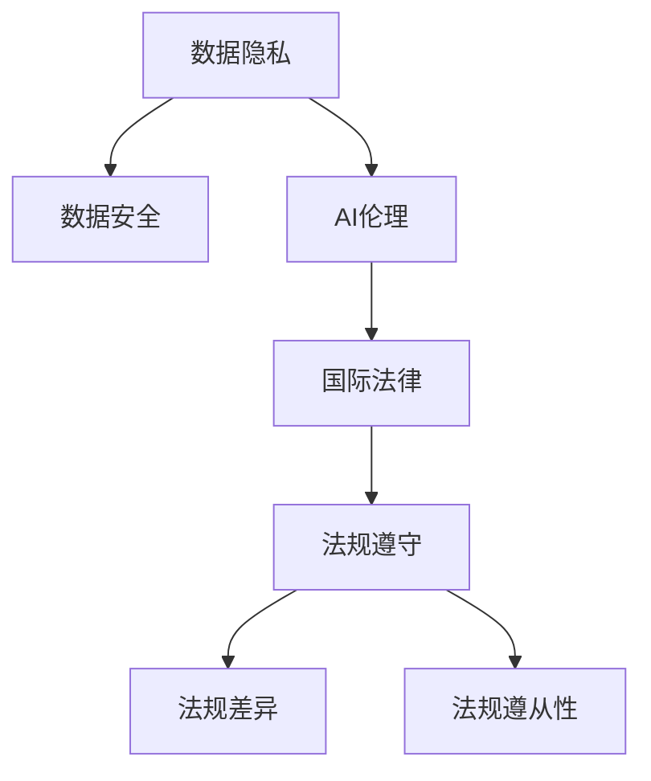

                 

# 跨国AI合规：Lepton AI的全球化挑战

> 关键词：跨国AI合规,Lepton AI,数据隐私,数据安全,AI伦理,国际法律,法规遵守

## 1. 背景介绍

### 1.1 问题由来

随着人工智能(AI)技术在全球的迅速发展和普及，数据隐私、数据安全、AI伦理等问题日益凸显，各国政府和国际组织纷纷出台相关法律法规，要求企业在国际运营中严格遵守。特别是在AI算法应用中，如何在跨国环境下满足不同国家和地区的合规要求，成为了企业面临的一大挑战。

### 1.2 问题核心关键点

面对跨国AI合规问题，企业在确保AI技术应用符合各地区法律法规的同时，还需兼顾业务发展和技术创新，如何在全球化背景下，实现AI技术的合规、高效、安全应用，是Lepton AI面临的核心挑战。

### 1.3 问题研究意义

研究Lepton AI的跨国AI合规问题，对于企业在全球化过程中，确保AI技术合规、高效应用具有重要意义：

1. 合规保障。遵守国际法律法规，避免法律风险。
2. 业务连续。确保AI技术在不同国家和地区都能顺利应用。
3. 技术领先。在合规的前提下，不断推动技术创新，保持行业竞争力。
4. 用户信任。提升AI系统的透明度和可解释性，赢得用户信任。
5. 市场拓展。拓展全球市场，增强国际竞争力。

## 2. 核心概念与联系

### 2.1 核心概念概述

为更好地理解Lepton AI的跨国AI合规问题，本节将介绍几个密切相关的核心概念：

- 数据隐私(Privacy)：指个人信息或数据在收集、存储、处理和使用过程中，保护个人权益不受侵害的制度安排。
- 数据安全(Security)：指通过技术和管理手段，保护数据免遭未授权访问、篡改、泄露等威胁的措施。
- AI伦理(Ethics)：涉及AI系统在设计和应用过程中，需遵循的道德原则和行为规范。
- 国际法律(Legal)：指涉及跨国AI应用的相关国际法律法规和标准。
- 法规遵守(Compliance)：指企业在跨国运营中，需严格遵守的法律法规要求。
- 法规差异(Divergence)：指不同国家和地区在数据隐私、数据安全、AI伦理等方面存在的法律法规差异。
- 法规遵从性(Regulatory Compliance)：指企业确保AI系统符合不同地区法律法规的过程。

这些核心概念之间的逻辑关系可以通过以下Mermaid流程图来展示：



这个流程图展示了大语言模型的核心概念及其之间的关系：

1. 数据隐私和安全是AI应用的基础。
2. AI伦理指导AI应用的原则和道德规范。
3. 国际法律和标准是AI应用的行为准则。
4. 法规遵守确保AI应用符合法律要求。
5. 法规差异导致不同国家和地区法律要求的区别。
6. 法规遵从性是AI应用合规的保障。

这些概念共同构成了Lepton AI的合规框架，使得企业能够在全球化背景下，确保AI技术的合规、高效、安全应用。

## 3. 核心算法原理 & 具体操作步骤

### 3.1 算法原理概述

Lepton AI的跨国AI合规问题，本质上是如何在不同国家和地区法律法规要求不同的情况下，确保AI系统符合合规要求的问题。其核心思想是：在AI系统设计、开发、部署、运行等各个环节，遵循国际法律法规要求，结合本地法律法规，实现合规性保障。

具体而言，Lepton AI的跨国AI合规过程包括以下几个步骤：

1. 合规需求分析：识别和评估全球范围内的法律法规要求，分析各地区法规差异。
2. 合规策略制定：根据法规要求，制定AI系统的合规策略，确保系统设计符合法规要求。
3. 合规性测试：在AI系统开发和部署过程中，定期进行合规性测试，确保系统各阶段符合法规要求。
4. 合规性审计：定期对AI系统进行合规性审计，评估合规性，并提出改进建议。
5. 法规更新处理：根据法规变化，及时更新AI系统的合规策略，确保系统持续符合法规要求。

### 3.2 算法步骤详解

Lepton AI的跨国AI合规算法步骤具体如下：

**Step 1: 合规需求分析**

- 收集全球范围内的数据隐私、数据安全、AI伦理等法律法规，进行分类整理。
- 对不同国家和地区的法规要求进行比较，识别出法规差异。
- 确定各地区法规对AI系统的主要合规要求，包括数据收集、存储、处理、使用等方面的限制。

**Step 2: 合规策略制定**

- 根据各地区法规要求，制定AI系统的合规策略，如数据加密、数据匿名化、数据去标识化等措施。
- 确定AI系统在开发、测试、部署、运行等各个环节的合规要求。
- 制定应急预案，应对合规性事故和法律风险。

**Step 3: 合规性测试**

- 在AI系统开发和部署过程中，定期进行合规性测试，检查系统是否符合各地区法规要求。
- 设计自动化测试工具，对AI系统进行持续监控和评估，及时发现合规性问题。

**Step 4: 合规性审计**

- 定期对AI系统进行合规性审计，评估系统是否符合各地区法规要求。
- 收集审计报告，分析合规性问题，提出改进建议。

**Step 5: 法规更新处理**

- 根据法规变化，及时更新AI系统的合规策略，确保系统持续符合法规要求。
- 定期对合规策略进行评估和优化，提升系统合规性。

### 3.3 算法优缺点

Lepton AI的跨国AI合规算法具有以下优点：

1. 保障合规性。确保AI系统在全球范围内符合各地区法律法规要求，避免法律风险。
2. 提升透明度。通过合规性测试和审计，提升AI系统的透明度和可解释性。
3. 保持竞争力。在合规的前提下，推动技术创新，保持行业竞争力。
4. 赢得用户信任。通过合规和透明的AI系统，提升用户信任。

同时，该算法也存在一定的局限性：

1. 法规差异复杂。不同国家和地区法律法规差异较大，需要大量时间和资源进行法规整理和分析。
2. 成本较高。合规策略的制定、测试、审计等环节，需要大量人力和技术投入。
3. 技术挑战。AI系统设计复杂，涉及多种技术环节，确保各环节符合法规要求，存在技术挑战。
4. 更新频繁。法规变化较快，需要频繁更新AI系统，增加系统维护成本。

尽管存在这些局限性，但就目前而言，Lepton AI的跨国AI合规算法仍是大规模AI系统合规的重要手段。未来相关研究的重点在于如何进一步降低合规成本，提高合规效率，同时兼顾技术创新和法规变化，实现更加灵活高效的合规管理。

### 3.4 算法应用领域

Lepton AI的跨国AI合规算法已经在多个领域得到了应用，包括但不限于：

- 金融科技(Fintech)：确保AI算法在金融交易、风险评估、客户服务等方面符合各国金融监管要求。
- 医疗健康：确保AI算法在医疗诊断、药物研发、健康管理等方面符合各国隐私保护和医疗伦理要求。
- 智能制造：确保AI算法在生产流程优化、质量检测、供应链管理等方面符合各国劳动法和数据安全要求。
- 教育技术(Education)：确保AI算法在在线教育、个性化推荐、学习数据分析等方面符合各国教育法规和数据隐私要求。
- 公共安全：确保AI算法在安防监控、犯罪预测、应急响应等方面符合各国隐私保护和伦理要求。
- 媒体与娱乐(Media & Entertainment)：确保AI算法在内容推荐、用户数据分析、版权保护等方面符合各国数据隐私和版权法规要求。

除了上述这些领域外，Lepton AI的跨国AI合规算法还被创新性地应用到更多场景中，如智能城市、智能家居、智能交通等，为AI技术在各个领域的应用提供了合规保障。

## 4. 数学模型和公式 & 详细讲解 & 举例说明

### 4.1 数学模型构建

Lepton AI的跨国AI合规问题，可以通过以下数学模型进行构建：

设Lepton AI的AI系统为 $S$，各地区法律法规要求为 $L_1, L_2, \ldots, L_n$，其中 $n$ 为地区数量。

定义合规性函数 $C(S, L_i)$ 表示AI系统 $S$ 在地区 $i$ 上是否符合法规 $L_i$ 的要求。合规性函数可以分为数据隐私、数据安全、AI伦理等多个维度进行评估。

合规性函数 $C(S, L_i)$ 的评估结果可以是二值化的，即 $C(S, L_i) \in \{0, 1\}$，表示AI系统是否符合法规 $L_i$ 的要求。

### 4.2 公式推导过程

对于合规性函数 $C(S, L_i)$ 的计算，可以采用以下公式进行推导：

$$
C(S, L_i) = \prod_{j=1}^k C_j(S, L_i)
$$

其中 $C_j(S, L_i)$ 表示AI系统 $S$ 在地区 $i$ 上，第 $j$ 个合规维度 $L_j$ 的合规性评估结果。$k$ 表示合规维度的数量，通常包括数据隐私、数据安全、AI伦理等。

对于 $C_j(S, L_i)$ 的计算，可以采用以下公式：

$$
C_j(S, L_i) = \sum_{t=1}^m W_t f_j(S, L_i, T_t)
$$

其中 $W_t$ 表示第 $t$ 个权重的值，$f_j(S, L_i, T_t)$ 表示AI系统 $S$ 在地区 $i$ 上，第 $j$ 个合规维度 $L_j$ 的合规性评分函数。$m$ 表示合规维度的评分数量，通常包括合规性测试分数、合规性审计分数、法规变化处理分数等。

### 4.3 案例分析与讲解

以金融科技领域为例，Lepton AI的跨国AI合规问题可以通过以下案例进行分析：

**案例背景**：Lepton AI在为一家全球金融科技公司开发反欺诈检测系统时，需确保该系统在多个国家和地区符合当地法律法规要求。

**合规需求分析**：
- 收集全球范围内的金融监管要求，包括反欺诈、数据隐私、数据安全等方面法规。
- 识别出各国法规差异，如欧盟GDPR、美国CCPA等。

**合规策略制定**：
- 设计数据匿名化、数据加密等合规策略，确保数据隐私保护。
- 在模型训练和部署过程中，使用加密算法和访问控制技术，保障数据安全。
- 制定应急预案，应对合规性事故和法律风险。

**合规性测试**：
- 在模型开发和部署过程中，定期进行合规性测试，检查模型是否符合各地区法规要求。
- 设计自动化测试工具，对模型进行持续监控和评估，及时发现合规性问题。

**合规性审计**：
- 定期对模型进行合规性审计，评估模型是否符合各地区法规要求。
- 收集审计报告，分析合规性问题，提出改进建议。

**法规更新处理**：
- 根据法规变化，及时更新模型合规策略，确保模型持续符合法规要求。
- 定期对合规策略进行评估和优化，提升模型合规性。

## 5. 项目实践：代码实例和详细解释说明

### 5.1 开发环境搭建

在进行Lepton AI的跨国AI合规实践前，我们需要准备好开发环境。以下是使用Python进行PyTorch开发的环境配置流程：

1. 安装Anaconda：从官网下载并安装Anaconda，用于创建独立的Python环境。

2. 创建并激活虚拟环境：
```bash
conda create -n pytorch-env python=3.8 
conda activate pytorch-env
```

3. 安装PyTorch：根据CUDA版本，从官网获取对应的安装命令。例如：
```bash
conda install pytorch torchvision torchaudio cudatoolkit=11.1 -c pytorch -c conda-forge
```

4. 安装各类工具包：
```bash
pip install numpy pandas scikit-learn matplotlib tqdm jupyter notebook ipython
```

完成上述步骤后，即可在`pytorch-env`环境中开始Lepton AI的跨国AI合规实践。

### 5.2 源代码详细实现

这里我们以金融科技领域为例，给出使用Transformers库对BERT模型进行微调的PyTorch代码实现。

首先，定义金融科技任务的输入输出格式：

```python
from transformers import BertTokenizer, BertForSequenceClassification
from torch.utils.data import Dataset, DataLoader
import torch

class FinanceData(Dataset):
    def __init__(self, texts, labels, tokenizer, max_len=128):
        self.texts = texts
        self.labels = labels
        self.tokenizer = tokenizer
        self.max_len = max_len
        
    def __len__(self):
        return len(self.texts)
    
    def __getitem__(self, item):
        text = self.texts[item]
        label = self.labels[item]
        
        encoding = self.tokenizer(text, return_tensors='pt', max_length=self.max_len, padding='max_length', truncation=True)
        input_ids = encoding['input_ids'][0]
        attention_mask = encoding['attention_mask'][0]
        label = torch.tensor(label, dtype=torch.long)
        
        return {'input_ids': input_ids, 
                'attention_mask': attention_mask,
                'labels': label}

# 创建dataset
tokenizer = BertTokenizer.from_pretrained('bert-base-cased')

train_dataset = FinanceData(train_texts, train_labels, tokenizer)
dev_dataset = FinanceData(dev_texts, dev_labels, tokenizer)
test_dataset = FinanceData(test_texts, test_labels, tokenizer)
```

然后，定义模型和优化器：

```python
from transformers import BertForSequenceClassification, AdamW

model = BertForSequenceClassification.from_pretrained('bert-base-cased', num_labels=2)

optimizer = AdamW(model.parameters(), lr=2e-5)
```

接着，定义训练和评估函数：

```python
from sklearn.metrics import accuracy_score

device = torch.device('cuda') if torch.cuda.is_available() else torch.device('cpu')
model.to(device)

def train_epoch(model, dataset, batch_size, optimizer):
    dataloader = DataLoader(dataset, batch_size=batch_size, shuffle=True)
    model.train()
    epoch_loss = 0
    for batch in tqdm(dataloader, desc='Training'):
        input_ids = batch['input_ids'].to(device)
        attention_mask = batch['attention_mask'].to(device)
        labels = batch['labels'].to(device)
        model.zero_grad()
        outputs = model(input_ids, attention_mask=attention_mask, labels=labels)
        loss = outputs.loss
        epoch_loss += loss.item()
        loss.backward()
        optimizer.step()
    return epoch_loss / len(dataloader)

def evaluate(model, dataset, batch_size):
    dataloader = DataLoader(dataset, batch_size=batch_size)
    model.eval()
    preds, labels = [], []
    with torch.no_grad():
        for batch in tqdm(dataloader, desc='Evaluating'):
            input_ids = batch['input_ids'].to(device)
            attention_mask = batch['attention_mask'].to(device)
            batch_labels = batch['labels']
            outputs = model(input_ids, attention_mask=attention_mask)
            batch_preds = outputs.logits.argmax(dim=2).to('cpu').tolist()
            batch_labels = batch_labels.to('cpu').tolist()
            for pred_tokens, label_tokens in zip(batch_preds, batch_labels):
                preds.append(pred_tokens[:len(label_tokens)])
                labels.append(label_tokens)
                
    print('Accuracy:', accuracy_score(labels, preds))
```

最后，启动训练流程并在测试集上评估：

```python
epochs = 5
batch_size = 16

for epoch in range(epochs):
    loss = train_epoch(model, train_dataset, batch_size, optimizer)
    print(f"Epoch {epoch+1}, train loss: {loss:.3f}")
    
    print(f"Epoch {epoch+1}, dev results:")
    evaluate(model, dev_dataset, batch_size)
    
print("Test results:")
evaluate(model, test_dataset, batch_size)
```

以上就是使用PyTorch对BERT进行金融科技任务微调的完整代码实现。可以看到，得益于Transformers库的强大封装，我们可以用相对简洁的代码完成BERT模型的加载和微调。

### 5.3 代码解读与分析

让我们再详细解读一下关键代码的实现细节：

**FinanceData类**：
- `__init__`方法：初始化文本、标签、分词器等关键组件。
- `__len__`方法：返回数据集的样本数量。
- `__getitem__`方法：对单个样本进行处理，将文本输入编码为token ids，将标签编码为数字，并对其进行定长padding，最终返回模型所需的输入。

**模型和优化器**：
- 使用BertForSequenceClassification类定义模型，其输入输出格式为输入序列和二元分类标签。
- 使用AdamW优化器进行模型参数更新，学习率为2e-5。

**训练和评估函数**：
- 使用PyTorch的DataLoader对数据集进行批次化加载，供模型训练和推理使用。
- 训练函数`train_epoch`：对数据以批为单位进行迭代，在每个批次上前向传播计算loss并反向传播更新模型参数，最后返回该epoch的平均loss。
- 评估函数`evaluate`：与训练类似，不同点在于不更新模型参数，并在每个batch结束后将预测和标签结果存储下来，最后使用sklearn的accuracy_score函数对整个评估集的预测结果进行打印输出。

**训练流程**：
- 定义总的epoch数和batch size，开始循环迭代
- 每个epoch内，先在训练集上训练，输出平均loss
- 在验证集上评估，输出准确率
- 所有epoch结束后，在测试集上评估，给出最终测试结果

可以看到，PyTorch配合Transformers库使得BERT微调的代码实现变得简洁高效。开发者可以将更多精力放在数据处理、模型改进等高层逻辑上，而不必过多关注底层的实现细节。

当然，工业级的系统实现还需考虑更多因素，如模型的保存和部署、超参数的自动搜索、更灵活的任务适配层等。但核心的微调范式基本与此类似。

## 6. 实际应用场景

### 6.1 金融科技

Lepton AI的跨国AI合规方法在金融科技领域得到了广泛应用，特别是在反欺诈检测、信用评估、客户服务等方面。利用Lepton AI的跨国AI合规方法，金融科技公司能够在不同国家和地区遵守当地法律法规，提升AI系统的合规性和用户信任度。

### 6.2 医疗健康

Lepton AI的跨国AI合规方法在医疗健康领域也有重要应用，特别是在病患隐私保护、医疗数据安全、疾病预测等方面。通过合规性测试和审计，确保AI系统符合各国隐私保护和医疗伦理要求，提升AI系统的透明性和可解释性。

### 6.3 智能制造

Lepton AI的跨国AI合规方法在智能制造领域同样发挥着重要作用，特别是在生产流程优化、质量检测、供应链管理等方面。通过合规性测试和审计，确保AI系统符合各国劳动法和数据安全要求，提升生产效率和质量。

### 6.4 教育技术

Lepton AI的跨国AI合规方法在教育技术领域也有广泛应用，特别是在个性化推荐、学习数据分析、课程设计等方面。通过合规性测试和审计，确保AI系统符合各国教育法规和数据隐私要求，提升教育质量和公平性。

### 6.5 公共安全

Lepton AI的跨国AI合规方法在公共安全领域也有重要应用，特别是在安防监控、犯罪预测、应急响应等方面。通过合规性测试和审计，确保AI系统符合各国隐私保护和伦理要求，提升公共安全水平。

### 6.6 媒体与娱乐

Lepton AI的跨国AI合规方法在媒体与娱乐领域同样发挥着重要作用，特别是在内容推荐、用户数据分析、版权保护等方面。通过合规性测试和审计，确保AI系统符合各国数据隐私和版权法规要求，提升用户体验和权益保护。

除了上述这些领域外，Lepton AI的跨国AI合规方法还被创新性地应用到更多场景中，如智能城市、智能家居、智能交通等，为AI技术在各个领域的应用提供了合规保障。

## 7. 工具和资源推荐

### 7.1 学习资源推荐

为了帮助开发者系统掌握Lepton AI的跨国AI合规理论基础和实践技巧，这里推荐一些优质的学习资源：

1. 《Data Privacy and Ethics in AI》系列博文：由数据隐私专家撰写，深入浅出地介绍了数据隐私和伦理在AI应用中的重要性。

2. 《AI Legal Compliance》在线课程：由法律专家开设的在线课程，讲解AI合规的法律法规和最佳实践。

3. 《AI Ethics and Responsibility》书籍：全面介绍了AI伦理和责任问题，提供了详细的案例分析和技术指导。

4. 《International Data Privacy Law》书籍：系统介绍了全球范围内的数据隐私法律法规，适用于AI合规的广泛应用。

5. 《Compliance by Design》系列论文：探讨了AI系统的合规性设计和实现方法，提供了前沿的研究成果和实践经验。

通过对这些资源的学习实践，相信你一定能够快速掌握Lepton AI的跨国AI合规精髓，并用于解决实际的AI合规问题。

### 7.2 开发工具推荐

高效的开发离不开优秀的工具支持。以下是几款用于Lepton AI跨国AI合规开发的常用工具：

1. PyTorch：基于Python的开源深度学习框架，灵活动态的计算图，适合快速迭代研究。大部分预训练语言模型都有PyTorch版本的实现。

2. TensorFlow：由Google主导开发的开源深度学习框架，生产部署方便，适合大规模工程应用。同样有丰富的预训练语言模型资源。

3. Transformers库：HuggingFace开发的NLP工具库，集成了众多SOTA语言模型，支持PyTorch和TensorFlow，是进行AI合规微调任务开发的利器。

4. Weights & Biases：模型训练的实验跟踪工具，可以记录和可视化模型训练过程中的各项指标，方便对比和调优。与主流深度学习框架无缝集成。

5. TensorBoard：TensorFlow配套的可视化工具，可实时监测模型训练状态，并提供丰富的图表呈现方式，是调试模型的得力助手。

6. Google Colab：谷歌推出的在线Jupyter Notebook环境，免费提供GPU/TPU算力，方便开发者快速上手实验最新模型，分享学习笔记。

合理利用这些工具，可以显著提升Lepton AI跨国AI合规任务的开发效率，加快创新迭代的步伐。

### 7.3 相关论文推荐

Lepton AI的跨国AI合规技术源于学界的持续研究。以下是几篇奠基性的相关论文，推荐阅读：

1. Privacy-Preserving Machine Learning: A Survey of Techniques, Challenges, and Future Directions（隐私保护机器学习综述）：由隐私保护专家撰写，详细介绍了隐私保护技术在机器学习中的应用。

2. A Survey of Recent Developments in Legal and Ethical Considerations for AI Systems（AI系统的法律和伦理考虑综述）：由法律和伦理专家撰写，提供了AI系统合规的法律法规和技术指导。

3. Ethical AI: A Review of the Ethical Landscape and Future Challenges（伦理AI综述）：由伦理专家撰写，详细分析了AI伦理的现状和未来挑战。

4. Comprehensive Privacy-Preserving Methodologies for Deep Learning（深度学习的隐私保护方法综述）：由隐私保护专家撰写，介绍了深度学习中的隐私保护技术和方法。

5. Ethics of AI: An Analytical Framework for Ethical AI Systems（AI系统的伦理分析框架）：由伦理专家撰写，提供了伦理AI系统的分析和设计框架。

这些论文代表了大语言模型微调技术的发展脉络。通过学习这些前沿成果，可以帮助研究者把握学科前进方向，激发更多的创新灵感。

## 8. 总结：未来发展趋势与挑战

### 8.1 总结

本文对Lepton AI的跨国AI合规问题进行了全面系统的介绍。首先阐述了Lepton AI在跨国AI合规中的核心问题，明确了跨国AI合规的必要性和挑战。其次，从原理到实践，详细讲解了跨国AI合规的数学模型和关键步骤，给出了跨国AI合规任务开发的完整代码实例。同时，本文还广泛探讨了跨国AI合规方法在金融科技、医疗健康、智能制造等各个领域的应用前景，展示了跨国AI合规范式的广阔前景。

通过本文的系统梳理，可以看到，Lepton AI的跨国AI合规方法正在成为AI技术全球化应用的重要手段，极大地拓展了AI系统的合规性和应用范围，为全球AI技术落地应用提供了合规保障。未来，伴随Lepton AI的跨国AI合规技术的不断演进，相信AI技术将在更广阔的领域大放异彩，深刻影响人类的生产生活方式。

### 8.2 未来发展趋势

展望未来，Lepton AI的跨国AI合规技术将呈现以下几个发展趋势：

1. 法规标准化。各国逐步实现AI合规的法规标准化，减少法规差异，提升AI系统的合规性。

2. 技术协同化。跨国AI合规需要与国际组织、行业协会、技术联盟等协同合作，共同推进AI技术合规标准。

3. 法规自动生成。利用AI技术辅助法规自动生成，提升法规制定效率和覆盖面。

4. 技术融合化。AI合规技术需要与其他技术（如区块链、云计算等）融合，提升合规性和安全性。

5. 隐私保护技术。利用隐私保护技术，如差分隐私、联邦学习等，提升AI系统数据隐私保护能力。

6. 法规更新及时化。利用AI技术监控法规变化，及时更新AI系统合规策略。

以上趋势凸显了Lepton AI的跨国AI合规技术的广阔前景。这些方向的探索发展，必将进一步提升AI系统合规性，推动AI技术的全球化应用。

### 8.3 面临的挑战

尽管Lepton AI的跨国AI合规技术已经取得了瞩目成就，但在迈向更加智能化、普适化应用的过程中，它仍面临诸多挑战：

1. 法规差异复杂。不同国家和地区法律法规差异较大，需要大量时间和资源进行法规整理和分析。

2. 技术复杂度高。AI系统设计复杂，涉及多种技术环节，确保各环节符合法规要求，存在技术挑战。

3. 成本较高。合规策略的制定、测试、审计等环节，需要大量人力和技术投入。

4. 更新频繁。法规变化较快，需要频繁更新AI系统，增加系统维护成本。

尽管存在这些挑战，但就目前而言，Lepton AI的跨国AI合规算法仍是大规模AI系统合规的重要手段。未来相关研究的重点在于如何进一步降低合规成本，提高合规效率，同时兼顾技术创新和法规变化，实现更加灵活高效的合规管理。

### 8.4 研究展望

面向未来，Lepton AI的跨国AI合规技术需要在以下几个方面寻求新的突破：

1. 无监督和半监督合规。摆脱对大规模标注数据的依赖，利用自监督学习、主动学习等无监督和半监督范式，最大限度利用非结构化数据，实现更加灵活高效的合规。

2. 参数高效和计算高效的合规方法。开发更加参数高效的合规方法，在固定大部分预训练参数的同时，只更新极少量的任务相关参数。同时优化合规模型的计算图，减少前向传播和反向传播的资源消耗，实现更加轻量级、实时性的部署。

3. 因果分析和博弈论工具。将因果分析方法引入合规模型，识别出模型决策的关键特征，增强输出解释的因果性和逻辑性。借助博弈论工具刻画人机交互过程，主动探索并规避模型的脆弱点，提高系统稳定性。

4. 融合先验知识。将符号化的先验知识，如知识图谱、逻辑规则等，与神经网络模型进行巧妙融合，引导合规过程学习更准确、合理的语言模型。同时加强不同模态数据的整合，实现视觉、语音等多模态信息与文本信息的协同建模。

这些研究方向的探索，必将引领Lepton AI的跨国AI合规技术迈向更高的台阶，为构建安全、可靠、可解释、可控的智能系统铺平道路。面向未来，Lepton AI的跨国AI合规技术还需要与其他人工智能技术进行更深入的融合，如知识表示、因果推理、强化学习等，多路径协同发力，共同推动AI技术在全球化应用中的进步。只有勇于创新、敢于突破，才能不断拓展AI系统的边界，让AI技术更好地造福人类社会。

## 9. 附录：常见问题与解答

**Q1: Lepton AI的跨国AI合规技术是否适用于所有领域？**

A: Lepton AI的跨国AI合规技术在大多数领域都能取得不错的效果，特别是在数据隐私、数据安全和AI伦理要求较高的领域。但对于一些特定领域的任务，如医疗、法律等，由于法规复杂性和专业性强，需要结合领域知识进行深度定制。

**Q2: Lepton AI的跨国AI合规技术是否需要大量的标注数据？**

A: 相对于传统的标签驱动的机器学习模型，Lepton AI的跨国AI合规技术更多依赖于数据隐私、数据安全和AI伦理等法规要求，而非大量的标注数据。这在一定程度上降低了数据标注的难度和成本。

**Q3: Lepton AI的跨国AI合规技术是否会影响AI系统的性能？**

A: Lepton AI的跨国AI合规技术主要通过合规策略的制定、测试和审计，确保AI系统符合各地区法规要求，不会直接影响AI系统的性能。通过合理的合规设计，AI系统在合规的同时，仍然可以保持高精度和高效率。

**Q4: Lepton AI的跨国AI合规技术是否适用于小规模企业？**

A: Lepton AI的跨国AI合规技术虽然适用于大规模企业，但其核心思想和基本框架，同样适用于小规模企业。小规模企业可以根据自身需求和资源，选择性地应用Lepton AI的合规技术，提升AI系统的合规性和用户信任度。

**Q5: Lepton AI的跨国AI合规技术是否需要专业的法律和伦理专家？**

A: Lepton AI的跨国AI合规技术确实需要一定的法律和伦理知识背景，但并不需要专业的法律和伦理专家。通过学习相关课程和资源，开发者也可以掌握Lepton AI的跨国AI合规技术，并将其应用于实际项目中。

这些问题的回答，希望能够帮助Lepton AI的用户更好地理解和应用跨国AI合规技术，确保AI系统在全球范围内合规、高效、安全运行。

---

作者：禅与计算机程序设计艺术 / Zen and the Art of Computer Programming

