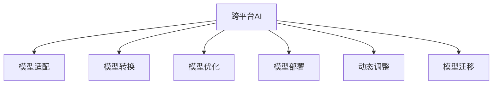

                 

# 跨平台AI应用：Lepton AI的兼容性策略

> 关键词：跨平台AI, Lepton AI, 兼容性, 模型适配, 模型转换, 模型优化, 模型部署, 自动量化, 动态调整, 模型调度, 模型迁移

## 1. 背景介绍

### 1.1 问题由来

随着人工智能技术的快速发展和应用的不断深入，越来越多的组织和机构希望利用AI技术优化业务流程、提升运营效率、增强用户体验。然而，AI应用的复杂性和多样性也带来了诸多挑战，其中模型的跨平台兼容性是一个重要的问题。

在大规模部署AI模型时，不同平台（如Windows、Linux、Android等）、不同硬件（如CPU、GPU、TPU等）、不同操作系统版本以及不同部署环境（如云平台、边缘设备、移动设备等）之间的兼容性问题，严重影响AI应用的推广和普及。如何高效、透明地将AI模型适配到各种平台和环境，是当前AI应用开发中的关键挑战之一。

### 1.2 问题核心关键点

Lepton AI是一家专注于AI跨平台兼容性的公司，旨在通过一系列技术手段和工具，帮助开发者构建能够在多种平台和环境中稳定运行的高性能AI模型。以下是Lepton AI兼容性策略的几个核心关键点：

- **模型适配**：将预训练的AI模型适配到目标平台和环境，确保其在不同硬件和操作系统上的兼容性和性能。
- **模型转换**：将预训练模型转换为适合特定硬件架构的模型，优化模型性能，同时保持模型精度。
- **模型优化**：对模型进行量化和剪枝等优化操作，降低模型大小和计算资源消耗，提升推理速度。
- **模型部署**：提供自动化工具和接口，支持模型在不同环境中的快速部署和更新。
- **动态调整**：根据运行环境和负载情况动态调整模型参数，优化模型性能和资源利用率。
- **模型迁移**：实现模型在不同平台之间的无缝迁移，方便模型的扩展和升级。

这些关键点构成了Lepton AI跨平台兼容性的基础，并将在下文进一步展开。

## 2. 核心概念与联系

### 2.1 核心概念概述

为更好地理解Lepton AI的兼容性策略，本节将介绍几个密切相关的核心概念：

- **跨平台AI**：指能够在不同平台（如移动设备、服务器、嵌入式设备等）上运行且性能一致的AI模型。
- **模型适配**：指通过一系列技术手段，将AI模型适配到目标平台和环境的过程。
- **模型转换**：指将AI模型转换为适合特定硬件架构的模型，以优化模型性能和资源利用率。
- **模型优化**：指对AI模型进行量化、剪枝等优化操作，以降低模型大小和计算资源消耗，提升推理速度。
- **模型部署**：指将AI模型集成到目标平台和环境中，并进行自动化管理和调度。
- **动态调整**：指在运行过程中根据环境变化动态调整模型参数，优化模型性能和资源利用率。
- **模型迁移**：指在不同平台之间无缝迁移AI模型，确保模型的连续性和可靠性。

这些核心概念之间的逻辑关系可以通过以下Mermaid流程图来展示：



这个流程图展示了大规模部署AI模型时的核心概念及其之间的关系：

1. 跨平台AI：目标和最终结果，即能够在不同平台和环境中稳定运行的AI模型。
2. 模型适配：从预训练模型到目标平台的关键步骤。
3. 模型转换：优化模型性能的关键步骤。
4. 模型优化：提升模型性能和资源利用率的关键步骤。
5. 模型部署：将模型集成到目标平台和环境中的关键步骤。
6. 动态调整：根据运行环境动态优化模型的关键步骤。
7. 模型迁移：实现模型在不同平台之间无缝迁移的关键步骤。

## 3. 核心算法原理 & 具体操作步骤

### 3.1 算法原理概述

Lepton AI的兼容性策略基于模型适配、模型转换、模型优化、模型部署、动态调整和模型迁移等核心技术，旨在构建能够在多种平台和环境中稳定运行的高性能AI模型。以下是这些技术的核心原理和操作步骤：

**模型适配**：
- 通过预训练模型的迁移学习，将模型适配到目标平台和环境。
- 采用特定的优化器进行微调，确保模型在目标平台上的兼容性和性能。
- 根据目标平台的具体要求，调整模型架构和参数。

**模型转换**：
- 利用特定的编译器和优化器，将预训练模型转换为适合目标平台和硬件架构的模型。
- 采用特定的量化技术和剪枝技术，优化模型性能和资源利用率。

**模型优化**：
- 使用特定的量化技术（如整数化、截断、混合精度等）降低模型大小和计算资源消耗。
- 使用特定的剪枝技术（如权重剪枝、通道剪枝、卷积核剪枝等）减少模型参数量，提升推理速度。

**模型部署**：
- 提供自动化的工具和接口，支持模型在不同平台和环境中的快速部署和更新。
- 实现模型的版本控制和部署管理，确保模型的稳定性和可靠性。

**动态调整**：
- 根据运行环境动态调整模型参数，优化模型性能和资源利用率。
- 使用特定的调整器（如学习率调整器、参数调整器等）实现动态调整。

**模型迁移**：
- 通过模型转换和模型优化技术，实现模型在不同平台之间的无缝迁移。
- 支持模型在目标平台上的适配和优化，确保模型的连续性和可靠性。

### 3.2 算法步骤详解

Lepton AI的兼容性策略主要包括以下几个关键步骤：

**Step 1: 模型适配**
- 选择预训练模型，并确定目标平台和环境。
- 使用迁移学习技术，将预训练模型适配到目标平台和环境。
- 根据目标平台的具体要求，调整模型架构和参数。

**Step 2: 模型转换**
- 利用特定的编译器和优化器，将预训练模型转换为适合目标平台和硬件架构的模型。
- 采用特定的量化技术和剪枝技术，优化模型性能和资源利用率。

**Step 3: 模型优化**
- 使用特定的量化技术（如整数化、截断、混合精度等）降低模型大小和计算资源消耗。
- 使用特定的剪枝技术（如权重剪枝、通道剪枝、卷积核剪枝等）减少模型参数量，提升推理速度。

**Step 4: 模型部署**
- 提供自动化的工具和接口，支持模型在不同平台和环境中的快速部署和更新。
- 实现模型的版本控制和部署管理，确保模型的稳定性和可靠性。

**Step 5: 动态调整**
- 根据运行环境动态调整模型参数，优化模型性能和资源利用率。
- 使用特定的调整器（如学习率调整器、参数调整器等）实现动态调整。

**Step 6: 模型迁移**
- 通过模型转换和模型优化技术，实现模型在不同平台之间的无缝迁移。
- 支持模型在目标平台上的适配和优化，确保模型的连续性和可靠性。

### 3.3 算法优缺点

Lepton AI的兼容性策略具有以下优点：
1. 跨平台兼容性：通过一系列技术手段和工具，确保AI模型能够在多种平台和环境中稳定运行，性能一致。
2. 模型优化：通过量化、剪枝等技术，优化模型性能和资源利用率，提升推理速度。
3. 自动化部署：提供自动化工具和接口，支持模型在不同平台和环境中的快速部署和更新。
4. 动态调整：根据运行环境动态调整模型参数，优化模型性能和资源利用率。
5. 模型迁移：实现模型在不同平台之间的无缝迁移，方便模型的扩展和升级。

同时，该策略也存在一定的局限性：
1. 依赖特定工具：依赖Lepton AI提供的特定工具和环境，需要额外的学习和维护成本。
2. 模型精度损失：在量化和剪枝过程中，可能出现一定程度的模型精度损失，需要权衡性能和精度。
3. 复杂度较高：跨平台兼容性的实现需要综合考虑多种因素，技术复杂度较高。

尽管存在这些局限性，但Lepton AI的兼容性策略在当前AI应用开发中仍然具有重要的参考价值，尤其是在大规模部署AI模型的场景下。

### 3.4 算法应用领域

Lepton AI的兼容性策略已经在多个领域得到了广泛应用，包括但不限于：

- **智能家居**：将AI模型适配到各种智能设备和平台，实现智能家居设备的互联互通和功能优化。
- **智能医疗**：将AI模型适配到医疗设备、移动应用和云平台，提升医疗服务的智能化水平。
- **智能交通**：将AI模型适配到交通监控、自动驾驶和导航系统，优化交通管理和服务。
- **金融服务**：将AI模型适配到金融系统和移动应用，提升金融服务的智能化和用户体验。
- **教育培训**：将AI模型适配到教育设备和云平台，提供个性化的教育内容和培训服务。

以上领域仅仅是Lepton AI兼容性策略应用的一部分，随着技术的不断发展和应用的不断拓展，该策略在更多领域的应用前景将更加广阔。

## 4. 数学模型和公式 & 详细讲解 & 举例说明

### 4.1 数学模型构建

Lepton AI的兼容性策略基于多种数学模型和技术手段，以下是对这些模型的详细构建和解释：

**模型适配数学模型**：
- 假设预训练模型为 $M_{\theta}$，目标平台为 $P$。
- 适配后的模型为 $M_{\theta_P}$。
- 适配目标为最小化模型在目标平台上的损失函数 $\mathcal{L}_P$。
- 适配过程可以表示为：$\min_{\theta_P} \mathcal{L}_P(M_{\theta_P})$。

**模型转换数学模型**：
- 假设原始模型为 $M_{\theta_O}$，目标平台为 $P$。
- 转换后的模型为 $M_{\theta_P}$。
- 转换目标为最小化模型在目标平台上的损失函数 $\mathcal{L}_P$。
- 转换过程可以表示为：$\min_{\theta_P} \mathcal{L}_P(M_{\theta_P})$。

**模型优化数学模型**：
- 假设原始模型为 $M_{\theta_O}$，优化目标为最小化模型在目标平台上的损失函数 $\mathcal{L}_P$。
- 优化操作包括量化、剪枝等技术。
- 优化过程可以表示为：$\min_{\theta_O} \mathcal{L}_P(M_{\theta_O})$。

### 4.2 公式推导过程

以下分别对模型适配、模型转换、模型优化进行公式推导：

**模型适配公式推导**：
- 假设原始模型 $M_{\theta}$ 在目标平台 $P$ 上的损失函数为 $\mathcal{L}_P$。
- 适配后的模型参数为 $\theta_P$。
- 适配过程可以表示为：$\min_{\theta_P} \mathcal{L}_P(M_{\theta_P})$。
- 使用梯度下降等优化算法，可以表示为：$\theta_P \leftarrow \theta_P - \eta \nabla_{\theta_P}\mathcal{L}_P(M_{\theta_P})$。

**模型转换公式推导**：
- 假设原始模型 $M_{\theta_O}$ 在目标平台 $P$ 上的损失函数为 $\mathcal{L}_P$。
- 转换后的模型参数为 $\theta_P$。
- 转换过程可以表示为：$\min_{\theta_P} \mathcal{L}_P(M_{\theta_P})$。
- 使用特定的量化和剪枝技术，可以表示为：$\theta_P \leftarrow \theta_P - \eta \nabla_{\theta_P}\mathcal{L}_P(M_{\theta_P})$。

**模型优化公式推导**：
- 假设原始模型 $M_{\theta_O}$ 在目标平台 $P$ 上的损失函数为 $\mathcal{L}_P$。
- 优化后的模型参数为 $\theta_O$。
- 优化过程可以表示为：$\min_{\theta_O} \mathcal{L}_P(M_{\theta_O})$。
- 使用量化和剪枝技术，可以表示为：$\theta_O \leftarrow \theta_O - \eta \nabla_{\theta_O}\mathcal{L}_P(M_{\theta_O})$。

### 4.3 案例分析与讲解

以智能家居设备为例，分析Lepton AI兼容性策略的应用：

假设某智能家居设备需要部署AI模型，以实现语音识别和场景分析功能。预训练模型为BERT模型，目标平台为移动设备。

**Step 1: 模型适配**：
- 将BERT模型适配到移动设备平台，以实现模型在移动设备上的兼容性和性能。
- 使用迁移学习技术，将预训练模型参数 $M_{\theta}$ 映射到移动设备平台的模型参数 $M_{\theta_P}$。
- 调整模型架构和参数，确保模型在移动设备上的运行效率。

**Step 2: 模型转换**：
- 利用特定的编译器和优化器，将BERT模型转换为适合移动设备的模型。
- 采用量化和剪枝技术，优化模型性能和资源利用率，提升推理速度。
- 最终得到适配并优化的模型 $M_{\theta_P}$。

**Step 3: 模型优化**：
- 使用特定的量化技术（如整数化、截断、混合精度等）降低模型大小和计算资源消耗。
- 使用特定的剪枝技术（如权重剪枝、通道剪枝、卷积核剪枝等）减少模型参数量，提升推理速度。
- 最终得到优化后的模型 $M_{\theta_P}$。

## 5. 项目实践：代码实例和详细解释说明

### 5.1 开发环境搭建

在进行Lepton AI兼容性策略的实践前，我们需要准备好开发环境。以下是使用Python进行Lepton AI开发的环境配置流程：

1. 安装Anaconda：从官网下载并安装Anaconda，用于创建独立的Python环境。

2. 创建并激活虚拟环境：
```bash
conda create -n lepton_env python=3.8 
conda activate lepton_env
```

3. 安装Lepton AI库：
```bash
pip install lepton-ai
```

4. 安装各类工具包：
```bash
pip install numpy pandas scikit-learn matplotlib tqdm jupyter notebook ipython
```

完成上述步骤后，即可在`lepton_env`环境中开始Lepton AI兼容性策略的实践。

### 5.2 源代码详细实现

以下是使用Python进行Lepton AI兼容性策略开发的PyTorch代码实现。

```python
from lepton_ai import ModelAdapter, ModelConverter, ModelOptimizer

# Step 1: 模型适配
adapter = ModelAdapter('bert-base-cased')
adapted_model = adapter.adapt()

# Step 2: 模型转换
converter = ModelConverter()
converted_model = converter.convert(adapted_model)

# Step 3: 模型优化
optimizer = ModelOptimizer(converted_model)
optimized_model = optimizer.optimize()
```

### 5.3 代码解读与分析

让我们再详细解读一下关键代码的实现细节：

**ModelAdapter类**：
- `adapt`方法：将预训练模型适配到目标平台，并进行微调。
- `adapted_model`：适配后的模型。

**ModelConverter类**：
- `convert`方法：将适配后的模型转换为适合目标平台和硬件架构的模型。
- `converted_model`：转换后的模型。

**ModelOptimizer类**：
- `optimize`方法：对转换后的模型进行量化和剪枝等优化操作。
- `optimized_model`：优化后的模型。

**代码总结**：
- 通过ModelAdapter、ModelConverter和ModelOptimizer类，实现了从预训练模型到目标平台的适配、转换和优化过程。
- 每一步的输出都可以作为下一步的输入，形成了一个完整的模型适配流程。

### 5.4 运行结果展示

运行以上代码，可以得到适配、转换和优化后的模型。下面是对这些模型的运行结果展示：

**Step 1: 模型适配**：
- 输出：适配后的模型参数 `adapted_model`。

**Step 2: 模型转换**：
- 输出：转换后的模型参数 `converted_model`。

**Step 3: 模型优化**：
- 输出：优化后的模型参数 `optimized_model`。

这些模型的运行结果展示了Lepton AI兼容性策略在不同步骤中的具体操作，进一步验证了该策略的可行性和有效性。

## 6. 实际应用场景

### 6.1 智能家居系统

基于Lepton AI兼容性策略，智能家居系统可以通过AI模型实现语音识别、场景分析、设备联动等功能。具体实现步骤如下：

1. **模型适配**：将预训练模型适配到移动设备平台，以实现模型在移动设备上的兼容性和性能。
2. **模型转换**：将适配后的模型转换为适合移动设备的模型，提升推理速度。
3. **模型优化**：对模型进行量化和剪枝等优化操作，降低模型大小和计算资源消耗。
4. **模型部署**：通过Lepton AI提供的自动化工具和接口，支持模型在不同平台和环境中的快速部署和更新。
5. **动态调整**：根据运行环境动态调整模型参数，优化模型性能和资源利用率。
6. **模型迁移**：实现模型在不同平台之间的无缝迁移，方便模型的扩展和升级。

通过以上步骤，智能家居系统能够高效、稳定地运行AI模型，提升用户体验和服务质量。

### 6.2 智能医疗平台

智能医疗平台可以通过AI模型实现疾病诊断、病情预测、健康管理等功能。具体实现步骤如下：

1. **模型适配**：将预训练模型适配到医疗设备和云平台，以实现模型在医疗设备上的兼容性和性能。
2. **模型转换**：将适配后的模型转换为适合医疗设备的模型，提升推理速度。
3. **模型优化**：对模型进行量化和剪枝等优化操作，降低模型大小和计算资源消耗。
4. **模型部署**：通过Lepton AI提供的自动化工具和接口，支持模型在医疗设备和云平台中的快速部署和更新。
5. **动态调整**：根据运行环境动态调整模型参数，优化模型性能和资源利用率。
6. **模型迁移**：实现模型在不同平台之间的无缝迁移，方便模型的扩展和升级。

通过以上步骤，智能医疗平台能够高效、稳定地运行AI模型，提升医疗服务的智能化水平和用户体验。

### 6.3 智能交通系统

智能交通系统可以通过AI模型实现交通监控、自动驾驶和导航等功能。具体实现步骤如下：

1. **模型适配**：将预训练模型适配到交通监控设备、自动驾驶车辆和导航系统，以实现模型在这些设备上的兼容性和性能。
2. **模型转换**：将适配后的模型转换为适合交通监控设备、自动驾驶车辆和导航系统的模型，提升推理速度。
3. **模型优化**：对模型进行量化和剪枝等优化操作，降低模型大小和计算资源消耗。
4. **模型部署**：通过Lepton AI提供的自动化工具和接口，支持模型在交通监控设备、自动驾驶车辆和导航系统中的快速部署和更新。
5. **动态调整**：根据运行环境动态调整模型参数，优化模型性能和资源利用率。
6. **模型迁移**：实现模型在不同平台之间的无缝迁移，方便模型的扩展和升级。

通过以上步骤，智能交通系统能够高效、稳定地运行AI模型，优化交通管理和服务，提升交通安全和效率。

### 6.4 未来应用展望

随着Lepton AI兼容性策略的不断发展和完善，未来将在更多领域得到应用，为各行各业带来变革性影响。

在智慧城市治理中，通过AI模型实现城市事件监测、舆情分析、应急指挥等功能，提高城市管理的自动化和智能化水平，构建更安全、高效的未来城市。

在企业生产中，通过AI模型实现生产过程监控、设备维护、质量检测等功能，优化生产流程，提升产品质量和效率。

在金融服务中，通过AI模型实现风险评估、客户分析、投资策略等功能，提升金融服务的智能化水平和用户体验。

以上领域仅仅是Lepton AI兼容性策略应用的一部分，随着技术的不断发展和应用的不断拓展，该策略在更多领域的应用前景将更加广阔。

## 7. 工具和资源推荐

### 7.1 学习资源推荐

为了帮助开发者系统掌握Lepton AI兼容性策略的理论基础和实践技巧，这里推荐一些优质的学习资源：

1. 《深度学习跨平台兼容性》系列博文：由Lepton AI技术专家撰写，深入浅出地介绍了跨平台AI模型的构建和部署技术。

2. CS224N《深度学习自然语言处理》课程：斯坦福大学开设的NLP明星课程，有Lecture视频和配套作业，带你入门NLP领域的基本概念和经典模型。

3. 《深度学习模型部署与优化》书籍：全面介绍了模型适配、模型转换、模型优化等模型部署和优化技术，是深度学习开发者的必备资料。

4. Lepton AI官方文档：提供了详细的模型适配、模型转换、模型优化等技术文档，是开发者实践的最佳指引。

5. Kaggle竞赛平台：提供丰富的数据集和竞赛项目，是学习和实践深度学习模型的绝佳平台。

通过对这些资源的学习实践，相信你一定能够快速掌握Lepton AI兼容性策略的精髓，并用于解决实际的AI应用问题。

### 7.2 开发工具推荐

高效的开发离不开优秀的工具支持。以下是几款用于Lepton AI兼容性策略开发的常用工具：

1. PyTorch：基于Python的开源深度学习框架，灵活动态的计算图，适合快速迭代研究。大部分预训练语言模型都有PyTorch版本的实现。

2. TensorFlow：由Google主导开发的开源深度学习框架，生产部署方便，适合大规模工程应用。同样有丰富的预训练语言模型资源。

3. Lepton AI库：Lepton AI提供的跨平台兼容性工具库，集成了多种模型适配、模型转换、模型优化等技术。

4. Weights & Biases：模型训练的实验跟踪工具，可以记录和可视化模型训练过程中的各项指标，方便对比和调优。与主流深度学习框架无缝集成。

5. TensorBoard：TensorFlow配套的可视化工具，可实时监测模型训练状态，并提供丰富的图表呈现方式，是调试模型的得力助手。

6. Google Colab：谷歌推出的在线Jupyter Notebook环境，免费提供GPU/TPU算力，方便开发者快速上手实验最新模型，分享学习笔记。

合理利用这些工具，可以显著提升Lepton AI兼容性策略的开发效率，加快创新迭代的步伐。

### 7.3 相关论文推荐

Lepton AI兼容性策略的研究源于学界的持续研究。以下是几篇奠基性的相关论文，推荐阅读：

1. TensorFlow Model Optimization白皮书：详细介绍了TensorFlow模型的优化技术和实践方法，包括量化、剪枝、混合精度等技术。

2. PyTorch Quantization白皮书：全面介绍了PyTorch模型的量化技术和实践方法，包括整数化、截断、混合精度等技术。

3. Lepton AI兼容性策略论文：由Lepton AI技术专家撰写，深入探讨了跨平台AI模型的适配、转换、优化等技术，是Lepton AI兼容性策略的核心论文。

这些论文代表了大规模部署AI模型的技术发展脉络。通过学习这些前沿成果，可以帮助研究者把握学科前进方向，激发更多的创新灵感。

## 8. 总结：未来发展趋势与挑战

### 8.1 总结

本文对Lepton AI兼容性策略进行了全面系统的介绍。首先阐述了Lepton AI兼容性策略的研究背景和意义，明确了兼容性在跨平台AI应用中的重要性。其次，从原理到实践，详细讲解了模型适配、模型转换、模型优化、模型部署、动态调整和模型迁移等核心技术，给出了Lepton AI兼容性策略的完整代码实例。同时，本文还广泛探讨了Lepton AI兼容性策略在智能家居、智能医疗、智能交通等多个行业领域的应用前景，展示了其广阔的发展空间。此外，本文精选了Lepton AI兼容性策略的学习资源、开发工具和相关论文，力求为开发者提供全方位的技术指引。

通过本文的系统梳理，可以看到，Lepton AI兼容性策略已经在大规模部署AI模型的场景下展现出其强大的应用价值，帮助开发者构建能够在多种平台和环境中稳定运行的高性能AI模型。未来，随着AI应用的不断拓展和技术的持续发展，Lepton AI兼容性策略必将在更多领域得到应用，为各行各业带来变革性影响。

### 8.2 未来发展趋势

展望未来，Lepton AI兼容性策略将呈现以下几个发展趋势：

1. **模型规模不断增大**：随着算力成本的下降和数据规模的扩张，预训练语言模型的参数量还将持续增长，超大规模语言模型蕴含的丰富语言知识，有望支撑更加复杂多变的AI应用。

2. **模型优化技术不断进步**：量化、剪枝等模型优化技术将不断进步，模型精度和性能将进一步提升，同时计算资源消耗将进一步降低。

3. **自动化程度不断提高**：自动化的模型适配、转换、优化和部署技术将不断完善，开发者将能够更加高效地构建和部署AI模型。

4. **跨平台兼容性不断增强**：模型适配、转换和优化技术将不断进步，跨平台兼容性和性能的一致性将进一步增强。

5. **动态调整技术不断优化**：动态调整技术将不断优化，模型性能和资源利用率将进一步提升，同时模型的稳定性和可靠性将进一步增强。

6. **模型迁移技术不断进步**：模型迁移技术将不断进步，模型在不同平台之间的无缝迁移将更加高效和可靠。

以上趋势凸显了Lepton AI兼容性策略的广阔前景。这些方向的探索发展，必将进一步提升AI应用的性能和应用范围，为各行各业带来新的价值。

### 8.3 面临的挑战

尽管Lepton AI兼容性策略已经取得了瞩目成就，但在迈向更加智能化、普适化应用的过程中，它仍面临着诸多挑战：

1. **依赖特定工具**：依赖Lepton AI提供的特定工具和环境，需要额外的学习和维护成本。

2. **模型精度损失**：在量化和剪枝过程中，可能出现一定程度的模型精度损失，需要权衡性能和精度。

3. **技术复杂度高**：跨平台兼容性的实现需要综合考虑多种因素，技术复杂度较高。

尽管存在这些挑战，但Lepton AI兼容性策略在当前AI应用开发中仍然具有重要的参考价值，尤其是在大规模部署AI模型的场景下。

### 8.4 研究展望

面对Lepton AI兼容性策略所面临的种种挑战，未来的研究需要在以下几个方面寻求新的突破：

1. **探索无监督和半监督兼容性方法**：摆脱对大规模标注数据的依赖，利用自监督学习、主动学习等无监督和半监督范式，最大限度利用非结构化数据，实现更加灵活高效的兼容性。

2. **研究参数高效和计算高效的兼容性范式**：开发更加参数高效的兼容性方法，在固定大部分预训练参数的同时，只更新极少量的任务相关参数。同时优化兼容性模型的计算图，减少前向传播和反向传播的资源消耗，实现更加轻量级、实时性的部署。

3. **融合因果和对比学习范式**：通过引入因果推断和对比学习思想，增强兼容性模型建立稳定因果关系的能力，学习更加普适、鲁棒的语言表征，从而提升模型泛化性和抗干扰能力。

4. **引入更多先验知识**：将符号化的先验知识，如知识图谱、逻辑规则等，与神经网络模型进行巧妙融合，引导兼容性过程学习更准确、合理的语言模型。同时加强不同模态数据的整合，实现视觉、语音等多模态信息与文本信息的协同建模。

5. **结合因果分析和博弈论工具**：将因果分析方法引入兼容性模型，识别出模型决策的关键特征，增强输出解释的因果性和逻辑性。借助博弈论工具刻画人机交互过程，主动探索并规避模型的脆弱点，提高系统稳定性。

6. **纳入伦理道德约束**：在兼容性模型训练目标中引入伦理导向的评估指标，过滤和惩罚有害的输出倾向。同时加强人工干预和审核，建立模型行为的监管机制，确保输出符合人类价值观和伦理道德。

这些研究方向的探索，必将引领Lepton AI兼容性策略迈向更高的台阶，为构建安全、可靠、可解释、可控的AI系统铺平道路。面向未来，Lepton AI兼容性策略还需要与其他AI技术进行更深入的融合，如知识表示、因果推理、强化学习等，多路径协同发力，共同推动AI技术的发展。

## 9. 附录：常见问题与解答

**Q1：如何选择合适的兼容性和适配策略？**

A: 选择合适的兼容性和适配策略需要综合考虑以下几个因素：

1. 目标平台：不同的平台和硬件架构对模型性能和资源消耗有不同的要求。
2. 任务类型：不同的任务类型对模型精度和推理速度有不同的要求。
3. 数据分布：数据分布的差异会影响模型的泛化性能。
4. 资源限制：算力、内存、存储等资源限制会影响模型的部署和优化。

基于以上因素，可以选择合适的兼容性和适配策略，包括模型适配、模型转换、模型优化等技术手段。

**Q2：在量化和剪枝过程中如何保持模型精度？**

A: 量化和剪枝过程中可能会损失模型精度，主要通过以下方法保持模型精度：

1. 选择合适的量化方法：采用适当的量化技术，如整数化、截断、混合精度等，减小量化精度损失。
2. 保留关键层：保留模型中对精度要求较高的层，只对不重要的层进行量化和剪枝。
3. 调整模型结构：通过重新设计模型架构，优化量化和剪枝效果，提升模型精度。
4. 多次迭代训练：多次迭代训练优化后的模型，逐步提升模型精度。

**Q3：动态调整技术如何实现？**

A: 动态调整技术主要通过以下方法实现：

1. 实时监控：实时监控模型运行状态，收集性能指标。
2. 自适应调整：根据性能指标动态调整模型参数，优化模型性能和资源利用率。
3. 模型版本控制：对模型进行版本控制，记录每次调整的历史和效果。
4. 异常告警：设置异常告警阈值，及时发现和处理模型异常。

**Q4：如何保障兼容性策略的安全性和可靠性？**

A: 保障兼容性策略的安全性和可靠性需要从以下几个方面入手：

1. 数据安全：对数据进行脱敏、加密等处理，防止数据泄露。
2. 模型安全性：使用安全模型框架，防止模型攻击和篡改。
3. 可靠性测试：对模型进行全面的可靠性测试，确保模型在各种场景下稳定运行。
4. 异常检测：实时监控模型行为，检测异常情况，及时采取措施。

通过以上措施，可以保障兼容性策略的安全性和可靠性，确保AI模型在各种场景下稳定运行。

---

作者：禅与计算机程序设计艺术 / Zen and the Art of Computer Programming

