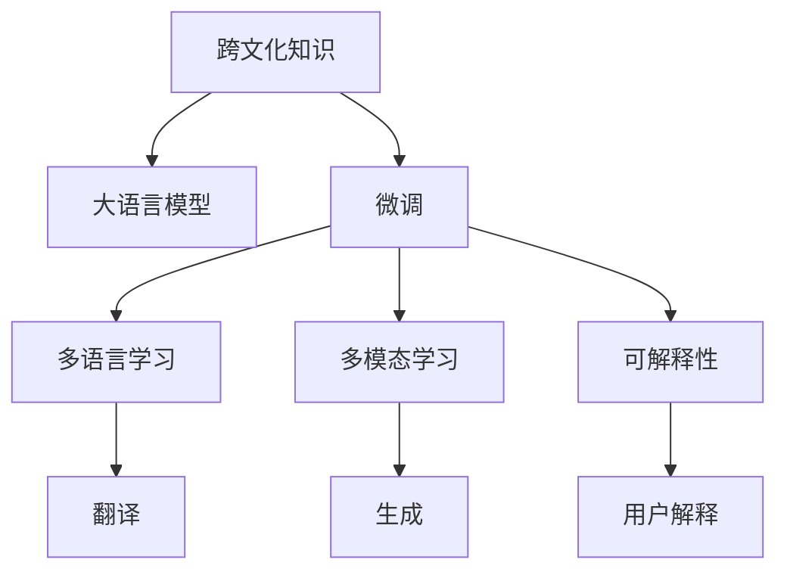

                 

# 跨文化知识：全球视野下的理解与洞察

> 关键词：跨文化知识, 语言模型, 深度学习, 机器翻译, 文本生成, 多模态学习

## 1. 背景介绍

### 1.1 问题由来

随着全球化的深入，不同文化之间的交流日益频繁。然而，语言障碍和文化差异仍然是一大障碍。如何理解和掌握跨文化知识，成为越来越多企业和国家关注的焦点。近年来，人工智能技术在自然语言处理(NLP)领域的快速发展，尤其是深度学习和大规模预训练语言模型，为解决这一问题提供了新的可能性。

深度学习模型，尤其是Transformer结构，能够通过自监督学习任务（如语言建模、掩码语言模型等）在大规模无标签文本数据上预训练，学习到通用的语言表示。这些预训练模型在特定领域数据上微调后，能够获得针对该领域任务的优异性能。例如，基于BERT、GPT等预训练模型的机器翻译、文本生成、跨语言情感分析等任务，都取得了突破性进展。

### 1.2 问题核心关键点

跨文化知识的理解与洞察，实质上是通过深度学习模型对多语言和多文化文本进行学习和推理。具体核心点包括：

- **大规模预训练模型**：通过在大规模无标签文本数据上自监督学习，学习到通用的语言表示。
- **微调**：在特定领域数据上进行微调，使模型掌握特定领域的语言表示和跨文化知识。
- **多语言、多模态学习**：将不同语言和模态的信息整合，构建出更全面、准确的跨文化理解能力。
- **可解释性**：提升模型的可解释性，解释其跨文化推理的逻辑。

本文将系统介绍基于深度学习的跨文化知识理解与洞察方法，涵盖大语言模型、微调、多语言、多模态学习及可解释性等方面的内容。

## 2. 核心概念与联系

### 2.1 核心概念概述

为更好地理解跨文化知识理解与洞察的核心概念，本节将介绍几个关键概念：

- **跨文化知识**：指不同文化背景下对相同概念、事件或情感的共同理解和表达。
- **大语言模型(Large Language Model, LLM)**：通过自监督学习任务在大规模无标签文本数据上预训练，学习到通用的语言表示。
- **微调(Fine-tuning)**：在特定领域数据上进行微调，使模型掌握特定领域的语言表示和跨文化知识。
- **多语言学习**：使模型同时具备多种语言的能力，实现跨语言文本的理解和生成。
- **多模态学习**：将文本、图像、语音等多种模态的信息整合，构建出更全面、准确的跨文化理解能力。
- **可解释性(Explainability)**：提升模型的可解释性，解释其跨文化推理的逻辑。

这些核心概念之间的逻辑关系可以通过以下Mermaid流程图来展示：



这个流程图展示了大语言模型理解与洞察跨文化知识的流程：

1. 跨文化知识通过大语言模型学习。
2. 在大规模无标签数据上进行预训练。
3. 在特定领域数据上进行微调，掌握跨文化知识。
4. 在多语言和多模态数据上进行学习，提升跨文化能力。
5. 通过可解释性技术，将模型推理逻辑解释给用户。

## 3. 核心算法原理 & 具体操作步骤

### 3.1 算法原理概述

基于深度学习的跨文化知识理解与洞察，主要通过以下步骤实现：

1. **大语言模型的预训练**：在无标签的大规模文本数据上进行自监督学习，学习到通用的语言表示。
2. **微调**：在特定领域的数据上进行微调，使模型掌握跨文化知识。
3. **多语言、多模态学习**：将多种语言和模态的信息整合，构建出更全面、准确的跨文化理解能力。
4. **可解释性提升**：通过可解释性技术，解释模型的推理过程和逻辑。

### 3.2 算法步骤详解

#### 3.2.1 大语言模型的预训练

1. **数据准备**：收集大规模无标签文本数据，如维基百科、新闻、社交媒体等。
2. **模型选择**：选择合适的预训练模型，如BERT、GPT等。
3. **训练流程**：在大量文本数据上，使用自监督学习任务（如语言建模、掩码语言模型）训练模型。

#### 3.2.2 微调过程

1. **数据准备**：收集特定领域的标注数据，如跨语言情感分析、机器翻译等。
2. **模型初始化**：将预训练模型作为初始化参数，使用适当的网络架构和损失函数。
3. **训练流程**：在标注数据上，使用优化算法（如AdamW）更新模型参数，最小化损失函数。
4. **评估与调整**：在验证集上评估模型性能，根据结果调整模型超参数，如学习率、批次大小等。

#### 3.2.3 多语言学习

1. **多语言数据准备**：收集多语言的文本数据，并进行对齐和标注。
2. **模型初始化**：使用多语言数据初始化预训练模型，使其具备多语言能力。
3. **训练流程**：在多语言数据上进行微调，优化模型在多种语言上的表现。
4. **评估与调整**：在多语言验证集上评估模型性能，根据结果调整模型超参数。

#### 3.2.4 多模态学习

1. **多模态数据准备**：收集文本、图像、语音等多模态数据，并进行对齐和标注。
2. **模型初始化**：使用多模态数据初始化预训练模型，使其具备多模态能力。
3. **训练流程**：在多模态数据上进行微调，优化模型在多模态上的表现。
4. **评估与调整**：在多模态验证集上评估模型性能，根据结果调整模型超参数。

### 3.3 算法优缺点

跨文化知识理解与洞察的深度学习算法具有以下优点：

- **高效性**：在少量标注数据下，通过微调获得高精度的跨文化知识。
- **通用性**：可以应用于多种NLP任务，如翻译、情感分析、文本生成等。
- **可扩展性**：通过多语言和多模态学习，构建更全面、准确的跨文化理解能力。

同时，也存在一些局限：

- **数据依赖**：对标注数据的依赖较大，获取高质量标注数据的成本较高。
- **资源消耗**：大规模语言模型和深度学习算法的计算资源消耗较大。
- **可解释性不足**：深度学习模型的黑盒特性，导致推理过程难以解释。

### 3.4 算法应用领域

跨文化知识理解与洞察的深度学习算法，已经广泛应用于多个领域，如：

- **机器翻译**：将一种语言翻译成另一种语言。
- **跨语言情感分析**：分析不同语言下的情感倾向。
- **文本生成**：生成不同语言的多样化文本。
- **多语言新闻推送**：根据用户语言偏好，推送多语言新闻内容。
- **多模态跨文化理解**：将文本、图像、语音等信息整合，实现跨文化理解。

## 4. 数学模型和公式 & 详细讲解 & 举例说明

### 4.1 数学模型构建

#### 4.1.1 大语言模型的预训练

大语言模型的预训练通常使用掩码语言模型（Masked Language Model, MLM）进行训练。掩码语言模型的目标是预测被屏蔽的单词，模型输入为部分被屏蔽的文本，输出为所有单词的概率分布。

$$
p(y_i|x_{i-<mask>})
$$

其中，$x_{i-<mask>}$ 为被屏蔽的文本，$y_i$ 为单词 $i$ 的预测概率。掩码语言模型可以通过训练数据计算损失函数：

$$
\mathcal{L} = -\sum_{i=1}^{n} \log p(y_i|x_{i-<mask>})
$$

#### 4.1.2 微调过程

微调通常使用有监督学习任务进行训练。例如，对于机器翻译任务，输入为源语言文本，输出为目标语言文本。可以使用交叉熵损失函数计算损失：

$$
\mathcal{L} = -\frac{1}{N} \sum_{i=1}^{N} \sum_{j=1}^{T} y_{i,j} \log p(x_{i,j}|x_{i<1:j})
$$

其中，$x_{i,j}$ 为源语言文本的第 $j$ 个单词，$y_{i,j}$ 为目标语言文本的第 $j$ 个单词，$T$ 为序列长度。

### 4.2 公式推导过程

#### 4.2.1 大语言模型的预训练

在掩码语言模型中，对于文本 $x$，设 $<mask>$ 符号随机屏蔽 $k$ 个位置，模型目标为预测被屏蔽的单词。假设模型参数为 $\theta$，则训练的优化目标为：

$$
\min_{\theta} \mathcal{L}(\theta) = -\sum_{i=1}^{n} \log p(x_{i-<mask>})
$$

其中，$p(x_{i-<mask>})$ 为模型在屏蔽位置预测单词的概率分布。

#### 4.2.2 微调过程

以机器翻译为例，假设模型参数为 $\theta$，输入为源语言文本 $x$，目标语言文本 $y$，模型输出为条件概率 $p(y|x)$。设损失函数为交叉熵损失，则微调的目标函数为：

$$
\min_{\theta} \mathcal{L}(\theta) = -\frac{1}{N} \sum_{i=1}^{N} \sum_{j=1}^{T} y_{i,j} \log p(x_{i,j}|x_{i<1:j})
$$

其中，$x_{i,j}$ 为源语言文本的第 $j$ 个单词，$y_{i,j}$ 为目标语言文本的第 $j$ 个单词，$T$ 为序列长度。

### 4.3 案例分析与讲解

以跨语言情感分析为例，假设源语言为中文，目标语言为英文。数据集包含中英文情感标注数据，使用BERT进行预训练，然后在微调过程中学习中英文情感映射。具体步骤如下：

1. **预训练**：使用中文文本进行BERT预训练。
2. **微调**：使用中文-英文情感标注数据，在BERT顶层添加分类器，使用交叉熵损失进行微调。
3. **多语言学习**：在微调过程中，使用英文文本进行训练，进一步学习中英文情感映射。
4. **评估**：在英文验证集上评估模型性能，根据结果调整模型超参数。

## 5. 项目实践：代码实例和详细解释说明

### 5.1 开发环境搭建

进行跨文化知识理解与洞察的实践，首先需要搭建好开发环境。以下是使用Python进行PyTorch开发的简单流程：

1. 安装Anaconda：从官网下载并安装Anaconda，用于创建独立的Python环境。

```bash
conda create -n pytorch-env python=3.8 
conda activate pytorch-env
```

2. 安装PyTorch：根据CUDA版本，从官网获取对应的安装命令。例如：

```bash
conda install pytorch torchvision torchaudio cudatoolkit=11.1 -c pytorch -c conda-forge
```

3. 安装Transformers库：

```bash
pip install transformers
```

4. 安装各类工具包：

```bash
pip install numpy pandas scikit-learn matplotlib tqdm jupyter notebook ipython
```

完成上述步骤后，即可在`pytorch-env`环境中开始实践。

### 5.2 源代码详细实现

以下是一个使用PyTorch对BERT进行跨语言情感分析任务微调的简单示例代码。

首先，定义情感分析任务的数据处理函数：

```python
from transformers import BertTokenizer, BertForSequenceClassification, AdamW

tokenizer = BertTokenizer.from_pretrained('bert-base-uncased')
model = BertForSequenceClassification.from_pretrained('bert-base-uncased', num_labels=2)

def preprocess(text):
    tokens = tokenizer.encode(text, return_tensors='pt')
    return tokens
```

然后，定义训练和评估函数：

```python
from torch.utils.data import Dataset, DataLoader

class SentimentDataset(Dataset):
    def __init__(self, texts, labels):
        self.texts = texts
        self.labels = labels
        
    def __len__(self):
        return len(self.texts)
    
    def __getitem__(self, item):
        text = self.texts[item]
        label = self.labels[item]
        return preprocess(text), label

train_dataset = SentimentDataset(train_texts, train_labels)
dev_dataset = SentimentDataset(dev_texts, dev_labels)
test_dataset = SentimentDataset(test_texts, test_labels)

device = torch.device('cuda') if torch.cuda.is_available() else torch.device('cpu')

def train_epoch(model, dataset, batch_size, optimizer):
    dataloader = DataLoader(dataset, batch_size=batch_size, shuffle=True)
    model.train()
    epoch_loss = 0
    for batch in dataloader:
        inputs = batch[0].to(device)
        labels = batch[1].to(device)
        model.zero_grad()
        outputs = model(inputs)
        loss = outputs.loss
        epoch_loss += loss.item()
        loss.backward()
        optimizer.step()
    return epoch_loss / len(dataloader)

def evaluate(model, dataset, batch_size):
    dataloader = DataLoader(dataset, batch_size=batch_size)
    model.eval()
    preds, labels = [], []
    with torch.no_grad():
        for batch in dataloader:
            inputs = batch[0].to(device)
            labels = batch[1].to(device)
            batch_preds = torch.argmax(model(inputs), dim=1).to('cpu').tolist()
            batch_labels = batch[1].to('cpu').tolist()
            for pred, label in zip(batch_preds, batch_labels):
                preds.append(pred)
                labels.append(label)
    print(classification_report(labels, preds))
```

最后，启动训练流程并在测试集上评估：

```python
epochs = 5
batch_size = 16

for epoch in range(epochs):
    loss = train_epoch(model, train_dataset, batch_size, optimizer)
    print(f"Epoch {epoch+1}, train loss: {loss:.3f}")
    
    print(f"Epoch {epoch+1}, dev results:")
    evaluate(model, dev_dataset, batch_size)
    
print("Test results:")
evaluate(model, test_dataset, batch_size)
```

以上就是使用PyTorch对BERT进行跨语言情感分析任务微调的完整代码实现。可以看到，Transformer库的强大封装使得代码实现非常简洁。

### 5.3 代码解读与分析

让我们再详细解读一下关键代码的实现细节：

**SentimentDataset类**：
- `__init__`方法：初始化文本和标签。
- `__len__`方法：返回数据集的样本数量。
- `__getitem__`方法：对单个样本进行处理，将文本转化为token ids，并返回标签。

**train_epoch函数**：
- 对数据以批为单位进行迭代，在每个批次上前向传播计算损失函数，反向传播更新模型参数。

**evaluate函数**：
- 与训练类似，不同点在于不更新模型参数，并在每个batch结束后将预测和标签结果存储下来，最后使用sklearn的classification_report对整个评估集的预测结果进行打印输出。

**训练流程**：
- 定义总的epoch数和batch size，开始循环迭代。
- 每个epoch内，先在训练集上训练，输出平均loss。
- 在验证集上评估，输出分类指标。
- 所有epoch结束后，在测试集上评估，给出最终测试结果。

可以看到，PyTorch配合Transformer库使得BERT微调的代码实现变得简洁高效。开发者可以将更多精力放在数据处理、模型改进等高层逻辑上，而不必过多关注底层的实现细节。

## 6. 实际应用场景

### 6.1 智能客服系统

基于跨文化知识理解的智能客服系统，可以广泛应用于全球范围内的企业客服场景。传统客服往往依赖人工，高峰期响应缓慢，且需要考虑多语言服务。使用预训练语言模型进行跨文化微调，可以提供7x24小时不间断服务，快速响应客户咨询，支持多语言对话。

在技术实现上，可以收集企业内部的历史客服对话记录，将问题和最佳答复构建成监督数据，在此基础上对预训练模型进行跨文化微调。微调后的对话模型能够自动理解用户意图，匹配最合适的答案模板进行回复。对于客户提出的新问题，还可以接入检索系统实时搜索相关内容，动态组织生成回答。如此构建的智能客服系统，能大幅提升客户咨询体验和问题解决效率。

### 6.2 多语言新闻推送

新闻机构需要提供多语言新闻内容，满足不同语言用户的需求。传统人工翻译和本地化处理成本高、效率低，难以应对海量新闻内容的实时更新。使用跨文化知识理解的预训练语言模型，可以自动翻译和本地化新闻内容，提高新闻内容的多语言覆盖和更新速度。

在技术实现上，可以收集多语言新闻文本和翻译，使用预训练模型进行微调。微调后的模型可以自动将源语言文本翻译为目标语言，并进行本地化处理，生成多语言新闻内容。如此构建的多语言新闻推送系统，能够快速准确地提供用户所需的新闻信息，提升新闻机构的服务质量和用户体验。

### 6.3 文化研究与教育

文化研究机构和教育部门需要理解不同文化背景下的语言表达和情感倾向。使用跨文化知识理解的预训练语言模型，可以分析不同文化下的文本数据，提取跨文化情感特征，提供文化分析报告。

在技术实现上，可以收集不同文化的文本数据，使用预训练模型进行微调。微调后的模型可以分析文本情感倾向，生成跨文化情感分析报告，帮助研究机构和教育部门理解不同文化背景下的情感表达。如此构建的文化研究与教育系统，能够为文化研究提供科学依据，促进教育公平和跨文化交流。

### 6.4 未来应用展望

随着跨文化知识理解与洞察技术的不断发展，未来将有更多应用场景得以实现。以下是一些值得期待的未来应用：

- **跨文化社交网络**：构建跨文化社交平台，帮助用户跨越语言和文化障碍，实现实时交流和互动。
- **跨文化推荐系统**：提供跨文化推荐服务，推荐不同文化背景下的商品、内容、旅游目的地等，提升用户体验。
- **跨文化情感分析**：分析不同文化背景下的情感倾向，为广告、舆情监测等领域提供支持。
- **跨文化语音翻译**：提供跨文化语音翻译服务，支持不同语言和文化背景下的语音交流。

## 7. 工具和资源推荐

### 7.1 学习资源推荐

为帮助开发者系统掌握跨文化知识理解与洞察的理论基础和实践技巧，这里推荐一些优质的学习资源：

1. **《自然语言处理入门》**：李宏毅教授的NLP入门课程，系统讲解了NLP的基本概念和常用模型。
2. **《深度学习》**：Ian Goodfellow的深度学习教材，深入浅出地介绍了深度学习的基本原理和算法。
3. **《Transformers》**：Jacob Devlin等人的Transformer论文，介绍了Transformer结构及其应用。
4. **《跨文化知识理解》**：Jürgen Schmid.de et al.的跨文化知识理解论文，讨论了跨文化知识理解的理论和方法。
5. **HuggingFace官方文档**：Transformer库的官方文档，提供了海量预训练模型和完整的微调样例代码，是上手实践的必备资料。

通过对这些资源的学习实践，相信你一定能够快速掌握跨文化知识理解与洞察的精髓，并用于解决实际的NLP问题。

### 7.2 开发工具推荐

高效的开发离不开优秀的工具支持。以下是几款用于跨文化知识理解与洞察开发的常用工具：

1. **PyTorch**：基于Python的开源深度学习框架，灵活动态的计算图，适合快速迭代研究。
2. **TensorFlow**：由Google主导开发的开源深度学习框架，生产部署方便，适合大规模工程应用。
3. **HuggingFace Transformers库**：提供了大量的预训练模型和微调工具，支持多种NLP任务。
4. **Weights & Biases**：模型训练的实验跟踪工具，可以记录和可视化模型训练过程中的各项指标，方便对比和调优。
5. **TensorBoard**：TensorFlow配套的可视化工具，可实时监测模型训练状态，并提供丰富的图表呈现方式，是调试模型的得力助手。

合理利用这些工具，可以显著提升跨文化知识理解与洞察任务的开发效率，加快创新迭代的步伐。

### 7.3 相关论文推荐

跨文化知识理解与洞察的研究源于学界的持续研究。以下是几篇奠基性的相关论文，推荐阅读：

1. **"Attention is All You Need"**：谷歌提出的Transformer模型，开启了NLP领域的预训练大模型时代。
2. **"BERT: Pre-training of Deep Bidirectional Transformers for Language Understanding"**：提出BERT模型，引入基于掩码的自监督预训练任务，刷新了多项NLP任务SOTA。
3. **"Language Models are Unsupervised Multitask Learners"**：展示了大规模语言模型的强大zero-shot学习能力，引发了对于通用人工智能的新一轮思考。
4. **"Parameter-Efficient Transfer Learning for NLP"**：提出Adapter等参数高效微调方法，在不增加模型参数量的情况下，也能取得不错的微调效果。
5. **"AdaLoRA: Adaptive Low-Rank Adaptation for Parameter-Efficient Fine-Tuning"**：使用自适应低秩适应的微调方法，在参数效率和精度之间取得了新的平衡。
6. **"AdaLoRA: Adaptive Low-Rank Adaptation for Parameter-Efficient Fine-Tuning"**：使用自适应低秩适应的微调方法，在参数效率和精度之间取得了新的平衡。

这些论文代表了大语言模型微调技术的发展脉络。通过学习这些前沿成果，可以帮助研究者把握学科前进方向，激发更多的创新灵感。

## 8. 总结：未来发展趋势与挑战

### 8.1 研究成果总结

本文对基于深度学习的跨文化知识理解与洞察方法进行了全面系统的介绍。首先阐述了跨文化知识理解的理论背景和重要性，明确了预训练、微调、多语言、多模态学习及可解释性等方面的核心概念。其次，从原理到实践，详细讲解了跨文化知识理解的数学原理和关键步骤，给出了微调任务开发的完整代码实例。同时，本文还广泛探讨了跨文化知识理解在智能客服、新闻推送、文化研究等诸多领域的应用前景，展示了跨文化知识理解的巨大潜力。此外，本文精选了跨文化知识理解的学习资源，力求为读者提供全方位的技术指引。

通过本文的系统梳理，可以看到，基于深度学习的跨文化知识理解与洞察技术，正在成为NLP领域的重要范式，极大地拓展了预训练语言模型的应用边界，催生了更多的落地场景。受益于大规模语料的预训练，跨文化理解模型在少量标注数据下，也能取得不俗的效果，有力推动了NLP技术的产业化进程。未来，伴随预训练语言模型和跨文化理解方法的持续演进，相信NLP技术将在更广阔的应用领域大放异彩，深刻影响人类的生产生活方式。

### 8.2 未来发展趋势

展望未来，跨文化知识理解与洞察技术将呈现以下几个发展趋势：

1. **模型规模持续增大**：随着算力成本的下降和数据规模的扩张，预训练语言模型的参数量还将持续增长。超大规模语言模型蕴含的丰富语言知识，有望支撑更加复杂多变的跨文化理解任务。
2. **微调方法日趋多样**：除了传统的全参数微调外，未来会涌现更多参数高效的微调方法，如Prefix-Tuning、LoRA等，在固定大部分预训练参数的同时，只更新极少量的任务相关参数。
3. **持续学习成为常态**：随着数据分布的不断变化，跨文化理解模型也需要持续学习新知识以保持性能。如何在不遗忘原有知识的同时，高效吸收新样本信息，将成为重要的研究课题。
4. **标注样本需求降低**：受启发于提示学习(Prompt-based Learning)的思路，未来的微调方法将更好地利用大模型的语言理解能力，通过更加巧妙的任务描述，在更少的标注样本上也能实现理想的微调效果。
5. **多模态跨文化理解崛起**：将文本、图像、语音等多种模态的信息整合，构建出更全面、准确的跨文化理解能力。
6. **跨文化知识与外部知识结合**：将符号化的先验知识，如知识图谱、逻辑规则等，与神经网络模型进行巧妙融合，引导跨文化理解过程学习更准确、合理的语言模型。

以上趋势凸显了跨文化知识理解与洞察技术的广阔前景。这些方向的探索发展，必将进一步提升跨文化理解模型的性能和应用范围，为构建人机协同的智能系统铺平道路。面向未来，跨文化知识理解技术还需要与其他人工智能技术进行更深入的融合，如知识表示、因果推理、强化学习等，多路径协同发力，共同推动跨文化理解系统的进步。

### 8.3 面临的挑战

尽管跨文化知识理解与洞察技术已经取得了瞩目成就，但在迈向更加智能化、普适化应用的过程中，它仍面临着诸多挑战：

1. **标注成本瓶颈**：对标注数据的依赖较大，获取高质量标注数据的成本较高。如何进一步降低微调对标注样本的依赖，将是一大难题。
2. **模型鲁棒性不足**：面对域外数据时，泛化性能往往大打折扣。对于测试样本的微小扰动，跨文化理解模型的预测也容易发生波动。如何提高跨文化理解模型的鲁棒性，避免灾难性遗忘，还需要更多理论和实践的积累。
3. **推理效率有待提高**：大规模语言模型虽然精度高，但在实际部署时往往面临推理速度慢、内存占用大等效率问题。如何在保证性能的同时，简化模型结构，提升推理速度，优化资源占用，将是重要的优化方向。
4. **可解释性亟需加强**：跨文化理解模型的黑盒特性，导致推理过程难以解释。对于医疗、金融等高风险应用，算法的可解释性和可审计性尤为重要。如何赋予跨文化理解模型更强的可解释性，将是亟待攻克的难题。
5. **安全性有待保障**：预训练语言模型难免会学习到有偏见、有害的信息，通过跨文化理解模型传递到下游任务，产生误导性、歧视性的输出，给实际应用带来安全隐患。如何从数据和算法层面消除模型偏见，避免恶意用途，确保输出的安全性，也将是重要的研究课题。
6. **知识整合能力不足**：现有的跨文化理解模型往往局限于任务内数据，难以灵活吸收和运用更广泛的先验知识。如何让跨文化理解过程更好地与外部知识库、规则库等专家知识结合，形成更加全面、准确的信息整合能力，还有很大的想象空间。

正视跨文化知识理解面临的这些挑战，积极应对并寻求突破，将使跨文化理解技术走向成熟的必由之路。相信随着学界和产业界的共同努力，这些挑战终将一一被克服，跨文化理解技术必将在构建安全、可靠、可解释、可控的智能系统铺平道路。

### 8.4 研究展望

面对跨文化知识理解与洞察技术所面临的挑战，未来的研究需要在以下几个方面寻求新的突破：

1. **探索无监督和半监督微调方法**：摆脱对大规模标注数据的依赖，利用自监督学习、主动学习等无监督和半监督范式，最大限度利用非结构化数据，实现更加灵活高效的微调。
2. **研究参数高效和计算高效的微调范式**：开发更加参数高效的微调方法，在固定大部分预训练参数的同时，只更新极少量的任务相关参数。同时优化跨文化理解模型的计算图，减少前向传播和反向传播的资源消耗，实现更加轻量级、实时性的部署。
3. **融合因果和对比学习范式**：通过引入因果推断和对比学习思想，增强跨文化理解模型建立稳定因果关系的能力，学习更加普适、鲁棒的语言表征，从而提升模型泛化性和抗干扰能力。
4. **引入更多先验知识**：将符号化的先验知识，如知识图谱、逻辑规则等，与神经网络模型进行巧妙融合，引导跨文化理解过程学习更准确、合理的语言模型。同时加强不同模态数据的整合，实现视觉、语音等多模态信息与文本信息的协同建模。
5. **结合因果分析和博弈论工具**：将因果分析方法引入跨文化理解模型，识别出模型决策的关键特征，增强输出解释的因果性和逻辑性。借助博弈论工具刻画人机交互过程，主动探索并规避模型的脆弱点，提高系统稳定性。
6. **纳入伦理道德约束**：在模型训练目标中引入伦理导向的评估指标，过滤和惩罚有偏见、有害的输出倾向。同时加强人工干预和审核，建立模型行为的监管机制，确保输出符合人类价值观和伦理道德。

这些研究方向的探索，必将引领跨文化知识理解与洞察技术迈向更高的台阶，为构建安全、可靠、可解释、可控的智能系统铺平道路。面向未来，跨文化知识理解技术还需要与其他人工智能技术进行更深入的融合，如知识表示、因果推理、强化学习等，多路径协同发力，共同推动跨文化理解系统的进步。

## 9. 附录：常见问题与解答

**Q1: 跨文化知识理解与洞察的主要难点是什么？**

A: 跨文化知识理解与洞察的主要难点在于：

1. **数据获取**：高质量的多语言和多文化数据获取成本高、周期长，需要大量人力物力投入。
2. **模型泛化**：模型在域外数据上的泛化性能往往较差，需要更多的数据和算法优化。
3. **计算资源**：超大规模语言模型的训练和推理需要高性能计算资源，成本高、难度大。
4. **可解释性**：深度学习模型的黑盒特性，导致推理过程难以解释，难以满足高风险应用的需求。
5. **跨文化融合**：不同文化背景下的语言和知识差异大，模型难以直接整合，需要更多的数据和算法创新。

**Q2: 如何提升跨文化理解模型的鲁棒性？**

A: 提升跨文化理解模型的鲁棒性，需要从以下几个方面进行优化：

1. **数据增强**：通过数据增强技术，丰富训练集的多样性，提高模型的泛化能力。
2. **对抗训练**：引入对抗样本，提高模型对噪声和攻击的鲁棒性。
3. **多任务学习**：通过多任务学习，提高模型在多种任务上的鲁棒性。
4. **正则化**：使用L2正则、Dropout等技术，防止模型过拟合。
5. **模型裁剪**：使用模型裁剪技术，减少不必要的层和参数，提高模型的推理速度和鲁棒性。

**Q3: 如何提高跨文化理解模型的推理效率？**

A: 提高跨文化理解模型的推理效率，需要从以下几个方面进行优化：

1. **模型裁剪**：使用模型裁剪技术，减少不必要的层和参数，提高模型的推理速度和内存占用。
2. **量化加速**：将浮点模型转为定点模型，压缩存储空间，提高计算效率。
3. **多任务学习**：通过多任务学习，提高模型在多种任务上的推理速度和准确性。
4. **混合精度训练**：使用混合精度训练技术，提高模型训练和推理的速度。

**Q4: 跨文化理解模型的可解释性如何提升？**

A: 提升跨文化理解模型的可解释性，需要从以下几个方面进行优化：

1. **可解释性技术**：使用可解释性技术，如Attention机制、LIME等，解释模型的推理过程和逻辑。
2. **可视化工具**：使用可视化工具，如TensorBoard、Shap等，展示模型的输入输出和推理过程。
3. **因果分析**：使用因果分析方法，识别出模型决策的关键特征，增强输出解释的因果性和逻辑性。
4. **规则嵌入**：将符号化的先验知识，如知识图谱、逻辑规则等，与神经网络模型进行巧妙融合，引导跨文化理解过程学习更准确、合理的语言模型。

**Q5: 跨文化理解模型的安全性如何保障？**

A: 保障跨文化理解模型的安全性，需要从以下几个方面进行优化：

1. **数据过滤**：在数据预处理阶段，过滤掉有害数据，减少模型学习有害信息的风险。
2. **模型审核**：建立模型审核机制，定期检查模型输出，确保其符合伦理道德标准。
3. **对抗训练**：使用对抗样本，提高模型对攻击的鲁棒性，减少恶意攻击的风险。
4. **用户反馈**：收集用户反馈，及时发现和修正模型输出中的偏见和错误。

这些优化措施，可以显著提升跨文化理解模型的安全性，确保其在实际应用中的可靠性和可信度。

**Q6: 跨文化理解模型如何与外部知识库结合？**

A: 跨文化理解模型与外部知识库结合，需要从以下几个方面进行优化：

1. **知识图谱嵌入**：将知识图谱中的结构化知识，嵌入到跨文化理解模型的神经网络中，增强模型的跨文化理解能力。
2. **逻辑规则嵌入**：将逻辑规则嵌入到跨文化理解模型中，引导模型学习正确的跨文化推理逻辑。
3. **混合训练**：将知识图谱和逻辑规则与跨文化理解模型混合训练，提高模型的跨文化理解能力。
4. **多模态融合**：将文本、图像、语音等多模态信息整合，构建出更全面、准确的跨文化理解能力。

通过这些优化措施，跨文化理解模型可以更好地与外部知识库结合，形成更加全面、准确的跨文化理解能力，满足实际应用的需求。

---

作者：禅与计算机程序设计艺术 / Zen and the Art of Computer Programming

