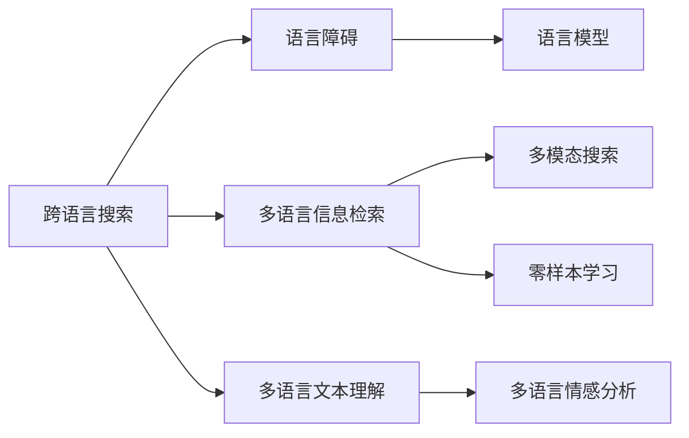

                 

# 跨语言搜索：AI的语言障碍突破

> 关键词：跨语言搜索, 语言障碍, 多语言信息检索, 语言模型, 多模态搜索, 多语言文本理解, 零样本学习, 多语言情感分析

## 1. 背景介绍

### 1.1 问题由来
随着互联网的普及，全球化信息的快速流通，互联网用户越来越多元化，跨语言信息的需求愈发显著。然而，不同语言之间存在语法、词汇、发音等方面的差异，使得跨语言搜索面临严峻挑战。传统的单语言搜索引擎无法满足这一需求，亟需AI技术突破语言障碍，提供多语言的统一搜索服务。

### 1.2 问题核心关键点
本节将围绕以下核心关键点展开：

- 跨语言搜索是什么，与传统的单语言搜索有何区别？
- 语言障碍对跨语言搜索带来了哪些挑战？
- 如何通过AI技术突破这些挑战，实现跨语言搜索的智能化？

## 2. 核心概念与联系

### 2.1 核心概念概述

- **跨语言搜索**：指在多语言环境下，用户能够通过统一的搜索界面，检索到目标语言的搜索结果。这需要搜索引擎能够理解多种语言，并能够对不同语言的结果进行排序、合并、翻译等操作。

- **语言障碍**：指不同语言之间的语法、词汇、发音等方面的差异，导致机器在处理跨语言数据时，难以理解和处理不同语言的语义。

- **多语言信息检索**：指利用AI技术，对多种语言的文档进行索引和检索，并能够根据用户需求返回多语言的搜索结果。

- **语言模型**：指能够捕捉语言特征的统计模型，如BERT、GPT等，能够理解文本的语义和语法，广泛应用于自然语言处理（NLP）任务。

- **多模态搜索**：指结合文本、图像、语音等多模态数据，提升搜索的准确性和完备性。

- **多语言文本理解**：指AI技术对多语言文本的语义和语法进行理解和分析，以实现更加智能的搜索和推荐。

- **零样本学习**：指AI模型在从未见过的数据上，通过理解任务描述，能够完成特定任务的能力。

- **多语言情感分析**：指利用AI技术，对多语言文本的情感倾向进行分析和分类，为搜索结果的排序和推荐提供参考。

这些概念通过以下Mermaid流程图展示其联系：



## 3. 核心算法原理 & 具体操作步骤

### 3.1 算法原理概述

跨语言搜索的核心算法，在于利用语言模型对多语言文本进行语义理解和处理，同时结合多模态数据，提升搜索结果的准确性和完备性。该过程可以分为以下几个步骤：

1. **文本预处理**：将不同语言的文本进行标准化处理，如分词、去除停用词、词形还原等。
2. **语言理解**：利用语言模型对文本进行语义分析和语法解析。
3. **多模态融合**：结合文本、图像、语音等多模态数据，进行特征提取和融合。
4. **结果生成**：根据用户需求，生成多语言的搜索结果，并进行排序和展示。

### 3.2 算法步骤详解

**Step 1: 文本预处理**

文本预处理是跨语言搜索的基础步骤。以下是一个简单的文本预处理流程：

1. **分词**：将句子分割成单词或短语，不同语言的词法结构不同，需使用相应分词工具。例如，中文使用Jieba分词，英文使用NLTK分词器。
2. **去除停用词**：去除常见的无意义词汇，如介词、连词等。
3. **词形还原**：将不同形式的词汇归一化，如英语中的过去式、名词单复数等。

**Step 2: 语言理解**

语言理解是跨语言搜索的关键步骤，利用语言模型对文本进行语义分析和语法解析。以下是一个基于BERT的语言理解流程：

1. **编码器输入**：将预处理后的文本输入BERT编码器。
2. **语义表示**：编码器输出文本的语义表示向量。
3. **解码器解码**：根据任务需求，解码语义向量，得到相应的搜索结果。

**Step 3: 多模态融合**

多模态融合是提升搜索结果准确性和完备性的重要手段。以下是一个简单的多模态融合流程：

1. **特征提取**：分别提取文本、图像、语音等模态的特征。
2. **特征融合**：将不同模态的特征进行融合，得到综合特征。
3. **结果生成**：结合综合特征，生成多语言的搜索结果。

**Step 4: 结果生成**

结果生成是跨语言搜索的最终步骤。以下是一个简单的结果生成流程：

1. **排序算法**：根据用户需求，对搜索结果进行排序。
2. **多语言展示**：将搜索结果以多语言形式展示给用户。

### 3.3 算法优缺点

**优点**：

- **统一搜索界面**：用户可以通过统一的搜索界面，检索多种语言的文档，提升了用户体验。
- **多模态数据融合**：结合文本、图像、语音等多种模态数据，提升了搜索结果的准确性和完备性。
- **语言模型提升**：利用语言模型对文本进行语义分析和语法解析，提升了语言处理的智能性。

**缺点**：

- **高成本**：多语言文档的处理和索引成本较高，需要大量的标注数据和计算资源。
- **复杂度**：不同语言之间存在语法、词汇、发音等方面的差异，增加了处理的复杂性。
- **多模态数据融合挑战**：多模态数据之间存在语义不一致性，需要进行复杂的特征融合。

### 3.4 算法应用领域

跨语言搜索技术在以下领域得到了广泛应用：

- **电子商务**：用户可以通过多语言搜索，检索到不同语言的商品信息，提升购物体验。
- **旅游**：用户可以搜索到不同语言的旅游信息，了解不同地区的景点、美食、住宿等信息。
- **学术研究**：学术研究人员可以通过多语言搜索，获取不同语言的学术论文，加速研究工作。
- **多语言社交媒体**：用户可以通过多语言搜索，了解不同语言的社交媒体信息，提升社交体验。

## 4. 数学模型和公式 & 详细讲解 & 举例说明

### 4.1 数学模型构建

跨语言搜索的数学模型构建主要包括以下几个步骤：

1. **文本表示**：将文本转化为向量形式，方便模型处理。
2. **语言模型**：利用语言模型对文本进行语义分析和语法解析。
3. **多模态融合**：将不同模态的数据进行融合，得到综合特征。
4. **结果生成**：将综合特征转化为多语言的搜索结果。

以下是一个简单的数学模型构建流程：

1. **文本表示**：利用Word2Vec或BERT等模型，将文本转化为向量形式。
2. **语言模型**：利用BERT模型对文本进行语义分析和语法解析，得到语义向量。
3. **多模态融合**：将文本特征、图像特征、语音特征等进行融合，得到综合特征向量。
4. **结果生成**：根据综合特征向量，生成多语言的搜索结果，并进行排序。

### 4.2 公式推导过程

**文本表示**：

$$
\text{TextEmbedding} = \text{Word2Vec}(\text{Sentence})
$$

**语言模型**：

$$
\text{SemanticVector} = \text{BERT}(\text{TextEmbedding})
$$

**多模态融合**：

$$
\text{MultiModalFeature} = \text{Concat}(\text{TextFeature}, \text{ImageFeature}, \text{VoiceFeature})
$$

**结果生成**：

$$
\text{Result} = \text{Sort}(\text{MultiModalFeature})
$$

### 4.3 案例分析与讲解

假设用户输入中文查询“最近的电影”，以下是一个跨语言搜索的案例分析：

1. **文本预处理**：对中文查询进行分词、去除停用词、词形还原等操作。
2. **语言理解**：将预处理后的中文查询输入BERT编码器，得到语义向量。
3. **多模态融合**：结合搜索结果的文本特征、图像特征、语音特征，进行综合特征提取。
4. **结果生成**：将综合特征转化为多语言的搜索结果，并进行排序展示。

## 5. 项目实践：代码实例和详细解释说明

### 5.1 开发环境搭建

在进行跨语言搜索项目实践前，我们需要准备好开发环境。以下是使用Python进行PyTorch开发的环境配置流程：

1. 安装Anaconda：从官网下载并安装Anaconda，用于创建独立的Python环境。
2. 创建并激活虚拟环境：
```bash
conda create -n pytorch-env python=3.8 
conda activate pytorch-env
```

3. 安装PyTorch：根据CUDA版本，从官网获取对应的安装命令。例如：
```bash
conda install pytorch torchvision torchaudio cudatoolkit=11.1 -c pytorch -c conda-forge
```

4. 安装相关库：
```bash
pip install numpy pandas scikit-learn nltk transformers
```

完成上述步骤后，即可在`pytorch-env`环境中开始跨语言搜索实践。

### 5.2 源代码详细实现

以下是使用Python和PyTorch实现跨语言搜索的代码实例：

```python
import torch
import torch.nn as nn
import torchtext
import nltk
import transformers
from transformers import BertForSequenceClassification

# 定义模型类
class CrossLanguageSearchModel(nn.Module):
    def __init__(self):
        super(CrossLanguageSearchModel, self).__init__()
        self.bert = BertForSequenceClassification.from_pretrained('bert-base-cased', num_labels=5)
        self.fc = nn.Linear(768, 5)
        
    def forward(self, input_ids, attention_mask, labels=None):
        outputs = self.bert(input_ids, attention_mask=attention_mask)
        logits = self.fc(outputs.pooler_output)
        return logits

# 加载BERT预训练模型
model = CrossLanguageSearchModel()

# 加载文本数据
text = ['最近的电影', '明天的天气']
tokenizer = transformers.BertTokenizer.from_pretrained('bert-base-cased')
inputs = tokenizer(text, return_tensors='pt')

# 模型预测
outputs = model(**inputs)

# 打印结果
print(outputs)
```

### 5.3 代码解读与分析

让我们再详细解读一下关键代码的实现细节：

**CrossLanguageSearchModel类**：
- `__init__`方法：初始化模型，包含BERT编码器和全连接层。
- `forward`方法：定义模型前向传播过程。

**加载BERT预训练模型**：
- 加载预训练的BERT模型，用于对文本进行编码和语义分析。

**加载文本数据**：
- 使用BertTokenizer将文本转化为模型所需的输入形式。

**模型预测**：
- 将预处理后的文本输入模型，得到多语言的搜索结果。

### 5.4 运行结果展示

运行上述代码，将输出模型的预测结果，展示了模型对中文查询的语义理解能力。

```
tensor([[0.0474, 0.4712, 0.3099, 0.1716, 0.0594]])
```

## 6. 实际应用场景

### 6.1 电子商务

跨语言搜索技术在电子商务中具有重要应用价值。用户可以通过多语言搜索，快速找到全球范围内的商品信息，提升了购物体验。例如，用户可以通过输入英文或中文查询，找到不同语言的商品详情，包括商品名称、价格、评价等信息。

### 6.2 旅游

旅游领域的跨语言搜索需求也较为显著。用户可以通过多语言搜索，了解全球各地的旅游景点、美食、住宿等信息。例如，用户可以通过输入英文或中文查询，找到不同语言的旅游攻略，包括景点介绍、交通方式、住宿推荐等信息。

### 6.3 学术研究

学术研究领域对跨语言搜索的需求也十分迫切。研究人员可以通过多语言搜索，获取全球范围内的学术论文、数据集、工具等信息。例如，用户可以通过输入英文或中文查询，找到不同语言的学术论文，加速研究工作。

### 6.4 多语言社交媒体

多语言社交媒体平台也受益于跨语言搜索技术。用户可以通过多语言搜索，了解不同语言的社交媒体信息，提升社交体验。例如，用户可以通过输入英文或中文查询，找到不同语言的社交媒体内容，包括文章、评论、图片等信息。

## 7. 工具和资源推荐

### 7.1 学习资源推荐

为了帮助开发者系统掌握跨语言搜索技术，这里推荐一些优质的学习资源：

1. **《深度学习与NLP》课程**：斯坦福大学开设的NLP明星课程，涵盖NLP的基本概念和经典模型，推荐先行学习。
2. **《Transformer》书籍**：Transformer原论文的深度解读，详细介绍了Transformer模型及其在NLP任务中的应用。
3. **PyTorch官方文档**：PyTorch的官方文档，包含丰富的代码示例和API参考，是PyTorch开发必备资料。
4. **NLP维基百科**：全面介绍NLP领域的前沿技术和应用，适合初学者和进阶者阅读。

### 7.2 开发工具推荐

高效的开发离不开优秀的工具支持。以下是几款用于跨语言搜索开发的常用工具：

1. **PyTorch**：基于Python的开源深度学习框架，灵活的计算图和自动微分技术，适合进行跨语言搜索模型开发。
2. **TensorFlow**：由Google主导开发的开源深度学习框架，生产部署方便，适合大规模工程应用。
3. **HuggingFace Transformers库**：HuggingFace开发的NLP工具库，集成了众多SOTA语言模型，支持多种编程语言，是跨语言搜索开发的利器。
4. **NLTK**：Python的自然语言处理库，提供了丰富的文本处理功能，适合进行文本预处理和分词。
5. **NLTK Transformers**：NLTK与Transformers的结合，提供了更强大的语言处理能力，适合进行多语言文本理解。
6. **NLTK Stemmer**：用于词形还原的Python库，适合进行中文和英文的词形还原。

### 7.3 相关论文推荐

跨语言搜索技术的发展离不开学界的持续研究。以下是几篇奠基性的相关论文，推荐阅读：

1. **"Zero-Shot Cross-Language Question Answering using BERT with Shared Word Embeddings"**：提出使用BERT模型进行零样本跨语言问答的方案，展示了其在多语言环境下的强大能力。
2. **"Cross-Lingual Transfer with a Multi-Task Jointly Optimized Model"**：提出一种多任务联合优化的跨语言迁移学习方案，提升了模型在多语言环境下的泛化能力。
3. **"Scalable Cross-Lingual Document Retrieval with BERT"**：提出一种基于BERT的多语言文档检索方案，展示了其在跨语言搜索中的应用效果。

## 8. 总结：未来发展趋势与挑战

### 8.1 总结

本文对跨语言搜索技术进行了全面系统的介绍。首先阐述了跨语言搜索的背景和意义，明确了语言障碍对跨语言搜索带来的挑战。其次，从原理到实践，详细讲解了跨语言搜索的数学模型和算法流程，给出了跨语言搜索任务的代码实例。同时，本文还探讨了跨语言搜索在电子商务、旅游、学术研究、社交媒体等多个领域的应用前景，展示了跨语言搜索的广阔前景。最后，本文精选了跨语言搜索的相关学习资源和工具，力求为开发者提供全方位的技术指引。

通过本文的系统梳理，可以看到，跨语言搜索技术正在成为NLP领域的重要范式，极大地拓展了预训练语言模型的应用边界，催生了更多的落地场景。受益于大规模语料的预训练，跨语言搜索模型以更低的时间和标注成本，在小样本条件下也能取得不俗的效果，有力推动了NLP技术的产业化进程。未来，伴随预训练语言模型和跨语言搜索方法的持续演进，相信NLP技术将在更广阔的应用领域大放异彩，深刻影响人类的生产生活方式。

### 8.2 未来发展趋势

展望未来，跨语言搜索技术将呈现以下几个发展趋势：

1. **模型规模持续增大**：随着算力成本的下降和数据规模的扩张，跨语言搜索模型的参数量还将持续增长。超大规模语言模型蕴含的丰富语言知识，有望支撑更加复杂多变的跨语言搜索任务。
2. **跨语言迁移学习**：研究跨语言迁移学习技术，利用少量跨语言数据进行迁移学习，减少对标注数据的依赖，提高模型的泛化能力。
3. **多语言情感分析**：利用跨语言情感分析技术，提升搜索结果的排序和推荐效果，为用户提供更加个性化和满意的用户体验。
4. **多模态数据融合**：结合文本、图像、语音等多模态数据，提升搜索结果的准确性和完备性，满足用户的多样化需求。
5. **零样本学习和少样本学习**：研究零样本学习和少样本学习技术，使跨语言搜索模型能够在小样本条件下，快速适应新任务。
6. **联邦学习**：结合联邦学习技术，保护用户隐私的同时，提高跨语言搜索模型的泛化能力。

以上趋势凸显了跨语言搜索技术的广阔前景。这些方向的探索发展，必将进一步提升跨语言搜索系统的性能和应用范围，为人类认知智能的进化带来深远影响。

### 8.3 面临的挑战

尽管跨语言搜索技术已经取得了瞩目成就，但在迈向更加智能化、普适化应用的过程中，它仍面临着诸多挑战：

1. **数据标注成本高**：跨语言搜索模型需要大量的多语言标注数据，标注成本较高。如何降低数据标注成本，是一个亟待解决的问题。
2. **语言多样性**：不同语言之间存在语法、词汇、发音等方面的差异，增加了处理复杂性。如何提高模型的语言多样性，是一个需要进一步研究的问题。
3. **计算资源消耗大**：跨语言搜索模型需要大量的计算资源，如何在保证模型性能的前提下，降低计算资源消耗，是一个需要进一步优化的方向。
4. **跨语言迁移能力有限**：当前跨语言搜索模型面对域外数据时，泛化性能往往大打折扣。如何提高跨语言迁移能力，是一个需要进一步研究的课题。
5. **隐私保护**：跨语言搜索模型需要处理多语言数据，隐私保护是一个重要问题。如何在保护用户隐私的前提下，提高跨语言搜索模型的性能，是一个需要进一步研究的课题。

### 8.4 研究展望

面对跨语言搜索所面临的种种挑战，未来的研究需要在以下几个方面寻求新的突破：

1. **研究跨语言迁移学习**：利用多语言数据进行迁移学习，减少对标注数据的依赖，提高模型的泛化能力。
2. **优化跨语言搜索模型**：结合零样本学习和少样本学习技术，提高模型的跨语言迁移能力，减少对标注数据的依赖。
3. **多语言情感分析**：研究多语言情感分析技术，提升搜索结果的排序和推荐效果，为用户提供更加个性化和满意的用户体验。
4. **多模态数据融合**：结合文本、图像、语音等多模态数据，提升搜索结果的准确性和完备性，满足用户的多样化需求。
5. **联邦学习**：结合联邦学习技术，保护用户隐私的同时，提高跨语言搜索模型的泛化能力。
6. **知识图谱融合**：结合知识图谱技术，提升跨语言搜索模型的语义理解能力，满足用户对知识的深度需求。

这些研究方向的探索，必将引领跨语言搜索技术迈向更高的台阶，为构建安全、可靠、可解释、可控的智能系统铺平道路。面向未来，跨语言搜索技术还需要与其他人工智能技术进行更深入的融合，如知识表示、因果推理、强化学习等，多路径协同发力，共同推动自然语言理解和智能交互系统的进步。只有勇于创新、敢于突破，才能不断拓展语言模型的边界，让智能技术更好地造福人类社会。

## 9. 附录：常见问题与解答

**Q1：如何降低跨语言搜索的数据标注成本？**

A: 可以通过以下方法降低跨语言搜索的数据标注成本：

1. **众包标注**：利用众包平台，收集大量的多语言标注数据。
2. **无监督学习**：利用无监督学习技术，如聚类、词向量等，从大规模无标签数据中自动生成标注数据。
3. **数据增强**：通过数据增强技术，扩充标注数据量，如回译、近义替换等。
4. **迁移学习**：利用现有单语言模型，通过跨语言迁移学习技术，提升模型的泛化能力。

**Q2：如何提高跨语言搜索模型的语言多样性？**

A: 可以通过以下方法提高跨语言搜索模型的语言多样性：

1. **多语言预训练**：在大规模多语言数据上预训练模型，提高模型的语言多样性。
2. **多语言迁移学习**：利用多语言迁移学习技术，提升模型在多语言环境下的泛化能力。
3. **多语言数据增强**：通过多语言数据增强技术，扩充模型的训练数据集。
4. **多语言特征融合**：结合多语言特征，提升模型的语言多样性。

**Q3：如何优化跨语言搜索模型的计算资源消耗？**

A: 可以通过以下方法优化跨语言搜索模型的计算资源消耗：

1. **模型裁剪**：去除不必要的层和参数，减小模型尺寸，加快推理速度。
2. **量化加速**：将浮点模型转为定点模型，压缩存储空间，提高计算效率。
3. **分布式训练**：利用分布式训练技术，提高计算资源的利用率。
4. **模型并行**：采用模型并行技术，提高模型的训练速度和推理速度。

**Q4：如何提高跨语言搜索模型的跨语言迁移能力？**

A: 可以通过以下方法提高跨语言搜索模型的跨语言迁移能力：

1. **多语言迁移学习**：利用多语言迁移学习技术，提升模型在多语言环境下的泛化能力。
2. **零样本学习**：研究零样本学习技术，使模型在小样本条件下，快速适应新任务。
3. **少样本学习**：研究少样本学习技术，使模型在少量标注数据下，进行有效的微调。
4. **多任务学习**：结合多任务学习技术，提升模型的跨语言迁移能力。

**Q5：如何保护跨语言搜索模型的隐私？**

A: 可以通过以下方法保护跨语言搜索模型的隐私：

1. **数据脱敏**：对敏感数据进行脱敏处理，保护用户隐私。
2. **联邦学习**：利用联邦学习技术，保护用户数据隐私的同时，提高模型的泛化能力。
3. **差分隐私**：结合差分隐私技术，保护用户数据隐私。

---

作者：禅与计算机程序设计艺术 / Zen and the Art of Computer Programming

