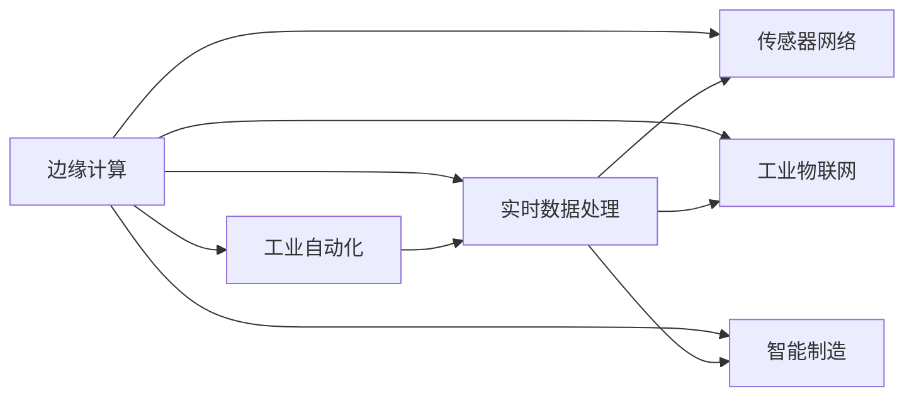

                 

# 边缘计算在工业自动化中的应用：实时数据处理

> 关键词：边缘计算,工业自动化,实时数据处理,传感器网络,数据融合,工业物联网(IoT),智能制造,实时系统,边缘设备

## 1. 背景介绍

### 1.1 问题由来

随着工业自动化技术的不断进步，实时数据处理在生产制造中扮演着越来越重要的角色。然而，传统的集中式数据处理架构面临着数据传输延迟、带宽压力、网络安全等诸多挑战。在这样的背景下，边缘计算（Edge Computing）应运而生，其分布式计算资源的部署与数据处理的地理位置更加接近于数据源，可以显著降低数据传输延时，提升数据处理效率。

在工业自动化领域，边缘计算通过将数据处理任务分布在生产现场的传感器、边缘服务器等边缘设备上，极大地缩短了数据处理时间，满足了工业生产对实时性、可靠性和安全性的需求。本文将重点探讨边缘计算在工业自动化中的应用，特别是其在实时数据处理中的优势与挑战。

### 1.2 问题核心关键点

边缘计算的核心在于将计算资源从中心服务器下沉到生产现场，就近处理数据，减少了网络传输开销和数据延迟。在工业自动化场景下，边缘计算需要解决以下关键问题：

- **数据采集与传输**：如何高效、可靠地采集生产现场的实时数据，并将其传输到边缘设备上进行处理。
- **边缘计算与云协同**：如何将边缘设备和云端系统结合起来，实现数据处理的无缝衔接。
- **数据融合与决策**：如何在边缘侧对数据进行高效融合，生成对生产过程有益的实时决策。
- **安全与隐私保护**：如何在数据处理过程中保护数据的安全性和隐私性，防止数据泄露和篡改。

## 2. 核心概念与联系

### 2.1 核心概念概述

为了更好地理解边缘计算在工业自动化中的应用，本节将介绍几个核心概念：

- **边缘计算（Edge Computing）**：指在数据源或靠近数据源的地方进行数据处理和存储，从而减少数据传输延迟和带宽压力。边缘计算能够实时响应数据处理请求，提供高效、可靠的数据处理能力。
- **工业自动化（Industrial Automation）**：通过自动化技术实现生产流程的优化，提高生产效率、降低成本、提升产品质量。工业自动化涉及到从自动化控制系统到智能制造的全流程。
- **实时数据处理（Real-time Data Processing）**：指在数据产生后，立即进行处理和分析，及时响应业务需求的过程。实时数据处理需要高效、可靠、低延迟的计算资源。
- **传感器网络（Sensor Networks）**：由大量传感器节点构成的网络，用于监测和采集生产现场的各种参数，如温度、压力、振动、声音等。传感器网络是边缘计算在工业自动化中应用的基础。
- **工业物联网（Industrial Internet of Things, IIoT）**：通过将工业设备和设施连接到互联网，实现设备间的互联互通和数据共享。工业物联网是边缘计算在工业自动化中应用的重要场景。
- **智能制造（Smart Manufacturing）**：通过信息技术和自动化技术，实现生产过程的智能化、透明化和优化。智能制造是工业自动化的高级阶段，边缘计算在其中扮演关键角色。

这些核心概念之间的逻辑关系可以通过以下Mermaid流程图来展示：



这个流程图展示了几大核心概念之间的联系：

1. 边缘计算是实现工业自动化的重要技术手段，与实时数据处理密切相关。
2. 实时数据处理依赖于传感器网络和工业物联网，是智能制造的基础。
3. 智能制造是工业自动化的高级阶段，需要实时数据处理和边缘计算的支持。

## 3. 核心算法原理 & 具体操作步骤

### 3.1 算法原理概述

边缘计算在工业自动化中的核心算法原理可以概括为以下几个步骤：

1. **数据采集**：通过传感器网络收集生产现场的实时数据。
2. **数据传输**：将采集到的数据传输到边缘设备上，进行初步处理。
3. **数据融合与分析**：在边缘设备上对数据进行融合与分析，生成实时决策。
4. **数据存储与传输**：将处理后的数据存储在本地或传输到云端，供后续使用。
5. **边缘计算与云协同**：通过边缘设备和云端的协同工作，实现数据的无缝衔接和高效处理。

### 3.2 算法步骤详解

以下是边缘计算在工业自动化中实现实时数据处理的具体操作步骤：

1. **传感器网络部署**：在生产现场部署传感器网络，采集各种实时数据。传感器可以是温度传感器、压力传感器、振动传感器、声音传感器等。

2. **数据采集与传输**：传感器将采集到的数据通过无线网络传输到边缘设备上。为了保证数据传输的可靠性和实时性，可以使用Wi-Fi、蓝牙、ZigBee等短距离无线通信技术。

3. **边缘设备数据处理**：边缘设备如工业网关、边缘服务器等对采集到的数据进行初步处理。这一步包括数据的预处理、数据融合、实时分析等。

4. **数据存储与传输**：处理后的数据可以存储在本地或传输到云端进行进一步处理和分析。存储设备可以是本地硬盘、内存、云端数据库等。

5. **边缘计算与云协同**：边缘设备与云端系统协同工作，实现数据处理的无缝衔接。例如，将部分复杂的计算任务交给云端处理，将处理结果反馈到边缘设备上，指导生产过程。

### 3.3 算法优缺点

边缘计算在工业自动化中的实时数据处理具有以下优点：

- **降低延迟**：数据处理在边缘设备上进行，减少了数据传输延时，满足了工业生产对实时性的需求。
- **提升效率**：边缘设备可以快速响应数据处理请求，提高了数据处理的效率和精度。
- **节省带宽**：边缘计算减少了数据传输带宽，降低了网络拥塞和带宽成本。
- **增强可靠性**：边缘计算在数据源附近进行计算，提高了数据处理的安全性和可靠性。

同时，边缘计算也存在一些缺点：

- **计算资源限制**：边缘设备的计算资源有限，可能无法处理过于复杂的数据处理任务。
- **存储容量限制**：边缘设备的存储容量有限，需要合理设计数据存储策略。
- **维护成本高**：边缘设备需要在生产现场进行部署和维护，成本较高。

### 3.4 算法应用领域

边缘计算在工业自动化中主要应用于以下几个领域：

- **智能制造**：通过边缘计算实现生产过程的智能化、透明化和优化，提高生产效率和产品质量。
- **设备监测与维护**：实时监测设备的运行状态，预测设备故障，实现预防性维护，降低设备维护成本。
- **能源管理**：对能源消耗进行实时监控和管理，实现节能减排，降低生产成本。
- **质量控制**：通过实时数据处理，实现产品质量的实时监控和控制，提高产品质量和生产效率。
- **安全监控**：实时监控生产现场的安全状态，预防安全事故，保障生产安全。

## 4. 数学模型和公式 & 详细讲解 & 举例说明

### 4.1 数学模型构建

边缘计算在工业自动化中的应用涉及到多个环节，包括数据采集、数据传输、数据融合与分析、数据存储与传输等。以下是这些环节的数学模型构建：

1. **数据采集模型**：
   - 传感器采集数据：$x = f(t)$，其中 $x$ 为传感器读数，$t$ 为时间。
   - 数据采集函数：$y = g(x)$，其中 $y$ 为处理后的数据。

2. **数据传输模型**：
   - 数据传输速率：$R(t) = b(t)/\Delta t$，其中 $b(t)$ 为实际传输速率，$\Delta t$ 为传输时间间隔。
   - 数据传输延迟：$\tau(t) = \frac{L}{R(t)}$，其中 $L$ 为数据传输距离。

3. **数据融合模型**：
   - 数据融合函数：$z = h(x_1, x_2, ..., x_n)$，其中 $z$ 为融合后的数据，$x_i$ 为第 $i$ 个传感器的读数。

4. **数据存储模型**：
   - 数据存储容量：$C = k \times S(t)$，其中 $k$ 为存储系数，$S(t)$ 为数据存储量。
   - 数据存储函数：$S(t) = \frac{R(t) \times \tau(t)}{\eta}$，其中 $\eta$ 为数据保留系数。

5. **数据传输与存储模型**：
   - 数据传输与存储函数：$D(t) = \frac{R(t) \times \tau(t)}{\eta} + \frac{L}{R(t)}$，其中 $D(t)$ 为数据传输与存储延迟。

### 4.2 公式推导过程

以下是上述数学模型的详细推导过程：

1. **数据采集模型推导**：
   - 传感器采集数据：$x = f(t)$
   - 数据采集函数：$y = g(x)$
   - 推导过程：$y = g(f(t))$

2. **数据传输模型推导**：
   - 数据传输速率：$R(t) = b(t)/\Delta t$
   - 数据传输延迟：$\tau(t) = \frac{L}{R(t)}$
   - 推导过程：$\tau(t) = \frac{L}{\frac{b(t)}{\Delta t}} = \frac{L}{b(t)/\Delta t}$

3. **数据融合模型推导**：
   - 数据融合函数：$z = h(x_1, x_2, ..., x_n)$
   - 推导过程：$z = h(f(t_1), f(t_2), ..., f(t_n))$

4. **数据存储模型推导**：
   - 数据存储容量：$C = k \times S(t)$
   - 数据存储函数：$S(t) = \frac{R(t) \times \tau(t)}{\eta}$
   - 推导过程：$S(t) = R(t) \times \tau(t)$

5. **数据传输与存储模型推导**：
   - 数据传输与存储函数：$D(t) = \frac{R(t) \times \tau(t)}{\eta} + \frac{L}{R(t)}$
   - 推导过程：$D(t) = \tau(t) + \frac{L}{R(t)}$

### 4.3 案例分析与讲解

以一个简单的智能制造案例来说明边缘计算在工业自动化中的应用：

- **背景**：某制造业企业需要实时监测生产线的温度、压力、振动等参数，以优化生产过程。
- **数据采集**：在生产线上部署温度传感器、压力传感器、振动传感器等，采集实时数据。
- **数据传输**：传感器将采集到的数据通过Wi-Fi网络传输到边缘设备上。
- **数据融合与分析**：边缘设备对采集到的数据进行融合与分析，生成生产过程的实时监控数据。
- **数据存储与传输**：处理后的数据存储在本地或传输到云端，供后续使用。

## 5. 项目实践：代码实例和详细解释说明

### 5.1 开发环境搭建

为了实现边缘计算在工业自动化中的应用，需要搭建相应的开发环境。以下是具体的搭建步骤：

1. **安装Python**：确保系统已安装Python 3.6及以上版本，建议使用Anaconda进行安装。

2. **安装必要的库**：安装TensorFlow、Keras、NumPy、Pandas等必要的库，使用以下命令：
```bash
pip install tensorflow keras numpy pandas
```

3. **部署边缘设备**：选择适合的边缘设备，如Raspberry Pi、树莓派等，并确保设备能够稳定运行。

4. **部署Python环境**：在边缘设备上搭建Python 3.6及以上版本的环境。

### 5.2 源代码详细实现

以下是使用Python实现边缘计算在工业自动化中实时数据处理的代码：

```python
import tensorflow as tf
import numpy as np
import pandas as pd

# 定义数据采集函数
def data_acquisition(t):
    x = np.sin(t)  # 假设数据采集函数为sin函数
    return x

# 定义数据传输函数
def data_transfer(x, dt):
    b = 0.1  # 传输速率
    tau = 0.1  # 传输延迟
    y = x * b / dt  # 数据传输速率
    return y

# 定义数据融合函数
def data_fusion(y):
    z = np.mean(y)  # 假设数据融合函数为平均值函数
    return z

# 定义数据存储函数
def data_storage(z, k, t, dt):
    S = k * z * dt  # 数据存储容量
    eta = 0.9  # 数据保留系数
    return S

# 定义数据传输与存储函数
def data_transfer_storage(z, k, dt, L):
    R = 0.1  # 传输速率
    tau = L / R  # 传输延迟
    return z * R / dt + tau

# 数据采集与传输
t = np.linspace(0, 10, 10000)  # 生成时间序列
x = data_acquisition(t)
y = data_transfer(x, 0.1)

# 数据融合与分析
z = data_fusion(y)

# 数据存储与传输
S = data_storage(z, 0.5, 10, 0.1)
D = data_transfer_storage(z, 0.5, 0.1, 10)

# 输出结果
print(f"数据采集结果：{x}")
print(f"数据传输结果：{y}")
print(f"数据融合结果：{z}")
print(f"数据存储结果：{S}")
print(f"数据传输与存储结果：{D}")
```

### 5.3 代码解读与分析

以下是代码的详细解读与分析：

1. **数据采集函数**：定义了传感器采集数据的函数，用于模拟数据采集过程。
2. **数据传输函数**：定义了数据传输函数，计算数据传输速率和传输延迟。
3. **数据融合函数**：定义了数据融合函数，用于对多个传感器的数据进行融合处理。
4. **数据存储函数**：定义了数据存储函数，计算数据存储容量。
5. **数据传输与存储函数**：定义了数据传输与存储函数，计算数据传输与存储延迟。
6. **数据采集与传输**：使用数据采集函数和数据传输函数模拟数据采集与传输过程。
7. **数据融合与分析**：使用数据融合函数对传输后的数据进行融合处理。
8. **数据存储与传输**：使用数据存储函数和数据传输与存储函数计算数据存储容量和传输延迟。
9. **输出结果**：输出采集、传输、融合、存储和传输与存储的结果。

## 6. 实际应用场景

### 6.1 智能制造

在智能制造中，边缘计算可以通过实时数据处理，优化生产过程，提高生产效率和产品质量。例如：

- **设备监测与维护**：实时监测设备的运行状态，预测设备故障，实现预防性维护，降低设备维护成本。
- **能源管理**：对能源消耗进行实时监控和管理，实现节能减排，降低生产成本。

### 6.2 设备监测与维护

通过边缘计算，可以实现设备的实时监测和故障预测，提升设备的维护效率。例如：

- **传感器网络部署**：在生产设备上部署各类传感器，采集设备的温度、压力、振动、声音等数据。
- **数据采集与传输**：将采集到的数据通过无线网络传输到边缘设备上。
- **数据融合与分析**：在边缘设备上对数据进行融合与分析，生成设备的实时状态报告。
- **数据存储与传输**：处理后的数据存储在本地或传输到云端，供后续使用。

### 6.3 能源管理

在能源管理中，边缘计算可以通过实时数据处理，优化能源使用，降低能源成本。例如：

- **能源监测**：实时监测企业的能源消耗情况，包括电力、水、气等。
- **数据采集与传输**：将采集到的能源消耗数据通过无线网络传输到边缘设备上。
- **数据融合与分析**：在边缘设备上对数据进行融合与分析，生成能源消耗的实时报告。
- **数据存储与传输**：处理后的数据存储在本地或传输到云端，供后续使用。

## 7. 工具和资源推荐

### 7.1 学习资源推荐

为了帮助开发者系统掌握边缘计算在工业自动化中的应用，以下是几本推荐的学习资源：

1. 《边缘计算：构建未来工业网络》（Richard Carver Meeks）：该书系统介绍了边缘计算的基本概念、技术架构和应用场景，是入门的好书。
2. 《工业物联网：实现自动化工厂和智能制造》（Vikas Mehrotra）：该书详细介绍了工业物联网的基本概念、技术架构和应用场景，是深入学习的优秀参考书。
3. 《实时数据处理技术》（John C. West）：该书详细介绍了实时数据处理的基本概念、技术架构和应用场景，是深入学习的优秀参考书。

### 7.2 开发工具推荐

为了实现边缘计算在工业自动化中的应用，需要选择合适的开发工具。以下是一些推荐的开发工具：

1. **TensorFlow**：用于机器学习和深度学习，支持分布式计算和边缘计算。
2. **Keras**：基于TensorFlow的高级API，简化模型开发和部署过程。
3. **NumPy**：用于高效数学计算和数据处理。
4. **Pandas**：用于数据处理和分析。
5. **Raspberry Pi**：适用于边缘设备的部署和开发。

### 7.3 相关论文推荐

为了深入了解边缘计算在工业自动化中的应用，以下是几篇推荐的相关论文：

1. "Edge Computing for Industrial Automation: A Survey"（IEEE Transactions on Industrial Informatics）：该论文系统综述了边缘计算在工业自动化中的应用，提出了未来的研究方向。
2. "Edge Computing in Manufacturing: A Survey"（IEEE Access）：该论文详细介绍了边缘计算在智能制造中的应用，提出了未来的研究方向。
3. "A Survey on Edge Computing for Real-Time Data Processing"（IEEE Communications Surveys & Tutorials）：该论文详细介绍了边缘计算在实时数据处理中的应用，提出了未来的研究方向。

## 8. 总结：未来发展趋势与挑战

### 8.1 总结

本文对边缘计算在工业自动化中的应用进行了全面系统的介绍。首先阐述了边缘计算的基本概念和其在工业自动化中的重要性，接着从原理到实践，详细讲解了边缘计算在工业自动化中的实时数据处理过程。本文还通过案例分析和代码实例，展示了边缘计算在实际应用中的效果。

通过本文的系统梳理，可以看到，边缘计算在工业自动化中的应用具有显著的优势，能够显著提升生产效率、降低成本、提高产品质量。然而，边缘计算在实际应用中也面临着一些挑战，如计算资源限制、存储容量限制、维护成本高等问题。未来，边缘计算将在智能制造、设备监测与维护、能源管理等领域继续发挥重要作用，但也需要更多技术创新和工程实践的支持。

### 8.2 未来发展趋势

展望未来，边缘计算在工业自动化中将呈现以下几个发展趋势：

1. **计算资源优化**：随着边缘计算技术的不断发展，未来的边缘设备将具备更强的计算能力，能够处理更复杂的实时数据处理任务。
2. **存储容量扩展**：未来的边缘设备将具备更大的存储容量，能够存储更多的实时数据，满足更复杂的数据存储需求。
3. **智能化程度提升**：未来的边缘设备将具备更强的智能处理能力，能够实现更复杂的实时数据分析和决策。
4. **网络互联互通**：未来的边缘设备将实现更广泛的网络互联互通，能够实现更高效的数据共享和协同处理。
5. **安全性与隐私保护**：未来的边缘设备将具备更强的安全性与隐私保护能力，能够保障数据的安全性和隐私性。

### 8.3 面临的挑战

尽管边缘计算在工业自动化中具有显著的优势，但在实际应用中也面临诸多挑战：

1. **计算资源限制**：当前的边缘设备计算资源有限，可能无法处理过于复杂的数据处理任务。
2. **存储容量限制**：边缘设备的存储容量有限，需要合理设计数据存储策略。
3. **维护成本高**：边缘设备需要在生产现场进行部署和维护，成本较高。
4. **网络安全**：边缘设备需要在网络环境下运行，需要考虑数据传输和存储的安全性。
5. **数据融合与分析**：如何高效融合多传感器数据，进行实时分析，需要更多的技术支持和算法优化。

### 8.4 研究展望

面对边缘计算在工业自动化中面临的挑战，未来的研究需要在以下几个方面寻求新的突破：

1. **计算资源优化**：开发更加高效、轻量级的计算框架和算法，提升边缘设备的计算能力。
2. **存储容量扩展**：研究高效的数据存储和压缩技术，提高边缘设备的存储容量。
3. **智能化程度提升**：开发更加智能化的边缘设备，增强其在实时数据分析和决策中的应用能力。
4. **网络互联互通**：研究边缘设备和云端的协同工作机制，实现数据处理的无缝衔接。
5. **安全性与隐私保护**：研究数据安全和隐私保护技术，保障边缘设备的安全性和隐私性。

## 9. 附录：常见问题与解答

**Q1：什么是边缘计算？**

A: 边缘计算指在数据源或靠近数据源的地方进行数据处理和存储，从而减少数据传输延时，提升数据处理效率。

**Q2：边缘计算在工业自动化中的应用有哪些？**

A: 边缘计算在工业自动化中的应用包括智能制造、设备监测与维护、能源管理等。

**Q3：如何实现边缘计算在工业自动化中的实时数据处理？**

A: 通过传感器网络采集实时数据，将数据传输到边缘设备上，在边缘设备上进行数据融合与分析，最后将数据存储或传输到云端。

**Q4：边缘计算有哪些优缺点？**

A: 边缘计算的优点包括降低延迟、提升效率、节省带宽、增强可靠性。缺点包括计算资源限制、存储容量限制、维护成本高等。

**Q5：如何优化边缘计算在工业自动化中的应用？**

A: 可以通过优化计算资源、扩展存储容量、提升智能化程度、实现网络互联互通、保障数据安全等方式优化边缘计算在工业自动化中的应用。

---

作者：禅与计算机程序设计艺术 / Zen and the Art of Computer Programming

