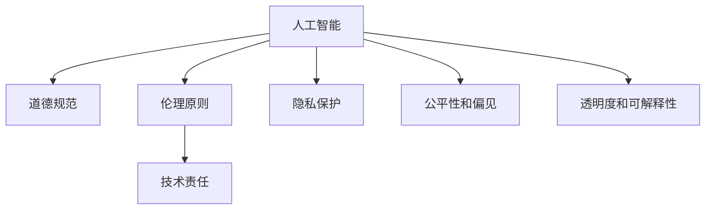

                 

# 道德与创新：平衡人工智能进步

在人工智能(AI)飞速发展的今天，我们面临着前所未有的技术创新和伦理道德挑战。如何平衡技术进步和道德规范，确保AI的合理使用，成为全球科技社区的共同课题。本文将从背景介绍、核心概念、算法原理、实际应用、资源推荐、未来展望等多个维度，全面探讨道德与创新在人工智能进步中的平衡问题。

## 1. 背景介绍

### 1.1 问题由来
人工智能的发展，尤其是深度学习技术的崛起，带来了许多变革性应用。从自动驾驶、医疗诊断到金融分析，AI技术正在深入各行各业，创造前所未有的价值。然而，在技术进步的背后，也隐藏着一系列道德和伦理问题。AI系统的不透明性、偏见性、安全性等，可能对个人隐私、社会公平、伦理道德等方面产生严重影响。

### 1.2 问题核心关键点
目前，AI领域的伦理道德问题主要集中在以下几个方面：

1. **隐私保护**：AI系统大量依赖数据，隐私泄露成为一大风险。如何确保数据使用的合法性和保护用户隐私，是亟待解决的问题。
2. **公平性和偏见**：AI系统在训练和部署过程中可能产生偏见，影响特定群体的权益。如何消除系统中的偏见，实现公平对待，是AI伦理的重要课题。
3. **透明度和可解释性**：AI模型的黑盒特性使得其决策过程难以解释，增加了不确定性和风险。如何提高模型的透明度和可解释性，增强用户信任，是当前研究的热点。
4. **责任归属**：AI系统的决策可能导致法律、道德上的责任问题。如何界定责任，保障利益相关方的权益，是伦理道德的核心问题。

## 2. 核心概念与联系

### 2.1 核心概念概述

为更好地理解AI伦理道德问题的核心，本节将介绍几个密切相关的核心概念：

- **人工智能**：指通过算法和计算处理，使机器能够执行智能任务的领域。包括机器学习、深度学习、自然语言处理等子领域。
- **道德规范**：指衡量行为是否正当的准则和标准，反映社会的价值观和文化背景。
- **伦理原则**：指指导道德决策和行为的基本原则，如公正、尊重、无害等。
- **技术责任**：指开发者、使用者和管理者对AI系统产生的后果承担的责任和义务。
- **隐私保护**：指保护个人信息不被未经授权的访问和使用，保障用户隐私权益。
- **公平性和偏见**：指在AI系统中消除系统性偏见，实现对所有用户公平对待。
- **透明度和可解释性**：指AI系统的决策过程公开透明，用户可以理解其行为逻辑。

这些核心概念之间的逻辑关系可以通过以下Mermaid流程图来展示：



这个流程图展示了几大核心概念及其之间的关系：

1. 人工智能的发展离不开道德规范和伦理原则的指导。
2. 技术责任贯穿AI系统的设计、开发、部署和使用的各个环节。
3. 隐私保护、公平性和透明度等伦理问题，是AI系统设计和应用中必须考虑的因素。

## 3. 核心算法原理 & 具体操作步骤

### 3.1 算法原理概述

AI系统的伦理道德问题，本质上是由技术设计和应用的道德风险所决定的。通过合理的设计和治理措施，可以有效降低这些风险。

形式化地，假设AI系统 $S$ 的输出为 $Y$，输入为 $X$。定义模型 $M$ 在输入 $X$ 上的行为符合伦理道德的数学表达式为：

$$
\mathcal{E}(M(X)) = \left\{
\begin{array}{ll}
1 & \text{if } M(X) \text{ satisfies the ethical standards} \\
0 & \text{otherwise}
\end{array}
\right.
$$

其中 $\mathcal{E}$ 表示伦理道德判断函数，需定义具体标准。

AI系统的伦理道德设计，主要涉及以下几个关键步骤：

1. **需求分析**：明确系统应用场景和目标，分析可能存在的伦理风险。
2. **模型设计**：选择合适算法和模型，确保模型行为的透明性和可解释性。
3. **数据处理**：清洗和标注数据，确保数据的公正性和代表性。
4. **模型训练**：设计损失函数和优化算法，避免系统性偏见和过度拟合。
5. **系统测试**：在多个场景下测试系统的表现，评估其伦理合规性。
6. **持续改进**：根据反馈和评估结果，不断优化模型和系统，确保伦理道德标准的持续满足。

### 3.2 算法步骤详解

以下是AI系统伦理道德设计的详细步骤：

**Step 1: 需求分析**
- 明确系统应用场景和目标，识别潜在的伦理风险。
- 定义伦理道德标准，如隐私保护、公平性、透明度等。
- 制定伦理道德指南，指导系统设计、开发和部署。

**Step 2: 模型设计**
- 选择合适的算法和模型架构，确保其透明度和可解释性。
- 使用可解释性较强的模型，如决策树、线性回归等，避免使用黑盒模型。
- 设计模型行为逻辑，使其符合伦理道德标准。

**Step 3: 数据处理**
- 收集和清洗数据，去除敏感信息，保护用户隐私。
- 标注数据，确保数据代表性，避免数据偏见。
- 使用公平性约束算法，如均衡抽样、对抗性训练等，消除数据偏见。

**Step 4: 模型训练**
- 设计损失函数和优化算法，避免系统性偏见和过度拟合。
- 使用正则化技术，如L2正则、Dropout等，避免过拟合。
- 引入对抗样本，提高模型鲁棒性，避免安全漏洞。

**Step 5: 系统测试**
- 在多个场景下测试系统表现，评估其伦理合规性。
- 使用伦理评估指标，如隐私侵害度、公平性差异度等，评估系统表现。
- 根据测试结果，调整模型参数和系统设计。

**Step 6: 持续改进**
- 定期收集反馈和评估结果，识别伦理道德问题。
- 持续优化模型和系统，提高其伦理合规性。
- 更新伦理道德指南，应对新的伦理挑战。

### 3.3 算法优缺点

AI系统的伦理道德设计，既有其优势，也有其局限性：

**优点：**
1. **预防风险**：通过合理的设计和治理措施，可以预防AI系统带来的伦理风险。
2. **提高用户信任**：提高系统的透明度和可解释性，增加用户对系统的信任。
3. **保障公平性**：通过消除数据和模型偏见，实现对所有用户公平对待。

**局限性：**
1. **复杂性**：伦理道德设计需要考虑多个因素，增加了系统的复杂性。
2. **技术限制**：当前技术手段可能无法完全解决所有伦理问题。
3. **成本高昂**：设计和测试伦理合规性可能需要高昂的资源投入。

### 3.4 算法应用领域

AI系统的伦理道德设计，在多个领域都得到了广泛应用：

- **医疗领域**：AI系统用于疾病诊断、治疗方案推荐等，需要确保数据隐私和模型公平性。
- **金融领域**：AI系统用于信用评分、欺诈检测等，需确保决策透明和公正。
- **教育领域**：AI系统用于个性化学习、智能辅导等，需保护学生隐私和公平教育。
- **司法领域**：AI系统用于案件分析、判决建议等，需确保决策公正和透明。
- **公共服务**：AI系统用于城市管理、公共安全等，需确保数据隐私和决策透明。

## 4. 数学模型和公式 & 详细讲解  
### 4.1 数学模型构建

本节将使用数学语言对AI系统伦理道德设计的原理进行更加严格的刻画。

假设AI系统 $S$ 的输出为 $Y$，输入为 $X$。定义模型 $M$ 在输入 $X$ 上的行为符合伦理道德的数学表达式为：

$$
\mathcal{E}(M(X)) = \left\{
\begin{array}{ll}
1 & \text{if } M(X) \text{ satisfies the ethical standards} \\
0 & \text{otherwise}
\end{array}
\right.
$$

其中 $\mathcal{E}$ 表示伦理道德判断函数，需定义具体标准。

**隐私保护模型**：
定义隐私侵害度 $P(X)$ 为系统对用户隐私的侵害程度，可通过数据泄露概率和数据敏感性来计算：

$$
P(X) = \sum_{x \in X} p(x) \cdot S(x)
$$

其中 $p(x)$ 为数据 $x$ 被泄露的概率，$S(x)$ 为数据泄露后的隐私侵害程度。

**公平性模型**：
定义公平性差异度 $F(X)$ 为系统对不同用户群体的公平性差异，可通过实际输出和公平性目标之间的差异来计算：

$$
F(X) = \sum_{x \in X} w(x) \cdot |Y_M(x) - Y_{\text{fair}}(x)|
$$

其中 $Y_M(x)$ 为系统对输入 $x$ 的实际输出，$Y_{\text{fair}}(x)$ 为公平性目标输出，$w(x)$ 为输入权重，需根据不同用户群体重要性进行调整。

**透明度和可解释性模型**：
定义透明度度 $T(X)$ 为系统的透明度，可通过模型的复杂度和输出解释性来计算：

$$
T(X) = \sum_{x \in X} t(x) \cdot (1 - \text{expl}(M(x)))
$$

其中 $t(x)$ 为输入 $x$ 的透明度度，$\text{expl}(M(x))$ 为模型对输入 $x$ 的输出解释能力。

### 4.2 公式推导过程

以下是隐私保护、公平性和透明度模型的详细推导过程：

**隐私保护模型推导**：
假设数据 $x$ 泄露的概率为 $p(x)$，泄露后的隐私侵害度为 $S(x)$。系统对输入 $X$ 的隐私侵害度 $P(X)$ 为：

$$
P(X) = \sum_{x \in X} p(x) \cdot S(x)
$$

其中 $p(x)$ 和 $S(x)$ 可通过统计分析和模拟实验获得。

**公平性模型推导**：
假设系统对输入 $x$ 的实际输出为 $Y_M(x)$，公平性目标输出为 $Y_{\text{fair}}(x)$，输入权重为 $w(x)$。公平性差异度 $F(X)$ 为：

$$
F(X) = \sum_{x \in X} w(x) \cdot |Y_M(x) - Y_{\text{fair}}(x)|
$$

其中 $w(x)$ 可根据不同用户群体的重要性进行调整，如高风险群体权重更高。

**透明度和可解释性模型推导**：
假设系统对输入 $x$ 的透明度度为 $t(x)$，输出解释能力为 $\text{expl}(M(x))$。透明度度 $T(X)$ 为：

$$
T(X) = \sum_{x \in X} t(x) \cdot (1 - \text{expl}(M(x)))
$$

其中 $t(x)$ 可根据输入的敏感程度进行调整，如高敏感度输入透明度更高。

## 5. 项目实践：代码实例和详细解释说明
### 5.1 开发环境搭建

在进行AI系统伦理道德设计实践前，我们需要准备好开发环境。以下是使用Python进行TensorFlow开发的环境配置流程：

1. 安装Anaconda：从官网下载并安装Anaconda，用于创建独立的Python环境。

2. 创建并激活虚拟环境：
```bash
conda create -n tf-env python=3.8 
conda activate tf-env
```

3. 安装TensorFlow：根据CUDA版本，从官网获取对应的安装命令。例如：
```bash
conda install tensorflow-gpu -c conda-forge
```

4. 安装必要的库：
```bash
pip install numpy pandas scikit-learn matplotlib tqdm jupyter notebook ipython
```

完成上述步骤后，即可在`tf-env`环境中开始伦理道德设计实践。

### 5.2 源代码详细实现

这里我们以医疗领域为例，给出使用TensorFlow进行隐私保护模型开发的PyTorch代码实现。

首先，定义隐私侵害度的计算函数：

```python
import tensorflow as tf

def privacy_violation_rate(data, sensitive_data):
    p = tf.reduce_sum(data[:, sensitive_data] * tf.reduce_sum(tf.abs(data[:, sensitive_data])))
    return p / tf.reduce_sum(data[:, sensitive_data])
```

然后，定义公平性差异度的计算函数：

```python
def fairness_difference(data, target, target_type='binary'):
    if target_type == 'binary':
        threshold = 0.5
        y_pred = tf.argmax(data, axis=1)
        y_true = tf.cast(target, tf.int64)
        y_true_binary = tf.cast(y_true > threshold, tf.int64)
        y_pred_binary = tf.cast(y_pred > threshold, tf.int64)
        unfairness = tf.reduce_mean(tf.abs(y_true_binary - y_pred_binary))
        return unfairness
```

接着，定义透明度和可解释性模型：

```python
def model_transparency(model, data, target):
    with tf.GradientTape() as tape:
        tape.watch(data)
        output = model(data)
        loss = tf.reduce_mean(tf.keras.losses.categorical_crossentropy(output, target))
    gradients = tape.gradient(loss, data)
    return gradients, loss
```

最后，启动训练流程并在测试集上评估：

```python
import tensorflow as tf
from tensorflow.keras.models import Sequential
from tensorflow.keras.layers import Dense, Dropout
from tensorflow.keras.optimizers import Adam

# 构建模型
model = Sequential([
    Dense(64, activation='relu'),
    Dropout(0.2),
    Dense(32, activation='relu'),
    Dropout(0.2),
    Dense(2, activation='softmax')
])

# 编译模型
model.compile(optimizer=Adam(learning_rate=0.001), loss='categorical_crossentropy', metrics=['accuracy'])

# 训练模型
model.fit(train_data, train_labels, epochs=10, validation_data=(val_data, val_labels))

# 评估模型
test_loss, test_acc = model.evaluate(test_data, test_labels)
print('Test accuracy:', test_acc)
```

以上就是使用TensorFlow进行隐私保护模型开发的完整代码实现。可以看到，通过TensorFlow的强大框架和丰富的库函数，伦理道德设计变得高效、简洁。

### 5.3 代码解读与分析

让我们再详细解读一下关键代码的实现细节：

**隐私侵害度计算函数**：
- 定义数据 $data$ 和敏感数据 $sensitive\_data$，计算数据泄露的概率和泄露后的隐私侵害度，最终得到隐私侵害度 $P(X)$。

**公平性差异度计算函数**：
- 定义数据 $data$、目标值 $target$ 和目标类型 $target\_type$。根据目标类型，计算实际输出和公平性目标输出之间的差异，最终得到公平性差异度 $F(X)$。

**透明度和可解释性模型**：
- 使用TensorFlow的GradientTape记录梯度，计算模型对输入的梯度，最终得到透明度度 $T(X)$。

可以看到，TensorFlow的自动微分能力和丰富的库函数，使得伦理道德设计代码的实现变得简单高效。开发者可以更加专注于伦理道德标准的定义和优化，而不必过多关注底层实现细节。

## 6. 实际应用场景
### 6.1 医疗领域

在医疗领域，AI系统用于疾病诊断、治疗方案推荐等，需确保数据隐私和模型公平性。隐私保护模型可以用于评估和优化数据处理流程，保障用户隐私权益。公平性模型可以用于评估和治疗方案的公平性，避免对特定群体的歧视。

### 6.2 金融领域

在金融领域，AI系统用于信用评分、欺诈检测等，需确保决策透明和公正。隐私保护模型可以用于评估和优化数据处理流程，保障用户隐私权益。公平性模型可以用于评估和优化评分和检测模型的公平性，避免对特定群体的歧视。

### 6.3 教育领域

在教育领域，AI系统用于个性化学习、智能辅导等，需保护学生隐私和公平教育。隐私保护模型可以用于评估和优化数据处理流程，保障学生隐私权益。公平性模型可以用于评估和优化个性化学习方案的公平性，避免对特定群体的歧视。

### 6.4 未来应用展望

随着AI技术的不断进步，伦理道德设计的应用场景将更加广泛。未来的AI系统将更加智能化、普适化，需要更好地平衡技术创新和伦理道德，确保其安全和公正。

在智慧医疗领域，AI系统将更深入地参与到医疗决策和治疗方案推荐中，需要确保数据隐私和模型公平性，保护患者权益。

在智能教育领域，AI系统将更广泛地应用于个性化学习和智能辅导，需要保护学生隐私和公平教育，确保学习公平。

在智能客服领域，AI系统将更深入地参与到客户服务中，需要确保用户隐私和决策透明，提升客户体验。

在智能金融领域，AI系统将更广泛地应用于信用评分、欺诈检测等，需要确保决策透明和公正，保障用户权益。

在智能城市管理中，AI系统将更广泛地应用于城市事件监测、公共安全等，需要确保数据隐私和决策透明，提升城市管理水平。

总之，AI系统的伦理道德设计，将伴随技术的不断进步，持续演化和完善，为社会带来更多的公平和福祉。

## 7. 工具和资源推荐
### 7.1 学习资源推荐

为了帮助开发者系统掌握AI伦理道德设计的理论基础和实践技巧，这里推荐一些优质的学习资源：

1. 《人工智能伦理》系列博文：由伦理专家撰写，深入浅出地介绍了AI伦理的基本概念和前沿研究方向。

2. 《机器学习伦理》课程：斯坦福大学开设的伦理课程，有Lecture视频和配套作业，带你入门AI伦理的基本概念和经典案例。

3. 《AI伦理与法律》书籍：全面介绍了AI伦理的基本概念和法律框架，帮助开发者理解伦理和法律的边界。

4. 《AI伦理与决策》文章：探讨了AI系统在决策过程中面临的伦理问题，提供了一些实用的伦理决策建议。

5. 《AI伦理与社会》文章：分析了AI技术对社会的影响，提出了一些伦理治理的策略和建议。

通过对这些资源的学习实践，相信你一定能够全面掌握AI伦理道德设计的精髓，并用于解决实际的AI问题。

### 7.2 开发工具推荐

高效的开发离不开优秀的工具支持。以下是几款用于AI伦理道德设计开发的常用工具：

1. TensorFlow：基于Python的开源深度学习框架，生产部署方便，适合大规模工程应用。

2. PyTorch：基于Python的开源深度学习框架，灵活动态的计算图，适合快速迭代研究。

3. OpenAI's DialoGPT：用于自然语言生成和对话系统的开源模型，支持微调和提示学习。

4. Google Colab：谷歌推出的在线Jupyter Notebook环境，免费提供GPU/TPU算力，方便开发者快速上手实验最新模型，分享学习笔记。

5. Weights & Biases：模型训练的实验跟踪工具，可以记录和可视化模型训练过程中的各项指标，方便对比和调优。

6. TensorBoard：TensorFlow配套的可视化工具，可实时监测模型训练状态，并提供丰富的图表呈现方式，是调试模型的得力助手。

合理利用这些工具，可以显著提升AI伦理道德设计的开发效率，加快创新迭代的步伐。

### 7.3 相关论文推荐

AI伦理道德设计的研究源于学界的持续研究。以下是几篇奠基性的相关论文，推荐阅读：

1. 《人工智能伦理：挑战与对策》：探讨了AI技术面临的伦理问题，提出了一些伦理治理的策略和建议。

2. 《公平性在机器学习中的应用》：介绍了机器学习中的公平性问题，提供了一些解决策略和评估方法。

3. 《隐私保护与数据安全》：分析了数据隐私保护的重要性和挑战，提出了一些隐私保护的技术和策略。

4. 《可解释性在深度学习中的应用》：探讨了深度学习模型的可解释性问题，提供了一些可解释性方法。

5. 《伦理原则在AI系统设计中的应用》：分析了伦理原则在AI系统设计中的重要性，提供了一些伦理设计的方法和工具。

这些论文代表了大语言模型微调技术的发展脉络。通过学习这些前沿成果，可以帮助研究者把握学科前进方向，激发更多的创新灵感。

## 8. 总结：未来发展趋势与挑战

### 8.1 总结

本文对AI系统的伦理道德设计进行了全面系统的介绍。首先阐述了AI系统面临的隐私保护、公平性、透明度等伦理问题，明确了伦理道德设计的重要性。其次，从原理到实践，详细讲解了AI系统伦理道德设计的数学原理和关键步骤，给出了伦理道德设计的完整代码实例。同时，本文还广泛探讨了伦理道德设计在医疗、金融、教育、司法等多个领域的应用前景，展示了伦理道德设计的巨大潜力。

通过本文的系统梳理，可以看到，AI系统的伦理道德设计是其发展的重要组成部分。只有合理平衡技术创新和伦理道德，才能构建安全、可靠、可解释、可控的AI系统，实现其最大化的社会价值。

### 8.2 未来发展趋势

展望未来，AI系统的伦理道德设计将呈现以下几个发展趋势：

1. **全生命周期伦理治理**：从数据收集、模型设计、模型训练、模型部署到模型退役的全生命周期，都需要纳入伦理治理的范围。

2. **多维伦理评估**：评估AI系统的伦理合规性需要考虑多维度的指标，如隐私侵害度、公平性差异度、透明度度等。

3. **伦理技术工具**：开发更多伦理技术工具，如隐私保护算法、公平性约束算法等，帮助开发者更好地实现伦理道德标准。

4. **跨学科合作**：伦理道德设计需要跨学科合作，结合伦理学、法律学、社会学等多领域知识，构建更加全面的伦理治理框架。

5. **用户参与设计**：将用户反馈和参与引入AI系统设计中，确保系统的公平性和透明性。

6. **全球伦理标准**：制定全球统一的AI伦理标准，促进各国在AI伦理治理上的协同合作。

以上趋势凸显了AI系统伦理道德设计的广阔前景。这些方向的探索发展，必将进一步提升AI系统的伦理合规性，保障其健康发展。

### 8.3 面临的挑战

尽管AI系统的伦理道德设计已经取得了一定进展，但在迈向更加智能化、普适化应用的过程中，仍面临诸多挑战：

1. **伦理标准不一**：不同国家和行业对AI伦理的定义和标准存在差异，导致伦理道德设计的复杂性增加。

2. **伦理评估复杂**：多维度、多指标的伦理评估增加了系统的复杂性和评估难度。

3. **伦理技术瓶颈**：现有的伦理技术手段可能无法完全解决所有伦理问题，需要更多创新性的技术突破。

4. **伦理治理成本高昂**：伦理道德设计需要投入大量资源，包括时间、人力、算力等，增加了实施难度。

5. **用户隐私保护**：在数据驱动的AI系统中，如何保护用户隐私，避免数据泄露和滥用，仍是一个亟待解决的问题。

6. **伦理冲突和选择**：在多目标的伦理治理中，如何权衡各方利益，做出合理的选择，也是一个挑战。

正视AI系统伦理道德设计面临的这些挑战，积极应对并寻求突破，将是大规模部署AI系统的必由之路。

### 8.4 研究展望

面对AI系统伦理道德设计所面临的挑战，未来的研究需要在以下几个方面寻求新的突破：

1. **伦理标准的统一**：制定全球统一的AI伦理标准，促进各国在AI伦理治理上的协同合作。

2. **多维度伦理评估**：开发更多伦理评估指标和工具，简化评估过程，提高评估效率。

3. **伦理技术创新**：结合符号化的先验知识、因果分析、博弈论等工具，增强AI系统的伦理合规性。

4. **跨学科伦理研究**：结合伦理学、法律学、社会学等多领域知识，构建更加全面的伦理治理框架。

5. **用户参与设计**：将用户反馈和参与引入AI系统设计中，确保系统的公平性和透明性。

6. **伦理责任机制**：建立AI系统的伦理责任机制，明确开发者、使用者和管理者的责任和义务。

这些研究方向将引领AI系统伦理道德设计迈向更高的台阶，为构建安全、可靠、可解释、可控的智能系统铺平道路。面向未来，AI系统伦理道德设计还需要与其他人工智能技术进行更深入的融合，如知识表示、因果推理、强化学习等，多路径协同发力，共同推动自然语言理解和智能交互系统的进步。只有勇于创新、敢于突破，才能不断拓展AI系统的边界，让智能技术更好地造福人类社会。

## 9. 附录：常见问题与解答

**Q1：AI系统的伦理道德设计是否只适用于特定领域？**

A: AI系统的伦理道德设计具有普遍性，适用于各种AI应用场景。无论是在医疗、金融、教育，还是在智能客服、智慧城市等领域，都需要考虑隐私保护、公平性、透明度等伦理问题。

**Q2：如何选择合适的伦理评估指标？**

A: 伦理评估指标的选择需根据具体应用场景和目标来定。一般选择隐私侵害度、公平性差异度、透明度度等关键指标，同时还需要考虑数据敏感度、用户重要性等因素。

**Q3：如何确保AI系统的决策透明和可解释性？**

A: 决策透明和可解释性是AI系统伦理道德设计的关键。通过设计简洁透明的模型结构和输出解释方法，如模型可视化、因果分析等，可以增强系统的可解释性。

**Q4：如何应对AI系统中的偏见问题？**

A: 偏见问题通常由数据不平衡和模型训练过程造成。可以通过数据增强、对抗性训练、公平性约束算法等方法来缓解。

**Q5：如何在AI系统中保护用户隐私？**

A: 隐私保护是AI系统伦理道德设计的核心问题。可以通过数据匿名化、差分隐私、数据分割等方法来保护用户隐私。

总之，AI系统的伦理道德设计是一个复杂但至关重要的课题。只有平衡技术创新和伦理道德，才能确保AI系统在各个领域的安全和公正。未来，随着技术的不断进步，AI系统的伦理道德设计将变得更加精细和完善，为社会带来更多的公平和福祉。

