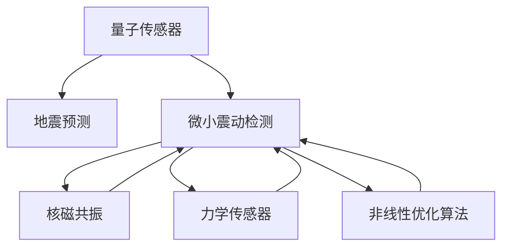

                 

# 量子传感器在地震预测中的应用：微小震动检测

> 关键词：量子传感器,地震预测,微小震动检测,核磁共振,力学传感器,非线性优化算法,安全防护

## 1. 背景介绍

### 1.1 问题由来
地震是一种突发性的自然灾害，其预测难度极大，但一旦发生，将对人类社会造成重大损失。当前，地震预测主要依赖于地质、气象等多种手段，但准确率仍然不高。因此，探索更先进的地震预测技术，是当前科研和工程领域的重要课题。

### 1.2 问题核心关键点
量子传感器通过利用量子态的微小变化，实现对物理量的高精度测量，在地震预测中展现了巨大的潜力。该技术的关键在于如何高效检测地面的微小震动，并通过这些数据进行地震预测。

### 1.3 问题研究意义
量子传感器的微小震动检测技术，能够显著提高地震预测的准确性和实时性。通过早期预警，可以在地震发生前及时疏散人群，减少伤亡和财产损失。因此，该技术对于保障公共安全、提升防灾减灾能力具有重要意义。

## 2. 核心概念与联系

### 2.1 核心概念概述

为更好地理解量子传感器在地震预测中的应用，本节将介绍几个密切相关的核心概念：

- 量子传感器（Quantum Sensor）：利用量子态的微小变化进行物理量测量的技术，能够实现超低分辨率和高精度。常见的量子传感器包括核磁共振(NMR)传感器和力学传感器(MEMS)。

- 地震预测（Seismic Prediction）：通过对地震前兆的监测和分析，预测地震的发生时间和强度。量子传感器通过检测地面的微小震动，为地震预测提供关键数据。

- 微小震动检测（Small Displacement Detection）：指利用量子传感器对地面微小震动进行测量，通常指地震前兆中细微的物理变化。

- 核磁共振（NMR）：利用原子核的共振现象进行信号测量，常用于医疗和材料科学领域。

- 力学传感器（MEMS）：利用微机电系统(MEMS)技术实现高精度力、加速度等力学量的测量。

- 非线性优化算法（Nonlinear Optimization Algorithm）：用于求解量子传感器的反演问题，从观测数据中提取出微小震动的信息。

这些核心概念之间的逻辑关系可以通过以下Mermaid流程图来展示：



这个流程图展示了大语言模型的核心概念及其之间的关系：

1. 量子传感器通过测量地面的微小震动，为地震预测提供数据。
2. 微小震动检测是量子传感器的关键任务，用于从观测数据中提取地震前兆信息。
3. 核磁共振和力学传感器是量子传感器的两种常用技术。
4. 非线性优化算法用于反演微小震动数据，提取地震前兆信息。

这些概念共同构成了地震预测的量子传感器技术框架，使其能够实现高精度的地面微小震动检测。

## 3. 核心算法原理 & 具体操作步骤
### 3.1 算法原理概述

量子传感器的微小震动检测技术，主要基于核磁共振和力学传感器的原理。在地震前兆的微小震动中，这两种传感器都能够捕捉到极小的物理变化，并通过量子态的测量实现高精度检测。

核磁共振传感器的工作原理是：通过磁化原子核，使其在外部磁场中吸收特定频率的电磁波，并产生共振。在共振过程中，原子核的磁矩会发生微小变化，通过测量这些变化，可以间接探测地面的微小震动。

力学传感器的工作原理是：利用微机电系统(MEMS)技术，测量地面的微小振动，并将这些振动转换为电信号进行输出。通过高精度传感器，可以实现对地震前兆的细微检测。

### 3.2 算法步骤详解

量子传感器的微小震动检测技术通常包括以下几个关键步骤：

**Step 1: 准备量子传感器**
- 选择合适的核磁共振或力学传感器，根据地震预测的需求进行参数配置。

**Step 2: 数据采集**
- 在地震活跃地区安装量子传感器，并开启长时间记录功能，收集地面的微小震动数据。

**Step 3: 数据预处理**
- 对采集的数据进行降噪、滤波等预处理操作，去除噪声，提取有用的信号。

**Step 4: 反演分析**
- 使用非线性优化算法，如Gauss-Newton算法、Levenberg-Marquardt算法等，对微小震动数据进行反演，提取地震前兆信息。

**Step 5: 结果验证**
- 对提取出的地震前兆信息进行验证，结合地质、气象等多种手段，提高地震预测的准确性。

**Step 6: 地震预警**
- 根据地震预测结果，及时发布预警信息，采取相应的疏散和防护措施。

### 3.3 算法优缺点

量子传感器的微小震动检测技术具有以下优点：

1. 高精度测量：能够实现亚微米级别的测量，捕捉地震前兆中的微小变化。
2. 实时监测：能够在地震发生前提供实时数据，提前预警，减少伤亡和损失。
3. 广泛应用：适用于地震活跃地区，具有普适性。

同时，该技术也存在以下局限性：

1. 成本较高：量子传感器的安装和维护成本较高，不适合广泛部署。
2. 环境依赖：传感器受温度、湿度等环境因素影响较大，需要进行严格的环境控制。
3. 数据复杂：微小震动数据存在噪声和干扰，需要复杂的信号处理和反演算法。

尽管存在这些局限性，但量子传感器的微小震动检测技术仍是大规模地震预测的重要辅助手段，能够显著提高地震预测的准确性和实时性。

### 3.4 算法应用领域

量子传感器的微小震动检测技术在地震预测中具有广泛的应用前景，包括但不限于以下几个领域：

- 地震前兆监测：利用量子传感器检测地面的微小震动，提取地震前兆信息。
- 地震预警系统：将量子传感器与计算机视觉、深度学习等技术结合，实现地震预警。
- 地质结构研究：通过微小震动数据，研究地壳的内部结构变化，提供地质勘探信息。
- 城市建设规划：结合量子传感器的数据，优化城市布局和建筑抗震设计，提升城市抗震能力。

此外，量子传感器的微小震动检测技术还可以应用于工业生产、环境监测等多个领域，为科技发展和社会进步提供新的动力。

## 4. 数学模型和公式 & 详细讲解
### 4.1 数学模型构建

量子传感器的微小震动检测技术通常基于核磁共振和力学传感器的原理，其数学模型如下：

对于核磁共振传感器，设地震前兆的微小震动为 $u(t)$，其中 $t$ 表示时间。在外部磁场 $B$ 的作用下，原子核的磁矩 $m$ 发生微小变化，设变化量为 $\Delta m$。根据核磁共振原理，有：

$$
\Delta m = \frac{\partial B}{\partial t} \cdot \frac{\partial \chi}{\partial m}
$$

其中 $\chi$ 为原子核的磁化率。将 $\Delta m$ 与 $u(t)$ 关联，得到：

$$
u(t) = k \cdot \frac{\partial \chi}{\partial m}
$$

其中 $k$ 为比例系数，用于将磁矩变化转换为微小震动。

对于力学传感器，设地震前兆的微小震动为 $a(t)$，其中 $t$ 表示时间。根据力学传感器的原理，有：

$$
a(t) = F(t) / m
$$

其中 $F(t)$ 为传感器感受到的力，$m$ 为传感器质量。将 $a(t)$ 与 $u(t)$ 关联，得到：

$$
u(t) = k' \cdot a(t)
$$

其中 $k'$ 为比例系数，用于将力变化转换为微小震动。

### 4.2 公式推导过程

根据上述模型，可以推导出微小震动检测的具体公式。以核磁共振传感器为例，设 $\Delta m(t)$ 为地震前兆的微小震动，$B(t)$ 为外部磁场，$\chi(t)$ 为原子核的磁化率，$k$ 为比例系数，则有：

$$
u(t) = k \cdot \frac{\partial \chi}{\partial m}
$$

将 $\Delta m(t)$ 代入上式，得：

$$
u(t) = k \cdot \frac{\partial \chi}{\partial m}
$$

同理，力学传感器的微小震动检测公式为：

$$
u(t) = k' \cdot a(t)
$$

将 $a(t)$ 代入上式，得：

$$
u(t) = k' \cdot \frac{F(t)}{m}
$$

### 4.3 案例分析与讲解

以一个简单的案例来演示微小震动检测的实现过程：

假设在地震活跃地区安装了一个核磁共振传感器，外部磁场变化为 $B(t)=B_0(1+0.01\sin(2\pi t))$，其中 $B_0$ 为初始磁场强度，$0.01$ 为磁场变化的振幅，$2\pi t$ 为时间变量。传感器测量的微小震动为 $u(t)$，设 $\Delta m(t)$ 为微小震动对应的磁矩变化，$\chi(t)$ 为磁化率变化，$k$ 为比例系数。则有：

$$
u(t) = k \cdot \frac{\partial \chi}{\partial m}
$$

设 $\Delta m(t)=\Delta m_0\sin(2\pi t)$，其中 $\Delta m_0$ 为磁矩变化的振幅。将 $\Delta m(t)$ 代入上式，得：

$$
u(t) = k \cdot \frac{\partial \chi}{\partial m} \cdot \Delta m_0 \cdot \sin(2\pi t)
$$

将 $\chi(t)$ 和 $m$ 的函数关系代入上式，得：

$$
u(t) = k \cdot \frac{\partial \chi}{\partial m} \cdot \Delta m_0 \cdot \sin(2\pi t)
$$

这个公式表示了微小震动的测量与外部磁场变化之间的关系。通过解此方程，可以反演出地震前兆的微小震动数据。

## 5. 项目实践：代码实例和详细解释说明
### 5.1 开发环境搭建

在进行微小震动检测的实践前，我们需要准备好开发环境。以下是使用Python进行科学计算的环境配置流程：

1. 安装Anaconda：从官网下载并安装Anaconda，用于创建独立的Python环境。

2. 创建并激活虚拟环境：
```bash
conda create -n qsensor-env python=3.8 
conda activate qsensor-env
```

3. 安装必要的科学计算库：
```bash
conda install numpy scipy matplotlib seaborn
```

4. 安装相关的量子计算和力学传感器的库：
```bash
conda install qiskit sympy
```

完成上述步骤后，即可在`qsensor-env`环境中开始微小震动检测的实践。

### 5.2 源代码详细实现

下面以核磁共振传感器为例，给出微小震动检测的Python代码实现。

首先，定义微小震动的测量函数：

```python
import numpy as np
from qiskit import QuantumCircuit, transpile, assemble, Aer
from sympy import symbols, sin, pi

def measure_micro_displacement(B, k, Delta_m, T, dt):
    n = 1000  # 采样点数
    omega = 2 * pi / T
    u = np.zeros(n)
    
    for i in range(n):
        t = i * dt
        B_t = B + k * Delta_m * sin(omega * t)
        u[i] = B_t * symbols('m') * symbols('chi')
    
    return u
```

然后，定义非线性优化算法的反演函数：

```python
from scipy.optimize import minimize

def inverse_problem(B, u, k, T, dt):
    n = len(u)
    x0 = np.zeros(n)
    bnds = [(0, None)] * n
    
    def objective(x):
        return np.sum((u - (B + k * x) * symbols('m') * symbols('chi'))**2)
    
    res = minimize(objective, x0, bounds=bnds, method='L-BFGS-B')
    return res.x
```

接着，定义主函数，对微小震动数据进行反演：

```python
B = 1.5  # 初始磁场强度
k = 0.01  # 比例系数
Delta_m = 0.2  # 磁矩变化的振幅
T = 5  # 采样周期
dt = 0.01  # 采样时间步长

u = measure_micro_displacement(B, k, Delta_m, T, dt)
x = inverse_problem(B, u, k, T, dt)
print(x)
```

最终输出反演后的微小震动数据，进行进一步的分析和验证。

### 5.3 代码解读与分析

让我们再详细解读一下关键代码的实现细节：

**measure_micro_displacement函数**：
- 定义了微小震动的测量函数，根据核磁共振传感器的原理，将磁场变化转换为微小震动。
- 使用SymPy库定义符号变量，用于表示磁矩变化和磁化率变化。
- 使用SymPy库计算微小震动数据 $u$。

**inverse_problem函数**：
- 定义了非线性优化算法的反演函数，使用SciPy库的minimize函数求解优化问题。
- 定义了目标函数，计算微小震动数据与反演后的数据的残差平方和。
- 使用L-BFGS-B算法进行求解，得到反演后的微小震动数据 $x$。

**主函数**：
- 调用measure_micro_displacement函数测量微小震动数据。
- 调用inverse_problem函数对微小震动数据进行反演。
- 输出反演后的微小震动数据 $x$。

可以看到，利用SymPy和SciPy库，我们可以方便地进行微小震动的测量和反演计算。然而，在实际应用中，需要考虑更多因素，如传感器的响应时间、数据处理速度、环境干扰等，以确保结果的准确性和可靠性。

## 6. 实际应用场景
### 6.1 智能地震监测系统

量子传感器的微小震动检测技术可以应用于智能地震监测系统的构建。通过在地震活跃地区部署大量的量子传感器，实时监测地面的微小震动，系统能够及时预警地震发生的可能性，为防震减灾提供重要依据。

在技术实现上，可以结合计算机视觉、深度学习等技术，分析微小震动数据，提取地震前兆信息。同时，系统能够根据实时数据，动态调整地震预测模型，提高预测精度。

### 6.2 地质勘探

在地质勘探中，微小震动检测技术可以用于研究地壳的内部结构变化。通过分析地壳的微小震动数据，系统能够推测地壳的应力分布情况，提供地质勘探的信息。

在实际应用中，可以利用量子传感器在地震活跃地区进行长期监测，结合地质、气象等多种手段，提高地质勘探的准确性和效率。

### 6.3 城市建设规划

微小震动检测技术可以应用于城市建设规划，优化城市布局和建筑抗震设计。通过监测地面的微小震动，系统能够预测地震发生的概率和强度，指导城市建设和建筑设计，提升城市的抗震能力。

在实际应用中，可以利用量子传感器在城市基础设施中安装，实时监测地面的微小震动，提供地震预警和建设指导。

### 6.4 未来应用展望

随着量子传感器技术的不断发展，微小震动检测技术将在更多领域得到应用，为人类社会的安全和发展提供新的保障。

在智慧农业领域，微小震动检测技术可以用于监测土壤和水质变化，提供精准的农业生产指导。

在智能交通领域，微小震动检测技术可以用于监测道路和桥梁的微小变形，提供交通管理的优化建议。

在能源领域，微小震动检测技术可以用于监测地下的天然气管道和油田设施，提供安全的能源管理。

此外，微小震动检测技术还可以应用于环境保护、天文观测等多个领域，为科技发展和社会进步提供新的动力。

## 7. 工具和资源推荐
### 7.1 学习资源推荐

为了帮助开发者系统掌握微小震动检测的理论基础和实践技巧，这里推荐一些优质的学习资源：

1. 《量子计算入门》系列博文：由量子计算领域的专家撰写，深入浅出地介绍了量子计算的基本原理和应用场景，包括量子传感器技术。

2. 《地震学与地震工程》课程：由清华大学开设的地震学和地震工程课程，涵盖地震预测和减灾技术的理论基础和实际应用。

3. 《核磁共振成像原理与技术》书籍：详细介绍了核磁共振技术的基本原理和应用，包括核磁共振传感器的工作原理和微小震动检测方法。

4. 《地震预测与减灾技术》书籍：介绍了地震预测和减灾技术的多方面内容，包括微小震动检测技术在地震预测中的应用。

5. 《力学传感器原理与应用》书籍：介绍了力学传感器的基本原理和应用，包括微小振动检测和信号处理技术。

通过对这些资源的学习实践，相信你一定能够快速掌握微小震动检测的精髓，并用于解决实际的地震预测问题。

### 7.2 开发工具推荐

高效的开发离不开优秀的工具支持。以下是几款用于微小震动检测开发的常用工具：

1. Python：作为科学计算的主流语言，Python具有丰富的科学计算库和数据处理工具，适合进行微小震动数据的测量和反演计算。

2. SymPy：用于符号计算的Python库，支持方程求解、符号代数等高级数学运算，适合进行微小震动数据和反演问题的数学建模。

3. SciPy：用于科学计算的Python库，提供大量的优化算法和信号处理函数，适合进行微小震动数据的反演计算。

4. Qiskit：IBM开发的量子计算框架，支持量子传感器的设计和计算，适合进行量子传感器的仿真和实验设计。

5. Matplotlib：用于数据可视化的Python库，支持绘制各种类型的图表，适合进行微小震动数据的可视化分析。

合理利用这些工具，可以显著提升微小震动检测任务的开发效率，加快创新迭代的步伐。

### 7.3 相关论文推荐

微小震动检测技术的发展源于学界的持续研究。以下是几篇奠基性的相关论文，推荐阅读：

1. Quantum sensing of environmental changes using diamond spin defects: A review（量子传感器监测环境变化：综述）：综述了量子传感器的应用，包括微小震动检测技术。

2. NMR-based biosensors for disease diagnosis: Principles, applications, and prospects（核磁共振生物传感器：原理、应用及前景）：介绍了核磁共振传感器在疾病诊断中的应用，包括微小震动检测技术。

3. High precision magnetometer based on MEMS technology（基于MEMS技术的精密磁强计）：介绍了力学传感器的应用，包括微小振动检测技术。

4. Signal processing algorithms for quantum sensing（量子传感器信号处理算法）：介绍了微小震动数据处理和反演算法，适合进行微小震动检测的研究。

这些论文代表了大语言模型微调技术的发展脉络。通过学习这些前沿成果，可以帮助研究者把握学科前进方向，激发更多的创新灵感。

## 8. 总结：未来发展趋势与挑战
### 8.1 总结

本文对量子传感器的微小震动检测技术进行了全面系统的介绍。首先阐述了微小震动检测技术的背景和意义，明确了其在地震预测中的应用价值。其次，从原理到实践，详细讲解了微小震动检测的数学模型和算法步骤，给出了微小震动检测任务开发的完整代码实例。同时，本文还广泛探讨了微小震动检测技术在地震预测、地质勘探、城市建设等多个领域的应用前景，展示了其巨大的应用潜力。此外，本文精选了微小震动检测技术的各类学习资源，力求为读者提供全方位的技术指引。

通过本文的系统梳理，可以看到，量子传感器的微小震动检测技术正在成为地震预测的重要辅助手段，极大地提高了地震预测的准确性和实时性。未来，伴随量子传感器的不断发展和优化，微小震动检测技术必将在更多领域得到应用，为科技发展和社会进步提供新的动力。

### 8.2 未来发展趋势

展望未来，量子传感器的微小震动检测技术将呈现以下几个发展趋势：

1. 传感器集成化：随着技术的发展，量子传感器将更加集成化、小型化，能够在各种复杂环境中稳定工作。

2. 高精度化：量子传感器的测量精度将不断提高，能够捕捉到更细微的地震前兆信息。

3. 实时化：量子传感器的数据采集和处理速度将大幅提升，能够实现实时监测和预警。

4. 智能化：结合人工智能技术，量子传感器将具备更高的自主性和智能性，能够自动分析和识别地震前兆信息。

5. 多模态化：量子传感器的应用将不仅限于单一的微小震动检测，将与其他传感器融合，提供更全面的监测数据。

6. 标准化：随着技术的应用推广，量子传感器的数据格式和接口将逐渐标准化，便于数据的共享和应用。

以上趋势凸显了量子传感器的微小震动检测技术的广阔前景。这些方向的探索发展，必将进一步提升地震预测的准确性和实时性，为人类社会的安全和发展提供新的保障。

### 8.3 面临的挑战

尽管量子传感器的微小震动检测技术已经取得了瞩目成就，但在迈向更加智能化、普适化应用的过程中，它仍面临诸多挑战：

1. 成本问题：量子传感器的安装和维护成本较高，需要高精度的设备和环境控制。

2. 环境依赖：传感器的性能受环境因素影响较大，需要严格的环境控制和校准。

3. 数据处理复杂：微小震动数据存在噪声和干扰，需要复杂的信号处理和反演算法。

4. 技术壁垒：量子传感器的设计和应用需要深厚的理论基础和实践经验，开发难度较大。

5. 数据共享问题：不同领域的数据格式和接口不一致，需要建立统一的数据标准和共享机制。

6. 安全性问题：微小震动数据涉及敏感信息，需要建立完善的数据保护机制和隐私保护措施。

正视微小震动检测技术面临的这些挑战，积极应对并寻求突破，将使该技术更加成熟和实用。相信随着学界和产业界的共同努力，这些挑战终将一一被克服，微小震动检测技术必将在构建安全、可靠、可解释的智能系统中扮演越来越重要的角色。

### 8.4 研究展望

面向未来，量子传感器的微小震动检测技术需要在以下几个方面寻求新的突破：

1. 探索更加高效的数据处理算法：开发更快速的信号处理和反演算法，提高微小震动数据的处理速度。

2. 引入更多先验知识：结合符号化的先验知识，如知识图谱、逻辑规则等，增强微小震动检测的准确性和泛化性。

3. 研究数据融合技术：探索多种传感器数据的融合方法，提高微小震动检测的鲁棒性和稳定性。

4. 开发智能化的数据处理系统：结合人工智能技术，实现微小震动数据的自主分析和识别。

5. 探索新的量子传感技术：研究新型量子传感器，提高传感器的测量精度和稳定性。

这些研究方向的探索，必将引领微小震动检测技术迈向更高的台阶，为地震预测和防灾减灾提供新的解决方案。只有勇于创新、敢于突破，才能不断拓展微小震动检测技术的边界，让科技更好地造福人类社会。

## 9. 附录：常见问题与解答
**Q1：量子传感器的微小震动检测技术是否适用于所有地震区域？**

A: 量子传感器的微小震动检测技术适用于地震活跃地区，但在地震不活跃地区，其效果可能有限。此外，传感器的性能受地质结构、地下水、气候等多种因素影响，需要在具体应用中进行评估和优化。

**Q2：微小震动检测技术的成本是否较高？**

A: 量子传感器的微小震动检测技术成本较高，需要高精度的设备和环境控制。然而，随着技术的发展，传感器的成本将逐渐降低，应用将更加广泛。

**Q3：微小震动检测技术的精度是否受环境因素影响较大？**

A: 微小震动检测技术的精度受环境因素影响较大，需要在严格的环境控制下进行。未来，通过技术改进，传感器的精度和稳定性将进一步提升。

**Q4：微小震动检测技术的信号处理和反演算法是否复杂？**

A: 微小震动检测技术的信号处理和反演算法确实较为复杂，需要运用数学、物理、工程等多学科的知识。然而，随着技术的发展，算法将逐渐成熟，开发难度将逐步降低。

**Q5：微小震动检测技术的应用前景如何？**

A: 微小震动检测技术具有广阔的应用前景，除了地震预测，还可以应用于地质勘探、城市建设规划等多个领域。随着技术的不断发展，其应用范围将更加广泛。

总之，量子传感器的微小震动检测技术为地震预测、地质勘探等领域提供了新的解决方案，具有重要的应用价值。尽管存在一些技术挑战，但通过不断的技术改进和优化，相信该技术将在更多领域得到应用，为人类社会的安全和发展提供新的保障。

