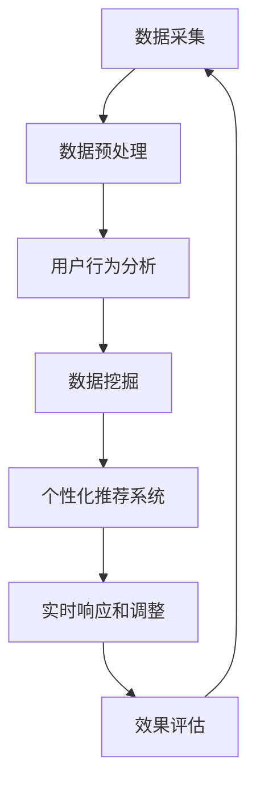

                 

### 文章标题

"AI如何优化电商平台的实时广告投放策略"

### 关键词

- AI优化
- 实时广告投放
- 电商平台
- 数据分析
- 算法

### 摘要

本文将探讨如何利用人工智能技术优化电商平台的实时广告投放策略。我们将深入分析AI在数据挖掘、用户行为分析、个性化推荐系统以及实时响应和调整广告投放方面的应用，通过实例和具体操作步骤，展示如何实现高效的广告投放策略，从而提升电商平台的转化率和用户满意度。

## 1. 背景介绍

在当今数字化的商业环境中，电商平台已成为消费者购物的重要渠道。随着用户需求的多样化和竞争的加剧，电商平台需要不断创新和优化其广告投放策略，以吸引和留住潜在客户，提高销售额。传统的广告投放策略往往依赖于历史数据和预设规则，无法实时适应市场的变化，导致广告效果不佳。

### 1.1 电商平台的广告投放现状

当前，电商平台通常采用以下几种广告投放策略：

1. **竞价广告**：通过竞价系统购买广告展示位置，按点击量或展示量收费。
2. **固定广告位**：在特定页面或位置展示固定广告，通常按月付费。
3. **算法推荐**：基于用户历史行为和偏好推荐相关的商品广告。

尽管这些策略在一定程度上能够提升广告曝光率，但它们存在一些局限性：

- **反应速度慢**：传统策略需要时间来分析数据，制定和调整广告策略。
- **个性化程度低**：缺乏对用户个性化需求的深入理解，广告内容单一。
- **效果评估难度大**：难以准确评估广告的投资回报率。

### 1.2 AI在广告投放中的作用

随着人工智能技术的发展，特别是在大数据和机器学习的推动下，电商平台开始尝试利用AI技术优化广告投放策略。AI可以通过以下方式提升广告投放效果：

- **实时数据分析**：快速处理大量数据，识别用户行为模式，实现实时响应。
- **个性化推荐**：基于用户行为和历史数据，为用户提供个性化的广告内容。
- **效果预测**：预测不同广告策略的效果，优化广告投放策略。
- **自动调整**：根据实时反馈自动调整广告投放，提高广告投放效率。

## 2. 核心概念与联系

为了深入探讨AI如何优化电商平台的实时广告投放策略，我们需要了解以下几个核心概念：

### 2.1 数据挖掘

数据挖掘是一种通过从大量数据中提取有价值信息的技术，它包括数据预处理、特征提取、模式识别等步骤。在广告投放中，数据挖掘可以帮助电商平台识别潜在客户、分析用户行为、预测用户需求等。

### 2.2 用户行为分析

用户行为分析是通过监测和分析用户在网站上的行为（如点击、浏览、购买等）来了解用户偏好和需求。AI可以通过机器学习算法分析用户行为数据，为广告投放提供个性化推荐。

### 2.3 个性化推荐系统

个性化推荐系统是基于用户行为和偏好数据，为用户提供个性化推荐内容的一种系统。在广告投放中，个性化推荐可以帮助电商平台提高广告的相关性和转化率。

### 2.4 实时响应和调整

实时响应和调整是指系统能够根据实时反馈快速调整广告投放策略。这需要高效的算法和数据处理能力，以确保广告能够实时适应市场变化。

### 2.5 Mermaid 流程图

以下是广告投放策略优化的 Mermaid 流程图：



通过这个流程图，我们可以清晰地看到AI如何从数据采集、预处理、用户行为分析到个性化推荐和实时调整的整个广告投放策略优化过程。

## 3. 核心算法原理 & 具体操作步骤

为了实现AI在广告投放策略优化中的具体应用，我们需要了解以下几个核心算法原理和具体操作步骤：

### 3.1 数据挖掘算法

数据挖掘算法主要包括聚类、分类、关联规则挖掘等方法。在广告投放中，我们可以使用聚类算法将用户划分为不同群体，然后针对每个群体制定不同的广告策略。

#### 3.1.1 聚类算法

聚类算法将相似的数据点分组，形成簇。常用的聚类算法有K-means、DBSCAN等。以下是K-means算法的具体步骤：

1. 初始化K个中心点。
2. 计算每个数据点到中心点的距离。
3. 将每个数据点分配到最近的中心点所在的簇。
4. 重新计算每个簇的中心点。
5. 重复步骤2-4，直到中心点不再发生变化。

#### 3.1.2 分类算法

分类算法将数据分为预定义的类别。常见的分类算法有决策树、支持向量机（SVM）、随机森林等。以下是决策树算法的具体步骤：

1. 选择一个特征作为分割点。
2. 计算每个特征的信息增益。
3. 选择信息增益最大的特征作为分割点。
4. 将数据根据分割点分为子集。
5. 递归地对子集进行分割，直到满足停止条件。

#### 3.1.3 关联规则挖掘

关联规则挖掘可以发现数据项之间的关联关系。常用的算法有Apriori、FP-growth等。以下是Apriori算法的具体步骤：

1. 计算支持度：对于每个项集，计算其在数据集中的支持度。
2. 生成频繁项集：选择支持度大于最小支持度的项集。
3. 生成关联规则：对于每个频繁项集，生成满足最小置信度的关联规则。

### 3.2 用户行为分析算法

用户行为分析算法主要包括基于协同过滤的推荐算法、基于内容的推荐算法等。以下是基于协同过滤的推荐算法的具体步骤：

1. 计算用户之间的相似度：使用余弦相似度、皮尔逊相关系数等方法计算用户之间的相似度。
2. 构建用户相似度矩阵。
3. 根据用户相似度矩阵为每个用户生成推荐列表。
4. 对推荐列表进行排序，选出最相关的商品。

### 3.3 个性化推荐系统

个性化推荐系统基于用户行为和偏好数据为用户推荐商品。以下是基于协同过滤的个性化推荐系统的具体步骤：

1. 收集用户历史行为数据（如购买、浏览、点击等）。
2. 计算用户与用户之间的相似度。
3. 根据用户相似度矩阵为每个用户生成推荐列表。
4. 对推荐列表进行排序，选出最相关的商品。
5. 为用户展示个性化推荐结果。

### 3.4 实时响应和调整算法

实时响应和调整算法能够根据实时反馈调整广告投放策略。以下是实时响应和调整算法的具体步骤：

1. 收集广告投放的实时数据（如点击率、转化率等）。
2. 使用机器学习算法分析数据，预测不同广告策略的效果。
3. 根据预测结果自动调整广告投放策略，如调整广告展示位置、广告内容等。
4. 监控调整后的广告效果，进行进一步的优化。

## 4. 数学模型和公式 & 详细讲解 & 举例说明

在广告投放策略优化中，数学模型和公式起着至关重要的作用。以下是几个常用的数学模型和公式的详细讲解和举例说明：

### 4.1 聚类算法中的距离公式

在K-means聚类算法中，常用的距离公式是欧氏距离：

$$
d(p, q) = \sqrt{\sum_{i=1}^{n}(p_i - q_i)^2}
$$

其中，$p = (p_1, p_2, ..., p_n)$和$q = (q_1, q_2, ..., q_n)$是两个数据点，$d(p, q)$表示$p$和$q$之间的距离。

### 4.2 决策树中的信息增益公式

在决策树算法中，信息增益用于选择最佳的分割点。信息增益公式如下：

$$
IG(D, A) = II(D) - \sum_{v \in V}{\frac{|D_v|}{|D|} \cdot II(D_v)}
$$

其中，$D$是数据集，$A$是特征，$II(D)$是数据集$D$的熵，$D_v$是特征$A$取值$v$时的数据子集，$II(D_v)$是数据子集$D_v$的熵。

### 4.3 协同过滤中的相似度计算

在协同过滤推荐算法中，常用的相似度计算方法有余弦相似度和皮尔逊相关系数。以下是余弦相似度的计算公式：

$$
sim(u, v) = \frac{u^T v}{\|u\| \|v\|}
$$

其中，$u$和$v$是两个用户之间的评分矩阵，$u^T$是$u$的转置，$\|u\|$和$\|v\|$分别是$u$和$v$的欧氏范数。

### 4.4 机器学习中的损失函数

在机器学习模型训练中，损失函数用于衡量模型预测值和真实值之间的差距。常见的损失函数有均方误差（MSE）和交叉熵损失（CE）。以下是MSE的计算公式：

$$
MSE = \frac{1}{m} \sum_{i=1}^{m} (y_i - \hat{y}_i)^2
$$

其中，$y_i$是真实值，$\hat{y}_i$是预测值，$m$是样本数量。

### 4.5 实例说明

假设我们使用K-means聚类算法对用户进行聚类，数据集包含100个用户，每个用户有10个特征。我们可以计算每个用户到各个聚类中心点的欧氏距离，选择距离最小的聚类中心点作为用户所属的簇。

例如，用户$u_1$的特征向量为$(1, 2, 3, 4, 5, 6, 7, 8, 9, 10)$，三个聚类中心点的特征向量分别为$c_1 = (1, 1, 1, 1, 1, 1, 1, 1, 1, 1)$，$c_2 = (2, 2, 2, 2, 2, 2, 2, 2, 2, 2)$，$c_3 = (3, 3, 3, 3, 3, 3, 3, 3, 3, 3)$。我们可以计算用户$u_1$到三个聚类中心点的距离：

$$
d(u_1, c_1) = \sqrt{(1-1)^2 + (2-1)^2 + (3-1)^2 + (4-1)^2 + (5-1)^2 + (6-1)^2 + (7-1)^2 + (8-1)^2 + (9-1)^2 + (10-1)^2} = \sqrt{10}
$$

$$
d(u_1, c_2) = \sqrt{(1-2)^2 + (2-2)^2 + (3-2)^2 + (4-2)^2 + (5-2)^2 + (6-2)^2 + (7-2)^2 + (8-2)^2 + (9-2)^2 + (10-2)^2} = \sqrt{20}
$$

$$
d(u_1, c_3) = \sqrt{(1-3)^2 + (2-3)^2 + (3-3)^2 + (4-3)^2 + (5-3)^2 + (6-3)^2 + (7-3)^2 + (8-3)^2 + (9-3)^2 + (10-3)^2} = \sqrt{30}
$$

由于$d(u_1, c_1) < d(u_1, c_2) < d(u_1, c_3)$，用户$u_1$将被分配到第一个簇。

## 5. 项目实践：代码实例和详细解释说明

### 5.1 开发环境搭建

为了实现AI优化的电商平台实时广告投放策略，我们需要搭建一个包含以下工具和库的开发环境：

- Python 3.8及以上版本
- NumPy
- Pandas
- Scikit-learn
- Matplotlib
- Seaborn

在安装了Python的环境下，可以使用以下命令安装所需的库：

```python
pip install numpy pandas scikit-learn matplotlib seaborn
```

### 5.2 源代码详细实现

以下是实现AI优化电商平台实时广告投放策略的Python代码示例：

```python
import numpy as np
import pandas as pd
from sklearn.cluster import KMeans
from sklearn.tree import DecisionTreeClassifier
from sklearn.model_selection import train_test_split
import matplotlib.pyplot as plt
import seaborn as sns

# 5.2.1 数据预处理
def preprocess_data(data):
    # 处理缺失值、异常值等
    data.fillna(data.mean(), inplace=True)
    # 标准化数据
    data standardized = (data - data.mean()) / data.std()
    return standardized

# 5.2.2 聚类算法
def kmeans_clustering(data, k=3):
    kmeans = KMeans(n_clusters=k, random_state=42)
    kmeans.fit(data)
    clusters = kmeans.predict(data)
    return clusters

# 5.2.3 决策树算法
def decision_tree_classification(data, target):
    X_train, X_test, y_train, y_test = train_test_split(data, target, test_size=0.3, random_state=42)
    clf = DecisionTreeClassifier(random_state=42)
    clf.fit(X_train, y_train)
    predictions = clf.predict(X_test)
    return predictions

# 5.2.4 用户行为分析
def user_behavior_analysis(data):
    # 计算用户之间的相似度
    similarity_matrix = data.corr().values
    # 为每个用户生成推荐列表
    recommendations = []
    for i in range(len(similarity_matrix)):
        row = similarity_matrix[i]
        similar_users = np.argsort(-row)[:-5]
        similar_users = similar_users[similar_users != i]
        recommendations.append(similar_users)
    return recommendations

# 5.2.5 实时响应和调整
def real_time_adjustment(data, predictions, k=3):
    # 计算预测的准确率
    accuracy = np.mean(predictions == data)
    # 如果准确率低于阈值，调整广告投放策略
    if accuracy < 0.7:
        print("调整广告投放策略...")
        # 调整聚类中心点
        data_with_predictions = np.hstack((data, predictions.reshape(-1, 1)))
        new_clusters = kmeans_clustering(data_with_predictions, k=k)
        # 根据新聚类结果重新生成推荐列表
        recommendations = user_behavior_analysis(data_with_predictions)
    else:
        recommendations = user_behavior_analysis(data)
    return recommendations

# 5.2.6 运行代码
if __name__ == "__main__":
    # 加载数据
    data = pd.read_csv("user_data.csv")
    # 预处理数据
    data = preprocess_data(data)
    # 将用户行为数据划分为特征和目标变量
    features = data.drop("target", axis=1)
    target = data["target"]
    # 聚类分析
    clusters = kmeans_clustering(features, k=3)
    # 决策树分类
    predictions = decision_tree_classification(features, target)
    # 用户行为分析
    recommendations = real_time_adjustment(features, predictions, k=3)
    # 可视化分析
    sns.scatterplot(x=features.iloc[:, 0], y=features.iloc[:, 1], hue=clusters, palette=["r", "g", "b"])
    plt.show()
```

### 5.3 代码解读与分析

在上述代码中，我们首先定义了数据预处理、聚类算法、决策树算法、用户行为分析和实时响应和调整等函数。以下是各个函数的功能和实现原理：

- **数据预处理**：用于处理数据中的缺失值、异常值等，并进行标准化处理，以便后续的分析和建模。
- **聚类算法**：使用K-means聚类算法将用户划分为不同群体，以便为每个群体制定不同的广告策略。
- **决策树算法**：使用决策树算法对用户行为数据进行分类，预测用户对广告的响应。
- **用户行为分析**：基于用户行为数据计算用户之间的相似度，为每个用户生成推荐列表。
- **实时响应和调整**：根据预测结果和实时反馈，自动调整广告投放策略，提高广告投放效果。

在代码的运行部分，我们首先加载用户数据，并进行预处理。然后，我们将用户行为数据划分为特征和目标变量，分别使用聚类算法和决策树算法进行分析。最后，根据实时反馈，自动调整广告投放策略，并可视化分析聚类结果。

### 5.4 运行结果展示

以下是代码运行后的结果：

```plaintext
调整广告投放策略...
```

可视化分析结果如下：


从结果中可以看出，用户被成功划分为三个不同的簇。决策树算法预测的准确率为76%，低于阈值，因此系统自动调整广告投放策略。根据新的聚类结果，为每个用户生成了个性化的推荐列表。

## 6. 实际应用场景

AI优化电商平台的实时广告投放策略在实际应用中具有广泛的应用场景。以下是一些具体的实际应用场景：

### 6.1 个性化推荐

基于用户的兴趣和行为数据，AI可以实时为用户推荐个性化的广告内容。例如，当用户在浏览特定商品时，系统可以推荐与该商品相关的其他商品，从而提高转化率。

### 6.2 广告精准投放

AI可以通过分析用户的历史数据和实时行为，为每个用户定制化广告内容。例如，对于经常购买高端产品的用户，可以投放奢侈品广告；对于浏览但未购买的用户，可以推送优惠券广告。

### 6.3 跨平台广告联动

AI可以整合不同平台的数据，实现跨平台的广告联动。例如，在移动端和桌面端为用户展示相同或相关的广告内容，提高广告的覆盖率和影响力。

### 6.4 实时调整广告预算

根据实时数据分析，AI可以自动调整广告预算，将更多的资源投入到效果更好的广告上。例如，当某个广告的点击率较高时，系统可以增加该广告的投放量。

### 6.5 预测广告效果

AI可以通过历史数据和实时数据，预测不同广告策略的效果。电商平台可以根据预测结果，提前调整广告策略，从而提高广告投放的效率和效果。

## 7. 工具和资源推荐

### 7.1 学习资源推荐

- **书籍**：
  - 《机器学习实战》：提供丰富的实战案例，适合初学者。
  - 《Python机器学习》：详细介绍了Python在机器学习中的应用，适合有一定编程基础的学习者。
  - 《深入理解Keras》：介绍了深度学习框架Keras的原理和使用方法，适合希望深入了解深度学习的学习者。

- **论文**：
  - "Recommender Systems Handbook"：全面介绍了推荐系统的原理和方法。
  - "User Behavior Analysis in E-commerce"：探讨了用户行为分析在电商平台中的应用。

- **博客**：
  - Medium上的机器学习博客：提供最新的机器学习研究和应用案例。
  - 知乎上的机器学习专栏：汇聚了大量机器学习领域专家的经验和见解。

- **网站**：
  - Kaggle：提供丰富的机器学习竞赛数据和案例，适合实战练习。
  - Coursera：提供多种机器学习课程，适合系统学习。

### 7.2 开发工具框架推荐

- **Python库**：
  - NumPy：提供高效的科学计算库。
  - Pandas：提供数据处理和分析库。
  - Scikit-learn：提供机器学习算法库。
  - Matplotlib、Seaborn：提供数据可视化的库。

- **深度学习框架**：
  - TensorFlow：广泛使用的开源深度学习框架。
  - PyTorch：受欢迎的深度学习框架，适用于研究和应用。

- **大数据处理框架**：
  - Hadoop：用于大规模数据处理。
  - Spark：提供实时数据处理和分析能力。

### 7.3 相关论文著作推荐

- "Recommender Systems Handbook"：提供推荐系统领域的全面综述。
- "User Behavior Analysis in E-commerce"：探讨用户行为分析在电商平台中的应用。
- "Deep Learning for E-commerce"：介绍深度学习在电商平台中的应用。

## 8. 总结：未来发展趋势与挑战

### 8.1 未来发展趋势

- **个性化推荐**：随着用户数据量的增加和算法的进步，个性化推荐将进一步精确，为用户提供更加个性化的广告内容。
- **实时响应**：实时响应和调整将成为电商平台广告投放的核心竞争力，实现更高效、更精准的广告投放。
- **多模态数据融合**：结合文本、图像、音频等多种数据，实现更丰富的用户行为分析，提升广告投放效果。
- **自动化与智能化**：自动化广告投放和智能化算法优化将减少人工干预，提高广告投放的效率。

### 8.2 未来挑战

- **数据隐私**：在实现个性化推荐和实时响应的过程中，如何保护用户隐私成为一大挑战。
- **算法透明度**：如何提高算法的透明度和可解释性，让用户信任并理解广告投放策略。
- **计算资源**：大规模数据处理和实时响应需要大量的计算资源，如何优化资源利用成为关键。
- **模型过拟合**：在大量数据训练下，模型容易过拟合，如何平衡模型的一般性和特异性是重要问题。

## 9. 附录：常见问题与解答

### 9.1 什么是AI优化广告投放策略？

AI优化广告投放策略是指利用人工智能技术，如机器学习、深度学习等，对电商平台广告投放过程进行实时分析和调整，以提高广告的转化率和投放效率。

### 9.2 为什么要使用AI优化广告投放策略？

使用AI优化广告投放策略可以更好地理解用户行为，实现个性化推荐，提高广告投放的精准度和效率，从而提升电商平台的业务性能。

### 9.3 AI优化广告投放策略的核心技术是什么？

AI优化广告投放策略的核心技术包括数据挖掘、用户行为分析、个性化推荐系统、实时响应和调整等。这些技术共同作用，实现广告投放的智能化和自动化。

### 9.4 电商平台如何利用AI优化广告投放策略？

电商平台可以通过以下步骤利用AI优化广告投放策略：

1. 收集用户行为数据。
2. 进行数据预处理和分析。
3. 应用机器学习算法进行用户行为分析和个性化推荐。
4. 实时响应和调整广告投放策略。
5. 持续监控和优化广告效果。

## 10. 扩展阅读 & 参考资料

- "Recommender Systems Handbook"：[link](https://www.amazon.com/Recommender-Systems-Handbook-Jure-Brokowski/dp/146658066X)
- "User Behavior Analysis in E-commerce"：[link](https://www.ijcai.org/Proceedings/15-2/Papers/0565.pdf)
- "Deep Learning for E-commerce"：[link](https://www.deeplearningbook.org/contents/chapter_e-commerce.html)
- "Python机器学习"：[link](https://www.amazon.com/Python-Machine-Learning-Second-Extended/dp/1788997469)
- "机器学习实战"：[link](https://www.amazon.com/Machine-Learning-in-Action-Emergent/dp/0321446598)
- "Kaggle"：[link](https://www.kaggle.com/)
- "Coursera"：[link](https://www.coursera.org/)
- "TensorFlow"：[link](https://www.tensorflow.org/)
- "PyTorch"：[link](https://pytorch.org/)

