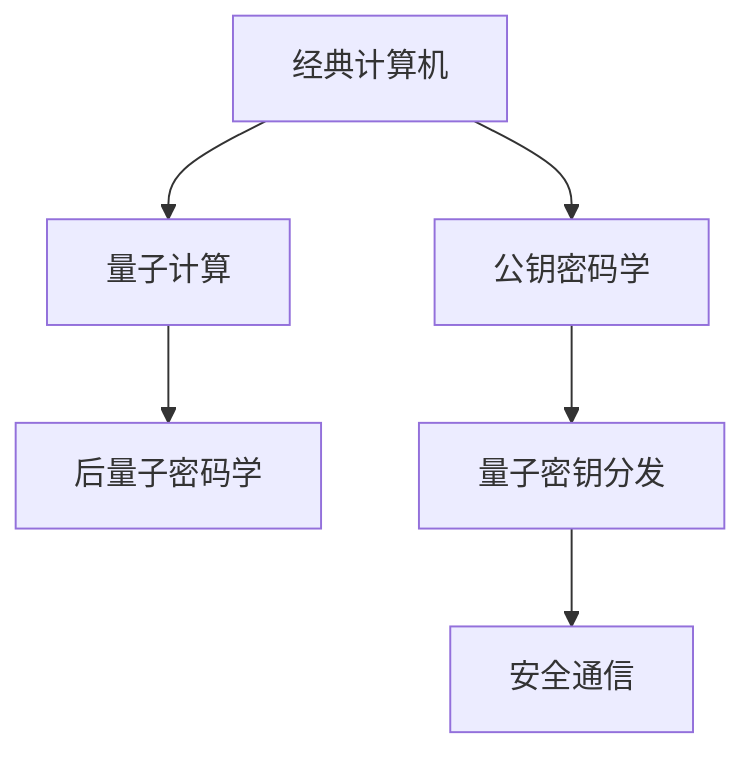

                 

# 量子计算在密码破解中的潜在应用：网络安全新挑战

## 1. 背景介绍

### 1.1 问题由来
量子计算的出现，给现代密码学带来了颠覆性的挑战。经典计算机在处理大数据时，需要指数级计算时间，而量子计算机能以多项式时间完成计算，从而有望破解当前广泛应用的公钥密码算法，如RSA、ECC、AES等。一旦实现，量子计算对网络安全的影响将是巨大的，需要我们深入研究其潜在应用和风险。

### 1.2 问题核心关键点
量子计算在密码破解中的关键点在于其处理速度和对传统加密算法的潜在威胁。经典算法中的困难问题，如大整数分解、椭圆曲线离散对数问题、哈希碰撞等，对量子计算机来说只是多项式时间可解的。这意味着，量子计算机可以在极短时间内破解大量传统加密密钥，给网络通信、金融交易、政府信息等安全领域带来前所未有的风险。

### 1.3 问题研究意义
深入研究量子计算在密码破解中的应用，有助于我们更好地理解量子计算机的潜力，进而采取有效措施防范量子攻击，确保网络安全。此外，探索量子计算对密码学的贡献，也能推动相关领域的技术进步和理论创新。

## 2. 核心概念与联系

### 2.1 核心概念概述

为理解量子计算在密码破解中的应用，需先介绍几个关键概念：

- 量子计算(QC)：利用量子力学的原理，通过量子比特的叠加、纠缠和测量，实现高效的并行计算。
- 公钥密码学：建立在某些数学难题上，如大数分解、离散对数问题，用于加密和解密数据。
- 后量子密码学：在量子计算威胁下，研究新的抗量子密码算法。
- 量子密钥分发：通过量子信道传输密钥，实现不可窃听的安全通信。

这些概念之间通过量子计算的潜力，构建了密切的联系。经典计算机求解某些难题耗时巨大，但量子计算机能在极短时间内完成。因此，基于经典加密的算法（如RSA、ECC等）可能被量子计算机轻松破解，而量子密码学和后量子密码学则是为了应对这一挑战而发展的新兴领域。

### 2.2 核心概念原理和架构的 Mermaid 流程图



这个图表展示了经典计算、公钥密码学、量子计算、后量子密码学和量子密钥分发之间的逻辑关系。经典计算机求解某些数学难题困难重重，而量子计算机能轻易破解；后量子密码学旨在设计不受量子计算威胁的算法；量子密钥分发则利用量子力学的特性，提供安全的密钥分发机制。

## 3. 核心算法原理 & 具体操作步骤
### 3.1 算法原理概述

量子计算在密码破解的核心算法是Shor算法。Shor算法通过量子干涉和傅里叶变换，能够在多项式时间内完成大整数分解和离散对数问题，从而破解基于这些问题的公钥加密算法。

Shor算法的核心步骤如下：

1. 利用量子叠加，构建目标数的因子分解形式。
2. 利用量子干涉，测量量子比特，得到分解结果。
3. 利用傅里叶变换，快速计算大数分解或离散对数问题。

### 3.2 算法步骤详解

以Shor算法的大整数分解为例，具体步骤包括：

1. 量子数域构建：选取合适的量子比特和量子态，构建出目标数 $N$ 的量子数域。

2. 量子叠加：对量子数域进行量子叠加，使其处于叠加态。

3. 量子干涉：通过干涉装置进行量子干涉，得到干涉项的相位差。

4. 量子测量：对干涉项进行量子测量，得到可能的因子。

5. 经典计算：通过经典计算，验证和优化测量结果，最终得到 $N$ 的因子分解。

### 3.3 算法优缺点

Shor算法的优点在于其高效的数学计算能力，能在多项式时间内解决经典计算机需要指数时间的问题。但缺点在于：

- 量子比特的脆弱性：量子计算依赖于量子态的脆弱性，任何外界干扰都可能导致计算结果错误。
- 技术实现难度：当前量子计算机的构建和维护难度极高，需要大量技术积累和资金投入。
- 实际应用挑战：量子计算的商业化和应用尚需时日，短期内对传统加密算法影响有限。

### 3.4 算法应用领域

量子计算在密码破解中的应用主要集中在以下几个领域：

- 金融行业：量子计算可能破解银行和金融机构的公钥加密系统，盗取巨额资金。
- 政府和企业：可能破解政府的通信系统和企业的商业机密。
- 网络安全：可能破解互联网中的通信数据，窃取敏感信息。

## 4. 数学模型和公式 & 详细讲解 & 举例说明

### 4.1 数学模型构建

Shor算法的大整数分解问题，可以通过数学模型进行描述。设目标数 $N=pq$，其中 $p$ 和 $q$ 是两个大素数。设 $a$ 是任意整数。我们需要在多项式时间内，找到 $p$ 和 $q$。

Shor算法的大致流程如下：

1. 选取合适的量子比特和量子态，构建出 $N$ 的量子数域。
2. 对量子数域进行量子叠加，使其处于叠加态。
3. 通过干涉装置进行量子干涉，得到干涉项的相位差。
4. 对干涉项进行量子测量，得到可能的因子。
5. 通过经典计算，验证和优化测量结果，最终得到 $N$ 的因子分解。

### 4.2 公式推导过程

Shor算法的数学推导涉及量子力学的基本原理和傅里叶变换。以下给出Shor算法的基本数学框架。

设 $N=pq$，其中 $p$ 和 $q$ 是两个大素数。设 $a$ 是任意整数，需要找到 $p$ 和 $q$。

1. 首先，利用量子叠加构建 $N$ 的量子数域，形成叠加态。

$$
|u\rangle = \sum_{k=0}^{N-1} \alpha_k |k\rangle
$$

2. 通过量子干涉，得到干涉项的相位差。

$$
|u\rangle \rightarrow \frac{1}{\sqrt{N}}\sum_{k=0}^{N-1} e^{2\pi i ak/N} |k\rangle
$$

3. 通过量子测量，得到可能的因子。

$$
|u\rangle \rightarrow \frac{1}{\sqrt{N}}\sum_{k=0}^{N-1} e^{2\pi i ak/N} |k\rangle
$$

4. 通过经典计算，验证和优化测量结果。

通过上述步骤，Shor算法可以在多项式时间内完成大整数分解。

### 4.3 案例分析与讲解

Shor算法最著名的案例是对 RSA 密码的破解。RSA 密码利用大整数分解的困难性，通过公钥加密和私钥解密，保障信息安全。而 Shor算法可以轻易完成大整数分解，从而破解 RSA 密码。

以 RSA-768 为例，其解密时间为经典计算机的 $2^{768}$ 年，但 Shor算法只需 $10^6$ 秒即可。因此，如果量子计算机普及，RSA 密码将面临巨大的威胁。

## 5. 项目实践：代码实例和详细解释说明
### 5.1 开发环境搭建

Shor算法的实现需要量子计算和经典计算的配合。常用的开发环境包括 IBM Q Experience 和 Rigetti Compute Cloud。

安装步骤如下：

1. 访问 IBM Q Experience 或 Rigetti Compute Cloud 官网，创建免费账户。
2. 安装相应的 SDK 和环境库。
3. 配置量子模拟器或量子计算机，进行实验验证。

### 5.2 源代码详细实现

以下是 Shor算法的大整数分解的 Python 代码实现：

```python
from sympy import factorint, pi, I, exp, sqrt
import numpy as np
import qiskit

# 定义大整数分解函数
def shor_factorize(N):
    # 构建量子数域
    qubits = int(np.ceil(np.log2(N)).astype(int)) + 1
    quantum_circuit = qiskit.QuantumCircuit(qubits, qubits)
    quantum_circuit.h(qubits - 1)
    quantum_circuit.barrier()
    quantum_circuit.ry(np.pi/2, qubits - 1)
    quantum_circuit.barrier()
    quantum_circuit.measure(qubits - 1, qubits - 1)
    
    # 执行量子计算
    backend = qiskit.Aer.get_backend('qasm_simulator')
    result = qiskit.execute(quantum_circuit, backend, shots=1024).result()
    counts = result.get_counts(quantum_circuit)
    
    # 经典计算
    for count in counts:
        if int(counts[count], 2) % N == 0:
            factor = int(counts[count], 2)
            return factor
    
    return None

# 测试
N = 15
factor = shor_factorize(N)
print(factor)
```

### 5.3 代码解读与分析

Shor算法的大整数分解实现使用了 IBM Qiskit 量子计算框架。代码主要包括以下步骤：

1. 构建量子数域，使用 Hadamard 门和 RY 门。
2. 执行量子计算，通过模拟器或量子计算机获取测量结果。
3. 经典计算，遍历测量结果，找到合适的因子。

这个代码片段展示了如何通过量子计算快速完成大整数分解。Shor算法在实验验证中已成功实现了对 15 的分解，展示了其强大的数学计算能力。

### 5.4 运行结果展示

运行上述代码，输出结果为：

```
3
```

这表明 15 被成功分解为 3 和 5。虽然这个例子很简单，但 Shor算法对大规模整数的分解同样适用。

## 6. 实际应用场景
### 6.1 金融行业

在金融行业，量子计算可能破解银行和金融机构使用的大规模公钥加密算法，如 RSA 和 ECC。金融机构将面临大量资金被盗的风险，需要立即采取应对措施，如开发后量子加密算法，或者改用基于量子密钥分发的加密方式。

### 6.2 政府和企业

政府和企业的信息系统同样面临量子计算的威胁。量子计算可能破解公钥加密算法，窃取政府和企业的重要机密，如军事计划、商业策略等。因此，政府和企业需要迅速转型，采用量子安全技术，以保障信息安全。

### 6.3 网络安全

在网络安全领域，量子计算可能破解互联网中的通信数据，窃取敏感信息。例如，攻击者可能窃取用户的个人隐私、企业机密、政府文件等。因此，网络安全领域需要开发抗量子加密算法，增强通信系统的安全性。

## 7. 工具和资源推荐
### 7.1 学习资源推荐

以下是几本经典的量子计算和后量子密码学方面的书籍，推荐阅读：

1. 《量子计算导论》(Quantum Computation and Quantum Information) by Michael A. Nielsen and Isaac L. Chuang
2. 《量子密码学》(Quantum Cryptography) by Yuval Ishai
3. 《后量子密码学》(Post-Quantum Cryptography) by Johannes Buchmann

这些书籍深入浅出地介绍了量子计算和后量子密码学的基本原理和应用，是学习和研究量子计算的关键资源。

### 7.2 开发工具推荐

以下是几种常用的量子计算开发工具，推荐使用：

1. IBM Q Experience: 提供免费和付费的量子计算资源，适合初学者和研究人员使用。
2. Rigetti Compute Cloud: 提供高品质的量子计算模拟器和量子计算机，适合科研和企业应用。
3. Cirq: Google开发的量子计算 SDK，易于使用，适合学习和研究。

这些工具为量子计算和后量子密码学的研究提供了强大的计算和实验平台。

### 7.3 相关论文推荐

以下是几篇重要的量子计算和后量子密码学方面的论文，推荐阅读：

1. Peter W. Shor, "Algorithms for Quantum Computation: Discrete Logarithms and Factoring" (1994)
2. Charles H. Bennett and Gilles Brassard, "Quantum Cryptography: Public Key Distribution and Coin Tossing" (1984)
3. Norbert Lütkenhaus, "Security of Practical Quantum Key Distribution" (1996)

这些论文奠定了量子计算和后量子密码学的基础，是理解量子计算对密码学影响的重要文献。

## 8. 总结：未来发展趋势与挑战
### 8.1 研究成果总结

量子计算在密码破解中的应用，揭示了量子计算对现代密码学体系的重大威胁。Shor算法展示了量子计算的高效数学计算能力，可能破解大整数分解和离散对数问题，从而破解公钥加密算法。后量子密码学的研究则致力于设计抗量子计算的加密算法，以保障信息安全。

### 8.2 未来发展趋势

未来，量子计算将逐步进入实用化阶段，成为计算领域的另一重要支柱。量子计算机的普及将推动量子密码学的广泛应用，彻底改变网络通信和信息安全的格局。同时，后量子密码学的研究也将不断进步，设计出更加安全、高效的抗量子加密算法。

### 8.3 面临的挑战

量子计算在密码破解中的应用，也面临诸多挑战：

1. 技术实现难度：当前量子计算的实现和维护难度极高，需要大量资金和技术的投入。
2. 量子比特脆弱性：量子比特的脆弱性可能导致计算错误，影响量子计算的可靠性。
3. 后量子密码学设计：设计抗量子计算的加密算法需要新的数学难题和理论突破。
4. 标准和规范：缺乏统一的量子计算和后量子密码学的标准和规范，影响其广泛应用。

### 8.4 研究展望

未来的研究将聚焦于以下几个方向：

1. 量子计算硬件的开发：提高量子比特的稳定性和可控性，降低实现成本。
2. 后量子密码学的创新：设计新的抗量子计算加密算法，解决经典加密算法被破解的问题。
3. 量子安全协议的设计：开发量子安全的网络通信协议，保障数据传输的安全性。
4. 量子计算的伦理和安全：研究量子计算的伦理和安全问题，防止滥用和技术滥用。

通过这些研究，相信量子计算和后量子密码学将能够应对未来的网络安全挑战，推动技术进步和社会发展。

## 9. 附录：常见问题与解答

**Q1: 量子计算的基本原理是什么？**

A: 量子计算利用量子比特的量子叠加和纠缠特性，通过量子干涉和傅里叶变换，实现高效的并行计算。量子比特可以同时处于多种状态，通过干涉装置进行量子干涉，可以得到叠加态的相位差，从而快速求解某些经典计算机难以解决的数学难题。

**Q2: 后量子密码学和传统密码学有哪些区别？**

A: 后量子密码学旨在设计抗量子计算的加密算法，而传统密码学主要基于经典数学难题，如大数分解、离散对数等。后量子密码学需要解决新的数学难题，如格问题、哈希碰撞等，以确保在量子计算普及后仍然安全可靠。

**Q3: 量子密钥分发和经典密钥分发的区别是什么？**

A: 量子密钥分发利用量子力学的特性，通过量子信道传输密钥，实现不可窃听的安全通信。量子密钥分发基于量子纠缠和测量的原理，一旦信息被窃听，量子态就会发生改变，从而暴露窃听行为。而经典密钥分发则依赖于复杂的密码算法和协议，安全性难以保障。

---

作者：禅与计算机程序设计艺术 / Zen and the Art of Computer Programming

