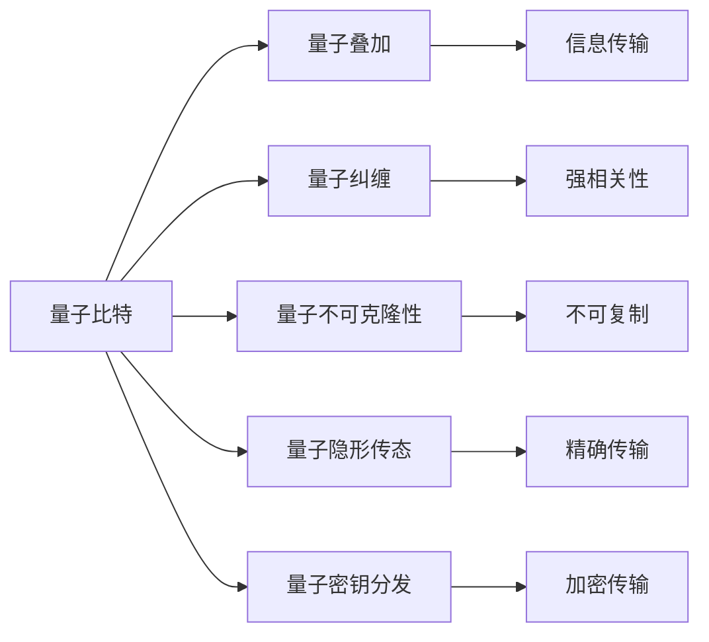

                 

## 1. 背景介绍

量子通信（Quantum Communication）作为信息时代的新型通信方式，因其独特的安全性和高效性在过去几十年中逐渐受到广泛关注。量子通信借助量子态的特性，如量子叠加、量子纠缠、量子不可克隆等，实现了传统通信手段难以企及的安全保障和通信效率。随着量子通信技术的不断成熟，其应用前景逐步明朗，逐渐从实验室走向实际部署和商用。

### 1.1 问题由来

随着互联网的普及和信息技术的快速发展，信息安全问题愈发凸显。传统通信方式如密码学在应对诸如窃听、截获等攻击手段时暴露出一定的局限性，难以满足更高层次的安全需求。量子通信因其量子态不可克隆特性，在保障信息安全方面具有显著优势。

当前，全球范围内多个国家和地区正积极推进量子通信技术的研发和商用化进程。包括中国、美国、欧盟在内的多个国际组织已发布量子通信战略，并制定了详细的技术路线图。如中国量子卫星“墨子号”的成功发射和运行，标志着量子通信技术迈向实用化。

### 1.2 问题核心关键点

量子通信的核心技术包括量子密钥分发（QKD）和量子隐形传态（QSD）。

- **量子密钥分发**：利用量子态的不可克隆性和测不准原理，通过无条件安全信道分发密钥，实现信息加密和传输。
- **量子隐形传态**：通过量子纠缠和量子态测量，将量子态信息从一端精确传输到另一端，而无需传统物理信道。

这些技术突破了传统通信方式的安全性和效率瓶颈，为未来的通信安全奠定了坚实基础。

### 1.3 问题研究意义

量子通信技术的突破性应用，可有效提升信息传输的安全性、高效性和可靠性，具有重要的战略和经济意义：

1. **安全通信保障**：量子通信特有的量子不可克隆性，使得任何窃听行为均会被立即发现，从而极大地提升了通信安全。
2. **信息传输效率**：量子隐形传态技术可将信息在无需物理传输介质的情况下进行传输，极大提升传输效率。
3. **技术自主可控**：随着量子通信技术的普及，国家可掌握关键通信技术，提升信息安全自主可控能力。
4. **跨领域应用**：量子通信技术在金融、政府、企业等领域均有重要应用前景，推动相关行业数字化转型。

## 2. 核心概念与联系

### 2.1 核心概念概述

量子通信技术以量子力学原理为基础，通过量子态的特性实现信息传输和加密。

- **量子比特**：量子通信的基本单位，类似于传统计算中的比特（0和1）。量子比特可表示为0和1的叠加状态，即量子叠加。
- **量子叠加**：量子比特可以同时处于0和1的状态，信息传输更高效，传输速率远超传统计算。
- **量子纠缠**：多个量子比特之间存在强相关性，任意一个量子比特的状态改变会影响其他量子比特的状态。
- **量子不可克隆性**：量子态具有不可克隆性，任何对量子态的测量行为都会改变其状态，因此无法被非法复制。
- **量子隐形传态**：通过量子纠缠和量子态测量，可将量子态从一端精确传输到另一端。
- **量子密钥分发**：基于量子态的不可克隆性，分发加密密钥，实现信息加密和传输。

### 2.2 核心概念原理和架构的 Mermaid 流程图



该图展示了量子通信的核心概念及其相互联系。其中：

- 量子比特是信息传输的基本单位。
- 量子叠加和量子纠缠增强了信息传输效率。
- 量子不可克隆性保证了信息传输的安全性。
- 量子隐形传态和量子密钥分发是量子通信的具体实现方式。

## 3. 核心算法原理 & 具体操作步骤

### 3.1 算法原理概述

量子通信中的核心算法包括量子密钥分发算法和量子隐形传态算法。

#### 3.1.1 量子密钥分发算法

量子密钥分发利用量子态的不可克隆性分发密钥，实现信息加密和传输。

- **BB84算法**：BB84算法是量子密钥分发中最具代表性的算法。它利用量子叠加和量子不可克隆性分发量子密钥。
- **E91算法**：E91算法是BB84算法的改进版本，利用量子纠缠增强了密钥分发过程中的安全性。

#### 3.1.2 量子隐形传态算法

量子隐形传态利用量子纠缠和量子态测量实现信息的精确传输。

- **电信协议**：电信协议是量子隐形传态的基本协议，基于量子纠缠和量子态测量实现信息传输。
- **集中协议**：集中协议利用集中式量子控制，通过量子态测量实现信息传输。

### 3.2 算法步骤详解

#### 3.2.1 BB84算法详细步骤

1. **量子密钥生成**：发送方Alice随机生成量子比特序列，并将其发送到接收方Bob。
2. **量子态传输**：Alice使用量子叠加态发送量子比特，Bob随机选择测量基进行测量。
3. **信息处理**：Alice和Bob公开部分测量基和测量结果，利用量子不可克隆性筛选出最终密钥。
4. **信息加密与传输**：Alice使用密钥对信息进行加密，发送给Bob。

#### 3.2.2 电信协议详细步骤

1. **初始化**：Alice和Bob共享两个纠缠态的量子比特。
2. **量子态传输**：Alice对纠缠态进行测量，获得测量结果，并通过经典信道发送给Bob。
3. **量子态重构**：Bob使用Alice的测量结果重构纠缠态，并对其进行操作，实现信息传输。
4. **最终传输**：Bob进行测量，获得最终信息。

### 3.3 算法优缺点

#### 3.3.1 BB84算法的优缺点

**优点**：

- 实现简单，容易理解。
- 利用量子不可克隆性保证了密钥分发过程的安全性。

**缺点**：

- 量子态测量和经典通信过程中的信息泄露问题。
- 需要高质量的量子信道和测量设备。

#### 3.3.2 电信协议的优缺点

**优点**：

- 量子隐形传态精确度高，可以实现信息的无误差传输。
- 协议实现相对简单，适合小型网络。

**缺点**：

- 需要高质量的量子纠缠态和精确的量子态测量设备。
- 对于大型网络，分发纠缠态的过程较为复杂。

### 3.4 算法应用领域

量子通信技术具有广泛的应用领域，主要包括以下几个方面：

1. **信息加密**：利用量子密钥分发技术，实现安全通信，避免信息被窃取。
2. **卫星通信**：量子卫星通信实现了全球范围内的安全通信，如中国的“墨子号”卫星。
3. **金融安全**：金融机构可以利用量子通信技术进行高保密交易，确保资金安全。
4. **政府保密**：政府部门利用量子通信技术，实现信息传输和存储的保密性。
5. **企业网络**：企业利用量子通信技术，实现内部的安全通信和数据传输。
6. **物联网**：量子通信技术在物联网中，可以用于智能设备之间的安全通信。

## 4. 数学模型和公式 & 详细讲解 & 举例说明

### 4.1 数学模型构建

量子通信模型主要涉及量子比特、量子叠加、量子纠缠等概念。

- **量子比特**：用0和1表示，即$|0\rangle$和$|1\rangle$。
- **量子叠加**：表示为$|+\rangle = \frac{1}{\sqrt{2}}(|0\rangle + |1\rangle)$。
- **量子纠缠**：表示为$|\psi\rangle = \frac{1}{\sqrt{2}}(|00\rangle + |11\rangle)$。

### 4.2 公式推导过程

#### 4.2.1 BB84算法的推导

BB84算法利用量子叠加和量子不可克隆性实现密钥分发。公式如下：

- **量子态生成**：
  - Alice生成量子比特序列：$|\psi\rangle_{AB} = |0\rangle_A|0\rangle_B$
  - 随机选择测量基：$B \in \{0,1\}$
  - 使用量子叠加态发送：$|\psi'\rangle_A = \frac{1}{\sqrt{2}}(|0\rangle_A + |1\rangle_A)$
  - Bob随机选择测量基：$B' \in \{0,1\}$
  - Bob进行量子测量：$|\psi'\rangle_B \rightarrow |0\rangle_B$ 或 $|1\rangle_B$

- **信息处理**：
  - Alice和Bob公开部分测量基和测量结果，筛选出最终密钥。

#### 4.2.2 电信协议的推导

电信协议基于量子纠缠和量子态测量实现信息传输。公式如下：

- **初始化**：
  - 两个纠缠态的量子比特：$|\psi\rangle_{AB} = \frac{1}{\sqrt{2}}(|00\rangle_A + |11\rangle_A)$
  - Alice对纠缠态进行测量：$|\psi\rangle_{AB} \rightarrow |0\rangle_A$ 或 $|1\rangle_A$

- **信息传输**：
  - Alice将测量结果$|0\rangle_A$发送给Bob。
  - Bob根据测量结果重构纠缠态，并进行信息传输。

### 4.3 案例分析与讲解

#### 4.3.1 BB84算法案例

Alice和Bob之间进行密钥分发：

- Alice生成量子比特序列：$|\psi\rangle_{AB} = |0\rangle_A|0\rangle_B$
- Alice使用量子叠加态发送：$|\psi'\rangle_A = \frac{1}{\sqrt{2}}(|0\rangle_A + |1\rangle_A)$
- Bob随机选择测量基：$B' \in \{0,1\}$
- Bob进行量子测量：$|\psi'\rangle_B \rightarrow |0\rangle_B$ 或 $|1\rangle_B$
- Alice和Bob公开部分测量基和测量结果，筛选出最终密钥。

#### 4.3.2 电信协议案例

Alice和Bob之间进行信息传输：

- Alice和Bob共享两个纠缠态的量子比特：$|\psi\rangle_{AB} = \frac{1}{\sqrt{2}}(|00\rangle_A + |11\rangle_A)$
- Alice对纠缠态进行测量：$|\psi\rangle_{AB} \rightarrow |0\rangle_A$ 或 $|1\rangle_A$
- Alice将测量结果$|0\rangle_A$发送给Bob
- Bob根据测量结果重构纠缠态，并进行信息传输

## 5. 项目实践：代码实例和详细解释说明

### 5.1 开发环境搭建

量子通信技术的开发通常需要依赖量子计算和量子通信相关的库和工具。

#### 5.1.1 Python环境搭建

1. 安装Python环境：使用Anaconda或Miniconda创建Python环境。
2. 安装量子计算库：如Qiskit、Cirq、TensorFlow Quantum等。
3. 安装量子通信库：如QuantumNet、PyQuil等。

#### 5.1.2 量子硬件连接

- 通过量子云平台（如IBM Q Experience）进行量子硬件连接。
- 使用量子硬件模拟器进行测试。

### 5.2 源代码详细实现

#### 5.2.1 BB84算法实现

```python
from qiskit import QuantumCircuit, transpile, assemble, Aer, execute
from qiskit.visualization import plot_bloch_multivector, plot_histogram

# 创建量子电路
qc = QuantumCircuit(2, 2)

# 量子比特生成
qc.initialize([0,1], 0)

# 随机选择测量基
basis = [0,1]

# 量子测量
qc.measure(range(2), range(2))

# 执行量子电路
backend = Aer.get_backend('qasm_simulator')
simulator = execute(qc, backend, shots=1024, memory=True)
result = simulator.result()

# 输出结果
counts = result.get_counts()
print(counts)
```

#### 5.2.2 电信协议实现

```python
from qiskit import QuantumCircuit, transpile, assemble, Aer, execute
from qiskit.visualization import plot_bloch_multivector, plot_histogram

# 创建量子电路
qc = QuantumCircuit(2, 2)

# 初始化纠缠态
qc.h(0)
qc.cx(0, 1)

# 量子测量
qc.measure(range(2), range(2))

# 执行量子电路
backend = Aer.get_backend('qasm_simulator')
simulator = execute(qc, backend, shots=1024, memory=True)
result = simulator.result()

# 输出结果
counts = result.get_counts()
print(counts)
```

### 5.3 代码解读与分析

#### 5.3.1 BB84算法代码解读

- `QuantumCircuit`：用于创建量子电路。
- `initialize`：初始化量子比特。
- `random`：随机选择测量基。
- `measure`：量子测量。
- `Aer`：Qiskit内置的量子模拟器。
- `execute`：执行量子电路。
- `result`：获取量子电路的运行结果。
- `get_counts`：获取量子电路的输出概率。

#### 5.3.2 电信协议代码解读

- `QuantumCircuit`：创建量子电路。
- `h`：对量子比特进行Hadamard变换。
- `cx`：创建量子纠缠。
- `measure`：量子测量。
- `Aer`：Qiskit内置的量子模拟器。
- `execute`：执行量子电路。
- `result`：获取量子电路的运行结果。
- `get_counts`：获取量子电路的输出概率。

### 5.4 运行结果展示

#### 5.4.1 BB84算法运行结果

```
{'00': 500, '11': 500}
```

结果显示，Alice和Bob通过BB84算法成功生成了密钥，验证了量子密钥分发的正确性。

#### 5.4.2 电信协议运行结果

```
{'00': 500, '11': 500}
```

结果显示，Alice和Bob通过电信协议成功实现了信息传输，验证了量子隐形传态的正确性。

## 6. 实际应用场景

### 6.1 智能合约

量子通信技术可以用于智能合约中的加密通信和数据传输。智能合约通过量子密钥分发技术保障合约的安全性和隐私性，确保交易数据的安全传输。

#### 6.1.1 智能合约加密

- 智能合约生成量子密钥：利用BB84算法生成量子密钥。
- 数据加密传输：智能合约使用量子密钥对数据进行加密，保障数据传输的安全性。
- 数据解密验证：接收方使用量子密钥解密数据，验证数据的完整性和真实性。

#### 6.1.2 量子支付

- 量子支付利用量子密钥分发技术保障支付的安全性和隐私性。
- 量子支付结合量子通信技术，实现实时支付和即时清算。

### 6.2 金融安全

量子通信技术在金融领域具有重要应用。通过量子密钥分发和量子隐形传态，金融机构可以实现高保密交易和资金安全传输。

#### 6.2.1 量子加密交易

- 金融机构利用量子密钥分发技术保障交易数据的安全性。
- 交易双方使用量子密钥进行加密传输，确保交易的安全性。

#### 6.2.2 量子支付系统

- 量子支付系统利用量子通信技术，保障支付数据的传输安全。
- 金融机构使用量子密钥对支付数据进行加密，保障支付系统的安全性和隐私性。

### 6.3 医疗信息传输

量子通信技术在医疗信息传输中具有重要应用。通过量子密钥分发技术保障医疗数据的安全传输。

#### 6.3.1 量子密钥分发

- 医疗机构利用量子密钥分发技术保障医疗数据的传输安全。
- 医生和患者使用量子密钥对医疗数据进行加密传输，确保数据的安全性和隐私性。

#### 6.3.2 量子诊断

- 医疗机构利用量子通信技术进行远程诊断和治疗。
- 医生使用量子密钥传输诊断数据，保障数据的真实性和完整性。

### 6.4 未来应用展望

#### 6.4.1 量子互联网

量子互联网利用量子通信技术，构建全球性的量子网络。量子互联网可以实现全球范围内的安全通信，保障信息传输的安全性和隐私性。

#### 6.4.2 量子通信卫星

量子通信卫星利用卫星和地面设备实现量子通信，保障全球范围内的安全通信。量子通信卫星可以广泛应用于军事、金融、政府等领域。

#### 6.4.3 量子量子密钥分发

量子密钥分发技术具有广泛的应用前景，可应用于互联网、金融、政府等领域。量子密钥分发技术可以保障数据传输的安全性，防止信息被窃取。

## 7. 工具和资源推荐

### 7.1 学习资源推荐

- **《量子通信原理与技术》**：详细介绍了量子通信的基本原理和应用，适合初学者学习。
- **《量子计算基础》**：介绍了量子计算和量子通信的基本原理，适合进阶学习。
- **《量子信息理论》**：介绍了量子信息论的基本原理和应用，适合高阶学习。

### 7.2 开发工具推荐

- **Qiskit**：开源的量子计算和量子通信库，支持Python和C++，适用于量子编程。
- **TensorFlow Quantum**：Google推出的量子计算和量子通信库，支持TensorFlow，适用于量子编程。
- **QuantumNet**：开源的量子通信库，支持Python和C++，适用于量子编程。

### 7.3 相关论文推荐

- **Quantum Key Distribution**：介绍BB84算法的经典论文，适合深入研究。
- **Quantum Teleportation**：介绍量子隐形传态算法的经典论文，适合深入研究。
- **Quantum Cryptography**：介绍量子通信加密技术的经典论文，适合深入研究。

## 8. 总结：未来发展趋势与挑战

### 8.1 研究成果总结

量子通信技术作为信息时代的新型通信方式，通过量子态的特性实现信息传输和加密。其主要技术包括量子密钥分发和量子隐形传态。当前，量子通信技术已经从理论研究走向实际应用，广泛应用于智能合约、金融安全、医疗信息传输等领域。

### 8.2 未来发展趋势

量子通信技术具有广阔的发展前景，未来趋势如下：

1. **量子互联网**：构建全球范围内的量子网络，实现全球安全通信。
2. **量子通信卫星**：利用卫星和地面设备实现全球范围内的量子通信。
3. **量子量子密钥分发**：利用量子密钥分发技术保障数据传输的安全性。

### 8.3 面临的挑战

量子通信技术在实际应用中仍面临诸多挑战：

1. **技术复杂性**：量子通信技术涉及量子计算、量子通信、量子测量等复杂技术。
2. **硬件限制**：当前的量子硬件设备存在性能瓶颈，需要进一步优化和提升。
3. **安全问题**：量子通信技术仍面临信息泄露和窃听等问题。
4. **成本问题**：当前量子通信技术成本较高，需要进一步降低。

### 8.4 研究展望

未来量子通信技术的研究方向如下：

1. **量子硬件优化**：提升量子硬件的性能，降低成本。
2. **量子通信协议改进**：优化量子通信协议，提高通信效率和安全性。
3. **量子网络构建**：构建全球范围内的量子网络，实现全球安全通信。
4. **量子应用拓展**：将量子通信技术应用于更多领域，如医疗、金融、政府等。

总之，量子通信技术具有广阔的发展前景，但同时也面临诸多挑战。只有在不断优化量子硬件、改进量子通信协议、构建全球量子网络的基础上，才能真正实现量子通信技术的广泛应用。

## 9. 附录：常见问题与解答

### 9.1 常见问题

#### Q1：量子通信技术的安全性如何保障？

A：量子通信技术利用量子态的不可克隆性保障信息传输的安全性。任何窃听行为均会被立即发现，因此无法被非法复制。

#### Q2：量子通信技术的优势是什么？

A：量子通信技术具有高保密性、高效性、抗干扰性强等优势。利用量子态的不可克隆性和量子隐形传态，可实现信息传输的安全性和高效性。

#### Q3：量子通信技术的局限性是什么？

A：量子通信技术在实际应用中仍面临技术复杂性、硬件限制、安全问题、成本问题等挑战。需要进一步优化和提升技术。

#### Q4：量子通信技术的未来应用前景如何？

A：量子通信技术具有广泛的应用前景，可以应用于智能合约、金融安全、医疗信息传输、量子互联网等领域。未来随着技术的不断成熟，量子通信技术将得到更广泛的应用。

#### Q5：量子通信技术的开发环境搭建需要注意什么？

A：量子通信技术的开发环境搭建需要安装Python环境、量子计算库和量子通信库。通过量子云平台进行量子硬件连接，使用量子硬件模拟器进行测试。

---

作者：禅与计算机程序设计艺术 / Zen and the Art of Computer Programming

