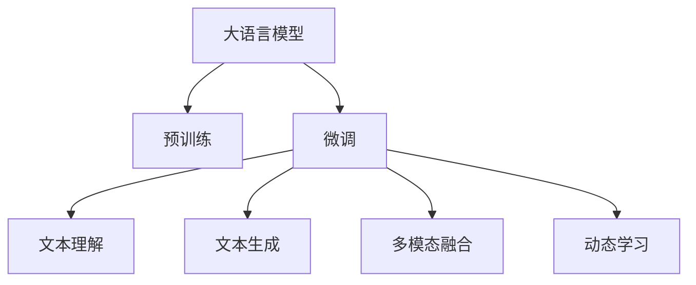

                 

# 金融AI：使用LLM进行市场分析和风险评估

## 1. 背景介绍

随着金融市场日趋复杂多变，传统基于规则的金融分析和风险评估方法显得力不从心。越来越多的金融机构开始转向人工智能（AI）技术，利用机器学习、自然语言处理（NLP）等前沿技术，提升金融决策的智能化水平。其中，语言模型（Language Model，LLM）作为AI领域的重要突破，已经广泛应用于金融行业的市场分析和风险评估中。

### 1.1 问题由来

金融行业中的市场分析和风险评估任务，往往依赖于大量结构化和非结构化数据。传统的金融分析师需要耗费大量时间和精力，从海量文本数据中提取有用信息，进行多维度分析，并判断市场走势和风险变化。而随着金融产品和服务的多样化，这一过程愈发繁琐。

大语言模型（Large Language Model，LLM）能够通过预训练学习到丰富的语言知识，快速理解金融文本中的复杂语义，在市场分析和风险评估中展现出独特的优势。基于大语言模型的方法可以在短时间内处理海量金融文本，自动生成报告、预测市场走势、识别风险信号，极大提高了分析效率和决策精度。

### 1.2 问题核心关键点

使用大语言模型进行市场分析和风险评估的核心在于：

- 预训练和微调：大语言模型在大量无标签文本数据上进行预训练，然后在金融文本上微调，学习特定的金融领域知识。
- 文本理解与生成：通过大语言模型，金融分析师可以从新闻、报告、社交媒体等文本中快速提取关键信息，生成预测和建议。
- 多模态融合：结合股票价格、宏观经济指标、舆情分析等多源数据，进行综合分析，提升决策质量。
- 动态学习：随着金融市场的变化，大语言模型可以动态更新知识，适应最新的市场情况。

## 2. 核心概念与联系

### 2.1 核心概念概述

为更好地理解使用大语言模型进行金融市场分析和风险评估的方法，本节将介绍几个密切相关的核心概念：

- **大语言模型**：指在大量无标签文本数据上预训练的深度学习模型，如BERT、GPT-2、T5等。这些模型通常包含数十亿个参数，可以理解自然语言的复杂结构和语义。
- **预训练**：指在大规模无标签数据上，通过自监督学习任务训练语言模型的过程。预训练使得模型学习到通用的语言表示，提升模型在特定任务上的泛化能力。
- **微调**：指在预训练模型的基础上，使用金融文本数据进行有监督学习，优化模型在金融任务上的表现。微调过程通常包括模型适配层的设计和优化器的选择。
- **多模态数据融合**：指将文本、图像、音频等多源数据进行融合，提升模型的综合分析能力。在金融分析中，可以通过股票价格、新闻、社交媒体等数据进行多模态融合。
- **动态学习**：指大语言模型能够随着时间动态更新知识，适应新的金融市场情况。动态学习需要结合时序模型和增量学习技术。

这些核心概念之间的逻辑关系可以通过以下Mermaid流程图来展示：



这个流程图展示了大语言模型在金融市场分析和风险评估中的核心步骤：

1. 大语言模型通过预训练获得通用的语言表示。
2. 微调使得模型学习特定的金融领域知识，提升在金融任务上的表现。
3. 文本理解与生成帮助分析师从金融文本中提取关键信息。
4. 多模态融合结合不同来源的数据，提升决策质量。
5. 动态学习使得模型能够随时间更新，适应最新的市场情况。

## 3. 核心算法原理 & 具体操作步骤

### 3.1 算法原理概述

使用大语言模型进行市场分析和风险评估的本质是一个有监督学习的微调过程。其核心思想是：将预训练的大语言模型视作一个强大的"文本理解器"，通过在金融文本数据上进行有监督微调，使得模型能够理解金融语言的语义，提取关键信息，生成预测和建议。

形式化地，假设预训练语言模型为 $M_{\theta}$，其中 $\theta$ 为预训练得到的模型参数。给定金融文本 $D=\{(x_i, y_i)\}_{i=1}^N$，其中 $x_i$ 为金融文本，$y_i$ 为标注的市场走势或风险信号。微调的目标是找到新的模型参数 $\hat{\theta}$，使得：

$$
\hat{\theta}=\mathop{\arg\min}_{\theta} \mathcal{L}(M_{\theta},D)
$$

其中 $\mathcal{L}$ 为针对金融任务设计的损失函数，用于衡量模型预测输出与真实标签之间的差异。常见的损失函数包括交叉熵损失、均方误差损失等。

通过梯度下降等优化算法，微调过程不断更新模型参数 $\theta$，最小化损失函数 $\mathcal{L}$，使得模型输出逼近真实标签。由于 $\theta$ 已经通过预训练获得了较强的语言理解能力，因此即便在小规模数据集 $D$ 上进行微调，也能较快收敛到理想的模型参数 $\hat{\theta}$。

### 3.2 算法步骤详解

使用大语言模型进行市场分析和风险评估的一般步骤如下：

**Step 1: 准备预训练模型和数据集**

- 选择合适的预训练语言模型 $M_{\theta}$，如BERT、GPT-2等。
- 准备金融文本数据集 $D=\{(x_i, y_i)\}_{i=1}^N$，其中 $x_i$ 为金融文本，$y_i$ 为标注的市场走势或风险信号。

**Step 2: 添加任务适配层**

- 根据金融任务类型，在预训练模型顶层设计合适的输出层和损失函数。
- 对于分类任务，通常在顶层添加线性分类器和交叉熵损失函数。
- 对于生成任务，通常使用语言模型的解码器输出概率分布，并以负对数似然为损失函数。

**Step 3: 设置微调超参数**

- 选择合适的优化算法及其参数，如 AdamW、SGD 等，设置学习率、批大小、迭代轮数等。
- 设置正则化技术及强度，包括权重衰减、Dropout、Early Stopping等。
- 确定冻结预训练参数的策略，如仅微调顶层，或全部参数都参与微调。

**Step 4: 执行梯度训练**

- 将金融文本数据集 $D$ 分批次输入模型，前向传播计算损失函数。
- 反向传播计算参数梯度，根据设定的优化算法和学习率更新模型参数。
- 周期性在验证集上评估模型性能，根据性能指标决定是否触发 Early Stopping。
- 重复上述步骤直到满足预设的迭代轮数或 Early Stopping 条件。

**Step 5: 测试和部署**

- 在测试集上评估微调后模型 $M_{\hat{\theta}}$ 的性能，对比微调前后的精度提升。
- 使用微调后的模型对新金融文本进行推理预测，集成到实际的应用系统中。
- 持续收集新的数据，定期重新微调模型，以适应数据分布的变化。

以上是使用大语言模型进行市场分析和风险评估的一般流程。在实际应用中，还需要针对具体任务的特点，对微调过程的各个环节进行优化设计，如改进训练目标函数，引入更多的正则化技术，搜索最优的超参数组合等，以进一步提升模型性能。

### 3.3 算法优缺点

使用大语言模型进行市场分析和风险评估的方法具有以下优点：

1. **快速处理海量数据**：大语言模型能够在短时间内处理海量金融文本，大幅提升分析效率。
2. **泛化能力强**：预训练和微调过程能够学习通用的金融语言表示，适应不同的金融文本和任务。
3. **多模态融合**：结合文本、图像、音频等多种数据源，提升决策质量。
4. **动态更新**：能够随着时间动态更新知识，适应最新的市场情况。

同时，该方法也存在一定的局限性：

1. **数据质量依赖高**：微调的效果很大程度上取决于标注数据的质量和数量，标注成本较高。
2. **模型复杂度高**：大语言模型的参数量巨大，需要高性能计算资源进行训练和推理。
3. **解释性不足**：微调模型难以解释其内部工作机制，缺乏可解释性。
4. **偏见传递风险**：预训练模型的偏见和有害信息可能通过微调传递到金融任务中，造成风险。

尽管存在这些局限性，但就目前而言，使用大语言模型进行市场分析和风险评估仍是金融领域的重要技术手段。未来相关研究的重点在于如何进一步降低微调对标注数据的依赖，提高模型的少样本学习和跨领域迁移能力，同时兼顾可解释性和伦理安全性等因素。

### 3.4 算法应用领域

使用大语言模型进行市场分析和风险评估的方法在金融领域已经得到了广泛应用，覆盖了多个细分领域，例如：

- **市场走势预测**：利用金融新闻、报告等文本数据，预测股市、债市、汇市等市场走势。
- **风险识别与监控**：通过金融舆情分析、新闻监控等手段，识别潜在的市场风险和异常信号。
- **量化交易**：根据历史金融文本和实时数据，生成量化交易策略，提升投资收益。
- **信用评估**：结合金融文本和客户行为数据，进行信用评分和风险评估。
- **情感分析**：通过金融舆情分析，评估市场情绪和投资者信心，预测市场变化。

除了上述这些经典应用外，大语言模型还被创新性地应用于金融科技、智能投顾、金融风控等多个场景中，为金融行业带来了深刻的变革。

## 4. 数学模型和公式 & 详细讲解 & 举例说明

### 4.1 数学模型构建

本节将使用数学语言对使用大语言模型进行金融市场分析和风险评估的过程进行更加严格的刻画。

记预训练语言模型为 $M_{\theta}$，其中 $\theta$ 为模型参数。假设金融文本数据集 $D=\{(x_i, y_i)\}_{i=1}^N$，其中 $x_i$ 为金融文本，$y_i$ 为标注的市场走势或风险信号。

定义模型 $M_{\theta}$ 在数据样本 $(x,y)$ 上的损失函数为 $\ell(M_{\theta}(x),y)$，则在数据集 $D$ 上的经验风险为：

$$
\mathcal{L}(\theta) = \frac{1}{N} \sum_{i=1}^N \ell(M_{\theta}(x_i),y_i)
$$

微调的优化目标是最小化经验风险，即找到最优参数：

$$
\theta^* = \mathop{\arg\min}_{\theta} \mathcal{L}(\theta)
$$

在实践中，我们通常使用基于梯度的优化算法（如SGD、Adam等）来近似求解上述最优化问题。设 $\eta$ 为学习率，$\lambda$ 为正则化系数，则参数的更新公式为：

$$
\theta \leftarrow \theta - \eta \nabla_{\theta}\mathcal{L}(\theta) - \eta\lambda\theta
$$

其中 $\nabla_{\theta}\mathcal{L}(\theta)$ 为损失函数对参数 $\theta$ 的梯度，可通过反向传播算法高效计算。

### 4.2 公式推导过程

以下我们以市场走势预测任务为例，推导交叉熵损失函数及其梯度的计算公式。

假设模型 $M_{\theta}$ 在输入 $x$ 上的输出为 $\hat{y}=M_{\theta}(x) \in [0,1]$，表示样本属于正类的概率。真实标签 $y \in \{0,1\}$。则二分类交叉熵损失函数定义为：

$$
\ell(M_{\theta}(x),y) = -[y\log \hat{y} + (1-y)\log (1-\hat{y})]
$$

将其代入经验风险公式，得：

$$
\mathcal{L}(\theta) = -\frac{1}{N}\sum_{i=1}^N [y_i\log M_{\theta}(x_i)+(1-y_i)\log(1-M_{\theta}(x_i))]
$$

根据链式法则，损失函数对参数 $\theta_k$ 的梯度为：

$$
\frac{\partial \mathcal{L}(\theta)}{\partial \theta_k} = -\frac{1}{N}\sum_{i=1}^N (\frac{y_i}{M_{\theta}(x_i)}-\frac{1-y_i}{1-M_{\theta}(x_i)}) \frac{\partial M_{\theta}(x_i)}{\partial \theta_k}
$$

其中 $\frac{\partial M_{\theta}(x_i)}{\partial \theta_k}$ 可进一步递归展开，利用自动微分技术完成计算。

在得到损失函数的梯度后，即可带入参数更新公式，完成模型的迭代优化。重复上述过程直至收敛，最终得到适应金融任务的最优模型参数 $\theta^*$。

## 5. 项目实践：代码实例和详细解释说明

### 5.1 开发环境搭建

在进行金融市场分析和风险评估实践前，我们需要准备好开发环境。以下是使用Python进行PyTorch开发的环境配置流程：

1. 安装Anaconda：从官网下载并安装Anaconda，用于创建独立的Python环境。

2. 创建并激活虚拟环境：
```bash
conda create -n pytorch-env python=3.8 
conda activate pytorch-env
```

3. 安装PyTorch：根据CUDA版本，从官网获取对应的安装命令。例如：
```bash
conda install pytorch torchvision torchaudio cudatoolkit=11.1 -c pytorch -c conda-forge
```

4. 安装Transformers库：
```bash
pip install transformers
```

5. 安装各类工具包：
```bash
pip install numpy pandas scikit-learn matplotlib tqdm jupyter notebook ipython
```

完成上述步骤后，即可在`pytorch-env`环境中开始市场分析和风险评估实践。

### 5.2 源代码详细实现

下面我们以市场走势预测任务为例，给出使用Transformers库对BERT模型进行市场分析的PyTorch代码实现。

首先，定义市场走势预测任务的数据处理函数：

```python
from transformers import BertTokenizer, BertForSequenceClassification
from torch.utils.data import Dataset
import torch

class StockMarketDataset(Dataset):
    def __init__(self, texts, labels, tokenizer, max_len=128):
        self.texts = texts
        self.labels = labels
        self.tokenizer = tokenizer
        self.max_len = max_len
        
    def __len__(self):
        return len(self.texts)
    
    def __getitem__(self, item):
        text = self.texts[item]
        label = self.labels[item]
        
        encoding = self.tokenizer(text, return_tensors='pt', max_length=self.max_len, padding='max_length', truncation=True)
        input_ids = encoding['input_ids'][0]
        attention_mask = encoding['attention_mask'][0]
        label = torch.tensor(label, dtype=torch.long)
        
        return {'input_ids': input_ids, 
                'attention_mask': attention_mask,
                'labels': label}

# 标签与id的映射
label2id = {'Bull': 1, 'Bear': 0}

# 创建dataset
tokenizer = BertTokenizer.from_pretrained('bert-base-cased')

train_dataset = StockMarketDataset(train_texts, train_labels, tokenizer)
dev_dataset = StockMarketDataset(dev_texts, dev_labels, tokenizer)
test_dataset = StockMarketDataset(test_texts, test_labels, tokenizer)
```

然后，定义模型和优化器：

```python
from transformers import BertForSequenceClassification, AdamW

model = BertForSequenceClassification.from_pretrained('bert-base-cased', num_labels=2)

optimizer = AdamW(model.parameters(), lr=2e-5)
```

接着，定义训练和评估函数：

```python
from torch.utils.data import DataLoader
from tqdm import tqdm
from sklearn.metrics import classification_report

device = torch.device('cuda') if torch.cuda.is_available() else torch.device('cpu')
model.to(device)

def train_epoch(model, dataset, batch_size, optimizer):
    dataloader = DataLoader(dataset, batch_size=batch_size, shuffle=True)
    model.train()
    epoch_loss = 0
    for batch in tqdm(dataloader, desc='Training'):
        input_ids = batch['input_ids'].to(device)
        attention_mask = batch['attention_mask'].to(device)
        labels = batch['labels'].to(device)
        model.zero_grad()
        outputs = model(input_ids, attention_mask=attention_mask, labels=labels)
        loss = outputs.loss
        epoch_loss += loss.item()
        loss.backward()
        optimizer.step()
    return epoch_loss / len(dataloader)

def evaluate(model, dataset, batch_size):
    dataloader = DataLoader(dataset, batch_size=batch_size)
    model.eval()
    preds, labels = [], []
    with torch.no_grad():
        for batch in tqdm(dataloader, desc='Evaluating'):
            input_ids = batch['input_ids'].to(device)
            attention_mask = batch['attention_mask'].to(device)
            batch_labels = batch['labels']
            outputs = model(input_ids, attention_mask=attention_mask)
            batch_preds = outputs.logits.argmax(dim=2).to('cpu').tolist()
            batch_labels = batch_labels.to('cpu').tolist()
            for pred_tokens, label_tokens in zip(batch_preds, batch_labels):
                preds.append(pred_tokens)
                labels.append(label_tokens)
                
    print(classification_report(labels, preds))
```

最后，启动训练流程并在测试集上评估：

```python
epochs = 5
batch_size = 16

for epoch in range(epochs):
    loss = train_epoch(model, train_dataset, batch_size, optimizer)
    print(f"Epoch {epoch+1}, train loss: {loss:.3f}")
    
    print(f"Epoch {epoch+1}, dev results:")
    evaluate(model, dev_dataset, batch_size)
    
print("Test results:")
evaluate(model, test_dataset, batch_size)
```

以上就是使用PyTorch对BERT进行市场走势预测任务微调的完整代码实现。可以看到，得益于Transformers库的强大封装，我们可以用相对简洁的代码完成BERT模型的加载和微调。

### 5.3 代码解读与分析

让我们再详细解读一下关键代码的实现细节：

**StockMarketDataset类**：
- `__init__`方法：初始化文本、标签、分词器等关键组件。
- `__len__`方法：返回数据集的样本数量。
- `__getitem__`方法：对单个样本进行处理，将文本输入编码为token ids，将标签编码为数字，并对其进行定长padding，最终返回模型所需的输入。

**label2id字典**：
- 定义了市场走势标签与数字id之间的映射关系，用于将token-wise的预测结果解码回真实的标签。

**训练和评估函数**：
- 使用PyTorch的DataLoader对数据集进行批次化加载，供模型训练和推理使用。
- 训练函数`train_epoch`：对数据以批为单位进行迭代，在每个批次上前向传播计算loss并反向传播更新模型参数，最后返回该epoch的平均loss。
- 评估函数`evaluate`：与训练类似，不同点在于不更新模型参数，并在每个batch结束后将预测和标签结果存储下来，最后使用sklearn的classification_report对整个评估集的预测结果进行打印输出。

**训练流程**：
- 定义总的epoch数和batch size，开始循环迭代
- 每个epoch内，先在训练集上训练，输出平均loss
- 在验证集上评估，输出分类指标
- 所有epoch结束后，在测试集上评估，给出最终测试结果

可以看到，PyTorch配合Transformers库使得BERT微调的市场走势预测任务的代码实现变得简洁高效。开发者可以将更多精力放在数据处理、模型改进等高层逻辑上，而不必过多关注底层的实现细节。

当然，工业级的系统实现还需考虑更多因素，如模型的保存和部署、超参数的自动搜索、更灵活的任务适配层等。但核心的微调范式基本与此类似。

## 6. 实际应用场景
### 6.1 智能投顾系统

使用大语言模型进行市场分析和风险评估，可以广泛应用于智能投顾系统的构建。传统投顾往往需要人工分析大量金融文本和数据，耗时耗力，难以满足高频率、低延时的投资决策需求。而基于大语言模型的市场分析，可以自动生成报告、预测市场走势、评估风险信号，极大提升投资决策的精准性和效率。

在技术实现上，可以收集历史金融文本、新闻报道、社交媒体等数据，作为微调数据集。微调后的模型可以实时监控市场舆情，生成投资建议，辅助投顾做出最优决策。此外，还可以结合量化交易模型，自动执行投资策略，实现智能投顾系统。

### 6.2 风险管理平台

金融机构需要实时监控市场风险，及时调整资产配置，规避金融风险。使用大语言模型进行金融风险分析，可以自动提取市场新闻、舆情、交易数据等多源信息，综合分析风险信号，生成风险报告，辅助风险管理部门做出决策。

在实践中，可以构建金融风险分析系统，对实时抓取的网络金融文本进行自动分析，识别潜在的市场风险和异常信号。系统根据风险评估结果，自动调整资产配置，控制投资风险。对于高风险事件，系统可以触发预警机制，及时通知风险管理部门进行干预。

### 6.3 量化交易策略

量化交易策略通常依赖于历史金融数据和复杂数学模型，需要高强度的计算资源和数据处理能力。使用大语言模型进行市场分析，可以自动提取实时市场信息，生成量化交易策略，提升投资收益。

在实践中，可以使用大语言模型对金融新闻、市场舆情等文本数据进行分析，提取关键信息。结合股票价格、宏观经济指标等数据，生成量化交易策略，自动化执行交易。大语言模型可以实时更新知识，适应市场变化，动态调整交易策略，提升投资收益。

### 6.4 未来应用展望

随着大语言模型和微调方法的不断发展，基于微调范式将在更多金融应用场景中得到应用，为金融行业带来变革性影响。

在智慧金融领域，基于大语言模型的金融分析方法将提升金融决策的智能化水平，辅助金融机构进行精准投资和风险管理。

在智能投顾领域，微调后的模型能够自动生成报告、建议，辅助投顾进行高频率、低延时的投资决策，提高投顾的工作效率和决策质量。

在金融风控领域，大语言模型能够实时监控市场风险，自动生成风险报告，辅助风险管理部门进行决策，提高金融系统的稳定性。

此外，在企业金融、智能投顾、量化交易等众多领域，基于大语言模型的金融分析方法也将不断涌现，为金融行业带来更深层次的变革。相信随着技术的日益成熟，微调方法将成为金融行业的重要技术手段，推动金融系统的智能化和高效化。

## 7. 工具和资源推荐
### 7.1 学习资源推荐

为了帮助开发者系统掌握大语言模型在金融市场分析和风险评估中的应用，这里推荐一些优质的学习资源：

1. 《Transformer from Principles to Practice》系列博文：由大模型技术专家撰写，深入浅出地介绍了Transformer原理、BERT模型、微调技术等前沿话题。

2. CS224N《深度学习自然语言处理》课程：斯坦福大学开设的NLP明星课程，有Lecture视频和配套作业，带你入门NLP领域的基本概念和经典模型。

3. 《Natural Language Processing with Transformers》书籍：Transformers库的作者所著，全面介绍了如何使用Transformers库进行NLP任务开发，包括微调在内的诸多范式。

4. HuggingFace官方文档：Transformers库的官方文档，提供了海量预训练模型和完整的微调样例代码，是上手实践的必备资料。

5. Kaggle金融数据集：包含大量的金融文本和数据，包括新闻、财务报表、交易记录等，是微调模型、进行金融分析的常用数据来源。

通过对这些资源的学习实践，相信你一定能够快速掌握大语言模型在金融市场分析和风险评估中的应用，并用于解决实际的金融问题。
###  7.2 开发工具推荐

高效的开发离不开优秀的工具支持。以下是几款用于大语言模型金融分析开发的常用工具：

1. PyTorch：基于Python的开源深度学习框架，灵活动态的计算图，适合快速迭代研究。大部分预训练语言模型都有PyTorch版本的实现。

2. TensorFlow：由Google主导开发的开源深度学习框架，生产部署方便，适合大规模工程应用。同样有丰富的预训练语言模型资源。

3. Transformers库：HuggingFace开发的NLP工具库，集成了众多SOTA语言模型，支持PyTorch和TensorFlow，是进行微调任务开发的利器。

4. Weights & Biases：模型训练的实验跟踪工具，可以记录和可视化模型训练过程中的各项指标，方便对比和调优。与主流深度学习框架无缝集成。

5. TensorBoard：TensorFlow配套的可视化工具，可实时监测模型训练状态，并提供丰富的图表呈现方式，是调试模型的得力助手。

6. Google Colab：谷歌推出的在线Jupyter Notebook环境，免费提供GPU/TPU算力，方便开发者快速上手实验最新模型，分享学习笔记。

合理利用这些工具，可以显著提升大语言模型在金融分析中的开发效率，加快创新迭代的步伐。

### 7.3 相关论文推荐

大语言模型和微调技术的发展源于学界的持续研究。以下是几篇奠基性的相关论文，推荐阅读：

1. Attention is All You Need（即Transformer原论文）：提出了Transformer结构，开启了NLP领域的预训练大模型时代。

2. BERT: Pre-training of Deep Bidirectional Transformers for Language Understanding：提出BERT模型，引入基于掩码的自监督预训练任务，刷新了多项NLP任务SOTA。

3. Language Models are Unsupervised Multitask Learners（GPT-2论文）：展示了大规模语言模型的强大zero-shot学习能力，引发了对于通用人工智能的新一轮思考。

4. Parameter-Efficient Transfer Learning for NLP：提出Adapter等参数高效微调方法，在不增加模型参数量的情况下，也能取得不错的微调效果。

5. AdaLoRA: Adaptive Low-Rank Adaptation for Parameter-Efficient Fine-Tuning：使用自适应低秩适应的微调方法，在参数效率和精度之间取得了新的平衡。

这些论文代表了大语言模型微调技术的发展脉络。通过学习这些前沿成果，可以帮助研究者把握学科前进方向，激发更多的创新灵感。

## 8. 总结：未来发展趋势与挑战

### 8.1 总结

本文对使用大语言模型进行金融市场分析和风险评估的方法进行了全面系统的介绍。首先阐述了大语言模型和微调技术的研究背景和意义，明确了微调在提升金融决策智能化水平方面的独特价值。其次，从原理到实践，详细讲解了微调过程的数学原理和关键步骤，给出了金融分析任务开发的完整代码实例。同时，本文还广泛探讨了微调方法在智能投顾、风险管理、量化交易等多个金融应用场景中的应用前景，展示了微调范式的巨大潜力。此外，本文精选了微调技术的各类学习资源，力求为读者提供全方位的技术指引。

通过本文的系统梳理，可以看到，使用大语言模型进行市场分析和风险评估的方法已经在金融行业得到广泛应用，极大提升了金融决策的智能化水平和效率。未来，伴随大语言模型微调技术的持续演进，相信其在金融领域的应用将会更加广泛和深入，推动金融行业迈向更加智能、高效、精准的新阶段。

### 8.2 未来发展趋势

展望未来，大语言模型微调技术在金融行业的发展趋势如下：

1. **模型规模增大**：随着算力成本的下降和数据规模的扩张，预训练语言模型的参数量还将持续增长。超大规模语言模型蕴含的丰富语言知识，有望支撑更加复杂多变的金融任务。

2. **微调方法多样**：除了传统的全参数微调外，未来会涌现更多参数高效的微调方法，如Prefix-Tuning、LoRA等，在节省计算资源的同时也能保证微调精度。

3. **动态学习常态化**：随着数据分布的不断变化，微调模型也需要持续学习新知识以保持性能。如何在不遗忘原有知识的同时，高效吸收新样本信息，将成为重要的研究课题。

4. **少样本学习提升**：受启发于提示学习(Prompt-based Learning)的思路，未来的微调方法将更好地利用大模型的语言理解能力，通过更加巧妙的任务描述，在更少的标注样本上也能实现理想的微调效果。

5. **多模态融合普及**：将文本、图像、音频等多源数据进行融合，提升综合分析能力。在金融分析中，可以通过股票价格、新闻、社交媒体等数据进行多模态融合。

6. **零样本学习研究**：引入零样本学习思想，使模型能够在不见任何特定样本的情况下，仅凭任务描述就能生成预测和建议。

这些趋势凸显了大语言模型微调技术的广阔前景。这些方向的探索发展，必将进一步提升金融分析系统的性能和应用范围，为金融行业的智能化转型带来深远影响。

### 8.3 面临的挑战

尽管大语言模型微调技术已经取得了瞩目成就，但在迈向更加智能化、普适化应用的过程中，它仍面临着诸多挑战：

1. **数据质量依赖高**：微调的效果很大程度上取决于标注数据的质量和数量，获取高质量标注数据的成本较高。如何进一步降低微调对标注数据的依赖，将是一大难题。

2. **模型鲁棒性不足**：当前微调模型面对域外数据时，泛化性能往往大打折扣。对于测试样本的微小扰动，微调模型的预测也容易发生波动。如何提高微调模型的鲁棒性，避免灾难性遗忘，还需要更多理论和实践的积累。

3. **推理效率有待提高**：大规模语言模型虽然精度高，但在实际部署时往往面临推理速度慢、内存占用大等效率问题。如何在保证性能的同时，简化模型结构，提升推理速度，优化资源占用，将是重要的优化方向。

4. **可解释性亟需加强**：当前微调模型更像是"黑盒"系统，难以解释其内部工作机制和决策逻辑。对于金融、医疗等高风险应用，算法的可解释性和可审计性尤为重要。如何赋予微调模型更强的可解释性，将是亟待攻克的难题。

5. **安全性有待保障**：预训练语言模型难免会学习到有偏见、有害的信息，通过微调传递到金融任务中，产生误导性、歧视性的输出，给实际应用带来安全隐患。如何从数据和算法层面消除模型偏见，避免恶意用途，确保输出的安全性，也将是重要的研究课题。

6. **知识整合能力不足**：现有的微调模型往往局限于任务内数据，难以灵活吸收和运用更广泛的先验知识。如何让微调过程更好地与外部知识库、规则库等专家知识结合，形成更加全面、准确的信息整合能力，还有很大的想象空间。

正视微调面临的这些挑战，积极应对并寻求突破，将是大语言模型微调走向成熟的必由之路。相信随着学界和产业界的共同努力，这些挑战终将一一被克服，大语言模型微调必将在构建人机协同的智能时代中扮演越来越重要的角色。

### 8.4 研究展望

面对大语言模型微调所面临的种种挑战，未来的研究需要在以下几个方面寻求新的突破：

1. **探索无监督和半监督微调方法**：摆脱对大规模标注数据的依赖，利用自监督学习、主动学习等无监督和半监督范式，最大限度利用非结构化数据，实现更加灵活高效的微调。

2. **研究参数高效和计算高效的微调范式**：开发更加参数高效的微调方法，在固定大部分预训练参数的同时，只更新极少量的任务相关参数。同时优化微调模型的计算图，减少前向传播和反向传播的资源消耗，实现更加轻量级、实时性的部署。

3. **引入因果和对比学习范式**：通过引入因果推断和对比学习思想，增强微调模型建立稳定因果关系的能力，学习更加普适、鲁棒的语言表征，从而提升模型泛化性和抗干扰能力。

4. **融合多源数据**：将符号化的先验知识，如知识图谱、逻辑规则等，与神经网络模型进行巧妙融合，引导微调过程学习更准确、合理的语言模型。同时加强不同模态数据的整合，实现视觉、语音等多模态信息与文本信息的协同建模。

5. **结合因果分析和博弈论工具**：将因果分析方法引入微调模型，识别出模型决策的关键特征，增强输出解释的因果性和逻辑性。借助博弈论工具刻画人机交互过程，主动探索并规避模型的脆弱点，提高系统稳定性。

6. **纳入伦理道德约束**：在模型训练目标中引入伦理导向的评估指标，过滤和惩罚有偏见、有害的输出倾向。同时加强人工干预和审核，建立模型行为的监管机制，确保输出符合人类价值观和伦理道德。

这些研究方向的探索，必将引领大语言模型微调技术迈向更高的台阶，为构建安全、可靠、可解释、可控的智能系统铺平道路。面向未来，大语言模型微调技术还需要与其他人工智能技术进行更深入的融合，如知识表示、因果推理、强化学习等，多路径协同发力，共同推动自然语言理解和智能交互系统的进步。只有勇于创新、敢于突破，才能不断拓展语言模型的边界，让智能技术更好地造福人类社会。

## 9. 附录：常见问题与解答

**Q1：大语言模型微调是否适用于所有金融任务？**

A: 大语言模型微调在大多数金融任务上都能取得不错的效果，特别是对于数据量较小的任务。但对于一些特定领域的任务，如医学、法律等，仅仅依靠通用语料预训练的模型可能难以很好地适应。此时需要在特定领域语料上进一步预训练，再进行微调，才能获得理想效果。此外，对于一些需要时效性、个性化很强的任务，如对话、推荐等，微调方法也需要针对性的改进优化。

**Q2：微调过程中如何选择合适的学习率？**

A: 微调的学习率一般要比预训练时小1-2个数量级，如果使用过大的学习率，容易破坏预训练权重，导致过拟合。一般建议从1e-5开始调参，逐步减小学习率，直至收敛。也可以使用warmup策略，在开始阶段使用较小的学习率，再逐渐过渡到预设值。需要注意的是，不同的优化器(如AdamW、Adafactor等)以及不同的学习率调度策略，可能需要设置不同的学习率阈值。

**Q3：采用大语言模型微调时会面临哪些资源瓶颈？**

A: 目前主流的预训练大模型动辄以亿计的参数规模，对算力、内存、存储都提出了很高的要求。GPU/TPU等高性能设备是必不可少的，但即便如此，超大批次的训练和推理也可能遇到显存不足的问题。因此需要采用一些资源优化技术，如梯度积累、混合精度训练、模型并行等，来突破硬件瓶颈。同时，模型的存储和读取也可能占用大量时间和空间，需要采用模型压缩、稀疏化存储等方法进行优化。

**Q4：如何缓解微调过程中的过拟合问题？**

A: 过拟合是微调面临的主要挑战，尤其是在标注数据不足的情况下。常见的缓解策略包括：
1. 数据增强：通过回译、近义替换等方式扩充训练集
2. 正则化：使用L2正则、Dropout、Early Stopping等避免过拟合
3. 对抗训练：引入对抗样本，提高模型鲁棒性
4. 参数高效微调：只调整少量参数(如Adapter、Prefix等)，减小过拟合风险
5. 多模型集成：训练多个微调模型，取平均输出，抑制过拟合

这些策略往往需要根据具体任务和数据特点进行灵活组合。只有在数据、模型、训练、推理等各环节进行全面优化，才能最大限度地发挥大语言模型微调的威力。

**Q5：微调模型在落地部署时需要注意哪些问题？**

A: 将微调模型转化为实际应用，还需要考虑以下因素：
1. 模型裁剪：去除不必要的层和参数，减小模型尺寸，加快推理速度
2. 量化加速：将浮点模型转为定点模型，压缩存储空间，提高计算效率
3. 服务化封装：将模型封装为标准化服务接口，便于集成调用
4. 弹性伸缩：根据请求流量动态调整资源配置，平衡服务质量和成本
5. 监控告警：实时采集系统指标，设置异常告警阈值，确保服务稳定性
6. 安全防护：采用访问鉴权、数据脱敏等措施，保障数据和模型安全

大语言模型微调为金融分析带来了广阔的想象空间，但如何将强大的性能转化为稳定、高效、安全的业务价值，还需要工程实践的不断打磨。唯有从数据、算法、工程、业务等多个维度协同发力，才能真正实现人工智能技术在金融领域的落地。总之，微调需要开发者根据具体任务，不断迭代和优化模型、数据和算法，方能得到理想的效果。

---

作者：禅与计算机程序设计艺术 / Zen and the Art of Computer Programming

