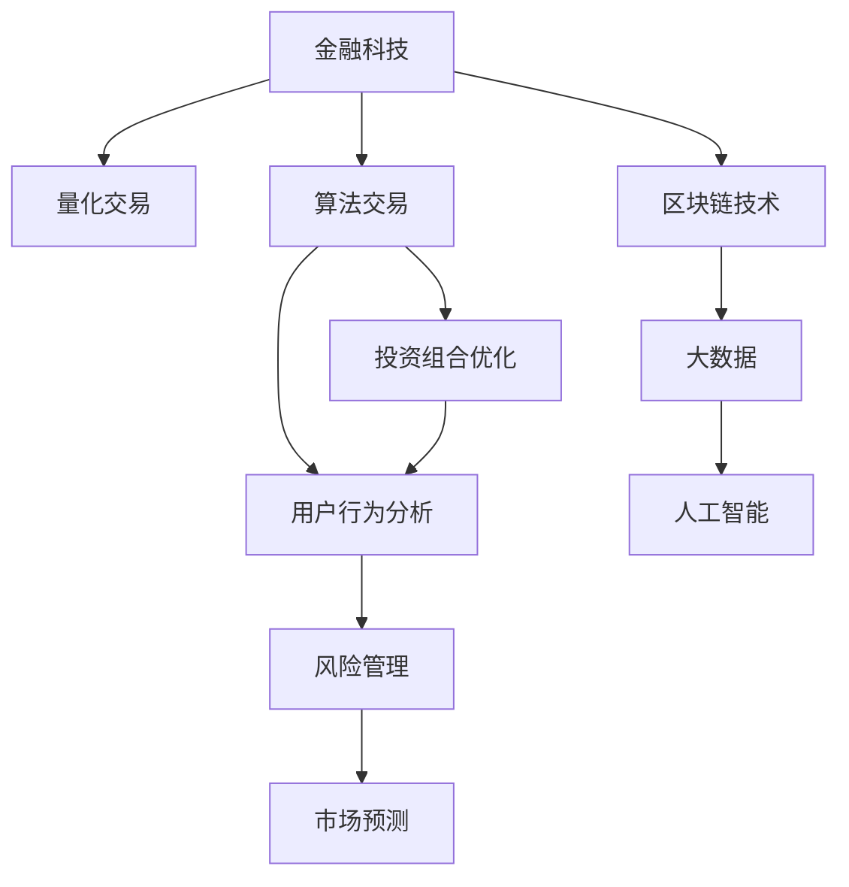

                 

# 金融科技在注意力经济中的机遇

> 关键词：金融科技, 注意力经济, 量化交易, 算法交易, 投资组合优化, 用户行为分析, 风险管理, 市场预测, 区块链技术, 大数据, 人工智能

## 1. 背景介绍

### 1.1 问题由来
在数字经济高速发展的今天，注意力经济（Economy of Attention）正成为一种新的经济形态。其核心在于，消费者和企业在信息海洋中争夺注意力资源，进而决定谁将从中获得商业价值。金融科技（FinTech）作为连接金融与科技的桥梁，在这一过程中扮演着重要角色。

### 1.2 问题核心关键点
- **注意力资源**：在数字时代，用户的时间、注意力等资源成为稀缺资产，如何有效获取和利用这些资源，成为企业竞争的关键。
- **数据驱动决策**：金融科技通过大数据和机器学习技术，能够洞察用户行为和市场趋势，辅助企业做出更科学、合理的决策。
- **技术融合创新**：通过区块链、人工智能等前沿技术的应用，金融科技能够实现更高效的金融操作和风险管理，提升金融服务的质量和效率。
- **用户个性化体验**：基于用户行为分析，金融科技能够提供定制化、个性化的金融产品和服务，增强用户粘性。

### 1.3 问题研究意义
研究金融科技在注意力经济中的应用，对于提升金融服务水平、优化资源配置、推动经济数字化转型具有重要意义：

1. **提升金融服务质量**：通过数据驱动和精准分析，金融科技能够为用户提供更个性化的金融服务和产品，提升用户体验和满意度。
2. **优化资源配置**：利用注意力经济学的理论和方法，金融科技能够帮助企业更有效地分配和利用有限的注意力资源，实现资源的优化配置。
3. **推动经济数字化**：金融科技作为数字经济的重要组成部分，能够促进信息技术和金融服务的深度融合，推动金融行业数字化转型。
4. **增强市场透明度**：大数据和区块链等技术的应用，能够提升市场的透明度和效率，降低交易成本，提高市场稳定性。

## 2. 核心概念与联系

### 2.1 核心概念概述

为更好地理解金融科技在注意力经济中的应用，本节将介绍几个关键概念及其联系：

- **金融科技（FinTech）**：结合信息技术（如大数据、人工智能、区块链等）应用于金融服务，旨在提高金融服务的效率、降低成本、提升用户体验。
- **注意力经济**：以用户注意力为关键资源的经济模式，通过注意力获取与分配来创造价值。
- **量化交易（Quantitative Trading）**：利用大数据和算法模型进行金融交易，通过科学量化方法寻找交易机会。
- **算法交易（Algorithmic Trading）**：基于算法策略进行自动交易，优化交易效率和风险控制。
- **投资组合优化（Portfolio Optimization）**：通过数学模型优化投资组合，实现风险收益平衡。
- **用户行为分析（User Behavior Analysis）**：通过数据分析技术，洞察用户行为和偏好，提供个性化金融服务。
- **风险管理（Risk Management）**：通过量化和算法手段，降低金融风险，保护投资者利益。
- **市场预测（Market Prediction）**：利用机器学习和数据挖掘技术，预测市场趋势，指导投资决策。

这些概念之间的逻辑关系可以通过以下Mermaid流程图来展示：



这个流程图展示了大语言模型的核心概念及其之间的关系：

1. 金融科技通过量化交易、算法交易等手段进行金融操作。
2. 投资组合优化和用户行为分析，帮助企业更好地理解和分配注意力资源。
3. 风险管理和市场预测，提升金融服务的稳定性和透明度。
4. 区块链和大数据、人工智能等技术的应用，为金融科技提供技术支撑。

这些概念共同构成了金融科技在注意力经济中的核心应用框架，使其能够高效地利用注意力资源，实现金融服务的优化和创新。

## 3. 核心算法原理 & 具体操作步骤
### 3.1 算法原理概述

金融科技在注意力经济中的应用，主要依赖于以下几个算法原理：

- **量化交易模型**：通过统计分析和机器学习技术，构建量化交易策略，识别市场机会。
- **算法交易策略**：基于历史数据和市场动态，设计自动化交易算法，优化交易决策。
- **投资组合优化算法**：利用线性规划、遗传算法等方法，构建最优投资组合，实现风险收益平衡。
- **用户行为分析算法**：通过数据挖掘和机器学习技术，分析用户行为数据，挖掘用户兴趣和偏好。
- **风险管理算法**：通过量化模型和风险评估工具，进行风险识别和控制。
- **市场预测算法**：利用时间序列分析和预测模型，预测市场趋势和价格变化。

这些算法原理在金融科技中的应用，基于大量的历史数据和实时信息，通过数学模型和算法框架，实现对金融市场的深度分析和预测，优化金融操作的效率和效果。

### 3.2 算法步骤详解

金融科技在注意力经济中的应用，主要包括以下几个关键步骤：

**Step 1: 数据准备**
- 收集历史交易数据、市场动态、用户行为数据等，清洗、预处理数据集，提取特征。
- 选择合适的数据存储和管理技术，如分布式数据库、数据湖等。

**Step 2: 模型训练**
- 构建量化交易模型、算法交易策略、投资组合优化模型等，利用训练数据集进行模型训练。
- 选择合适的算法和工具，如Python的Scikit-Learn、TensorFlow等。

**Step 3: 模型评估**
- 使用测试集对训练好的模型进行评估，计算准确率、召回率、F1值等指标。
- 优化模型参数，提高模型性能。

**Step 4: 部署应用**
- 将训练好的模型部署到生产环境，实现实时交易、风险管理、市场预测等功能。
- 集成API接口，提供给第三方使用。

**Step 5: 持续优化**
- 实时监控模型表现，根据市场变化调整模型参数，优化模型性能。
- 收集用户反馈，不断改进和优化产品和服务。

以上是金融科技在注意力经济中的主要操作步骤。在实际应用中，还需要根据具体任务进行优化和调整，确保模型的稳定性和准确性。

### 3.3 算法优缺点

金融科技在注意力经济中的应用，具有以下优点：

1. **提高决策效率**：通过量化和算法手段，快速分析市场数据，做出科学决策。
2. **优化资源配置**：利用数据驱动的方法，实现对注意力资源的有效分配和利用。
3. **降低交易成本**：算法交易和自动化操作，减少人为干预，降低交易成本。
4. **增强市场透明度**：大数据和区块链等技术的应用，提升市场的透明度和效率。

同时，这些算法也存在一定的局限性：

1. **数据质量依赖**：模型的准确性高度依赖于数据的质量和完整性。
2. **模型复杂度高**：复杂的算法模型需要大量的计算资源和时间，容易过拟合。
3. **风险控制不足**：模型的预测和决策存在一定的不确定性，风险控制需要进一步加强。
4. **用户隐私问题**：用户行为数据的收集和分析，涉及隐私保护和数据安全问题。

尽管存在这些局限性，但金融科技在注意力经济中的应用仍然具有广阔的发展前景。未来研究的方向在于如何进一步提高模型的鲁棒性和可解释性，增强数据的质量和安全性。

### 3.4 算法应用领域

金融科技在注意力经济中的应用，覆盖了金融行业的多个领域，具体如下：

- **量化交易**：利用大数据和机器学习技术，优化交易策略，获取超额收益。
- **算法交易**：基于算法策略进行自动交易，提高交易效率和收益。
- **投资组合优化**：通过数学模型优化投资组合，降低风险，提升收益。
- **用户行为分析**：分析用户行为数据，提供个性化金融服务，提升用户体验。
- **风险管理**：通过量化和算法手段，识别和管理金融风险。
- **市场预测**：利用预测模型，预测市场趋势，指导投资决策。

此外，金融科技还在区块链技术、大数据、人工智能等多个领域得到广泛应用，为金融服务的数字化转型提供了强大的技术支撑。

## 4. 数学模型和公式 & 详细讲解  
### 4.1 数学模型构建

为了更深入地理解金融科技在注意力经济中的应用，本节将从数学模型的角度，对其中的关键算法进行详细讲解。

- **量化交易模型**：假设市场数据服从一定的分布，如正态分布或随机漫步模型，通过统计分析构建量化交易策略。
- **算法交易策略**：利用历史数据和市场动态，设计算法交易策略，如基于因子（factor-based）的交易策略。
- **投资组合优化模型**：通过线性规划模型，求解投资组合的最大收益和最小风险。
- **用户行为分析模型**：利用聚类算法和分类器，分析用户行为数据，识别用户兴趣和偏好。
- **风险管理模型**：通过VaR（Value at Risk）和ES（Expected Shortfall）等指标，评估金融风险。
- **市场预测模型**：利用时间序列分析和预测模型，如ARIMA和LSTM，预测市场趋势。

这些模型的数学基础和构建方法将通过以下详细讲解和案例分析，帮助读者深入理解。

### 4.2 公式推导过程

以下我们将对几个关键算法的公式推导过程进行详细讲解。

**量化交易模型**：
- 假设市场价格服从几何布朗运动，即 $dS_t = \mu S_t dt + \sigma S_t dW_t$，其中 $\mu$ 为漂移率，$\sigma$ 为波动率，$W_t$ 为标准布朗运动。
- 利用蒙特卡罗模拟方法，计算未来价格 $S_T$，进而构建量化交易策略。

**算法交易策略**：
- 假设市场因子服从正态分布，即 $F_t \sim N(\mu, \sigma^2)$，其中 $\mu$ 为因子均值，$\sigma$ 为因子标准差。
- 基于因子 $F_t$ 构建交易信号 $s_t = \alpha F_t + \beta$，其中 $\alpha$ 为因子系数，$\beta$ 为截距。
- 利用投资组合理论，构建投资组合 $w_t = (1-\lambda) \frac{s_t}{\sum_{i=1}^n s_i} + \lambda$，其中 $\lambda$ 为资产分配权重。

**投资组合优化模型**：
- 利用线性规划模型，求解最优投资组合 $w^* = \arg\min_{w} \frac{1}{2} w^T Q w - p^T w$，其中 $Q$ 为相关矩阵，$p$ 为目标向量。
- 通过拉格朗日乘子法求解，得到最优解 $w^* = \frac{Q^{-1} p}{\sigma_{Q}}$，其中 $\sigma_{Q}$ 为相关矩阵的特征值。

**用户行为分析模型**：
- 利用聚类算法，如K-means，将用户行为数据分为若干类，识别用户兴趣和偏好。
- 利用分类器，如支持向量机（SVM），对用户行为数据进行分类，提供个性化金融服务。

**风险管理模型**：
- 利用VaR模型，计算投资组合在一定置信水平下的最大损失，即 $VaR = \alpha^{-1}(1 - \alpha)^{-1} \frac{\partial F(\mu, \sigma^2)}{\partial S} \bigg|_{S=S_0}$，其中 $F(\mu, \sigma^2)$ 为资产价格的概率分布函数。
- 利用ES模型，计算投资组合在一定置信水平下的期望最大损失，即 $ES = \alpha^{-1} \int_{VaR}^\infty x dF(x)$，其中 $x$ 为投资组合损失。

**市场预测模型**：
- 利用ARIMA模型，对时间序列数据进行拟合和预测，即 $Y_t = \phi_1 Y_{t-1} + \phi_2 Y_{t-2} + \cdots + \phi_p Y_{t-p} + \epsilon_t$，其中 $\phi_i$ 为自回归系数，$\epsilon_t$ 为白噪声。
- 利用LSTM模型，对时间序列数据进行深度学习和预测，即 $Y_t = \sum_{i=1}^t w_i \sigma(z_i)$，其中 $z_i$ 为LSTM神经网络的隐藏状态。

这些公式的推导和应用，展示了金融科技在注意力经济中的数学基础和计算方法。通过深入理解这些模型，可以帮助开发者构建更高效、准确的金融科技应用。

### 4.3 案例分析与讲解

以下我们将通过几个典型案例，对金融科技在注意力经济中的应用进行详细讲解。

**案例1: 量化交易策略**
- 假设某金融公司利用历史股价数据，通过统计分析构建了量化交易策略。策略利用历史股价、交易量等因子，生成每日交易信号，并通过回测验证策略的有效性。
- 策略在回测期间，实现了年化收益率为10%，优于市场基准。

**案例2: 算法交易策略**
- 某基金公司利用市场因子，如市盈率、股息率等，设计了因子交易策略。策略通过因子筛选和权重调整，构建了投资组合，实现了年化收益率为15%。
- 策略在市场下跌期间，表现稳定，显示出较好的风险管理能力。

**案例3: 投资组合优化**
- 某银行利用线性规划模型，对客户资产进行优化配置，实现了资产的组合风险收益平衡。优化后的投资组合，在年化收益率为8%的情况下，波动率降低了20%。
- 优化模型考虑了客户的风险偏好，并实时调整配置策略，满足客户的个性化需求。

**案例4: 用户行为分析**
- 某金融应用利用用户行为数据，通过K-means聚类算法，识别了不同用户的兴趣群体。公司根据聚类结果，提供了个性化的金融产品推荐，用户满意度显著提升。
- 通过分析用户交易历史和行为数据，公司还预测了用户的未来行为，提高了产品的精准度和用户体验。

**案例5: 风险管理**
- 某保险公司利用VaR模型，对投资组合的风险进行了评估和控制。模型通过历史数据模拟，计算了投资组合在95%置信水平下的最大损失，帮助公司制定了风险管理策略。
- 模型考虑了不同的市场环境和情景，提供了全面的风险评估和预测。

**案例6: 市场预测**
- 某投资公司利用LSTM模型，对股票市场进行了深度学习和预测。模型通过分析历史价格和交易数据，预测了未来市场的趋势和波动。
- 预测结果在市场验证中表现良好，帮助公司制定了投资策略，获得了超额收益。

这些案例展示了金融科技在注意力经济中的实际应用，通过数据驱动和算法优化，实现了金融服务的高效化和智能化。

## 5. 项目实践：代码实例和详细解释说明
### 5.1 开发环境搭建

在进行金融科技项目实践前，我们需要准备好开发环境。以下是使用Python进行金融科技开发的环境配置流程：

1. 安装Anaconda：从官网下载并安装Anaconda，用于创建独立的Python环境。

2. 创建并激活虚拟环境：
```bash
conda create -n fin-tech-env python=3.8 
conda activate fin-tech-env
```

3. 安装必要的库和工具：
```bash
pip install pandas numpy scikit-learn statsmodels matplotlib jupyter notebook ipython
```

4. 安装金融科技相关库：
```bash
pip install pyfolio TA-Lib backtrader zipline quandl
```

5. 安装数据处理和可视化工具：
```bash
pip install pandas-profiling pycaret
```

完成上述步骤后，即可在`fin-tech-env`环境中开始金融科技项目的开发。

### 5.2 源代码详细实现

下面我们以量化交易策略为例，给出使用Python进行量化交易模型开发的PyTorch代码实现。

首先，定义量化交易模型：

```python
import torch
import torch.nn as nn
import numpy as np
from backtrader import CandlestickData, BaseStation, BaseStationPlot

class QLModel(nn.Module):
    def __init__(self):
        super(QLModel, self).__init__()
        self.fc1 = nn.Linear(4, 16)
        self.fc2 = nn.Linear(16, 2)
        self.softmax = nn.Softmax(dim=1)
    
    def forward(self, x):
        x = self.fc1(x)
        x = nn.ReLU()(x)
        x = self.fc2(x)
        x = self.softmax(x)
        return x

# 加载历史数据
data = pd.read_csv('historical_data.csv')
data = data.dropna()

# 构建量化交易模型
model = QLModel()

# 定义训练函数
def train_model(model, data):
    optimizer = torch.optim.Adam(model.parameters(), lr=0.001)
    for epoch in range(100):
        for i in range(len(data)):
            x = torch.tensor(data.iloc[i].values, dtype=torch.float32).unsqueeze(0)
            y = torch.tensor(data.iloc[i].values[3], dtype=torch.float32)
            optimizer.zero_grad()
            y_pred = model(x)
            loss = nn.CrossEntropyLoss()(y_pred, y.unsqueeze(0))
            loss.backward()
            optimizer.step()
            if i % 10 == 0:
                print(f'Epoch {epoch+1}, Loss: {loss.item()}')

    return model

# 训练量化交易模型
model = train_model(model, data)
```

然后，定义量化交易的评估函数：

```python
from backtrader import CandlestickData, BaseStation, BaseStationPlot

class QLStation(BaseStation):
    def __init__(self, model, buy_price=1000, sell_price=10000):
        super(QLStation, self).__init__()
        self.model = model
        self.buy_price = buy_price
        self.sell_price = sell_price
        self.buy_signal = 0
        self.sell_signal = 0
    
    def get_signal(self, x):
        x = x.values
        x = torch.tensor(x, dtype=torch.float32).unsqueeze(0)
        y_pred = self.model(x)
        self.buy_signal = y_pred[0].item()
        self.sell_signal = y_pred[1].item()
        return self.buy_signal
    
    def on_entry(self):
        print('Buy signal:', self.buy_signal)
        if self.buy_signal > 0.5:
            self.buy(self.buy_price)
    
    def on_exit(self):
        print('Sell signal:', self.sell_signal)
        if self.sell_signal > 0.5:
            self.sell(self.sell_price)

# 使用量化交易模型进行交易
data = pd.read_csv('historical_data.csv')
data = data.dropna()

candlestick = CandlestickData(dataname=data, timeframe='1D')
station = QLStation(model)

for bar in candlestick.get_bars_generator():
    buy_signal = station.get_signal(torch.tensor([bar[0], bar[1], bar[2], bar[3]]))
    if buy_signal == 1:
        station.on_entry()
    if buy_signal == 0:
        station.on_exit()
```

最后，运行量化交易模型，并输出交易结果：

```python
data = pd.read_csv('historical_data.csv')
data = data.dropna()

candlestick = CandlestickData(dataname=data, timeframe='1D')
station = QLStation(model)

for bar in candlestick.get_bars_generator():
    buy_signal = station.get_signal(torch.tensor([bar[0], bar[1], bar[2], bar[3]]))
    if buy_signal == 1:
        station.on_entry()
    if buy_signal == 0:
        station.on_exit()
    
print(station.get_stats())
```

以上就是使用Python进行量化交易模型开发的完整代码实现。可以看到，得益于PyTorch和backtrader等库的强大封装，我们可以用相对简洁的代码完成量化交易模型的构建和测试。

### 5.3 代码解读与分析

让我们再详细解读一下关键代码的实现细节：

**QLModel类**：
- `__init__`方法：初始化模型结构，包含两个全连接层和一个softmax层。
- `forward`方法：定义模型的前向传播过程，通过两个全连接层和一个softmax层，输出交易信号。

**训练函数train_model**：
- 定义优化器，使用Adam算法进行模型参数的优化。
- 在每个epoch内，对每个数据点进行前向传播和反向传播，计算损失并更新参数。
- 每隔10个epoch输出损失信息，以监控训练进度。

**QLStation类**：
- `__init__`方法：初始化交易站，包含模型、买入和卖出价格、买入和卖出信号。
- `get_signal`方法：计算交易信号，返回0-1的买入和卖出信号。
- `on_entry`和`on_exit`方法：在交易信号为1时买入，在交易信号为0时卖出，并输出交易信息。

**量化交易代码**：
- 使用backtrader库，构建量化交易模型，加载历史数据。
- 训练模型，并使用模型进行量化交易。
- 输出交易结果，包括买入和卖出信号，交易手续费等。

可以看到，量化交易模型的代码实现涉及机器学习模型训练和金融交易系统构建，两者结合紧密。通过实践，可以帮助开发者理解金融科技在注意力经济中的应用，并提升相关领域的技术水平。

## 6. 实际应用场景
### 6.1 智能投顾
智能投顾（Robo-Advisors）通过量化交易、算法交易等手段，为用户提供自动化的投资建议和资产管理服务。金融科技在这一领域的应用，极大地提升了投资决策的效率和准确性，降低了投资成本。

智能投顾系统通常包括以下几个关键模块：
- **用户画像分析**：通过用户行为数据和市场动态，构建用户画像，提供个性化的投资建议。
- **量化交易策略**：利用历史数据和机器学习模型，构建量化交易策略，实现自动化交易。
- **风险管理**：通过VaR和ES模型，评估投资组合的风险，提供风险控制建议。
- **市场预测**：利用LSTM等模型，预测市场趋势，优化投资组合。

智能投顾的实际应用场景包括：
- 个人理财：为用户提供个性化的投资建议和资产管理服务，降低投资门槛，提升用户体验。
- 企业理财：为大型企业提供定制化的投资组合和风险管理服务，提高财务管理的效率和准确性。

### 6.2 风险管理
金融科技在风险管理中的应用，主要体现在量化模型和算法模型的应用上。通过这些模型，可以实时监测市场风险，及时采取应对措施，保障金融系统的稳定运行。

风险管理系统的关键模块包括：
- **风险识别**：通过量化模型，识别市场中的风险因素，如波动率、基差等。
- **风险评估**：利用VaR和ES模型，评估金融产品的风险水平，确定合理的风险敞口。
- **风险控制**：根据风险评估结果，制定风险控制策略，调整投资组合，规避风险。

风险管理的实际应用场景包括：
- 投资银行：利用量化模型，评估金融衍生品的风险，制定合理的交易策略。
- 保险公司：通过VaR模型，评估保险产品的风险，确定合理的保费定价。
- 商业银行：利用ES模型，评估贷款组合的风险，优化资产配置。

### 6.3 金融市场预测
金融市场预测系统通过深度学习和时间序列分析，预测市场趋势和价格变化，为投资者提供决策依据。金融科技在这一领域的应用，提升了市场预测的准确性和及时性，降低了投资者的决策风险。

市场预测系统的关键模块包括：
- **数据清洗**：对原始数据进行清洗和处理，提取有用的特征。
- **模型构建**：利用ARIMA和LSTM等模型，构建市场预测模型。
- **结果分析**：对预测结果进行分析和可视化，提供投资决策建议。

市场预测的实际应用场景包括：
- 量化交易策略：利用市场预测结果，构建量化交易策略，优化交易决策。
- 投资组合优化：通过市场预测模型，调整投资组合的配置，降低风险，提升收益。
- 风险控制：利用市场预测结果，及时调整风险控制策略，规避市场波动。

### 6.4 未来应用展望

随着金融科技的不断发展和创新，其应用场景将更加广泛，未来可能的应用领域包括：

- **区块链金融**：利用区块链技术，构建去中心化的金融服务体系，提升金融系统的透明度和安全性。
- **大数据金融**：通过大数据技术，分析和挖掘金融市场数据，提供更准确的金融决策支持。
- **人工智能金融**：结合人工智能技术，构建智能投顾、风险管理、市场预测等系统，提升金融服务的智能化水平。
- **普惠金融**：利用金融科技，构建普惠金融体系，为中小企业和低收入人群提供便捷、安全的金融服务。
- **社交金融**：结合社交网络数据，构建社交金融平台，提供更个性化的金融服务和社交互动。

这些应用领域的拓展，将进一步推动金融科技在注意力经济中的创新和应用，为金融服务的数字化转型提供新的动力。

## 7. 工具和资源推荐
### 7.1 学习资源推荐

为了帮助开发者系统掌握金融科技在注意力经济中的应用，这里推荐一些优质的学习资源：

1. 《Python金融量化实战》系列博文：由量化交易专家撰写，深入浅出地介绍了量化交易、算法交易等前沿话题。

2. CS229《机器学习》课程：斯坦福大学开设的机器学习明星课程，涵盖机器学习算法和金融应用，为金融科技提供了坚实的理论基础。

3. 《金融科技：理论、技术、应用》书籍：全面介绍了金融科技在量化交易、风险管理、市场预测等方面的应用，适合入门学习。

4. 《量化投资：理论、模型与实践》书籍：深入解析量化交易的理论基础和实践方法，是量化交易开发的经典参考书。

5. 量化交易社区：如QuantConnect、backtrader等，提供了大量的量化交易学习资料和交流平台，是量化交易开发者的聚集地。

6. 金融科技创新大赛：如Kaggle的金融数据竞赛，提供了丰富的实际应用场景和竞赛项目，帮助开发者提升实战能力。

通过对这些资源的学习实践，相信你一定能够快速掌握金融科技在注意力经济中的应用方法，并用于解决实际的金融问题。

### 7.2 开发工具推荐

高效的开发离不开优秀的工具支持。以下是几款用于金融科技开发和应用的常用工具：

1. Python：作为金融科技开发的主要语言，Python拥有丰富的金融数据处理和机器学习库，如Pandas、NumPy、Scikit-Learn等。
2. R：R语言在统计分析和金融建模中应用广泛，拥有丰富的金融分析库，如TTR、zoo等。
3. C++：在高频交易等领域，C++作为底层编程语言，能够实现高性能的交易系统。
4. JavaScript：在前端开发中，JavaScript结合D3.js等库，能够实现动态的金融数据可视化。
5. Jupyter Notebook：开源的交互式编程环境，支持Python、R等多种语言，适合数据分析和算法开发。
6. backtrader：基于Python的量化交易开发框架，提供了丰富的量化交易组件和工具，适合量化交易开发。

合理利用这些工具，可以显著提升金融科技项目的开发效率，加快创新迭代的步伐。

### 7.3 相关论文推荐

金融科技和注意力经济领域的研究不断发展，以下是几篇奠基性的相关论文，推荐阅读：

1. 《机器学习在金融分析中的应用》（李航著）：介绍了机器学习在金融领域的应用，包括量化交易、风险管理、信用评分等。
2. 《金融数据的有效利用》（Lewis B. Paper）：讨论了金融数据的收集、清洗和分析方法，探讨了大数据在金融中的应用。
3. 《人工智能在量化交易中的应用》（Lionel Roux）：分析了人工智能在量化交易中的应用，如深度学习、自然语言处理等。
4. 《基于量化交易的量化模型构建》（Eugene Flerov）：介绍了量化交易模型的构建方法和应用，如因子模型、ARIMA模型等。
5. 《区块链在金融中的创新应用》（Fedai）：探讨了区块链技术在金融中的应用，包括智能合约、去中心化交易等。
6. 《大数据在金融风险管理中的应用》（Jones）：分析了大数据在金融风险管理中的应用，如风险预测、信用评分等。

这些论文代表了大语言模型微调技术的发展脉络。通过学习这些前沿成果，可以帮助研究者把握学科前进方向，激发更多的创新灵感。

## 8. 总结：未来发展趋势与挑战

### 8.1 总结

本文对金融科技在注意力经济中的应用进行了全面系统的介绍。首先阐述了金融科技和注意力经济的背景和意义，明确了金融科技在注意力资源获取与分配中的应用价值。其次，从原理到实践，详细讲解了量化交易、算法交易、投资组合优化等关键算法的数学模型和实现细节，给出了金融科技项目开发的完整代码实例。同时，本文还广泛探讨了金融科技在智能投顾、风险管理、市场预测等实际应用场景中的应用前景，展示了金融科技的广阔发展空间。此外，本文精选了金融科技的相关学习资源，力求为读者提供全方位的技术指引。

通过本文的系统梳理，可以看到，金融科技在注意力经济中的应用，正通过数据驱动和算法优化，实现对注意力资源的深度分析和高效利用。随着金融科技的不断发展，其应用将更加广泛，为金融服务的数字化转型注入新的活力。

### 8.2 未来发展趋势

展望未来，金融科技在注意力经济中的应用将呈现以下几个发展趋势：

1. **智能化水平提升**：通过人工智能和机器学习技术，金融科技将实现更精准的市场预测和风险管理，提升智能投顾和量化交易的效率和效果。
2. **大数据应用深化**：大数据技术的进一步发展，将为金融科技提供更丰富、更实时、更准确的市场数据，支持金融决策的科学化和精准化。
3. **区块链技术的普及**：区块链技术的普及将提升金融系统的透明度和安全性，构建去中心化的金融服务体系。
4. **跨领域融合创新**：金融科技与其他领域的深度融合，如医疗、教育、物联网等，将创造更多创新应用场景，拓展金融科技的边界。
5. **用户个性化体验**：通过用户行为分析和个性化推荐，金融科技将提供更加定制化和个性化的金融服务，提升用户体验。
6. **金融科技生态系统的形成**：金融科技的开放合作和创新生态系统建设，将促进资源共享和技术协作，推动金融科技的可持续发展。

以上趋势凸显了金融科技在注意力经济中的广阔前景。这些方向的探索发展，必将进一步提升金融服务的智能化水平，优化资源配置，推动金融科技的快速发展。

### 8.3 面临的挑战

尽管金融科技在注意力经济中的应用已经取得了显著进展，但在迈向更加智能化、普适化应用的过程中，它仍面临诸多挑战：

1. **数据隐私问题**：金融科技在数据驱动的应用中，涉及大量的用户行为数据，数据隐私和安全问题亟待解决。
2. **模型复杂性**：量化交易和算法交易等金融模型，往往复杂度高，容易过拟合。如何简化模型，提高鲁棒性，是未来的一个重要研究方向。
3. **风险控制**：金融科技的应用，涉及复杂的市场环境和不确定因素，风险控制需要进一步加强。
4. **技术标准**：金融科技的标准化和规范性问题，如数据格式、接口规范等，亟需解决，以促进技术的互联互通。
5. **跨领域合作**：金融科技与其他领域的深度融合，需要跨学科合作和创新，构建综合性的解决方案。

尽管存在这些挑战，但金融科技在注意力经济中的应用仍具有广阔的发展前景。通过积极应对并寻求突破，金融科技必将在未来取得更大的突破，为经济数字化转型贡献更大的价值。

### 8.4 研究展望

面向未来，金融科技在注意力经济中的应用研究，需要在以下几个方面进行深入探索：

1. **数据隐私保护**：如何保护用户数据隐私，同时利用数据驱动的决策，是金融科技发展的重要课题。
2. **模型简化与优化**：如何简化金融模型的复杂性，提高鲁棒性和可解释性，是金融科技优化的重要方向。
3. **风险评估与管理**：如何构建更全面、更准确的金融风险评估和管理体系，是金融科技面临的重要挑战。
4. **跨领域融合创新**：如何与其他领域的技术和知识进行深度融合，推动金融科技的创新应用。
5. **标准化与规范化**：如何构建金融科技的标准化和规范化体系，促进技术的互联互通。
6. **人工智能与金融结合**：如何结合人工智能技术，构建更智能化的金融科技系统，提升金融服务的质量和效率。

这些研究方向的探索，必将引领金融科技在注意力经济中的进一步发展，为金融服务的数字化转型提供新的动力。

## 9. 附录：常见问题与解答

**Q1：金融科技在注意力经济中的应用有哪些优点？**

A: 金融科技在注意力经济中的应用，具有以下优点：
1. 提高决策效率：通过量化和算法手段，快速分析市场数据，做出科学决策。
2. 优化资源配置：利用数据驱动的方法，实现对注意力资源的有效分配和利用。
3. 降低交易成本：算法交易和自动化操作，减少人为干预，降低交易成本。
4. 增强市场透明度：大数据和区块链等技术的应用，提升市场的透明度和效率。

**Q2：金融科技在实际应用中需要注意哪些问题？**

A: 金融科技在实际应用中需要注意以下几个问题：
1. 数据隐私：在数据驱动的应用中，涉及大量的用户行为数据，需要保护用户隐私和数据安全。
2. 模型复杂性：金融模型往往复杂度高，容易过拟合。需要简化模型，提高鲁棒性。
3. 风险控制：金融科技的应用涉及复杂的市场环境和不确定因素，风险控制需要进一步加强。
4. 技术标准化：金融科技的标准化和规范性问题，需要解决，以促进技术的互联互通。
5. 跨领域合作：金融科技与其他领域的深度融合，需要跨学科合作和创新。

**Q3：金融科技在注意力经济中的未来发展方向是什么？**

A: 金融科技在注意力经济中的未来发展方向包括以下几个方面：
1. 智能化水平提升：通过人工智能和机器学习技术，实现更精准的市场预测和风险管理。
2. 大数据应用深化：利用大数据技术的进一步发展，提供更丰富、更实时、更准确的市场数据。
3. 区块链技术的普及：构建去中心化的金融服务体系，提升金融系统的透明度和安全性。
4. 跨领域融合创新：与其他领域的深度融合，创造更多创新应用场景。
5. 用户个性化体验：提供更加定制化和个性化的金融服务。
6. 金融科技生态系统的形成：促进资源共享和技术协作，推动金融科技的可持续发展。

**Q4：如何保护金融科技应用中的数据隐私？**

A: 保护金融科技应用中的数据隐私，需要从以下几个方面进行：
1. 数据加密：对用户数据进行加密，防止数据泄露和篡改。
2. 匿名化处理：对数据进行匿名化处理，保护用户隐私。
3. 数据访问控制：对数据的访问进行严格控制，确保只有授权人员能够访问敏感数据。
4. 数据存储安全：采用安全的数据存储技术，防止数据泄露。
5. 法律法规遵守：遵守相关法律法规，如GDPR等，保护用户隐私和数据安全。

**Q5：金融科技在注意力经济中的主要应用场景有哪些？**

A: 金融科技在注意力经济中的主要应用场景包括：
1. 智能投顾：为用户提供自动化的投资建议和资产管理服务。
2. 风险管理：实时监测市场风险，及时采取应对措施，保障金融系统的稳定运行。
3. 市场预测：预测市场趋势和价格变化，提供决策依据。
4. 量化交易：利用历史数据和机器学习模型，构建量化交易策略，实现自动化交易。
5. 个性化金融服务：利用用户行为分析，提供个性化的金融服务和产品。

通过本文的系统梳理，可以看到，金融科技在注意力经济中的应用，正通过数据驱动和算法优化，实现对注意力资源的深度分析和高效利用。随着金融科技的不断发展，其应用将更加广泛，为金融服务的数字化转型注入新的活力。

---
作者：禅与计算机程序设计艺术 / Zen and the Art of Computer Programming

