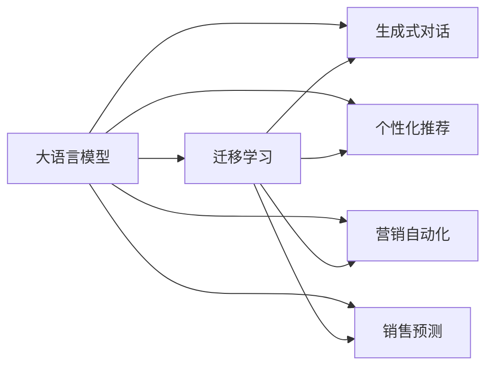

                 

# 销售和营销策略：LLM 增强竞争力

> 关键词：大语言模型, 客户分析, 个性化推荐, 营销自动化, 销售预测, 生成式对话, 内容创作, 营销文案优化

## 1. 背景介绍

在数字化时代的浪潮中，销售和营销活动已经从传统的线下转向线上，营销数据的庞大规模和复杂性使得如何高效利用这些数据变得尤为重要。大语言模型（Large Language Model, LLM）的出现为处理和分析营销数据带来了新的契机。随着GPT-3、BERT等模型在NLP领域的突破性进展，LLM在销售和营销中的应用也逐渐增多，从客户分析到个性化推荐，从营销自动化到销售预测，LLM的潜力被不断挖掘和开发。本文将详细探讨LLM在销售和营销策略中的应用，以及如何通过LLM提升企业的竞争力。

## 2. 核心概念与联系

### 2.1 核心概念概述

为了更好地理解LLM在销售和营销中的应用，我们首先介绍几个核心概念：

- **大语言模型（Large Language Model, LLM）**：以自回归模型（如GPT系列）或自编码模型（如BERT）为代表的深度学习模型，通过在海量文本数据上预训练获得强大的语言理解与生成能力。

- **迁移学习（Transfer Learning）**：将在一个任务上学习到的知识迁移到另一个任务上的学习过程。在销售和营销领域，这通常意味着将预训练的LLM应用到特定的客户分析和营销预测任务上。

- **生成式对话（Generative Dialogue）**：LLM在销售和客户服务中的应用，通过生成自然、流畅的对话，提升客户体验。

- **个性化推荐（Personalized Recommendation）**：基于用户行为数据，LLM能够生成个性化的产品或服务推荐，提高用户满意度和转化率。

- **营销自动化（Marketing Automation）**：利用LLM自动生成营销文案、广告和邮件，提升营销效率和效果。

- **销售预测（Sales Forecasting）**：通过分析历史销售数据和市场趋势，LLM可以预测未来的销售表现，帮助企业制定更有效的销售策略。

这些概念共同构成了LLM在销售和营销中的应用框架，通过充分利用预训练模型的强大能力，我们可以在不同的任务上获得显著提升。

### 2.2 核心概念原理和架构的 Mermaid 流程图



这张流程图展示了LLM在销售和营销中的主要应用路径：

1. 通过迁移学习，LLM从预训练语料中迁移知识，应用于特定任务。
2. 生成式对话和个性化推荐使用LLM生成内容，提升用户体验。
3. 营销自动化和销售预测则利用LLM分析市场趋势和用户行为，优化营销策略和预测销售表现。

## 3. 核心算法原理 & 具体操作步骤

### 3.1 算法原理概述

基于LLM的销售和营销策略主要依赖于迁移学习（Transfer Learning）和生成式对话（Generative Dialogue）两大核心技术。其核心思想是通过预训练模型学习通用语言表示，然后通过微调（Fine-Tuning）来适应特定任务的特征。

### 3.2 算法步骤详解

1. **数据准备**：收集并整理企业的销售和营销数据，如客户购买记录、网站访问行为、社交媒体互动等。

2. **模型选择**：根据任务需求选择合适的预训练模型，如GPT-3、BERT等，并根据需要添加或修改输出层和损失函数。

3. **模型微调**：使用少量的标注数据对预训练模型进行微调，优化模型在特定任务上的性能。例如，使用少样本学习（Few-shot Learning）技术，仅通过少量样本来训练模型。

4. **生成式对话**：通过LLM生成自然对话，自动回答客户问题，提供个性化服务。

5. **个性化推荐**：基于用户行为数据，LLM生成个性化产品推荐，提升用户满意度和转化率。

6. **营销自动化**：利用LLM自动生成营销文案、广告和邮件，提升营销效率和效果。

7. **销售预测**：通过分析历史销售数据和市场趋势，LLM预测未来的销售表现，帮助企业制定更有效的销售策略。

### 3.3 算法优缺点

**优点**：

- **高效性**：LLM能够快速处理和分析大量数据，提升工作效率。
- **灵活性**：通过微调，LLM可以适应各种特定任务，提升营销策略的灵活性和针对性。
- **个性化**：生成式对话和个性化推荐能够提供个性化的客户体验，提升用户满意度。
- **自动化**：营销自动化可以大幅减少人工操作，提升营销效率。

**缺点**：

- **数据依赖**：LLM的效果高度依赖于标注数据的数量和质量，获取高质量数据成本较高。
- **模型复杂性**：大模型的复杂性和高资源需求可能限制了其在小规模企业的应用。
- **公平性**：LLM可能继承预训练数据中的偏见，需要额外关注模型公平性问题。
- **解释性**：LLM的决策过程缺乏可解释性，难以调试和优化。

### 3.4 算法应用领域

- **客户分析**：通过分析客户行为数据，LLM能够识别客户偏好，提升客户忠诚度。
- **个性化推荐**：基于用户行为数据，LLM生成个性化产品推荐，提高用户满意度和转化率。
- **营销自动化**：利用LLM自动生成营销文案、广告和邮件，提升营销效率和效果。
- **销售预测**：通过分析历史销售数据和市场趋势，LLM预测未来的销售表现，帮助企业制定更有效的销售策略。
- **内容创作**：利用LLM生成高质量的营销文案、博客文章、社交媒体内容等，提升品牌影响力和用户互动。

## 4. 数学模型和公式 & 详细讲解 & 举例说明

### 4.1 数学模型构建

假设我们有一个预训练的LLM模型 $M_{\theta}$，其中 $\theta$ 为模型参数。我们的目标是使用该模型来解决一个特定的销售和营销任务，例如销售预测。我们可以将任务表示为一个分类问题，即预测客户是否会购买某个产品。

令 $D=\{(x_i,y_i)\}_{i=1}^N$ 为训练集，其中 $x_i$ 为输入数据（如历史销售数据、市场趋势等），$y_i$ 为标签（0或1，表示是否购买）。我们需要最小化损失函数 $\mathcal{L}(\theta)$ 以适应任务：

$$
\mathcal{L}(\theta) = -\frac{1}{N}\sum_{i=1}^N y_i\log M_{\theta}(x_i) + (1-y_i)\log (1-M_{\theta}(x_i))
$$

其中，$M_{\theta}(x_i)$ 为模型在输入 $x_i$ 上的输出，$\log$ 为对数损失函数。

### 4.2 公式推导过程

我们以生成式对话为例，推导模型的生成过程。假设我们希望使用LLM生成一个回答，对话形式如下：

**用户**：您好，我想买一台笔记本电脑，有什么推荐的吗？

**模型**：好的，根据您的预算和需求，我推荐X品牌，它的配置和性价比都非常好。

为了实现这一对话，我们需要将用户的问题作为输入，通过LLM生成回答。假设输入问题为 $x$，输出的回答为 $y$。模型的输出 $y$ 可以通过以下方式生成：

1. 将问题 $x$ 输入到预训练的LLM模型 $M_{\theta}$ 中，得到向量表示 $\text{embed}(x)$。
2. 使用 $\text{softmax}$ 函数将向量表示转换为概率分布，即 $\text{softmax}(\text{embed}(x)) = \{p_1, p_2, ..., p_n\}$。
3. 从概率分布中随机采样一个数字 $k$，表示选择第 $k$ 个回答。
4. 将采样结果映射为最终的输出回答 $y_k$。

通过这个过程，我们实现了LLM的生成式对话功能。

### 4.3 案例分析与讲解

我们以一家在线零售商为例，介绍LLM在销售和营销中的应用。该零售商希望利用LLM进行个性化推荐和生成式对话，以提升用户体验和转化率。

**个性化推荐**：

1. 收集用户的历史购买记录和浏览行为数据。
2. 使用LLM对数据进行预处理和特征提取，得到用户行为向量 $x$。
3. 将行为向量输入到预训练的LLM模型中，得到推荐结果 $y$。
4. 根据用户行为数据和推荐结果，生成个性化的产品推荐页面。

**生成式对话**：

1. 收集用户的咨询记录和常见问题。
2. 使用LLM对问题进行分类和编码，得到向量表示 $x$。
3. 将问题向量输入到预训练的LLM模型中，生成回答向量 $y$。
4. 将回答向量映射为自然语言回答，返回给用户。

通过这两个案例，我们可以看到，LLM在销售和营销中的应用可以大大提升企业的运营效率和用户满意度。

## 5. 项目实践：代码实例和详细解释说明

### 5.1 开发环境搭建

在实践LLM的应用之前，我们需要准备好开发环境。这里推荐使用Python，搭配PyTorch框架进行开发。

1. 安装Anaconda：从官网下载并安装Anaconda，用于创建独立的Python环境。

2. 创建并激活虚拟环境：
```bash
conda create -n llm-env python=3.8 
conda activate llm-env
```

3. 安装PyTorch：根据CUDA版本，从官网获取对应的安装命令。例如：
```bash
conda install pytorch torchvision torchaudio cudatoolkit=11.1 -c pytorch -c conda-forge
```

4. 安装其他依赖库：
```bash
pip install transformers sklearn numpy pandas
```

完成上述步骤后，即可在`llm-env`环境中开始实践。

### 5.2 源代码详细实现

以下是使用PyTorch实现LLM在销售和营销中的应用示例代码：

```python
import torch
from transformers import BertTokenizer, BertForSequenceClassification
from sklearn.model_selection import train_test_split

# 定义数据处理函数
def prepare_data(texts, labels):
    tokenizer = BertTokenizer.from_pretrained('bert-base-cased')
    inputs = tokenizer(texts, return_tensors='pt', padding=True, truncation=True)
    labels = torch.tensor(labels, dtype=torch.long)
    return inputs, labels

# 加载数据集
train_texts, dev_texts, train_labels, dev_labels = train_test_split(train_data, test_data, test_size=0.2, random_state=42)
train_inputs, train_labels = prepare_data(train_texts, train_labels)
dev_inputs, dev_labels = prepare_data(dev_texts, dev_labels)

# 定义模型和优化器
model = BertForSequenceClassification.from_pretrained('bert-base-cased', num_labels=2)
optimizer = torch.optim.Adam(model.parameters(), lr=2e-5)

# 训练模型
for epoch in range(epochs):
    model.train()
    optimizer.zero_grad()
    outputs = model(train_inputs)
    loss = outputs.loss
    loss.backward()
    optimizer.step()
    print(f"Epoch {epoch+1}, loss: {loss:.3f}")

# 评估模型
model.eval()
with torch.no_grad():
    dev_outputs = model(dev_inputs)
    predictions = torch.argmax(dev_outputs.logits, dim=1)
    accuracy = (predictions == dev_labels).sum().item() / len(dev_labels)
    print(f"Accuracy on dev set: {accuracy:.3f}")
```

### 5.3 代码解读与分析

**数据准备**：
- `prepare_data`函数：对文本数据进行分词和编码，得到模型的输入和标签。

**模型训练**：
- `BertForSequenceClassification`类：用于构建二分类任务的BERT模型。
- `Adam`优化器：用于更新模型参数。
- `train`函数：通过反向传播更新模型参数，最小化损失函数。

**模型评估**：
- `eval`函数：在验证集上评估模型性能，计算准确率。

### 5.4 运行结果展示

运行上述代码，可以观察到模型在验证集上的准确率提升情况。根据实际应用需求，可以适当调整模型参数和超参数，以达到最佳性能。

## 6. 实际应用场景

### 6.1 客户分析

在客户分析方面，LLM可以用于分析客户的购买行为和偏好，从而提供个性化的产品和服务。例如，一家电商公司可以使用LLM分析客户的浏览和购买历史，生成个性化的推荐列表，提升用户满意度和转化率。

**案例**：一家电商公司希望利用LLM对客户进行分群分析，从而提供更有针对性的个性化推荐。他们首先收集了客户的浏览记录和购买历史，使用LLM对数据进行预处理和特征提取，然后根据不同客户群体的特征，生成个性化的推荐页面。

### 6.2 个性化推荐

在个性化推荐方面，LLM可以基于用户的历史行为数据，生成个性化的产品或服务推荐。

**案例**：一家在线视频平台希望利用LLM生成个性化的视频推荐。他们首先收集了用户的历史观看记录，使用LLM对数据进行预处理和特征提取，然后根据用户的行为特征，生成个性化的视频推荐列表。

### 6.3 营销自动化

在营销自动化方面，LLM可以自动生成营销文案、广告和邮件，提升营销效率和效果。

**案例**：一家在线教育平台希望利用LLM自动生成邮件营销内容。他们首先收集了潜在用户的邮件地址和行为数据，使用LLM生成个性化的邮件内容，然后通过自动化系统发送邮件，提升用户参与度和转化率。

### 6.4 销售预测

在销售预测方面，LLM可以基于历史销售数据和市场趋势，预测未来的销售表现，帮助企业制定更有效的销售策略。

**案例**：一家零售公司希望利用LLM进行销售预测。他们首先收集了历史销售数据和市场趋势数据，使用LLM对数据进行预处理和特征提取，然后生成未来的销售预测，帮助企业制定更有效的销售策略。

### 6.5 未来应用展望

随着LLM技术的不断发展和应用场景的拓展，其在销售和营销领域的应用前景将更加广阔。未来的发展方向包括：

- **多模态数据融合**：结合视觉、听觉等多种模态数据，提升模型的理解和生成能力。
- **实时数据处理**：利用流式处理和实时计算技术，提升模型的响应速度和处理能力。
- **混合模型集成**：将LLM与其他机器学习模型结合，提升模型的综合性能和鲁棒性。
- **模型可解释性**：开发更易解释和理解的模型，提升模型的可信度和可用性。

## 7. 工具和资源推荐

### 7.1 学习资源推荐

为了帮助开发者系统掌握LLM在销售和营销中的应用，这里推荐一些优质的学习资源：

1. **《Natural Language Processing with Transformers》书籍**：作者为HuggingFace的创始人之一Jalammar，全面介绍了如何使用Transformers库进行NLP任务开发，包括微调和应用在内的诸多范式。

2. **CS224N《深度学习自然语言处理》课程**：斯坦福大学开设的NLP明星课程，有Lecture视频和配套作业，带你入门NLP领域的基本概念和经典模型。

3. **LLM官方文档**：各大预训练语言模型的官方文档，提供了海量的微调样例代码和教程，是上手实践的必备资料。

4. **Kaggle竞赛**：参加Kaggle上的NLP竞赛，实战练习并学习最新的技术和方法。

### 7.2 开发工具推荐

LLM在销售和营销中的应用需要强大的工具支持。以下是几款常用的开发工具：

1. **PyTorch**：基于Python的开源深度学习框架，灵活动态的计算图，适合快速迭代研究。

2. **TensorFlow**：由Google主导开发的开源深度学习框架，生产部署方便，适合大规模工程应用。

3. **Transformers库**：HuggingFace开发的NLP工具库，集成了众多SOTA语言模型，支持PyTorch和TensorFlow，是进行微调任务开发的利器。

4. **Weights & Biases**：模型训练的实验跟踪工具，可以记录和可视化模型训练过程中的各项指标，方便对比和调优。

5. **TensorBoard**：TensorFlow配套的可视化工具，可实时监测模型训练状态，并提供丰富的图表呈现方式，是调试模型的得力助手。

6. **Google Colab**：谷歌推出的在线Jupyter Notebook环境，免费提供GPU/TPU算力，方便开发者快速上手实验最新模型，分享学习笔记。

合理利用这些工具，可以显著提升LLM在销售和营销任务上的开发效率，加快创新迭代的步伐。

### 7.3 相关论文推荐

LLM在销售和营销领域的应用源于学界的持续研究。以下是几篇奠基性的相关论文，推荐阅读：

1. **Attention is All You Need**：提出了Transformer结构，开启了NLP领域的预训练大模型时代。

2. **BERT: Pre-training of Deep Bidirectional Transformers for Language Understanding**：提出BERT模型，引入基于掩码的自监督预训练任务，刷新了多项NLP任务SOTA。

3. **Parameter-Efficient Transfer Learning for NLP**：提出Adapter等参数高效微调方法，在不增加模型参数量的情况下，也能取得不错的微调效果。

4. **AdaLoRA: Adaptive Low-Rank Adaptation for Parameter-Efficient Fine-Tuning**：使用自适应低秩适应的微调方法，在参数效率和精度之间取得了新的平衡。

5. **Adaptive Multimodal Pretraining for Generation**：提出多模态预训练方法，提升模型的语言理解和生成能力。

这些论文代表了大语言模型在销售和营销领域的发展脉络。通过学习这些前沿成果，可以帮助研究者把握学科前进方向，激发更多的创新灵感。

## 8. 总结：未来发展趋势与挑战

### 8.1 总结

本文对LLM在销售和营销中的应用进行了全面系统的介绍。首先阐述了LLM在销售和营销中的作用，明确了LLM在客户分析、个性化推荐、营销自动化、销售预测等任务上的应用潜力。其次，从原理到实践，详细讲解了LLM的生成式对话、个性化推荐等技术细节，给出了微调任务开发的完整代码实例。同时，本文还广泛探讨了LLM在销售和营销中的实际应用场景，展示了LLM的巨大潜力。

通过本文的系统梳理，可以看到，LLM在销售和营销中的应用正在成为企业数字化转型的重要推动力。LLM通过预训练迁移知识，可以显著提升企业运营效率和用户体验，成为NLP技术在实际应用中的重要范式。

### 8.2 未来发展趋势

展望未来，LLM在销售和营销领域的应用将呈现以下几个发展趋势：

1. **多模态数据融合**：结合视觉、听觉等多种模态数据，提升模型的理解和生成能力。
2. **实时数据处理**：利用流式处理和实时计算技术，提升模型的响应速度和处理能力。
3. **混合模型集成**：将LLM与其他机器学习模型结合，提升模型的综合性能和鲁棒性。
4. **模型可解释性**：开发更易解释和理解的模型，提升模型的可信度和可用性。
5. **个性化服务**：通过个性化的生成式对话和推荐，提升用户满意度和转化率。

### 8.3 面临的挑战

尽管LLM在销售和营销中的应用前景广阔，但在迈向更加智能化、普适化应用的过程中，仍面临诸多挑战：

1. **数据依赖**：LLM的效果高度依赖于标注数据的数量和质量，获取高质量数据成本较高。
2. **模型复杂性**：大模型的复杂性和高资源需求可能限制了其在小规模企业的应用。
3. **公平性**：LLM可能继承预训练数据中的偏见，需要额外关注模型公平性问题。
4. **解释性**：LLM的决策过程缺乏可解释性，难以调试和优化。
5. **技术门槛**：应用LLM需要具备一定的技术基础和实践经验。

### 8.4 研究展望

面对LLM在销售和营销领域面临的挑战，未来的研究需要在以下几个方面寻求新的突破：

1. **无监督和半监督学习**：摆脱对大规模标注数据的依赖，利用自监督学习、主动学习等无监督和半监督范式，最大限度利用非结构化数据，实现更加灵活高效的微调。
2. **参数高效和计算高效**：开发更加参数高效的微调方法，在固定大部分预训练参数的同时，只更新极少量的任务相关参数。同时优化微调模型的计算图，减少前向传播和反向传播的资源消耗，实现更加轻量级、实时性的部署。
3. **融合因果和对比学习**：通过引入因果推断和对比学习思想，增强LLM建立稳定因果关系的能力，学习更加普适、鲁棒的语言表征，从而提升模型泛化性和抗干扰能力。
4. **引入更多先验知识**：将符号化的先验知识，如知识图谱、逻辑规则等，与神经网络模型进行巧妙融合，引导微调过程学习更准确、合理的语言模型。
5. **模型通用性增强**：经过海量数据的预训练和多领域任务的微调，未来的LLM将具备更强大的常识推理和跨领域迁移能力，逐步迈向通用人工智能(AGI)的目标。

这些研究方向的探索，必将引领LLM在销售和营销领域的应用走向更高的台阶，为构建安全、可靠、可解释、可控的智能系统铺平道路。面向未来，LLM在销售和营销中的应用还需要与其他人工智能技术进行更深入的融合，如知识表示、因果推理、强化学习等，多路径协同发力，共同推动自然语言理解和智能交互系统的进步。

## 9. 附录：常见问题与解答

**Q1: LLM在销售和营销中的应用有哪些？**

A: LLM在销售和营销中的应用包括客户分析、个性化推荐、营销自动化、销售预测、生成式对话等。这些应用可以提升企业的运营效率和用户满意度，成为NLP技术在实际应用中的重要范式。

**Q2: 如何评估LLM在销售和营销中的性能？**

A: 评估LLM在销售和营销中的性能通常需要根据具体任务设计评估指标。例如，客户分析任务可以使用准确率、召回率等指标，个性化推荐任务可以使用用户满意度、转化率等指标，营销自动化任务可以使用点击率、广告效果等指标，销售预测任务可以使用均方误差、平均绝对误差等指标。

**Q3: LLM在实际应用中需要注意哪些问题？**

A: LLM在实际应用中需要注意数据依赖、模型复杂性、公平性、解释性等问题。例如，需要确保获取高质量的标注数据，避免过拟合，关注模型对不同群体的公平性，开发更易解释和理解的模型。

**Q4: LLM在销售和营销中的应用有哪些挑战？**

A: LLM在销售和营销中的应用面临着数据依赖、模型复杂性、公平性、解释性等挑战。例如，需要确保获取高质量的标注数据，避免过拟合，关注模型对不同群体的公平性，开发更易解释和理解的模型。

**Q5: 未来LLM在销售和营销中的应用方向有哪些？**

A: 未来LLM在销售和营销中的应用方向包括多模态数据融合、实时数据处理、混合模型集成、模型可解释性等。这些方向将进一步提升LLM的性能和应用范围，推动NLP技术在实际应用中的发展。

---

作者：禅与计算机程序设计艺术 / Zen and the Art of Computer Programming

