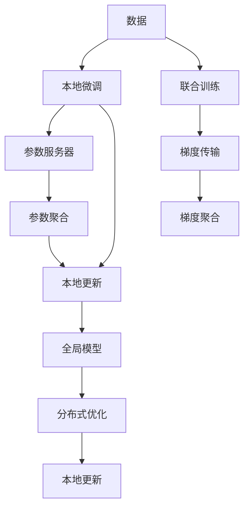

                 

# 隐私保护下的NLP：联邦学习应用

## 1. 背景介绍

随着人工智能技术的飞速发展，自然语言处理(NLP)领域不断涌现出许多创新应用，如智能客服、情感分析、机器翻译等。这些应用对大规模语料库的依赖日益增加，同时数据隐私保护也变得越来越重要。在传统集中式训练模式下，训练数据集中存储在单一机构，面临隐私泄露的风险。为解决这一问题，联邦学习(Federated Learning, FL)应运而生，将模型训练分散在多客户端上，只在各客户端本地训练并更新模型参数，保障数据隐私安全。

联邦学习通过构建分布式计算架构，使得NLP模型能够在保护用户隐私的同时进行高效训练。具体而言，在隐私保护下的NLP联邦学习应用中，模型可以在不共享原始数据的情况下，利用多个用户设备的本地数据进行模型微调，从而提升模型的泛化能力和表现。这一过程不仅能够保障数据隐私，还能在多个终端设备上实现联合训练，大大降低对中心服务器的依赖，提高了系统的安全性和可靠性。

## 2. 核心概念与联系

### 2.1 核心概念概述

- **联邦学习**：一种分布式机器学习框架，允许在多个终端设备上本地训练模型，仅通过模型参数的交换进行通信，而无需共享数据，保障数据隐私。

- **自然语言处理**：通过计算机对自然语言进行分析、理解和生成的技术，包括文本分类、情感分析、机器翻译等任务。

- **隐私保护**：在数据处理和使用过程中，采用各种手段保障数据安全，防止数据泄露或被恶意使用。

- **联合训练**：多个终端设备共同参与模型训练，每个设备只共享模型参数，不共享原始数据。

- **本地更新**：各客户端对本地数据进行模型微调，更新本地模型参数，防止数据泄露。

- **参数服务器**：负责接收各个客户端上传的模型参数，并计算全局模型参数，将更新结果返回给各客户端。

- **分布式优化**：在多客户端环境下进行模型训练，通过算法实现分布式优化。

- **梯度聚合**：在联合训练中，将各客户端计算出的梯度进行聚合，得到全局梯度，用于更新模型参数。

这些核心概念之间的逻辑关系可以通过以下Mermaid流程图来展示：



这个流程图展示了联邦学习中模型训练的基本流程：

1. 各客户端收集本地数据。
2. 在本地数据上对模型进行微调，得到本地更新。
3. 各客户端将本地更新上传到参数服务器。
4. 参数服务器对本地更新进行聚合，计算全局更新。
5. 全局更新下发至各客户端，进行本地更新。
6. 模型在各客户端上不断迭代优化。

## 3. 核心算法原理 & 具体操作步骤

### 3.1 算法原理概述

基于联邦学习的NLP模型微调，主要目的是在多个终端设备上联合训练NLP模型，提升模型性能。假设有一组本地训练数据集 $\{x_i,y_i\}$，其中 $x_i$ 是文本输入，$y_i$ 是标签。每个客户端 $c$ 在本地数据集上微调模型，更新模型参数 $\theta_c$。每个客户端的损失函数为 $L_c(\theta_c)$，目标是最小化全局损失函数 $L(\theta)$。

在FL框架下，全局模型参数 $\theta$ 可由各客户端的本地模型参数 $\theta_c$ 通过聚合得到。具体而言，假设 $C$ 是客户端数目，每个客户端上传的更新为 $\Delta_c$，则全局更新可表示为：

$$
\Delta = \sum_{c=1}^C \frac{\Delta_c}{C}
$$

其中 $\Delta$ 为全局更新。各客户端在本地进行微调，更新本地模型参数 $\theta_c$ 为：

$$
\theta_c \leftarrow \theta_c - \eta\nabla L_c(\theta_c)
$$

其中 $\eta$ 为学习率，$\nabla L_c(\theta_c)$ 为本地损失函数对 $\theta_c$ 的梯度。

### 3.2 算法步骤详解

基于联邦学习的NLP模型微调通常包括以下关键步骤：

**Step 1: 准备数据与模型**
- 收集NLP任务相关的本地数据集，例如新闻评论、文本分类等。
- 选择适合的NLP模型作为初始化参数，如BERT、GPT等。
- 定义全局模型和客户端本地模型的结构，确保一致。

**Step 2: 选择联邦学习框架**
- 选择合适的联邦学习框架，如TensorFlow Federated、PyTorch Federated等。
- 确定联邦学习架构，包括参数服务器和客户端的通信协议。

**Step 3: 本地微调与参数上传**
- 在每个客户端本地训练模型，使用本地数据进行微调。
- 各客户端将本地模型参数 $\theta_c$ 上传至参数服务器。

**Step 4: 参数聚合与全局模型更新**
- 参数服务器聚合各客户端上传的参数 $\Delta_c$，计算全局更新 $\Delta$。
- 将全局更新 $\Delta$ 下发给各客户端，更新本地模型参数 $\theta_c$。

**Step 5: 迭代优化与模型评估**
- 重复上述步骤，直至模型收敛。
- 在测试集上评估模型性能，对比微调前后的效果。

### 3.3 算法优缺点

基于联邦学习的NLP模型微调方法具有以下优点：

1. 数据隐私保护：各客户端仅上传模型参数，不共享原始数据，保障了用户隐私。
2. 高效分布式训练：各客户端并行训练，提高了模型训练速度。
3. 减少中心化依赖：分散在各客户端的数据和计算资源，降低了对中心服务器的依赖。
4. 抗数据泄露能力强：单一客户端的模型参数变化不会影响全局模型。

但该方法也存在一些局限：

1. 通信开销较大：各客户端需要频繁与参数服务器通信，增加了网络延迟和带宽消耗。
2. 同步问题复杂：各客户端计算能力和资源差异可能导致同步问题，影响整体训练效率。
3. 模型泛化能力有限：各客户端数据分布不同，模型可能在某些数据上表现不佳。
4. 技术门槛高：需要较高的技术积累和实现难度，不适合所有应用场景。

### 3.4 算法应用领域

基于联邦学习的NLP模型微调方法主要应用于需要处理大量用户数据且对隐私保护有高要求的场景。具体应用领域包括：

- **智能客服系统**：通过联邦学习对本地客户对话数据进行模型微调，提升客服响应准确率和个性化服务水平。
- **金融舆情监测**：金融机构利用本地客户行为数据进行模型微调，监测金融舆情和市场动向。
- **个性化推荐系统**：电商平台使用本地用户行为数据进行模型微调，提高推荐精度和用户满意度。
- **医疗数据分析**：医疗机构利用本地病历数据进行模型微调，提升疾病诊断和治疗方案建议的准确性。
- **社交媒体分析**：社交媒体平台使用本地用户互动数据进行模型微调，分析用户情感和行为模式。

这些领域的应用场景，都能通过联邦学习的方法在保障用户隐私的同时，实现高效、安全的数据处理和模型训练。

## 4. 数学模型和公式 & 详细讲解 & 举例说明

### 4.1 数学模型构建

在基于联邦学习的NLP模型微调中，假设全局模型参数为 $\theta$，本地模型参数为 $\theta_c$，各客户端的损失函数为 $L_c(\theta)$。全局损失函数 $L(\theta)$ 可表示为：

$$
L(\theta) = \frac{1}{C}\sum_{c=1}^C L_c(\theta)
$$

假设在每个客户端上进行了 $T$ 次迭代，每次迭代的更新量为 $\Delta_c$，则全局更新为：

$$
\Delta = \frac{1}{C}\sum_{c=1}^C \Delta_c
$$

各客户端的本地模型参数更新为：

$$
\theta_c^{t+1} = \theta_c^t - \eta \nabla L_c(\theta_c^t) + \Delta_c
$$

其中 $t$ 为迭代次数。

### 4.2 公式推导过程

以文本分类任务为例，假设模型结构为：输入层 $x$，隐藏层 $h$，输出层 $y$，损失函数为交叉熵损失。本地训练数据的损失函数 $L_c(\theta)$ 可表示为：

$$
L_c(\theta) = -\frac{1}{n}\sum_{i=1}^n y_i\log(\sigma(z_i))
$$

其中 $y_i$ 为标签，$\sigma$ 为激活函数，$z_i$ 为模型输出。全局损失函数 $L(\theta)$ 为：

$$
L(\theta) = \frac{1}{C}\sum_{c=1}^C L_c(\theta)
$$

在FL框架下，假设客户端 $c$ 上传的更新为 $\Delta_c$，则全局更新 $\Delta$ 为：

$$
\Delta = \frac{1}{C}\sum_{c=1}^C \Delta_c
$$

各客户端的本地模型参数更新为：

$$
\theta_c^{t+1} = \theta_c^t - \eta \nabla L_c(\theta_c^t) + \Delta_c
$$

### 4.3 案例分析与讲解

以情感分析任务为例，假设有一个包含10个客户端的联邦学习网络。每个客户端在本地数据集上进行模型微调，假设本地模型参数为 $\theta_c$，本地训练数据集为 $\{x_i,y_i\}$，其中 $y_i$ 为标签。各客户端的本地损失函数为 $L_c(\theta_c)$，目标是最小化全局损失函数 $L(\theta)$。

假设每个客户端上传的更新为 $\Delta_c$，则全局更新为：

$$
\Delta = \frac{1}{10}\sum_{c=1}^{10} \Delta_c
$$

各客户端在本地进行微调，更新本地模型参数 $\theta_c$ 为：

$$
\theta_c^{t+1} = \theta_c^t - \eta \nabla L_c(\theta_c^t) + \Delta
$$

重复上述步骤，直至模型收敛。在测试集上评估模型性能，对比微调前后的效果。

## 5. 项目实践：代码实例和详细解释说明

### 5.1 开发环境搭建

在进行联邦学习NLP模型微调实践前，我们需要准备好开发环境。以下是使用Python进行TensorFlow Federated开发的环境配置流程：

1. 安装Anaconda：从官网下载并安装Anaconda，用于创建独立的Python环境。

2. 创建并激活虚拟环境：
```bash
conda create -n federated-env python=3.8 
conda activate federated-env
```

3. 安装TensorFlow Federated和其他必要的Python库：
```bash
pip install tensorflow tensorflow_federated
```

4. 安装必要的依赖包：
```bash
pip install numpy pandas scikit-learn tqdm
```

完成上述步骤后，即可在`federated-env`环境中开始联邦学习NLP模型微调实践。

### 5.2 源代码详细实现

下面我们以情感分析任务为例，给出使用TensorFlow Federated对BERT模型进行联邦学习微调的Python代码实现。

首先，定义数据处理函数：

```python
import tensorflow as tf
import tensorflow_federated as tff
from tensorflow_federated.python.api import tff
from transformers import BertTokenizer, BertForSequenceClassification

def preprocess(text):
    tokenizer = BertTokenizer.from_pretrained('bert-base-cased')
    inputs = tokenizer(text, return_tensors='tf')
    input_ids = inputs['input_ids']
    attention_mask = inputs['attention_mask']
    return input_ids, attention_mask

# 定义本地数据集
local_dataset = tf.data.Dataset.from_tensor_slices((local_texts, local_labels))
local_dataset = local_dataset.map(preprocess)
local_dataset = local_dataset.batch(16)

# 定义全局数据集
global_dataset = tf.data.Dataset.from_tensor_slices((global_texts, global_labels))
global_dataset = global_dataset.map(preprocess)
global_dataset = global_dataset.batch(16)

# 定义本地模型和损失函数
def create_model():
    return BertForSequenceClassification.from_pretrained('bert-base-cased', num_labels=2)

def loss_fn(input_ids, attention_mask, labels):
    model = create_model()
    logits = model(input_ids, attention_mask=attention_mask)
    loss = tf.keras.losses.sparse_categorical_crossentropy(labels, logits, from_logits=True)
    return loss

# 定义全局损失函数
def global_loss_fn(inputs):
    input_ids, attention_mask, labels = inputs
    return loss_fn(input_ids, attention_mask, labels)

# 定义本地训练函数
def train_local_fn(model, batch):
    input_ids, attention_mask, labels = batch
    with tf.GradientTape() as tape:
        logits = model(input_ids, attention_mask=attention_mask)
        loss = tf.keras.losses.sparse_categorical_crossentropy(labels, logits, from_logits=True)
    grads = tape.gradient(loss, model.trainable_variables)
    return tff.learning.ModelUpdate(grads)

# 定义全局训练函数
def train_global_fn(model):
    return tff.learning.ModelUpdate(global_loss_fn)
```

然后，定义联邦学习训练流程：

```python
# 初始化模型
model = create_model()

# 初始化训练策略
strategy = federated_learning_model_selection.build_federated_learning_strategy(local_dataset)

# 训练模型
for _ in range(num_epochs):
    result = strategy.run(train_local_fn, train_global_fn, model)
    print(result)

# 在测试集上评估模型性能
test_dataset = tf.data.Dataset.from_tensor_slices((test_texts, test_labels))
test_dataset = test_dataset.map(preprocess)
test_dataset = test_dataset.batch(16)
test_loss = test_dataset.map(lambda x: loss_fn(x[0], x[1], x[2]))
test_metric = tf.keras.metrics.SparseCategoricalAccuracy()
test_metric.update_state(test_loss)

print('Test Accuracy:', test_metric.result().numpy())
```

以上就是使用TensorFlow Federated对BERT模型进行情感分析任务联邦学习微调的完整代码实现。可以看到，利用TensorFlow Federated库，开发者可以方便地实现基于联邦学习的NLP模型微调。

### 5.3 代码解读与分析

让我们再详细解读一下关键代码的实现细节：

**preprocess函数**：
- 定义文本预处理函数，使用BertTokenizer将文本转换为模型需要的token ids和attention mask。

**本地数据集和全局数据集**：
- 本地数据集使用`tf.data.Dataset`创建，对文本进行预处理，并按batch进行分批次处理。
- 全局数据集与本地数据集类似，但不需要考虑本地数据的分布和规模。

**本地模型和损失函数**：
- 定义本地模型的创建函数，初始化BertForSequenceClassification模型。
- 定义本地损失函数，计算交叉熵损失。

**全局损失函数**：
- 定义全局损失函数，将本地损失函数进行聚合。

**本地训练函数和全局训练函数**：
- 本地训练函数定义在本地数据集上对模型进行微调，计算梯度并返回ModelUpdate。
- 全局训练函数定义在全局数据集上对模型进行微调，计算全局损失函数并返回ModelUpdate。

**联邦学习策略和训练流程**：
- 定义联邦学习策略，使用`federated_learning_model_selection`模块创建，指定本地数据集的分布和规模。
- 在每个epoch中，使用`strategy.run`函数运行本地和全局训练函数，更新模型参数。

**测试集评估**：
- 在测试集上评估模型性能，计算并打印测试准确率。

## 6. 实际应用场景

### 6.1 智能客服系统

智能客服系统中的客户对话数据通常包含大量敏感信息，如客户身份、交易记录等。在传统集中式训练模式下，这些数据需要集中存储在服务器上，存在隐私泄露的风险。通过联邦学习，各客服中心可以在本地对模型进行微调，在保障客户隐私的同时，提升客服响应准确率和个性化服务水平。

### 6.2 金融舆情监测

金融机构需要实时监测市场舆论动向，以便及时应对负面信息传播，规避金融风险。传统的人工监测方式成本高、效率低，难以应对网络时代海量信息爆发的挑战。利用联邦学习，金融机构可以在本地收集和微调模型，监测金融舆情和市场动向，提高信息收集和分析的效率和准确性。

### 6.3 个性化推荐系统

当前的推荐系统往往只依赖用户的历史行为数据进行物品推荐，无法深入理解用户的真实兴趣偏好。基于联邦学习的推荐系统可以更好地利用用户本地数据进行模型微调，在保障用户隐私的同时，提高推荐精度和用户满意度。

### 6.4 医疗数据分析

医疗机构利用本地病历数据进行模型微调，提升疾病诊断和治疗方案建议的准确性。联邦学习能够在保障数据隐私的前提下，实现跨医院的联合分析，提升医疗服务的智能化水平。

## 7. 工具和资源推荐

### 7.1 学习资源推荐

为了帮助开发者系统掌握联邦学习在大语言模型微调中的应用，这里推荐一些优质的学习资源：

1. 《Federated Learning: Concepts, Models, and Algorithms》一书：系统介绍了联邦学习的概念、算法和应用，提供了深入浅出的理论框架和实际案例。

2. TensorFlow Federated官方文档：TensorFlow Federated库的官方文档，提供了详细的API和样例代码，适合快速上手联邦学习NLP模型的开发。

3. PyTorch Federated官方文档：PyTorch Federated库的官方文档，提供了丰富的联邦学习API和样例，适合构建高效的分布式训练系统。

4. FLMeeting社区：专注于联邦学习研究与实践的社区，提供大量学术文章、代码库和实践经验分享，适合深入学习联邦学习相关知识。

5. GitHub上联邦学习项目：GitHub上包含大量联邦学习项目和代码，包括各种应用场景下的样例和实验结果，适合参考和借鉴。

通过对这些资源的学习实践，相信你一定能够快速掌握联邦学习在大语言模型微调中的应用技巧，并用于解决实际的NLP问题。

### 7.2 开发工具推荐

高效的开发离不开优秀的工具支持。以下是几款用于联邦学习NLP模型微调开发的常用工具：

1. TensorFlow Federated：Google推出的联邦学习框架，支持分布式计算和联合训练，适用于大语言模型微调。

2. PyTorch Federated：Facebook开发的联邦学习框架，支持分布式优化和参数聚合，适合构建高效的联邦学习系统。

3. Federated ML：Microsoft开发的联邦学习框架，支持多种模型和优化算法，适用于大语言模型微调。

4. Tune：Hyperopt开发的超参数优化库，支持联邦学习超参数搜索，提升模型训练效率和性能。

5. TensorBoard：TensorFlow配套的可视化工具，可实时监测模型训练状态，提供丰富的图表呈现方式。

6. Weights & Biases：模型训练的实验跟踪工具，记录和可视化模型训练过程中的各项指标，便于对比和调优。

合理利用这些工具，可以显著提升联邦学习NLP模型微调任务的开发效率，加快创新迭代的步伐。

### 7.3 相关论文推荐

联邦学习在大语言模型微调中的应用受到了广泛关注。以下是几篇奠基性的相关论文，推荐阅读：

1. "Federated Learning in Mobile and Edge Computing: A Survey"：介绍了联邦学习的基本概念和算法，适合对联邦学习框架和应用进行全面了解。

2. "Federated Learning for Mobile and Edge AI"：介绍了联邦学习在移动和边缘计算中的应用，包括NLP任务，适合理解联邦学习的实际应用场景和挑战。

3. "Federated Learning: Concepts, Strategies, and Future Directions"：总结了联邦学习的主要概念和策略，提供了未来发展的方向和趋势，适合对联邦学习进行系统性学习。

4. "Hyperparameter Optimization in Federated Learning"：介绍了联邦学习中的超参数优化方法，适合理解如何优化模型训练的性能和效率。

5. "Model-based Federated Learning: An Overview"：介绍了基于模型的联邦学习算法，适合对联邦学习中参数更新和优化进行深入研究。

这些论文代表了大语言模型微调中联邦学习技术的发展脉络。通过学习这些前沿成果，可以帮助研究者把握联邦学习的未来方向，激发更多的创新灵感。

## 8. 总结：未来发展趋势与挑战

### 8.1 研究成果总结

本文对基于联邦学习的NLP模型微调方法进行了全面系统的介绍。首先阐述了联邦学习在保障数据隐私的同时进行高效训练的基本原理和优势，明确了联邦学习在NLP任务中的重要作用。其次，从原理到实践，详细讲解了联邦学习在NLP模型微调中的应用步骤，给出了联邦学习NLP模型微调项目的完整代码实现。同时，本文还广泛探讨了联邦学习在智能客服、金融舆情、个性化推荐等多个行业领域的应用前景，展示了联邦学习范式的巨大潜力。此外，本文精选了联邦学习技术的各类学习资源，力求为读者提供全方位的技术指引。

通过本文的系统梳理，可以看到，基于联邦学习的NLP模型微调方法不仅能够保障数据隐私，还能实现高效分布式训练，适用于多个终端设备上联合训练NLP模型，提升模型性能。联邦学习在大语言模型微调中的应用，展示了其在实际应用中的广阔前景和深远影响。

### 8.2 未来发展趋势

展望未来，联邦学习在NLP模型微调中的应用将呈现以下几个发展趋势：

1. 分布式训练架构优化：随着联邦学习技术的发展，分布式训练架构将更加高效，支持更多终端设备上的联合训练。

2. 模型更新策略优化：研究更加高效的模型更新策略，如模型压缩、量化加速等，提升联邦学习NLP模型的推理效率。

3. 数据融合与知识共享：探索数据融合和知识共享机制，提高联邦学习模型的泛化能力和适应性。

4. 隐私保护技术提升：通过差分隐私、同态加密等隐私保护技术，进一步提升联邦学习系统的安全性。

5. 跨领域联邦学习：研究跨领域联邦学习技术，实现不同领域数据的高效融合，提升联邦学习模型的通用性。

6. 多模态联邦学习：探索多模态数据的联邦学习技术，实现视觉、语音、文本等多种数据类型的联合分析，提升联邦学习模型的智能化水平。

以上趋势凸显了联邦学习在NLP模型微调中的广阔前景。这些方向的探索发展，必将进一步提升NLP系统的性能和应用范围，为人工智能技术落地应用提供新的助力。

### 8.3 面临的挑战

尽管联邦学习在大语言模型微调中取得了显著进展，但在实践中仍然面临诸多挑战：

1. 通信开销较大：联邦学习需要频繁进行模型参数的上传和下载，增加了网络延迟和带宽消耗。如何优化通信协议，降低通信开销，是联邦学习需要解决的重要问题。

2. 同步问题复杂：各终端设备的计算能力和资源差异可能导致同步问题，影响整体训练效率。如何实现高效的同步算法，是联邦学习的关键挑战。

3. 模型泛化能力有限：各终端数据分布不同，模型可能在某些数据上表现不佳。如何提高模型的泛化能力，是联邦学习需要解决的重要问题。

4. 数据质量参差不齐：联邦学习需要保证数据质量，各终端设备的数据质量和分布不均可能导致模型性能下降。如何提高数据质量，保障数据的一致性和完整性，是联邦学习的关键挑战。

5. 技术门槛高：联邦学习技术实现复杂，需要较高的技术积累和实现难度，不适合所有应用场景。如何降低技术门槛，提高联邦学习系统的易用性和可扩展性，是联邦学习的关键挑战。

正视联邦学习面临的这些挑战，积极应对并寻求突破，将是大语言模型微调走向成熟的必由之路。相信随着学界和产业界的共同努力，这些挑战终将一一被克服，联邦学习NLP模型微调必将在构建安全、可靠、可解释、可控的智能系统中扮演越来越重要的角色。

### 8.4 研究展望

面向未来，联邦学习在NLP模型微调中的应用还需进一步深化和拓展：

1. 研究高效的联邦学习算法：开发更加高效、可扩展的联邦学习算法，提高模型的训练速度和性能。

2. 探索联邦学习与预训练的结合：结合联邦学习和预训练语言模型，实现更好的数据融合和知识共享，提升模型性能。

3. 引入更多的先验知识：将符号化的先验知识，如知识图谱、逻辑规则等，与神经网络模型进行融合，提高联邦学习模型的智能化水平。

4. 结合因果分析和博弈论工具：将因果分析方法引入联邦学习模型，识别出模型决策的关键特征，增强输出解释的因果性和逻辑性。借助博弈论工具刻画人机交互过程，主动探索并规避模型的脆弱点，提高系统稳定性。

5. 引入更多的隐私保护技术：通过差分隐私、同态加密等隐私保护技术，进一步提升联邦学习系统的安全性。

6. 实现跨领域联邦学习：研究跨领域联邦学习技术，实现不同领域数据的高效融合，提升联邦学习模型的通用性。

这些研究方向的探索，必将引领联邦学习在大语言模型微调中迈向更高的台阶，为构建安全、可靠、可解释、可控的智能系统铺平道路。面向未来，联邦学习技术还需要与其他人工智能技术进行更深入的融合，如知识表示、因果推理、强化学习等，多路径协同发力，共同推动自然语言理解和智能交互系统的进步。只有勇于创新、敢于突破，才能不断拓展语言模型的边界，让智能技术更好地造福人类社会。

## 9. 附录：常见问题与解答

**Q1：联邦学习与传统集中式训练有何区别？**

A: 联邦学习与传统集中式训练的主要区别在于数据分布方式和模型训练过程。传统集中式训练需要将所有数据集中存储在单一服务器上，模型在本地数据上进行训练，每次训练都需要从服务器下载数据和上传结果，存在隐私泄露风险。而联邦学习通过在多个终端设备上本地训练模型，仅在模型参数上共享信息，不共享原始数据，保障了用户隐私。

**Q2：联邦学习是否适用于所有NLP任务？**

A: 联邦学习在大多数NLP任务上都能取得不错的效果，特别是对于数据量较小的任务。但对于一些特定领域的任务，如医学、法律等，仅仅依靠通用语料预训练的模型可能难以很好地适应。此时需要在特定领域语料上进一步预训练，再进行联邦学习微调，才能获得理想效果。

**Q3：联邦学习是否会降低模型性能？**

A: 联邦学习由于在多个客户端上本地训练模型，因此整体训练时间较长，模型更新次数较少，可能会影响模型的泛化能力和性能。但通过优化通信协议和同步算法，可以缓解这一问题，提升模型性能。

**Q4：联邦学习是否会导致过拟合？**

A: 联邦学习由于各客户端数据分布不同，模型可能在某些数据上表现不佳。为避免过拟合，可以在本地训练过程中引入正则化技术，如L2正则、Dropout等，并在全局训练中引入联邦正则化策略。同时，可以通过引入更多的本地数据和异质数据源，提升模型的泛化能力和鲁棒性。

**Q5：联邦学习是否会消耗更多资源？**

A: 联邦学习在多客户端环境下进行分布式训练，确实会增加计算和通信开销，但通过优化通信协议和同步算法，可以显著降低资源消耗。此外，联邦学习能够更好地利用多个设备的数据资源，提升模型的泛化能力和性能。

通过以上分析，我们可以看到，联邦学习在大语言模型微调中的应用具有广阔的前景和深远的影响。在保障数据隐私的同时，联邦学习能够实现高效的分布式训练，提升模型的泛化能力和性能，为NLP任务的落地应用提供新的方向和方法。面向未来，联邦学习技术需要在多设备协同、隐私保护、模型优化等方面进行更深入的研究和实践，才能真正实现人工智能技术的普适化和智能化。

