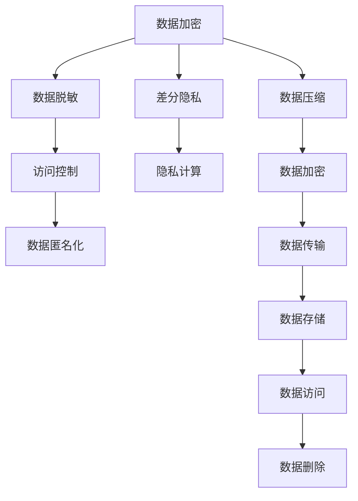

                 

## 1. 背景介绍

### 1.1 问题由来

在数字化时代，数据成为推动社会发展的关键资源，同时也给隐私保护带来了巨大挑战。大数据的崛起带来了海量数据，同时也带来了隐私泄露的风险。近年来，包括数据泄露、隐私侵犯在内的隐私安全问题频繁曝光，不断引发社会关注。隐私保护已成为全球性的焦点问题，迫切需要系统化的解决方案。

隐私安全不仅关乎用户的基本权益，也直接影响到企业的商业运营和社会的公共安全。企业在收集、存储、使用数据时，需要遵守隐私法律法规，保护用户隐私，避免数据滥用和泄漏。而国家层面也出台了一系列隐私保护政策，如欧盟的《通用数据保护条例》（GDPR）、美国《加州消费者隐私法案》（CCPA）等，对企业的数据处理行为进行了严格约束。

### 1.2 问题核心关键点

隐私安全问题涉及到数据收集、存储、处理、共享、删除等多个环节，核心关键点包括：

1. **数据收集与处理**：如何在收集数据时保护用户隐私，避免收集过多不必要的敏感数据。
2. **数据存储**：如何安全地存储用户数据，防止数据泄露和非法访问。
3. **数据共享**：如何在满足业务需求的同时，保护数据不被非法共享或滥用。
4. **数据删除**：如何高效、安全地删除不再需要的数据，避免数据残留。

这些关键点涉及的技术和策略包括但不限于加密技术、访问控制、数据脱敏、匿名化处理、差分隐私等。隐私保护技术的不断演进，推动了隐私保护技术的进步，但仍然面临着诸多挑战和难点。

## 2. 核心概念与联系

### 2.1 核心概念概述

隐私保护技术是涉及密码学、计算机科学、法律等多个领域的交叉学科。以下是几个关键概念：

1. **数据加密**：通过对数据进行加密处理，保护数据的机密性，防止未授权的访问和窃取。
2. **数据脱敏**：通过对数据进行匿名化、模糊化等处理，保护数据的隐私性，避免数据被恶意使用。
3. **差分隐私**：通过在数据中引入噪声，保护数据的隐私性，同时保证数据的统计有效性。
4. **访问控制**：通过严格的访问权限管理，确保只有授权用户可以访问敏感数据。
5. **隐私计算**：在保护隐私的前提下，对数据进行计算和分析，实现隐私保护的分布式计算。

这些概念之间的联系可以通过以下Mermaid流程图来展示：



这个流程图展示了一个完整的隐私保护流程，从数据收集到数据删除，涉及了多个关键环节。每个环节都使用不同的隐私保护技术来保证数据的安全性和隐私性。

## 3. 核心算法原理 & 具体操作步骤

### 3.1 算法原理概述

隐私保护技术可以分为三大类：数据加密、数据脱敏和差分隐私。其核心原理分别如下：

1. **数据加密**：通过对数据进行加密处理，保护数据的机密性，防止未授权的访问和窃取。常用的加密算法包括对称加密（如AES）和非对称加密（如RSA）。
2. **数据脱敏**：通过对数据进行匿名化、模糊化等处理，保护数据的隐私性，避免数据被恶意使用。常用的数据脱敏技术包括数据匿名化、数据模糊化和数据伪造等。
3. **差分隐私**：通过在数据中引入噪声，保护数据的隐私性，同时保证数据的统计有效性。差分隐私的数学模型为：$ε$-差分隐私，即在添加噪声后，不同数据点的影响不超过 $\epsilon$。

### 3.2 算法步骤详解

以差分隐私为例，其基本步骤如下：

1. **数据预处理**：对原始数据进行清洗、去重、归一化等预处理，确保数据的质量和一致性。
2. **引入噪声**：在数据中加入噪声，可以使用加性噪声、乘性噪声等方法。加性噪声形式为：$y = x + \epsilon$，其中 $\epsilon$ 服从均值为0、方差为 $\sigma^2$ 的高斯分布。
3. **数据发布**：将处理后的数据发布到公开的数据库或应用中，供用户查询或分析。
4. **隐私保护**：通过设定隐私预算 $\epsilon$ 和噪声参数 $\sigma$，保证数据的差分隐私性。

### 3.3 算法优缺点

差分隐私的优势在于能够保护数据的隐私性，同时保持数据的统计有效性。但其缺点也较为明显：

- **计算复杂度高**：引入噪声的过程需要较高的计算复杂度，特别是对于大规模数据集。
- **隐私预算难以确定**：隐私预算 $\epsilon$ 的设定需要根据具体应用场景和数据敏感性进行精细调整，难以找到一个最优的平衡点。
- **数据失真严重**：噪声的引入可能导致数据失真，影响数据的统计准确性。

尽管如此，差分隐私仍然是一种重要的隐私保护手段，在隐私敏感型应用中具有广泛的应用前景。

### 3.4 算法应用领域

差分隐私技术已经在多个领域得到了广泛应用，包括：

1. **医疗数据隐私保护**：在医疗机构中，病历、诊断等敏感数据需要保护隐私，差分隐私可以用于这些数据的分析和发布。
2. **金融数据隐私保护**：在金融领域，客户交易数据、信用评分等敏感信息需要保护，差分隐私可以用于这些数据的处理和共享。
3. **政府数据隐私保护**：在政府机构中，公共数据集如人口普查、人口普查等敏感数据需要保护隐私，差分隐私可以用于这些数据的发布和查询。

## 4. 数学模型和公式 & 详细讲解 & 举例说明

### 4.1 数学模型构建

差分隐私的数学模型基于拉普拉斯分布，设 $x$ 为原始数据，$\epsilon$ 为隐私预算，$\sigma$ 为噪声参数，则差分隐私模型为：

$$
P(y|x,\epsilon,\sigma) = \frac{1}{Z}e^{-\frac{|y-x|}{\sigma}} 
$$

其中 $Z$ 为归一化常数，$|y-x|$ 为噪声的强度，$\sigma$ 为噪声的方差。

### 4.2 公式推导过程

差分隐私的推导过程如下：

1. **定义隐私预算**：隐私预算 $\epsilon$ 为隐私泄露的下界，即在加入噪声后，不同数据点的影响不超过 $\epsilon$。
2. **引入噪声**：在原始数据 $x$ 上加入噪声 $y$，满足：$y = x + \epsilon$，其中 $\epsilon$ 服从均值为0、方差为 $\sigma^2$ 的高斯分布。
3. **隐私保护**：通过设定隐私预算 $\epsilon$ 和噪声参数 $\sigma$，保证数据的差分隐私性。具体来说，隐私预算 $\epsilon$ 决定了噪声的强度，噪声参数 $\sigma$ 决定了噪声的方差。

### 4.3 案例分析与讲解

以下以医疗数据为例，说明差分隐私的实际应用：

假设某医院收集了 $n$ 个患者的病历数据 $x_i$，每个病历数据包含多个敏感特征。为了保护患者隐私，需要在发布病历数据时加入噪声，确保隐私泄露不超过 $\epsilon$。

设噪声参数 $\sigma$ 为0.1，隐私预算 $\epsilon$ 为0.1，则加入噪声后的病历数据为 $y_i = x_i + \epsilon_i$，其中 $\epsilon_i$ 服从均值为0、方差为 $\sigma^2$ 的高斯分布。

## 5. 项目实践：代码实例和详细解释说明

### 5.1 开发环境搭建

在进行隐私保护项目实践前，我们需要准备好开发环境。以下是使用Python进行差分隐私开发的环境配置流程：

1. 安装Anaconda：从官网下载并安装Anaconda，用于创建独立的Python环境。

2. 创建并激活虚拟环境：
```bash
conda create -n differential-privacy python=3.8 
conda activate differential-privacy
```

3. 安装相关库：
```bash
pip install numpy scipy scikit-learn pandas
```

4. 安装差分隐私库：
```bash
pip install differential_privacy
```

完成上述步骤后，即可在`differential-privacy`环境中开始差分隐私实践。

### 5.2 源代码详细实现

下面以一个简单的医疗数据发布为例，给出使用差分隐私保护的Python代码实现。

```python
from differential_privacy import PrivacyEngine
import numpy as np
import pandas as pd

# 假设原始数据为病历数据，包含多个敏感特征
data = pd.read_csv('medical_data.csv')

# 设定隐私预算和噪声参数
epsilon = 0.1
sigma = 0.1

# 创建差分隐私引擎
engine = PrivacyEngine(data, epsilon, sigma, max_query_times=1000)

# 发布数据
data_privacy = engine.release()
```

在这个代码中，我们首先加载了医疗数据，然后创建了一个差分隐私引擎，设定了隐私预算 $\epsilon$ 和噪声参数 $\sigma$，最后使用 `release()` 方法发布了差分隐私数据。

### 5.3 代码解读与分析

这段代码实现的核心在于差分隐私引擎的创建和数据发布。具体解释如下：

- `PrivacyEngine` 类：用于创建差分隐私引擎，接受原始数据、隐私预算和噪声参数作为输入。
- `release()` 方法：发布差分隐私数据，返回发布后的数据。

## 6. 实际应用场景

### 6.1 智能医疗

智能医疗是隐私保护技术的重要应用领域之一。在智能医疗系统中，需要处理和分析大量敏感的医疗数据，如病历、诊断、治疗方案等。差分隐私技术可以用于保护这些数据，确保数据隐私和安全。

以智能诊断系统为例，医生可以利用差分隐私技术对患者的病历数据进行处理和分析，保护患者的隐私，同时提供准确的诊断建议。患者可以放心地使用智能诊断系统，而无需担心数据泄露风险。

### 6.2 金融风控

金融风控是隐私保护技术的另一个重要应用领域。在金融领域，客户交易数据、信用评分等敏感信息需要保护隐私，差分隐私可以用于这些数据的处理和共享。

以信用评分系统为例，银行可以基于客户的交易数据和信用记录，利用差分隐私技术计算和分析信用评分，保护客户的隐私。同时，银行可以安全地与第三方共享信用评分数据，供风险评估使用。

### 6.3 政府数据公开

政府数据公开是隐私保护技术的另一个重要应用领域。在政府机构中，公共数据集如人口普查、人口普查等敏感数据需要保护隐私，差分隐私可以用于这些数据的发布和查询。

以人口普查数据为例，政府可以利用差分隐私技术发布人口普查数据，保护个人隐私，同时提供公开查询接口，供研究人员和社会公众使用。

## 7. 工具和资源推荐

### 7.1 学习资源推荐

为了帮助开发者系统掌握隐私保护技术的理论基础和实践技巧，这里推荐一些优质的学习资源：

1. 《差分隐私：实践中的隐私保护》系列博文：由差分隐私技术专家撰写，深入浅出地介绍了差分隐私原理、算法和实际应用。

2. 《隐私保护技术》课程：由清华大学开设的隐私保护技术课程，涵盖隐私保护的基本概念和最新研究成果，提供丰富的实践项目。

3. 《隐私保护技术》书籍：系统介绍隐私保护技术的理论和实践，涵盖数据加密、差分隐私、匿名化等多个方面。

4. IEEE Privacy和Security杂志：收录最新的隐私保护技术论文，提供深入的理论研究和实践案例。

5. GitHub差分隐私项目：开源的差分隐私库，提供丰富的API和示例代码，适合实践学习和项目开发。

通过对这些资源的学习实践，相信你一定能够快速掌握差分隐私技术的精髓，并用于解决实际的隐私保护问题。

### 7.2 开发工具推荐

高效的开发离不开优秀的工具支持。以下是几款用于差分隐私开发的常用工具：

1. Anaconda：用于创建独立的Python环境，适合多项目管理和调试。

2. Jupyter Notebook：用于编写和调试差分隐私算法，支持多语言的代码实现。

3. PyTorch：基于Python的开源深度学习框架，适合高性能计算和分布式训练。

4. TensorFlow：由Google主导开发的开源深度学习框架，生产部署方便，适合大规模工程应用。

5. Weights & Biases：模型训练的实验跟踪工具，可以记录和可视化模型训练过程中的各项指标，方便对比和调优。

6. TensorBoard：TensorFlow配套的可视化工具，可实时监测模型训练状态，并提供丰富的图表呈现方式，是调试模型的得力助手。

合理利用这些工具，可以显著提升差分隐私开发的效率，加快创新迭代的步伐。

### 7.3 相关论文推荐

差分隐私技术的发展源于学界的持续研究。以下是几篇奠基性的相关论文，推荐阅读：

1. Differential Privacy: An Approach to Privacy-Preserving Data Analysis：差分隐私的奠基性论文，提出差分隐私的基本概念和数学模型。

2. Privacy-Preserving Data Mining in Secure, Robust, and Accurate Way：提出隐私敏感型数据挖掘的方法，包括差分隐私在内的多种隐私保护技术。

3. Adversarial Training Methods for Differential Privacy：提出差分隐私的对抗性训练方法，提高差分隐私算法的鲁棒性和安全性。

4. Secure and Privacy-Preserving Anonymization of Time Series Data：提出隐私保护的时间序列数据匿名化方法，结合差分隐私技术，保护数据隐私。

5. Scalable Privacy-Preserving Machine Learning：提出可扩展的隐私保护机器学习方法，利用差分隐私技术，保护数据隐私。

这些论文代表了大差分隐私技术的发展脉络。通过学习这些前沿成果，可以帮助研究者把握学科前进方向，激发更多的创新灵感。

## 8. 总结：未来发展趋势与挑战

### 8.1 总结

本文对差分隐私保护技术进行了全面系统的介绍。首先阐述了隐私保护技术的背景和意义，明确了差分隐私在保护数据隐私方面的独特价值。其次，从原理到实践，详细讲解了差分隐私的数学原理和关键步骤，给出了差分隐私算法实现的完整代码实例。同时，本文还广泛探讨了差分隐私在智能医疗、金融风控、政府数据公开等多个行业领域的应用前景，展示了差分隐私技术的广泛应用。此外，本文精选了差分隐私技术的各类学习资源，力求为读者提供全方位的技术指引。

通过本文的系统梳理，可以看到，差分隐私保护技术在数据隐私保护方面具有重要的应用价值，但其计算复杂度高、隐私预算难以确定等缺点也必须正视。未来，需要在差分隐私技术的基础上，结合其他隐私保护技术（如数据加密、访问控制等），形成更加全面的隐私保护方案。

### 8.2 未来发展趋势

展望未来，差分隐私保护技术将呈现以下几个发展趋势：

1. **计算复杂度降低**：通过优化算法和模型结构，降低差分隐私的计算复杂度，使其更适用于大规模数据集。
2. **隐私预算优化**：改进隐私预算的设定方法，使其更符合实际应用场景，提高差分隐私的有效性。
3. **隐私预算动态调整**：引入动态调整机制，根据数据访问频率和隐私泄露风险，实时调整隐私预算。
4. **跨模态隐私保护**：将差分隐私技术与其他隐私保护技术（如数据加密、访问控制等）结合，形成跨模态隐私保护方案。
5. **隐私保护与数据利用结合**：探索隐私保护与数据利用相结合的方法，在不影响数据隐私的前提下，最大化数据利用价值。

这些趋势将进一步推动差分隐私保护技术的发展，为数据隐私保护提供更全面、更高效、更安全的解决方案。

### 8.3 面临的挑战

尽管差分隐私保护技术已经取得了显著成果，但在实践中仍面临诸多挑战：

1. **计算资源消耗高**：差分隐私的计算复杂度较高，需要高性能计算资源支持。
2. **隐私预算设定困难**：隐私预算的设定需要根据实际应用场景和数据敏感性进行精细调整，难以找到最优平衡点。
3. **数据失真问题**：引入噪声可能导致数据失真，影响数据的统计准确性。
4. **隐私保护与数据利用冲突**：在隐私保护与数据利用之间寻找平衡点，是差分隐私技术面临的重要挑战。

这些挑战需要进一步研究，以提高差分隐私保护技术的实用性和可操作性。

### 8.4 研究展望

面对差分隐私保护技术面临的挑战，未来的研究需要在以下几个方面寻求新的突破：

1. **优化算法设计**：改进差分隐私的算法设计，降低计算复杂度，提高隐私预算的设定精度。
2. **引入先验知识**：将先验知识与差分隐私技术结合，增强隐私保护的准确性和有效性。
3. **跨模态隐私保护**：探索跨模态隐私保护技术，将差分隐私与其他隐私保护技术结合，形成更全面、更高效的隐私保护方案。
4. **隐私保护与数据利用结合**：探索隐私保护与数据利用相结合的方法，在不影响数据隐私的前提下，最大化数据利用价值。
5. **隐私保护算法透明性**：提高隐私保护算法的透明性，使其更容易解释和理解，便于监管和审计。

这些研究方向将进一步推动差分隐私保护技术的发展，为数据隐私保护提供更全面、更高效、更安全的解决方案。

## 9. 附录：常见问题与解答

**Q1：差分隐私保护技术是否适用于所有数据集？**

A: 差分隐私保护技术适用于任何敏感数据集，包括医疗数据、金融数据、政府数据等。但需要注意的是，隐私预算 $\epsilon$ 和噪声参数 $\sigma$ 的设定需要根据具体数据集和应用场景进行精细调整。

**Q2：差分隐私保护技术的计算复杂度是否过高？**

A: 差分隐私的计算复杂度相对较高，特别是对于大规模数据集。但随着算法和模型的优化，计算复杂度已显著降低。目前，差分隐私技术已经在大规模数据集上得到了广泛应用，展示了其强大的隐私保护能力。

**Q3：差分隐私保护技术如何与其他隐私保护技术结合？**

A: 差分隐私保护技术可以与其他隐私保护技术（如数据加密、访问控制等）结合，形成更全面、更高效的隐私保护方案。例如，在医疗数据保护中，可以结合数据加密技术，提高数据传输的安全性；结合访问控制技术，限制数据访问权限，确保数据安全性。

**Q4：差分隐私保护技术的实际应用效果如何？**

A: 差分隐私保护技术已经在医疗数据、金融数据、政府数据等多个领域得到了广泛应用。通过差分隐私技术，可以保护数据隐私，同时提供高质量的数据分析和查询服务，保证了数据隐私和安全。

**Q5：差分隐私保护技术是否容易被攻击？**

A: 差分隐私保护技术本身具有一定的鲁棒性和抗攻击性。攻击者需要大量的数据才能对隐私数据进行反向推断，而差分隐私技术通过引入噪声，使得反向推断的难度大大增加，从而提高了数据隐私的安全性。

通过这些问答，可以进一步理解差分隐私保护技术的实际应用和优缺点，为读者提供更全面的技术指导。

