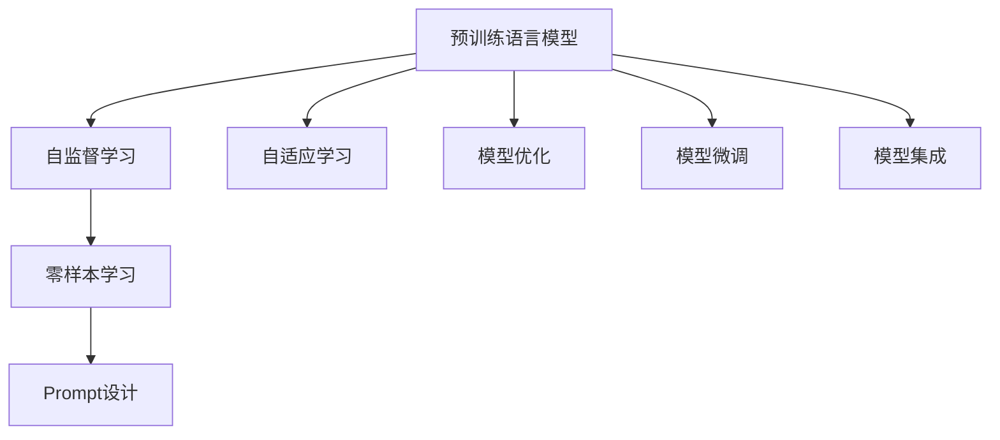

                 

# 零样本学习的进步：Prompt的设计原则与工程实践

> 关键词：零样本学习, Prompt, 自适应, 语言模型, 自监督学习, 预训练, 自然语言处理(NLP)

## 1. 背景介绍

### 1.1 问题由来
在人工智能和自然语言处理(NLP)领域，零样本学习(Zero-Shot Learning)长期以来被视为一种理想化的目标：让机器模型无需见任何特定任务的数据，仅凭任务描述就能执行新任务。这一理念最早由Tom Mitchell在1980年提出，并在NLP界引起了广泛的关注和研究。

然而，传统的零样本学习方法通常依赖于庞大的知识库、规则模板等，难以在实际应用中大规模部署。直到近年来，基于深度学习的大语言模型，尤其是Transformer架构下的预训练语言模型，开始逐渐展现出零样本学习的潜力。以BERT、GPT-3、GPT-4等为代表的预训练模型，通过在海量文本数据上的自监督学习，获得了对自然语言的深刻理解。利用这些模型，可以通过精心设计的Prompt模板，指导模型完成各种零样本任务，从而极大地降低了对标注数据的需求，扩展了AI应用的边界。

### 1.2 问题核心关键点
Prompt模板是实现零样本学习的重要工具。它的设计原则和工程技术直接决定了模型的零样本效果。一个有效的Prompt应该具备以下特点：

- **相关性**：与任务描述和语境高度相关，能够引导模型理解任务目标。
- **简洁性**：精炼扼要，避免冗余和干扰，减少模型理解负担。
- **多样性**：具有多种变体形式，方便在不同场景下使用。
- **语义完备性**：包含足够的语义信息，避免歧义，确保模型能够理解任务。

此外，Prompt模板的设计还涉及许多工程上的考量，如 Prompt 长度、特定领域术语、参数优化策略等。本文将围绕这些关键点，系统介绍Prompt的设计原则与工程实践，帮助开发者设计和优化Prompt模板，实现高效的零样本学习。

## 2. 核心概念与联系

### 2.1 核心概念概述

为更好地理解Prompt的设计原则与工程实践，本节将介绍几个密切相关的核心概念：

- **预训练语言模型(Pretrained Language Models, PLMs)**：以Transformer架构为基础，通过自监督学习任务在大规模无标签文本数据上预训练得到的模型，具备强大的语言理解能力和迁移学习能力。
- **自监督学习(Self-Supervised Learning)**：利用无标签数据自学习模型的隐含表示，无需人工标注即可提取有效特征。
- **Prompt**：一种通过向模型输入的文本格式，引导模型按照特定任务要求执行推理和生成，是实现零样本学习的重要手段。
- **零样本学习(Zero-Shot Learning)**：模型无需见任何特定任务的训练数据，仅通过任务描述即可执行任务。
- **自适应学习(Adaptive Learning)**：根据任务描述动态调整模型结构和参数，适应新任务的特性。

这些核心概念之间的逻辑关系可以通过以下Mermaid流程图来展示：



这个流程图展示了大语言模型零样本学习的核心概念及其之间的关系：

1. 预训练语言模型通过自监督学习任务获得通用语言表示，为零样本学习奠定基础。
2. 零样本学习利用Prompt模板，引导模型执行新任务，无需标注数据。
3. 自适应学习根据任务描述动态调整模型，提高模型适应性。
4. 模型优化和微调进一步提升模型性能，应对不同任务特点。
5. 模型集成实现更泛化、更鲁棒的零样本学习。

这些概念共同构成了零样本学习的完整框架，使其能够高效、灵活地处理各种NLP任务。

## 3. 核心算法原理 & 具体操作步骤

### 3.1 算法原理概述

基于Prompt的零样本学习，其核心思想是：通过将任务描述转化为模型能够理解的格式，引导模型在无需数据的情况下完成特定任务。形式化地，假设给定一个零样本任务 $T$ 的任务描述为 $d$，模型的输入为 $x$，输出为 $y$。一个有效的Prompt应满足：

$$
\max_{x} P(y|x,d)
$$

其中 $P(y|x,d)$ 表示模型在输入 $x$ 和任务描述 $d$ 的联合作用下，输出 $y$ 的概率。因此，设计Prompt的目的是最大化模型对 $y$ 的预测概率，从而提升零样本效果。

### 3.2 算法步骤详解

基于Prompt的零样本学习一般包括以下几个关键步骤：

**Step 1: 设计Prompt模板**

- 根据任务类型和目标输出，设计简明扼要的Prompt模板。
- 考虑 Prompt 的长度、结构和用词，避免冗余和干扰。
- 使用多变的Prompt变体，探索不同的表达形式。

**Step 2: 数据准备**

- 收集相关领域的文本数据，作为模型训练时的背景知识。
- 针对任务描述，提取关键术语和概念，丰富Prompt的语义信息。

**Step 3: 模型适配**

- 使用预训练语言模型进行微调，以适应特定任务。
- 根据任务需求，选择和调整微调的超参数。
- 应用正则化技术和对抗训练，提升模型鲁棒性。

**Step 4: 模型测试与优化**

- 在测试集上评估模型的零样本效果。
- 根据评估结果，调整Prompt模板和模型参数。
- 迭代多次，直至获得满意的零样本效果。

**Step 5: 实际应用**

- 在实际应用场景中，输入Prompt模板和背景知识，获取模型输出。
- 根据输出结果，评估模型在特定任务上的表现。
- 持续收集新样本，不断优化Prompt模板和模型。

### 3.3 算法优缺点

基于Prompt的零样本学习具有以下优点：
1. 对标注数据依赖低。由于Prompt可以精炼地表达任务要求，零样本学习可以显著降低对标注数据的依赖。
2. 适应性广。Prompt的设计灵活多样，可以用于多种不同类型的零样本任务。
3. 模型泛化能力强。模型通过自监督学习获得的语言表示，能够在多种任务上实现零样本学习。
4. 可解释性好。Prompt模板可被理解，模型推理过程可被追踪，便于模型解释和调试。

但该方法也存在一定的局限性：
1. 任务特定性。不同任务需要设计不同的Prompt，开发和优化成本较高。
2. Prompt模板设计难度大。需要良好的语言理解和创意能力，设计不当可能导致模型效果不佳。
3. 模型泛化能力受限。部分任务的零样本效果依赖于模型的语言表示质量和 Prompt 模板的精妙设计。
4. 依赖背景知识。模型的表现很大程度上受背景知识的影响，背景知识不足时效果可能不理想。

尽管存在这些局限性，但就目前而言，基于Prompt的零样本学习仍是零样本学习领域的主流范式。未来相关研究将聚焦于如何设计更普适、更高效的Prompt模板，同时降低Prompt设计的复杂度，提高零样本学习效果。

### 3.4 算法应用领域

基于Prompt的零样本学习方法在NLP领域已得到广泛应用，覆盖了各种类型的零样本任务，例如：

- 文本分类：如新闻分类、情感分析等。设计合适的Prompt，让模型根据文本分类标准进行分类。
- 命名实体识别：识别文本中的人名、地名、机构名等特定实体。通过设计包含实体类别的Prompt，引导模型进行识别。
- 关系抽取：从文本中抽取实体之间的语义关系。使用含有关系名称的Prompt，指导模型进行关系抽取。
- 翻译：将源语言文本翻译成目标语言。通过设计包含源语和目标语的Prompt，实现翻译任务。
- 生成对话：设计包含对话语境和期望回复格式的Prompt，让模型自动生成对话回应。
- 摘要生成：设计包含摘要长度和关键信息的Prompt，让模型自动生成摘要。

除了这些经典任务外，Prompt模板还被创新性地应用到更多场景中，如可控文本生成、智能问答系统、文本检测、文档生成等，为NLP技术带来了全新的突破。随着Prompt模板和零样本学习方法的不断进步，相信NLP技术将在更广阔的应用领域大放异彩。

## 4. 数学模型和公式 & 详细讲解 & 举例说明

### 4.1 数学模型构建

本节将使用数学语言对基于Prompt的零样本学习过程进行更加严格的刻画。

假设模型为 $M_{\theta}$，输入为 $x$，任务描述为 $d$，输出为 $y$。设计一个形式为 $P(d, x)$ 的Prompt模板，输入 $x$ 和 $d$，输出 $y$。设 $P_{pred}(d, x)$ 为模型在输入 $x$ 和Prompt $P(d, x)$ 的联合作用下，预测输出 $y$ 的概率，即：

$$
P_{pred}(d, x) = P(y|x, P(d, x))
$$

### 4.2 公式推导过程

以下我们以命名实体识别(NER)任务为例，推导Prompt模板的设计过程和模型输出计算公式。

假设模型 $M_{\theta}$ 在输入 $x$ 上的输出为 $\hat{y}=M_{\theta}(x)$，表示样本属于每个实体的概率向量。任务描述 $d$ 包含实体类别信息，Prompt模板 $P(d, x)$ 为：

$$
P(d, x) = "请识别文本 \{x\} 中的 \{d\} 实体"
$$

其中 $\{x\}$ 为输入文本，$\{d\}$ 为任务描述中的实体类别。模型输出计算公式为：

$$
P_{pred}(d, x) = P(y|x, P(d, x)) = \frac{P(\hat{y}|\hat{y} \in \{b_1, b_2, \ldots, b_k\})}{\sum_{i=1}^k P(\hat{y}|\hat{y} \in \{b_1, b_2, \ldots, b_k\})}
$$

其中 $P(\hat{y}|\hat{y} \in \{b_1, b_2, \ldots, b_k\})$ 为模型对 $\hat{y}$ 属于 $b_i$ 类别的预测概率，$k$ 为实体类别总数。

在得到模型输出的概率分布后，可以定义分类损失函数 $L$，最小化分类误差，从而优化Prompt模板和模型参数：

$$
L = \sum_{(d, x, y)} -\log P_{pred}(d, x)[y]
$$

其中 $(d, x, y)$ 表示样本 $(d, x)$ 的真实标签为 $y$。

### 4.3 案例分析与讲解

以命名实体识别任务为例，以下是一个Prompt模板的详细设计过程：

- **任务描述**：识别文本中的人名、地名、机构名等实体。
- **Prompt模板**：
  ```
  "请识别文本 'John lives in New York City, working for Google.' 中的人名、地名和机构名。"
  ```
- **背景知识**：收集包含实体类别信息的数据，如People、Location、Organization等。
- **模型微调**：使用预训练的BERT模型，选择适当的学习率、批大小、迭代轮数等超参数，进行微调。
- **Prompt优化**：根据实际任务表现，调整Prompt模板，如优化语言描述的简洁性，增加实体类别的多样性等。
- **模型测试**：在测试集上评估模型性能，如精度、召回率、F1-score等。

## 5. 项目实践：代码实例和详细解释说明

### 5.1 开发环境搭建

在进行Prompt设计和模型微调实践前，我们需要准备好开发环境。以下是使用Python进行PyTorch开发的环境配置流程：

1. 安装Anaconda：从官网下载并安装Anaconda，用于创建独立的Python环境。

2. 创建并激活虚拟环境：
```bash
conda create -n pytorch-env python=3.8 
conda activate pytorch-env
```

3. 安装PyTorch：根据CUDA版本，从官网获取对应的安装命令。例如：
```bash
conda install pytorch torchvision torchaudio cudatoolkit=11.1 -c pytorch -c conda-forge
```

4. 安装Transformers库：
```bash
pip install transformers
```

5. 安装各类工具包：
```bash
pip install numpy pandas scikit-learn matplotlib tqdm jupyter notebook ipython
```

完成上述步骤后，即可在`pytorch-env`环境中开始Prompt设计和模型微调实践。

### 5.2 源代码详细实现

这里我们以命名实体识别(NER)任务为例，给出使用Transformers库对BERT模型进行微调的PyTorch代码实现。

首先，定义NER任务的数据处理函数：

```python
from transformers import BertTokenizer
from torch.utils.data import Dataset
import torch

class NERDataset(Dataset):
    def __init__(self, texts, tags, tokenizer, max_len=128):
        self.texts = texts
        self.tags = tags
        self.tokenizer = tokenizer
        self.max_len = max_len
        
    def __len__(self):
        return len(self.texts)
    
    def __getitem__(self, item):
        text = self.texts[item]
        tags = self.tags[item]
        
        encoding = self.tokenizer(text, return_tensors='pt', max_length=self.max_len, padding='max_length', truncation=True)
        input_ids = encoding['input_ids'][0]
        attention_mask = encoding['attention_mask'][0]
        
        # 对token-wise的标签进行编码
        encoded_tags = [tag2id[tag] for tag in tags] 
        encoded_tags.extend([tag2id['O']] * (self.max_len - len(encoded_tags)))
        labels = torch.tensor(encoded_tags, dtype=torch.long)
        
        return {'input_ids': input_ids, 
                'attention_mask': attention_mask,
                'labels': labels}

# 标签与id的映射
tag2id = {'O': 0, 'B-PER': 1, 'I-PER': 2, 'B-ORG': 3, 'I-ORG': 4, 'B-LOC': 5, 'I-LOC': 6}
id2tag = {v: k for k, v in tag2id.items()}

# 创建dataset
tokenizer = BertTokenizer.from_pretrained('bert-base-cased')

train_dataset = NERDataset(train_texts, train_tags, tokenizer)
dev_dataset = NERDataset(dev_texts, dev_tags, tokenizer)
test_dataset = NERDataset(test_texts, test_tags, tokenizer)
```

然后，定义模型和优化器：

```python
from transformers import BertForTokenClassification, AdamW

model = BertForTokenClassification.from_pretrained('bert-base-cased', num_labels=len(tag2id))

optimizer = AdamW(model.parameters(), lr=2e-5)
```

接着，定义训练和评估函数：

```python
from torch.utils.data import DataLoader
from tqdm import tqdm
from sklearn.metrics import classification_report

device = torch.device('cuda') if torch.cuda.is_available() else torch.device('cpu')
model.to(device)

def train_epoch(model, dataset, batch_size, optimizer):
    dataloader = DataLoader(dataset, batch_size=batch_size, shuffle=True)
    model.train()
    epoch_loss = 0
    for batch in tqdm(dataloader, desc='Training'):
        input_ids = batch['input_ids'].to(device)
        attention_mask = batch['attention_mask'].to(device)
        labels = batch['labels'].to(device)
        model.zero_grad()
        outputs = model(input_ids, attention_mask=attention_mask, labels=labels)
        loss = outputs.loss
        epoch_loss += loss.item()
        loss.backward()
        optimizer.step()
    return epoch_loss / len(dataloader)

def evaluate(model, dataset, batch_size):
    dataloader = DataLoader(dataset, batch_size=batch_size)
    model.eval()
    preds, labels = [], []
    with torch.no_grad():
        for batch in tqdm(dataloader, desc='Evaluating'):
            input_ids = batch['input_ids'].to(device)
            attention_mask = batch['attention_mask'].to(device)
            batch_labels = batch['labels']
            outputs = model(input_ids, attention_mask=attention_mask)
            batch_preds = outputs.logits.argmax(dim=2).to('cpu').tolist()
            batch_labels = batch_labels.to('cpu').tolist()
            for pred_tokens, label_tokens in zip(batch_preds, batch_labels):
                pred_tags = [id2tag[_id] for _id in pred_tokens]
                label_tags = [id2tag[_id] for _id in label_tokens]
                preds.append(pred_tags[:len(label_tokens)])
                labels.append(label_tags)
                
    print(classification_report(labels, preds))
```

最后，启动训练流程并在测试集上评估：

```python
epochs = 5
batch_size = 16

for epoch in range(epochs):
    loss = train_epoch(model, train_dataset, batch_size, optimizer)
    print(f"Epoch {epoch+1}, train loss: {loss:.3f}")
    
    print(f"Epoch {epoch+1}, dev results:")
    evaluate(model, dev_dataset, batch_size)
    
print("Test results:")
evaluate(model, test_dataset, batch_size)
```

以上就是使用PyTorch对BERT进行命名实体识别任务微调的完整代码实现。可以看到，得益于Transformers库的强大封装，我们可以用相对简洁的代码完成BERT模型的加载和微调。

### 5.3 代码解读与分析

让我们再详细解读一下关键代码的实现细节：

**NERDataset类**：
- `__init__`方法：初始化文本、标签、分词器等关键组件。
- `__len__`方法：返回数据集的样本数量。
- `__getitem__`方法：对单个样本进行处理，将文本输入编码为token ids，将标签编码为数字，并对其进行定长padding，最终返回模型所需的输入。

**tag2id和id2tag字典**：
- 定义了标签与数字id之间的映射关系，用于将token-wise的预测结果解码回真实的标签。

**训练和评估函数**：
- 使用PyTorch的DataLoader对数据集进行批次化加载，供模型训练和推理使用。
- 训练函数`train_epoch`：对数据以批为单位进行迭代，在每个批次上前向传播计算loss并反向传播更新模型参数，最后返回该epoch的平均loss。
- 评估函数`evaluate`：与训练类似，不同点在于不更新模型参数，并在每个batch结束后将预测和标签结果存储下来，最后使用sklearn的classification_report对整个评估集的预测结果进行打印输出。

**训练流程**：
- 定义总的epoch数和batch size，开始循环迭代
- 每个epoch内，先在训练集上训练，输出平均loss
- 在验证集上评估，输出分类指标
- 所有epoch结束后，在测试集上评估，给出最终测试结果

可以看到，PyTorch配合Transformers库使得BERT微调的代码实现变得简洁高效。开发者可以将更多精力放在数据处理、模型改进等高层逻辑上，而不必过多关注底层的实现细节。

当然，工业级的系统实现还需考虑更多因素，如模型的保存和部署、超参数的自动搜索、更灵活的任务适配层等。但核心的微调范式基本与此类似。

## 6. 实际应用场景

### 6.1 智能客服系统

基于大语言模型微调的对话技术，可以广泛应用于智能客服系统的构建。传统客服往往需要配备大量人力，高峰期响应缓慢，且一致性和专业性难以保证。而使用微调后的对话模型，可以7x24小时不间断服务，快速响应客户咨询，用自然流畅的语言解答各类常见问题。

在技术实现上，可以收集企业内部的历史客服对话记录，将问题和最佳答复构建成监督数据，在此基础上对预训练对话模型进行微调。微调后的对话模型能够自动理解用户意图，匹配最合适的答案模板进行回复。对于客户提出的新问题，还可以接入检索系统实时搜索相关内容，动态组织生成回答。如此构建的智能客服系统，能大幅提升客户咨询体验和问题解决效率。

### 6.2 金融舆情监测

金融机构需要实时监测市场舆论动向，以便及时应对负面信息传播，规避金融风险。传统的人工监测方式成本高、效率低，难以应对网络时代海量信息爆发的挑战。基于大语言模型微调的文本分类和情感分析技术，为金融舆情监测提供了新的解决方案。

具体而言，可以收集金融领域相关的新闻、报道、评论等文本数据，并对其进行主题标注和情感标注。在此基础上对预训练语言模型进行微调，使其能够自动判断文本属于何种主题，情感倾向是正面、中性还是负面。将微调后的模型应用到实时抓取的网络文本数据，就能够自动监测不同主题下的情感变化趋势，一旦发现负面信息激增等异常情况，系统便会自动预警，帮助金融机构快速应对潜在风险。

### 6.3 个性化推荐系统

当前的推荐系统往往只依赖用户的历史行为数据进行物品推荐，无法深入理解用户的真实兴趣偏好。基于大语言模型微调技术，个性化推荐系统可以更好地挖掘用户行为背后的语义信息，从而提供更精准、多样的推荐内容。

在实践中，可以收集用户浏览、点击、评论、分享等行为数据，提取和用户交互的物品标题、描述、标签等文本内容。将文本内容作为模型输入，用户的后续行为（如是否点击、购买等）作为监督信号，在此基础上微调预训练语言模型。微调后的模型能够从文本内容中准确把握用户的兴趣点。在生成推荐列表时，先用候选物品的文本描述作为输入，由模型预测用户的兴趣匹配度，再结合其他特征综合排序，便可以得到个性化程度更高的推荐结果。

### 6.4 未来应用展望

随着大语言模型微调技术的发展，其在更多领域的应用前景令人期待。

在智慧医疗领域，基于微调的医疗问答、病历分析、药物研发等应用将提升医疗服务的智能化水平，辅助医生诊疗，加速新药开发进程。

在智能教育领域，微调技术可应用于作业批改、学情分析、知识推荐等方面，因材施教，促进教育公平，提高教学质量。

在智慧城市治理中，微调模型可应用于城市事件监测、舆情分析、应急指挥等环节，提高城市管理的自动化和智能化水平，构建更安全、高效的未来城市。

此外，在企业生产、社会治理、文娱传媒等众多领域，基于大模型微调的人工智能应用也将不断涌现，为经济社会发展注入新的动力。相信随着技术的日益成熟，微调方法将成为人工智能落地应用的重要范式，推动人工智能技术在垂直行业的规模化落地。总之，微调需要开发者根据具体任务，不断迭代和优化模型、数据和算法，方能得到理想的效果。

## 7. 工具和资源推荐

### 7.1 学习资源推荐

为了帮助开发者系统掌握大语言模型微调的理论基础和实践技巧，这里推荐一些优质的学习资源：

1. 《Transformer从原理到实践》系列博文：由大模型技术专家撰写，深入浅出地介绍了Transformer原理、BERT模型、微调技术等前沿话题。

2. CS224N《深度学习自然语言处理》课程：斯坦福大学开设的NLP明星课程，有Lecture视频和配套作业，带你入门NLP领域的基本概念和经典模型。

3. 《Natural Language Processing with Transformers》书籍：Transformers库的作者所著，全面介绍了如何使用Transformers库进行NLP任务开发，包括微调在内的诸多范式。

4. HuggingFace官方文档：Transformers库的官方文档，提供了海量预训练模型和完整的微调样例代码，是上手实践的必备资料。

5. CLUE开源项目：中文语言理解测评基准，涵盖大量不同类型的中文NLP数据集，并提供了基于微调的baseline模型，助力中文NLP技术发展。

通过对这些资源的学习实践，相信你一定能够快速掌握大语言模型微调的精髓，并用于解决实际的NLP问题。

### 7.2 开发工具推荐

高效的开发离不开优秀的工具支持。以下是几款用于大语言模型微调开发的常用工具：

1. PyTorch：基于Python的开源深度学习框架，灵活动态的计算图，适合快速迭代研究。大部分预训练语言模型都有PyTorch版本的实现。

2. TensorFlow：由Google主导开发的开源深度学习框架，生产部署方便，适合大规模工程应用。同样有丰富的预训练语言模型资源。

3. Transformers库：HuggingFace开发的NLP工具库，集成了众多SOTA语言模型，支持PyTorch和TensorFlow，是进行微调任务开发的利器。

4. Weights & Biases：模型训练的实验跟踪工具，可以记录和可视化模型训练过程中的各项指标，方便对比和调优。与主流深度学习框架无缝集成。

5. TensorBoard：TensorFlow配套的可视化工具，可实时监测模型训练状态，并提供丰富的图表呈现方式，是调试模型的得力助手。

6. Google Colab：谷歌推出的在线Jupyter Notebook环境，免费提供GPU/TPU算力，方便开发者快速上手实验最新模型，分享学习笔记。

合理利用这些工具，可以显著提升大语言模型微调任务的开发效率，加快创新迭代的步伐。

### 7.3 相关论文推荐

大语言模型和微调技术的发展源于学界的持续研究。以下是几篇奠基性的相关论文，推荐阅读：

1. Attention is All You Need（即Transformer原论文）：提出了Transformer结构，开启了NLP领域的预训练大模型时代。

2. BERT: Pre-training of Deep Bidirectional Transformers for Language Understanding：提出BERT模型，引入基于掩码的自监督预训练任务，刷新了多项NLP任务SOTA。

3. Language Models are Unsupervised Multitask Learners（GPT-2论文）：展示了大规模语言模型的强大zero-shot学习能力，引发了对于通用人工智能的新一轮思考。

4. Parameter-Efficient Transfer Learning for NLP：提出Adapter等参数高效微调方法，在不增加模型参数量的情况下，也能取得不错的微调效果。

5. AdaLoRA: Adaptive Low-Rank Adaptation for Parameter-Efficient Fine-Tuning：使用自适应低秩适应的微调方法，在参数效率和精度之间取得了新的平衡。

这些论文代表了大语言模型微调技术的发展脉络。通过学习这些前沿成果，可以帮助研究者把握学科前进方向，激发更多的创新灵感。

## 8. 总结：未来发展趋势与挑战

### 8.1 总结

本文对基于Prompt的零样本学习进行了全面系统的介绍。首先阐述了Prompt设计原则与工程实践的背景和意义，明确了Prompt在零样本学习中的关键作用。其次，从原理到实践，详细讲解了Prompt的设计方法、模型微调步骤和评估指标，给出了微调任务开发的完整代码实例。同时，本文还广泛探讨了Prompt模板在智能客服、金融舆情、个性化推荐等多个行业领域的应用前景，展示了Prompt范式的巨大潜力。此外，本文精选了Prompt设计的各类学习资源，力求为读者提供全方位的技术指引。

通过本文的系统梳理，可以看到，基于Prompt的零样本学习已经在多个实际应用中展现出其价值，为传统行业带来了智能化转型的新思路。未来，随着Prompt模板设计的进一步优化和微调技术的持续演进，相信零样本学习将进一步拓展其应用范围，推动人工智能技术在更多领域的落地。

### 8.2 未来发展趋势

展望未来，基于Prompt的零样本学习将呈现以下几个发展趋势：

1. Prompt模板的自动化设计。随着AI技术的发展，Prompt模板设计将逐渐从人工转向自动化，通过AI生成、优化等技术，提升设计效率和效果。

2. 多任务学习和迁移学习。Prompt模板不仅能够实现单一任务的零样本学习，还可以用于多任务学习和迁移学习，进一步拓展Prompt的应用场景。

3. 动态Prompt生成。根据不同数据和任务的特点，动态生成最优的Prompt模板，提升模型零样本效果。

4. 跨领域零样本学习。Prompt模板设计的泛化能力更强，可以应用于不同领域的零样本任务。

5. 结合知识图谱和规则库。将符号化的先验知识，如知识图谱、逻辑规则等，与神经网络模型进行巧妙融合，引导 Prompt 模板学习更准确、合理的语言模型。

6. 集成到更多应用场景。Prompt模板将结合更多应用场景，如医疗、法律、金融等，进一步拓展零样本学习的应用领域。

以上趋势凸显了基于Prompt的零样本学习的广阔前景。这些方向的探索发展，必将进一步提升Prompt模板设计的灵活性和模型零样本效果，为AI技术在垂直行业的规模化落地提供更多可能。

### 8.3 面临的挑战

尽管基于Prompt的零样本学习已经取得了一定的进展，但在迈向更加智能化、普适化应用的过程中，它仍面临着诸多挑战：

1. Prompt模板设计难度大。优秀Prompt模板的设计依赖于丰富的NLP知识和经验，难以快速生成。

2. 任务泛化能力有限。尽管Prompt模板可以灵活适应不同任务，但在某些复杂任务上，效果可能不理想。

3. 对背景知识依赖大。零样本效果很大程度上依赖于背景知识的质量和丰富度，难以处理少量知识信息。

4. 模型泛化能力不足。模型在不同数据集上的表现可能不一致，泛化能力有待进一步提升。

5. 模型推理速度慢。虽然Prompt模板能够实现零样本学习，但模型推理速度较慢，难以满足实时应用需求。

6. 参数量巨大。零样本学习通常需要大量参数的微调，增加了计算和存储负担。

尽管存在这些挑战，但就目前而言，基于Prompt的零样本学习仍是零样本学习领域的主流范式。未来相关研究将聚焦于如何设计更普适、更高效的Prompt模板，同时降低Prompt设计的复杂度，提高零样本学习效果。

### 8.4 研究展望

面向未来，基于Prompt的零样本学习的研究方向将包括以下几个方面：

1. 探索零样本学习的无监督方法。摆脱对大规模标注数据的依赖，利用自监督学习、主动学习等无监督范式，最大限度利用非结构化数据，实现更加灵活高效的零样本学习。

2. 研究Prompt模板的动态生成和优化。通过深度学习模型自动生成、优化Prompt模板，提高设计效率和效果。

3. 融合多模态数据和知识库。将视觉、语音等多模态数据与Prompt模板结合，提升零样本学习效果。

4. 引入因果推理和博弈论思想。通过因果分析方法和博弈论工具，增强Prompt模板和模型推理的因果关系和鲁棒性。

5. 集成到更多应用场景。Prompt模板将结合更多应用场景，如医疗、法律、金融等，进一步拓展零样本学习的应用领域。

这些研究方向将推动基于Prompt的零样本学习不断进步，为NLP技术带来新的突破。随着技术的不断发展，基于Prompt的零样本学习必将在更多领域得到应用，为人类社会带来深远的影响。

## 9. 附录：常见问题与解答

**Q1：Prompt模板应该如何设计？**

A: 设计Prompt模板时，应遵循以下原则：
1. 相关性：与任务描述和语境高度相关，能够引导模型理解任务目标。
2. 简洁性：精炼扼要，避免冗余和干扰，减少模型理解负担。
3. 多样性：具有多种变体形式，方便在不同场景下使用。
4. 语义完备性：包含足够的语义信息，避免歧义，确保模型能够理解任务。

例如，对于命名实体识别任务，可以设计如下Prompt模板：
"请识别文本 'John lives in New York City, working for Google.' 中的人名、地名和机构名。"

**Q2：如何使用Prompt进行零样本学习？**

A: 使用Prompt进行零样本学习的基本步骤如下：
1. 收集相关领域的文本数据，作为模型训练时的背景知识。
2. 设计精炼扼要的Prompt模板，包含任务描述和语境。
3. 使用预训练语言模型进行微调，以适应特定任务。
4. 在测试集上评估模型的零样本效果，根据评估结果调整Prompt模板和模型参数。

例如，对于命名实体识别任务，可以使用如下Prompt模板：
"请识别文本 'John lives in New York City, working for Google.' 中的人名、地名和机构名。"
模型通过微调后，能够在无需标注数据的情况下，识别出文本中的实体类型。

**Q3：Prompt模板设计应注意哪些问题？**

A: 设计Prompt模板时，应注意以下几个问题：
1. 避免歧义：模板中的任务描述应明确清晰，避免模棱两可。
2. 保持简洁：模板应简洁明了，不冗余，避免过多细节干扰模型理解。
3. 考虑多样性：针对不同的任务和语境，设计多种变体的Prompt模板。
4. 结合领域知识：根据具体任务和领域，在设计模板时考虑引入相关术语和背景知识。

例如，对于情感分析任务，可以设计如下Prompt模板：
"这段文本的情感倾向是积极、消极还是中性？"

**Q4：零样本学习与有监督学习有什么区别？**

A: 零样本学习与有监督学习的主要区别在于训练数据的使用方式：
1. 零样本学习：模型仅使用任务描述，无需见任何特定任务的数据。
2. 有监督学习：模型使用大量的标注数据进行训练，通过监督信号优化模型输出。

零样本学习的优势在于：
1. 对标注数据依赖低，适用于数据量较小的任务。
2. 灵活性高，适用于新出现的任务。

但零样本学习也存在以下局限：
1. 任务泛化能力有限，适用于领域内已知任务。
2. 模型效果不稳定，对Prompt设计质量要求高。

零样本学习和有监督学习各有所长，应根据具体任务需求选择合适的学习范式。

---

作者：禅与计算机程序设计艺术 / Zen and the Art of Computer Programming

