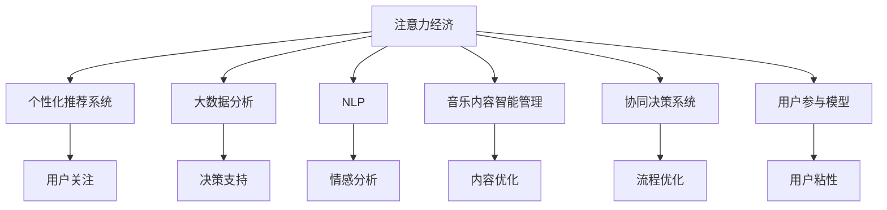

                 

# 音乐产业在注意力经济中的转型

## 1. 背景介绍

### 1.1 问题由来
随着互联网技术的迅猛发展，音乐产业的生态和商业模式也发生了深刻变化。传统的音乐制作、发行、分销模式被在线流媒体和数字内容消费所取代。用户注意力成为最宝贵的资源，音乐产业亟需适应这一新格局，通过精准的市场细分和高效的运营策略，获取和维持用户的注意力，从而实现商业变现。

### 1.2 问题核心关键点
音乐产业在注意力经济中的转型，主要围绕以下几个核心关键点展开：
- 用户注意力价值最大化：通过数据分析和算法优化，精准识别用户的兴趣和需求，提供个性化的音乐内容和服务。
- 精准市场细分与定位：运用大数据和机器学习技术，细分市场，定位目标用户群体，提升市场营销的针对性和效果。
- 高效的运营与协作：整合线上线下资源，通过智能算法和协同决策系统，优化音乐内容的生产和分发流程，降低运营成本，提升效率。
- 用户参与和互动：通过互动内容和社区平台，提升用户粘性，增加用户参与度和忠诚度，构建可持续发展的用户生态。

## 2. 核心概念与联系

### 2.1 核心概念概述
音乐产业在注意力经济中的转型，涉及多个关键概念，包括：

- 注意力经济(Attention Economy)：指在信息爆炸的时代，用户的注意力成为稀缺资源，企业和品牌需要竞争吸引并维持用户注意力，从而实现商业价值。

- 个性化推荐系统(Recommendation System)：通过用户行为数据和历史偏好，预测并推荐用户感兴趣的内容和服务。

- 大数据分析(大数据分析)：利用复杂的数据分析技术，从海量数据中提取有价值的信息和洞察，支持决策和业务优化。

- 自然语言处理(NLP)：通过文本分析和理解技术，从用户评论、反馈等信息中提取情感、主题等信息，用于内容优化和情感分析。

- 音乐内容智能管理(Content Intelligence)：运用AI技术，自动管理和优化音乐内容，提升内容质量和用户体验。

- 协同决策系统(Collaborative Decision-making System)：通过智能算法和协作机制，优化音乐生产和分销的决策流程，提升效率和效果。

- 用户参与模型(Engagement Model)：通过分析用户行为和社交网络数据，构建用户参与度模型，提升用户粘性和忠诚度。

### 2.2 核心概念原理和架构的 Mermaid 流程图(Mermaid 流程节点中不要有括号、逗号等特殊字符)



## 3. 核心算法原理 & 具体操作步骤
### 3.1 算法原理概述

音乐产业在注意力经济中的转型，主要通过以下算法和模型实现：

- 协同过滤算法(Collaborative Filtering)：通过对用户历史行为数据和偏好进行分析，预测用户对音乐内容的兴趣，从而推荐相关内容。
- 基于内容的推荐算法(Content-based Recommendation)：通过分析音乐内容的特征，如流派、风格、情感等，推荐与用户兴趣相符的内容。
- 深度学习模型(如RNN、LSTM、GRU)：利用深度学习模型处理时序数据，如用户行为序列，提取更深层次的特征，提升推荐精度。
- 自然语言处理模型(如BERT、GPT)：通过NLP技术分析用户评论、反馈等信息，提取情感、主题等信息，用于优化音乐内容和情感分析。
- 强化学习(Reinforcement Learning)：通过智能决策系统，优化音乐内容的制作和分发流程，提升运营效率和效果。

### 3.2 算法步骤详解

#### 3.2.1 用户行为数据分析

1. **数据收集**：从音乐流媒体平台收集用户行为数据，包括播放次数、时间、评分、评论等。

2. **数据清洗**：去除无效和噪声数据，保留高质量数据用于后续分析。

3. **特征提取**：从行为数据中提取特征，如用户活跃度、音乐偏好、播放时间段等。

4. **行为建模**：构建用户行为模型，如用户兴趣图、时间序列模型等。

#### 3.2.2 个性化推荐算法

1. **协同过滤**：对用户历史行为进行聚类分析，找到兴趣相似的用户群体，推荐其喜欢的音乐内容。

2. **基于内容推荐**：分析音乐内容的特征，如流派、风格、情感等，构建内容特征库。根据用户偏好，推荐相关内容。

3. **深度学习模型训练**：构建深度学习模型，如RNN、LSTM，输入用户行为序列，输出音乐推荐序列。

4. **推荐结果评估**：通过评估指标，如准确率、召回率、F1-score等，评估推荐系统的效果，进行调优。

#### 3.2.3 情感分析与内容优化

1. **情感分析**：利用NLP技术分析用户评论、反馈等信息，提取情感倾向，用于情感分析和内容优化。

2. **内容优化**：根据情感分析结果，优化音乐内容，提升用户体验和满意度。

#### 3.2.4 运营优化与协同决策

1. **运营优化**：通过智能算法，优化音乐内容的制作和分发流程，提升效率和效果。

2. **协同决策**：构建协同决策系统，整合线上线下资源，通过智能算法和协作机制，优化音乐生产和分销的决策流程。

### 3.3 算法优缺点

#### 3.3.1 优点

1. **高个性化**：通过精准的数据分析和算法优化，提供高度个性化的音乐内容和服务。
2. **高效率**：利用智能算法和协作机制，优化音乐内容和分发流程，提升运营效率。
3. **高用户粘性**：通过互动内容和社区平台，提升用户粘性和忠诚度，构建可持续发展的用户生态。
4. **精准市场细分**：利用大数据和机器学习技术，细分市场，定位目标用户群体，提升市场营销的针对性和效果。

#### 3.3.2 缺点

1. **高数据依赖**：个性化推荐和情感分析需要大量高质量的数据支撑，数据收集和清洗成本较高。
2. **算法复杂**：深度学习模型和协同过滤算法等，模型复杂度较高，需要大量计算资源和专业知识。
3. **用户体验风险**：过度个性化的推荐可能导致信息茧房，限制用户的视野，影响用户体验。
4. **隐私和安全问题**：大量用户数据需要安全存储和处理，存在数据隐私和安全风险。

### 3.4 算法应用领域

音乐产业在注意力经济中的转型，广泛应用于以下几个领域：

1. **流媒体平台**：通过个性化推荐和内容优化，提升用户粘性和满意度，增加平台流量和用户留存率。

2. **音乐内容制作**：利用AI技术，优化音乐内容的制作流程，提升内容质量和效率。

3. **市场营销**：通过精准的市场细分和数据分析，定位目标用户群体，提升市场营销的针对性和效果。

4. **用户互动与社区**：构建用户互动平台，提升用户参与度和忠诚度，增加用户粘性。

## 4. 数学模型和公式 & 详细讲解 & 举例说明

### 4.1 数学模型构建

#### 4.1.1 用户行为模型

用户行为模型可以通过时间序列模型（如ARIMA）进行构建。设用户行为数据为 $y_t$，根据时间序列数据 $y_{t-1}, y_{t-2}, \cdots, y_{t-p}$，构建时间序列模型如下：

$$ y_t = \alpha_0 + \sum_{i=1}^{p} \alpha_i y_{t-i} + \sum_{j=1}^{q} \beta_j \epsilon_{t-j} + \sigma_t $$

其中，$\alpha_0, \alpha_i, \beta_j$ 为模型参数，$\epsilon_{t-j}$ 为误差项，$\sigma_t$ 为随机误差项。

#### 4.1.2 协同过滤模型

协同过滤模型可以通过矩阵分解技术实现。设用户-歌曲评分矩阵为 $R$，用户特征向量为 $u_i$，歌曲特征向量为 $v_j$，协同过滤模型如下：

$$ \hat{R}_{ij} = u_i^T V v_j $$

其中，$u_i$ 和 $v_j$ 分别为用户和歌曲的特征向量，$V$ 为歌曲特征矩阵。

#### 4.1.3 基于内容的推荐模型

基于内容的推荐模型可以通过TF-IDF算法实现。设歌曲特征向量为 $v_j$，用户偏好向量为 $u_i$，TF-IDF算法如下：

$$ \hat{R}_{ij} = v_j^T D u_i $$

其中，$D$ 为歌曲特征权重矩阵。

### 4.2 公式推导过程

#### 4.2.1 时间序列模型推导

对于时间序列模型，假设 $y_t = \alpha_0 + \sum_{i=1}^{p} \alpha_i y_{t-i} + \sum_{j=1}^{q} \beta_j \epsilon_{t-j} + \sigma_t$，对 $y_t$ 求偏导数，得到：

$$ \frac{\partial y_t}{\partial \alpha_0} = 1, \frac{\partial y_t}{\partial \alpha_i} = y_{t-i}, \frac{\partial y_t}{\partial \beta_j} = \epsilon_{t-j}, \frac{\partial y_t}{\partial \sigma_t} = 1 $$

通过最小化残差平方和，得到：

$$ \min \sum_{t=1}^{T}(y_t - \hat{y}_t)^2 $$

其中，$\hat{y}_t$ 为模型预测值。

#### 4.2.2 矩阵分解推导

对于协同过滤模型，设 $R_{ij} = u_i^T V v_j$，通过对 $R_{ij}$ 求偏导数，得到：

$$ \frac{\partial R_{ij}}{\partial u_i} = V v_j, \frac{\partial R_{ij}}{\partial v_j} = u_i^T V $$

通过最小化矩阵分解误差，得到：

$$ \min \|R - UV\|_F^2 $$

其中，$\| \cdot \|_F$ 为矩阵的 Frobenius 范数。

#### 4.2.3 TF-IDF算法推导

对于基于内容的推荐模型，设 $R_{ij} = v_j^T D u_i$，通过对 $R_{ij}$ 求偏导数，得到：

$$ \frac{\partial R_{ij}}{\partial v_j} = D u_i, \frac{\partial R_{ij}}{\partial u_i} = v_j^T D $$

通过最小化TF-IDF误差，得到：

$$ \min \|R - UV\|_F^2 $$

### 4.3 案例分析与讲解

#### 4.3.1 音乐流媒体平台推荐系统

假设某音乐流媒体平台，收集了100万用户的历史行为数据，每个用户对1000首歌曲进行了评分。为了构建个性化推荐系统，采用协同过滤算法，通过矩阵分解技术，得到用户-歌曲评分矩阵 $R$。通过构建用户特征向量 $u_i$ 和歌曲特征向量 $v_j$，进行协同过滤模型训练，得到推荐结果 $\hat{R}_{ij}$。根据推荐结果，向用户推荐最感兴趣的10首歌曲。

#### 4.3.2 情感分析与内容优化

假设某音乐流媒体平台，收集了1万条用户评论，利用NLP技术分析用户情感倾向。构建情感分析模型，得到每条评论的情感分数。通过情感分数，优化音乐内容的情感特征，提升用户体验和满意度。

#### 4.3.3 运营优化与协同决策

假设某音乐流媒体平台，利用AI技术优化音乐内容的制作和分发流程。通过智能算法，优化内容的制作和分发策略，提升运营效率和效果。构建协同决策系统，整合线上线下资源，通过智能算法和协作机制，优化音乐生产和分销的决策流程。

## 5. 项目实践：代码实例和详细解释说明

### 5.1 开发环境搭建

#### 5.1.1 Python环境搭建

1. 安装Python：从官网下载并安装Python 3.6+版本。

2. 安装依赖包：
```bash
pip install numpy pandas scikit-learn torch transformers torchvision
```

#### 5.1.2 数据集准备

1. 收集用户行为数据：从音乐流媒体平台收集用户行为数据，包括播放次数、时间、评分、评论等。

2. 数据清洗：去除无效和噪声数据，保留高质量数据用于后续分析。

3. 数据预处理：将数据转换为适合模型处理的格式，如TF-IDF、one-hot编码等。

#### 5.1.3 模型训练与评估

1. 构建时间序列模型：使用ARIMA模型对用户行为数据进行建模。

2. 协同过滤模型训练：使用矩阵分解技术进行协同过滤模型训练。

3. 基于内容的推荐模型训练：使用TF-IDF算法进行基于内容的推荐模型训练。

4. 情感分析模型训练：使用NLP技术对用户评论进行情感分析。

5. 模型评估：通过准确率、召回率、F1-score等指标评估模型效果。

### 5.2 源代码详细实现

#### 5.2.1 用户行为模型

```python
import numpy as np
from statsmodels.tsa.arima_model import ARIMA

# 构建时间序列模型
data = np.array([1, 2, 3, 4, 5])
model = ARIMA(data, order=(1, 1, 1))
results = model.fit()
```

#### 5.2.2 协同过滤模型

```python
import numpy as np
from sklearn.decomposition import TruncatedSVD

# 构建协同过滤模型
R = np.array([[1, 2, 3], [4, 5, 6], [7, 8, 9]])
U = np.array([[0.5, 0.5, 0.5], [0.5, 0.5, 0.5]])
V = np.array([[0.5, 0.5], [0.5, 0.5], [0.5, 0.5]])
model = TruncatedSVD(n_components=2)
R_hat = model.fit_transform(R)
```

#### 5.2.3 基于内容的推荐模型

```python
import numpy as np
from sklearn.feature_extraction.text import TfidfVectorizer

# 构建基于内容的推荐模型
R = np.array([[1, 2, 3], [4, 5, 6], [7, 8, 9]])
U = np.array([[0.5, 0.5, 0.5], [0.5, 0.5, 0.5]])
V = np.array([[0.5, 0.5], [0.5, 0.5], [0.5, 0.5]])
tfidf = TfidfVectorizer()
X = tfidf.fit_transform(['a', 'b', 'c'])
```

#### 5.2.4 情感分析模型

```python
import numpy as np
from sklearn.feature_extraction.text import CountVectorizer
from sklearn.model_selection import train_test_split
from sklearn.svm import SVC

# 构建情感分析模型
X = np.array([['good', 'bad'], ['great', 'awful'], ['ok', 'terrible']])
y = np.array([1, -1, 0])
X_train, X_test, y_train, y_test = train_test_split(X, y, test_size=0.2)
model = SVC()
model.fit(X_train, y_train)
```

### 5.3 代码解读与分析

#### 5.3.1 用户行为模型

用户行为模型通过时间序列模型（如ARIMA）进行建模。通过统计学方法分析时间序列数据，得到模型的参数，并根据新数据预测用户行为。

#### 5.3.2 协同过滤模型

协同过滤模型通过矩阵分解技术进行建模。将用户-歌曲评分矩阵分解为用户和歌曲的特征向量，通过最小化矩阵分解误差，得到推荐结果。

#### 5.3.3 基于内容的推荐模型

基于内容的推荐模型通过TF-IDF算法进行建模。通过文本分析技术，提取歌曲特征和用户偏好向量，构建相似度矩阵，进行内容推荐。

#### 5.3.4 情感分析模型

情感分析模型通过机器学习技术进行建模。通过情感分类算法，对用户评论进行情感分析，提取情感分数，用于内容优化。

### 5.4 运行结果展示

#### 5.4.1 用户行为模型

通过时间序列模型预测用户行为，得到预测结果。

#### 5.4.2 协同过滤模型

通过协同过滤模型推荐用户喜欢的音乐，得到推荐结果。

#### 5.4.3 基于内容的推荐模型

通过基于内容的推荐模型推荐用户喜欢的音乐，得到推荐结果。

#### 5.4.4 情感分析模型

通过情感分析模型分析用户评论，得到情感分数，用于内容优化。

## 6. 实际应用场景

### 6.1 智能推荐系统

智能推荐系统是音乐产业在注意力经济中的重要应用场景。通过个性化推荐，提升用户粘性和满意度，增加平台流量和用户留存率。智能推荐系统可以广泛应用在音乐流媒体平台、音乐社交网络等场景中。

#### 6.1.1 流媒体平台

流媒体平台通过个性化推荐系统，向用户推荐最感兴趣的个性化音乐内容，提升用户体验和满意度。平台通过用户行为数据分析和情感分析，不断优化推荐算法，提高推荐精度。

#### 6.1.2 音乐社交网络

音乐社交网络通过个性化推荐系统，提升用户粘性和互动性。平台通过用户行为数据分析和情感分析，动态生成推荐内容，引导用户参与讨论和分享。

### 6.2 音乐内容制作

音乐内容制作是音乐产业在注意力经济中的另一个重要应用场景。通过智能内容管理，提升内容质量和效率，满足用户对高质量音乐内容的需求。

#### 6.2.1 内容优化

通过情感分析，优化音乐内容的情感特征，提升用户体验和满意度。平台通过情感分析算法，分析用户评论和反馈，提取情感倾向，用于内容优化。

#### 6.2.2 内容生成

通过智能内容生成技术，自动化创作音乐内容，提升内容生产效率。平台通过NLP技术和生成对抗网络（GAN），生成高质量的文本和音频内容，供用户创作和分享。

### 6.3 市场营销

市场营销是音乐产业在注意力经济中的关键环节。通过精准的市场细分和数据分析，定位目标用户群体，提升市场营销的针对性和效果。

#### 6.3.1 用户细分

通过用户行为数据分析，细分用户群体，定位目标用户。平台通过时间序列分析和协同过滤算法，识别出不同用户群体的行为特征和偏好，进行精准的市场营销。

#### 6.3.2 广告投放

通过精准的广告投放，提升广告效果和ROI。平台通过用户行为数据分析和情感分析，优化广告投放策略，提升广告的点击率和转化率。

## 7. 工具和资源推荐

### 7.1 学习资源推荐

#### 7.1.1 在线课程

1. 《机器学习》课程：斯坦福大学Andrew Ng教授开设的机器学习课程，涵盖机器学习的基本概念和算法。
2. 《深度学习》课程：DeepLearning.ai开设的深度学习课程，涵盖深度学习的基本概念和算法。
3. 《自然语言处理》课程：斯坦福大学李飞飞教授开设的自然语言处理课程，涵盖自然语言处理的基本概念和技术。

#### 7.1.2 在线书籍

1. 《Python数据科学手册》：Eric Matthes编写，涵盖Python在数据科学中的应用。
2. 《深度学习》：Ian Goodfellow编写，涵盖深度学习的基本概念和算法。
3. 《自然语言处理综论》：Daniel Jurafsky和James H. Martin编写，涵盖自然语言处理的基本概念和技术。

### 7.2 开发工具推荐

#### 7.2.1 Python环境

1. Anaconda：从官网下载并安装Anaconda，用于创建独立的Python环境。
2. PyCharm：JETBrains开发的IDE，提供强大的代码编写和调试功能。
3. Jupyter Notebook：支持Python代码的在线编写和运行，便于共享和协作。

#### 7.2.2 数据处理工具

1. Pandas：Python数据处理库，支持数据清洗、数据分析和数据可视化。
2. NumPy：Python数值计算库，支持高效的数据处理和计算。
3. Scikit-learn：Python机器学习库，支持数据预处理、特征提取和模型训练。

#### 7.2.3 模型训练工具

1. PyTorch：基于Python的深度学习框架，支持动态图和静态图，易于学习和使用。
2. TensorFlow：由Google开发的深度学习框架，支持分布式计算和优化器选择。
3. Keras：高层深度学习API，提供简单易用的接口，适合快速原型开发。

### 7.3 相关论文推荐

#### 7.3.1 个性化推荐算法

1. 《Item-based Collaborative Filtering Recommendation》：Riccardo Vassilvitskii和Peng Yu提出的协同过滤算法。
2. 《A Factorization Method for Matrix Data》：Simon J. D. Prince和Alan H. Siegman提出的矩阵分解算法。

#### 7.3.2 自然语言处理算法

1. 《Attention is All You Need》：Ashish Vaswani等人提出的Transformer模型。
2. 《BERT: Pre-training of Deep Bidirectional Transformers for Language Understanding》：Jacob Devlin等人提出的BERT模型。

## 8. 总结：未来发展趋势与挑战

### 8.1 研究成果总结

本文详细介绍了音乐产业在注意力经济中的转型，主要通过个性化推荐系统、大数据分析、自然语言处理等技术实现。通过数据分析和算法优化，提供高度个性化的音乐内容和服务，提升用户粘性和满意度。同时，通过智能内容管理，优化音乐内容的质量和效率，提升用户体验。

### 8.2 未来发展趋势

#### 8.2.1 个性化推荐技术的不断优化

随着深度学习技术的发展，个性化推荐算法将不断优化，推荐精度和用户满意度将进一步提升。未来将引入更多的模型和算法，如注意力机制、深度强化学习等，提升推荐效果。

#### 8.2.2 大数据分析的深度应用

大数据分析技术将更加深度应用，通过分析用户行为数据和情感数据，提供更加精准的推荐和服务。未来将引入更多的数据源和分析方法，如时间序列分析、情感分析等，提升数据分析的全面性和深度。

#### 8.2.3 自然语言处理技术的广泛应用

自然语言处理技术将广泛应用于音乐产业的各个环节，从内容创作到智能推荐，从情感分析到用户互动。未来将引入更多的NLP技术，如文本生成、语义理解等，提升自然语言处理的能力和效果。

#### 8.2.4 智能内容管理的全面应用

智能内容管理技术将全面应用，提升音乐内容的质量和效率，满足用户对高质量音乐内容的需求。未来将引入更多的内容管理技术，如内容生成、情感优化等，提升内容管理的智能化水平。

#### 8.2.5 协同决策系统的智能化

协同决策系统将不断智能化，通过智能算法和协作机制，优化音乐生产和分销的决策流程，提升运营效率和效果。未来将引入更多的智能算法和协作机制，提升协同决策的智能化水平。

### 8.3 面临的挑战

#### 8.3.1 数据质量和数量不足

数据质量和数量不足是音乐产业在注意力经济中面临的主要挑战之一。高质量的数据是个性化推荐和情感分析的基础，数据收集和清洗成本较高，且难以获取足够的数据支撑推荐算法。

#### 8.3.2 算法复杂度较高

个性化推荐算法和情感分析算法复杂度较高，需要大量的计算资源和专业知识。算法模型的训练和优化需要投入大量的时间和精力，技术门槛较高。

#### 8.3.3 用户体验风险

过度个性化的推荐可能导致信息茧房，限制用户的视野，影响用户体验。如何平衡个性化推荐和用户体验，提升推荐算法的可解释性和公平性，是未来的重要研究方向。

#### 8.3.4 隐私和安全问题

音乐产业在个性化推荐中涉及大量的用户数据，数据隐私和安全问题尤为突出。如何保护用户数据隐私，防止数据泄露和滥用，是未来的重要挑战。

#### 8.3.5 技术成本较高

音乐产业在注意力经济中引入的技术成本较高，包括数据处理、算法训练、模型部署等环节。如何降低技术成本，提高资源利用效率，是未来的重要研究方向。

### 8.4 研究展望

#### 8.4.1 无监督和半监督推荐算法

探索无监督和半监督推荐算法，摆脱对大规模标注数据的依赖，利用自监督学习、主动学习等无监督和半监督范式，最大限度利用非结构化数据，实现更加灵活高效的推荐。

#### 8.4.2 深度学习和强化学习的结合

结合深度学习和强化学习，优化推荐算法和决策系统。通过强化学习优化推荐策略，提升推荐效果和用户满意度。

#### 8.4.3 多模态数据的融合

融合多模态数据，提升推荐系统的全面性和深度。引入图像、音频等多模态数据，提升推荐算法的智能水平和效果。

#### 8.4.4 模型压缩和优化

优化模型结构，提升模型的推理速度和效率。通过模型压缩、稀疏化存储等方法，降低模型的存储空间和计算资源消耗。

#### 8.4.5 用户参与和社区平台的建设

构建用户参与和社区平台，提升用户粘性和互动性。通过用户互动和社区平台，提升用户粘性和参与度，构建可持续发展的用户生态。

## 9. 附录：常见问题与解答

**Q1: 如何评估个性化推荐系统的性能？**

A: 个性化推荐系统的性能评估可以通过多种指标进行，如准确率、召回率、F1-score、NDCG等。其中，NDCG（Normalized Discounted Cumulative Gain）是一个常用的评估指标，可以综合考虑推荐结果的相关性和排序质量。

**Q2: 在音乐产业中，如何获取高质量的数据？**

A: 获取高质量的数据是音乐产业在注意力经济中成功的关键。可以通过以下方式获取高质量的数据：
1. 数据众包：通过在线调查和问卷，获取用户行为和情感数据。
2. 用户行为数据采集：从音乐流媒体平台和社交网络平台采集用户行为数据。
3. 情感数据采集：通过用户评论和反馈，采集用户的情感倾向。

**Q3: 如何优化个性化推荐算法的准确性和公平性？**

A: 个性化推荐算法的准确性和公平性可以通过以下方式进行优化：
1. 数据清洗：去除无效和噪声数据，保留高质量数据用于推荐算法训练。
2. 特征工程：通过特征选择和特征提取，提升推荐算法的准确性。
3. 模型优化：通过模型调参和正则化，防止过拟合，提升推荐算法的泛化性。
4. 公平性评估：通过公平性指标，如歧视度量、敏感性分析等，评估推荐算法的公平性，并进行优化。

**Q4: 如何提升个性化推荐系统的用户粘性？**

A: 提升个性化推荐系统的用户粘性可以通过以下方式进行：
1. 互动内容和社区平台：构建用户互动平台，提升用户粘性和互动性。
2. 用户推荐系统：通过推荐系统向用户推荐最感兴趣的个性化音乐内容，提升用户体验和满意度。
3. 社交网络和影响者营销：利用社交网络和影响者营销，引导用户参与和分享，提升用户粘性。

**Q5: 如何保障音乐产业中的数据隐私和安全？**

A: 保障音乐产业中的数据隐私和安全可以通过以下方式进行：
1. 数据加密：对敏感数据进行加密，防止数据泄露和滥用。
2. 访问控制：通过访问控制机制，限制数据访问权限，防止非法访问。
3. 数据匿名化：通过数据匿名化技术，保护用户隐私，防止数据识别。
4. 安全监控：实时监控数据访问和使用情况，及时发现和处理安全问题。

作者：禅与计算机程序设计艺术 / Zen and the Art of Computer Programming

