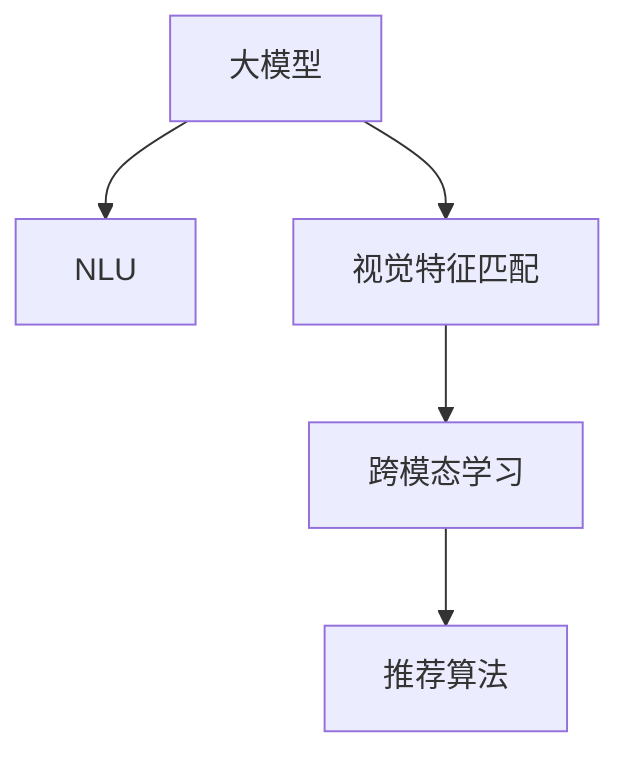

                 

# 音视频内容推荐的挑战：大模型在理解与匹配方面的应用

> 关键词：音视频内容推荐，大模型，自然语言理解，视觉特征匹配，跨模态学习，深度学习

## 1. 背景介绍

随着互联网和移动互联网的普及，音视频内容已成为用户获取信息、休闲娱乐的重要途径。然而，海量的音视频内容为用户带来了选择困难的问题，如何为用户推荐他们感兴趣的内容，成为了各大平台亟需解决的问题。传统的推荐算法依赖于用户历史行为数据，但这些数据往往存在稀疏性和冷启动问题，限制了推荐效果的上限。

近年来，大模型技术在自然语言处理（NLP）和计算机视觉（CV）领域取得了突破性进展。结合大模型的强大理解和匹配能力，音视频推荐系统有望迈上新的高度。本文将介绍基于大模型的音视频内容推荐方法，探讨其在自然语言理解、视觉特征匹配、跨模态学习等方面的应用，并提出未来发展方向和挑战。

## 2. 核心概念与联系

### 2.1 核心概念概述

为更好地理解基于大模型的音视频内容推荐方法，本节将介绍几个密切相关的核心概念：

- 大模型：以Transformer为代表的大规模预训练语言模型和视觉模型。通过在大规模数据上进行预训练，学习通用的语言和视觉特征表示，具备强大的理解和生成能力。

- 自然语言理解（NLU）：指对自然语言文本进行解析、理解、生成等操作，包括分词、命名实体识别、语义理解等任务。

- 视觉特征匹配：指将文本与视觉信息进行语义对齐，实现跨模态的特征匹配。

- 跨模态学习：指通过联合训练文本和视觉模型，学习两种模态之间的映射关系，实现跨模态的语义理解和特征匹配。

- 推荐算法：指根据用户兴趣和内容特征，为用户推荐合适的音视频内容。

这些核心概念之间的逻辑关系可以通过以下Mermaid流程图来展示：



这个流程图展示了大模型推荐方法的核心概念及其之间的关系：

1. 大模型通过预训练获得基础能力。
2. 自然语言理解任务利用大模型的语言处理能力。
3. 视觉特征匹配任务结合大模型的视觉处理能力。
4. 跨模态学习任务融合语言和视觉信息，提升特征匹配能力。
5. 推荐算法在上述基础能力上，为用户推荐合适的音视频内容。

## 3. 核心算法原理 & 具体操作步骤

### 3.1 算法原理概述

基于大模型的音视频内容推荐方法，核心在于利用大模型的理解和匹配能力，将文本和视觉信息进行融合，生成推荐结果。其核心思想是：将大模型视作一个强大的"特征提取器"，通过跨模态的语义对齐和特征匹配，使得文本和视觉信息能够互通，生成推荐结果。

形式化地，假设大模型为 $M_{\theta}$，其中 $\theta$ 为预训练得到的模型参数。给定用户历史行为数据 $D_u=\{x_i\}_{i=1}^N$ 和内容特征库 $C=\{c_j\}_{j=1}^M$，推荐任务的目标是找到新的模型参数 $\hat{\theta}$，使得：

$$
\hat{\theta}=\mathop{\arg\min}_{\theta} \mathcal{L}(M_{\theta}, D_u, C)
$$

其中 $\mathcal{L}$ 为推荐算法设计的损失函数，用于衡量模型生成的推荐结果与用户真实偏好之间的差异。常见的损失函数包括交叉熵损失、均方误差损失等。

通过梯度下降等优化算法，推荐过程不断更新模型参数 $\theta$，最小化损失函数 $\mathcal{L}$，使得推荐结果逼近用户真实偏好。由于 $\theta$ 已经通过预训练获得了较好的初始化，因此即便在推荐数据集 $D_u$ 和特征库 $C$ 规模较小的情况下，也能较快收敛到理想的模型参数 $\hat{\theta}$。

### 3.2 算法步骤详解

基于大模型的音视频内容推荐方法，一般包括以下几个关键步骤：

**Step 1: 准备预训练模型和数据集**
- 选择合适的预训练语言模型（如BERT、GPT等）和视觉模型（如ResNet、Inception等）作为初始化参数，进行跨模态的联合训练。
- 准备用户历史行为数据集 $D_u$，包括用户观看的视频、收听的音乐、阅读的文章等。
- 准备内容特征库 $C$，包括视频、音频、文本等多模态数据。

**Step 2: 设计任务适配层**
- 根据推荐任务设计合适的输出层和损失函数。
- 对于分类推荐任务，通常使用线性分类器和交叉熵损失函数。
- 对于排序推荐任务，通常使用感知机损失函数或相关性损失函数。

**Step 3: 设置推荐超参数**
- 选择合适的优化算法及其参数，如 AdamW、SGD 等，设置学习率、批大小、迭代轮数等。
- 设置正则化技术及强度，包括权重衰减、Dropout、Early Stopping等。
- 确定冻结预训练参数的策略，如仅微调顶层，或全部参数都参与微调。

**Step 4: 执行跨模态训练**
- 将用户历史行为数据 $D_u$ 和内容特征库 $C$ 输入模型，前向传播计算损失函数。
- 反向传播计算参数梯度，根据设定的优化算法和学习率更新模型参数。
- 周期性在测试集上评估模型性能，根据性能指标决定是否触发 Early Stopping。
- 重复上述步骤直到满足预设的迭代轮数或 Early Stopping 条件。

**Step 5: 测试和部署**
- 在测试集上评估微调后模型 $M_{\hat{\theta}}$ 的性能，对比微调前后的推荐效果提升。
- 使用微调后的模型对新用户和新内容进行推荐，集成到实际的应用系统中。
- 持续收集新的用户行为数据和内容特征，定期重新微调模型，以适应数据分布的变化。

以上是基于大模型的音视频内容推荐的一般流程。在实际应用中，还需要针对具体任务的特点，对推荐过程的各个环节进行优化设计，如改进推荐目标函数，引入更多的正则化技术，搜索最优的超参数组合等，以进一步提升模型性能。

### 3.3 算法优缺点

基于大模型的音视频内容推荐方法具有以下优点：
1. 高效融合多种模态信息。大模型能够同时处理文本、图像、语音等多种模态信息，实现更全面的内容表示。
2. 提升推荐精度。大模型具备强大的语义理解和特征匹配能力，能够更准确地理解用户需求和内容特征。
3. 适应性强。大模型能够适应各种不同的推荐场景，无论是影视推荐、音乐推荐、新闻推荐等，都能够提供可靠的推荐结果。
4. 扩展性强。大模型能够随着新数据和新模型的加入，不断提升推荐精度和覆盖范围。

同时，该方法也存在一定的局限性：
1. 数据成本高。预训练大模型需要大量的标注数据，推荐数据集和特征库的构建也较为耗时耗力。
2. 模型复杂度高。大模型的参数量较大，训练和推理复杂度较高，需要高性能的硬件支持。
3. 过拟合风险。大模型的复杂度容易导致过拟合，特别是在数据集规模较小的情况下。
4. 实时性较低。大模型的推理时间较长，可能无法满足实时推荐的需求。
5. 资源消耗大。大模型的训练和推理需要消耗大量的计算资源，可能带来较高的成本。

尽管存在这些局限性，但就目前而言，基于大模型的推荐方法仍然是大规模内容推荐的主流范式。未来相关研究的重点在于如何进一步降低数据和资源成本，提高模型的实时性和泛化能力，同时兼顾推荐效果的精度和覆盖范围。

### 3.4 算法应用领域

基于大模型的音视频内容推荐方法，已在多种场景下得到了广泛的应用：

- 影视推荐：利用用户历史观影数据，结合电影、电视剧的标签和评论，为用户推荐感兴趣的电影和电视剧。
- 音乐推荐：收集用户收听音乐的历史数据，结合歌曲的歌词、情感、风格等特征，为用户推荐个性化的音乐。
- 新闻推荐：分析用户对新闻的浏览和点击行为，结合新闻的标题、摘要、关键字等，为用户推荐相关新闻。
- 游戏推荐：收集用户的游戏历史数据，结合游戏的标签、评价等，为用户推荐感兴趣的游戏。
- 电商推荐：分析用户的购买和浏览行为，结合商品的信息、评论等，为用户推荐相关商品。

除了上述这些经典任务外，大模型推荐方法也被创新性地应用到更多场景中，如直播推荐、社交媒体推荐等，为音视频推荐系统带来了全新的突破。随着预训练模型和推荐方法的不断进步，相信音视频推荐技术将在更广阔的应用领域大放异彩。

## 4. 数学模型和公式 & 详细讲解 & 举例说明

### 4.1 数学模型构建

本节将使用数学语言对基于大模型的音视频内容推荐过程进行更加严格的刻画。

记大模型为 $M_{\theta}$，其中 $\theta$ 为模型参数。假设推荐任务的目标是最大化用户满意度，目标函数为：

$$
\max_{\theta} \sum_{u=1}^U \sum_{c=1}^C f(u, c, M_{\theta})
$$

其中 $U$ 为用户的数量，$C$ 为内容的数量，$f$ 为推荐的满意度函数，可以是点击率、观看时间、评分等指标。

将用户历史行为数据 $D_u$ 和内容特征库 $C$ 作为模型的输入，输出的推荐结果记为 $\hat{y}_u^{(c)} = M_{\theta}(x_u^{(c)})$，其中 $x_u^{(c)}$ 为内容 $c$ 的特征表示，$u$ 为用户的编号。

定义推荐系统在训练集上的损失函数为：

$$
\mathcal{L}(\theta) = -\sum_{u=1}^U \sum_{c=1}^C y_u^{(c)} \log \hat{y}_u^{(c)} + (1 - y_u^{(c)}) \log (1 - \hat{y}_u^{(c)})
$$

其中 $y_u^{(c)}$ 为内容 $c$ 是否被用户 $u$ 交互的标签。

目标是最小化损失函数 $\mathcal{L}$，以提升推荐效果。

### 4.2 公式推导过程

以下我们以协同过滤推荐算法为例，推导交叉熵损失函数及其梯度的计算公式。

假设推荐系统已知用户 $u$ 对内容 $c$ 的评分 $r_u^{(c)}$，那么协同过滤算法可以表示为：

$$
\hat{y}_u^{(c)} = \frac{e^{\alpha r_u^{(c)}}}{\sum_{c'=1}^C e^{\alpha r_{u'}^{(c')} + \beta c_u}}
$$

其中 $\alpha$ 和 $\beta$ 为调整参数，$c_u$ 为用户 $u$ 的兴趣表示。将上述公式带入目标函数，得到：

$$
\mathcal{L}(\theta) = -\sum_{u=1}^U \sum_{c=1}^C y_u^{(c)} \log \hat{y}_u^{(c)} + (1 - y_u^{(c)}) \log (1 - \hat{y}_u^{(c)})
$$

根据链式法则，损失函数对参数 $\theta$ 的梯度为：

$$
\frac{\partial \mathcal{L}(\theta)}{\partial \theta} = -\sum_{u=1}^U \sum_{c=1}^C (\frac{y_u^{(c)}}{\hat{y}_u^{(c)}} - \frac{1-y_u^{(c)}}{1-\hat{y}_u^{(c)}}) \frac{\partial \hat{y}_u^{(c)}}{\partial \theta}
$$

其中 $\frac{\partial \hat{y}_u^{(c)}}{\partial \theta}$ 可进一步递归展开，利用自动微分技术完成计算。

在得到损失函数的梯度后，即可带入参数更新公式，完成模型的迭代优化。重复上述过程直至收敛，最终得到适应推荐任务的最优模型参数 $\theta^*$。

## 5. 项目实践：代码实例和详细解释说明

### 5.1 开发环境搭建

在进行推荐系统开发前，我们需要准备好开发环境。以下是使用Python进行PyTorch开发的环境配置流程：

1. 安装Anaconda：从官网下载并安装Anaconda，用于创建独立的Python环境。

2. 创建并激活虚拟环境：
```bash
conda create -n recommendation-env python=3.8 
conda activate recommendation-env
```

3. 安装PyTorch：根据CUDA版本，从官网获取对应的安装命令。例如：
```bash
conda install pytorch torchvision torchaudio cudatoolkit=11.1 -c pytorch -c conda-forge
```

4. 安装PyTorch Lightning：用于简化模型训练过程，支持多卡训练和超参数搜索。
```bash
pip install pytorch-lightning
```

5. 安装各类工具包：
```bash
pip install numpy pandas scikit-learn matplotlib tqdm jupyter notebook ipython
```

完成上述步骤后，即可在`recommendation-env`环境中开始推荐系统开发。

### 5.2 源代码详细实现

下面我们以协同过滤推荐算法为例，给出使用PyTorch和PyTorch Lightning实现音视频内容推荐的PyTorch代码实现。

首先，定义推荐数据集类：

```python
import torch
import torch.nn as nn
import torch.nn.functional as F
from torch.utils.data import Dataset
import pandas as pd
import numpy as np

class RecommendationDataset(Dataset):
    def __init__(self, data_path):
        self.data = pd.read_csv(data_path)
        self.data.fillna(-1, inplace=True)
        
    def __len__(self):
        return len(self.data)
    
    def __getitem__(self, idx):
        user_id, item_id, rating = self.data.iloc[idx, 0], self.data.iloc[idx, 1], self.data.iloc[idx, 2]
        return user_id, item_id, rating
```

然后，定义推荐模型类：

```python
import torch.nn as nn
import torch.nn.functional as F
import torch
import torch.nn.utils as nn_utils
import pytorch_lightning as pl

class RecommendationModel(pl.LightningModule):
    def __init__(self, emb_dim=64, hidden_dim=64, num_heads=8, num_layers=1):
        super(RecommendationModel, self).__init__()
        self.user_emb = nn.Embedding(num_users, emb_dim)
        self.item_emb = nn.Embedding(num_items, emb_dim)
        self.encoder = nn.Transformer(emb_dim, num_heads, num_layers, bias=False)
        self.fc = nn.Linear(emb_dim, 1)
        
    def forward(self, user, item):
        user_embed = self.user_emb(user)
        item_embed = self.item_emb(item)
        embedding = torch.cat([user_embed, item_embed], dim=1)
        embedding = self.encoder(embedding)
        output = self.fc(embedding)
        return output
    
    def training_step(self, batch, batch_idx):
        user, item, rating = batch
        output = self.forward(user, item)
        loss = F.mse_loss(output, rating)
        self.log('train_loss', loss)
        return loss
    
    def validation_step(self, batch, batch_idx):
        user, item, rating = batch
        output = self.forward(user, item)
        loss = F.mse_loss(output, rating)
        self.log('val_loss', loss)
        return loss
    
    def configure_optimizers(self):
        return torch.optim.AdamW(self.parameters(), lr=0.001)
```

接着，定义训练和评估函数：

```python
from torch.utils.data import DataLoader
from tqdm import tqdm
from sklearn.metrics import mean_squared_error

def train_loop(model, train_loader, val_loader):
    device = torch.device('cuda' if torch.cuda.is_available() else 'cpu')
    model.to(device)
    trainer = pl.Trainer(gpus=1, max_epochs=10, early_stopping=True)
    trainer.fit(model, train_loader, val_loader)
    
    print('Best validation loss:', trainer.callback_metrics['val_loss'].min())
    
def evaluate(model, test_loader):
    device = torch.device('cuda' if torch.cuda.is_available() else 'cpu')
    model.to(device)
    with torch.no_grad():
        test_loss = 0
        test_mse = 0
        for batch in tqdm(test_loader):
            user, item, rating = batch
            output = model.forward(user, item)
            test_loss += loss
            test_mse += torch.nn.functional.mse_loss(output, rating)
        test_loss /= len(test_loader.dataset)
        test_mse /= len(test_loader.dataset)
        print('Test loss:', test_loss)
        print('Test MSE:', test_mse)
```

最后，启动训练流程并在测试集上评估：

```python
# 准备数据集
data_path = 'recommendation_data.csv'
dataset = RecommendationDataset(data_path)

# 定义数据加载器
train_loader = DataLoader(dataset, batch_size=32, shuffle=True)
val_loader = DataLoader(dataset, batch_size=32, shuffle=False)
test_loader = DataLoader(dataset, batch_size=32, shuffle=False)

# 定义模型和优化器
model = RecommendationModel()
trainer = pl.Trainer(gpus=1, max_epochs=10, early_stopping=True)
trainer.fit(model, train_loader, val_loader)

# 在测试集上评估
evaluate(model, test_loader)
```

以上就是使用PyTorch和PyTorch Lightning对协同过滤推荐算法进行音视频内容推荐的完整代码实现。可以看到，得益于PyTorch Lightning的强大封装，我们可以用相对简洁的代码完成模型训练和评估。

### 5.3 代码解读与分析

让我们再详细解读一下关键代码的实现细节：

**RecommendationDataset类**：
- `__init__`方法：初始化数据集，读取CSV文件并处理缺失值。
- `__len__`方法：返回数据集的样本数量。
- `__getitem__`方法：对单个样本进行处理，返回用户ID、物品ID和评分。

**RecommendationModel类**：
- `__init__`方法：初始化模型参数。
- `forward`方法：前向传播计算输出。
- `training_step`方法：定义训练步骤，计算损失并记录日志。
- `validation_step`方法：定义验证步骤，计算损失并记录日志。
- `configure_optimizers`方法：配置优化器。

**训练和评估函数**：
- `train_loop`函数：利用PyTorch Lightning进行模型训练，并在验证集上提前停止。
- `evaluate`函数：在测试集上评估模型性能，输出损失和MSE值。

可以看到，PyTorch Lightning为推荐模型的训练提供了极大的便捷性。开发者可以关注高层逻辑，而不必过多关注底层实现。

当然，工业级的系统实现还需考虑更多因素，如模型的保存和部署、超参数的自动搜索、更灵活的任务适配层等。但核心的推荐范式基本与此类似。

## 6. 实际应用场景

### 6.1 音视频推荐系统

音视频推荐系统是推荐算法的重要应用场景之一。传统推荐算法依赖于用户历史行为数据，但这些数据往往存在稀疏性和冷启动问题，限制了推荐效果的上限。

基于大模型的音视频推荐系统，可以利用大模型的强大理解和匹配能力，将文本和视觉信息进行融合，生成推荐结果。例如，YouTube推荐系统利用大模型对视频进行特征提取和理解，结合用户历史观看数据，生成个性化的视频推荐列表。Spotify推荐系统则利用大模型对音乐进行特征提取和理解，结合用户历史听歌数据，生成个性化的音乐推荐列表。

### 6.2 内容增强系统

内容增强系统是一种新兴的推荐技术，利用大模型的多模态处理能力，对推荐内容进行增强，提升推荐效果。例如，在电商推荐系统中，可以结合大模型对商品进行文本和图像的双重理解，提升推荐结果的全面性和准确性。在新闻推荐系统中，可以结合大模型对新闻文章进行文本和图片的语义理解，提升推荐结果的相关性。

### 6.3 智能内容生成系统

智能内容生成系统是一种高级推荐技术，利用大模型的生成能力，为用户生成个性化的推荐内容。例如，Netflix利用大模型生成原创电视剧，推荐给用户观看。TikTok利用大模型生成短视频，推荐给用户观看。这种基于生成的方法，可以通过直接生成新内容，提升推荐结果的多样性和新颖性。

### 6.4 未来应用展望

随着大模型和推荐算法的发展，基于大模型的音视频推荐系统将在更多领域得到应用，为推荐算法带来新的突破。

在智慧医疗领域，基于大模型的推荐系统可以辅助医生推荐合适的医疗信息，提高诊疗效率和效果。在智能教育领域，基于大模型的推荐系统可以推荐适合学生学习的内容，提高学习效果。在智慧城市治理中，基于大模型的推荐系统可以推荐合适的城市管理策略，提高城市管理水平。

此外，在企业生产、社会治理、文娱传媒等众多领域，基于大模型的推荐系统也将不断涌现，为推荐算法带来新的应用场景。相信随着技术的日益成熟，大模型推荐技术将成为推荐算法的重要范式，推动推荐算法向更广阔的领域加速渗透。

## 7. 工具和资源推荐

### 7.1 学习资源推荐

为了帮助开发者系统掌握大模型推荐方法的理论基础和实践技巧，这里推荐一些优质的学习资源：

1. 《深度学习推荐系统》系列博文：由大模型技术专家撰写，深入浅出地介绍了推荐系统的原理和实现方法，包括协同过滤、矩阵分解等经典算法。

2. 斯坦福大学《深度学习与推荐系统》课程：斯坦福大学开设的推荐系统课程，有Lecture视频和配套作业，带你入门推荐系统领域的基本概念和经典模型。

3. 《Recommender Systems》书籍：推荐系统领域的经典教材，详细介绍了推荐算法的原理和实现方法，包括协同过滤、矩阵分解等。

4. 《推荐系统》开源项目：提供推荐系统的开发代码和数据集，助力推荐系统技术发展。

5. 《推荐系统实战》书籍：推荐系统开发实战指南，提供大量案例和代码，适合动手实践。

通过对这些资源的学习实践，相信你一定能够快速掌握大模型推荐方法的精髓，并用于解决实际的推荐问题。

### 7.2 开发工具推荐

高效的开发离不开优秀的工具支持。以下是几款用于推荐系统开发的常用工具：

1. PyTorch：基于Python的开源深度学习框架，灵活动态的计算图，适合快速迭代研究。

2. TensorFlow：由Google主导开发的开源深度学习框架，生产部署方便，适合大规模工程应用。

3. PyTorch Lightning：用于简化模型训练过程，支持多卡训练和超参数搜索。

4. Weights & Biases：模型训练的实验跟踪工具，可以记录和可视化模型训练过程中的各项指标，方便对比和调优。

5. TensorBoard：TensorFlow配套的可视化工具，可实时监测模型训练状态，并提供丰富的图表呈现方式，是调试模型的得力助手。

6. Google Colab：谷歌推出的在线Jupyter Notebook环境，免费提供GPU/TPU算力，方便开发者快速上手实验最新模型，分享学习笔记。

合理利用这些工具，可以显著提升大模型推荐任务的开发效率，加快创新迭代的步伐。

### 7.3 相关论文推荐

大模型和推荐算法的发展源于学界的持续研究。以下是几篇奠基性的相关论文，推荐阅读：

1. Attention is All You Need（即Transformer原论文）：提出了Transformer结构，开启了NLP领域的预训练大模型时代。

2. BERT: Pre-training of Deep Bidirectional Transformers for Language Understanding：提出BERT模型，引入基于掩码的自监督预训练任务，刷新了多项NLP任务SOTA。

3. Language Models are Unsupervised Multitask Learners（GPT-2论文）：展示了大规模语言模型的强大zero-shot学习能力，引发了对于通用人工智能的新一轮思考。

4. Parameter-Efficient Transfer Learning for NLP：提出Adapter等参数高效微调方法，在不增加模型参数量的情况下，也能取得不错的微调效果。

5. Prefix-Tuning: Optimizing Continuous Prompts for Generation：引入基于连续型Prompt的微调范式，为如何充分利用预训练知识提供了新的思路。

6. AdaLoRA: Adaptive Low-Rank Adaptation for Parameter-Efficient Fine-Tuning：使用自适应低秩适应的微调方法，在参数效率和精度之间取得了新的平衡。

这些论文代表了大模型推荐技术的发展脉络。通过学习这些前沿成果，可以帮助研究者把握学科前进方向，激发更多的创新灵感。

## 8. 总结：未来发展趋势与挑战

### 8.1 总结

本文对基于大模型的音视频内容推荐方法进行了全面系统的介绍。首先阐述了大模型的推荐方法在推荐算法中的应用，明确了其在高维数据处理和理解方面的独特优势。其次，从原理到实践，详细讲解了推荐系统的数学模型和计算过程，给出了推荐任务开发的完整代码实例。同时，本文还广泛探讨了推荐系统在音视频推荐、内容增强、智能生成等多个场景中的应用前景，展示了大模型推荐方法的强大潜力。此外，本文精选了推荐系统的各类学习资源，力求为读者提供全方位的技术指引。

通过本文的系统梳理，可以看到，基于大模型的音视频推荐方法正在成为推荐系统的重要范式，极大地拓展了推荐算法的应用边界，带来了推荐效果的新突破。未来，伴随预训练模型和推荐方法的不断进步，相信推荐系统将在更广阔的应用领域大放异彩，为推荐算法带来新的活力。

### 8.2 未来发展趋势

展望未来，大模型推荐技术将呈现以下几个发展趋势：

1. 模型规模持续增大。随着算力成本的下降和数据规模的扩张，大模型的参数量还将持续增长。超大规模语言模型蕴含的丰富语言知识，有望支撑更加复杂多变的推荐场景。

2. 推荐效果将更高效。大模型能够同时处理文本、图像、语音等多种模态信息，实现更全面的内容表示，提升推荐效果。

3. 推荐算法将更智能。大模型具备强大的语义理解和特征匹配能力，能够更准确地理解用户需求和内容特征，提升推荐系统的智能化水平。

4. 推荐应用将更广泛。大模型推荐技术将在更多领域得到应用，从电商、音乐、影视推荐到智慧医疗、智能教育、智慧城市等领域，都有广阔的应用前景。

5. 推荐系统将更具可解释性。大模型的生成能力，可以通过特定的Prompt实现可解释性，帮助用户理解推荐结果背后的逻辑。

6. 推荐系统将更具安全性。大模型推荐技术将融入伦理道德约束，避免有害内容的推荐，提高推荐系统的安全性。

以上趋势凸显了大模型推荐技术的广阔前景。这些方向的探索发展，必将进一步提升推荐系统的性能和应用范围，为推荐算法带来新的突破。

### 8.3 面临的挑战

尽管大模型推荐技术已经取得了瞩目成就，但在迈向更加智能化、普适化应用的过程中，它仍面临着诸多挑战：

1. 数据成本高。大模型推荐系统依赖于大量的标注数据，数据采集和处理成本较高。

2. 模型复杂度高。大模型的参数量较大，训练和推理复杂度较高，需要高性能的硬件支持。

3. 推荐过拟合风险。大模型的复杂度容易导致过拟合，特别是在数据集规模较小的情况下。

4. 实时性较低。大模型的推理时间较长，可能无法满足实时推荐的需求。

5. 资源消耗大。大模型的训练和推理需要消耗大量的计算资源，可能带来较高的成本。

尽管存在这些局限性，但就目前而言，基于大模型的推荐方法仍然是大规模内容推荐的主流范式。未来相关研究的重点在于如何进一步降低数据和资源成本，提高模型的实时性和泛化能力，同时兼顾推荐效果的精度和覆盖范围。

### 8.4 研究展望

面对大模型推荐所面临的种种挑战，未来的研究需要在以下几个方面寻求新的突破：

1. 探索无监督和半监督推荐方法。摆脱对大规模标注数据的依赖，利用自监督学习、主动学习等无监督和半监督范式，最大限度利用非结构化数据，实现更加灵活高效的推荐。

2. 研究参数高效和计算高效的推荐范式。开发更加参数高效的推荐方法，在固定大部分预训练参数的同时，只更新极少量的任务相关参数。同时优化推荐模型的计算图，减少前向传播和反向传播的资源消耗，实现更加轻量级、实时性的部署。

3. 融合因果和对比学习范式。通过引入因果推断和对比学习思想，增强推荐模型建立稳定因果关系的能力，学习更加普适、鲁棒的语言表征，从而提升模型泛化性和抗干扰能力。

4. 引入更多先验知识。将符号化的先验知识，如知识图谱、逻辑规则等，与神经网络模型进行巧妙融合，引导推荐过程学习更准确、合理的语言模型。同时加强不同模态数据的整合，实现视觉、语音等多模态信息与文本信息的协同建模。

5. 结合因果分析和博弈论工具。将因果分析方法引入推荐模型，识别出推荐结果的关键特征，增强输出解释的因果性和逻辑性。借助博弈论工具刻画人机交互过程，主动探索并规避模型的脆弱点，提高系统稳定性。

6. 纳入伦理道德约束。在推荐目标中引入伦理导向的评估指标，过滤和惩罚有害的推荐结果，确保推荐系统的安全性。

这些研究方向的探索，必将引领大模型推荐技术迈向更高的台阶，为推荐系统带来新的活力。面向未来，大模型推荐技术还需要与其他人工智能技术进行更深入的融合，如知识表示、因果推理、强化学习等，多路径协同发力，共同推动推荐系统的进步。只有勇于创新、敢于突破，才能不断拓展推荐系统的边界，让推荐系统更好地服务人类社会。

## 9. 附录：常见问题与解答

**Q1：大模型推荐是否适用于所有推荐场景？**

A: 大模型推荐方法在大多数推荐场景中都能取得不错的效果，特别是对于数据量较大的场景，如电商推荐、新闻推荐等。但对于一些特定领域的推荐场景，如影视推荐、音乐推荐等，可能需要针对具体场景进行优化，才能获得更好的推荐效果。

**Q2：如何缓解推荐系统的过拟合问题？**

A: 缓解推荐系统的过拟合问题，可以考虑以下方法：
1. 数据增强：通过生成对抗网络、回译等方式扩充训练集，增加数据多样性。
2. 正则化：使用L2正则、Dropout等技术，防止模型过度拟合。
3. 对抗训练：引入对抗样本，提高模型鲁棒性。
4. 参数高效推荐：通过只微调少量参数，减小模型复杂度。

**Q3：推荐系统在实时性方面有哪些瓶颈？**

A: 推荐系统在实时性方面面临的主要瓶颈包括：
1. 数据获取：实时获取用户行为数据需要高性能的数据管道。
2. 模型推理：大模型的推理时间较长，可能无法满足实时推荐的需求。
3. 资源管理：需要在系统设计上考虑高效的资源管理和负载均衡。

**Q4：推荐系统在安全性方面需要注意哪些问题？**

A: 推荐系统在安全性方面需要注意以下问题：
1. 内容安全：避免推荐有害内容，如暴力、色情等。
2. 用户隐私：保护用户隐私，防止数据泄露。
3. 公平性：避免推荐偏差，确保推荐结果的公平性。

**Q5：推荐系统如何提升内容多样性？**

A: 推荐系统可以通过以下方法提升内容多样性：
1. 多样性约束：在推荐算法中加入多样性约束，确保推荐结果的多样性。
2. 多样化特征：在模型设计上加入多种特征，提升推荐结果的多样性。
3. 个性化推荐：通过个性化推荐，满足不同用户的需求，提升推荐结果的多样性。

---

作者：禅与计算机程序设计艺术 / Zen and the Art of Computer Programming

