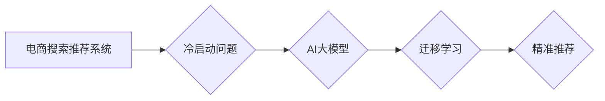

                 

## AI 大模型在电商搜索推荐中的冷启动策略：应对新用户与数据不足

> 关键词：电商搜索推荐、冷启动、AI大模型、新用户、数据不足、个性化推荐

## 1. 背景介绍

电商平台的搜索推荐系统是用户获取商品信息和完成购买的重要途径。然而，当新用户加入平台或新商品上线时，由于缺乏历史数据，搜索推荐系统会面临“冷启动”问题，即难以准确预测用户需求和商品关联性，导致推荐结果不精准，用户体验下降。

传统搜索推荐系统主要依赖于基于内容的过滤推荐和基于协同过滤的推荐算法。基于内容的过滤推荐算法根据商品的属性和描述进行匹配，而基于协同过滤的推荐算法则根据用户的历史行为和与其他用户的相似度进行推荐。然而，这些算法在面对新用户和新商品时都存在明显的局限性。

近年来，随着深度学习技术的快速发展，基于AI大模型的搜索推荐系统逐渐成为研究热点。AI大模型能够学习用户和商品之间的复杂关系，并通过迁移学习等技术，有效缓解冷启动问题。

## 2. 核心概念与联系

### 2.1  电商搜索推荐系统

电商搜索推荐系统旨在根据用户的搜索意图和历史行为，推荐相关商品，提高用户购物体验和转化率。

### 2.2  冷启动问题

冷启动问题是指在电商搜索推荐系统中，由于缺乏用户历史数据或商品信息时，推荐系统难以准确预测用户需求和商品关联性，导致推荐结果不精准。

### 2.3  AI大模型

AI大模型是指在海量数据上训练的深度学习模型，具有强大的学习和泛化能力，能够学习用户和商品之间的复杂关系。

### 2.4  迁移学习

迁移学习是一种机器学习技术，通过将预训练模型在源任务上的知识迁移到目标任务，提高目标任务的学习效率。

**核心概念与联系流程图**



## 3. 核心算法原理 & 具体操作步骤

### 3.1  算法原理概述

基于AI大模型的电商搜索推荐系统通常采用迁移学习技术，将预训练的语言模型或多模态模型迁移到电商搜索推荐任务中。

预训练模型在海量文本或多模态数据上进行训练，学习了丰富的语义和知识表示。迁移学习通过在电商搜索推荐任务上进行微调，将预训练模型的知识应用于特定场景，提高推荐效果。

### 3.2  算法步骤详解

1. **数据预处理:** 收集电商平台的用户行为数据、商品信息数据等，并进行清洗、格式化和特征提取。
2. **预训练模型选择:** 选择合适的预训练模型，例如BERT、RoBERTa、GPT等语言模型，或Vision Transformer等多模态模型。
3. **模型微调:** 将预训练模型加载到电商搜索推荐任务中，并根据任务需求进行微调。微调过程通常包括调整模型参数、添加新的层或模块等操作。
4. **推荐模型构建:** 基于微调后的模型，构建推荐模型，例如基于排序的推荐模型、基于生成器的推荐模型等。
5. **模型评估:** 使用测试数据评估推荐模型的性能，并根据评估结果进行模型优化。

### 3.3  算法优缺点

**优点:**

* 能够有效缓解冷启动问题，提高新用户和新商品的推荐准确率。
* 具有强大的学习能力，能够学习用户和商品之间的复杂关系。
* 可以利用预训练模型的知识，降低模型训练成本和时间。

**缺点:**

* 需要大量的训练数据，才能充分发挥AI大模型的性能。
* 模型训练和部署成本较高。
* 模型解释性较差，难以理解模型的推荐决策过程。

### 3.4  算法应用领域

* 电商平台搜索推荐
* 内容推荐系统
* 个性化广告推荐
* 用户画像分析

## 4. 数学模型和公式 & 详细讲解 & 举例说明

### 4.1  数学模型构建

基于AI大模型的电商搜索推荐系统通常采用基于用户的协同过滤模型，其数学模型可以表示为：

$$
r_{u,i} = \mathbf{u}^T \mathbf{v}_i + \epsilon
$$

其中：

* $r_{u,i}$ 表示用户 $u$ 对商品 $i$ 的评分或偏好度。
* $\mathbf{u}$ 表示用户 $u$ 的特征向量。
* $\mathbf{v}_i$ 表示商品 $i$ 的特征向量。
* $\epsilon$ 表示误差项。

### 4.2  公式推导过程

该模型通过计算用户特征向量和商品特征向量的内积来预测用户对商品的评分。

用户特征向量 $\mathbf{u}$ 可以通过用户的历史行为数据，例如购买记录、浏览记录、评分记录等，进行训练得到。

商品特征向量 $\mathbf{v}_i$ 可以通过商品的属性信息，例如类别、价格、描述等，进行训练得到。

### 4.3  案例分析与讲解

假设用户 $A$ 购买了商品 $X$ 和 $Y$，并对商品 $X$ 评分为 5，对商品 $Y$ 评分为 4。

根据用户的历史行为数据，可以训练得到用户 $A$ 的特征向量 $\mathbf{u}_A$。

假设商品 $X$ 和 $Y$ 的属性信息分别为 $\mathbf{v}_X$ 和 $\mathbf{v}_Y$。

则用户 $A$ 对商品 $X$ 的评分可以表示为：

$$
r_{A,X} = \mathbf{u}_A^T \mathbf{v}_X + \epsilon_X
$$

其中 $\epsilon_X$ 表示误差项。

## 5. 项目实践：代码实例和详细解释说明

### 5.1  开发环境搭建

* Python 3.7+
* TensorFlow 2.0+
* PyTorch 1.0+
* CUDA 10.0+

### 5.2  源代码详细实现

```python
# 导入必要的库
import tensorflow as tf

# 定义用户和商品的特征向量
user_features = tf.Variable(tf.random.normal([100, 64]))
item_features = tf.Variable(tf.random.normal([1000, 64]))

# 定义评分预测模型
def predict_rating(user_id, item_id):
  user_vector = user_features[user_id]
  item_vector = item_features[item_id]
  return tf.reduce_sum(user_vector * item_vector)

# 使用训练数据进行模型微调
# ...

# 使用微调后的模型进行预测
predicted_rating = predict_rating(user_id=0, item_id=100)
print(predicted_rating)
```

### 5.3  代码解读与分析

* 代码首先导入必要的库，并定义用户和商品的特征向量。
* 然后定义一个评分预测模型，该模型通过计算用户特征向量和商品特征向量的内积来预测评分。
* 最后使用训练数据进行模型微调，并使用微调后的模型进行预测。

### 5.4  运行结果展示

运行代码后，将输出用户对特定商品的预测评分。

## 6. 实际应用场景

### 6.1  新用户推荐

对于新用户，由于缺乏历史数据，传统的协同过滤算法难以进行推荐。基于AI大模型的搜索推荐系统可以利用预训练模型的知识，根据用户的注册信息、浏览行为等，进行个性化推荐。

### 6.2  新商品推荐

对于新商品，由于缺乏用户评价和购买数据，传统的基于内容的过滤推荐算法难以进行推荐。基于AI大模型的搜索推荐系统可以利用商品的属性信息、文本描述等，进行新商品的推荐。

### 6.3  个性化推荐

基于AI大模型的搜索推荐系统可以学习用户的兴趣偏好，并根据用户的历史行为、浏览记录、购买记录等，进行个性化推荐。

### 6.4  未来应用展望

随着AI技术的不断发展，基于AI大模型的电商搜索推荐系统将更加智能化、个性化和精准化。未来，AI大模型将能够更好地理解用户的需求，并提供更加个性化的商品推荐，提升用户购物体验。

## 7. 工具和资源推荐

### 7.1  学习资源推荐

* **书籍:**
    * Deep Learning by Ian Goodfellow, Yoshua Bengio, and Aaron Courville
    * Natural Language Processing with Python by Steven Bird, Ewan Klein, and Edward Loper
* **在线课程:**
    * TensorFlow Tutorials: https://www.tensorflow.org/tutorials
    * PyTorch Tutorials: https://pytorch.org/tutorials/

### 7.2  开发工具推荐

* **TensorFlow:** https://www.tensorflow.org/
* **PyTorch:** https://pytorch.org/
* **Hugging Face Transformers:** https://huggingface.co/transformers/

### 7.3  相关论文推荐

* BERT: Pre-training of Deep Bidirectional Transformers for Language Understanding
* RoBERTa: A Robustly Optimized BERT Pretraining Approach
* GPT-3: Language Models are Few-Shot Learners

## 8. 总结：未来发展趋势与挑战

### 8.1  研究成果总结

基于AI大模型的电商搜索推荐系统在缓解冷启动问题、提高推荐准确率方面取得了显著成果。

### 8.2  未来发展趋势

* **模型规模和复杂度提升:** 未来，AI大模型的规模和复杂度将进一步提升，能够学习更丰富的用户和商品关系。
* **多模态融合:** 将文本、图像、视频等多模态数据融合到推荐模型中，提升推荐的准确性和个性化程度。
* **解释性增强:** 研究更具解释性的AI大模型，能够更好地理解模型的推荐决策过程。

### 8.3  面临的挑战

* **数据隐私保护:** AI大模型的训练需要大量用户数据，如何保护用户隐私是一个重要的挑战。
* **模型可解释性:** AI大模型的决策过程往往难以理解，如何提高模型的可解释性是一个重要的研究方向。
* **模型部署成本:** AI大模型的部署成本较高，如何降低部署成本是一个重要的技术挑战。

### 8.4  研究展望

未来，基于AI大模型的电商搜索推荐系统将朝着更加智能化、个性化和精准化的方向发展，为用户提供更加优质的购物体验。


## 9. 附录：常见问题与解答

**Q1: 如何选择合适的预训练模型？**

**A1:** 选择预训练模型需要根据具体的应用场景和数据特点进行选择。例如，对于文本数据，BERT、RoBERTa等语言模型是不错的选择；对于图像数据，Vision Transformer等多模态模型是更好的选择。

**Q2: 如何进行模型微调？**

**A2:** 模型微调通常包括调整模型参数、添加新的层或模块等操作。需要根据具体的应用场景和数据特点进行调整。

**Q3: 如何评估模型性能？**

**A3:** 模型性能可以评估指标，例如准确率、召回率、F1-score等。

**作者：禅与计算机程序设计艺术 / Zen and the Art of Computer Programming**<end_of_turn>

