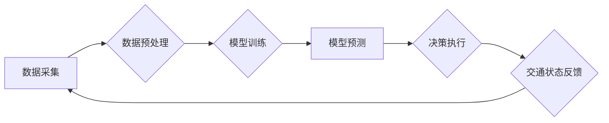

                 

## AI与人类计算：打造可持续发展的城市交通规划与管理

> 关键词：人工智能、城市交通、规划与管理、可持续发展、人类计算、机器学习、深度学习、交通流量预测、优化算法、数据分析

## 1. 背景介绍

城市交通拥堵已成为全球性难题，给人们的生活、工作和经济发展带来了巨大压力。传统的交通规划与管理模式难以有效应对日益复杂的交通需求，亟需引入先进的技术手段进行革新。人工智能（AI）作为一门新兴技术，凭借其强大的数据处理能力和学习能力，为解决城市交通问题提供了新的思路和解决方案。

近年来，AI技术在交通领域取得了显著进展，例如：

* **交通流量预测:** 利用机器学习算法分析历史交通数据，预测未来交通流量，为交通管理提供决策依据。
* **智能交通信号灯控制:** 根据实时交通流量情况，智能调整信号灯的绿灯时间，优化交通流，减少拥堵。
* **自动驾驶:** 利用计算机视觉、传感器融合等技术，实现车辆自动驾驶，提高交通效率和安全性。
* **公共交通优化:** 利用大数据分析和路径规划算法，优化公交线路和班次，提高公共交通服务质量。

这些应用都表明，AI技术在城市交通规划与管理领域具有巨大的潜力。

## 2. 核心概念与联系

**2.1 人类计算与AI计算**

人类计算是指人类利用自身的认知能力、经验和判断力进行计算和决策的过程。AI计算是指利用人工智能算法和模型，模拟人类的认知能力，进行数据分析、模式识别和决策的过程。

**2.2 人工智能与城市交通**

AI技术可以与城市交通系统进行深度融合，实现智能化、高效化和可持续化的交通管理。

**2.3 核心概念架构**



**数据采集:** 通过各种传感器、摄像头、GPS等设备，收集城市交通运行数据，包括车辆流量、速度、位置、交通信号灯状态等。

**数据预处理:** 对采集到的原始数据进行清洗、转换、格式化等处理，使其符合模型训练的要求。

**模型训练:** 利用机器学习算法，对预处理后的数据进行训练，建立交通预测模型、优化模型等。

**模型预测:** 将实时交通数据输入到训练好的模型中，进行预测，例如预测未来交通流量、最佳路径等。

**决策执行:** 根据模型预测结果，对交通信号灯、公交线路、车辆导航等进行智能控制，优化交通流。

**交通状态反馈:** 监控交通运行状态，收集反馈数据，用于模型更新和优化。

## 3. 核心算法原理 & 具体操作步骤

**3.1 算法原理概述**

本节将介绍用于城市交通规划与管理的典型AI算法，包括：

* **机器学习算法:** 用于交通流量预测、交通模式识别等。
* **深度学习算法:** 用于图像识别、自动驾驶等。
* **优化算法:** 用于交通信号灯控制、公交线路优化等。

**3.2 算法步骤详解**

**3.2.1 机器学习算法**

1. **数据收集:** 收集历史交通数据，包括时间、地点、交通流量、天气等信息。
2. **数据预处理:** 清洗、转换、格式化数据，去除噪声和异常值。
3. **特征工程:** 从原始数据中提取特征，例如时间段、曜日、天气状况等，用于模型训练。
4. **模型选择:** 选择合适的机器学习算法，例如线性回归、决策树、支持向量机等。
5. **模型训练:** 利用训练数据训练模型，调整模型参数，使其能够准确预测交通流量。
6. **模型评估:** 使用测试数据评估模型性能，例如准确率、均方误差等。
7. **模型部署:** 将训练好的模型部署到实际系统中，用于实时交通流量预测。

**3.2.2 深度学习算法**

1. **数据收集:** 收集大量图像数据，例如道路场景、车辆图像等。
2. **数据预处理:** 对图像数据进行裁剪、增强、格式化等处理。
3. **网络结构设计:** 设计深度神经网络结构，例如卷积神经网络（CNN）、循环神经网络（RNN）等。
4. **模型训练:** 利用训练数据训练深度神经网络，调整网络参数，使其能够识别交通场景和车辆。
5. **模型评估:** 使用测试数据评估模型性能，例如识别准确率、召回率等。
6. **模型部署:** 将训练好的模型部署到实际系统中，用于自动驾驶、交通监控等应用。

**3.2.3 优化算法**

1. **问题建模:** 将交通问题建模为数学优化问题，例如最小化交通拥堵时间、最大化交通流量等。
2. **算法选择:** 选择合适的优化算法，例如遗传算法、模拟退火算法等。
3. **参数设置:** 设置算法参数，例如种群规模、迭代次数等。
4. **算法运行:** 利用优化算法求解交通问题，找到最优解。
5. **结果分析:** 分析优化结果，并将其应用到实际交通管理中。

**3.3 算法优缺点**

**3.3.1 机器学习算法**

* **优点:** 能够从数据中学习规律，预测未来趋势，适应不断变化的交通环境。
* **缺点:** 需要大量训练数据，对数据质量要求高，难以解释模型决策过程。

**3.3.2 深度学习算法**

* **优点:** 能够处理复杂数据，识别复杂的交通场景，具有更强的学习能力。
* **缺点:** 需要更强大的计算资源，训练时间更长，模型更难以解释。

**3.3.3 优化算法**

* **优点:** 可以找到最优解，提高交通效率，降低交通成本。
* **缺点:** 算法复杂度高，求解时间长，难以处理大规模交通问题。

**3.4 算法应用领域**

* **交通流量预测:** 预测未来交通流量，为交通管理提供决策依据。
* **智能交通信号灯控制:** 根据实时交通流量情况，智能调整信号灯的绿灯时间，优化交通流。
* **自动驾驶:** 利用计算机视觉、传感器融合等技术，实现车辆自动驾驶，提高交通效率和安全性。
* **公共交通优化:** 利用大数据分析和路径规划算法，优化公交线路和班次，提高公共交通服务质量。
* **交通拥堵缓解:** 利用AI算法分析交通拥堵原因，提出缓解拥堵的策略和方案。

## 4. 数学模型和公式 & 详细讲解 & 举例说明

**4.1 数学模型构建**

城市交通规划与管理涉及到复杂的系统动力学和多变量优化问题，需要构建数学模型来描述和分析这些问题。常见的数学模型包括：

* **交通流量模型:** 描述车辆在道路上的流动规律，例如泊松分布、马尔可夫链等。
* **交通网络模型:** 描述道路网络的结构和连接关系，例如图论、网络流算法等。
* **交通拥堵模型:** 描述交通拥堵的形成机制和演化过程，例如微分方程、差分方程等。

**4.2 公式推导过程**

以交通流量预测为例，常用的模型是ARIMA模型（Autoregressive Integrated Moving Average）。其核心公式如下：

$$
y_t = c + \phi_1 y_{t-1} + \phi_2 y_{t-2} + ... + \phi_p y_{t-p} + \theta_1 \epsilon_{t-1} + \theta_2 \epsilon_{t-2} + ... + \theta_q \epsilon_{t-q} + \epsilon_t
$$

其中：

* $y_t$ 表示时间t的交通流量。
* $c$ 是常数项。
* $\phi_i$ 是自回归系数。
* $\theta_i$ 是移动平均系数。
* $\epsilon_t$ 是随机误差项。

**4.3 案例分析与讲解**

假设我们想要预测某条道路的未来交通流量，可以使用ARIMA模型进行预测。首先，需要收集该道路的历史交通流量数据，然后根据数据特征选择合适的ARIMA模型参数（p, d, q）。最后，将模型输入到实时交通数据，即可预测未来交通流量。

## 5. 项目实践：代码实例和详细解释说明

**5.1 开发环境搭建**

本项目使用Python语言进行开发，需要安装以下软件包：

* Python 3.x
* NumPy
* Pandas
* Scikit-learn
* Matplotlib

**5.2 源代码详细实现**

```python
import numpy as np
from sklearn.linear_model import LinearRegression

# 载入交通流量数据
data = np.loadtxt('traffic_data.csv', delimiter=',')

# 将数据分为训练集和测试集
train_data = data[:-100]
test_data = data[-100:]

# 创建线性回归模型
model = LinearRegression()

# 训练模型
model.fit(train_data[:, :-1], train_data[:, -1])

# 使用模型预测测试集数据
predictions = model.predict(test_data[:, :-1])

# 评估模型性能
from sklearn.metrics import mean_squared_error
mse = mean_squared_error(test_data[:, -1], predictions)
print(f'Mean Squared Error: {mse}')

# 可视化预测结果
import matplotlib.pyplot as plt
plt.plot(test_data[:, -1], label='Actual')
plt.plot(predictions, label='Predicted')
plt.legend()
plt.show()
```

**5.3 代码解读与分析**

这段代码实现了基于线性回归的交通流量预测模型。首先，载入交通流量数据，然后将数据分为训练集和测试集。接着，创建线性回归模型，并使用训练集数据训练模型。最后，使用训练好的模型预测测试集数据，并评估模型性能。

**5.4 运行结果展示**

运行代码后，会输出模型的均方误差值，以及实际流量和预测流量的曲线图。通过观察曲线图，可以判断模型的预测精度。

## 6. 实际应用场景

**6.1 交通流量预测**

交通流量预测可以用于优化交通信号灯控制、引导车辆避开拥堵路段、预警交通拥堵风险等。

**6.2 智能交通信号灯控制**

智能交通信号灯控制可以根据实时交通流量情况，动态调整信号灯的绿灯时间，减少交通拥堵和等待时间。

**6.3 自动驾驶**

自动驾驶技术可以利用AI算法识别道路场景、预测车辆运动轨迹，实现车辆自动驾驶，提高交通效率和安全性。

**6.4 公共交通优化**

公共交通优化可以利用大数据分析和路径规划算法，优化公交线路和班次，提高公共交通服务质量。

**6.5 未来应用展望**

随着AI技术的不断发展，未来在城市交通规划与管理领域将有更多新的应用场景，例如：

* **个性化交通服务:** 根据用户的出行需求，提供个性化的交通路线规划和出行建议。
* **智能交通管理平台:** 建立一个集交通数据采集、分析、预测、决策于一体的智能交通管理平台。
* **无人驾驶公共交通:** 推广无人驾驶公交车、出租车等，提高交通效率和安全性。

## 7. 工具和资源推荐

**7.1 学习资源推荐**

* **在线课程:** Coursera、edX、Udacity等平台提供丰富的AI和机器学习课程。
* **书籍:** 《深度学习》、《机器学习实战》等书籍可以帮助深入理解AI相关知识。
* **开源项目:** TensorFlow、PyTorch等开源项目可以帮助实践AI算法。

**7.2 开发工具推荐**

* **Python:** 作为AI开发的常用语言，Python拥有丰富的库和工具，例如NumPy、Pandas、Scikit-learn等。
* **Jupyter Notebook:** 用于编写和运行Python代码，并可视化数据分析结果。
* **IDE:** PyCharm、VS Code等IDE可以提供更完善的开发环境。

**7.3 相关论文推荐**

* **交通流量预测:** "Deep Learning for Traffic Flow Prediction"
* **智能交通信号灯控制:** "Adaptive Traffic Signal Control Using Deep Reinforcement Learning"
* **自动驾驶:** "End to End Learning for Self-Driving Cars"

## 8. 总结：未来发展趋势与挑战

**8.1 研究成果总结**

近年来，AI技术在城市交通规划与管理领域取得了显著进展，例如交通流量预测、智能交通信号灯控制、自动驾驶等。这些应用都表明，AI技术可以有效解决城市交通问题，提高交通效率和安全性。

**8.2 未来发展趋势**

未来，AI技术在城市交通规划与管理领域将继续发展，主要趋势包括：

* **更精准的预测:** 利用更先进的机器学习算法和数据分析技术，实现更精准的交通流量预测。
* **更智能的控制:** 利用深度学习和强化学习等技术，实现更智能的交通信号灯控制、车辆导航等。
* **更个性化的服务:** 根据用户的出行需求，提供更个性化的交通路线规划和出行建议。
* **更可持续的交通:** 利用AI技术优化交通流量，减少交通拥堵和碳排放，促进可持续发展。

**8.3 面临的挑战**

AI技术在城市交通规划与管理领域也面临一些挑战，例如：

* **数据质量:** AI算法对数据质量要求高，需要收集高质量、真实可靠的交通数据。
* **算法解释性:** 一些AI算法难以解释其决策过程，这可能会导致公众对AI技术的信任度下降。
* **伦理问题:** AI技术在交通领域应用可能会带来一些伦理问题，例如自动驾驶车辆的责任归属等。

**8.4 研究展望**

未来，需要加强对AI技术在城市交通规划与管理领域的应用研究，解决上述挑战，推动AI技术在交通领域的可持续发展。


## 9. 附录：常见问题与解答

**9.1 如何选择合适的AI算法？**

选择合适的AI算法需要根据具体应用场景和数据特点进行分析。例如，对于时间序列数据，ARIMA模型是一种常用的选择；对于图像数据，CNN模型是一种常用的选择。

**9.2 如何评估AI模型的性能？**

常用的评估指标包括准确率、召回率、F1-score、均方误差等。选择合适的评估指标需要根据具体应用场景进行确定。

**9.3 如何解决数据质量问题？**

数据质量问题可以通过以下方法解决：

* **数据清洗:** 去除数据中的噪声、缺失值和异常值。
* **数据转换:** 将数据转换为适合模型训练的格式。
* **数据增强:** 通过人工或自动的方法增加数据量和多样性。


作者：禅与计算机程序设计艺术 / Zen and the Art of Computer Programming 
<end_of_turn>

