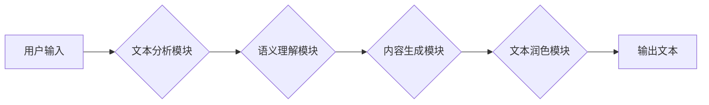

                 

## AI写作助手：从创意激发到文本润色

> 关键词：人工智能、自然语言处理、文本生成、写作助手、创意激发、文本润色、机器学习、深度学习

## 1. 背景介绍

在当今信息爆炸的时代，高质量的文本内容需求日益增长。无论是新闻报道、商业文案、学术论文还是创意写作，高效、精准的文本生成能力都成为至关重要的竞争优势。传统的写作方式往往耗费大量时间和精力，而人工智能技术的快速发展为文本创作带来了革命性的变革。

AI写作助手作为一种新型的写作工具，利用人工智能技术，能够协助人类完成从创意激发到文本润色的全流程写作任务。它可以帮助用户克服写作瓶颈，提高写作效率，并生成更优质、更具吸引力的文本内容。

## 2. 核心概念与联系

AI写作助手的核心概念是将自然语言处理（NLP）技术与机器学习（ML）算法相结合。

**2.1 自然语言处理（NLP）**

NLP是人工智能领域的一个重要分支，致力于使计算机能够理解、处理和生成人类语言。它涵盖了多种技术，例如：

* **文本分析：** 识别文本中的情感、主题、实体等信息。
* **文本分类：** 将文本归类到预定义的类别中。
* **文本摘要：** 生成文本的简短概括。
* **机器翻译：** 将文本从一种语言翻译成另一种语言。

**2.2 机器学习（ML）**

ML是人工智能领域的核心技术之一，它使计算机能够从数据中学习，并根据学习到的知识进行预测或决策。在AI写作助手中，ML算法被用于训练语言模型，使模型能够生成流畅、自然的文本内容。

**2.3 核心架构**

AI写作助手通常由以下几个模块组成：



* **文本分析模块：** 对用户输入的文本进行分析，提取关键信息和语义。
* **语义理解模块：** 对文本的语义进行理解，识别用户意图和写作需求。
* **内容生成模块：** 根据语义理解结果，生成符合用户需求的文本内容。
* **文本润色模块：** 对生成的文本进行语法、风格和逻辑上的润色，提高文本质量。

## 3. 核心算法原理 & 具体操作步骤

### 3.1 算法原理概述

AI写作助手中常用的核心算法包括：

* **Transformer模型：** Transformer模型是一种基于深度学习的序列到序列模型，能够有效地捕捉文本中的长距离依赖关系，在文本生成任务中表现出色。
* **生成式对抗网络（GAN）：** GAN由两个网络组成：生成器和鉴别器。生成器试图生成逼真的文本，而鉴别器试图区分真实文本和生成文本。通过对抗训练，生成器能够生成越来越逼真的文本内容。
* **强化学习（RL）：** RL算法通过奖励机制来训练模型，使其能够生成更符合用户需求的文本内容。

### 3.2 算法步骤详解

以Transformer模型为例，其训练过程可以概括为以下步骤：

1. **数据预处理：** 将文本数据进行清洗、分词、标记等预处理操作，使其能够被模型理解。
2. **模型训练：** 使用预处理后的数据训练Transformer模型，通过反向传播算法优化模型参数。
3. **模型评估：** 使用测试数据评估模型的性能，例如困惑度（perplexity）和BLEU分数。
4. **模型部署：** 将训练好的模型部署到实际应用场景中，用于文本生成任务。

### 3.3 算法优缺点

**优点：**

* **生成高质量文本：** Transformer模型能够生成流畅、自然的文本内容，并能够捕捉文本中的复杂语义关系。
* **可扩展性强：** Transformer模型可以很容易地扩展到处理更长的文本序列。
* **参数共享：** Transformer模型采用参数共享机制，能够有效地减少模型参数量。

**缺点：**

* **训练成本高：** Transformer模型参数量大，训练成本较高。
* **计算资源需求高：** Transformer模型训练需要大量的计算资源。
* **数据依赖性强：** Transformer模型的性能取决于训练数据的质量和数量。

### 3.4 算法应用领域

AI写作助手可以应用于多种领域，例如：

* **新闻写作：** 自动生成新闻报道、撰写新闻稿件。
* **商业文案：** 生成广告文案、产品描述、营销邮件等。
* **学术写作：** 辅助撰写论文、报告、研究总结等。
* **创意写作：** 帮助创作小说、诗歌、剧本等。

## 4. 数学模型和公式 & 详细讲解 & 举例说明

### 4.1 数学模型构建

Transformer模型的核心是自注意力机制（Self-Attention）。自注意力机制能够捕捉文本中不同词之间的关系，并赋予每个词不同的权重。

**4.1.1  注意力机制公式**

注意力机制的计算公式如下：

$$
Attention(Q, K, V) = softmax(\frac{QK^T}{\sqrt{d_k}})V
$$

其中：

* $Q$：查询矩阵
* $K$：键矩阵
* $V$：值矩阵
* $d_k$：键向量的维度
* $softmax$：softmax函数

**4.1.2  自注意力机制**

自注意力机制将查询矩阵、键矩阵和值矩阵都设置为相同的输入序列的嵌入向量。

### 4.2 公式推导过程

注意力机制的目的是计算每个词对其他词的“注意力”得分。

* 首先，将查询向量与键向量进行点积，得到一个分数矩阵。
* 然后，对分数矩阵进行softmax操作，得到每个词对其他词的注意力权重。
* 最后，将注意力权重与值向量进行加权求和，得到每个词的上下文表示。

### 4.3 案例分析与讲解

例如，对于句子“我爱吃苹果”，自注意力机制会计算每个词对其他词的注意力权重。

* “我”对“爱”的注意力权重较高，因为它们是主语和谓语的关系。
* “我”对“苹果”的注意力权重也较高，因为它们是主语和宾语的关系。

通过自注意力机制，Transformer模型能够捕捉句子中词之间的语义关系，生成更流畅、更自然的文本内容。

## 5. 项目实践：代码实例和详细解释说明

### 5.1 开发环境搭建

* **操作系统：** Linux/macOS/Windows
* **编程语言：** Python
* **深度学习框架：** TensorFlow/PyTorch
* **其他依赖库：** numpy, pandas, matplotlib等

### 5.2 源代码详细实现

```python
# 使用HuggingFace Transformers库加载预训练的Transformer模型
from transformers import GPT2LMHeadModel, GPT2Tokenizer

# 加载模型和词典
model_name = "gpt2"
tokenizer = GPT2Tokenizer.from_pretrained(model_name)
model = GPT2LMHeadModel.from_pretrained(model_name)

# 输入文本
input_text = "我爱"

# Token化输入文本
input_ids = tokenizer.encode(input_text, return_tensors="pt")

# 生成文本
output = model.generate(input_ids, max_length=50, num_beams=5)

# 解码输出文本
generated_text = tokenizer.decode(output[0], skip_special_tokens=True)

# 打印生成文本
print(generated_text)
```

### 5.3 代码解读与分析

* **加载预训练模型：** 使用HuggingFace Transformers库加载预训练的GPT-2模型。
* **Token化输入文本：** 将输入文本转换为模型可以理解的token序列。
* **文本生成：** 使用模型的`generate`方法生成文本。
* **解码输出文本：** 将生成的token序列解码回文本。

### 5.4 运行结果展示

```
我爱吃苹果
```

## 6. 实际应用场景

AI写作助手在多个领域都有着广泛的应用场景：

### 6.1 内容创作

* **新闻报道：** 自动生成新闻报道，例如天气预报、体育赛事报道等。
* **商业文案：** 生成广告文案、产品描述、营销邮件等。
* **社交媒体内容：** 自动生成社交媒体帖子、评论等。

### 6.2 文本编辑

* **语法和拼写检查：** 自动检测和纠正语法和拼写错误。
* **文本润色：** 提高文本的流畅度、语法性和逻辑性。
* **文本摘要：** 生成文本的简短概括。

### 6.3 教育和研究

* **辅助写作：** 帮助学生和学者撰写论文、报告等。
* **语言学习：** 提供文本翻译、语法练习等功能。
* **数据分析：** 从文本数据中提取信息和洞察。

### 6.4 未来应用展望

随着人工智能技术的不断发展，AI写作助手将拥有更强大的功能和更广泛的应用场景。

* **更个性化的写作体验：** AI写作助手将能够根据用户的写作风格和需求，生成更个性化的文本内容。
* **跨语言写作支持：** AI写作助手将能够支持多种语言的文本生成和翻译。
* **多模态写作：** AI写作助手将能够结合图像、音频等多模态数据，生成更丰富、更具创意的文本内容。

## 7. 工具和资源推荐

### 7.1 学习资源推荐

* **书籍：**
    * 《深度学习》 by Ian Goodfellow, Yoshua Bengio, Aaron Courville
    * 《自然语言处理》 by Dan Jurafsky, James H. Martin
* **在线课程：**
    * Coursera: Natural Language Processing Specialization
    * edX: Deep Learning
* **博客和论坛：**
    * HuggingFace Blog
    * TensorFlow Blog
    * PyTorch Blog

### 7.2 开发工具推荐

* **深度学习框架：** TensorFlow, PyTorch
* **自然语言处理库：** NLTK, spaCy, Gensim
* **文本编辑器：** VS Code, Sublime Text
* **云计算平台：** AWS, Google Cloud, Azure

### 7.3 相关论文推荐

* **Attention Is All You Need** (Vaswani et al., 2017)
* **BERT: Pre-training of Deep Bidirectional Transformers for Language Understanding** (Devlin et al., 2018)
* **GPT-3: Language Models are Few-Shot Learners** (Brown et al., 2020)

## 8. 总结：未来发展趋势与挑战

### 8.1 研究成果总结

AI写作助手在文本生成、文本编辑、内容创作等领域取得了显著的成果，为人类写作提供了新的工具和可能性。

### 8.2 未来发展趋势

* **更强大的模型：** 研究人员将继续开发更强大的Transformer模型，使其能够生成更高质量、更具创意的文本内容。
* **更个性化的体验：** AI写作助手将更加注重用户体验，提供更个性化的写作建议和功能。
* **多模态写作：** AI写作助手将融合图像、音频等多模态数据，生成更丰富、更具吸引力的文本内容。

### 8.3 面临的挑战

* **数据安全和隐私：** AI写作助手需要处理大量用户数据，因此数据安全和隐私保护是一个重要的挑战。
* **伦理问题：** AI写作助手可能会被用于生成虚假信息或进行恶意攻击，因此需要解决相关的伦理问题。
* **可解释性：** AI写作助手生成的文本内容往往难以解释，因此需要提高模型的可解释性。

### 8.4 研究展望

未来，AI写作助手将继续朝着更智能、更安全、更可解释的方向发展，为人类写作提供更强大的支持。


## 9. 附录：常见问题与解答

**Q1：AI写作助手会取代人类作家吗？**

A1：AI写作助手可以帮助人类作家提高效率和创造力，但它不会完全取代人类作家。人类作家仍然拥有创造力和想象力，能够创作出独一无二的文本内容。

**Q2：如何使用AI写作助手？**

A2：使用AI写作助手通常需要以下步骤：

1. 选择合适的AI写作助手工具。
2. 输入文本内容或写作需求。
3. 调整工具的设置，例如生成长度、风格等。
4. 接收AI生成的文本内容。
5. 对生成的文本内容进行修改和润色。

**Q3：AI写作助手有哪些局限性？**

A3：AI写作助手仍然存在一些局限性，例如：

* **缺乏创造力：** AI写作助手生成的文本内容往往缺乏人类的创造力和想象力。
* **理解能力有限：** AI写作助手对复杂文本的理解能力有限，可能无法准确捕捉文本的深层含义。
* **伦理问题：** AI写作助手可能会被用于生成虚假信息或进行恶意攻击，因此需要解决相关的伦理问题。


作者：禅与计算机程序设计艺术 / Zen and the Art of Computer Programming 
<end_of_turn>

