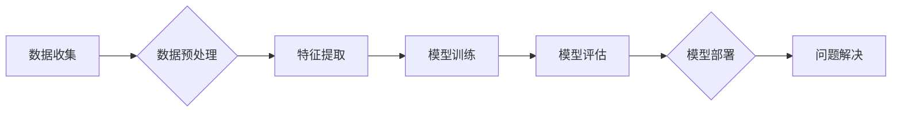

                 

## AI在复杂问题处理中的优势

> 关键词：人工智能、复杂问题、机器学习、深度学习、优化算法、数据分析、决策支持

### 1. 背景介绍

随着科技的飞速发展，人类面临着越来越多的复杂问题，这些问题往往具有多变量、非线性、动态变化等特点，难以用传统方法有效解决。例如，气候变化、疾病预测、金融风险管理等领域都存在着高度复杂的挑战。

人工智能（AI）作为一种新兴技术，凭借其强大的数据处理能力和学习能力，展现出在复杂问题处理中的巨大优势。AI算法能够从海量数据中发现隐藏的模式和规律，并根据这些模式进行预测、决策和优化。

### 2. 核心概念与联系

**2.1 复杂问题定义**

复杂问题是指具有以下特征的问题：

* **多变量性:** 问题涉及多个相互关联的变量。
* **非线性性:** 变量之间的关系并非简单的线性关系。
* **动态变化:** 问题环境不断变化，导致解决方案需要不断调整。
* **不确定性:** 问题存在着不可预测的因素。
* **全局优化:** 寻找最优解需要考虑所有变量和因素的综合影响。

**2.2 AI在复杂问题处理中的优势**

* **数据驱动:** AI算法依赖于大量数据进行训练和学习，能够从数据中发现隐藏的模式和规律，为复杂问题提供更准确的解决方案。
* **学习能力:** AI算法能够不断学习和改进，随着数据量的增加，其解决复杂问题的能力也会不断提升。
* **并行处理:** AI算法能够并行处理大量数据，提高解决复杂问题的效率。
* **自动化决策:** AI算法能够自动进行决策，减少人为干预，提高决策的效率和准确性。

**2.3 AI处理复杂问题的流程**



### 3. 核心算法原理 & 具体操作步骤

**3.1 算法原理概述**

深度学习是AI领域中的一种重要算法，它能够学习复杂的数据表示，并用于解决各种复杂问题。深度学习算法的核心是多层神经网络，这些神经网络由多个隐藏层组成，每层神经元都连接到下一层的多个神经元。通过训练，神经网络能够学习到数据中的特征和模式，并将其用于预测、分类和识别等任务。

**3.2 算法步骤详解**

1. **数据收集和预处理:** 收集相关数据，并进行清洗、转换和特征工程等预处理操作，以使数据适合深度学习模型的训练。
2. **网络结构设计:** 根据问题的特点和数据特征，设计合适的深度学习网络结构，包括神经元的数量、层数、激活函数等。
3. **模型训练:** 使用训练数据训练深度学习模型，通过调整模型参数，使模型能够准确地预测或分类数据。
4. **模型评估:** 使用测试数据评估模型的性能，并根据评估结果进行模型调优。
5. **模型部署:** 将训练好的模型部署到实际应用场景中，用于解决实际问题。

**3.3 算法优缺点**

**优点:**

* 能够学习复杂的数据表示，解决传统方法难以处理的复杂问题。
* 具有强大的泛化能力，能够应用于不同的领域和任务。
* 随着数据量的增加，模型性能会不断提升。

**缺点:**

* 需要大量的训练数据，否则模型性能会下降。
* 训练过程耗时且资源消耗大。
* 模型解释性较差，难以理解模型的决策过程。

**3.4 算法应用领域**

* **图像识别:** 人脸识别、物体检测、图像分类等。
* **自然语言处理:** 语义理解、机器翻译、文本生成等。
* **语音识别:** 语音转文本、语音助手等。
* **预测分析:** 疾病预测、股票预测、客户流失预测等。
* **推荐系统:** 商品推荐、内容推荐等。

### 4. 数学模型和公式 & 详细讲解 & 举例说明

**4.1 数学模型构建**

深度学习模型通常使用神经网络来表示，神经网络可以看作是一个复杂的函数映射。每个神经元接收多个输入信号，并通过激活函数进行处理，输出一个信号。神经网络的输出结果是多个神经元的输出信号的线性组合。

**4.2 公式推导过程**

深度学习模型的训练过程是通过优化模型参数来实现的。常用的优化算法包括梯度下降法、动量法、Adam算法等。这些算法的目标是找到一个模型参数值，使得模型的输出结果与真实值之间的误差最小化。

**4.3 案例分析与讲解**

例如，在图像分类任务中，深度学习模型的输入是图像像素值，输出是不同类别标签的概率。模型的训练过程是通过调整模型参数，使得模型能够将图像像素值映射到正确的类别标签。

**举例说明:**

假设我们有一个深度学习模型用于识别猫和狗的图像。模型的输入是图像像素值，输出是猫和狗的概率。

* **损失函数:** 用于衡量模型预测结果与真实值之间的误差。常用的损失函数包括交叉熵损失函数、均方误差损失函数等。
* **梯度下降法:** 用于更新模型参数，使模型的损失函数最小化。梯度下降法的核心思想是沿着损失函数的梯度方向更新模型参数。

**4.4 数学公式**

* **激活函数:** $f(x)$
* **损失函数:** $L(y, \hat{y})$
* **梯度下降法:** $\theta = \theta - \alpha \nabla L(y, \hat{y})$

其中:

* $\theta$ 是模型参数
* $\alpha$ 是学习率
* $\nabla L(y, \hat{y})$ 是损失函数的梯度

### 5. 项目实践：代码实例和详细解释说明

**5.1 开发环境搭建**

* **操作系统:** Linux, macOS, Windows
* **编程语言:** Python
* **深度学习框架:** TensorFlow, PyTorch, Keras

**5.2 源代码详细实现**

```python
import tensorflow as tf

# 定义模型结构
model = tf.keras.models.Sequential([
    tf.keras.layers.Conv2D(32, (3, 3), activation='relu', input_shape=(28, 28, 1)),
    tf.keras.layers.MaxPooling2D((2, 2)),
    tf.keras.layers.Conv2D(64, (3, 3), activation='relu'),
    tf.keras.layers.MaxPooling2D((2, 2)),
    tf.keras.layers.Flatten(),
    tf.keras.layers.Dense(10, activation='softmax')
])

# 编译模型
model.compile(optimizer='adam',
              loss='sparse_categorical_crossentropy',
              metrics=['accuracy'])

# 训练模型
model.fit(x_train, y_train, epochs=5)

# 评估模型
loss, accuracy = model.evaluate(x_test, y_test)
print('Test loss:', loss)
print('Test accuracy:', accuracy)
```

**5.3 代码解读与分析**

这段代码定义了一个简单的卷积神经网络模型，用于识别手写数字。

* **模型结构:** 模型包含两层卷积层、两层最大池化层、一层全连接层和一层输出层。
* **激活函数:** 使用ReLU激活函数，可以提高模型的表达能力。
* **损失函数:** 使用交叉熵损失函数，适合多分类问题。
* **优化算法:** 使用Adam优化算法，可以加速模型训练。

**5.4 运行结果展示**

训练完成后，模型可以用于预测新的手写数字图像。

### 6. 实际应用场景

**6.1 医疗诊断:** AI算法可以分析医学图像，辅助医生诊断疾病。例如，AI可以用于识别肺癌、乳腺癌等疾病。

**6.2 金融风险管理:** AI算法可以分析金融数据，识别潜在的风险。例如，AI可以用于检测欺诈交易、预测股票价格波动等。

**6.3 交通安全:** AI算法可以分析交通数据，提高交通安全。例如，AI可以用于识别交通违规行为、预测交通拥堵等。

**6.4 未来应用展望**

随着AI技术的不断发展，其在复杂问题处理中的应用场景将会更加广泛。例如，AI可以用于解决气候变化、能源危机、人口老龄化等全球性挑战。

### 7. 工具和资源推荐

**7.1 学习资源推荐**

* **书籍:**
    * 深度学习 (Deep Learning) - Ian Goodfellow, Yoshua Bengio, Aaron Courville
    * 人工智能：一种现代方法 (Artificial Intelligence: A Modern Approach) - Stuart Russell, Peter Norvig
* **在线课程:**
    * Coursera: 深度学习 Specialization
    * Udacity: AI Programming with Python Nanodegree
    * edX: Artificial Intelligence

**7.2 开发工具推荐**

* **深度学习框架:** TensorFlow, PyTorch, Keras
* **编程语言:** Python
* **数据处理工具:** Pandas, NumPy

**7.3 相关论文推荐**

* **ImageNet Classification with Deep Convolutional Neural Networks** - Alex Krizhevsky, Ilya Sutskever, Geoffrey E. Hinton
* **Attention Is All You Need** - Ashish Vaswani, Noam Shazeer, Niki Parmar, Jakob Uszkoreit, Llion Jones, Aidan N. Gomez, Łukasz Kaiser, Illia Polosukhin

### 8. 总结：未来发展趋势与挑战

**8.1 研究成果总结**

近年来，AI在复杂问题处理领域取得了显著的进展，例如在图像识别、自然语言处理、语音识别等领域取得了突破性的成果。

**8.2 未来发展趋势**

* **模型规模和复杂度提升:** 未来AI模型将会更加庞大，包含更多的参数和层数，能够学习更加复杂的知识和模式。
* **数据驱动的AI:** 数据将成为AI发展的关键要素，未来AI模型将会更加依赖于海量数据的训练和学习。
* **解释性AI:** 如何解释AI模型的决策过程，提高模型的透明度和可信度，将成为未来研究的重要方向。

**8.3 面临的挑战**

* **数据获取和隐私保护:** 训练高性能的AI模型需要大量的训练数据，如何获取高质量的数据，并保护数据的隐私安全，是一个重要的挑战。
* **模型可解释性和信任度:** AI模型的决策过程往往是复杂的，难以理解，如何提高模型的可解释性和信任度，是一个重要的研究方向。
* **伦理和社会影响:** AI技术的快速发展，可能会带来一些伦理和社会问题，例如算法偏见、工作岗位替代等，需要引起人们的重视和讨论。

**8.4 研究展望**

未来，AI技术将会继续发展，并在更多领域发挥重要作用。我们需要加强对AI技术的理解和研究，并积极应对AI带来的挑战，确保AI技术能够造福人类社会。

### 9. 附录：常见问题与解答

**9.1 如何选择合适的AI算法？**

选择合适的AI算法需要根据具体问题特点和数据特征进行选择。例如，对于图像识别问题，可以使用卷积神经网络；对于文本分类问题，可以使用循环神经网络。

**9.2 如何评估AI模型的性能？**

常用的AI模型性能评估指标包括准确率、召回率、F1-score等。

**9.3 如何解决AI模型的过拟合问题？**

过拟合是指AI模型在训练数据上表现很好，但在测试数据上表现较差。解决过拟合问题的方法包括：

* 增加训练数据量
* 使用正则化技术
* 使用交叉验证


作者：禅与计算机程序设计艺术 / Zen and the Art of Computer Programming 
<end_of_turn>

