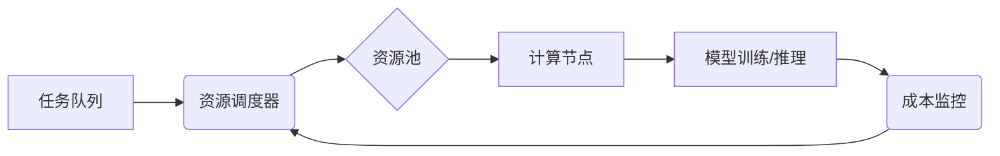

                 

## AI基础设施的成本优化：Lepton AI的经济学

> 关键词：人工智能、AI基础设施、成本优化、Lepton AI、经济学、云计算、资源调度、机器学习

## 1. 背景介绍

近年来，人工智能（AI）技术蓬勃发展，在各个领域展现出巨大的应用潜力。然而，训练和部署大型AI模型需要大量的计算资源和能源，这导致AI基础设施的成本成为一个显著的挑战。

传统的AI基础设施通常依赖于大型数据中心，采用集中式部署模式，存在资源利用率低、成本高昂等问题。随着AI应用的广泛普及，对AI基础设施的需求量不断增长，如何有效降低成本，提高资源利用率，成为AI发展的重要课题。

Lepton AI 作为一家致力于AI基础设施优化的新兴公司，提出了一种全新的经济学模型，旨在通过智能资源调度、动态资源分配和协同计算等技术，有效降低AI基础设施的成本。

## 2. 核心概念与联系

Lepton AI 的经济学模型的核心概念是将AI基础设施视为一个动态的经济系统，其中资源、模型和任务之间存在着复杂的相互作用关系。

Lepton AI 通过以下核心技术实现其经济学模型：

* **智能资源调度:** 利用机器学习算法，对资源进行动态分配，根据任务需求和资源可用性，实时调整资源配置，最大化资源利用率。
* **动态资源分配:** 根据任务的复杂度和时间限制，动态分配不同类型的计算资源，例如CPU、GPU和内存，以实现最佳的性能和成本平衡。
* **协同计算:** 将多个任务合并到同一个计算节点上，通过共享资源和计算能力，降低整体的计算成本。

Lepton AI 的经济学模型架构如下：

## 3. 核心算法原理 & 具体操作步骤

### 3.1  算法原理概述

Lepton AI 的核心算法基于强化学习（Reinforcement Learning，RL）原理，通过训练一个智能代理来优化资源调度和分配策略。

智能代理通过观察当前的资源状态和任务需求，选择最优的资源分配方案，并根据分配结果获得奖励或惩罚。通过不断学习和调整策略，智能代理最终能够找到最优的资源调度策略，最大化资源利用率和降低成本。

### 3.2  算法步骤详解

1. **环境建模:** 将AI基础设施建模为一个马尔可夫决策过程（Markov Decision Process，MDP），其中状态表示资源可用性和任务队列，动作表示资源分配方案，奖励表示资源利用率和成本。
2. **智能代理训练:** 使用强化学习算法，例如深度Q网络（Deep Q-Network，DQN），训练一个智能代理，使其能够学习最优的资源分配策略。
3. **资源调度:** 智能代理根据训练后的策略，实时调度资源，将任务分配到合适的计算节点上。
4. **成本监控:** 监控资源利用率和成本，并反馈给智能代理，用于策略更新和优化。

### 3.3  算法优缺点

**优点:**

* **自适应性强:** 可以根据实时变化的资源状态和任务需求进行动态调整。
* **效率高:** 通过智能调度和分配，可以最大化资源利用率，降低成本。
* **可扩展性强:** 可以扩展到更大的规模的AI基础设施。

**缺点:**

* **训练复杂:** 需要大量的训练数据和计算资源。
* **模型复杂:** 需要设计复杂的强化学习模型。
* **实时性要求高:** 需要实时监控资源状态和任务需求。

### 3.4  算法应用领域

Lepton AI 的核心算法可以应用于各种AI基础设施场景，例如：

* **云计算平台:** 优化云计算资源的分配和调度，降低云计算成本。
* **边缘计算:** 在边缘设备上进行高效的AI模型训练和推理。
* **高性能计算:** 提高高性能计算集群的资源利用率和性能。

## 4. 数学模型和公式 & 详细讲解 & 举例说明

### 4.1  数学模型构建

Lepton AI 的经济学模型可以抽象为一个资源分配优化问题，其目标是最大化资源利用率，同时最小化成本。

我们可以用以下数学模型来描述该问题：

* **资源:**  $R = \{r_1, r_2, ..., r_n\}$，其中 $r_i$ 表示第 $i$ 种资源类型。
* **任务:** $T = \{t_1, t_2, ..., t_m\}$，其中 $t_j$ 表示第 $j$ 个任务。
* **资源需求:** $d_{ij}$ 表示任务 $t_j$ 对资源 $r_i$ 的需求量。
* **资源可用量:** $s_i$ 表示资源 $r_i$ 的可用量。
* **成本:** $c_i$ 表示资源 $r_i$ 的单位成本。

**目标函数:**

最大化资源利用率，即最大化分配给任务的资源总量：

$$
\max \sum_{j=1}^{m} \sum_{i=1}^{n} d_{ij} \cdot x_{ij}
$$

**约束条件:**

* 资源可用量约束: $\sum_{j=1}^{m} d_{ij} \cdot x_{ij} \leq s_i$， 对于所有 $i$。
* 任务分配约束: $\sum_{i=1}^{n} x_{ij} = 1$， 对于所有 $j$。
* 资源分配变量约束: $x_{ij} \in \{0, 1\}$， 对于所有 $i$ 和 $j$。

其中，$x_{ij}$ 是一个二元变量，表示任务 $t_j$ 是否分配到资源 $r_i$ 上。

**成本函数:**

$$
\text{Cost} = \sum_{i=1}^{n} c_i \cdot \sum_{j=1}^{m} d_{ij} \cdot x_{ij}
$$

### 4.2  公式推导过程

Lepton AI 的经济学模型通过优化上述目标函数和约束条件，找到最优的资源分配方案。

该问题可以转化为一个线性规划问题，可以使用线性规划算法求解。

### 4.3  案例分析与讲解

假设我们有一个包含 3 种资源 (CPU, GPU, 内存) 和 4 个任务的AI基础设施。

* CPU 的可用量为 10 个，成本为 1 美元/小时。
* GPU 的可用量为 5 个，成本为 5 美元/小时。
* 内存的可用量为 20 GB，成本为 0.5 美元/GB/小时。

每个任务对资源的需求量如下：

* 任务 1: CPU = 2, GPU = 1, 内存 = 4 GB
* 任务 2: CPU = 3, GPU = 0, 内存 = 8 GB
* 任务 3: CPU = 1, GPU = 2, 内存 = 6 GB
* 任务 4: CPU = 2, GPU = 1, 内存 = 2 GB

Lepton AI 的经济学模型可以根据上述资源和任务信息，计算出最优的资源分配方案，以最大化资源利用率和最小化成本。

## 5. 项目实践：代码实例和详细解释说明

### 5.1  开发环境搭建

Lepton AI 的开发环境基于 Python，并使用 TensorFlow 和 PyTorch 等深度学习框架。

需要安装以下软件包：

* Python 3.7+
* TensorFlow 2.0+
* PyTorch 1.0+
* NumPy
* Pandas
* Matplotlib

### 5.2  源代码详细实现

Lepton AI 的核心算法实现主要包括以下几个部分：

* **环境建模:** 使用 Python 的类库实现 AI 基础设施的环境模型，包括资源状态、任务队列等。
* **智能代理:** 使用 TensorFlow 或 PyTorch 实现强化学习模型，例如 DQN，用于学习最优的资源分配策略。
* **资源调度:** 根据智能代理的策略，实时调度资源，将任务分配到合适的计算节点上。
* **成本监控:** 使用 Python 的数据分析工具，监控资源利用率和成本，并反馈给智能代理。

### 5.3  代码解读与分析

Lepton AI 的源代码主要包含以下几个文件：

* **environment.py:** 定义 AI 基础设施的环境模型。
* **agent.py:** 实现强化学习模型，例如 DQN。
* **scheduler.py:** 实现资源调度逻辑。
* **monitor.py:** 实现成本监控逻辑。

### 5.4  运行结果展示

Lepton AI 的运行结果可以展示资源利用率、成本变化等指标，以验证其经济学模型的有效性。

## 6. 实际应用场景

Lepton AI 的经济学模型可以应用于各种实际场景，例如：

* **云计算平台:** 优化云计算资源的分配和调度，降低云计算成本。
* **边缘计算:** 在边缘设备上进行高效的AI模型训练和推理。
* **高性能计算:** 提高高性能计算集群的资源利用率和性能。

### 6.4  未来应用展望

Lepton AI 的经济学模型在未来可以进一步发展，例如：

* **支持更复杂的资源类型:** 扩展到支持 GPU、内存、网络带宽等多种资源类型。
* **考虑任务优先级:** 根据任务的优先级和时间限制，动态调整资源分配策略。
* **集成机器学习模型:** 将机器学习模型集成到资源调度和分配策略中，实现更智能的资源管理。

## 7. 工具和资源推荐

### 7.1  学习资源推荐

* **强化学习入门书籍:**

    * Reinforcement Learning: An Introduction by Sutton and Barto
    * Deep Reinforcement Learning Hands-On by Maxim Lapan

* **在线课程:**

    * Coursera: Reinforcement Learning Specialization
    * Udacity: Deep Reinforcement Learning Nanodegree

### 7.2  开发工具推荐

* **Python:** 作为 Lepton AI 的开发语言，Python 提供丰富的库和工具，支持 AI 开发和部署。
* **TensorFlow:** 深度学习框架，用于实现强化学习模型。
* **PyTorch:** 深度学习框架，提供灵活的模型构建和训练工具。
* **Kubernetes:** 用于容器化部署和管理 AI 应用。

### 7.3  相关论文推荐

* **Deep Reinforcement Learning for Resource Allocation in Cloud Computing**
* **A Survey of Resource Allocation in Cloud Computing**
* **Towards Efficient and Scalable Deep Reinforcement Learning for Resource Management**

## 8. 总结：未来发展趋势与挑战

### 8.1  研究成果总结

Lepton AI 的经济学模型为AI基础设施的成本优化提供了新的思路和方法。通过智能资源调度和分配，Lepton AI 可以有效降低AI基础设施的成本，提高资源利用率。

### 8.2  未来发展趋势

Lepton AI 的未来发展趋势包括：

* **支持更复杂的资源类型:** 扩展到支持 GPU、内存、网络带宽等多种资源类型。
* **考虑任务优先级:** 根据任务的优先级和时间限制，动态调整资源分配策略。
* **集成机器学习模型:** 将机器学习模型集成到资源调度和分配策略中，实现更智能的资源管理。

### 8.3  面临的挑战

Lepton AI 还面临一些挑战，例如：

* **模型复杂度:** 强化学习模型的训练和部署需要大量的计算资源和专业知识。
* **数据获取:** 训练强化学习模型需要大量的真实数据，而获取这些数据可能存在困难。
* **实时性要求:** 资源调度和分配需要实时进行，这对系统性能和稳定性提出了更高的要求。

### 8.4  研究展望

Lepton AI 将继续致力于AI基础设施的成本优化，探索更先进的算法和技术，为AI的广泛应用提供更经济高效的基础设施支持。

## 9. 附录：常见问题与解答

**Q1: Lepton AI 的经济学模型是否适用于所有类型的AI基础设施？**

A1: Lepton AI 的经济学模型可以应用于多种类型的AI基础设施，但具体适用性需要根据实际场景进行评估。

**Q2: Lepton AI 的强化学习模型需要多少数据才能训练？**

A2: 强化学习模型的训练数据量取决于模型的复杂度和任务的难度。一般来说，需要大量的真实数据才能训练出有效的模型。

**Q3: Lepton AI 的资源调度策略是否会影响任务的性能？**

A3: Lepton AI 的资源调度策略旨在最大化资源利用率，同时尽量保证任务的性能。

**Q4: Lepton AI 的成本优化方案是否适用于开源软件？**

A4: Lepton AI 的经济学模型和算法可以应用于开源软件，并可以与开源工具和框架集成。

**Q5: Lepton AI 的未来发展方向是什么？**

A5: Lepton AI 将继续致力于AI基础设施的成本优化，探索更先进的算法和技术，为AI的广泛应用提供更经济高效的基础设施支持。

作者：禅与计算机程序设计艺术 / Zen and the Art of Computer Programming 
<end_of_turn>

