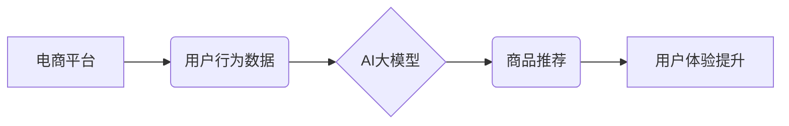

                 

## AI大模型在电商实时个性化推荐中的应用与挑战

> 关键词：AI大模型、电商推荐、个性化推荐、实时推荐、深度学习、Transformer

## 1. 背景介绍

在当今数据爆炸的时代，电商平台面临着海量商品和用户数据，如何精准地推荐用户感兴趣的商品，提升用户体验和转化率成为关键挑战。传统基于规则或协同过滤的推荐算法难以有效应对用户行为的多样性和商品信息的复杂性。近年来，随着深度学习技术的飞速发展，AI大模型在电商推荐领域展现出巨大的潜力。

AI大模型，特别是基于Transformer架构的大语言模型（LLM），凭借其强大的语义理解和文本生成能力，能够从海量文本数据中学习用户偏好和商品特征，实现更精准、更个性化的商品推荐。

## 2. 核心概念与联系

### 2.1  电商推荐系统

电商推荐系统旨在根据用户的历史行为、偏好和上下文信息，预测用户对商品的兴趣，并推荐最相关的商品。

### 2.2  AI大模型

AI大模型是指参数规模庞大、训练数据海量、具备泛化能力强的深度学习模型。它们能够学习复杂的数据模式，并应用于各种自然语言处理任务，如文本分类、机器翻译、问答系统等。

### 2.3  Transformer架构

Transformer是一种基于注意力机制的深度学习架构，能够有效处理序列数据，并捕捉长距离依赖关系。它在自然语言处理领域取得了突破性的进展，例如BERT、GPT等模型都基于Transformer架构。

### 2.4  实时个性化推荐

实时个性化推荐是指根据用户实时行为和上下文信息，动态调整推荐结果，提供更精准、更个性化的商品推荐。

**核心概念与联系流程图**



## 3. 核心算法原理 & 具体操作步骤

### 3.1  算法原理概述

AI大模型在电商实时个性化推荐中的应用主要基于以下核心算法原理：

* **深度学习**: 利用多层神经网络学习用户行为和商品特征之间的复杂关系。
* **注意力机制**: 捕捉用户行为和商品信息中的关键特征，提高推荐的精准度。
* **序列模型**: 处理用户历史行为序列，预测用户未来的兴趣偏好。

### 3.2  算法步骤详解

1. **数据收集和预处理**: 收集用户行为数据、商品信息数据等，并进行清洗、转换、编码等预处理操作。
2. **模型训练**: 利用深度学习框架（如TensorFlow、PyTorch）训练AI大模型，例如BERT、GPT等，学习用户行为和商品特征之间的关系。
3. **特征提取**: 将用户行为和商品信息转化为模型可理解的特征向量。
4. **推荐模型**: 基于训练好的AI大模型，构建推荐模型，预测用户对商品的兴趣评分或点击概率。
5. **结果排序和展示**: 对推荐结果进行排序，并根据用户上下文信息进行个性化展示。

### 3.3  算法优缺点

**优点**:

* **精准度高**: AI大模型能够学习用户行为和商品特征之间的复杂关系，提供更精准的推荐结果。
* **个性化强**: 可以根据用户的历史行为、偏好和上下文信息，提供个性化的商品推荐。
* **可扩展性强**: AI大模型可以处理海量数据，并随着数据量的增加而不断提升推荐精度。

**缺点**:

* **训练成本高**: AI大模型的训练需要大量的计算资源和时间。
* **数据依赖性强**: AI大模型的性能依赖于训练数据的质量和数量。
* **解释性差**: AI大模型的决策过程较为复杂，难以解释其推荐结果背后的逻辑。

### 3.4  算法应用领域

AI大模型在电商推荐领域之外，还广泛应用于其他领域，例如：

* 搜索引擎推荐
* 内容推荐
* 广告推荐
* 医疗诊断
* 金融风险评估

## 4. 数学模型和公式 & 详细讲解 & 举例说明

### 4.1  数学模型构建

在电商实时个性化推荐中，常用的数学模型包括：

* **协同过滤模型**: 基于用户-商品交互矩阵，预测用户对商品的评分或点击概率。
* **深度神经网络模型**: 利用多层神经网络学习用户行为和商品特征之间的复杂关系。
* **Transformer模型**: 基于注意力机制，捕捉用户行为和商品信息中的关键特征。

### 4.2  公式推导过程

**协同过滤模型**:

假设用户 $u$ 对商品 $i$ 的评分为 $r_{ui}$，则协同过滤模型的目标是预测用户 $u$ 对商品 $i$ 的评分。

常用的协同过滤算法包括：

* **基于用户的协同过滤**: 预测用户 $u$ 对商品 $i$ 的评分，基于与用户 $u$ 兴趣相似的用户对商品 $i$ 的评分。
* **基于物品的协同过滤**: 预测用户 $u$ 对商品 $i$ 的评分，基于与商品 $i$ 相关的商品的用户评分。

**深度神经网络模型**:

深度神经网络模型通常使用损失函数来衡量模型预测结果与真实值的差异。常用的损失函数包括：

* **均方误差 (MSE)**: 计算预测值与真实值之间的平方差的平均值。
* **交叉熵损失 (Cross-Entropy Loss)**: 计算预测概率分布与真实概率分布之间的差异。

**Transformer模型**:

Transformer模型的核心是注意力机制，它能够捕捉序列数据中的长距离依赖关系。

注意力机制的计算公式如下：

$$
Attention(Q, K, V) = softmax(\frac{QK^T}{\sqrt{d_k}})V
$$

其中：

* $Q$ 是查询矩阵
* $K$ 是键矩阵
* $V$ 是值矩阵
* $d_k$ 是键向量的维度

### 4.3  案例分析与讲解

**案例**: 假设一个电商平台想要推荐用户喜欢的书籍。

**协同过滤模型**: 可以根据用户购买过的书籍和用户兴趣相似的用户购买的书籍，预测用户对特定书籍的兴趣。

**深度神经网络模型**: 可以利用用户购买历史、浏览记录、评论等数据，训练一个深度神经网络模型，预测用户对特定书籍的评分或点击概率。

**Transformer模型**: 可以利用用户对书籍的评论文本，训练一个Transformer模型，学习用户对书籍的语义理解，并根据用户的评论文本推荐相关的书籍。

## 5. 项目实践：代码实例和详细解释说明

### 5.1  开发环境搭建

* **操作系统**: Linux/macOS
* **编程语言**: Python
* **深度学习框架**: TensorFlow/PyTorch
* **其他工具**: Git、Jupyter Notebook

### 5.2  源代码详细实现

```python
# 使用 TensorFlow 构建一个简单的深度神经网络推荐模型

import tensorflow as tf

# 定义模型输入层
user_input = tf.keras.Input(shape=(10,))  # 用户特征向量
item_input = tf.keras.Input(shape=(5,))  # 商品特征向量

# 定义隐藏层
hidden_layer = tf.keras.layers.Dense(64, activation='relu')(user_input)
hidden_layer = tf.keras.layers.Dense(32, activation='relu')(hidden_layer)

# 定义输出层
output_layer = tf.keras.layers.Dense(1, activation='sigmoid')(hidden_layer)

# 构建模型
model = tf.keras.Model(inputs=[user_input, item_input], outputs=output_layer)

# 编译模型
model.compile(optimizer='adam', loss='binary_crossentropy', metrics=['accuracy'])

# 训练模型
model.fit(x=[user_data, item_data], y=target_data, epochs=10)

# 预测用户对商品的点击概率
prediction = model.predict([user_input, item_input])
```

### 5.3  代码解读与分析

* **模型输入层**: 定义用户特征向量和商品特征向量作为模型输入。
* **隐藏层**: 使用多层全连接神经网络作为隐藏层，提取用户和商品特征之间的关系。
* **输出层**: 使用一个单层全连接神经网络作为输出层，预测用户对商品的点击概率。
* **模型编译**: 使用Adam优化器、二分类交叉熵损失函数和准确率作为评估指标。
* **模型训练**: 使用训练数据训练模型，并调整模型参数。
* **模型预测**: 使用训练好的模型预测用户对商品的点击概率。

### 5.4  运行结果展示

训练完成后，可以评估模型的性能，例如准确率、召回率等。

## 6. 实际应用场景

### 6.1  商品推荐

AI大模型可以根据用户的历史购买记录、浏览记录、搜索记录等数据，推荐用户可能感兴趣的商品。

### 6.2  个性化广告

AI大模型可以根据用户的兴趣爱好、行为特征等数据，推荐个性化的广告，提高广告点击率和转化率。

### 6.3  内容推荐

AI大模型可以根据用户的阅读习惯、观看记录等数据，推荐用户可能感兴趣的内容，例如新闻、视频、文章等。

### 6.4  未来应用展望

AI大模型在电商实时个性化推荐领域还有很大的发展空间，例如：

* **多模态推荐**: 结合文本、图像、视频等多模态数据，提供更丰富的推荐结果。
* **实时个性化**: 基于用户的实时行为和上下文信息，动态调整推荐结果，提供更精准的个性化推荐。
* **解释性推荐**: 提高AI大模型的解释性，让用户能够理解推荐结果背后的逻辑。

## 7. 工具和资源推荐

### 7.1  学习资源推荐

* **书籍**:
    * Deep Learning by Ian Goodfellow
    * Natural Language Processing with Python by Steven Bird
* **在线课程**:
    * Coursera: Deep Learning Specialization
    * Udacity: Deep Learning Nanodegree
* **博客**:
    * Towards Data Science
    * Machine Learning Mastery

### 7.2  开发工具推荐

* **深度学习框架**: TensorFlow, PyTorch
* **数据处理工具**: Pandas, NumPy
* **云计算平台**: AWS, Azure, GCP

### 7.3  相关论文推荐

* Attention Is All You Need (Vaswani et al., 2017)
* BERT: Pre-training of Deep Bidirectional Transformers for Language Understanding (Devlin et al., 2018)
* Transformer-XL: Attentive Language Modeling Beyond Millions of Tokens (Dai et al., 2019)

## 8. 总结：未来发展趋势与挑战

### 8.1  研究成果总结

AI大模型在电商实时个性化推荐领域取得了显著的成果，能够提供更精准、更个性化的推荐结果，提升用户体验和转化率。

### 8.2  未来发展趋势

* **多模态推荐**: 结合文本、图像、视频等多模态数据，提供更丰富的推荐结果。
* **实时个性化**: 基于用户的实时行为和上下文信息，动态调整推荐结果，提供更精准的个性化推荐。
* **解释性推荐**: 提高AI大模型的解释性，让用户能够理解推荐结果背后的逻辑。

### 8.3  面临的挑战

* **数据隐私**: AI大模型的训练需要大量用户数据，如何保护用户隐私是一个重要的挑战。
* **模型可解释性**: AI大模型的决策过程较为复杂，难以解释其推荐结果背后的逻辑，这可能会导致用户对推荐结果的信任度降低。
* **公平性**: AI大模型可能会存在偏见，导致推荐结果不公平，需要进行公平性评估和调优。

### 8.4  研究展望

未来，AI大模型在电商实时个性化推荐领域将继续发展，并与其他技术融合，例如：

* **增强现实 (AR)**: 利用AR技术，为用户提供更沉浸式的商品体验。
* **虚拟现实 (VR)**: 利用VR技术，为用户提供虚拟试衣、虚拟购物等体验。
* **物联网 (IoT)**: 利用IoT技术，收集用户的实时行为数据，提供更精准的个性化推荐。


## 9. 附录：常见问题与解答

**Q1: AI大模型的训练成本很高，如何降低训练成本？**

**A1:** 可以采用以下方法降低训练成本：

* 使用预训练模型: 利用开源的预训练模型，减少模型训练时间和资源消耗。
* 数据压缩: 使用数据压缩技术，减少训练数据的大小。
* 模型剪枝: 通过移除模型中的冗余参数，减少模型规模和训练成本。

**Q2: 如何评估AI大模型的推荐效果？**

**A2:** 可以使用以下指标评估AI大模型的推荐效果：

* 点击率 (CTR): 用户点击推荐商品的比例。
* 转换率 (CVR): 用户点击推荐商品后购买商品的比例。
* 用户满意度: 通过用户反馈调查等方式，评估用户对推荐结果的满意度。

**Q3: 如何解决AI大模型的解释性问题？**

**A3:** 可以采用以下方法提高AI大模型的解释性：

* 使用可解释的机器学习模型: 例如，决策树、线性回归等模型。
* 使用注意力机制: 通过分析模型对输入数据的注意力权重，解释模型的决策过程。
* 使用反向传播: 通过反向传播算法，分析模型参数的变化对输出结果的影响。


作者：禅与计算机程序设计艺术 / Zen and the Art of Computer Programming<end_of_turn>

