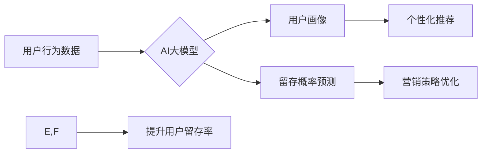

                 

## AI大模型在电商平台用户留存策略中的应用

> 关键词：电商平台、用户留存、AI大模型、推荐系统、个性化营销、深度学习、自然语言处理

## 1. 背景介绍

在当今竞争激烈的电商市场，用户留存率已成为衡量平台成功与否的关键指标。用户留存率高意味着平台能够持续吸引和留住用户，从而带来稳定的收入和增长。然而，传统的用户留存策略往往依赖于简单的行为分析和规则驱动，难以应对用户行为的多样性和复杂性。

近年来，随着人工智能（AI）技术的快速发展，特别是深度学习和自然语言处理（NLP）技术的突破，AI大模型在电商平台用户留存策略中的应用逐渐成为热点。AI大模型能够通过学习海量用户数据，挖掘用户行为模式和偏好，从而提供更精准、更个性化的用户留存策略。

## 2. 核心概念与联系

### 2.1 用户留存策略

用户留存策略是指电商平台为了提高用户重复访问和消费的策略，旨在将新用户转化为忠实用户，并降低用户流失率。

### 2.2 AI大模型

AI大模型是指训练规模庞大、参数数量众多的深度学习模型，能够学习复杂的数据模式和关系，并进行各种智能任务，例如文本生成、图像识别、语音理解等。

### 2.3 核心概念联系

AI大模型能够通过学习用户行为数据、商品信息、平台运营数据等，构建用户画像，预测用户留存概率，并提供个性化的推荐和营销策略，从而有效提升用户留存率。

**Mermaid 流程图**



## 3. 核心算法原理 & 具体操作步骤

### 3.1 算法原理概述

AI大模型在电商平台用户留存策略中的应用主要基于以下核心算法：

* **深度学习**: 通过多层神经网络学习用户行为数据，提取特征和模式，构建用户画像和预测留存概率。
* **自然语言处理**: 分析用户评论、聊天记录等文本数据，理解用户需求和反馈，提供更精准的个性化推荐和营销策略。
* **推荐系统**: 基于用户历史行为、商品属性和平台规则，推荐用户感兴趣的商品，提高用户参与度和复购率。

### 3.2 算法步骤详解

1. **数据收集和预处理**: 收集用户行为数据、商品信息、平台运营数据等，并进行清洗、转换和特征工程，构建训练数据。
2. **模型训练**: 选择合适的深度学习模型，例如循环神经网络（RNN）、长短期记忆网络（LSTM）或Transformer，对训练数据进行训练，学习用户行为模式和留存规律。
3. **模型评估**: 使用测试数据评估模型性能，例如准确率、召回率和F1-score，并进行模型调优，提高模型预测精度。
4. **用户画像构建**: 基于训练好的模型，对用户进行画像分析，识别用户兴趣、偏好和行为特征，构建用户细分模型。
5. **留存概率预测**: 利用模型预测用户未来留存概率，并根据预测结果进行个性化策略推荐。
6. **个性化推荐**: 根据用户画像和留存概率预测，推荐用户感兴趣的商品、活动和内容，提高用户参与度和复购率。
7. **营销策略优化**: 根据用户留存行为分析，优化营销策略，例如推送个性化优惠券、会员权益和促销活动，提高用户留存率。

### 3.3 算法优缺点

**优点**:

* **精准度高**: AI大模型能够学习用户行为数据中的复杂模式，提供更精准的用户画像和留存预测。
* **个性化强**: AI大模型可以根据用户的个性化需求和行为特征，提供个性化的推荐和营销策略。
* **自动化程度高**: AI大模型可以自动化执行用户留存策略，减少人工干预，提高效率。

**缺点**:

* **数据依赖性强**: AI大模型的性能依赖于训练数据的质量和数量，数据不足或数据质量低会影响模型效果。
* **计算资源需求高**: 训练大型AI模型需要大量的计算资源和时间，成本较高。
* **解释性弱**: AI模型的决策过程往往是复杂的，难以解释模型的决策逻辑，导致模型的可解释性较弱。

### 3.4 算法应用领域

AI大模型在电商平台用户留存策略中的应用领域广泛，包括：

* **用户画像构建**: 识别用户兴趣、偏好和行为特征，进行用户细分和精准营销。
* **留存概率预测**: 预测用户未来留存概率，制定针对性的留存策略。
* **个性化推荐**: 推荐用户感兴趣的商品、活动和内容，提高用户参与度和复购率。
* **营销策略优化**: 根据用户留存行为分析，优化营销策略，例如推送个性化优惠券、会员权益和促销活动。

## 4. 数学模型和公式 & 详细讲解 & 举例说明

### 4.1 数学模型构建

用户留存模型通常采用概率模型，例如泊松分布、指数分布或生存分析模型，来预测用户未来留存概率。

**泊松分布**: 用于建模用户在特定时间段内发生特定事件的次数，例如用户在一天内访问平台的次数。

**指数分布**: 用于建模用户离开平台的时间间隔，例如用户首次购买后离开平台的时间。

**生存分析模型**: 用于建模用户在特定时间点之前离开平台的概率，考虑用户在不同时间段的留存情况。

### 4.2 公式推导过程

假设用户在时间 $t$ 离开平台的概率为 $P(t)$，则用户在时间 $t$ 之前留存的概率为 $1-P(t)$。

泊松分布的概率质量函数为：

$$P(k) = \frac{e^{-\lambda} \lambda^k}{k!}$$

其中，$k$ 是事件发生的次数，$\lambda$ 是事件发生的平均次数。

指数分布的概率密度函数为：

$$f(t) = \lambda e^{-\lambda t}$$

其中，$t$ 是时间间隔，$\lambda$ 是平均事件发生率。

生存分析模型的风险函数为：

$$h(t) = \frac{f(t)}{1-F(t)}$$

其中，$f(t)$ 是密度函数，$F(t)$ 是累积分布函数。

### 4.3 案例分析与讲解

假设电商平台希望预测用户在 30 天内留存的概率。可以使用历史用户数据训练一个生存分析模型，并根据模型预测结果，制定针对性的留存策略。

例如，如果模型预测用户在 30 天内留存的概率为 50%，平台可以针对这部分用户发送个性化优惠券或会员权益，提高用户留存率。

## 5. 项目实践：代码实例和详细解释说明

### 5.1 开发环境搭建

* Python 3.x
* TensorFlow 或 PyTorch 深度学习框架
* Scikit-learn 机器学习库
* Pandas 数据处理库
* Matplotlib 数据可视化库

### 5.2 源代码详细实现

```python
# 导入必要的库
import pandas as pd
from sklearn.model_selection import train_test_split
from tensorflow.keras.models import Sequential
from tensorflow.keras.layers import Dense

# 加载用户数据
data = pd.read_csv('user_data.csv')

# 数据预处理
# ...

# 将数据分为训练集和测试集
X_train, X_test, y_train, y_test = train_test_split(data[['feature1', 'feature2', ...]], data['留存'], test_size=0.2)

# 创建深度学习模型
model = Sequential()
model.add(Dense(64, activation='relu', input_shape=(X_train.shape[1],)))
model.add(Dense(32, activation='relu'))
model.add(Dense(1, activation='sigmoid'))

# 编译模型
model.compile(loss='binary_crossentropy', optimizer='adam', metrics=['accuracy'])

# 训练模型
model.fit(X_train, y_train, epochs=10, batch_size=32)

# 评估模型
loss, accuracy = model.evaluate(X_test, y_test)
print('Loss:', loss)
print('Accuracy:', accuracy)

# 使用模型预测留存概率
predictions = model.predict(X_test)
```

### 5.3 代码解读与分析

* 代码首先导入必要的库，并加载用户数据。
* 数据预处理步骤根据实际情况进行调整，例如特征工程、数据归一化等。
* 数据分为训练集和测试集，用于训练和评估模型。
* 创建一个深度学习模型，包含多个隐藏层和输出层。
* 编译模型，选择损失函数、优化器和评估指标。
* 训练模型，并根据训练结果调整模型参数。
* 评估模型性能，并使用模型预测留存概率。

### 5.4 运行结果展示

运行代码后，会输出模型的训练损失、准确率以及预测结果。

## 6. 实际应用场景

### 6.1 用户画像构建

AI大模型可以分析用户行为数据，例如浏览历史、购买记录、评论内容等，构建用户画像，识别用户兴趣、偏好和行为特征。

例如，电商平台可以根据用户的购买历史，构建用户兴趣标签，例如“服装爱好者”、“电子产品爱好者”等，并根据这些标签推荐相关商品。

### 6.2 留存概率预测

AI大模型可以预测用户未来留存概率，帮助电商平台制定针对性的留存策略。

例如，如果模型预测用户在 30 天内留存概率较低，平台可以发送个性化优惠券或会员权益，提高用户留存率。

### 6.3 个性化推荐

AI大模型可以根据用户的兴趣、偏好和行为特征，推荐个性化的商品、活动和内容，提高用户参与度和复购率。

例如，电商平台可以根据用户的浏览历史，推荐用户可能感兴趣的商品，或者根据用户的购买记录，推荐用户可能需要的搭配商品。

### 6.4 未来应用展望

随着AI技术的不断发展，AI大模型在电商平台用户留存策略中的应用将更加广泛和深入。

例如，未来可能出现以下应用场景：

* **基于对话的个性化推荐**: 利用自然语言处理技术，与用户进行对话，了解用户的需求和偏好，提供更精准的个性化推荐。
* **动态留存策略**: 根据用户的实时行为和环境变化，动态调整留存策略，提高留存效果。
* **多平台用户留存**: 将用户数据整合到多个平台，构建全渠道用户画像，实现跨平台的用户留存策略。

## 7. 工具和资源推荐

### 7.1 学习资源推荐

* **书籍**:
    * 深度学习
    * 自然语言处理
    * 机器学习实战
* **在线课程**:
    * Coursera
    * edX
    * Udacity
* **博客和论坛**:
    * TensorFlow 官方博客
    * PyTorch 官方博客
    * Kaggle

### 7.2 开发工具推荐

* **深度学习框架**: TensorFlow, PyTorch
* **机器学习库**: Scikit-learn
* **数据处理库**: Pandas
* **数据可视化库**: Matplotlib, Seaborn

### 7.3 相关论文推荐

* **深度学习**:
    * ImageNet Classification with Deep Convolutional Neural Networks
    * Attention Is All You Need
* **自然语言处理**:
    * BERT: Pre-training of Deep Bidirectional Transformers for Language Understanding
    * GPT-3: Language Models are Few-Shot Learners
* **用户留存**:
    * A Framework for User Retention Modeling
    * Predicting User Churn with Machine Learning

## 8. 总结：未来发展趋势与挑战

### 8.1 研究成果总结

AI大模型在电商平台用户留存策略中的应用取得了显著成果，能够提高用户留存率、提升用户体验和促进平台发展。

### 8.2 未来发展趋势

未来，AI大模型在电商平台用户留存策略中的应用将朝着以下方向发展：

* **模型更加精准**: 随着数据量的增加和算法的改进，AI模型的预测精度将进一步提高。
* **策略更加个性化**: AI模型将能够更加精准地识别用户的个性化需求，提供更加个性化的留存策略。
* **应用场景更加广泛**: AI大模型将应用于更多电商平台的业务场景，例如用户画像构建、商品推荐、营销策略优化等。

### 8.3 面临的挑战

AI大模型在电商平台用户留存策略中的应用也面临一些挑战：

* **数据隐私**: 用户数据隐私保护是一个重要的议题，需要采取有效的措施保障用户数据安全。
* **模型解释性**: AI模型的决策过程往往是复杂的，难以解释模型的决策逻辑，需要提高模型的可解释性。
* **算法公平性**: AI模型可能存在偏见，导致不公平的留存策略，需要确保算法的公平性。

### 8.4 研究展望

未来，需要进一步研究以下问题：

* 如何提高AI模型的预测精度和解释性？
* 如何保障用户数据隐私和算法公平性？
* 如何将AI大模型应用于更多电商平台的业务场景？


## 9. 附录：常见问题与解答

**Q1: AI大模型需要多少数据才能训练？**

A1: 训练AI大模型需要大量的训练数据，数据量通常以百万或亿级别计算。

**Q2: 如何评估AI模型的性能？**

A2: 可以使用准确率、召回率、F1-score等指标评估AI模型的性能。

**Q3: 如何解决AI模型的过拟合问题？**

A3: 可以使用正则化、Dropout等技术来解决AI模型的过拟合问题。

**Q4: 如何保障用户数据隐私？**

A4: 可以采用数据加密、匿名化等技术来保障用户数据隐私。

**Q5: 如何确保AI模型的公平性？**

A5: 可以使用公平性评估指标，并采取措施消除算法中的偏见。


作者：禅与计算机程序设计艺术 / Zen and the Art of Computer Programming 
<end_of_turn>

