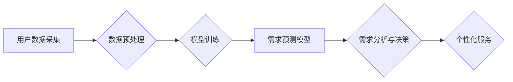

                 

## AI大模型在电商平台用户需求预测中的作用

> 关键词：AI大模型、用户需求预测、电商平台、机器学习、深度学习、自然语言处理、推荐系统

## 1. 背景介绍

随着电商平台的蓬勃发展，用户需求的多样化和复杂化日益突出。精准预测用户需求已成为电商平台提升用户体验、优化运营效率和促进商业增长的关键。传统的用户需求预测方法往往依赖于历史数据和规则引擎，难以捕捉用户行为的动态变化和潜在需求。而近年来，人工智能（AI）技术的快速发展，特别是大模型技术的突破，为电商平台用户需求预测提供了全新的解决方案。

AI大模型，指的是拥有海量参数和强大的学习能力的深度学习模型，能够从海量数据中学习到复杂的模式和关系。其强大的泛化能力和表达能力使其在用户需求预测领域展现出巨大的潜力。

## 2. 核心概念与联系

### 2.1 用户需求预测

用户需求预测是指通过分析用户历史行为、偏好、环境等因素，预测用户未来可能的需求。其目标是帮助电商平台提供更精准的商品推荐、个性化的营销服务和更有效的库存管理。

### 2.2 AI大模型

AI大模型是指参数规模庞大、训练数据海量、学习能力强的大型深度学习模型。其主要特点包括：

* **参数规模庞大:** 大模型通常拥有数十亿甚至数千亿个参数，能够学习到更复杂的模式和关系。
* **海量数据训练:** 大模型需要大量的训练数据才能发挥其强大的学习能力。
* **强大的泛化能力:** 大模型能够将从训练数据中学习到的知识应用到新的数据和场景中。
* **多模态学习能力:** 一些大模型能够处理多种类型的输入数据，例如文本、图像、音频等。

### 2.3 核心架构

AI大模型在电商平台用户需求预测中的应用架构通常包括以下几个模块：



**数据采集:** 从电商平台的各种数据源，例如用户行为日志、商品信息、评论数据等收集用户需求相关数据。

**数据预处理:** 对收集到的数据进行清洗、转换、特征工程等处理，使其能够被模型有效地学习。

**模型训练:** 使用AI大模型进行模型训练，训练目标是让模型能够准确预测用户的需求。

**需求预测模型:** 训练好的AI大模型，用于对用户的需求进行预测。

**需求分析与决策:** 对预测结果进行分析，并根据分析结果进行决策，例如推荐商品、制定营销策略等。

**个性化服务:** 根据需求预测结果，为用户提供个性化的服务，例如推荐商品、个性化广告等。

## 3. 核心算法原理 & 具体操作步骤

### 3.1 算法原理概述

在电商平台用户需求预测中，常用的AI大模型算法包括：

* **Transformer:** Transformer是一种基于注意力机制的深度学习模型，能够有效捕捉文本序列中的长距离依赖关系，在自然语言处理任务中取得了优异的性能。
* **Recurrent Neural Networks (RNN):** RNN是一种能够处理序列数据的深度学习模型，能够学习到时间序列中的模式和趋势。
* **Graph Neural Networks (GNN):** GNN是一种能够处理图结构数据的深度学习模型，能够学习到节点之间的关系和特征，在推荐系统中应用广泛。

### 3.2 算法步骤详解

以Transformer模型为例，其训练过程可以概括为以下步骤：

1. **数据预处理:** 将用户需求数据进行清洗、转换、编码等处理，使其能够被模型输入。
2. **模型构建:** 根据Transformer模型的架构，构建模型结构，包括编码器、解码器和注意力机制等模块。
3. **模型训练:** 使用训练数据训练模型，通过反向传播算法优化模型参数，使模型能够准确预测用户需求。
4. **模型评估:** 使用测试数据评估模型的性能，例如准确率、召回率等指标。
5. **模型部署:** 将训练好的模型部署到电商平台，用于实时预测用户需求。

### 3.3 算法优缺点

**优点:**

* **强大的学习能力:** AI大模型能够从海量数据中学习到复杂的模式和关系，预测精度更高。
* **泛化能力强:** AI大模型能够将从训练数据中学习到的知识应用到新的数据和场景中。
* **个性化服务:** AI大模型能够根据用户的历史行为和偏好，提供个性化的服务。

**缺点:**

* **数据依赖性强:** AI大模型需要大量的训练数据才能发挥其强大的学习能力。
* **计算资源消耗大:** 训练AI大模型需要大量的计算资源，成本较高。
* **可解释性差:** AI大模型的决策过程较为复杂，难以解释其预测结果。

### 3.4 算法应用领域

AI大模型在电商平台用户需求预测领域有着广泛的应用，例如：

* **商品推荐:** 根据用户的历史购买记录、浏览记录、评分等信息，推荐用户可能感兴趣的商品。
* **个性化营销:** 根据用户的需求和偏好，制定个性化的营销策略，例如发送个性化广告、优惠券等。
* **库存管理:** 根据用户的需求预测，优化库存管理，避免缺货或积压。
* **新品开发:** 分析用户的需求趋势，为新品开发提供参考。

## 4. 数学模型和公式 & 详细讲解 & 举例说明

### 4.1 数学模型构建

在用户需求预测中，常用的数学模型包括线性回归、逻辑回归、支持向量机等。

**线性回归模型:**

$$
y = \beta_0 + \beta_1x_1 + \beta_2x_2 + ... + \beta_nx_n + \epsilon
$$

其中：

* $y$ 是预测的目标变量，例如用户购买商品的概率。
* $x_1, x_2, ..., x_n$ 是用户的特征变量，例如年龄、性别、购买历史等。
* $\beta_0, \beta_1, ..., \beta_n$ 是模型的参数。
* $\epsilon$ 是误差项。

**逻辑回归模型:**

$$
P(y=1|x) = \frac{1}{1 + e^{-( \beta_0 + \beta_1x_1 + \beta_2x_2 + ... + \beta_nx_n )}}
$$

其中：

* $P(y=1|x)$ 是用户购买商品的概率。
* $x_1, x_2, ..., x_n$ 是用户的特征变量。
* $\beta_0, \beta_1, ..., \beta_n$ 是模型的参数。

### 4.2 公式推导过程

线性回归模型的参数可以通过最小二乘法进行估计，逻辑回归模型的参数可以通过最大似然估计进行估计。

### 4.3 案例分析与讲解

假设我们想要预测用户是否会购买某款商品，我们可以使用逻辑回归模型。用户的特征变量包括年龄、性别、购买历史等。通过训练逻辑回归模型，我们可以得到模型参数，并使用这些参数预测新用户的购买概率。

## 5. 项目实践：代码实例和详细解释说明

### 5.1 开发环境搭建

* Python 3.x
* TensorFlow 或 PyTorch 深度学习框架
* Jupyter Notebook 或 VS Code 代码编辑器

### 5.2 源代码详细实现

```python
# 导入必要的库
import tensorflow as tf

# 定义模型结构
model = tf.keras.Sequential([
    tf.keras.layers.Dense(64, activation='relu', input_shape=(num_features,)),
    tf.keras.layers.Dense(32, activation='relu'),
    tf.keras.layers.Dense(1, activation='sigmoid')
])

# 编译模型
model.compile(optimizer='adam',
              loss='binary_crossentropy',
              metrics=['accuracy'])

# 训练模型
model.fit(X_train, y_train, epochs=10, batch_size=32)

# 评估模型
loss, accuracy = model.evaluate(X_test, y_test)
print('Loss:', loss)
print('Accuracy:', accuracy)

# 预测新用户的购买概率
predictions = model.predict(new_user_data)
```

### 5.3 代码解读与分析

* 首先，我们导入必要的库，例如TensorFlow深度学习框架。
* 然后，我们定义模型结构，包括输入层、隐藏层和输出层。
* 接着，我们编译模型，选择优化器、损失函数和评估指标。
* 接下来，我们训练模型，使用训练数据进行模型训练。
* 然后，我们评估模型，使用测试数据评估模型的性能。
* 最后，我们使用训练好的模型预测新用户的购买概率。

### 5.4 运行结果展示

训练完成后，我们可以查看模型的损失值和准确率，以及对新用户的预测结果。

## 6. 实际应用场景

### 6.1 商品推荐

AI大模型可以根据用户的历史购买记录、浏览记录、评分等信息，推荐用户可能感兴趣的商品。例如，亚马逊的推荐系统就使用了AI大模型，能够精准地推荐用户可能喜欢的商品。

### 6.2 个性化营销

AI大模型可以根据用户的需求和偏好，制定个性化的营销策略，例如发送个性化广告、优惠券等。例如，淘宝的营销系统就使用了AI大模型，能够根据用户的兴趣爱好，推送个性化的广告。

### 6.3 库存管理

AI大模型可以根据用户的需求预测，优化库存管理，避免缺货或积压。例如，京东的库存管理系统就使用了AI大模型，能够根据用户的需求预测，及时调整库存水平。

### 6.4 未来应用展望

随着AI技术的不断发展，AI大模型在电商平台用户需求预测领域将有更广泛的应用，例如：

* **更精准的个性化推荐:** AI大模型能够更加精准地理解用户的需求，提供更个性化的商品推荐。
* **更有效的营销策略:** AI大模型能够帮助电商平台制定更有效的营销策略，提高营销效果。
* **更智能的库存管理:** AI大模型能够帮助电商平台实现更智能的库存管理，降低库存成本。
* **更丰富的用户体验:** AI大模型能够为用户提供更丰富的用户体验，例如个性化客服、智能购物助手等。

## 7. 工具和资源推荐

### 7.1 学习资源推荐

* **书籍:**
    * 《深度学习》
    * 《自然语言处理》
    * 《机器学习实战》
* **在线课程:**
    * Coursera
    * edX
    * Udacity

### 7.2 开发工具推荐

* **TensorFlow:** https://www.tensorflow.org/
* **PyTorch:** https://pytorch.org/
* **Jupyter Notebook:** https://jupyter.org/
* **VS Code:** https://code.visualstudio.com/

### 7.3 相关论文推荐

* Attention Is All You Need
* BERT: Pre-training of Deep Bidirectional Transformers for Language Understanding
* Graph Convolutional Networks

## 8. 总结：未来发展趋势与挑战

### 8.1 研究成果总结

AI大模型在电商平台用户需求预测领域取得了显著的成果，能够提高预测精度、个性化服务和运营效率。

### 8.2 未来发展趋势

* **模型规模更大:** 未来，AI大模型的规模将进一步扩大，学习能力将更加强大。
* **多模态学习:** AI大模型将能够处理多种类型的输入数据，例如文本、图像、音频等，提供更全面的用户需求预测。
* **解释性更强:** 研究者将致力于提高AI大模型的解释性，使模型的决策过程更加透明。

### 8.3 面临的挑战

* **数据隐私:** AI大模型需要大量的用户数据进行训练，如何保护用户数据隐私是一个重要的挑战。
* **计算资源:** 训练大型AI模型需要大量的计算资源，成本较高。
* **模型可解释性:** AI大模型的决策过程较为复杂，难以解释其预测结果，这可能会导致用户对模型结果的信任度降低。

### 8.4 研究展望

未来，研究者将继续探索AI大模型在电商平台用户需求预测领域的应用，并致力于解决上述挑战，推动AI技术在电商领域的更广泛应用。

## 9. 附录：常见问题与解答

### 9.1 如何选择合适的AI大模型？

选择合适的AI大模型需要根据具体的需求和场景进行选择。例如，如果需要预测用户的购买概率，可以使用逻辑回归模型；如果需要推荐用户可能感兴趣的商品，可以使用Transformer模型。

### 9.2 如何处理用户数据隐私？

在使用AI大模型进行用户需求预测时，需要采取措施保护用户数据隐私，例如：

* **数据匿名化:** 对用户数据进行匿名处理，去除个人识别信息。
* **数据加密:** 对用户数据进行加密，防止数据泄露。
* **数据安全:** 建立完善的数据安全机制，防止数据被恶意攻击。

### 9.3 如何提高AI大模型的解释性？

提高AI大模型的解释性可以通过以下方法：

* **使用可解释的模型:** 选择解释性较强的模型，例如线性回归模型。
* **使用注意力机制:** 使用注意力机制可以帮助理解模型对哪些输入特征更加关注。
* **进行模型可视化:** 对模型进行可视化，可以帮助理解模型的决策过程。


作者：禅与计算机程序设计艺术 / Zen and the Art of Computer Programming 
<end_of_turn>

