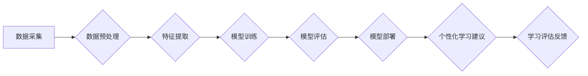

                 

## AI如何改变教育评估和个性化学习

> 关键词：人工智能、教育评估、个性化学习、机器学习、深度学习、自然语言处理、数据分析

## 1. 背景介绍

教育评估一直是教育体系中至关重要的环节，它不仅用于衡量学生的学习成果，也为教师提供学生学习情况的反馈，帮助他们调整教学策略。然而，传统的教育评估方式往往存在着局限性，例如：

* **单一评估指标：** 传统的考试和作业往往只关注学生的知识记忆和应用能力，而忽略了学生的创造力、批判性思维和解决问题的能力等其他重要素养。
* **缺乏个性化：** 传统的评估方式对所有学生采用相同的标准，无法满足不同学生个性化学习需求。
* **评估过程耗时：** 传统的评估方式需要教师花费大量时间和精力进行批改和评分，这限制了教师的教学效率。

随着人工智能技术的快速发展，AI技术为教育评估和个性化学习带来了新的机遇。AI算法能够分析海量数据，识别学习模式，并根据学生的个体差异提供个性化的学习建议和评估反馈。

## 2. 核心概念与联系

**2.1 教育评估与个性化学习**

教育评估旨在衡量学生的学习成果，并为教学改进提供依据。个性化学习则强调根据学生的个体差异，提供定制化的学习内容、节奏和方式。

**2.2 人工智能在教育中的应用**

人工智能在教育中的应用涵盖多个领域，包括：

* **智能辅导系统：** 提供个性化的学习建议和指导，帮助学生克服学习困难。
* **自动批改系统：** 自动批改学生的作业和考试，节省教师时间和精力。
* **学习进度跟踪系统：** 跟踪学生的学习进度，及时发现学习问题并提供干预措施。
* **个性化学习平台：** 根据学生的学习风格和兴趣，提供定制化的学习内容和资源。

**2.3 AI流程图**



## 3. 核心算法原理 & 具体操作步骤

**3.1 算法原理概述**

人工智能在教育评估和个性化学习中的应用主要依赖于以下核心算法：

* **机器学习：** 通过训练模型，从数据中学习规律，并预测学生的学习成果或学习需求。
* **深度学习：** 利用多层神经网络，对复杂数据进行更深入的学习和分析。
* **自然语言处理：** 处理和理解学生的文本输入，例如作业、考试答案和学习日志。

**3.2 算法步骤详解**

1. **数据采集：** 收集学生的学习数据，包括考试成绩、作业完成情况、学习日志、课堂参与度等。
2. **数据预处理：** 对收集到的数据进行清洗、转换和格式化，以便于模型训练。
3. **特征提取：** 从学习数据中提取有价值的特征，例如学生的学习习惯、知识掌握程度、学习风格等。
4. **模型训练：** 使用机器学习或深度学习算法，训练模型以预测学生的学习成果或学习需求。
5. **模型评估：** 使用测试数据评估模型的性能，并进行调整和优化。
6. **模型部署：** 将训练好的模型部署到实际应用场景中，例如智能辅导系统或个性化学习平台。

**3.3 算法优缺点**

**优点：**

* **个性化学习：** 根据学生的个体差异提供定制化的学习建议和评估反馈。
* **提高效率：** 自动化批改作业和评估学习进度，节省教师时间和精力。
* **数据驱动决策：** 利用数据分析结果，为教学改进提供科学依据。

**缺点：**

* **数据依赖：** 算法的性能取决于数据的质量和数量。
* **算法解释性：** 一些深度学习算法的决策过程难以解释，这可能导致对结果的信任度降低。
* **伦理问题：** AI在教育中的应用可能引发一些伦理问题，例如数据隐私和算法偏见。

**3.4 算法应用领域**

* **智能辅导系统：** 为学生提供个性化的学习建议和指导。
* **自动批改系统：** 自动批改学生的作业和考试，节省教师时间和精力。
* **学习进度跟踪系统：** 跟踪学生的学习进度，及时发现学习问题并提供干预措施。
* **个性化学习平台：** 根据学生的学习风格和兴趣，提供定制化的学习内容和资源。

## 4. 数学模型和公式 & 详细讲解 & 举例说明

**4.1 数学模型构建**

在教育评估和个性化学习中，常用的数学模型包括：

* **线性回归模型：** 用于预测学生的学习成绩，根据学生的学习时间、学习效率等因素进行预测。
* **逻辑回归模型：** 用于预测学生的学习状态，例如是否会通过考试、是否需要额外的帮助等。
* **支持向量机模型：** 用于分类学生，例如将学生分为不同的学习能力组别。

**4.2 公式推导过程**

例如，线性回归模型的公式如下：

$$y = mx + c$$

其中：

* $y$ 是预测的学习成绩
* $x$ 是学生的学习时间
* $m$ 是学习效率
* $c$ 是截距

模型参数 $m$ 和 $c$ 通过最小化预测误差来确定。

**4.3 案例分析与讲解**

假设我们收集了100名学生的学习数据，包括他们的学习时间和考试成绩。我们可以使用线性回归模型来预测学生的考试成绩。

通过训练模型，我们得到以下参数：

* $m = 0.8$
* $c = 60$

这意味着，学生的学习时间每增加1小时，考试成绩预计会提高0.8分。

## 5. 项目实践：代码实例和详细解释说明

**5.1 开发环境搭建**

* Python 3.x
* TensorFlow 或 PyTorch
* Jupyter Notebook

**5.2 源代码详细实现**

```python
import tensorflow as tf

# 定义模型
model = tf.keras.Sequential([
    tf.keras.layers.Dense(64, activation='relu', input_shape=(1,)),
    tf.keras.layers.Dense(1)
])

# 编译模型
model.compile(optimizer='adam', loss='mse')

# 训练模型
model.fit(x_train, y_train, epochs=10)

# 评估模型
loss = model.evaluate(x_test, y_test)
print('Loss:', loss)

# 预测
predictions = model.predict(x_new)
print('Predictions:', predictions)
```

**5.3 代码解读与分析**

* 代码首先定义了一个简单的线性回归模型，包含两层神经网络。
* 然后，模型被编译，指定了优化器、损失函数等参数。
* 接着，模型使用训练数据进行训练，训练过程持续10个epochs。
* 训练完成后，模型的性能被评估，并输出损失值。
* 最后，模型用于预测新的数据，输出预测结果。

**5.4 运行结果展示**

运行结果将显示模型的损失值和预测结果。

## 6. 实际应用场景

**6.1 智能辅导系统**

AI驱动的智能辅导系统可以根据学生的学习进度和学习风格，提供个性化的学习建议和指导。例如，如果学生在某个知识点上遇到困难，系统可以推荐相关的学习资源或练习题。

**6.2 自动批改系统**

AI驱动的自动批改系统可以自动批改学生的作业和考试，节省教师时间和精力。例如，系统可以自动批改学生的数学题、英语作文等。

**6.3 学习进度跟踪系统**

AI驱动的学习进度跟踪系统可以跟踪学生的学习进度，及时发现学习问题并提供干预措施。例如，系统可以分析学生的学习日志，识别出他们可能遇到的困难，并及时提醒教师进行干预。

**6.4 未来应用展望**

随着人工智能技术的不断发展，AI在教育评估和个性化学习中的应用将更加广泛和深入。例如：

* **更精准的学习评估：** AI算法可以更加精准地评估学生的学习成果，并识别出学生的个性化学习需求。
* **更个性化的学习体验：** AI可以根据学生的学习风格和兴趣，提供更加个性化的学习体验。
* **更有效的教学改进：** AI可以帮助教师分析学生的学习数据，并提供有效的教学改进建议。

## 7. 工具和资源推荐

**7.1 学习资源推荐**

* **Coursera:** https://www.coursera.org/
* **edX:** https://www.edx.org/
* **Udacity:** https://www.udacity.com/

**7.2 开发工具推荐**

* **TensorFlow:** https://www.tensorflow.org/
* **PyTorch:** https://pytorch.org/
* **Jupyter Notebook:** https://jupyter.org/

**7.3 相关论文推荐**

* **Personalized Learning with AI:** https://arxiv.org/abs/1906.04194
* **AI-Powered Education: A Review of the Literature:** https://www.researchgate.net/publication/335974770_AI-Powered_Education_A_Review_of_the_Literature

## 8. 总结：未来发展趋势与挑战

**8.1 研究成果总结**

人工智能在教育评估和个性化学习领域取得了显著的成果，例如：

* 开发出能够准确预测学生学习成果的模型。
* 创建出能够提供个性化学习建议的智能辅导系统。
* 建立起能够跟踪学生学习进度并提供干预措施的学习进度跟踪系统。

**8.2 未来发展趋势**

未来，人工智能在教育评估和个性化学习领域的应用将更加深入和广泛，例如：

* **更精准的学习评估：** 利用多模态数据，例如文本、图像、音频等，进行更精准的学习评估。
* **更个性化的学习体验：** 利用AI技术，为学生提供更加个性化的学习体验，例如虚拟现实和增强现实学习。
* **更有效的教学改进：** 利用AI技术，帮助教师分析学生的学习数据，并提供更有效的教学改进建议。

**8.3 面临的挑战**

人工智能在教育评估和个性化学习领域的应用也面临着一些挑战，例如：

* **数据隐私和安全：** 学生数据需要得到妥善保护，防止泄露和滥用。
* **算法偏见：** AI算法可能会存在偏见，导致对不同学生的不公平对待。
* **伦理问题：** AI在教育中的应用可能会引发一些伦理问题，例如学生依赖AI过度，教师的角色变化等。

**8.4 研究展望**

未来，需要进一步研究如何解决这些挑战，确保人工智能在教育中的应用能够公平、安全、有效地服务于学生和教师。

## 9. 附录：常见问题与解答

**9.1 如何确保AI算法的公平性？**

* 使用多元化的训练数据，减少算法偏见。
* 定期评估算法的公平性，并进行调整和优化。
* 制定明确的伦理规范，指导AI算法的开发和应用。

**9.2 如何保护学生数据的隐私和安全？**

* 采用加密技术保护学生数据。
* 严格控制学生数据的访问权限。
* 遵守相关数据保护法规。

**9.3 AI是否会取代教师？**

AI可以帮助教师提高效率，但它不会取代教师。教师仍然是教育的核心，他们需要提供情感支持、指导和启发。


作者：禅与计算机程序设计艺术 / Zen and the Art of Computer Programming 
<end_of_turn>

