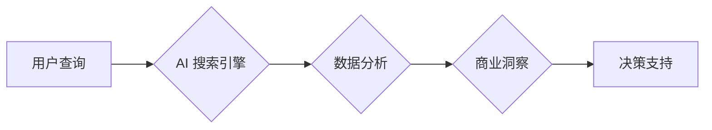

                 

## AI搜索引擎在商业智能中的应用

> 关键词：人工智能、搜索引擎、商业智能、数据分析、机器学习、自然语言处理、知识图谱

## 1. 背景介绍

商业智能 (BI) 旨在通过数据分析和洞察来支持企业决策。传统 BI 工具主要依赖于结构化数据，例如销售记录、财务报表等，但现代企业面临着海量非结构化数据的挑战，例如文本、图像、音频等。这些数据蕴藏着丰富的商业价值，但传统 BI 工具难以有效挖掘。

人工智能 (AI) 尤其是机器学习 (ML) 和自然语言处理 (NLP) 技术的快速发展为 BI 提供了新的机遇。AI 搜索引擎能够理解和处理非结构化数据，并从中提取有价值的知识，从而为 BI 提供更全面的洞察。

## 2. 核心概念与联系

**2.1 核心概念**

* **AI 搜索引擎:** 基于人工智能技术的搜索引擎，能够理解用户自然语言查询，并返回更精准、更相关的搜索结果。
* **商业智能 (BI):** 利用数据分析和洞察来支持企业决策，帮助企业提高效率、降低成本、提升竞争力。
* **数据分析:** 从数据中提取有价值的知识和信息的过程。
* **机器学习 (ML):** 一种人工智能技术，通过算法学习数据模式，并根据模式进行预测或分类。
* **自然语言处理 (NLP):** 一种人工智能技术，旨在使计算机能够理解和处理人类语言。

**2.2 架构图**



**2.3 联系**

AI 搜索引擎能够帮助 BI 系统更有效地处理非结构化数据，从而提供更全面的商业洞察。

* **数据获取:** AI 搜索引擎可以从各种数据源中获取数据，包括文本文件、数据库、网站等。
* **数据分析:** AI 搜索引擎可以利用机器学习算法对数据进行分析，提取有价值的知识和模式。
* **知识发现:** AI 搜索引擎可以帮助 BI 系统发现隐藏的商业关系和趋势。
* **决策支持:** AI 搜索引擎可以为企业决策提供数据支持，帮助企业做出更明智的决策。

## 3. 核心算法原理 & 具体操作步骤

**3.1 算法原理概述**

AI 搜索引擎的核心算法原理是基于机器学习和自然语言处理技术的。

* **机器学习:** AI 搜索引擎利用机器学习算法从海量数据中学习用户查询和相关文档之间的关系，从而提高搜索结果的精准度和相关性。
* **自然语言处理:** AI 搜索引擎利用自然语言处理技术理解用户的自然语言查询，并将其转换为机器可理解的格式。

**3.2 算法步骤详解**

1. **数据预处理:** 对获取的数据进行清洗、格式化和转换，使其适合机器学习算法的训练。
2. **特征提取:** 从数据中提取特征，例如关键词、词语向量、语义关系等。
3. **模型训练:** 利用机器学习算法对训练数据进行训练，学习用户查询和相关文档之间的关系。
4. **查询处理:** 当用户提出查询时，AI 搜索引擎会对查询进行分析，提取关键词和语义信息。
5. **结果排序:** 根据训练模型和查询信息，对搜索结果进行排序，返回最相关和精准的结果。

**3.3 算法优缺点**

* **优点:**
    * 精准度高: 基于机器学习的算法能够学习用户查询和相关文档之间的复杂关系，提高搜索结果的精准度。
    * 相关性强: AI 搜索引擎能够理解用户的语义需求，返回更相关的搜索结果。
    * 可扩展性强: AI 搜索引擎能够处理海量数据，并随着数据量的增加而不断提高性能。
* **缺点:**
    * 训练成本高: 训练机器学习模型需要大量的训练数据和计算资源。
    * 黑盒效应: 机器学习模型的决策过程较为复杂，难以解释其背后的逻辑。
    * 数据依赖性强: AI 搜索引擎的性能取决于训练数据的质量和数量。

**3.4 算法应用领域**

* **商业智能:** 帮助企业从海量非结构化数据中挖掘商业洞察，支持决策制定。
* **市场营销:** 分析客户行为和偏好，进行精准营销。
* **客户服务:** 自动化客户服务，提高客户满意度。
* **金融分析:** 分析金融数据，识别风险和机会。

## 4. 数学模型和公式 & 详细讲解 & 举例说明

**4.1 数学模型构建**

AI 搜索引擎的核心数学模型是基于概率论和信息论的。

* **概率模型:** 用于描述用户查询和相关文档之间的关系，例如用户点击某个文档的概率。
* **信息论模型:** 用于衡量搜索结果的相关性和重要性，例如文档的熵值。

**4.2 公式推导过程**

* **TF-IDF (Term Frequency-Inverse Document Frequency):** 用于衡量关键词在文档中的重要性。

$$TF-IDF(t,d) = TF(t,d) \times IDF(t)$$

其中:

* $TF(t,d)$ 是关键词 $t$ 在文档 $d$ 中出现的频率。
* $IDF(t)$ 是关键词 $t$ 在整个语料库中出现的逆文档频率。

* **PageRank:** 用于衡量网页的重要性。

$$PR(A) = (1-d) + d \sum_{Page B \rightarrow A} \frac{PR(B)}{Outlink(B)}$$

其中:

* $PR(A)$ 是网页 $A$ 的 PageRank 值。
* $d$ 是阻尼因子，通常设置为 0.85。
* $Outlink(B)$ 是网页 $B$ 的出链数。

**4.3 案例分析与讲解**

假设我们有一个 AI 搜索引擎，用于搜索新闻文章。

* **TF-IDF:** 可以用来衡量关键词在新闻文章中的重要性。例如，关键词 "人工智能" 在一篇关于人工智能发展的新闻文章中出现的频率较高，因此其 TF-IDF 值较高。
* **PageRank:** 可以用来衡量新闻网站的重要性。例如，一个拥有大量高质量链接的新闻网站，其 PageRank 值较高。

AI 搜索引擎会根据这些数学模型和公式，对新闻文章进行排序，并返回最相关和重要的搜索结果。

## 5. 项目实践：代码实例和详细解释说明

**5.1 开发环境搭建**

* **操作系统:** Linux 或 macOS
* **编程语言:** Python
* **框架:** TensorFlow 或 PyTorch
* **库:** NLTK, SpaCy, Gensim

**5.2 源代码详细实现**

```python
# 导入必要的库
import nltk
from sklearn.feature_extraction.text import TfidfVectorizer

# 下载 NLTK 数据集
nltk.download('punkt')

# 定义文本预处理函数
def preprocess_text(text):
    # 分词
    tokens = nltk.word_tokenize(text)
    # 去除停用词
    stop_words = nltk.corpus.stopwords.words('english')
    tokens = [word for word in tokens if word not in stop_words]
    # 返回预处理后的文本
    return tokens

# 定义 TF-IDF 向量化函数
def tfidf_vectorize(texts):
    # 创建 TF-IDF 向量化器
    vectorizer = TfidfVectorizer()
    # 将文本向量化
    vectors = vectorizer.fit_transform(texts)
    # 返回 TF-IDF 向量
    return vectors

# 示例代码
texts = [
    "This is the first document.",
    "This document is the second document.",
    "And this is the third one.",
]

# 预处理文本
processed_texts = [preprocess_text(text) for text in texts]

# TF-IDF 向量化
tfidf_vectors = tfidf_vectorize(processed_texts)

# 打印 TF-IDF 向量
print(tfidf_vectors.toarray())
```

**5.3 代码解读与分析**

* **文本预处理:** 将文本转换为机器可理解的格式，例如分词、去除停用词等。
* **TF-IDF 向量化:** 将文本转换为数值向量，用于衡量关键词在文档中的重要性。
* **代码示例:** 展示了如何使用 Python 和 scikit-learn 库实现 TF-IDF 向量化。

**5.4 运行结果展示**

运行代码后，会输出一个 TF-IDF 向量矩阵，其中每一行代表一个文档，每一列代表一个关键词。矩阵中的数值表示关键词在文档中的重要性。

## 6. 实际应用场景

**6.1 客户关系管理 (CRM)**

* 分析客户的购买历史、沟通记录等数据，识别潜在的客户需求和痛点。
* 提供个性化的产品推荐和服务建议。
* 预测客户流失风险，及时采取措施挽留客户。

**6.2 市场营销**

* 分析市场趋势和竞争对手信息，制定有效的营销策略。
* 识别潜在的客户群体，进行精准营销。
* 评估营销活动的成效，优化营销资源分配。

**6.3 金融分析**

* 分析股票、债券、外汇等金融数据的波动趋势，识别投资机会和风险。
* 预测金融市场走势，帮助投资者做出决策。
* 识别金融欺诈行为，降低金融风险。

**6.4 未来应用展望**

* **更深入的洞察:** AI 搜索引擎将能够从更复杂的数据中挖掘更深入的洞察，例如用户行为模式、市场趋势预测等。
* **个性化体验:** AI 搜索引擎将能够提供更个性化的商业智能体验，例如根据用户的需求和偏好定制化报表和分析结果。
* **自动化决策:** AI 搜索引擎将能够辅助企业自动化决策，例如自动生成销售预测、优化库存管理等。

## 7. 工具和资源推荐

**7.1 学习资源推荐**

* **书籍:**
    * "Deep Learning" by Ian Goodfellow, Yoshua Bengio, and Aaron Courville
    * "Speech and Language Processing" by Daniel Jurafsky and James H. Martin
* **在线课程:**
    * Coursera: Machine Learning by Andrew Ng
    * edX: Artificial Intelligence by Columbia University

**7.2 开发工具推荐**

* **Python:** 广泛应用于 AI 和数据分析领域，拥有丰富的库和框架。
* **TensorFlow:** Google 开发的开源机器学习框架，支持多种深度学习算法。
* **PyTorch:** Facebook 开发的开源机器学习框架，以其灵活性和易用性而闻名。

**7.3 相关论文推荐**

* "BERT: Pre-training of Deep Bidirectional Transformers for Language Understanding"
* "Attention Is All You Need"
* "Deep Learning for Natural Language Processing"

## 8. 总结：未来发展趋势与挑战

**8.1 研究成果总结**

AI 搜索引擎在商业智能领域取得了显著的进展，能够有效处理非结构化数据，提供更全面的洞察。

**8.2 未来发展趋势**

* **更强大的模型:** 研究人员将继续开发更强大的 AI 模型，例如 Transformer、BERT 等，以提高搜索结果的精准度和相关性。
* **更丰富的应用场景:** AI 搜索引擎将应用于更多商业智能场景，例如客户关系管理、市场营销、金融分析等。
* **更个性化的体验:** AI 搜索引擎将能够提供更个性化的商业智能体验，例如根据用户的需求和偏好定制化报表和分析结果。

**8.3 面临的挑战**

* **数据质量:** AI 搜索引擎的性能取决于训练数据的质量和数量。
* **算法解释性:** 机器学习模型的决策过程较为复杂，难以解释其背后的逻辑。
* **伦理问题:** AI 搜索引擎可能存在偏见和歧视问题，需要进行伦理审查和监管。

**8.4 研究展望**

未来研究将重点关注以下几个方面:

* 开发更强大的 AI 模型，提高搜索结果的精准度和相关性。
* 提高 AI 模型的解释性，使其决策过程更加透明。
* 解决 AI 搜索引擎的伦理问题，确保其公平、公正、透明地应用于商业智能领域。

## 9. 附录：常见问题与解答

**9.1 如何选择合适的 AI 搜索引擎？**

选择合适的 AI 搜索引擎需要考虑以下因素:

* 数据类型: 不同的 AI 搜索引擎擅长处理不同的数据类型，例如文本、图像、音频等。
* 规模: 不同的 AI 搜索引擎能够处理的数据规模不同。
* 功能: 不同的 AI 搜索引擎提供不同的功能，例如文本分类、情感分析、知识图谱构建等。
* 成本: 不同的 AI 搜索引擎的成本不同。

**9.2 如何评估 AI 搜索引擎的性能？**

评估 AI 搜索引擎的性能可以使用以下指标:

* 精准率: 搜索结果中正确结果的比例。
* 召回率: 搜索结果中包含所有正确结果的比例。
* F1-score: 精准率和召回率的调和平均值。
* NDCG: Normalized Discounted Cumulative Gain，衡量搜索结果的排序质量。

**9.3 如何解决 AI 搜索引擎的偏见问题？**

解决 AI 搜索引擎的偏见问题需要从以下几个方面入手:

* 使用更加多样化的训练数据。
* 开发能够识别和缓解偏见的算法。
* 进行伦理审查和监管，确保 AI 搜索引擎的公平、公正、透明地应用于商业智能领域。


作者：禅与计算机程序设计艺术 / Zen and the Art of Computer Programming<end_of_turn>

