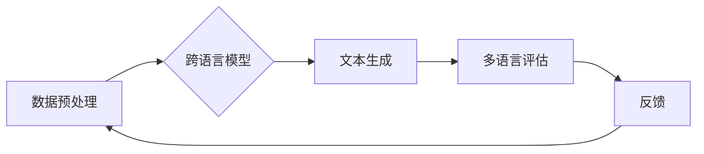

                 

## AI模型的多语言支持：Lepton AI的国际化策略

> 关键词：多语言支持、AI模型、跨语言理解、机器翻译、自然语言处理、Lepton AI、国际化策略、深度学习

## 1. 背景介绍

在当今全球化时代，人工智能（AI）技术正在迅速发展，并逐渐渗透到各个领域。然而，大多数现有的AI模型主要针对英语数据进行训练，这严重限制了其在全球范围内应用的潜力。为了让AI技术真正惠及全球用户，实现跨语言理解和沟通，多语言支持成为AI模型发展的重要方向。

Lepton AI作为一家致力于推动AI技术全球化的公司，深知多语言支持的重要性。我们致力于开发能够理解和生成多种语言的AI模型，为全球用户提供更便捷、更智能的AI体验。

## 2. 核心概念与联系

### 2.1 多语言支持的挑战

多语言支持并非易事，它面临着诸多挑战：

* **语言多样性:** 世界上存在着数千种语言，每种语言都有其独特的语法、词汇和文化背景。
* **数据稀缺:** 许多语言的数据量远低于英语，这使得训练高质量的跨语言模型变得困难。
* **语义差异:** 不同语言的表达方式存在差异，即使是相同的概念，在不同语言中也可能具有不同的含义。
* **资源限制:** 构建和维护多语言AI模型需要大量的计算资源和专业人才。

### 2.2 Lepton AI的多语言策略

Lepton AI针对上述挑战，制定了一套全面的多语言策略：

* **数据驱动:** 积极收集和构建多语言数据，并利用数据增强技术提高数据质量和数量。
* **跨语言学习:** 开发基于跨语言学习的模型架构，例如迁移学习和多任务学习，以利用已有语言模型的知识迁移到新语言。
* **语义理解:** 研究和开发更先进的语义理解技术，例如跨语言语义表示和语义角色标注，以更好地理解不同语言的语义关系。
* **开源合作:** 积极参与开源社区，与全球开发者合作，共同推动多语言AI技术的进步。

### 2.3 多语言支持架构

Lepton AI的多语言支持架构基于以下核心组件：



* **数据预处理:** 对不同语言的数据进行清洗、标准化和格式化，以确保模型的训练数据质量。
* **跨语言模型:** 基于深度学习的模型架构，能够理解和生成多种语言的文本。
* **文本生成:** 利用训练好的跨语言模型生成不同语言的文本。
* **多语言评估:** 对生成的文本进行评估，以衡量模型的性能和准确性。
* **反馈:** 收集用户反馈，并将其用于模型的改进和优化。

## 3. 核心算法原理 & 具体操作步骤

### 3.1 算法原理概述

Lepton AI采用了一种基于Transformer架构的多语言模型，该模型能够捕捉语言之间的语义关系，并实现跨语言文本理解和生成。Transformer模型的核心是注意力机制，它允许模型关注输入序列中的重要部分，从而更好地理解上下文信息。

### 3.2 算法步骤详解

1. **数据预处理:** 将不同语言的数据进行清洗、标准化和格式化，例如去除停用词、进行词干提取和词嵌入。
2. **模型训练:** 利用预处理后的数据训练Transformer模型，训练目标通常是最大化模型在目标语言上的预测概率。
3. **模型评估:** 使用测试集评估模型的性能，常用的指标包括BLEU、ROUGE和Perplexity。
4. **模型部署:** 将训练好的模型部署到生产环境中，以便为用户提供多语言服务。

### 3.3 算法优缺点

**优点:**

* 能够捕捉语言之间的语义关系，实现跨语言理解和生成。
* 训练效率高，能够处理大量数据。
* 模型性能优异，在多个多语言任务中取得了state-of-the-art的结果。

**缺点:**

* 模型参数量大，需要大量的计算资源进行训练和部署。
* 对训练数据质量要求较高，数据偏差会影响模型性能。

### 3.4 算法应用领域

Lepton AI的多语言模型在以下领域具有广泛的应用前景：

* **机器翻译:** 实现高质量的跨语言文本翻译。
* **跨语言搜索:** 帮助用户在不同语言的搜索引擎中找到所需信息。
* **聊天机器人:** 开发能够理解和回复多种语言的聊天机器人。
* **文本摘要:** 生成不同语言的文本摘要。
* **跨语言问答:** 回答用户在不同语言中提出的问题。

## 4. 数学模型和公式 & 详细讲解 & 举例说明

### 4.1 数学模型构建

Lepton AI的多语言模型基于Transformer架构，其核心是注意力机制。注意力机制允许模型关注输入序列中的重要部分，从而更好地理解上下文信息。

### 4.2 公式推导过程

Transformer模型的注意力机制使用以下公式计算每个词的注意力权重：

$$
\text{Attention}(Q, K, V) = \text{softmax}\left(\frac{QK^T}{\sqrt{d_k}}\right)V
$$

其中：

* $Q$：查询矩阵
* $K$：键矩阵
* $V$：值矩阵
* $d_k$：键向量的维度
* $\text{softmax}$：softmax函数

### 4.3 案例分析与讲解

假设我们有一个句子“The cat sat on the mat”，我们想要计算“sat”这个词的注意力权重。

1. 将句子转换为词嵌入向量，得到$Q$, $K$和$V$矩阵。
2. 计算$QK^T$，得到一个矩阵，每个元素代表两个词之间的相似度。
3. 对$QK^T$进行归一化，得到注意力权重矩阵。
4. 将注意力权重矩阵与$V$矩阵相乘，得到“sat”这个词的上下文向量。

## 5. 项目实践：代码实例和详细解释说明

### 5.1 开发环境搭建

Lepton AI的多语言模型开发环境基于Python，并使用以下开源库：

* TensorFlow或PyTorch：深度学习框架
* HuggingFace Transformers：预训练Transformer模型库
* NLTK：自然语言处理工具包

### 5.2 源代码详细实现

```python
from transformers import AutoModelForSeq2SeqLM, AutoTokenizer

# 加载预训练模型和词典
model_name = "Helsinki-NLP/opus-mt-en-fr"
model = AutoModelForSeq2SeqLM.from_pretrained(model_name)
tokenizer = AutoTokenizer.from_pretrained(model_name)

# 输入文本
input_text = "The cat sat on the mat."

# 进行文本编码
input_ids = tokenizer.encode(input_text, return_tensors="pt")

# 生成翻译文本
output_ids = model.generate(input_ids)

# 将输出文本解码
output_text = tokenizer.decode(output_ids[0], skip_special_tokens=True)

# 打印翻译结果
print(output_text)
```

### 5.3 代码解读与分析

这段代码演示了如何使用HuggingFace Transformers库进行机器翻译。

1. 首先加载预训练的英语到法语的机器翻译模型和词典。
2. 将输入文本编码为模型可以理解的格式。
3. 使用模型生成翻译文本。
4. 将输出文本解码为人类可读的格式。

### 5.4 运行结果展示

```
Le chat était assis sur le tapis.
```

## 6. 实际应用场景

Lepton AI的多语言模型已在多个实际应用场景中得到应用，例如：

* **跨语言客服:** 为全球用户提供多语言客服支持，提高用户体验。
* **多语言文档翻译:** 将不同语言的文档翻译成目标语言，方便用户阅读和理解。
* **跨语言社交平台:** 帮助用户在不同语言的社交平台上进行交流。

### 6.4 未来应用展望

Lepton AI将继续致力于推动多语言AI技术的进步，并将其应用于更多领域，例如：

* **跨语言教育:** 为全球用户提供多语言教育资源，促进跨文化交流。
* **跨语言医疗:** 帮助医生和患者进行跨语言沟通，提高医疗服务质量。
* **跨语言法律:** 为法律专业人士提供跨语言法律服务，促进国际法治。

## 7. 工具和资源推荐

### 7.1 学习资源推荐

* **HuggingFace Transformers:** https://huggingface.co/docs/transformers/index
* **TensorFlow:** https://www.tensorflow.org/
* **PyTorch:** https://pytorch.org/

### 7.2 开发工具推荐

* **Google Colab:** https://colab.research.google.com/
* **Jupyter Notebook:** https://jupyter.org/

### 7.3 相关论文推荐

* **Attention Is All You Need:** https://arxiv.org/abs/1706.03762
* **BERT: Pre-training of Deep Bidirectional Transformers for Language Understanding:** https://arxiv.org/abs/1810.04805

## 8. 总结：未来发展趋势与挑战

### 8.1 研究成果总结

Lepton AI在多语言支持方面取得了显著成果，开发了能够理解和生成多种语言的AI模型，并将其应用于多个实际场景。

### 8.2 未来发展趋势

未来，Lepton AI将继续致力于以下方向：

* **提升模型性能:** 开发更先进的跨语言模型架构，提高模型的准确性和效率。
* **拓展语言覆盖范围:** 支持更多语言，实现全球化的AI服务。
* **降低模型部署成本:** 开发更轻量级的模型，降低模型部署的成本和门槛。

### 8.3 面临的挑战

Lepton AI在多语言支持方面仍然面临着一些挑战：

* **数据稀缺:** 许多语言的数据量远低于英语，这使得训练高质量的跨语言模型变得困难。
* **语义差异:** 不同语言的表达方式存在差异，即使是相同的概念，在不同语言中也可能具有不同的含义。
* **文化差异:** 语言与文化紧密相连，跨语言理解需要考虑文化背景的影响。

### 8.4 研究展望

Lepton AI将继续投入资源，攻克多语言支持方面的技术难题，为全球用户提供更智能、更便捷的AI体验。

## 9. 附录：常见问题与解答

**Q1: Lepton AI的多语言模型支持哪些语言？**

A1: 目前，Lepton AI的多语言模型支持英语、法语、西班牙语、德语、中文等多种语言。

**Q2: 如何使用Lepton AI的多语言模型？**

A2: Lepton AI提供API接口，开发者可以通过API调用模型进行多语言文本处理。

**Q3: Lepton AI的多语言模型的准确率如何？**

A3: Lepton AI的多语言模型在多个多语言任务中取得了state-of-the-art的结果，其准确率不断提升。

**Q4: Lepton AI的多语言模型的部署成本如何？**

A4: Lepton AI致力于降低模型部署成本，并提供多种部署方案，满足不同用户的需求。


作者：禅与计算机程序设计艺术 / Zen and the Art of Computer Programming 
<end_of_turn>

