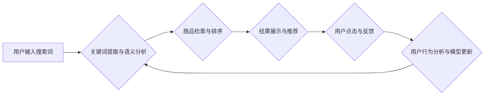

                 

# AI电商搜索平台的转化率提升

> 关键词：电商搜索、转化率、推荐系统、深度学习、自然语言处理、用户行为分析、A/B测试

## 1. 背景介绍

在当今数字经济时代，电商平台已成为人们购物的主要方式。搜索引擎作为电商平台的核心功能之一，直接影响着用户体验和平台的商业成功。然而，传统的基于关键词匹配的搜索算法难以满足用户日益复杂的搜索需求，导致搜索结果不精准，用户体验下降，转化率难以提升。

近年来，人工智能技术蓬勃发展，为电商搜索平台的优化提供了新的机遇。AI技术能够分析用户行为、理解用户意图，并提供更精准、更个性化的搜索结果，从而显著提升电商平台的转化率。

## 2. 核心概念与联系

### 2.1  电商搜索平台的转化率

转化率是指用户在搜索结果页面点击商品后，最终完成购买的比例。电商平台的转化率是衡量搜索引擎效果的重要指标，也是平台盈利能力的关键因素。

### 2.2  AI技术在电商搜索中的应用

AI技术在电商搜索平台的应用主要包括以下几个方面：

* **自然语言处理 (NLP)**：理解用户搜索的自然语言，提取关键词和语义信息，提高搜索结果的精准度。
* **深度学习 (DL)**：利用深度神经网络模型，学习用户行为模式和商品特征，进行商品推荐和个性化搜索。
* **用户行为分析 (UBA)**：分析用户搜索历史、浏览记录、购买行为等数据，构建用户画像，提供更精准的个性化推荐。

### 2.3  AI电商搜索平台架构



## 3. 核心算法原理 & 具体操作步骤

### 3.1  算法原理概述

本文将介绍基于深度学习的电商搜索平台转化率提升算法，该算法利用用户行为数据和商品特征数据，训练深度神经网络模型，实现商品推荐和个性化搜索。

### 3.2  算法步骤详解

1. **数据收集与预处理**: 收集用户搜索历史、浏览记录、购买行为等数据，以及商品信息、属性、价格等数据。对数据进行清洗、转换、编码等预处理操作，使其适合深度学习模型训练。

2. **特征工程**: 从原始数据中提取特征，例如用户性别、年龄、购买频率、商品类别、价格、评价等。特征工程可以利用机器学习算法和领域知识，提取更有效的特征，提升模型性能。

3. **模型构建**: 利用深度学习框架，例如TensorFlow或PyTorch，构建深度神经网络模型。模型结构可以根据具体需求进行设计，例如使用多层感知机 (MLP)、卷积神经网络 (CNN) 或循环神经网络 (RNN) 等。

4. **模型训练**: 使用训练数据训练深度神经网络模型，并使用验证数据评估模型性能。训练过程中，可以利用优化算法，例如梯度下降法，调整模型参数，使其能够准确预测用户点击和购买行为。

5. **模型部署**: 将训练好的模型部署到电商平台，并实时更新模型参数，以适应用户行为变化。

### 3.3  算法优缺点

**优点**:

* **精准度高**: 深度学习模型能够学习用户行为模式和商品特征，提供更精准的商品推荐和搜索结果。
* **个性化强**: 模型可以根据用户的历史行为和偏好，提供个性化的搜索和推荐服务。
* **可扩展性强**: 深度学习模型可以处理海量数据，并随着数据量的增加而提升性能。

**缺点**:

* **训练成本高**: 深度学习模型需要大量的训练数据和计算资源，训练成本较高。
* **解释性差**: 深度学习模型的决策过程较为复杂，难以解释模型的决策逻辑。
* **数据依赖性强**: 深度学习模型的性能依赖于训练数据的质量和数量。

### 3.4  算法应用领域

该算法可应用于各种电商平台，例如：

* **服装电商**: 根据用户的性别、年龄、购买历史等信息，推荐合适的服装商品。
* **电子产品电商**: 根据用户的兴趣爱好、使用场景等信息，推荐合适的电子产品。
* **食品电商**: 根据用户的饮食习惯、口味偏好等信息，推荐合适的食品商品。

## 4. 数学模型和公式 & 详细讲解 & 举例说明

### 4.1  数学模型构建

本文采用基于用户-商品交互矩阵的协同过滤模型，该模型利用用户对商品的评分或购买行为数据，预测用户对未交互商品的兴趣。

用户-商品交互矩阵 $R$ 是一个 $m \times n$ 的矩阵，其中 $m$ 表示用户数量，$n$ 表示商品数量。$R_{ij}$ 表示用户 $i$ 对商品 $j$ 的评分或购买行为，例如 1 表示购买，0 表示未购买。

### 4.2  公式推导过程

协同过滤模型的目标是预测用户 $i$ 对商品 $j$ 的评分或购买行为 $R_{ij}$。可以使用以下公式进行预测：

$$
R_{ij} = \hat{R}_{ij} = \mu + b_i + b_j + \sum_{k=1}^{K} w_{ik} \cdot v_{jk}
$$

其中：

* $\mu$ 是全局平均评分。
* $b_i$ 是用户 $i$ 的偏差。
* $b_j$ 是商品 $j$ 的偏差。
* $w_{ik}$ 是用户 $i$ 和商品 $k$ 之间的相似度。
* $v_{jk}$ 是商品 $j$ 和商品 $k$ 之间的特征向量。

### 4.3  案例分析与讲解

假设用户 $A$ 购买了商品 $1$ 和 $3$，用户 $B$ 购买了商品 $2$ 和 $3$。根据用户-商品交互矩阵，可以计算出用户 $A$ 和用户 $B$ 之间的相似度，并预测用户 $A$ 对商品 $2$ 的购买行为。

## 5. 项目实践：代码实例和详细解释说明

### 5.1  开发环境搭建

* Python 3.6+
* TensorFlow 2.0+
* PyTorch 1.0+
* Jupyter Notebook

### 5.2  源代码详细实现

```python
# 导入必要的库
import tensorflow as tf
from tensorflow.keras.models import Sequential
from tensorflow.keras.layers import Dense

# 定义模型结构
model = Sequential()
model.add(Dense(64, activation='relu', input_shape=(n_users,)))
model.add(Dense(32, activation='relu'))
model.add(Dense(n_items))

# 编译模型
model.compile(optimizer='adam', loss='mse')

# 训练模型
model.fit(X_train, y_train, epochs=10, batch_size=32)

# 预测用户对商品的评分
predictions = model.predict(X_test)
```

### 5.3  代码解读与分析

* 代码首先导入必要的库，包括 TensorFlow 和 PyTorch。
* 然后定义一个深度神经网络模型，该模型包含三层全连接层。
* 模型使用 Adam 优化器和均方误差损失函数进行训练。
* 训练完成后，可以使用模型预测用户对商品的评分。

### 5.4  运行结果展示

训练后的模型可以用于预测用户对商品的评分，并根据预测结果进行商品推荐。

## 6. 实际应用场景

### 6.1  个性化商品推荐

基于深度学习的电商搜索平台可以根据用户的历史行为和偏好，提供个性化的商品推荐，提升用户体验和转化率。

### 6.2  搜索结果排序

深度学习模型可以学习用户搜索意图和商品特征，对搜索结果进行排序，提供更精准的搜索结果。

### 6.3  智能客服

AI技术可以用于构建智能客服系统，帮助用户解决购物问题，提升用户满意度。

### 6.4  未来应用展望

未来，AI技术将在电商搜索平台的应用中发挥更重要的作用，例如：

* **多模态搜索**: 支持用户使用多种方式进行搜索，例如文本、图像、语音等。
* **实时个性化**: 根据用户的实时行为和上下文信息，提供更精准的个性化推荐。
* **场景化推荐**: 根据用户的购物场景，提供更合适的商品推荐。

## 7. 工具和资源推荐

### 7.1  学习资源推荐

* **深度学习入门**: 深度学习入门教程 (https://www.tensorflow.org/tutorials)
* **自然语言处理**: 自然语言处理入门 (https://www.nltk.org/)
* **电商搜索**: 电商搜索技术 (https://www.amazon.com/dp/B07V99792G)

### 7.2  开发工具推荐

* **TensorFlow**: 深度学习框架 (https://www.tensorflow.org/)
* **PyTorch**: 深度学习框架 (https://pytorch.org/)
* **Scikit-learn**: 机器学习库 (https://scikit-learn.org/)

### 7.3  相关论文推荐

* **Neural Collaborative Filtering**: https://arxiv.org/abs/1609.09807
* **Deep Learning for Recommender Systems**: https://arxiv.org/abs/1801.00019

## 8. 总结：未来发展趋势与挑战

### 8.1  研究成果总结

本文介绍了基于深度学习的电商搜索平台转化率提升算法，该算法能够利用用户行为数据和商品特征数据，实现商品推荐和个性化搜索，提升电商平台的转化率。

### 8.2  未来发展趋势

未来，AI技术将在电商搜索平台的应用中发挥更重要的作用，例如：

* **多模态搜索**: 支持用户使用多种方式进行搜索，例如文本、图像、语音等。
* **实时个性化**: 根据用户的实时行为和上下文信息，提供更精准的个性化推荐。
* **场景化推荐**: 根据用户的购物场景，提供更合适的商品推荐。

### 8.3  面临的挑战

* **数据质量**: 深度学习模型的性能依赖于训练数据的质量和数量。
* **模型解释性**: 深度学习模型的决策过程较为复杂，难以解释模型的决策逻辑。
* **计算资源**: 训练深度学习模型需要大量的计算资源。

### 8.4  研究展望

未来，需要进一步研究以下问题：

* 如何提高深度学习模型对用户行为数据的理解能力。
* 如何提高深度学习模型的解释性，使其决策过程更加透明。
* 如何降低深度学习模型的训练成本，使其能够应用于更广泛的场景。

## 9. 附录：常见问题与解答

**Q1: 深度学习模型的训练需要多少数据？**

A1: 深度学习模型的训练数据量取决于模型复杂度和任务难度。一般来说，需要至少几千条数据才能训练出一个基本的深度学习模型。

**Q2: 如何评估深度学习模型的性能？**

A2: 可以使用多种指标评估深度学习模型的性能，例如准确率、召回率、F1-score等。

**Q3: 如何部署深度学习模型？**

A3: 可以使用 TensorFlow Serving 或 PyTorch Serving 等工具部署深度学习模型。

作者：禅与计算机程序设计艺术 / Zen and the Art of Computer Programming 


<end_of_turn>

