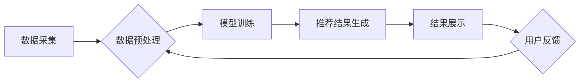

                 

## AI赋能的电商平台商品推荐链路优化

> 关键词：电商平台、商品推荐、推荐系统、深度学习、协同过滤、内容过滤、个性化推荐、链路优化

## 1. 背景介绍

在当今数字化时代，电商平台已成为人们购物的首选方式。然而，面对海量商品，用户在选择商品时常常感到困惑和迷茫。商品推荐系统作为电商平台的核心功能之一，旨在通过分析用户行为和商品特征，为用户提供个性化、精准的商品推荐，从而提升用户体验、促进商品销售。

传统的商品推荐系统主要依赖于基于内容的过滤和基于协同过滤的算法。基于内容的过滤算法根据商品的属性和描述信息，推荐与用户过去浏览或购买的商品相似的商品。而基于协同过滤算法则根据用户对商品的评分或购买行为，推荐与用户兴趣相似的其他用户的购买商品。

然而，传统的推荐算法存在一些局限性，例如数据稀疏性、冷启动问题和推荐结果单一性等。随着人工智能技术的快速发展，深度学习算法被广泛应用于推荐系统，为商品推荐带来了新的机遇。

## 2. 核心概念与联系

深度学习算法能够从海量数据中自动学习用户和商品的特征，并构建更复杂的推荐模型，从而提升推荐的准确性和个性化程度。

**2.1 推荐系统架构**

电商平台的商品推荐系统通常由以下几个模块组成：

* **数据采集模块:** 收集用户行为数据、商品信息数据等。
* **数据预处理模块:** 对收集到的数据进行清洗、转换、特征提取等处理。
* **推荐模型训练模块:** 利用深度学习算法训练推荐模型。
* **推荐结果展示模块:** 将推荐结果以用户友好的方式展示给用户。
* **反馈机制模块:** 收集用户对推荐结果的反馈，并将其用于模型优化。

**2.2  推荐系统流程图**



## 3. 核心算法原理 & 具体操作步骤

### 3.1  算法原理概述

深度学习算法在推荐系统中的应用主要包括以下几种：

* **协同过滤:** 利用用户的历史行为数据，预测用户对特定商品的兴趣。
* **内容过滤:** 根据商品的属性和描述信息，推荐与用户兴趣相似的商品。
* **深度神经网络:** 利用多层神经网络，学习用户和商品的复杂特征，并进行推荐。

### 3.2  算法步骤详解

**3.2.1 协同过滤算法步骤:**

1. **数据收集:** 收集用户对商品的评分或购买行为数据。
2. **数据预处理:** 对数据进行清洗、转换、特征提取等处理。
3. **相似度计算:** 计算用户之间的相似度或商品之间的相似度。
4. **推荐生成:** 根据用户与其他用户的相似度或用户与商品的相似度，生成推荐列表。

**3.2.2 内容过滤算法步骤:**

1. **商品特征提取:** 从商品的属性和描述信息中提取特征向量。
2. **用户兴趣建模:** 根据用户的历史行为数据，构建用户兴趣模型。
3. **相似度计算:** 计算商品特征向量与用户兴趣模型之间的相似度。
4. **推荐生成:** 根据商品与用户兴趣的相似度，生成推荐列表。

**3.2.3 深度神经网络算法步骤:**

1. **数据预处理:** 对数据进行清洗、转换、特征提取等处理。
2. **模型构建:** 设计深度神经网络模型，包括输入层、隐藏层和输出层。
3. **模型训练:** 利用训练数据训练深度神经网络模型。
4. **模型评估:** 利用测试数据评估模型的性能。
5. **推荐生成:** 将用户特征作为输入，通过训练好的深度神经网络模型，预测用户对商品的兴趣，并生成推荐列表。

### 3.3  算法优缺点

| 算法类型 | 优点 | 缺点 |
|---|---|---|
| 协同过滤 | 能够发现隐含的用户兴趣 | 数据稀疏性问题、冷启动问题 |
| 内容过滤 | 能够利用商品信息进行推荐 | 难以捕捉用户隐性需求 |
| 深度神经网络 | 能够学习复杂的用户和商品特征 | 需要大量数据训练、模型复杂度高 |

### 3.4  算法应用领域

* **电商平台商品推荐:** 为用户推荐个性化的商品。
* **音乐平台歌曲推荐:** 为用户推荐喜欢的歌曲。
* **视频平台视频推荐:** 为用户推荐感兴趣的视频。
* **新闻平台新闻推荐:** 为用户推荐相关的新闻。

## 4. 数学模型和公式 & 详细讲解 & 举例说明

### 4.1  数学模型构建

协同过滤算法的核心是计算用户之间的相似度或商品之间的相似度。常用的相似度度量方法包括余弦相似度、皮尔逊相关系数和马氏距离等。

**4.1.1 余弦相似度**

余弦相似度用于度量两个向量的夹角大小，其值范围在-1到1之间，其中1表示两个向量完全相同，-1表示两个向量完全相反，0表示两个向量正交。

$$
\text{余弦相似度}(u,v) = \frac{u \cdot v}{||u|| ||v||}
$$

其中：

* $u$ 和 $v$ 是两个向量。
* $u \cdot v$ 是 $u$ 和 $v$ 的点积。
* $||u||$ 和 $||v||$ 是 $u$ 和 $v$ 的模长。

**4.1.2 皮尔逊相关系数**

皮尔逊相关系数用于度量两个变量之间的线性相关性，其值范围在-1到1之间，其中1表示两个变量完全正相关，-1表示两个变量完全负相关，0表示两个变量不相关。

$$
\text{皮尔逊相关系数}(u,v) = \frac{\sum_{i=1}^{n}(u_i - \bar{u})(v_i - \bar{v})}{\sqrt{\sum_{i=1}^{n}(u_i - \bar{u})^2} \sqrt{\sum_{i=1}^{n}(v_i - \bar{v})^2}}
$$

其中：

* $u$ 和 $v$ 是两个变量。
* $u_i$ 和 $v_i$ 是 $u$ 和 $v$ 的第 $i$ 个观测值。
* $\bar{u}$ 和 $\bar{v}$ 是 $u$ 和 $v$ 的平均值。

### 4.2  公式推导过程

**4.2.1 余弦相似度推导**

余弦相似度的公式推导过程如下：

1. 两个向量 $u$ 和 $v$ 的点积表示为 $u \cdot v = ||u|| ||v|| \cos \theta$，其中 $\theta$ 是 $u$ 和 $v$ 之间的夹角。
2. 将点积公式代入余弦相似度的公式，得到：

$$
\text{余弦相似度}(u,v) = \frac{u \cdot v}{||u|| ||v||} = \cos \theta
$$

### 4.3  案例分析与讲解

**4.3.1 余弦相似度案例分析**

假设有两个用户 $u$ 和 $v$，他们的评分向量分别为：

* $u = [1, 2, 3, 4, 5]$
* $v = [2, 3, 4, 5, 1]$

计算 $u$ 和 $v$ 的余弦相似度：

1. 计算 $u \cdot v = 1 \cdot 2 + 2 \cdot 3 + 3 \cdot 4 + 4 \cdot 5 + 5 \cdot 1 = 40$
2. 计算 $||u|| = \sqrt{1^2 + 2^2 + 3^2 + 4^2 + 5^2} = \sqrt{55}$
3. 计算 $||v|| = \sqrt{2^2 + 3^2 + 4^2 + 5^2 + 1^2} = \sqrt{55}$
4. 计算余弦相似度：

$$
\text{余弦相似度}(u,v) = \frac{40}{\sqrt{55} \cdot \sqrt{55}} = \frac{40}{55} \approx 0.73
$$

结果表明，用户 $u$ 和 $v$ 之间存在一定的相似性。

## 5. 项目实践：代码实例和详细解释说明

### 5.1  开发环境搭建

* **操作系统:** Ubuntu 18.04
* **编程语言:** Python 3.6
* **深度学习框架:** TensorFlow 2.0
* **数据存储:** MySQL

### 5.2  源代码详细实现

```python
import tensorflow as tf

# 定义模型
model = tf.keras.Sequential([
    tf.keras.layers.Embedding(input_dim=10000, output_dim=64),
    tf.keras.layers.Flatten(),
    tf.keras.layers.Dense(units=32, activation='relu'),
    tf.keras.layers.Dense(units=1, activation='sigmoid')
])

# 编译模型
model.compile(optimizer='adam', loss='binary_crossentropy', metrics=['accuracy'])

# 训练模型
model.fit(x_train, y_train, epochs=10)

# 预测结果
predictions = model.predict(x_test)
```

### 5.3  代码解读与分析

* **Embedding层:** 将用户和商品的ID转换为稠密的向量表示。
* **Flatten层:** 将多维向量转换为一维向量。
* **Dense层:** 全连接层，用于学习用户和商品之间的复杂关系。
* **Sigmoid激活函数:** 将输出值映射到0到1之间，用于二分类任务。

### 5.4  运行结果展示

训练完成后，可以利用测试数据评估模型的性能，并根据预测结果生成推荐列表。

## 6. 实际应用场景

### 6.1  电商平台商品推荐

AI赋能的商品推荐系统可以为用户提供更精准、个性化的商品推荐，提升用户体验和转化率。

### 6.2  内容推荐

AI可以分析用户阅读、观看和点赞的习惯，推荐与用户兴趣相符的内容，例如新闻、视频、文章等。

### 6.3  广告推荐

AI可以根据用户的兴趣和行为特征，推荐与用户相关的广告，提高广告精准度和点击率。

### 6.4  未来应用展望

随着人工智能技术的不断发展，AI赋能的推荐系统将应用于更多领域，例如医疗、教育、金融等，为用户提供更智能、更便捷的服务。

## 7. 工具和资源推荐

### 7.1  学习资源推荐

* **书籍:**
    * 《深度学习》
    * 《推荐系统实践》
* **在线课程:**
    * Coursera: 深度学习
    * Udacity: 机器学习工程师
* **博客:**
    * TensorFlow博客
    * PyTorch博客

### 7.2  开发工具推荐

* **深度学习框架:** TensorFlow, PyTorch
* **数据处理工具:** Pandas, NumPy
* **机器学习库:** scikit-learn

### 7.3  相关论文推荐

* **协同过滤:**
    * "Collaborative Filtering: A User-Based Approach"
    * "Matrix Factorization Techniques for Recommender Systems"
* **内容过滤:**
    * "Content-Based Recommendation Systems"
    * "A Survey of Content-Based Recommendation Systems"
* **深度学习推荐:**
    * "Deep Learning for Recommender Systems"
    * "Neural Collaborative Filtering"

## 8. 总结：未来发展趋势与挑战

### 8.1  研究成果总结

AI赋能的推荐系统取得了显著的成果，能够为用户提供更精准、个性化的推荐，提升用户体验和商业价值。

### 8.2  未来发展趋势

* **多模态推荐:** 将文本、图像、视频等多种数据类型融合，构建更全面的用户和商品特征。
* **个性化推荐:** 利用用户行为、偏好、上下文等信息，为每个用户提供个性化的推荐。
* **解释性推荐:** 解释推荐结果背后的逻辑，提升用户信任度。
* **联邦学习:** 保护用户隐私，在不共享用户数据的情况下进行模型训练。

### 8.3  面临的挑战

* **数据稀疏性:** 许多推荐场景存在数据稀疏性问题，难以训练有效的推荐模型。
* **冷启动问题:** 新用户和新商品难以获得推荐，需要开发新的算法和策略解决。
* **模型解释性:** 深度学习模型的决策过程难以解释，需要开发新的方法提高模型的透明度。
* **公平性与偏见:** 推荐系统可能存在公平性问题，需要开发新的方法确保推荐结果公平公正。

### 8.4  研究展望

未来，AI赋能的推荐系统将继续朝着更智能、更个性化、更公平的方向发展，为用户提供更优质的服务。


## 9. 附录：常见问题与解答

**9.1  什么是协同过滤？**

协同过滤是一种推荐算法，它根据用户的历史行为数据，预测用户对特定商品的兴趣。

**9.2  什么是内容过滤？**

内容过滤是一种推荐算法，它根据商品的属性和描述信息，推荐与用户兴趣相似的商品。

**9.3  什么是深度学习？**

深度学习是一种机器学习方法，它利用多层神经网络学习用户和商品的复杂特征。

**9.4  如何评估推荐系统的性能？**

常用的评估指标包括准确率、召回率、F1-score等。

**9.5  如何解决数据稀疏性问题？**

可以使用矩阵分解、协同过滤等方法解决数据稀疏性问题。


作者：禅与计算机程序设计艺术 / Zen and the Art of Computer Programming 
<end_of_turn>

