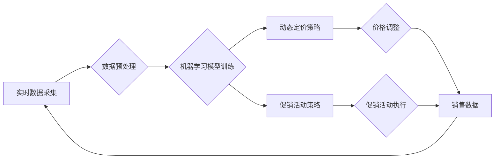

                 

## AI零售：动态定价和促销活动策略

> 关键词：人工智能、零售、动态定价、促销活动、机器学习、预测分析、优化算法

## 1. 背景介绍

零售业是全球经济的重要组成部分，近年来，随着人工智能（AI）技术的快速发展，零售业也迎来了数字化转型的新机遇。AI技术在零售领域应用广泛，从个性化推荐、库存管理到客户服务，都取得了显著的成果。其中，动态定价和促销活动策略是AI在零售领域应用的两个重要方向。

传统的定价策略往往是基于成本加成或市场调研等静态数据，缺乏灵活性，难以适应市场变化。而AI驱动的动态定价则可以根据实时数据，如库存水平、市场需求、竞争对手价格等，动态调整商品价格，从而最大化利润。

促销活动也是零售业的重要营销手段，但传统的促销活动往往缺乏针对性，难以精准触达目标客户。AI技术可以帮助零售商分析客户行为数据，预测客户需求，制定个性化的促销活动，提高活动效果。

## 2. 核心概念与联系

**2.1 核心概念**

* **动态定价:** 根据实时数据动态调整商品价格，以实现利润最大化。
* **促销活动策略:** 通过各种营销手段，如折扣、赠品、满减等，刺激客户购买行为。
* **机器学习:** 利用算法从数据中学习，提高预测和决策能力。
* **预测分析:** 利用历史数据和统计模型预测未来趋势，为决策提供依据。
* **优化算法:** 寻找最优解的算法，用于优化定价策略和促销活动策略。

**2.2 架构图**



**2.3 联系**

AI零售的核心是利用机器学习和预测分析技术，从海量数据中挖掘价值，为动态定价和促销活动策略提供决策支持。实时数据采集是整个系统的基础，数据预处理确保数据质量，机器学习模型训练是关键环节，动态定价策略和促销活动策略是应用场景，最终通过价格调整和促销活动执行，实现销售目标。

## 3. 核心算法原理 & 具体操作步骤

**3.1 算法原理概述**

动态定价和促销活动策略的算法原理主要基于以下几个方面：

* **需求预测:** 利用历史销售数据、市场趋势、季节性因素等，预测未来商品需求。
* **成本分析:** 分析商品的生产成本、物流成本、营销成本等，确定商品的最低可接受价格。
* **竞争对手分析:** 分析竞争对手的价格策略、产品定位等，制定差异化定价策略。
* **客户画像:** 分析客户的购买行为、偏好、价格敏感度等，制定个性化的促销活动策略。

**3.2 算法步骤详解**

**3.2.1 动态定价算法步骤**

1. 收集实时数据：包括商品库存、市场需求、竞争对手价格、客户行为数据等。
2. 数据预处理：清洗、转换、标准化数据，确保数据质量。
3. 构建需求预测模型：利用机器学习算法，如ARIMA、Prophet等，预测未来商品需求。
4. 计算成本和利润：根据商品成本和预测需求，计算商品的最低可接受价格和利润目标。
5. 分析竞争对手价格：收集竞争对手的价格信息，分析其定价策略。
6. 动态调整价格：根据需求预测、成本分析、竞争对手分析等因素，动态调整商品价格。

**3.2.2 促销活动策略算法步骤**

1. 收集客户行为数据：包括购买记录、浏览历史、评价反馈等。
2. 建立客户画像：利用聚类算法、关联规则挖掘等，将客户分为不同的群体，并分析其特征。
3. 预测客户需求：根据客户画像和历史购买数据，预测客户对不同商品的购买意愿。
4. 设计促销活动：根据客户需求和促销目标，设计不同的促销活动，如折扣、赠品、满减等。
5. 选择合适的促销渠道：根据客户画像和活动目标，选择合适的促销渠道，如邮件营销、社交媒体广告等。
6. 评估活动效果：收集活动数据，分析活动效果，并进行优化调整。

**3.3 算法优缺点**

**3.3.1 动态定价算法**

* **优点:** 能够根据实时数据动态调整价格，提高利润率；能够更好地应对市场变化，提高竞争力。
* **缺点:** 需要收集和处理大量实时数据，数据质量要求高；算法模型需要不断优化，才能保证准确性；可能会导致客户不满，影响品牌形象。

**3.3.2 促销活动策略算法**

* **优点:** 能够精准触达目标客户，提高活动效果；能够个性化定制促销活动，提升客户体验。
* **缺点:** 需要收集和分析大量客户行为数据，数据隐私问题需要得到重视；算法模型需要不断更新，才能适应客户需求的变化。

**3.4 算法应用领域**

* **电商平台:** 动态调整商品价格，优化库存管理，提高销售转化率。
* **线下零售:** 根据客流量、商品热度等实时数据，制定促销活动策略，吸引顾客消费。
* **旅游业:** 根据航班价格、酒店预订情况等数据，制定个性化旅游套餐，提高销售额。
* **金融服务:** 根据客户风险偏好、投资目标等数据，提供个性化的理财建议。

## 4. 数学模型和公式 & 详细讲解 & 举例说明

**4.1 数学模型构建**

动态定价和促销活动策略的数学模型通常基于以下几个方面：

* **需求函数:** 描述商品需求与价格之间的关系。
* **成本函数:** 描述商品生产、物流、营销等成本与产量之间的关系。
* **利润函数:** 描述商品销售利润与价格、产量之间的关系。

**4.2 公式推导过程**

**4.2.1 需求函数**

假设商品的需求函数为线性函数，则可以表示为：

$$Q = a - bP$$

其中：

* $Q$ 为商品需求量
* $P$ 为商品价格
* $a$ 为需求量在价格为0时的水平
* $b$ 为价格对需求量的弹性系数

**4.2.2 利润函数**

假设商品的生产成本为 $C$，则商品的利润函数可以表示为：

$$Profit = (P - C)Q$$

**4.3 案例分析与讲解**

假设一家电商平台销售一款商品，其需求函数为 $Q = 1000 - 2P$，生产成本为 $C = 50$。

* **最大利润定价:**

为了最大化利润，需要找到使利润函数达到最大值的 $P$ 值。

首先，将需求函数代入利润函数：

$$Profit = (P - 50)(1000 - 2P)$$

然后，对利润函数求导，并令其等于0，解得 $P$ 值：

$$\frac{dProfit}{dP} = 1000 - 4P - 50 = 0$$

$$P = 175$$

因此，最大利润定价为 $175$。

* **促销活动策略:**

为了吸引更多顾客购买，电商平台可以制定促销活动，例如：

* **折扣促销:** 将商品价格降低到 $150$，吸引价格敏感的顾客。
* **满减促销:** 当顾客购买 $2$ 件商品时，可以享受 $10$ 元的减免，鼓励顾客购买更多商品。

## 5. 项目实践：代码实例和详细解释说明

**5.1 开发环境搭建**

* 操作系统：Windows/macOS/Linux
* Python 版本：3.6+
* 必要的库：pandas、numpy、scikit-learn、matplotlib

**5.2 源代码详细实现**

```python
import pandas as pd
from sklearn.linear_model import LinearRegression

# 1. 数据加载
data = pd.read_csv('sales_data.csv')

# 2. 数据预处理
# ...

# 3. 构建需求预测模型
model = LinearRegression()
model.fit(data[['price']], data['quantity'])

# 4. 预测未来需求
future_price = [150, 175, 200]
predicted_quantity = model.predict(pd.DataFrame({'price': future_price}))

# 5. 动态调整价格
# ...

# 6. 设计促销活动策略
# ...
```

**5.3 代码解读与分析**

* 代码首先加载销售数据，并进行预处理，例如删除缺失值、转换数据类型等。
* 然后，使用线性回归模型训练一个需求预测模型，将商品价格作为输入，商品需求量作为输出。
* 预测未来需求时，将未来价格作为输入，模型会输出相应的预测需求量。
* 动态调整价格时，可以根据预测需求量、成本分析、竞争对手分析等因素，制定相应的定价策略。
* 设计促销活动策略时，可以根据客户画像、购买行为数据等，制定个性化的促销活动，例如折扣、赠品、满减等。

**5.4 运行结果展示**

运行代码后，可以得到以下结果：

* 预测未来需求量
* 动态调整后的商品价格
* 促销活动策略建议

## 6. 实际应用场景

**6.1 电商平台**

* **动态定价:** 根据实时数据，动态调整商品价格，提高利润率。
* **个性化推荐:** 根据客户购买历史和偏好，推荐个性化的商品，提高转化率。
* **促销活动优化:** 分析客户行为数据，优化促销活动策略，提高活动效果。

**6.2 线下零售**

* **库存管理:** 利用预测分析技术，预测商品需求，优化库存水平，降低库存成本。
* **促销活动策划:** 根据客流量、商品热度等实时数据，制定精准的促销活动，吸引顾客消费。
* **会员营销:** 利用客户画像，制定个性化的会员营销策略，提高客户忠诚度。

**6.3 旅游业**

* **个性化旅游套餐:** 根据客户需求和旅行偏好，定制个性化的旅游套餐，提高销售额。
* **动态定价:** 根据航班价格、酒店预订情况等数据，动态调整旅游套餐价格，提高利润率。
* **旅游推荐:** 利用机器学习算法，推荐符合客户需求的旅游目的地和景点。

**6.4 未来应用展望**

随着人工智能技术的不断发展，AI零售将迎来更广泛的应用场景，例如：

* **智能客服:** 利用自然语言处理技术，提供智能化的客户服务，提高客户满意度。
* **虚拟试衣间:** 利用计算机视觉技术，实现虚拟试衣间，提升购物体验。
* **个性化商品设计:** 利用机器学习算法，根据客户需求，设计个性化的商品，满足个性化需求。

## 7. 工具和资源推荐

**7.1 学习资源推荐**

* **书籍:**
    * 《深度学习》
    * 《机器学习实战》
    * 《Python机器学习》
* **在线课程:**
    * Coursera
    * edX
    * Udacity

**7.2 开发工具推荐**

* **Python:** 
    * pandas
    * numpy
    * scikit-learn
    * matplotlib
* **云平台:**
    * AWS
    * Azure
    * Google Cloud

**7.3 相关论文推荐**

* **Dynamic Pricing in E-Commerce:** A Survey
* **Personalized Recommendation Systems: A Survey**
* **Deep Learning for Retail Analytics**

## 8. 总结：未来发展趋势与挑战

**8.1 研究成果总结**

AI零售已经取得了显著的成果，例如动态定价、促销活动策略、个性化推荐等，为零售业带来了新的机遇。

**8.2 未来发展趋势**

* **更精准的预测:** 利用更先进的机器学习算法，提高预测精度，为决策提供更可靠的依据。
* **更个性化的服务:** 利用大数据分析和人工智能技术，提供更个性化的商品推荐、促销活动和客户服务。
* **更智能的运营:** 利用人工智能技术，自动完成库存管理、物流配送、客户服务等运营任务，提高运营效率。

**8.3 面临的挑战**

* **数据隐私保护:** AI零售需要收集和分析大量客户数据，如何保护客户隐私是一个重要的挑战。
* **算法可解释性:** 许多AI算法是黑箱模型，难以解释其决策过程，这可能会导致客户信任问题。
* **技术人才短缺:** AI零售需要大量具备相关技术能力的人才，而目前技术人才短缺是一个普遍问题。

**8.4 研究展望**

未来，AI零售的研究将更加注重以下几个方面：

* **发展更安全、更可靠的AI算法:** 提高算法的透明度和可解释性，增强客户信任。
* **探索新的AI应用场景:** 将AI技术应用到更多零售领域的细分领域，例如服装、食品、家居等。
* **推动AI零售的产业化发展:** 加快AI零售技术的推广应用，促进零售业的数字化转型。

## 9. 附录：常见问题与解答

**9.1 如何保证AI零售的公平性？**

AI零售算法需要避免歧视和偏见，确保公平公正地对待所有客户。可以通过以下方式保证AI零售的公平性：

* 使用多元化的训练数据，避免算法偏向特定群体。
* 定期评估算法的公平性，及时发现和解决问题。
* 建立透明的算法解释机制，让客户了解算法的决策过程。

**9.2 AI零售会取代人类工作吗？**

AI零售可以自动化一些重复性工作，但不会完全取代人类工作。AI技术可以帮助人类提高工作效率，解放人力，专注于更具创造性和战略性的工作。

**9.3 AI零售对消费者有什么影响？**

AI零售可以为消费者带来以下好处：

* 更个性化的商品推荐和服务。
* 更优惠的价格和促销活动。
* 更便捷的购物体验。

但是，消费者也需要关注AI零售带来的潜在风险，例如数据隐私泄露和算法操控。


作者：禅与计算机程序设计艺术 / Zen and the Art of Computer Programming 
<end_of_turn>

