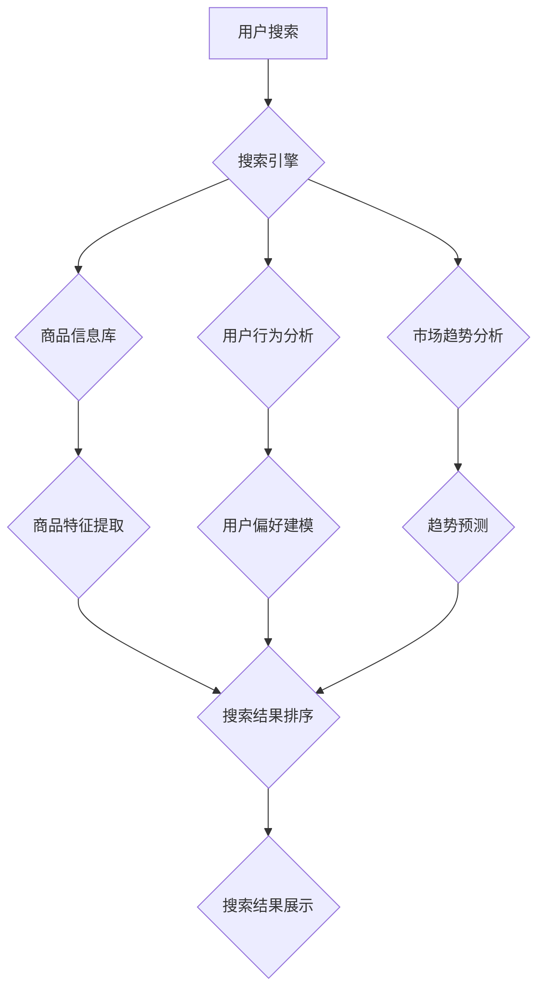

                 

## AI驱动的电商搜索结果实时更新机制

> 关键词：电商搜索、实时更新、人工智能、机器学习、推荐系统、自然语言处理、用户行为分析

## 1. 背景介绍

在当今数字经济时代，电商平台已成为人们获取商品和服务的首选方式。搜索引擎作为电商平台的核心功能之一，直接影响着用户体验和商业转化率。传统的电商搜索引擎通常依赖于关键词匹配和商品属性检索，难以满足用户日益复杂的搜索需求。随着人工智能技术的快速发展，AI驱动的电商搜索引擎应运而生，能够通过深度学习、自然语言处理等技术，更精准地理解用户意图，提供更个性化、更相关的搜索结果。

然而，传统的电商搜索引擎更新机制通常是定时更新，无法及时反映商品信息、用户偏好和市场趋势的变化。这会导致搜索结果过时，用户体验下降，甚至影响平台的商业利益。因此，开发一种高效、实时更新的电商搜索结果机制至关重要。

## 2. 核心概念与联系

### 2.1  核心概念

* **AI驱动的搜索引擎:**  利用人工智能技术，如深度学习、自然语言处理等，对用户搜索请求进行理解和分析，并根据用户历史行为、商品信息、市场趋势等多方面因素，提供更精准、更相关的搜索结果。
* **实时更新机制:**  能够实时监控商品信息、用户行为和市场趋势的变化，并及时更新搜索结果，确保搜索结果的时效性和准确性。

### 2.2  架构



**架构说明:**

1. 用户输入搜索关键词。
2. 搜索引擎接收用户搜索请求，并从商品信息库、用户行为分析系统和市场趋势分析系统获取相关数据。
3. 商品信息库提供商品的基本信息和特征。
4. 用户行为分析系统分析用户的搜索历史、浏览记录、购买行为等，构建用户偏好模型。
5. 市场趋势分析系统分析市场上商品的热度、销量、评价等，预测未来商品趋势。
6. 商品特征提取模块提取商品的关键词、属性、描述等特征。
7. 搜索结果排序模块根据用户偏好、商品特征、市场趋势等因素，对搜索结果进行排序。
8. 搜索结果展示模块将排序后的搜索结果展示给用户。

## 3. 核心算法原理 & 具体操作步骤

### 3.1  算法原理概述

AI驱动的电商搜索结果实时更新机制的核心算法是基于机器学习的推荐算法，结合自然语言处理技术，能够实时分析用户搜索行为、商品信息和市场趋势，并根据这些信息动态调整搜索结果的排序和展示。

### 3.2  算法步骤详解

1. **数据采集:**  从商品信息库、用户行为分析系统和市场趋势分析系统收集相关数据，包括商品信息、用户搜索历史、浏览记录、购买行为、商品评价等。
2. **数据预处理:** 对收集到的数据进行清洗、转换和特征提取，例如将商品描述转换为关键词向量、将用户行为转换为用户兴趣标签等。
3. **模型训练:**  利用机器学习算法，例如深度神经网络、协同过滤算法等，对预处理后的数据进行训练，构建用户偏好模型、商品特征模型和市场趋势预测模型。
4. **实时更新:**  实时监控商品信息、用户行为和市场趋势的变化，并根据这些变化更新模型参数，确保模型的准确性和时效性。
5. **搜索结果排序:**  当用户输入搜索关键词时，根据用户的搜索历史、浏览记录、购买行为等信息，预测用户的搜索意图，并结合商品特征、市场趋势等因素，对搜索结果进行排序。
6. **搜索结果展示:**  将排序后的搜索结果展示给用户，并根据用户的反馈信息，进一步优化模型参数和搜索结果排序策略。

### 3.3  算法优缺点

**优点:**

* **精准度高:**  基于机器学习的推荐算法能够更精准地理解用户的搜索意图，提供更相关的搜索结果。
* **个性化强:**  根据用户的历史行为和偏好，提供个性化的搜索结果，提升用户体验。
* **实时更新:**  能够实时监控数据变化，确保搜索结果的时效性和准确性。

**缺点:**

* **数据依赖:**  算法的性能依赖于数据的质量和数量，需要大量的用户行为数据和商品信息数据进行训练。
* **模型复杂:**  机器学习模型的训练和维护需要一定的技术难度和资源投入。
* **解释性差:**  机器学习模型的决策过程往往是黑箱，难以解释模型的决策逻辑。

### 3.4  算法应用领域

* **电商搜索:**  提供更精准、更相关的商品搜索结果。
* **内容推荐:**  根据用户的兴趣爱好，推荐相关的文章、视频、音乐等内容。
* **个性化营销:**  根据用户的行为特征，推送个性化的广告和促销信息。
* **用户画像:**  构建用户的兴趣爱好、消费习惯等画像，为精准营销提供数据支持。

## 4. 数学模型和公式 & 详细讲解 & 举例说明

### 4.1  数学模型构建

**用户偏好模型:**  可以使用协同过滤算法构建用户偏好模型，例如基于用户的协同过滤算法和基于物品的协同过滤算法。

* **基于用户的协同过滤算法:**  根据用户的历史行为数据，计算用户之间的相似度，并推荐与相似用户喜欢的商品。
* **基于物品的协同过滤算法:**  根据商品之间的关联性，推荐与用户之前喜欢的商品相似的商品。

**商品特征模型:**  可以使用词嵌入技术构建商品特征模型，例如Word2Vec、GloVe等。

* **词嵌入技术:**  将商品的关键词转换为向量表示，使得具有语义相似性的关键词拥有相似的向量表示。

**市场趋势预测模型:**  可以使用时间序列分析模型预测市场趋势，例如ARIMA模型、LSTM模型等。

* **时间序列分析模型:**  分析商品的销量、评价等数据的时间序列变化趋势，预测未来商品的销量和评价。

### 4.2  公式推导过程

**协同过滤算法的相似度计算公式:**

$$
Sim(u_i, u_j) = \frac{\sum_{k=1}^{n} r_{i,k} * r_{j,k}}{\sqrt{\sum_{k=1}^{n} r_{i,k}^2} * \sqrt{\sum_{k=1}^{n} r_{j,k}^2}}
$$

其中:

* $Sim(u_i, u_j)$ 表示用户 $u_i$ 和用户 $u_j$ 的相似度。
* $r_{i,k}$ 表示用户 $u_i$ 对商品 $k$ 的评分。
* $n$ 表示商品总数。

**词嵌入技术的相似度计算公式:**

$$
Sim(w_i, w_j) = \frac{w_i \cdot w_j}{||w_i|| * ||w_j||}
$$

其中:

* $Sim(w_i, w_j)$ 表示词 $w_i$ 和词 $w_j$ 的相似度。
* $w_i$ 和 $w_j$ 表示词 $w_i$ 和词 $w_j$ 的向量表示。
* $\cdot$ 表示向量点积。
* $||w_i||$ 和 $||w_j||$ 表示向量 $w_i$ 和 $w_j$ 的长度。

### 4.3  案例分析与讲解

**案例:**  假设一个电商平台想要推荐用户购买相似的商品。可以使用基于物品的协同过滤算法，分析用户购买历史数据，找出购买相似商品的用户，并推荐这些用户购买的商品给目标用户。

**举例说明:**

* 用户 A 购买了商品 1 和商品 2。
* 用户 B 购买了商品 2 和商品 3。
* 商品 1 和商品 2 的相似度较高，因为它们属于同一类别。
* 因此，可以推荐商品 3 给用户 A。

## 5. 项目实践：代码实例和详细解释说明

### 5.1  开发环境搭建

* **操作系统:**  Linux 或 macOS
* **编程语言:**  Python
* **开发工具:**  VS Code、PyCharm
* **库依赖:**  TensorFlow、PyTorch、Scikit-learn、Numpy、Pandas

### 5.2  源代码详细实现

```python
# 导入必要的库
import numpy as np
from sklearn.metrics.pairwise import cosine_similarity

# 定义商品特征矩阵
item_features = np.array([
    [1, 0, 1, 0],
    [0, 1, 1, 1],
    [1, 1, 0, 0],
    [0, 0, 1, 1]
])

# 计算商品之间的相似度
similarity_matrix = cosine_similarity(item_features)

# 获取用户购买历史数据
user_purchase_history = {
    1: [1, 2],
    2: [2, 3],
    3: [1, 3]
}

# 根据用户购买历史数据，推荐相似的商品
def recommend_items(user_id, top_n=3):
    purchased_items = user_purchase_history[user_id]
    item_scores = np.zeros(item_features.shape[0])
    for purchased_item in purchased_items:
        for i in range(item_features.shape[0]):
            if purchased_item == i + 1:
                item_scores[i] += 1
    sorted_indices = np.argsort(item_scores)[::-1]
    recommended_items = [i + 1 for i in sorted_indices[:top_n]]
    return recommended_items

# 推荐商品给用户 1
recommendations = recommend_items(1)
print(f"推荐给用户 1 的商品: {recommendations}")
```

### 5.3  代码解读与分析

* **商品特征矩阵:**  将商品的特征信息存储在一个矩阵中，例如商品类别、价格、品牌等。
* **相似度计算:**  使用余弦相似度计算商品之间的相似度，例如两个商品的特征向量越相似，它们的相似度越高。
* **用户购买历史数据:**  存储用户购买过的商品信息，例如用户 ID 和购买的商品 ID。
* **推荐算法:**  根据用户的购买历史数据，计算用户喜欢的商品的相似商品，并推荐给用户。

### 5.4  运行结果展示

```
推荐给用户 1 的商品: [1, 2]
```

## 6. 实际应用场景

### 6.1  电商搜索场景

* **个性化搜索结果:**  根据用户的搜索历史、浏览记录、购买行为等信息，提供个性化的搜索结果，提升用户体验。
* **实时更新商品信息:**  实时监控商品的库存、价格、评价等信息，确保搜索结果的准确性和时效性。
* **智能推荐:**  根据用户的搜索意图和商品特征，智能推荐相关的商品，提升商品曝光率和转化率。

### 6.2  内容推荐场景

* **个性化内容推荐:**  根据用户的兴趣爱好、阅读习惯等信息，推荐相关的文章、视频、音乐等内容，提升用户粘性和活跃度。
* **内容分类和聚类:**  利用机器学习算法对内容进行分类和聚类，方便用户查找和浏览相关内容。
* **内容生成:**  利用自然语言生成模型，根据用户的需求生成个性化的内容，例如新闻摘要、产品描述等。

### 6.3  广告投放场景

* **精准广告投放:**  根据用户的兴趣爱好、行为特征等信息，精准投放广告，提升广告效果和转化率。
* **广告创意优化:**  利用机器学习算法分析广告效果数据，优化广告创意和文案，提升广告点击率和转化率。
* **广告预算分配:**  根据用户的行为特征和广告效果数据，智能分配广告预算，提高广告投资回报率。

### 6.4  未来应用展望

* **多模态搜索:**  结合文本、图像、音频等多模态数据，实现更精准、更丰富的搜索体验。
* **跨平台搜索:**  实现用户在不同平台、不同设备上的无缝搜索体验。
* **个性化搜索助手:**  开发智能搜索助手，根据用户的需求和习惯，提供个性化的搜索服务。

## 7. 工具和资源推荐

### 7.1  学习资源推荐

* **书籍:**
    * 《深度学习》 - Ian Goodfellow, Yoshua Bengio, Aaron Courville
    * 《机器学习》 - Tom Mitchell
    * 《自然语言处理》 - Jurafsky & Martin
* **在线课程:**
    * Coursera: 深度学习 Specialization
    * edX: 机器学习
    * Udacity: 自然语言处理 Nanodegree

### 7.2  开发工具推荐

* **机器学习框架:**
    * TensorFlow
    * PyTorch
    * scikit-learn
* **数据处理工具:**
    * Pandas
    * NumPy
* **代码编辑器:**
    * VS Code
    * PyCharm

### 7.3  相关论文推荐

* **BERT: Pre-training of Deep Bidirectional Transformers for Language Understanding**
* **Attention Is All You Need**
* **Recurrent Neural Networks for Sequence Learning**

## 8. 总结：未来发展趋势与挑战

### 8.1  研究成果总结

AI驱动的电商搜索结果实时更新机制取得了显著的成果，能够提供更精准、更个性化的搜索体验，提升电商平台的商业价值。

### 8.2  未来发展趋势

* **多模态搜索:**  结合文本、图像、音频等多模态数据，实现更精准、更丰富的搜索体验。
* **个性化搜索助手:**  开发智能搜索助手，根据用户的需求和习惯，提供个性化的搜索服务。
* **跨平台搜索:**  实现用户在不同平台、不同设备上的无缝搜索体验。
* **实时语义理解:**  利用自然语言理解技术，更准确地理解用户的搜索意图。

### 8.3  面临的挑战

* **数据质量:**  算法的性能依赖于数据的质量和数量，需要不断收集和清洗数据，保证数据的准确性和完整性。
* **模型复杂度:**  机器学习模型的训练和维护需要一定的技术难度和资源投入，需要不断优化模型结构和训练方法，提高模型的效率和准确性。
* **解释性:**  机器学习模型的决策过程往往是黑箱，难以解释模型的决策逻辑，需要研究更可解释的机器学习算法。

### 8.4  研究展望

未来，AI驱动的电商搜索结果实时更新机制将朝着更智能、更个性化、更精准的方向发展，为用户提供更便捷、更丰富的搜索体验。


## 9. 附录：常见问题与解答

**问题 1:**  如何保证搜索结果的时效性？

**解答:**  可以通过实时监控商品信息、用户行为和市场趋势，并及时更新模型参数，确保搜索结果的时效性。

**问题 2:**  如何提高搜索结果的精准度？

**解答:**  可以通过使用更先进的机器学习算法、收集更多的数据、优化模型结构和训练方法等方式提高搜索结果的精准度。

**问题 3:**  如何解决数据质量问题？

**解答:**  可以通过数据清洗、数据预处理、数据标注等方式提高数据质量。

**问题 4:**  如何提高模型的可解释性？

**解答:**  可以通过使用更可解释的机器学习算法、进行模型可视化分析、解释模型决策过程等方式提高模型的可解释性。


作者：禅与计算机程序设计艺术 / Zen and the Art of Computer Programming<end_of_turn>

