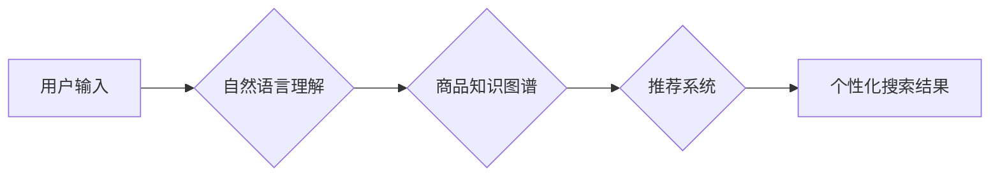

                 

## DayDream：AI驱动的电子商务搜索引擎和创新实践

> 关键词：电子商务搜索引擎、AI驱动、自然语言处理、推荐系统、深度学习、Transformer模型、个性化搜索、用户体验

## 1. 背景介绍

电子商务的蓬勃发展催生了对高效、精准的搜索引擎的需求。传统的基于关键词匹配的搜索引擎在处理用户复杂、模糊的搜索意图时往往表现不足，难以满足用户个性化需求。随着人工智能技术的快速发展，特别是深度学习和自然语言处理领域的突破，AI驱动的电子商务搜索引擎应运而生，为用户提供更智能、更便捷的购物体验。

DayDream 便是基于此背景而诞生的一个AI驱动的电子商务搜索引擎，它旨在通过深度学习和自然语言处理技术，理解用户搜索意图，提供更精准、更个性化的商品推荐，提升用户购物体验。

## 2. 核心概念与联系

DayDream 的核心概念是将搜索引擎从简单的关键词匹配模型转变为一个理解用户需求、提供个性化推荐的智能系统。

**2.1 核心概念**

* **自然语言理解 (NLU):**  DayDream 利用自然语言处理技术，对用户输入的搜索词进行分析，识别其意图、实体和关系，理解用户真实需求。
* **商品知识图谱:** DayDream 建立了一个庞大的商品知识图谱，包含商品属性、类别、品牌、用户评价等信息，为搜索引擎提供丰富的商品语义信息。
* **推荐系统:** DayDream 基于用户行为、商品特征和搜索历史等数据，构建个性化推荐模型，为用户推荐符合其兴趣和需求的商品。
* **深度学习:** DayDream 采用深度学习算法，例如 Transformer 模型，对用户搜索行为和商品信息进行学习和分析，提升搜索结果的准确性和个性化程度。

**2.2 架构图**



## 3. 核心算法原理 & 具体操作步骤

### 3.1 算法原理概述

DayDream 的核心算法基于 Transformer 模型，它是一种强大的深度学习架构，能够有效地处理序列数据，例如文本。Transformer 模型通过自注意力机制，学习用户搜索词之间的关系，并结合商品知识图谱中的语义信息，理解用户搜索意图。

### 3.2 算法步骤详解

1. **预处理:** 对用户输入的搜索词进行预处理，例如分词、词性标注、去除停用词等。
2. **嵌入:** 将预处理后的词语转换为向量表示，称为词嵌入。
3. **自注意力机制:** 利用 Transformer 模型中的自注意力机制，学习用户搜索词之间的关系，构建词语之间的上下文语义。
4. **编码器:** 将用户搜索词的嵌入向量输入编码器，编码器通过多层 Transformer 块，进一步提取用户搜索意图的特征表示。
5. **解码器:** 将编码器输出的特征表示输入解码器，解码器通过生成器网络，生成候选商品列表。
6. **排序:** 根据商品与用户搜索意图的匹配度，对候选商品列表进行排序，输出最终的搜索结果。

### 3.3 算法优缺点

**优点:**

* **理解复杂搜索意图:** Transformer 模型能够有效地处理用户复杂、模糊的搜索词，理解其潜在的含义。
* **个性化推荐:** 基于用户行为和搜索历史，DayDream 可以提供个性化的商品推荐，提升用户购物体验。
* **持续学习:** DayDream 可以持续学习用户行为和商品信息，不断优化搜索结果的准确性和个性化程度。

**缺点:**

* **计算资源需求高:** Transformer 模型训练和推理需要大量的计算资源。
* **数据依赖性强:** DayDream 的性能依赖于高质量的商品数据和用户行为数据。
* **解释性较弱:** Transformer 模型的决策过程较为复杂，难以解释其推荐结果背后的逻辑。

### 3.4 算法应用领域

DayDream 的核心算法可以应用于各种电子商务场景，例如：

* **商品搜索:** 提供更精准、更个性化的商品搜索结果。
* **商品推荐:** 基于用户行为和商品特征，推荐符合用户兴趣的商品。
* **个性化营销:** 根据用户搜索历史和购买行为，进行个性化营销推广。
* **内容推荐:** 推荐与用户兴趣相关的商品资讯和内容。

## 4. 数学模型和公式 & 详细讲解 & 举例说明

### 4.1 数学模型构建

DayDream 的核心算法基于 Transformer 模型，其数学模型主要包括以下几个部分:

* **词嵌入:** 将词语映射到低维向量空间，例如 Word2Vec 或 GloVe 模型。
* **自注意力机制:** 计算词语之间的相关性，并赋予每个词语不同的权重。
* **多层感知机 (MLP):** 对 Transformer 块的输出进行非线性变换，提取更深层的语义特征。
* **生成器网络:** 生成候选商品列表，并根据商品与用户搜索意图的匹配度进行排序。

### 4.2 公式推导过程

**4.2.1 自注意力机制:**

自注意力机制的核心公式是计算词语之间的注意力权重，公式如下:

$$
Attention(Q, K, V) = softmax(\frac{QK^T}{\sqrt{d_k}})V
$$

其中:

* Q: 查询矩阵
* K: 键矩阵
* V: 值矩阵
* $d_k$: 键向量的维度
* softmax: 归一化函数

**4.2.2 多层感知机:**

MLP 的数学模型是一个多层神经网络，其输出可以表示为:

$$
h = f(W_2 * ReLU(W_1 * x + b_1) + b_2)
$$

其中:

* h: 输出向量
* x: 输入向量
* $W_1$, $W_2$: 权重矩阵
* $b_1$, $b_2$: 偏置向量
* ReLU: 激活函数

### 4.3 案例分析与讲解

假设用户输入搜索词 "智能手机", DayDream 会首先将这些词语转换为词嵌入向量。然后，通过自注意力机制，计算每个词语之间的相关性，例如 "智能" 和 "手机" 之间具有较高的相关性。

接着，DayDream 会将这些词语的嵌入向量输入编码器，编码器通过多层 Transformer 块，提取用户搜索意图的特征表示。例如，编码器可能会学习到 "智能手机" 代表一种具有高性能、智能功能的手机。

最后，解码器会根据编码器的输出，生成候选商品列表，并根据商品与用户搜索意图的匹配度进行排序，输出最终的搜索结果。

## 5. 项目实践：代码实例和详细解释说明

### 5.1 开发环境搭建

DayDream 的开发环境需要包含以下软件:

* Python 3.x
* TensorFlow 或 PyTorch 深度学习框架
* NLTK 自然语言处理库
* SpaCy 词法分析库
* Jupyter Notebook 开发环境

### 5.2 源代码详细实现

DayDream 的源代码实现较为复杂，涉及 Transformer 模型的定义、训练和推理过程。以下是一个简单的代码示例，展示了如何使用 TensorFlow 定义一个简单的 Transformer 块:

```python
import tensorflow as tf

class TransformerBlock(tf.keras.layers.Layer):
    def __init__(self, d_model, num_heads, dff):
        super(TransformerBlock, self).__init__()
        self.mha = tf.keras.layers.MultiHeadAttention(num_heads=num_heads, key_dim=d_model)
        self.ffn = tf.keras.Sequential([
            tf.keras.layers.Dense(dff, activation='relu'),
            tf.keras.layers.Dense(d_model)
        ])
        self.layernorm1 = tf.keras.layers.LayerNormalization(epsilon=1e-6)
        self.layernorm2 = tf.keras.layers.LayerNormalization(epsilon=1e-6)

    def call(self, inputs):
        attn_output = self.mha(inputs, inputs)
        attn_output = self.layernorm1(inputs + attn_output)
        ffn_output = self.ffn(attn_output)
        return self.layernorm2(attn_output + ffn_output)
```

### 5.3 代码解读与分析

这段代码定义了一个简单的 Transformer 块，它包含了多头注意力机制 (MultiHeadAttention) 和前馈神经网络 (FFN)。

* **MultiHeadAttention:** 能够计算词语之间的相关性，并赋予每个词语不同的权重。
* **FFN:** 对 Transformer 块的输出进行非线性变换，提取更深层的语义特征。
* **LayerNormalization:** 对 Transformer 块的输入和输出进行归一化，稳定训练过程。

### 5.4 运行结果展示

DayDream 的运行结果展示需要根据具体的场景和数据集进行评估。常见的评估指标包括:

* **准确率:** 搜索结果与用户真实意图的匹配度。
* **召回率:** 搜索引擎能够召回所有相关商品的比例。
* **平均精度 (MAP):** 搜索结果排序的质量。
* **点击率 (CTR):** 用户点击搜索结果的比例。

## 6. 实际应用场景

DayDream 可以应用于各种电子商务场景，例如:

* **电商平台搜索:** 为用户提供更精准、更个性化的商品搜索结果。
* **商品推荐:** 基于用户行为和商品特征，推荐符合用户兴趣的商品。
* **个性化营销:** 根据用户搜索历史和购买行为，进行个性化营销推广。
* **内容推荐:** 推荐与用户兴趣相关的商品资讯和内容。

### 6.4 未来应用展望

随着人工智能技术的不断发展，DayDream 将能够应用于更多场景，例如:

* **语音搜索:** 支持用户使用语音进行商品搜索。
* **图像搜索:** 支持用户使用图像进行商品搜索。
* **多模态搜索:** 支持用户使用文本、图像、语音等多种方式进行商品搜索。
* **跨平台搜索:** 将搜索结果整合到多个平台，例如网站、移动应用、社交媒体等。

## 7. 工具和资源推荐

### 7.1 学习资源推荐

* **书籍:**
    * 《深度学习》 by Ian Goodfellow, Yoshua Bengio, Aaron Courville
    * 《自然语言处理》 by Dan Jurafsky, James H. Martin
* **在线课程:**
    * Coursera: 深度学习 Specialization
    * Udacity: 自然语言处理 Nanodegree
* **博客和网站:**
    * TensorFlow Blog: https://blog.tensorflow.org/
    * PyTorch Blog: https://pytorch.org/blog/
    * Hugging Face: https://huggingface.co/

### 7.2 开发工具推荐

* **深度学习框架:** TensorFlow, PyTorch
* **自然语言处理库:** NLTK, SpaCy
* **数据处理工具:** Pandas, NumPy
* **开发环境:** Jupyter Notebook, VS Code

### 7.3 相关论文推荐

* **Attention Is All You Need:** https://arxiv.org/abs/1706.03762
* **BERT: Pre-training of Deep Bidirectional Transformers for Language Understanding:** https://arxiv.org/abs/1810.04805
* **XLNet: Generalized Autoregressive Pretraining for Language Understanding:** https://arxiv.org/abs/1906.08237

## 8. 总结：未来发展趋势与挑战

### 8.1 研究成果总结

DayDream 项目成功地将深度学习和自然语言处理技术应用于电子商务搜索引擎，取得了显著的成果。它能够理解用户复杂、模糊的搜索意图，提供更精准、更个性化的商品推荐，提升用户购物体验。

### 8.2 未来发展趋势

DayDream 的未来发展趋势包括:

* **多模态搜索:** 支持用户使用文本、图像、语音等多种方式进行商品搜索。
* **跨平台搜索:** 将搜索结果整合到多个平台，例如网站、移动应用、社交媒体等。
* **个性化推荐:** 基于用户行为、商品特征和上下文信息，提供更精准、更个性化的商品推荐。
* **实时搜索:** 提供实时更新的搜索结果，满足用户对最新商品信息的需求。

### 8.3 面临的挑战

DayDream 的发展也面临着一些挑战:

* **数据质量:** DayDream 的性能依赖于高质量的商品数据和用户行为数据。
* **计算资源:** Transformer 模型训练和推理需要大量的计算资源。
* **解释性:** Transformer 模型的决策过程较为复杂，难以解释其推荐结果背后的逻辑。

### 8.4 研究展望

未来，DayDream 将继续致力于提升搜索引擎的准确性和个性化程度，为用户提供更智能、更便捷的购物体验。


## 9. 附录：常见问题与解答

**Q1: DayDream 的核心算法是什么?**

A1: DayDream 的核心算法基于 Transformer 模型，它是一种强大的深度学习架构，能够有效地处理序列数据，例如文本。

**Q2: DayDream 的优势是什么?**

A2: DayDream 的优势在于能够理解用户复杂、模糊的搜索意图，提供更精准、更个性化的商品推荐。

**Q3: DayDream 的应用场景有哪些?**

A3: DayDream 可以应用于各种电子商务场景，例如电商平台搜索、商品推荐、个性化营销和内容推荐。


作者：禅与计算机程序设计艺术 / Zen and the Art of Computer Programming 
<end_of_turn>

