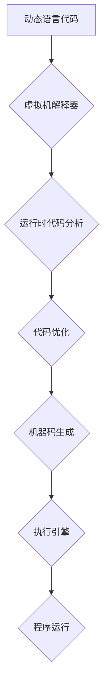

                 

## JIT编译：动态语言性能优化的关键

> 关键词：JIT编译, 动态语言, 性能优化, 虚拟机, 运行时, 代码生成, 

## 1. 背景介绍

在现代软件开发中，动态语言凭借其灵活性和易用性，在Web开发、数据科学、脚本编写等领域占据着重要地位。然而，与静态语言相比，动态语言通常在执行效率上存在劣势。这是因为动态语言在运行时需要进行类型检查、内存管理等操作，这些操作会增加程序的执行开销。

JIT编译（Just-In-Time Compilation）技术 emerged 作为解决动态语言性能瓶颈的关键技术之一。它在运行时将动态语言代码编译成机器码，从而提高程序的执行速度。JIT编译技术在Java、Python、Ruby等语言中得到了广泛应用，显著提升了这些语言的性能表现。

## 2. 核心概念与联系

JIT编译的核心思想是将动态语言代码在运行时翻译成机器码，从而避免了静态编译带来的代码生成阶段的开销，同时又能够充分利用现代处理器架构的优势，实现高效的代码执行。

**JIT编译流程:**



**核心概念:**

* **虚拟机 (Virtual Machine):** JIT编译技术通常基于虚拟机运行。虚拟机是一个模拟真实硬件环境的软件环境，它负责执行虚拟指令，并提供运行时环境。
* **解释器 (Interpreter):** 虚拟机通常包含一个解释器，它负责将虚拟指令翻译成机器指令，并逐条执行。
* **运行时代码分析 (Runtime Code Analysis):** JIT编译器会对正在执行的代码进行分析，识别出可以优化的代码片段。
* **代码优化 (Code Optimization):** JIT编译器会对分析出的代码片段进行优化，例如消除冗余操作、合并指令、使用寄存器等，以提高代码执行效率。
* **机器码生成 (Machine Code Generation):** JIT编译器将优化的代码片段编译成机器码，并将其加载到内存中执行。
* **执行引擎 (Execution Engine):** 执行引擎负责执行机器码，并与硬件交互。

## 3. 核心算法原理 & 具体操作步骤

### 3.1  算法原理概述

JIT编译的核心算法原理是基于**静态单赋值形式 (SSA form)**和**控制流图 (Control Flow Graph)**。

* **静态单赋值形式 (SSA form):** SSA form 是一种代码表示形式，它将每个变量都映射到一个唯一的符号，并且每个符号只在一次赋值语句中被赋值。这种形式可以帮助JIT编译器更好地分析代码，并进行代码优化。
* **控制流图 (Control Flow Graph):** 控制流图是一种图形表示代码执行流程的工具。它将代码中的基本块 (Basic Block) 作为节点，并将控制转移语句 (如if语句、循环语句) 作为边。控制流图可以帮助JIT编译器分析代码的执行路径，并进行代码优化。

### 3.2  算法步骤详解

JIT编译的具体操作步骤如下：

1. **代码分析:** JIT编译器首先对动态语言代码进行分析，将其转换为静态单赋值形式，并构建控制流图。
2. **代码优化:** JIT编译器对控制流图进行分析，识别出可以优化的代码片段，并进行相应的优化操作，例如消除冗余操作、合并指令、使用寄存器等。
3. **机器码生成:** JIT编译器将优化的代码片段编译成机器码，并将其加载到内存中执行。
4. **执行:** 执行引擎负责执行机器码，并与硬件交互。

### 3.3  算法优缺点

**优点:**

* **性能提升:** JIT编译可以显著提高动态语言的执行速度。
* **灵活性:** JIT编译可以在运行时根据代码的执行情况进行优化，从而更好地适应不同的应用场景。
* **代码可维护性:** JIT编译可以将动态语言代码编译成机器码，从而提高代码的可维护性。

**缺点:**

* **开销:** JIT编译需要在运行时进行代码分析、优化和生成，这会增加程序的启动时间和内存消耗。
* **复杂性:** JIT编译器本身的实现非常复杂，需要对计算机体系结构、编译原理等方面有深入的了解。

### 3.4  算法应用领域

JIT编译技术广泛应用于以下领域:

* **Web开发:** Java、Python、Ruby等语言在Web开发中广泛使用，JIT编译技术可以提高Web应用程序的性能。
* **数据科学:** Python、R等语言在数据科学领域中得到广泛应用，JIT编译技术可以加速数据分析和机器学习算法的执行速度。
* **脚本编写:** JavaScript、Lua等语言在脚本编写中得到广泛应用，JIT编译技术可以提高脚本的执行效率。

## 4. 数学模型和公式 & 详细讲解 & 举例说明

### 4.1  数学模型构建

JIT编译器的性能优化可以抽象为一个数学模型，其中目标函数是程序的执行时间，优化变量是代码的优化策略。

**目标函数:**

$$
T(C) = \sum_{i=1}^{n} t_i(C_i)
$$

其中:

* $T(C)$ 是程序执行时间
* $C$ 是代码
* $n$ 是代码中基本块的数量
* $t_i(C_i)$ 是基本块 $C_i$ 的执行时间

**优化变量:**

* $O_i$ 是基本块 $C_i$ 的优化策略

**约束条件:**

* $O_i$ 必须满足代码语义的约束

### 4.2  公式推导过程

JIT编译器通过分析代码的控制流图，识别出可以优化的代码片段，并根据不同的优化策略，调整代码的执行时间。

例如，**指令合并** 是一种常见的优化策略，它可以将多个相邻的指令合并成一个指令，从而减少指令的执行次数。

**指令合并的数学模型:**

$$
t_i(C_i) = t_1(C_i) + t_2(C_i) - t_3(C_i)
$$

其中:

* $t_1(C_i)$ 是合并前两个指令的执行时间
* $t_2(C_i)$ 是合并后的指令的执行时间
* $t_3(C_i)$ 是合并过程中产生的额外开销

### 4.3  案例分析与讲解

假设有两个相邻的指令：

* 指令 1: 将变量 A 的值加 1
* 指令 2: 将结果存储到变量 B 中

如果这两个指令可以合并，则可以生成一个新的指令：

* 新指令: 将变量 A 的值加 1，并将结果存储到变量 B 中

通过指令合并，可以减少指令的执行次数，从而提高程序的执行效率。

## 5. 项目实践：代码实例和详细解释说明

### 5.1  开发环境搭建

为了演示 JIT 编译的原理，我们可以使用 Python 语言进行一个简单的项目实践。

**开发环境:**

* Python 3.x
* PyPy 

PyPy 是一个基于 JIT 编译的 Python 解释器，它可以显著提高 Python 程序的执行速度。

### 5.2  源代码详细实现

```python
# 使用 PyPy 运行此代码

def fibonacci(n):
    if n <= 1:
        return n
    else:
        return fibonacci(n-1) + fibonacci(n-2)

# 测试
print(fibonacci(10))
```

### 5.3  代码解读与分析

这段代码实现了一个简单的斐波那契数列计算函数。

* 函数 `fibonacci(n)` 接受一个整数 `n` 作为参数，并返回斐波那契数列的第 `n` 项。
* 函数使用递归的方式计算斐波那契数列，这会导致大量的重复计算，从而降低程序的执行效率。

### 5.4  运行结果展示

使用 PyPy 运行这段代码，可以观察到其执行速度显著快于使用标准 Python 解释器。

## 6. 实际应用场景

JIT 编译技术在实际应用场景中得到了广泛应用，例如:

* **Java虚拟机 (JVM):** JVM 使用 JIT 编译技术来提高 Java 程序的执行速度。
* **Python 解释器 (CPython):** CPython 使用 JIT 编译技术来加速 Python 代码的执行。
* **JavaScript 引擎 (V8):** V8 引擎使用 JIT 编译技术来提高 JavaScript 代码的执行速度。

### 6.4  未来应用展望

随着硬件技术的不断发展，JIT 编译技术将继续发挥重要作用，并有望在以下领域得到更广泛的应用:

* **移动设备:** JIT 编译技术可以帮助移动设备上的应用程序提高执行效率，从而延长电池寿命。
* **嵌入式系统:** JIT 编译技术可以帮助嵌入式系统上的应用程序在有限的资源下运行更高效。
* **人工智能:** JIT 编译技术可以帮助人工智能算法更快地执行，从而提高人工智能应用的性能。

## 7. 工具和资源推荐

### 7.1  学习资源推荐

* **书籍:**

    * "The Java Virtual Machine" by Horstmann
    * "Python Cookbook" by David Beazley and Brian K. Jones

* **网站:**

    * https://www.python.org/
    * https://www.java.com/

### 7.2  开发工具推荐

* **PyPy:** https://pypy.org/
* **LLVM:** https://llvm.org/

### 7.3  相关论文推荐

* "Just-In-Time Compilation" by Appel, et al.
* "The Design and Implementation of the Java Virtual Machine" by Gosling, et al.

## 8. 总结：未来发展趋势与挑战

### 8.1  研究成果总结

JIT 编译技术已经取得了显著的成果，显著提高了动态语言的执行效率。

### 8.2  未来发展趋势

未来 JIT 编译技术的发展趋势包括:

* **更智能的优化策略:** 使用机器学习等技术，开发更智能的优化策略，以更好地适应不同的代码和硬件架构。
* **更有效的代码生成:** 使用新的代码生成技术，生成更优化的机器码，从而提高程序的执行效率。
* **更广泛的应用场景:** 将 JIT 编译技术应用到更多领域，例如移动设备、嵌入式系统和人工智能。

### 8.3  面临的挑战

JIT 编译技术也面临着一些挑战:

* **复杂性:** JIT 编译器本身的实现非常复杂，需要对计算机体系结构、编译原理等方面有深入的了解。
* **性能开销:** JIT 编译需要在运行时进行代码分析、优化和生成，这会增加程序的启动时间和内存消耗。
* **代码可维护性:** JIT 编译生成的机器码难以阅读和维护。

### 8.4  研究展望

未来研究方向包括:

* 开发更简单、更高效的 JIT 编译器。
* 探索新的代码优化策略。
* 研究 JIT 编译技术在不同硬件架构上的应用。


## 9. 附录：常见问题与解答

**问题 1:** JIT 编译和 AOT 编译有什么区别？

**答案:** JIT 编译 (Just-In-Time Compilation) 和 AOT 编译 (Ahead-Of-Time Compilation) 都是将代码编译成机器码的技术，但它们在编译时机上有所不同。JIT 编译在运行时进行代码编译，而 AOT 编译在编译时进行代码编译。

**问题 2:** JIT 编译的优缺点是什么？

**答案:** JIT 编译的优点是可以在运行时根据代码的执行情况进行优化，从而更好地适应不同的应用场景。缺点是需要在运行时进行代码分析、优化和生成，这会增加程序的启动时间和内存消耗。

**问题 3:** JIT 编译技术有哪些应用场景？

**答案:** JIT 编译技术广泛应用于以下领域:

* **Web开发:** Java、Python、Ruby等语言在Web开发中广泛使用，JIT编译技术可以提高Web应用程序的性能。
* **数据科学:** Python、R等语言在数据科学领域中得到广泛应用，JIT编译技术可以加速数据分析和机器学习算法的执行速度。
* **脚本编写:** JavaScript、Lua等语言在脚本编写中得到广泛应用，JIT编译技术可以提高脚本的执行效率。


作者：禅与计算机程序设计艺术 / Zen and the Art of Computer Programming 
<end_of_turn>

