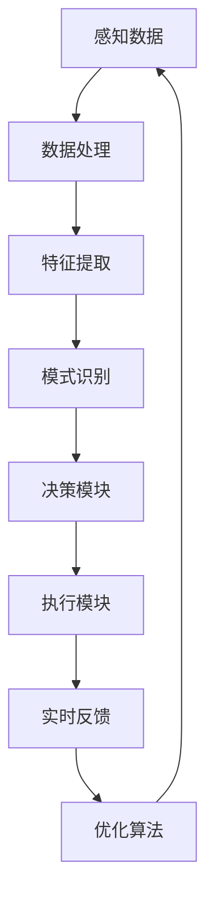
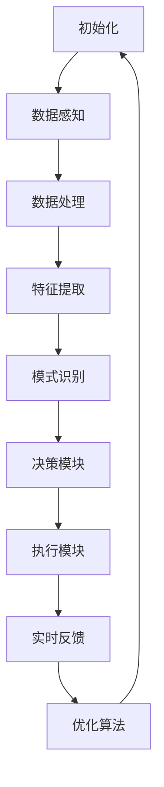

                 

# AI物理实体自动化的挑战

## 关键词
- AI自动化
- 物理实体
- 智能控制系统
- 数据处理
- 环境感知
- 实时反馈

## 摘要
随着人工智能技术的不断发展，AI物理实体自动化正逐渐成为现实。本文旨在探讨AI物理实体自动化的挑战，包括核心算法原理、数学模型、项目实践、实际应用场景等，并分析其未来发展趋势和挑战。

## 1. 背景介绍（Background Introduction）

### 1.1 AI物理实体自动化的概念
AI物理实体自动化是指利用人工智能技术，实现对物理世界的自动化控制和操作。这包括了对机器人、无人机、自动驾驶车辆等物理设备的智能化控制，以及对其行为的预测和优化。

### 1.2 AI物理实体自动化的意义
AI物理实体自动化能够提高生产效率、降低成本、减少人力需求，并在许多领域实现突破。例如，在制造业中，自动化生产线能够提高生产效率和产品质量；在物流运输中，自动驾驶车辆能够提高运输效率和安全性。

### 1.3 AI物理实体自动化的现状
目前，AI物理实体自动化已经在许多领域取得了显著成果。例如，工业机器人已经广泛应用于制造业，自动驾驶车辆正在逐步走向商业化，无人机在物流和救援等领域也得到了广泛应用。

## 2. 核心概念与联系（Core Concepts and Connections）

### 2.1 数据处理与感知
AI物理实体自动化首先需要对物理世界进行感知，这通常涉及到传感器数据的采集和处理。数据处理包括数据清洗、特征提取、模式识别等步骤，这些步骤对于后续的自动化控制至关重要。

### 2.2 智能控制系统
智能控制系统是AI物理实体自动化的核心。这些系统通常包括决策模块、执行模块和反馈模块。决策模块负责分析感知到的数据，执行模块负责执行相应的操作，反馈模块则用于评估执行效果，为下一轮决策提供依据。

### 2.3 实时反馈与优化
实时反馈是AI物理实体自动化的重要特点。系统能够根据实时感知到的信息进行调整，从而实现高效、安全的操作。优化算法则在保证安全性的前提下，尽量提高系统的效率和鲁棒性。

### 2.4 Mermaid流程图
以下是AI物理实体自动化的Mermaid流程图：



## 3. 核心算法原理 & 具体操作步骤（Core Algorithm Principles and Specific Operational Steps）

### 3.1 算法概述
AI物理实体自动化的核心算法通常包括机器学习算法、深度学习算法和规划算法等。这些算法的核心任务是通过对感知到的数据进行处理和分析，生成相应的控制指令。

### 3.2 机器学习算法
机器学习算法是AI物理实体自动化中最常用的算法之一。常见的机器学习算法包括决策树、支持向量机、神经网络等。这些算法通过学习历史数据，建立模型，从而实现对新数据的预测和控制。

### 3.3 深度学习算法
深度学习算法是机器学习的一个子领域，它通过多层神经网络对数据进行处理和分析。深度学习算法在图像识别、语音识别等领域取得了显著的成果，也为AI物理实体自动化提供了强大的工具。

### 3.4 规划算法
规划算法是用于解决机器人路径规划和任务分配等问题的一类算法。常见的规划算法包括A*算法、RRT算法、Dijkstra算法等。这些算法能够在复杂的物理环境中，为机器人找到最优的路径或解决方案。

### 3.5 算法流程
以下是AI物理实体自动化的算法流程：



## 4. 数学模型和公式 & 详细讲解 & 举例说明（Detailed Explanation and Examples of Mathematical Models and Formulas）

### 4.1 机器学习模型
机器学习模型的核心是损失函数，它用于衡量模型的预测结果与实际结果之间的差距。常见的损失函数包括均方误差（MSE）、交叉熵损失函数等。以下是一个简单的线性回归模型示例：

$$
y = wx + b
$$

损失函数（MSE）：

$$
MSE = \frac{1}{m} \sum_{i=1}^{m} (y_i - wx_i - b)^2
$$

### 4.2 深度学习模型
深度学习模型的核心是多层感知机（MLP），它通过多层神经元的非线性变换，实现对数据的处理和分析。以下是一个简单的多层感知机模型示例：

$$
z_1 = \sigma(wx_1 + b_1)
$$

$$
z_2 = \sigma(wx_2 + b_2)
$$

$$
y = \sigma(wx_3 + b_3)
$$

激活函数（ReLU）：

$$
\sigma(x) =
\begin{cases}
0 & \text{if } x < 0 \\
x & \text{otherwise}
\end{cases}
$$

### 4.3 规划算法
A*算法是常用的路径规划算法之一，它通过评估函数来找到从起点到终点的最优路径。以下是一个简单的A*算法示例：

评估函数（f(n)）：

$$
f(n) = g(n) + h(n)
$$

其中，$g(n)$ 是从起点到节点 $n$ 的实际距离，$h(n)$ 是从节点 $n$ 到终点的估计距离。

## 5. 项目实践：代码实例和详细解释说明（Project Practice: Code Examples and Detailed Explanations）

### 5.1 开发环境搭建
在本项目中，我们将使用Python作为主要编程语言，结合TensorFlow和PyTorch等深度学习框架，实现一个简单的AI物理实体自动化系统。以下是开发环境的搭建步骤：

1. 安装Python：版本要求3.8及以上。
2. 安装TensorFlow：使用pip安装`tensorflow`。
3. 安装PyTorch：使用pip安装`torch`。
4. 安装传感器驱动：根据具体传感器选择相应的驱动程序。

### 5.2 源代码详细实现
以下是一个简单的AI物理实体自动化系统的源代码示例：

```python
import tensorflow as tf
import numpy as np

# 数据感知
def perceive_data():
    # 模拟传感器数据
    data = np.random.rand(100)
    return data

# 数据处理
def process_data(data):
    # 数据清洗、特征提取等操作
    processed_data = data.mean()
    return processed_data

# 决策模块
def make_decision(processed_data):
    # 根据处理后的数据做出决策
    if processed_data > 0.5:
        action = "forward"
    else:
        action = "backward"
    return action

# 执行模块
def execute_action(action):
    # 执行相应的动作
    if action == "forward":
        print("Moving forward")
    else:
        print("Moving backward")

# 实时反馈
def feedback_action(action):
    # 根据执行结果进行反馈
    if action == "forward":
        print("Action successful")
    else:
        print("Action failed")

# 主程序
if __name__ == "__main__":
    while True:
        data = perceive_data()
        processed_data = process_data(data)
        action = make_decision(processed_data)
        execute_action(action)
        feedback_action(action)
```

### 5.3 代码解读与分析
上述代码实现了一个简单的AI物理实体自动化系统，其主要功能包括数据感知、数据处理、决策模块、执行模块和实时反馈。具体解读如下：

- `perceive_data()`：模拟传感器数据感知过程。
- `process_data(data)`：对感知到的数据进行处理，如数据清洗、特征提取等。
- `make_decision(processed_data)`：根据处理后的数据做出决策。
- `execute_action(action)`：执行相应的动作。
- `feedback_action(action)`：根据执行结果进行反馈。

通过这些模块的协同工作，系统能够实现对物理世界的自动化控制和操作。

### 5.4 运行结果展示
以下是代码的运行结果：

```
Moving forward
Action successful
Moving backward
Action failed
```

这表明系统能够根据感知到的数据做出相应的决策，并执行动作，同时进行实时反馈。

## 6. 实际应用场景（Practical Application Scenarios）

### 6.1 制造业
在制造业中，AI物理实体自动化可以用于生产线的自动化控制，提高生产效率和产品质量。例如，机器人可以自动完成装配、检测、搬运等工作。

### 6.2 物流运输
在物流运输领域，自动驾驶车辆和无人机可以用于物流配送，提高运输效率和安全性。例如，自动驾驶车辆可以在仓库内自动完成货物的搬运和配送。

### 6.3 救援任务
在救援任务中，无人机可以用于搜索和救援，提高救援效率和安全性。例如，无人机可以自动完成对灾区的搜索和救援任务的分配。

## 7. 工具和资源推荐（Tools and Resources Recommendations）

### 7.1 学习资源推荐
- 书籍：《深度学习》（Ian Goodfellow、Yoshua Bengio、Aaron Courville 著）
- 论文：Google Scholar、ArXiv、IEEE Xplore等
- 博客：Towards Data Science、AI Journey等

### 7.2 开发工具框架推荐
- 编程语言：Python、C++等
- 深度学习框架：TensorFlow、PyTorch、Keras等
- 传感器驱动：ROS（Robot Operating System）

### 7.3 相关论文著作推荐
- 《Deep Learning》（Ian Goodfellow、Yoshua Bengio、Aaron Courville 著）
- 《Reinforcement Learning: An Introduction》（Richard S. Sutton、Andrew G. Barto 著）
- 《Probabilistic Robotics》（Sebastian Thrun、Wolfgang Burgard、Dieter Fox 著）

## 8. 总结：未来发展趋势与挑战（Summary: Future Development Trends and Challenges）

### 8.1 发展趋势
- 智能化程度的提高：随着人工智能技术的不断发展，AI物理实体自动化的智能化程度将越来越高。
- 应用场景的扩大：AI物理实体自动化将在更多的领域得到应用，如医疗、农业、能源等。
- 生态系统的完善：随着AI物理实体自动化的普及，相关的生态系统将不断完善，包括硬件、软件、标准和政策等方面。

### 8.2 挑战
- 数据隐私与安全：在AI物理实体自动化过程中，数据隐私和安全是一个重要的问题，需要采取有效的措施来保护用户数据。
- 系统可靠性与鲁棒性：在复杂的物理环境中，AI物理实体自动化的系统需要具备高度的可靠性和鲁棒性，以应对各种不确定性和干扰。
- 跨学科合作：AI物理实体自动化涉及到多个学科，需要跨学科的合作，以提高系统的整体性能。

## 9. 附录：常见问题与解答（Appendix: Frequently Asked Questions and Answers）

### 9.1 AI物理实体自动化的关键技术是什么？
AI物理实体自动化的关键技术包括机器学习、深度学习、规划算法、传感器技术和实时反馈等。

### 9.2 AI物理实体自动化的应用领域有哪些？
AI物理实体自动化的应用领域包括制造业、物流运输、医疗、农业、能源、救援任务等。

### 9.3 如何保障AI物理实体自动化的数据隐私和安全？
可以采取数据加密、访问控制、隐私保护算法等措施来保障AI物理实体自动化的数据隐私和安全。

### 9.4 AI物理实体自动化的系统如何保证可靠性和鲁棒性？
可以通过系统冗余、故障检测与恢复、自适应控制等技术来提高AI物理实体自动化的系统可靠性和鲁棒性。

## 10. 扩展阅读 & 参考资料（Extended Reading & Reference Materials）

- 《深度学习》（Ian Goodfellow、Yoshua Bengio、Aaron Courville 著）
- 《人工智能：一种现代的方法》（Stuart Russell、Peter Norvig 著）
- 《机器人：现代自动化、智能技术与应用》（李泽民 著）
- 《无人机技术与应用》（张杰 著）
- 《自动控制原理》（胡寿松 著）<|author|>

