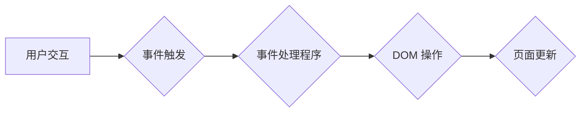

                 

## JavaScript 入门：为网站添加交互性

> 关键词：JavaScript, Web 开发,  交互性,  DOM 操作,  事件处理,  函数,  对象,  异步编程

### 1. 背景介绍

在互联网时代，网站不再仅仅是静态的文本和图片展示平台，而是需要具备交互性和动态性的体验空间。JavaScript 作为一种客户端脚本语言，成为了实现网站交互性的关键技术。它允许开发者直接在用户的浏览器中执行代码，从而为网站添加各种动态效果、用户反馈和功能。

从简单的页面元素动画到复杂的单页应用，JavaScript 无处不在。它为网页开发带来了无限的可能性，也推动了 Web 开发的不断进步。

### 2. 核心概念与联系

#### 2.1  JavaScript 的运行环境

JavaScript 代码在浏览器中运行，其运行环境被称为 JavaScript 引擎。每个浏览器都有自己的 JavaScript 引擎，例如 Chrome 的 V8 引擎、Firefox 的 SpiderMonkey 引擎等。这些引擎负责解析、编译和执行 JavaScript 代码。

#### 2.2  DOM 操作

DOM (Document Object Model) 是一个表示网页结构的树形模型。JavaScript 可以通过 DOM API 操作网页元素，例如获取元素、修改元素属性、添加元素、删除元素等。DOM 操作是 JavaScript 实现网页交互性的基础。

#### 2.3  事件处理

事件是指用户与网页交互时发生的各种动作，例如点击、鼠标移动、键盘输入等。JavaScript 可以通过事件处理机制监听这些事件，并在事件发生时执行相应的代码。事件处理是 JavaScript 实现用户反馈和响应的关键。

#### 2.4  函数和对象

JavaScript 是面向对象编程语言，它支持函数和对象的定义和使用。函数是可重复执行的代码块，对象是包含数据和方法的实体。函数和对象是 JavaScript 代码组织和复用的重要工具。

#### 2.5  异步编程

JavaScript 是一种单线程语言，这意味着它只能执行一个任务一次。然而，许多网页操作需要耗费时间，例如网络请求。为了避免阻塞主线程，JavaScript 提供了异步编程机制，例如 setTimeout、setInterval 和 Promise 等，允许开发者执行耗时操作而不影响网页的响应速度。

**Mermaid 流程图**



### 3. 核心算法原理 & 具体操作步骤

#### 3.1  算法原理概述

JavaScript 中没有固定的算法，而是通过函数和对象组合实现各种功能。例如，实现网页动画可以使用定时器和 DOM 操作，实现用户登录可以使用加密算法和数据验证。

#### 3.2  算法步骤详解

具体算法步骤取决于具体的应用场景。例如，实现一个简单的网页动画，步骤如下：

1.  **获取目标元素:** 使用 JavaScript 的 DOM API 获取需要动画的目标元素。
2.  **设置初始状态:** 设置目标元素的初始样式属性，例如位置、大小、颜色等。
3.  **使用定时器:** 使用 JavaScript 的 setTimeout 或 setInterval 函数，每隔一段时间更新目标元素的样式属性，实现动画效果。
4.  **停止动画:** 当动画完成时，使用 clearTimeout 或 clearInterval 函数停止定时器。

#### 3.3  算法优缺点

JavaScript 算法的优缺点取决于具体的实现方式。

**优点:**

*   **灵活:** JavaScript 是一种动态语言，可以根据需要灵活调整算法。
*   **易于学习:** JavaScript 的语法相对简单易懂，学习曲线较平缓。
*   **广泛应用:** JavaScript 在网页开发中应用广泛，拥有丰富的第三方库和框架。

**缺点:**

*   **性能:** JavaScript 是一种解释型语言，执行速度相对较慢，对于复杂的算法可能会影响网页性能。
*   **安全性:** JavaScript 代码在浏览器中执行，存在一定的安全风险，需要开发者注意代码安全。

#### 3.4  算法应用领域

JavaScript 算法广泛应用于网页开发的各个领域，例如：

*   **网页动画:** 实现网页元素的动画效果，例如滚动、淡入淡出、旋转等。
*   **用户交互:** 处理用户点击、鼠标移动、键盘输入等事件，实现网页的交互功能。
*   **数据处理:** 对网页数据进行处理和分析，例如过滤、排序、计算等。
*   **网络请求:** 发送和接收网络请求，获取和更新网页数据。

### 4. 数学模型和公式 & 详细讲解 & 举例说明

#### 4.1  数学模型构建

JavaScript 中的数学模型主要用于处理数值计算和几何图形。例如，计算两个点的距离可以使用欧几里得距离公式：

$$
d = \sqrt{(x_2 - x_1)^2 + (y_2 - y_1)^2}
$$

其中，$(x_1, y_1)$ 和 $(x_2, y_2)$ 是两个点的坐标。

#### 4.2  公式推导过程

JavaScript 提供了丰富的数学函数，例如 Math.sqrt() 用于计算平方根，Math.pow() 用于计算幂运算等。这些函数的实现原理基于数学公式和算法。

#### 4.3  案例分析与讲解

例如，计算一个三角形的面积可以使用以下公式：

$$
S = \frac{1}{2} \cdot a \cdot b \cdot \sin(C)
$$

其中，$a$ 和 $b$ 是三角形的两条边长，$C$ 是两条边之间的夹角。

在 JavaScript 中，可以使用以下代码计算三角形的面积：

```javascript
const a = 5;
const b = 10;
const c = 60; // 角度以度为单位

const area = 0.5 * a * b * Math.sin(c * Math.PI / 180);

console.log("三角形的面积为:", area);
```

### 5. 项目实践：代码实例和详细解释说明

#### 5.1  开发环境搭建

为了开发 JavaScript 代码，需要搭建一个开发环境。常用的开发环境包括：

*   **文本编辑器:** Sublime Text、VS Code 等
*   **浏览器:** Chrome、Firefox 等
*   **JavaScript 引擎:** 浏览器自带的 JavaScript 引擎

#### 5.2  源代码详细实现

以下是一个简单的 JavaScript 代码示例，实现一个按钮点击事件的处理：

```javascript
// 获取按钮元素
const button = document.getElementById("myButton");

// 为按钮添加点击事件监听器
button.addEventListener("click", function() {
  // 点击按钮时执行的代码
  alert("按钮被点击了!");
});
```

#### 5.3  代码解读与分析

*   `document.getElementById("myButton")`：使用 DOM API 获取 ID 为 "myButton" 的按钮元素。
*   `addEventListener("click", function() { ... })`：为按钮添加一个点击事件监听器，当按钮被点击时，会执行内部的函数。
*   `alert("按钮被点击了!")`：在浏览器中弹出一个警告框，显示 "按钮被点击了!" 的消息。

#### 5.4  运行结果展示

当用户点击按钮时，浏览器会弹出一个警告框，显示 "按钮被点击了!" 的消息。

### 6. 实际应用场景

JavaScript 在网页开发中应用广泛，例如：

*   **单页应用 (SPA):** 使用 JavaScript 实现复杂的交互功能和数据更新，例如 Gmail、Facebook 等。
*   **游戏开发:** 使用 JavaScript 开发网页游戏，例如 2048、Tetris 等。
*   **数据可视化:** 使用 JavaScript 库和框架，例如 D3.js、Chart.js 等，创建交互式图表和数据可视化。
*   **移动应用开发:** 使用 JavaScript 框架，例如 React Native、Ionic 等，开发跨平台移动应用。

#### 6.4  未来应用展望

随着 Web 技术的不断发展，JavaScript 的应用场景将更加广泛。例如：

*   **WebAssembly:** WebAssembly 是一个新的 Web 标准，可以运行高效的 C/C++ 代码，将进一步提升 JavaScript 的性能。
*   **区块链:** JavaScript 可以用于开发区块链应用，例如智能合约、去中心化应用等。
*   **人工智能:** JavaScript 可以用于开发人工智能应用，例如机器学习、自然语言处理等。

### 7. 工具和资源推荐

#### 7.1  学习资源推荐

*   **Mozilla Developer Network (MDN):** https://developer.mozilla.org/en-US/docs/Web/JavaScript
*   **W3Schools JavaScript Tutorial:** https://www.w3schools.com/js/
*   **Eloquent JavaScript:** https://eloquentjavascript.net/

#### 7.2  开发工具推荐

*   **Sublime Text:** https://www.sublimetext.com/
*   **VS Code:** https://code.visualstudio.com/
*   **Chrome DevTools:** https://developers.google.com/web/tools/chrome-devtools

#### 7.3  相关论文推荐

*   **JavaScript: The Good Parts:** Douglas Crockford
*   **You Don't Know JS:** Kyle Simpson

### 8. 总结：未来发展趋势与挑战

#### 8.1  研究成果总结

JavaScript 作为一种重要的 Web 技术，在网页开发中发挥着不可替代的作用。它不断发展和完善，为开发者提供了越来越强大的工具和功能。

#### 8.2  未来发展趋势

JavaScript 的未来发展趋势包括：

*   **性能提升:** WebAssembly 等新技术将进一步提升 JavaScript 的性能。
*   **跨平台应用:** JavaScript 框架将推动跨平台应用的开发。
*   **人工智能应用:** JavaScript 将在人工智能领域发挥越来越重要的作用。

#### 8.3  面临的挑战

JavaScript 也面临着一些挑战，例如：

*   **安全性:** JavaScript 代码在浏览器中执行，存在一定的安全风险。
*   **性能瓶颈:** 复杂的 JavaScript 代码可能会导致网页性能下降。
*   **生态系统复杂性:** JavaScript 的生态系统庞大复杂，需要开发者不断学习和适应。

#### 8.4  研究展望

未来，JavaScript 将继续发展和完善，为 Web 开发带来更多创新和可能性。研究者和开发者需要不断探索新的技术和应用场景，以应对 JavaScript 面临的挑战，推动 JavaScript 的持续发展。

### 9. 附录：常见问题与解答

#### 9.1  常见问题

*   **如何调试 JavaScript 代码？**

可以使用浏览器自带的调试工具，例如 Chrome DevTools，来调试 JavaScript 代码。

*   **如何优化 JavaScript 代码性能？**

可以使用代码压缩、缓存、异步编程等技术来优化 JavaScript 代码性能。

*   **如何学习 JavaScript？**

可以参考 MDN、W3Schools 等学习资源，也可以阅读相关书籍和博客文章。

#### 9.2  解答

*   **如何调试 JavaScript 代码？**

可以使用浏览器自带的调试工具，例如 Chrome DevTools，来调试 JavaScript 代码。

*   **如何优化 JavaScript 代码性能？**

可以使用代码压缩、缓存、异步编程等技术来优化 JavaScript 代码性能。

*   **如何学习 JavaScript？**

可以参考 MDN、W3Schools 等学习资源，也可以阅读相关书籍和博客文章。


作者：禅与计算机程序设计艺术 / Zen and the Art of Computer Programming 
<end_of_turn>

