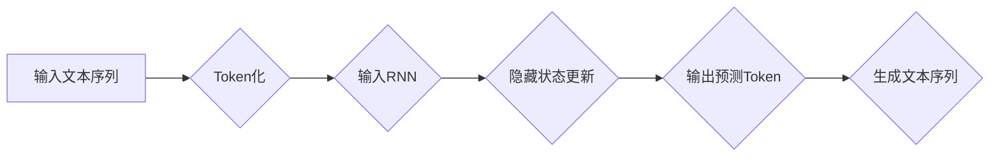

                 

## LLM Tokens + RS方法

> 关键词：LLM, Token, RS, 机器学习, 自然语言处理, 序列生成, 预训练模型

## 1. 背景介绍

近年来，大型语言模型（LLM）在自然语言处理（NLP）领域取得了显著进展，展现出强大的文本生成、翻译、问答等能力。然而，LLM 的训练和应用都面临着巨大的挑战，其中之一就是高效地处理文本序列。

传统的文本处理方法通常将文本序列直接输入模型，但这会导致以下问题：

* **高维特征空间:** 文本序列的长度和词汇量通常很大，导致特征空间维度很高，训练和推理效率低下。
* **长距离依赖问题:**  LLM 需要捕捉文本序列中长距离的语义依赖关系，但传统的RNN结构难以有效处理长序列信息。

为了解决这些问题，研究者们提出了许多新的方法，其中**Token化**和**RS（Recurrent Sequence）方法**是两种重要的技术。

**Token化**将文本序列分割成更小的单位，称为Token，例如单词、子词或字符。这可以降低特征空间的维度，并简化模型的训练过程。

**RS方法**则利用循环神经网络（RNN）的特性，对文本序列进行逐个处理，并捕捉序列中的时间依赖关系。

## 2. 核心概念与联系

### 2.1 Token化

Token化是将文本序列分割成更小的单位的过程，可以是单词、子词或字符。

* **单词 Token化:** 将文本序列分割成单词，例如“我爱学习编程”会被分割成["我", "爱", "学习", "编程"]。
* **子词 Token化:** 将单词分割成更小的子词，例如“学习”可以分割成["学", "习"]。
* **字符 Token化:** 将文本序列分割成单个字符，例如“学习”会被分割成["学", "习", ""]。

Token化可以有效降低文本序列的维度，并简化模型的训练过程。

### 2.2 RS方法

RS方法利用循环神经网络（RNN）的特性，对文本序列进行逐个处理，并捕捉序列中的时间依赖关系。

* **RNN结构:** RNN包含一个循环单元，可以存储和更新隐藏状态，从而捕捉序列中的时间依赖关系。
* **序列处理:** RNN可以逐个处理文本序列中的每个Token，并根据隐藏状态生成下一个Token的预测。

RS方法可以有效捕捉文本序列中的长距离依赖关系，提高模型的性能。

**Mermaid 流程图**



## 3. 核心算法原理 & 具体操作步骤

### 3.1 算法原理概述

LLM Tokens + RS方法结合了Token化和RS方法的优势，可以有效处理文本序列，提高模型的性能。

具体来说，该方法首先将文本序列进行Token化，然后将Token序列输入到RNN模型中进行处理。RNN模型会根据隐藏状态更新和预测下一个Token，最终生成完整的文本序列。

### 3.2 算法步骤详解

1. **文本预处理:** 对输入文本进行预处理，例如去除停用词、标点符号等。
2. **Token化:** 将预处理后的文本序列分割成Token。
3. **Embedding:** 将每个Token映射到一个低维向量空间中，称为Embedding。
4. **RNN输入:** 将Token序列和对应的Embedding输入到RNN模型中。
5. **隐藏状态更新:** RNN模型会根据输入的Token和隐藏状态更新隐藏状态，从而捕捉序列中的时间依赖关系。
6. **输出预测Token:** RNN模型会根据隐藏状态预测下一个Token。
7. **文本生成:** 将预测的Token拼接起来，最终生成完整的文本序列。

### 3.3 算法优缺点

**优点:**

* **高效处理文本序列:** Token化可以降低文本序列的维度，提高模型的训练和推理效率。
* **捕捉长距离依赖关系:** RS方法可以有效捕捉文本序列中的长距离依赖关系。
* **可扩展性强:** 该方法可以很容易地扩展到处理更长的文本序列。

**缺点:**

* **训练时间长:** LLM模型的训练时间通常很长。
* **参数量大:** LLM模型的参数量很大，需要大量的计算资源进行训练。
* **过拟合风险:** 如果训练数据不足，模型容易过拟合。

### 3.4 算法应用领域

LLM Tokens + RS方法在许多NLP领域都有广泛的应用，例如：

* **文本生成:** 可以用于生成各种类型的文本，例如故事、诗歌、新闻报道等。
* **机器翻译:** 可以用于将文本从一种语言翻译成另一种语言。
* **问答系统:** 可以用于回答用户提出的问题。
* **文本摘要:** 可以用于生成文本的简短摘要。

## 4. 数学模型和公式 & 详细讲解 & 举例说明

### 4.1 数学模型构建

LLM Tokens + RS方法的数学模型可以概括为以下几个部分：

* **Embedding层:** 将每个Token映射到一个低维向量空间中，可以使用词嵌入技术，例如Word2Vec或GloVe。
* **RNN层:** 使用循环神经网络（RNN）对Token序列进行处理，捕捉序列中的时间依赖关系。
* **输出层:** 根据隐藏状态预测下一个Token，可以使用softmax函数将隐藏状态映射到每个Token的概率分布。

### 4.2 公式推导过程

**Embedding层:**

$$
\mathbf{e}_i = \mathbf{W}_e \mathbf{x}_i
$$

其中，$\mathbf{e}_i$ 是第 $i$ 个Token的Embedding向量，$\mathbf{W}_e$ 是Embedding矩阵，$\mathbf{x}_i$ 是第 $i$ 个Token的索引。

**RNN层:**

$$
\mathbf{h}_t = f(\mathbf{W}_{hh} \mathbf{h}_{t-1} + \mathbf{W}_{xh} \mathbf{e}_t + \mathbf{b}_h)
$$

其中，$\mathbf{h}_t$ 是第 $t$ 个时间步的隐藏状态，$f$ 是激活函数，$\mathbf{W}_{hh}$ 和 $\mathbf{W}_{xh}$ 是RNN层的权重矩阵，$\mathbf{b}_h$ 是偏置项。

**输出层:**

$$
\mathbf{p}_t = \text{softmax}(\mathbf{W}_{hy} \mathbf{h}_t + \mathbf{b}_y)
$$

其中，$\mathbf{p}_t$ 是第 $t$ 个时间步预测的每个Token的概率分布，$\mathbf{W}_{hy}$ 是输出层的权重矩阵，$\mathbf{b}_y$ 是偏置项。

### 4.3 案例分析与讲解

假设我们有一个简单的文本序列“我爱学习编程”，将其Token化后得到[“我”, “爱”, “学习”, “编程”]。

1. 将每个Token映射到Embedding向量空间中。
2. 将Embedding向量输入到RNN模型中，RNN模型会根据隐藏状态更新和预测下一个Token。
3. 经过RNN模型的处理，最终得到每个Token的概率分布，并根据概率分布生成完整的文本序列。

## 5. 项目实践：代码实例和详细解释说明

### 5.1 开发环境搭建

* Python 3.7+
* TensorFlow/PyTorch

### 5.2 源代码详细实现

```python
import tensorflow as tf

# 定义Embedding层
embedding_layer = tf.keras.layers.Embedding(input_dim=vocab_size, output_dim=embedding_dim)

# 定义RNN层
rnn_layer = tf.keras.layers.LSTM(units=lstm_units)

# 定义输出层
output_layer = tf.keras.layers.Dense(units=vocab_size, activation='softmax')

# 创建模型
model = tf.keras.Sequential([
    embedding_layer,
    rnn_layer,
    output_layer
])

# 编译模型
model.compile(optimizer='adam', loss='sparse_categorical_crossentropy', metrics=['accuracy'])

# 训练模型
model.fit(x_train, y_train, epochs=epochs)

# 预测文本
predicted_tokens = model.predict(x_test)
```

### 5.3 代码解读与分析

* **Embedding层:** 将每个Token映射到一个低维向量空间中。
* **RNN层:** 使用LSTM网络对Token序列进行处理，捕捉序列中的时间依赖关系。
* **输出层:** 根据隐藏状态预测下一个Token的概率分布。
* **模型编译:** 使用Adam优化器、交叉熵损失函数和准确率作为评估指标。
* **模型训练:** 使用训练数据训练模型。
* **文本预测:** 使用训练好的模型预测新的文本序列。

### 5.4 运行结果展示

训练完成后，可以将模型应用于文本生成、机器翻译等任务，并评估模型的性能。

## 6. 实际应用场景

LLM Tokens + RS方法在许多实际应用场景中都有着广泛的应用，例如：

* **聊天机器人:** 可以用于构建更智能的聊天机器人，能够更好地理解用户的意图并进行自然对话。
* **文本摘要:** 可以用于自动生成文本的简短摘要，例如新闻报道、会议记录等。
* **机器翻译:** 可以用于将文本从一种语言翻译成另一种语言，例如英语翻译成中文。
* **代码生成:** 可以用于根据自然语言描述生成代码，例如生成Python代码、Java代码等。

### 6.4 未来应用展望

随着LLM模型的不断发展，LLM Tokens + RS方法在未来将有更广泛的应用，例如：

* **个性化教育:** 可以根据学生的学习情况生成个性化的学习内容。
* **医疗诊断:** 可以辅助医生进行疾病诊断，例如分析病人的症状和病历，并给出可能的诊断结果。
* **创意写作:** 可以帮助作家进行创意写作，例如生成故事、诗歌、剧本等。

## 7. 工具和资源推荐

### 7.1 学习资源推荐

* **书籍:**
    * 《深度学习》
    * 《自然语言处理》
* **在线课程:**
    * Coursera: 自然语言处理
    * edX: 深度学习
* **博客:**
    * The Gradient
    * Towards Data Science

### 7.2 开发工具推荐

* **TensorFlow:** 开源深度学习框架
* **PyTorch:** 开源深度学习框架
* **Hugging Face Transformers:** 预训练模型库

### 7.3 相关论文推荐

* **Attention Is All You Need:** https://arxiv.org/abs/1706.03762
* **BERT: Pre-training of Deep Bidirectional Transformers for Language Understanding:** https://arxiv.org/abs/1810.04805
* **GPT-3: Language Models are Few-Shot Learners:** https://arxiv.org/abs/2005.14165

## 8. 总结：未来发展趋势与挑战

### 8.1 研究成果总结

LLM Tokens + RS方法在NLP领域取得了显著进展，能够有效处理文本序列，提高模型的性能。

### 8.2 未来发展趋势

* **模型规模更大:** 随着计算资源的不断发展，LLM模型的规模将不断扩大，从而提高模型的性能。
* **训练数据更丰富:** 训练数据的质量和数量是模型性能的关键因素，未来将会有更多高质量的训练数据可用。
* **算法更先进:** 研究者们将继续探索新的算法和架构，以提高模型的效率和性能。

### 8.3 面临的挑战

* **训练时间长:** LLM模型的训练时间通常很长，需要大量的计算资源。
* **参数量大:** LLM模型的参数量很大，需要大量的存储空间和计算资源。
* **过拟合风险:** 如果训练数据不足，模型容易过拟合。

### 8.4 研究展望

未来研究将集中在以下几个方面：

* **提高训练效率:** 研究更有效的训练算法和架构，以缩短训练时间。
* **降低模型参数量:** 研究更紧凑的模型结构，以减少模型参数量。
* **解决过拟合问题:** 研究更有效的正则化技术，以防止模型过拟合。


## 9. 附录：常见问题与解答

**Q1: LLM Tokens + RS方法与其他文本处理方法相比有什么优势？**

**A1:** LLM Tokens + RS方法相对于传统的文本处理方法，具有以下优势：

* **高效处理文本序列:** Token化可以降低文本序列的维度，提高模型的训练和推理效率。
* **捕捉长距离依赖关系:** RS方法可以有效捕捉文本序列中的长距离依赖关系。
* **可扩展性强:** 该方法可以很容易地扩展到处理更长的文本序列。

**Q2: 如何选择合适的Embedding方法？**

**A2:** 选择合适的Embedding方法取决于具体的应用场景和数据特点。

* **Word2Vec:** 适用于词语之间的语义关系。
* **GloVe:** 适用于词语的全局语义信息。
* **FastText:** 适用于词语的子词信息。

**Q3: 如何评估LLM Tokens + RS方法的性能？**

**A3:** 可以使用以下指标评估LLM Tokens + RS方法的性能：

* **准确率:** 预测正确的Token数量占总Token数量的比例。
* **BLEU分数:** 机器翻译的评估指标。
* **ROUGE分数:** 文本摘要的评估指标。


作者：禅与计算机程序设计艺术 / Zen and the Art of Computer Programming 
<end_of_turn>

